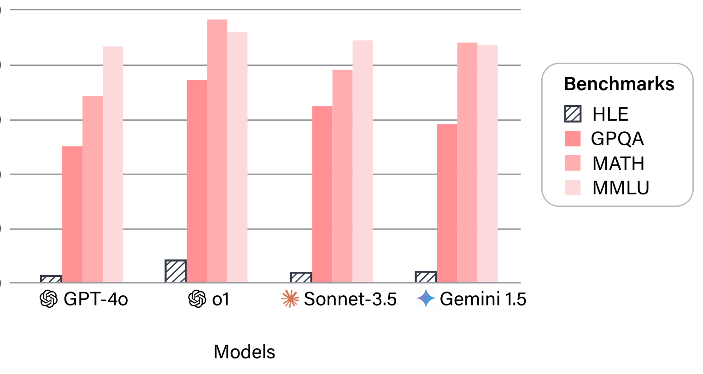
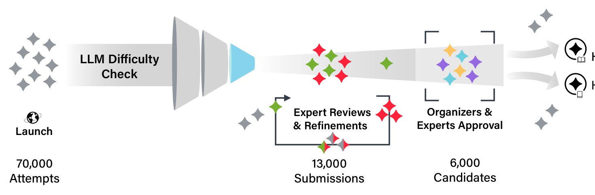

# Humanity's Last Exam - Analysis

## 1. Overview

이 논문은 대규모 언어 모델(LLM)의 능력을 측정하기 위한 기존 벤치마크들이 빠르게 포화되고 있는 문제를 해결하기 위해, 인류 지식의 최전선에 해당하는 극도로 어려운 폐쇄형 학술 벤치마크인 Humanity's Last Exam(HLE)을 제안한다. MMLU를 비롯한 기존 벤치마크에서 SOTA 모델들이 이미 90% 이상의 정확도를 달성하는 상황에서, AI 능력의 정밀한 측정이 더 이상 불가능해진 것이 핵심 동기이다.

HLE는 50개국 500개 이상 기관에 소속된 약 1,000명의 분야별 전문가로부터 수집된 2,500개의 질문으로 구성된다. 수학, 인문학, 자연과학 등 수십 개 분야를 포괄하며, 질문의 약 14%는 이미지 이해를 필요로 하는 멀티모달 문제이다. 24%는 객관식, 76%는 정답 일치형(exact-match) 형식이며, $500,000 상금풀을 통해 고품질 문제 제출을 유도했다. 모든 질문은 정밀하고, 모호하지 않으며, 인터넷 검색으로 빠르게 답을 구할 수 없도록 설계되었다.

질문의 난이도와 품질을 보장하기 위해 다단계 검토 프로세스를 채택했다. 제출 전 LLM 난이도 검증(7만 건 시도 중 1.3만 건이 전문가 리뷰로 전달), 그 후 대학원 수준 이상의 전문 리뷰어에 의한 2단계 인간 검토, 릴리즈 후 커뮤니티 피드백 기반 보정이 이루어졌다. 최종 전문가 의견 불일치율은 약 15.4%로 보고되었다.

최첨단 LLM들은 HLE에서 모두 낮은 정확도를 기록했다. 가장 높은 성능을 보인 O3-MINI(HIGH)도 13.4%에 불과했으며, 모든 모델이 70% 이상의 RMS 보정 오류를 보여 틀린 답에도 높은 확신을 표명하는 confabulation/hallucination 경향을 드러냈다. 이는 현재 AI 능력과 인류 전문가 수준 사이에 여전히 상당한 격차가 존재함을 보여준다. 저자들은 HLE가 폐쇄형 학술 벤치마크로서의 "마지막 시험"이 될 것으로 전망하면서도, 이것이 AGI나 자율적 연구 능력을 측정하는 것은 아님을 명확히 한다.

---

## 2. Core Section

### TL;DR

> 기존 벤치마크의 포화 문제를 해결하기 위해, 50개국 ~1,000명의 전문가가 만든 2,500개 극난이도 질문으로 구성된 멀티모달 벤치마크. 최고 모델(O3-MINI HIGH)도 13.4%의 정확도만 달성하여, 현 AI와 전문가 수준 간의 큰 격차를 정량적으로 보여준다.

-> 상세: [tldr.md](./2501.14249-details/tldr.md)

### Core Contributions

1. **Frontier-Level Benchmark**: 인류 전문 지식의 최전선에 해당하는 2,500개 질문 벤치마크 구축 -> AI 능력의 정밀한 상한선 측정
2. **Global Expert Curation**: 50개국 500+ 기관, ~1,000명 전문가의 글로벌 협력적 데이터 수집 -> 학제적 다양성 및 질문 품질 확보
3. **Multi-Stage Quality Assurance**: LLM 사전 검증 + 2단계 전문가 리뷰 + 커뮤니티 피드백의 다층적 품질 관리 파이프라인 -> 벤치마크 신뢰성 보장
4. **Calibration Analysis**: 정확도뿐 아니라 모델의 불확실성 인식(calibration) 측정 -> 모델이 모르는 것을 모른다는 사실을 밝혀 hallucination 문제 정량화

-> 상세: [contributions.md](./2501.14249-details/contributions.md)

### Key vs Non-Key Sections

| Priority | Sections | Reason |
|----------|----------|--------|
| ⭐⭐⭐ Must Read | Section 3 (Dataset), Section 4.2 (Results) | 벤치마크의 핵심 설계와 모델 성능 결과 |
| ⭐⭐ Important | Section 1 (Introduction), Section 5 (Discussion) | 동기 및 향후 전망 이해 |
| ⭐ Reference | Section 2 (Related Work), Appendix B (Dataset details) | 맥락 파악 및 세부 정보 |
| Skip | Appendix A (Authors/Affiliations), Appendix C.5-C.7 | 저자 목록, 모델 버전, 리뷰 세부사항 |

-> 상세: [key-sections.md](./2501.14249-details/key-sections.md)

---

## 3. Paper Type

**Type**: Benchmark

| Aspect | Value |
|--------|-------|
| **Evaluation Target** | Frontier LLM의 전문가 수준 학술 지식 및 추론 능력 |
| **Task Count** | 2,500 questions (public + private split) |
| **Domains** | 100+ subjects: Math (41%), Humanities, Natural Sciences, CS/AI 등 |
| **Main Metrics** | Accuracy (%), RMS Calibration Error (%) |

-> 상세 방법론: [methodology.md](./2501.14249-details/methodology.md)

---

## 4. Visual Analysis

### Key Figures

#### Figure 1: Benchmark Saturation Comparison

**구성 요소**: 기존 벤치마크(MMLU, GPQA 등)의 포화 추이와 HLE의 낮은 정확도를 대비하는 바 차트.

**핵심 통찰**: MMLU에서 90%+ 성능을 보이는 모델들이 HLE에서는 3-13% 수준에 머물러, HLE의 차별적 난이도를 시각적으로 입증한다.

**Source**: [Figure 1](./2501.14249.md#figure-1)

#### Figure 3: Dataset Taxonomy

**구성 요소**: 100+ 주제를 상위 카테고리로 그룹화한 버블 다이어그램. 수학이 41%로 가장 큰 비중.

**핵심 통찰**: 수학 중심이지만, 생물/의학, 물리, CS/AI, 인문학, 화학, 공학 등 다양한 분야를 포괄하여 범용 학술 벤치마크 성격을 유지한다.

**Source**: [Figure 3](./2501.14249.md#figure-3)

#### Figure 4: Dataset Creation Pipeline

**구성 요소**: 질문 제출 -> LLM 난이도 검증 -> 전문가 리뷰 1단계 -> 전문가 리뷰 2단계 -> 최종 데이터셋의 파이프라인.

**핵심 통찰**: 7만 건 LLM 시도 중 1.3만 건만 전문가 리뷰로 전달되어, 사전 필터링의 효과를 보여준다.

**Source**: [Figure 4](./2501.14249.md#figure-4)

---

### Tables Interpretation

#### Table 1: Main Benchmark Results

| Model | Accuracy (%) | Calibration Error (%) |
|-------|-------------|----------------------|
| O3-MINI (HIGH)* | **13.4** | 80 |
| DEEPSEEK-R1* | 8.5 | **73** |
| O1 | 8.0 | 83 |
| GEMINI 2.0 FLASH THINKING | 6.6 | 82 |
| GEMINI 1.5 PRO | 4.6 | 88 |
| CLAUDE 3.5 SONNET | 4.1 | 84 |
| GROK 2 | 3.0 | 87 |
| GPT-4O | 2.7 | 89 |

*\* Text-only subset으로 평가*

**주요 발견**:
1. **최고 성능이 13.4%**: O3-MINI(HIGH)도 극히 낮은 정확도로, 벤치마크의 난이도를 입증
2. **Calibration 실패**: 모든 모델이 73-89%의 높은 보정 오류를 보여, 틀린 답에도 높은 확신을 표현
3. **Reasoning 모델 우위**: O3-MINI, DeepSeek-R1, O1 등 추론 모델이 비추론 모델 대비 우수하나, 더 많은 토큰을 소비

**실무적 의미**: 현재 어떤 LLM도 전문가 수준의 학술 질문에서 신뢰할 만한 성능을 보이지 못한다. 특히 calibration 부족은 고위험 도메인에서의 LLM 활용에 대한 경각심을 일으킨다.

**Source**: [Table 1](./2501.14249.md#table-1)

---

## 5. Critique & Related Works

### Expert Critique

#### Strengths
1. **전례 없는 규모의 전문가 참여**: ~1,000명의 글로벌 전문가가 참여한 크라우드소싱으로, 학술 벤치마크의 다양성과 난이도를 극대화
2. **체계적인 품질 관리**: LLM 사전 필터링 + 2단계 전문가 리뷰 + 커뮤니티 피드백의 다층적 검증으로 데이터 품질 확보
3. **Calibration 분석 포함**: 단순 정확도를 넘어 모델의 자기 인식 능력까지 측정하여, hallucination 문제를 정량화

#### Limitations
1. **높은 전문가 의견 불일치**: 15.4% 불일치율(생물/화학/건강 분야 18%)은 상당하며, FutureHouse [47]는 화학/생물 답변의 약 30%에 오류 가능성을 지적
2. **수학 편향**: 전체 질문의 41%가 수학으로, 범용 학술 벤치마크로서의 균형에 의문
3. **적대적 필터링 한계**: LLM이 틀린 문제만 채택하는 방식은 일시적 난이도를 확보하지만, 모델 업데이트에 따라 빠르게 무력화될 수 있음

#### Adoption Status
- [x] Widely used (주요 AI 연구 기관에서 평가 기준으로 채택)
- [x] Easy to set up (공개 데이터셋, lastexam.ai에서 접근 가능)
- [x] Clear leaderboard
- [x] Active maintenance (HLE-Rolling 도입 예정)

#### 2026 Perspective
- **Still Valid**: 2026년 현재에도 대부분의 모델이 50% 미만 정확도로, 벤치마크의 유효성 지속
- **Outdated**: 평가 모델 목록이 2025년 1월 기준으로, Claude 4.x, GPT-5 등 최신 모델 미포함
- **Missing**: Open-ended 추론, 에이전트 기반 도구 사용, 다국어 지원 등 최근 LLM 평가 트렌드 미반영

### Related Works

1. **GPQA** (Rein et al., 2023) - 대학원 수준 Google-proof Q&A 벤치마크 - [arXiv:2311.12022](https://arxiv.org/abs/2311.12022)
2. **FrontierMath** (Glazer et al., 2024) - AI 고급 수학 추론 평가 벤치마크 - [arXiv:2411.04872](https://arxiv.org/abs/2411.04872)
3. **MMLU-Pro** (Wang et al., 2024) - MMLU 강화 버전, 더 견고한 멀티태스크 평가 - [arXiv:2406.01574](https://arxiv.org/abs/2406.01574)
4. **OlympiadBench** (He et al., 2024) - 올림피아드 수준 이중언어 멀티모달 과학 문제 - [arXiv:2402.14008](https://arxiv.org/abs/2402.14008)
5. **RE-Bench** (Wijk et al., 2024) - 인간 전문가 대비 AI R&D 능력 평가 - [arXiv:2411.15114](https://arxiv.org/abs/2411.15114)

---

## Navigation

- **Source**: [원본 논문](./2501.14249.md)
- **Details**:
  - [TL;DR 상세](./2501.14249-details/tldr.md)
  - [Contributions 상세](./2501.14249-details/contributions.md)
  - [Key Sections 상세](./2501.14249-details/key-sections.md)
  - [Methodology 상세](./2501.14249-details/methodology.md)
