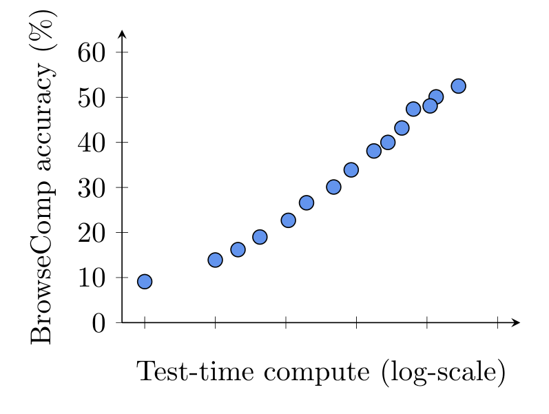
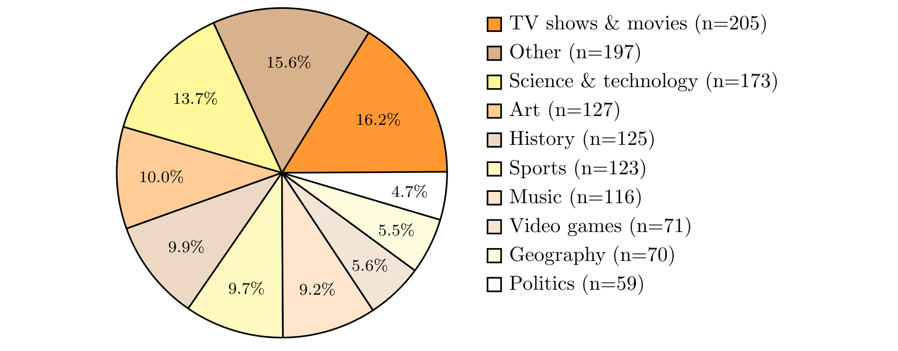
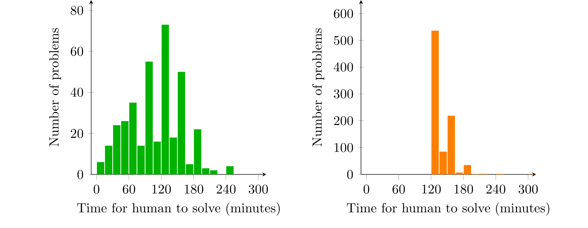
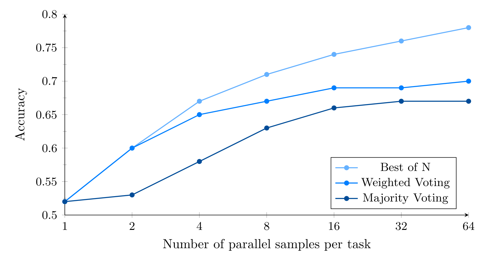
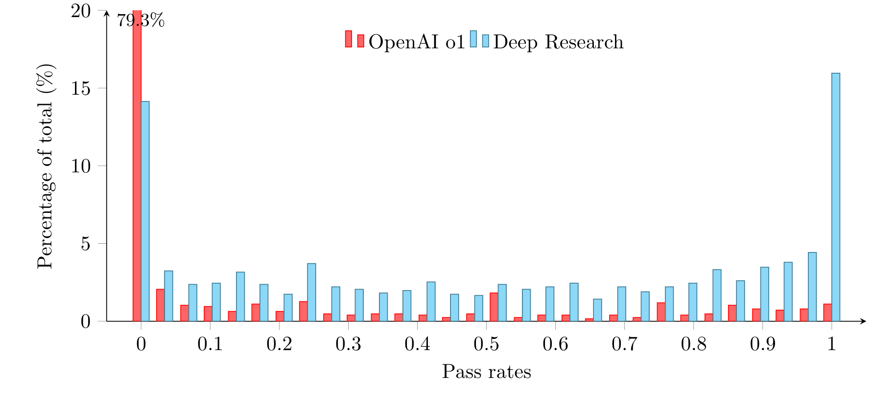

# BrowseComp: A Simple Yet Challenging Benchmark for Browsing Agents - Analysis

## 1. Overview

인터넷에서 정보를 찾는 것은 AI 에이전트의 핵심 역량 중 하나이지만, 기존 정보 검색 벤치마크들(TriviaQA, HotpotQA, FEVER 등)은 대부분 사람이 10분 이내에 검색으로 찾을 수 있는 수준의 질문들로 구성되어 있어 최신 언어 모델에 의해 포화(saturated) 상태에 이르렀다. OpenAI는 이 한계를 극복하기 위해 **브라우징 에이전트의 끈기와 창의성을 측정하는** 새로운 벤치마크 BrowseComp를 제안한다.

BrowseComp는 1,266개의 질문으로 구성되며, 각 질문은 "inverted question" 설계 원칙을 따른다: **답을 검증하기는 쉽지만 찾기는 매우 어렵도록** 설계되었다. 훈련된 인간 작업자들이 직접 질문을 생성하되, ChatGPT(with/without browsing), o1, 초기 Deep Research 모델이 모두 풀지 못하는 수준의 난이도를 확보했다. 답변은 짧은 문자열로 구성되어 AI 모델 기반 자동 채점이 가능하다.

평가 결과, GPT-4o(0.6%), GPT-4.5(0.9%)는 거의 풀지 못했고, 브라우징이 추가된 GPT-4o도 1.9%에 그쳤다. 추론 능력이 강한 OpenAI o1은 9.9%를 달성했으나, 지속적 웹 브라우징을 위해 특별히 훈련된 Deep Research만이 51.5%로 유일하게 의미 있는 성능을 보였다. 또한 test-time compute 증가에 따라 성능이 매끄럽게 스케일링되며, 64회 병렬 샘플링 + best-of-N 전략으로 최대 25% 추가 향상이 가능함을 보여주었다.

이 벤치마크의 핵심 가치는 **프로그래밍 대회가 코딩 에이전트의 불완전하지만 유용한 프록시인 것처럼, BrowseComp가 브라우징 에이전트의 핵심 역량(끈기, 창의적 검색, 사실성 추론)을 측정하는 유용한 프록시**라는 점이다. 장문 생성이나 모호성 해소 같은 실제 사용자 질의 분포의 과제는 측정하지 않지만, 정보 탐색의 핵심 능력을 집중적으로 평가한다.

---

## 2. Core Section

### TL;DR

> BrowseComp는 웹 브라우징 에이전트의 끈기와 창의적 검색 능력을 측정하기 위한 1,266개 질문 벤치마크로, "찾기는 어렵지만 검증은 쉬운" inverted question 설계를 통해 기존 모델(GPT-4o: 0.6%)은 거의 풀지 못하지만 Deep Research(51.5%)만이 의미 있는 성능을 달성하는 높은 난이도를 제공한다.

-> 상세: [tldr.md](./2504.12516-details/tldr.md)

### Core Contributions

1. **Inverted Question 설계 방법론**: 답을 먼저 정하고 질문을 역으로 구성하여 "검증은 쉽지만 탐색은 어려운" 문제를 체계적으로 생성 -> 브라우징 에이전트 평가에 최적화된 새로운 벤치마크 설계 패러다임
2. **Test-time Compute Scaling 실증**: 브라우징 에이전트에서도 추론 시간 컴퓨트 증가에 따른 성능 스케일링이 매끄럽게 이루어짐을 최초로 실증 -> 에이전트 시대의 scaling law 확장
3. **Aggregation Strategy 분석**: Best-of-N, majority voting, weighted voting 등 다중 시도 전략의 효과를 정량적으로 분석하여 15-25% 성능 향상을 달성 -> 브라우징 에이전트의 실전 배포 전략에 대한 인사이트
4. **Human Baseline 구축**: 경험 있는 인간 작업자의 해결률(29.2%)과 시간 분포를 체계적으로 수집 -> 벤치마크 난이도의 객관적 캘리브레이션

-> 상세: [contributions.md](./2504.12516-details/contributions.md)

### Key vs Non-Key Sections

| Priority | Sections | Reason |
|----------|----------|--------|
| ⭐⭐⭐ Must Read | Section 1 (Introduction), Section 2.1 (Criteria) | 벤치마크 설계 철학과 inverted question 개념 이해 필수 |
| ⭐⭐⭐ Must Read | Section 4.1, 4.3, 4.4 (Model Evaluation, Scaling, Aggregation) | 핵심 실험 결과와 scaling 분석 |
| ⭐⭐ Important | Section 3 (Human Performance) | 난이도 캘리브레이션, 인간 vs AI 비교 |
| ⭐⭐ Important | Section 4.5 (Pass Rate Distribution) | 문제별 난이도 분석 |
| ⭐ Reference | Section 2.2-2.4 (Diversity, Grading, Exercises) | 데이터셋 세부사항 |
| Skip | Appendix A, B | 프롬프트 텍스트, 구현 시에만 필요 |

-> 상세: [key-sections.md](./2504.12516-details/key-sections.md)

---

## 3. Paper Type

**Type**: Benchmark

| Aspect | Value |
|--------|-------|
| **Evaluation Target** | 웹 브라우징 에이전트의 정보 탐색 능력 |
| **Task Count** | 1,266 questions |
| **Domains** | 10개 토픽 (Science & Technology, History, Entertainment 등) |
| **Main Metrics** | Accuracy (AI grader), Calibration Error |
| **Data Source** | 인간 작업자 직접 생성 (inverted question 방식) |
| **Availability** | [github.com/openai/simple-evals](https://github.com/openai/simple-evals) |

-> 상세 방법론: [methodology.md](./2504.12516-details/methodology.md)

---

## 4. Visual Analysis

### Key Figures

#### Figure 1: BrowseComp Performance vs. Test-Time Compute

**구성 요소**:
- X축: Test-time compute (log scale, 상대적 단위)
- Y축: BrowseComp accuracy (%)
- 각 점: 서로 다른 browsing effort의 full evaluation run

**핵심 통찰**:
- 성능이 test-time compute에 대해 **매끄럽게 스케일링**됨 (로그 스케일에서 근사적 선형)
- 약 0-60% 범위에서 스케일링이 관찰되며, 아직 포화 징후가 보이지 않음
- o1의 추론 스케일링과 유사한 패턴이 브라우징 에이전트에서도 성립함을 실증

**Source**: [Section 4.3](./2504.12516.md#43-test-time-compute-scaling)

---

#### Figure 2: Topic Distribution

**구성 요소**:
- 10개 카테고리의 파이 차트
- Science & Technology, History, Entertainment, Sports 등

**핵심 통찰**:
- 데이터셋이 다양한 도메인에 걸쳐 분포되어 있어 특정 분야 편향이 적음
- 작업자의 개인 관심사 기반 생성이 자연스러운 다양성을 확보하는 데 효과적이었음

**Source**: [Section 2.2](./2504.12516.md#22-dataset-diversity)

---

#### Figure 3: Human Solve Times

**구성 요소**:
- 좌측: 해결된 문제의 시간 분포 (히스토그램)
- 우측: 포기한 문제의 시간 분포 (히스토그램)

**핵심 통찰**:
- 해결된 문제도 상당수가 2-3시간 소요 -> 매우 높은 난이도
- 포기 시점은 규정대로 약 2시간에 집중 -> 제한 시간 내 해결 불가능한 문제가 다수
- 전체 해결률 29.2%는 벤치마크의 도전적 성격을 객관적으로 입증

**Source**: [Section 3](./2504.12516.md#3-human-performance-on-browsecomp)

---

#### Figure 4: Deep Research Parallel Sampling

**구성 요소**:
- X축: Number of samples (1-64)
- Y축: Accuracy
- 3개 라인: Majority voting, Weighted voting, Best-of-N

**핵심 통찰**:
- Best-of-N이 일관되게 최고 성능 -> 모델이 정답일 때 높은 confidence를 부여하는 능력 보유
- 64 샘플에서 단일 시도 대비 15-25% 향상
- Weighted voting이 majority보다 약간 우수 -> confidence score가 (절대적 캘리브레이션은 부족하지만) 상대적 신호로는 유의미

**Source**: [Section 4.4](./2504.12516.md#44-aggregation-strategies-leveraging-additional-compute)

---

#### Figure 5: Pass Rate Distribution

**구성 요소**:
- Grouped bar chart: OpenAI o1 vs Deep Research
- X축: Pass rate bins (0%, 0-25%, ... 100%)
- Y축: Percentage of tasks

**핵심 통찰**:
- Deep Research: 16%의 문제를 100% 해결하지만, 14%는 전혀 풀지 못함 -> 문제 난이도의 높은 분산
- o1: 대부분의 문제에서 0% pass rate -> 브라우징 없이는 근본적 한계
- 0% pass rate 문제에 대한 follow-up에서, 정답을 알려주면 대부분 웹 증거를 찾을 수 있었음 -> 문제가 "불가능"이 아니라 "전략적으로 극도로 어려운" 수준

**Source**: [Section 4.5](./2504.12516.md#45-distribution-of-pass-rates)

---

### Tables Interpretation

#### Table 3: Model Performance

| Model | Accuracy (%) | Calibration Error (%) |
|-------|-------------:|----------------------:|
| GPT-4o | 0.6 | 69 |
| GPT-4o w/ browsing | 1.9 | 82 |
| GPT-4.5 | 0.9 | 68 |
| OpenAI o1 | 9.9 | 65 |
| Deep Research | **51.5** | 91 |

**주요 발견**:
1. **비브라우징 모델의 한계**: GPT-4o/4.5는 거의 0%에 수렴 -> 내부 지식만으로는 BrowseComp가 요구하는 수준의 정보 탐색이 불가능
2. **추론 vs 브라우징의 시너지**: o1의 9.9%는 순수 추론만으로도 일부 문제 해결 가능함을 시사하지만, Deep Research의 51.5%는 브라우징 + 추론의 결합이 핵심
3. **캘리브레이션 역설**: 브라우징 도구가 있는 모델일수록 calibration error가 높음 (Deep Research: 91%) -> 웹 검색이 오히려 잘못된 확신을 강화할 수 있음

**실무적 의미**: 단순 검색 도구 추가는 불충분하며, 전략적 탐색 + 백트래킹 + 정보 종합 능력이 필수

**Source**: [Table 3](./2504.12516.md#41-performance-of-openai-models)

#### Table 2: Human Performance

| Metric | Result |
|--------|--------|
| Human gave up (2hr+) | 70.8% |
| Solved by human | 29.2% |
| Answer agreement rate | 86.4% |

**주요 발견**:
1. 경험 있는 인간도 70.8%를 포기 -> 벤치마크 난이도가 매우 높음
2. 인간 해결률(29.2%) < Deep Research(51.5%) -> 이 특정 태스크에서 AI가 인간을 초과
3. 답변 일치율 86.4% -> 13.6%의 불일치는 복수 정답 가능성 또는 채점 기준의 한계를 시사

**Source**: [Table 2](./2504.12516.md#3-human-performance-on-browsecomp)

---

## 5. Critique & Related Works

### Expert Critique

#### Strengths
1. **탁월한 설계 원칙**: "Easy to verify, hard to solve"라는 inverted question 패러다임은 벤치마크 설계의 핵심 과제(난이도 vs 평가 용이성 trade-off)를 우아하게 해결한다. 이 원칙은 다른 도메인의 벤치마크 설계에도 적용 가능하다.
2. **Strong scaling evidence**: Test-time compute scaling이 브라우징 에이전트에서도 성립한다는 실증은 학술적으로 매우 가치 있으며, 향후 에이전트 개발 방향에 중요한 시사점을 제공한다.
3. **실용성**: 짧은 답변 + AI grader 조합은 대규모 자동 평가를 가능하게 하며, GitHub 공개를 통해 재현성과 접근성이 높다.
4. **체계적 캘리브레이션 분석**: 단순 정확도를 넘어 confidence calibration을 함께 분석한 점은 실전 배포에서 중요한 신뢰성 차원을 제공한다.

#### Limitations
1. **OpenAI 모델 중심 평가**: GPT-4o, o1, Deep Research만 평가하여, Claude, Gemini, Grok 등 경쟁 모델의 성능이 빠져 있다. 벤치마크의 범용성 주장에 비해 평가 범위가 제한적이다.
2. **복수 정답 문제**: 저자들도 인정하듯, inverted question 특성상 다른 유효 답변이 존재할 수 있으며 이를 완전히 배제할 방법이 없다. Human agreement rate 86.4%가 이 문제를 반영한다.
3. **Data contamination 우려**: Deep Research가 BrowseComp 태스크에 특화 훈련되었다는 각주([^1])는 벤치마크 결과의 공정성에 의문을 제기한다. 학습 데이터와의 오염 가능성도 존재한다.
4. **좁은 평가 범위**: 짧은 답변만 평가하므로 실제 브라우징 에이전트에 필요한 장문 종합, 출처 인용의 정확성, 모호한 질의 처리 등 핵심 역량은 측정하지 못한다.
5. **시간 경과에 따른 유효성**: 웹 콘텐츠는 지속적으로 변하므로 일부 질문의 정답이 시간이 지남에 따라 변경되거나 무효화될 수 있다.

#### Adoption Status
- [x] Widely used (OpenAI 공식 벤치마크, simple-evals에 포함)
- [x] Easy to set up (짧은 답변, AI grader, GitHub 공개)
- [ ] Clear leaderboard (공식 리더보드 없음)
- [x] Active maintenance (OpenAI simple-evals 저장소에서 관리)

#### 2026 Perspective
- **Still Valid**: 브라우징 에이전트 평가의 핵심 벤치마크로서 여전히 유효. 2026년 현재에도 대부분의 모델이 높은 점수를 달성하기 어려운 난이도를 유지.
- **Outdated**: 2025년 4월 기준 모델만 평가. 이후 출시된 Claude 4.x, Gemini 2.x, GPT-5.x 등의 브라우징 에이전트 성능은 미반영.
- **Missing**: 멀티모달 브라우징(이미지/비디오/인터랙티브 웹 요소 처리), 다국어 브라우징, 실시간 정보 변화 대응 능력 등 2025-2026년에 급속히 발전한 영역이 미포함. 또한 Anthropic의 Computer Use, Google의 Mariner 등 실제 브라우저 조작 에이전트에 대한 평가 프레임워크가 부재.

### Related Works

1. **SimpleQA** ([Wei et al., 2024](https://arxiv.org/abs/2410.07338)) - BrowseComp의 직접적 전신. 사실 기반 QA 벤치마크로, BrowseComp는 SimpleQA의 설계 원칙을 "극한 난이도"로 확장한 것. 두 벤치마크의 설계 철학 비교가 유용.
2. **GAIA** ([Mialon et al., 2023](https://arxiv.org/abs/2311.12983)) - 범용 AI 어시스턴트 벤치마크. 웹 브라우징을 포함한 다양한 도구 사용을 평가하지만, BrowseComp처럼 브라우징 난이도에 특화되지는 않음. Level 3 문제와의 난이도 비교가 흥미로움.
3. **WebArena** ([Zhou et al., 2024](https://arxiv.org/abs/2307.13854)) - 실제 웹사이트 환경에서의 에이전트 태스크 완수를 평가. BrowseComp가 "정보 탐색"에 집중한다면, WebArena는 "웹 조작"에 집중. 상호 보완적.
4. **Humanity's Last Exam** ([Phan et al., 2025](https://arxiv.org/abs/2501.14249)) - BrowseComp가 채점 프롬프트를 차용한 극한 난이도 벤치마크. 전문가 수준 지식을 요구하는 점에서 BrowseComp와 난이도 철학이 유사.
5. **BEARCUBS** ([Song et al., 2025](https://arxiv.org/abs/2503.01227)) - 컴퓨터 사용 웹 에이전트를 위한 벤치마크. BrowseComp가 정보 검색에 집중한다면 BEARCUBS는 웹 인터랙션 전반을 다루며, 브라우징 에이전트 평가의 또 다른 차원을 제공.

---

## Navigation

- **Source**: [원본 논문](./2504.12516.md)
- **Details**:
  - [TL;DR 상세](./2504.12516-details/tldr.md)
  - [Contributions 상세](./2504.12516-details/contributions.md)
  - [Key Sections 상세](./2504.12516-details/key-sections.md)
  - [Methodology 상세](./2504.12516-details/methodology.md)
