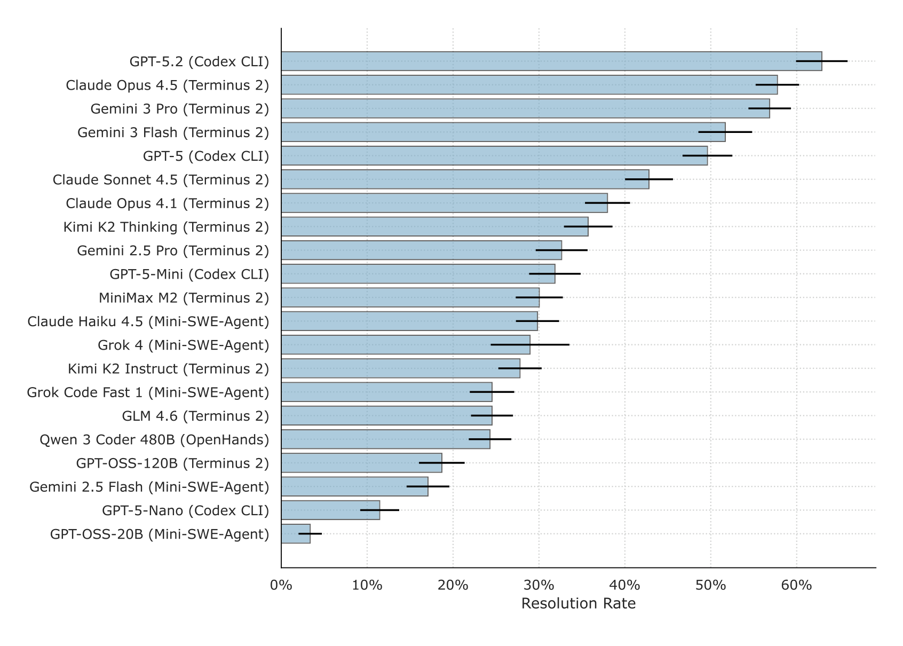
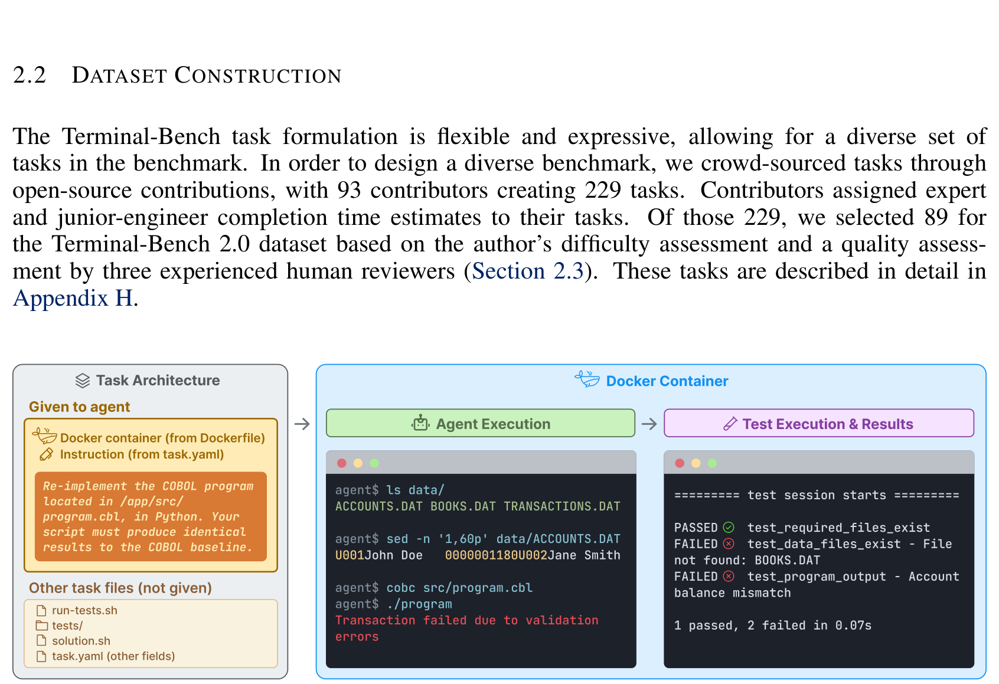
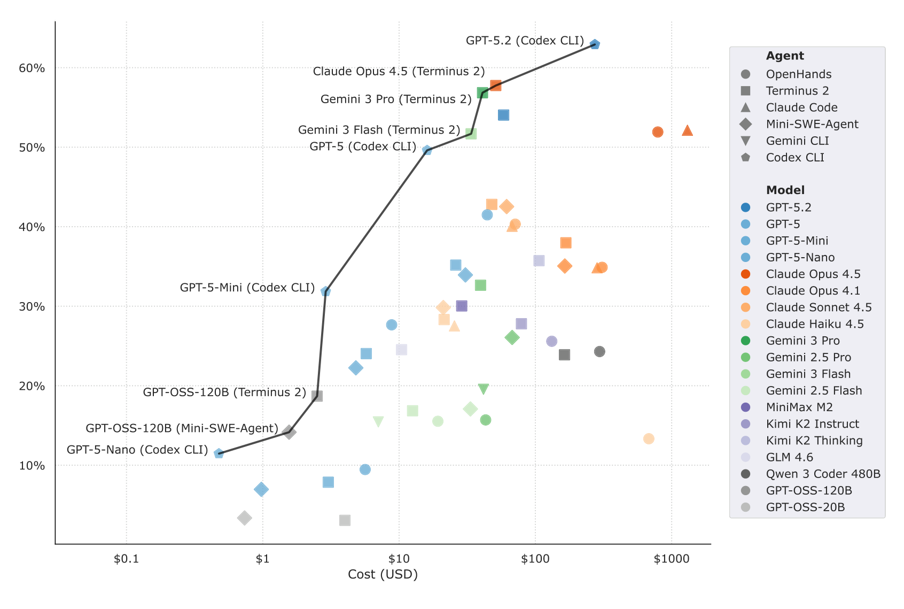
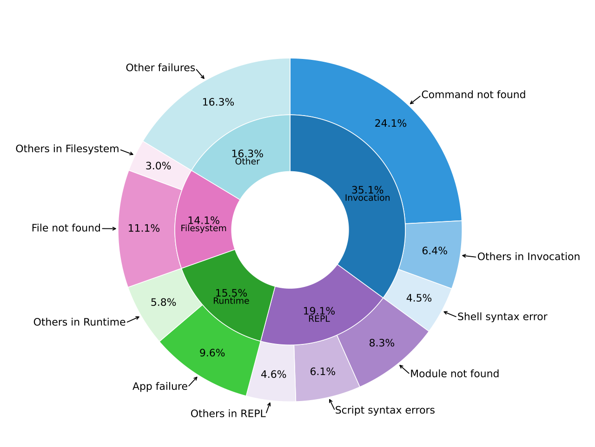

# Terminal-Bench: Benchmarking Agents on Hard, Realistic Tasks in CLI - Analysis

## 1. Overview

This paper introduces Terminal-Bench 2.0, a benchmark of 89 carefully curated, challenging tasks designed to evaluate AI agents operating in command-line interface (CLI) environments. The benchmark targets a critical gap: existing agent benchmarks either focus on narrow domains (e.g., SWE-Bench on GitHub issues) or lack sufficient difficulty to meaningfully differentiate frontier models. Terminal-Bench addresses this by sourcing diverse, realistic tasks from expert practitioners across software engineering, scientific computing, cybersecurity, machine learning, and more.

Each task is containerized in Docker and consists of a natural language instruction, a pre-built environment, a set of verification tests, and a human-written oracle solution. The tasks were crowd-sourced from 93 contributors who submitted 229 tasks, of which 89 passed a rigorous three-round manual audit process totaling approximately three reviewer-hours per task. Task difficulty ranges from under one hour to nearly 24 hours for an expert (and up to 10 days for a junior engineer), reflecting the kind of long-horizon, high-skill work that professionals perform daily.

The authors evaluate 6 agents (Claude Code, Codex CLI, Gemini CLI, OpenHands, Mini-SWE-Agent, and their own Terminus 2 scaffold) across 16 frontier models, running 32,155 trials. The best-performing combination, Codex CLI with GPT-5.2, achieves only 63% resolution rate. Smaller and open-weight models score around 15-36%. The paper provides both trajectory-level and command-level error analyses, revealing that execution failures dominate across models, with "command not found" being the single most frequent error type (24.1%).

The benchmark's emphasis on outcome-driven evaluation, diverse real-world tasks, and rigorous quality control sets it apart from existing benchmarks. The authors also introduce Harbor, a framework for building and running agent evaluations at scale, and demonstrate that Terminal-Bench can serve as an adapter layer for 26 other existing benchmarks. Model performance has nearly doubled in 8 months, suggesting the benchmark may saturate within a year, but the framework is designed for extensibility.

---

## 2. Core Section

### TL;DR

> Terminal-Bench 2.0 is a hard, diverse benchmark of 89 crowd-sourced CLI tasks (from OCaml GC debugging to COBOL-to-Python conversion) where even the best frontier model+agent combination (Codex CLI + GPT-5.2) resolves only 63% of tasks, with a detailed error taxonomy showing execution failures as the dominant bottleneck.

-> 상세: [tldr.md](./2601.11868-details/tldr.md)

### Core Contributions

1. **Terminal-Bench Framework & Dataset**: A containerized, outcome-driven evaluation framework with 89 expert-verified tasks spanning 10+ domains, each with Docker environment, tests, and oracle solution -> First benchmark targeting realistic, diverse, long-horizon terminal tasks beyond software engineering
2. **Comprehensive Multi-Agent Evaluation**: 32,155 trials across 6 agents and 16 models, showing model selection matters more than agent scaffold, and that frontier models plateau at ~63% -> Establishes clear baselines and reveals the performance ceiling for current AI agents
3. **Dual-Level Error Taxonomy**: Both trajectory-level (adapted from MAST) and command-level failure analysis with LLM-as-judge validation (90% and 82% human agreement respectively) -> Provides actionable insights for model and agent developers on where to focus improvement
4. **Harbor Evaluation Framework + Adapters**: A scalable evaluation harness that standardizes 26 existing benchmarks into a unified format -> Enables cross-benchmark comparison and reduces fragmented evaluation infrastructure

-> 상세: [contributions.md](./2601.11868-details/contributions.md)

### Key vs Non-Key Sections

| Priority | Sections | Reason |
|----------|----------|--------|
| Must Read | Section 2 (Terminal-Bench), Section 4 (Results) | Task formulation, dataset construction, and main findings |
| Must Read | Section 4.4-4.5 (Error Analysis) | Novel failure taxonomy with actionable insights |
| Important | Section 3 (Experimental Setup), Section 2.3 (Verification) | Understanding evaluation methodology and quality guarantees |
| Reference | Section 5 (Limitations), Section 6 (Related Work) | Context and caveats |
| Reference | Appendix B (Quality Control) | Detailed verification procedures |
| Deep Dive | Appendix C (Failure Taxonomy Examples) | Concrete examples of each failure mode |
| Skip | Appendix E.1 (Per-model Sankey diagrams) | Repetitive per-model breakdowns |

-> 상세: [key-sections.md](./2601.11868-details/key-sections.md)

---

## 3. Paper Type

**Type**: Benchmark

| Aspect | Value |
|--------|-------|
| **Evaluation Target** | AI agents in terminal/CLI environments |
| **Task Count** | 89 (from 229 submitted by 93 contributors) |
| **Domains** | Software Engineering, ML, Cybersecurity, Scientific Computing, System Admin, Video Processing, etc. |
| **Main Metrics** | Task resolution rate (binary pass/fail via test suites) |
| **Agent Scaffolds** | 6 (Claude Code, Codex CLI, Gemini CLI, OpenHands, Mini-SWE-Agent, Terminus 2) |
| **Models Evaluated** | 16 (GPT-5.2, Claude Opus 4.5, Gemini 3 Pro, Grok 4, open-weight models, etc.) |
| **Total Trials** | 32,155 |

-> 상세 방법론: [methodology.md](./2601.11868-details/methodology.md)

---

## 4. Visual Analysis

### Key Figures

#### Figure 1: Task Resolution Rate per Model

**What it shows**: Bar chart with 95% confidence intervals showing the highest resolution rate per model across all agent scaffolds.

**핵심 통찰**:
- GPT-5.2 with Codex CLI leads at 63%, followed by Claude Opus 4.5 (58%) and Gemini 3 Pro (57%)
- Proprietary models dominate the top 13 positions
- Open-weight models plateau around 36% (Kimi K2 Thinking with Terminus 2)
- The gap between top proprietary and best open-weight is ~27 percentage points
- Wide confidence intervals (especially for mid-tier models) suggest high task-level variance

**Source**: [Section 4](./2601.11868.md#4-results)

---

#### Figure 2: Task Composition Diagram

**What it shows**: The anatomy of a Terminal-Bench task: instruction, Dockerfile, tests, and oracle solution.

**핵심 통찰**:
- Outcome-driven design: tests verify final container state, not agent commands
- Docker containerization ensures reproducibility and isolation
- Oracle solutions serve as solvability proof, not scoring rubric

**Source**: [Section 2.1](./2601.11868.md#21-task-formulation)

---

#### Figure 5: Pareto Frontier (Performance vs Cost)

**What it shows**: Cost-performance tradeoff on log scale across model-agent combinations.

**핵심 통찰**:
- Running Terminal-Bench costs $1 to $100+ depending on model pricing
- Several models achieve similar performance at vastly different costs
- Open-weight models via Together.AI are cost-competitive but performance-limited

**Source**: [Section 4.1](./2601.11868.md#41-cost-and-model-performance)

---

#### Figure 9: Command Failure Taxonomy (Sankey Diagram)

**What it shows**: Sankey diagram mapping 3,800 command failures across all models to the failure taxonomy.

**핵심 통찰**:
- "Command not found on PATH" is the #1 failure (24.1%) - agents fail to install or locate executables
- "Application-level failure" from running executables is #2 (9.6%)
- Invocation & CLI errors dominate, suggesting agents struggle with environment setup
- Filesystem and permission errors are a significant secondary category

**Source**: [Section 4.5](./2601.11868.md#45-command-level-error-analysis)

---

### Tables Interpretation

#### Table 1: Task Completion Times

| | < 1 hour | 1h - 24h | 24h - 1 week | > 1 week |
|--------|----------|----------|-------------|----------|
| Expert | 36 (48.6%) | 35 (47.3%) | 3 (4.1%) | 0 (0.0%) |
| Junior | 6 (8.1%) | 53 (71.6%) | 12 (16.2%) | 3 (4.1%) |

**주요 발견**:
1. Nearly half the tasks take an expert under 1 hour, yet frontier models still fail 37%+ of tasks
2. The 5.7x difficulty ratio (junior vs expert median) reflects deep domain knowledge requirements
3. Three tasks exceed 1 week for a junior engineer, representing extreme long-horizon challenges

**실무적 의미**: The benchmark's difficulty is calibrated to professional work - these aren't toy problems but tasks with real economic value.

**Source**: [Section 2.4](./2601.11868.md#24-composition)

---

## 5. Critique & Related Works

### Expert Critique

#### Strengths
1. **Rigorous Quality Control**: ~3 reviewer-hours per task, adversarial exploit agent, LLM-backed checking tools, and canary strings for contamination detection. Scores 0.896 on ABC checklist (2nd among all benchmarks)
2. **Genuine Diversity**: Tasks span 10+ domains beyond software engineering (ML, cybersecurity, video processing, COBOL, OCaml GC), reflecting real professional workflows rather than synthetic problems
3. **Dual-Level Error Analysis**: Both trajectory-level (MAST-adapted) and command-level failure taxonomies provide actionable improvement directions at different granularities
4. **Infrastructure Contribution**: Harbor framework + 26 benchmark adapters is a significant ecosystem contribution that benefits the broader evaluation community
5. **Honest Assessment of Limitations**: Authors acknowledge potential for data contamination, internet access risks, and benchmark saturation timeline

#### Limitations
1. **Small Dataset Size (n=89)**: While each task is high-quality, the small size limits statistical power for fine-grained category-level analysis and increases sensitivity to individual task quirks
2. **Crowd-Source Bias**: Tasks from 93 contributors skew toward what contributors find interesting/challenging, not necessarily what's economically important or representative of real workloads
3. **Internet Access Variability**: Allowing agents internet access introduces non-reproducibility (API changes, package version drift) that containerization alone cannot fully address
4. **Single-Metric Evaluation**: Binary pass/fail misses partial progress - an agent that completes 90% of a task gets the same score as one that fails immediately
5. **No Private Test Set**: All tasks are public, making training contamination a real concern as the benchmark gains popularity

#### Adoption Status
- [x] Active maintenance (tbench.ai leaderboard)
- [x] Clear leaderboard
- [x] Easy to set up (Harbor CLI: `harbor run -d terminal-bench@2.0`)
- [ ] Widely used (new benchmark, January 2026)

#### 2026 Perspective
- **Still Valid**: The benchmark represents genuinely hard tasks that current frontier models cannot reliably solve. The error taxonomy is immediately useful for agent developers
- **Saturation Risk**: Performance nearly doubled in 8 months (Gemini 2.5 Pro to GPT-5.2). At this pace, the current 89-task set may saturate by late 2026
- **Missing**: No multimodal tasks (GUI, images), no multi-agent collaboration scenarios, no evaluation of agent safety/alignment in terminal environments

### Related Works

1. **SWE-Bench** ([Jimenez et al., 2024](https://arxiv.org/abs/2310.06770)) - The dominant software engineering benchmark; Terminal-Bench differentiates by going beyond GitHub issues to diverse CLI tasks
2. **OSWorld** ([Xie et al., 2024](https://openreview.net/forum?id=tN61DTr4Ed)) - Benchmarks multimodal agents in real OS environments; complementary to Terminal-Bench's CLI-only focus
3. **MLGym-Bench** ([Nathani et al., 2025](https://openreview.net/forum?id=ryTr83DxRq)) - Evaluates ML research agents; shares Terminal-Bench's emphasis on long-horizon, domain-expert tasks
4. **MAST Failure Taxonomy** ([Pan et al., 2025](https://openreview.net/forum?id=wM521FqPvI)) - The multi-agent failure taxonomy that Terminal-Bench adapts; essential context for the error analysis
5. **Establishing Best Practices for Agentic Benchmarks** ([Zhu et al., 2025](https://arxiv.org/abs/2507.02825)) - The ABC checklist framework used to validate Terminal-Bench's rigor; useful meta-reference for benchmark design

---

## Navigation

- **Source**: [원본 논문](./2601.11868.md)
- **Details**:
  - [TL;DR 상세](./2601.11868-details/tldr.md)
  - [Contributions 상세](./2601.11868-details/contributions.md)
  - [Key Sections 상세](./2601.11868-details/key-sections.md)
  - [Methodology 상세](./2601.11868-details/methodology.md)
