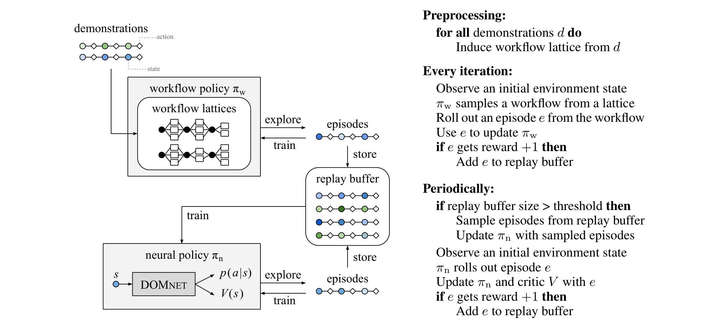
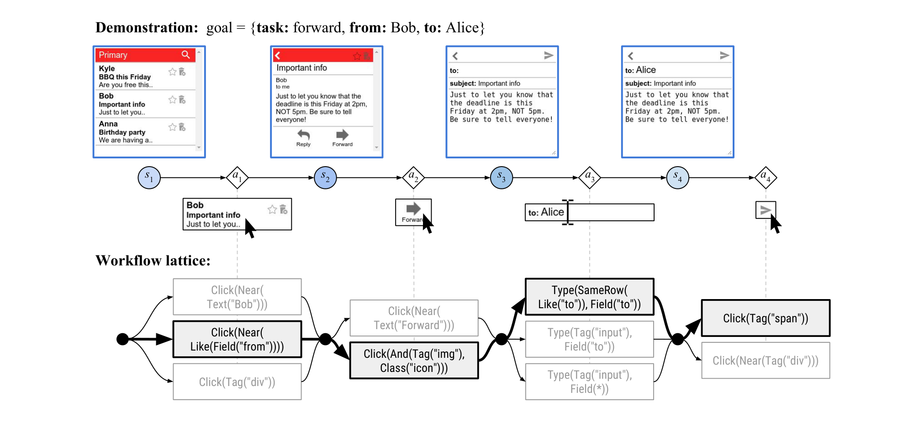

# Workflow-Guided Exploration (WGE) - Analysis

## 1. Overview

이 논문은 웹 인터페이스에서 강화학습 에이전트를 훈련하는 근본적인 어려움인 sparse reward 문제를 해결하는 새로운 방법을 제안한다. 항공권 예약이나 이메일 전송과 같은 웹 태스크에서는 하나의 실수로도 전체 행동 시퀀스가 실패하기 때문에, 에이전트가 긍정적 보상을 발견하기 매우 어렵다. 기존의 behavioral cloning 방식은 expert demonstration에 과적합되는 문제가 있어, warm-starting 후에도 pure RL 대비 개선이 미미했다.

저자들이 제안하는 Workflow-Guided Exploration (WGE) 프레임워크는 demonstration에서 직접 학습하지 않고, 대신 고수준의 "워크플로우"를 추출하여 탐색 공간을 제약한다. 예를 들어 이메일 전달 태스크에서는 "이메일 제목 클릭 → Forward 버튼 클릭 → 텍스트박스에 이메일 주소 입력 → Send 버튼 클릭"과 같은 환경-독립적(environment-blind) 워크플로우가 추출된다. 이 워크플로우는 각 시점에서 허용되는 행동의 종류만 제약하며, 구체적으로 어떤 요소를 클릭할지는 명시하지 않는다.

MiniWoB 벤치마크와 실제 Alaska Airlines 예약 인터페이스에서 실험한 결과, WGE는 단 10개의 demonstration만으로 기존 behavioral cloning + RL 방식(200개 이상 demonstration 사용)보다 높은 성능을 달성했다. 특히 click-checkboxes-large 태스크에서 BC+RL은 0% 성공률인 반면 WGE는 84%를 달성했고, Alaska Airlines 태스크에서는 1개 demonstration으로 0.97 reward를 얻어 80개 demonstration을 사용한 기존 연구의 0.57을 크게 상회했다.

이 연구는 demonstration을 직접 모방 학습의 대상으로 사용하지 않고 탐색 가이드로 활용하는 새로운 패러다임을 제시했다. 또한 MiniWoB++ 벤치마크를 공개하여 웹 에이전트 연구의 표준 평가 환경을 제공했으며, 이후 Mind2Web, WebArena 등 후속 벤치마크 연구의 토대가 되었다.

---

## 2. Core Section

### TL;DR

> 웹 태스크의 sparse reward 문제를 해결하기 위해 demonstration에서 고수준 워크플로우를 추출하여 탐색을 제약하는 WGE 프레임워크를 제안하고, DOM 트리의 구조적 관계를 포착하는 DOMNET 신경망을 설계하여 10개 demonstration으로 기존 200개 대비 100배 이상의 샘플 효율성을 달성했다.

→ 상세: [tldr.md](./1802.08802-details/tldr.md)

### Core Contributions

1. **Workflow-Guided Exploration (WGE) Framework**: Demonstration에서 environment-blind 워크플로우를 추출하여 탐색 공간을 제약함으로써 sparse reward 환경에서도 효율적인 학습 가능 → 과적합 없이 demonstration 활용하는 새로운 패러다임

2. **DOMNET Architecture**: DOM 트리의 공간적(spatial neighbors), 계층적(tree neighbors) 관계를 포착하는 신경망 설계 → 웹 환경의 반구조화된 특성에 최적화된 정책 네트워크

3. **MiniWoB++ Benchmark**: 더 긴 horizon, 자연어 변형, 확률적 환경 등 추가 도전 과제를 포함한 벤치마크 구축 및 공개 → 웹 에이전트 연구의 표준 평가 환경 제공

4. **100x Sample Efficiency**: 10개 demonstration으로 BC+RL 1000개 demonstration 대비 우수한 성능 → 실용적 웹 자동화 가능성 입증

→ 상세: [contributions.md](./1802.08802-details/contributions.md)

### Key vs Non-Key Sections

| Priority | Sections | Reason |
|----------|----------|--------|
| ⭐⭐⭐ Must Read | Section 3 (Inducing Workflows), Section 4 (Workflow Policy) | WGE의 핵심 메커니즘 |
| ⭐⭐⭐ Must Read | Section 5 (Neural Policy) | DOMNET 아키텍처 상세 |
| ⭐⭐ Important | Section 6.3 (Analysis) | 샘플 효율성, 자연어, 실제 웹 검증 |
| ⭐ Reference | Section 2 (Setup), Section 6.1 (Task Setups) | 문제 정의와 실험 설정 |
| Skip | Section 7 (Discussion) | 관련 연구 정리, 새로운 정보 적음 |

→ 상세: [key-sections.md](./1802.08802-details/key-sections.md)

---

## 3. Paper Type

**Type**: Method

| Aspect | Value |
|--------|-------|
| **Problem** | 웹 인터페이스에서 sparse reward로 인한 RL 학습 실패 |
| **Approach** | Demonstration에서 워크플로우 추출 → 탐색 제약 |
| **Key Technique** | Environment-blind workflow policy + DOMNET |
| **Main Result** | 10 demos로 100x 샘플 효율성, MiniWoB SOTA |

→ 상세 방법론: [methodology.md](./1802.08802-details/methodology.md)

---

## 4. Visual Analysis

### Key Figures

#### Figure 1: WGE Framework Overview

**구성 요소**:
- **Demonstration → Workflow Lattice**: 시연에서 가능한 워크플로우 스텝 조합 추출
- **Workflow Policy (π_w)**: 워크플로우 샘플링 및 행동 생성
- **Replay Buffer**: 성공 에피소드 저장
- **Neural Policy (π_n)**: DOMNET 기반 최종 정책

**핵심 통찰**:
- Demonstration은 π_n에 직접 노출되지 않음 → 과적합 방지
- π_w는 빠르게 학습, π_n은 표현력 담당 → 역할 분리

**Source**: [Figure 1](./1802.08802.md#figure-1-workflow-guided-exploration-wge)

---

#### Figure 2: Workflow Lattice Example

**구성 요소**:
- **노드**: 각 시점의 가능한 워크플로우 스텝 (Click(Tag("div")), Click(Near(Text("Bob"))) 등)
- **경로**: 하나의 완전한 워크플로우 (lattice의 경로)
- **굵은 경로**: 선택된 워크플로우

**핵심 통찰**:
- 동일 시연에서 다양한 추상화 수준의 워크플로우 생성 가능
- 너무 구체적(Near(Text("Bob"))) vs 너무 일반적(Tag("div")) 중 적절한 것을 학습

**Source**: [Figure 2](./1802.08802.md#figure-2-workflow-lattice-example)

---

### Math Formulations

#### Equation: Workflow Policy Distribution

$$\pi_w(z | d, t) = \frac{\exp(\psi_{z,t,d})}{\sum_{z' \in Z_t} \exp(\psi_{z',t,d})}$$

**직관적 설명**: 각 시점 $t$에서 가능한 워크플로우 스텝 중 하나를 선택하는 확률 분포. 각 스텝 $z$에 대한 점수 $\psi_{z,t,d}$를 학습하며, 이 점수는 demonstration $d$와 시점 $t$에만 의존하고 환경 상태 $s_t$에는 의존하지 않는다(environment-blind).

**예시**: 이메일 전달 태스크의 첫 단계에서
- Click(Tag("span")): ψ = 2.1
- Click(Near(Text("Bob"))): ψ = 0.3
- Click(Tag("div")): ψ = -1.2

→ softmax 적용 후 Click(Tag("span"))이 가장 높은 확률로 선택됨

**Source**: [Section 4](./1802.08802.md#4-workflow-exploration-policy)

---

### Algorithm Walkthrough

#### Algorithm 1: Workflow-Guided Exploration

**목표**: Demonstration에서 워크플로우를 추출하고, 성공적인 탐색을 통해 신경망 정책 학습

**예시 실행** (이메일 전달 태스크):

| Step | Action | State |
|------|--------|-------|
| 1 | Preprocess: 시연에서 lattice 추출 | Z₁ = {Click(Tag("span")), Click(Near("Bob"))} |
| 2 | π_w가 워크플로우 샘플링 | [Click(Tag("span")), Click(Like("Forward")), ...] |
| 3 | 워크플로우에 맞는 행동 실행 | Click(특정 span 요소) |
| 4 | 에피소드 결과로 π_w 업데이트 | 성공 시 해당 워크플로우 확률 증가 |
| 5 | 성공 에피소드 → replay buffer | buffer.add(episode) |
| 6 | π_n을 buffer에서 학습 | A2C off-policy update |

**복잡도**:
- Workflow Induction: O(T × |Z_t|) per demonstration
- Training: Standard RL complexity

**Source**: [Algorithm 1](./1802.08802.md#algorithm-1-workflow-guided-exploration)

---

### Tables Interpretation

#### Table 1: MiniWoB++ Results

| Task | Steps | BC+RL | π_w only | WGE |
|------|-------|-------|----------|-----|
| click-checkboxes-large | 13 | 0% | 43% | **84%** |
| multi-ordering | 4 | 5% | 78% | **100%** |
| email-inbox-nl | 4 | 28% | 0% | **93%** |

**주요 발견**:
1. **Long horizon에서 WGE 우위**: click-checkboxes-large (13 steps)에서 BC+RL 완전 실패, WGE 성공
2. **환경 변동에 강건**: multi-ordering (필드 순서 변동)에서 BC+RL 5% → WGE 100%
3. **자연어 이해**: email-inbox-nl에서 π_w는 실패하지만 π_n이 학습 가능

**트레이드오프**: π_w 단독으로는 multi-layout처럼 시각적 레이아웃 변동에 취약 (9%)

**Source**: [Table 1](./1802.08802.md#table-1-results-on-additional-tasks)

---

## 5. Critique & Related Works

### Expert Critique

#### Strengths
1. **샘플 효율성의 극적 개선**: 10개 demonstration으로 1000개 대비 우수한 성능은 실용적 웹 자동화의 가능성을 입증 [Section 6.3.4](./1802.08802.md#634-sample-efficiency)
2. **과적합 방지 메커니즘**: Demonstration을 직접 학습하지 않고 탐색 가이드로 사용하는 아이디어는 이론적으로 견고하며 실험적으로 검증됨 [Section 4](./1802.08802.md#4-workflow-exploration-policy)
3. **모듈형 설계**: 워크플로우 정책과 신경망 정책의 분리로 각각 독립적 개선 가능 [Figure 1](./1802.08802.md#figure-1-workflow-guided-exploration-wge)

#### Limitations
1. **구조화된 입력 의존**: 워크플로우 언어가 구조화된 goal (key-value)에 의존하여 순수 자연어 지시에는 제한적 [Section 6.3.2](./1802.08802.md#632-natural-language-inputs)
2. **새로운 웹사이트 일반화 미검증**: MiniWoB++는 simulated 환경이며, 실제 다양한 웹사이트로의 transfer 검증 부족
3. **동적 웹 환경 미반영**: 실제 웹의 광고, 팝업, 레이아웃 변경 등 동적 요소 미고려

#### Reproducibility
- [x] Code available: https://github.com/stanfordnlp/wge
- [x] Data available: MiniWoB++ 공개
- [x] Clear hyperparameters: Appendix에 상세 기술

#### 2026 Perspective
- **Still Valid**: Demonstration을 탐색 가이드로 사용하는 핵심 아이디어는 여전히 유효하며, 최근 LLM 기반 에이전트에서도 in-context learning으로 유사하게 적용됨
- **Outdated**: DOMNET의 DOM 기반 state representation은 현재 screenshot-based LMM 접근법으로 대체됨 (WebVoyager, SeeAct)
- **Missing**:
  - LLM의 zero-shot/few-shot 능력 활용
  - Multimodal input (screenshot) 처리
  - Real-world 웹사이트에서의 대규모 평가

### Related Works

1. **WebArena (Zhou et al., 2023)** - MiniWoB++ 이후 실제 hosted 웹사이트 환경 벤치마크 - [arXiv:2307.13854](https://arxiv.org/abs/2307.13854)
2. **Mind2Web (Deng et al., 2023)** - 137개 실제 웹사이트에서의 대규모 데이터셋, DOM element selection에 집중 - [arXiv:2306.06070](https://arxiv.org/abs/2306.06070)
3. **SeeAct (Zheng et al., 2024)** - GPT-4V를 활용한 grounded web agent, visual grounding 접근법 - [arXiv:2401.01614](https://arxiv.org/abs/2401.01614)

---

## Navigation

- **Source**: [원본 논문](./1802.08802.md)
- **Details**:
  - [TL;DR 상세](./1802.08802-details/tldr.md)
  - [Contributions 상세](./1802.08802-details/contributions.md)
  - [Key Sections 상세](./1802.08802-details/key-sections.md)
  - [Methodology 상세](./1802.08802-details/methodology.md)
