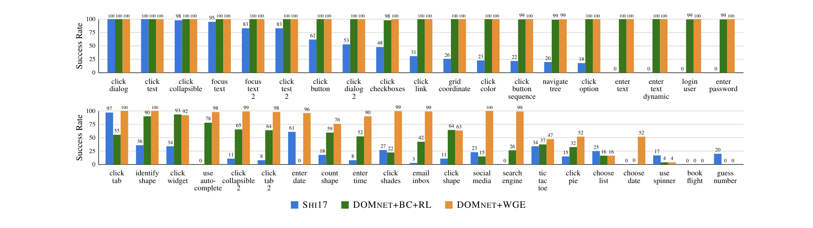
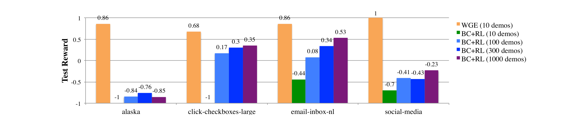
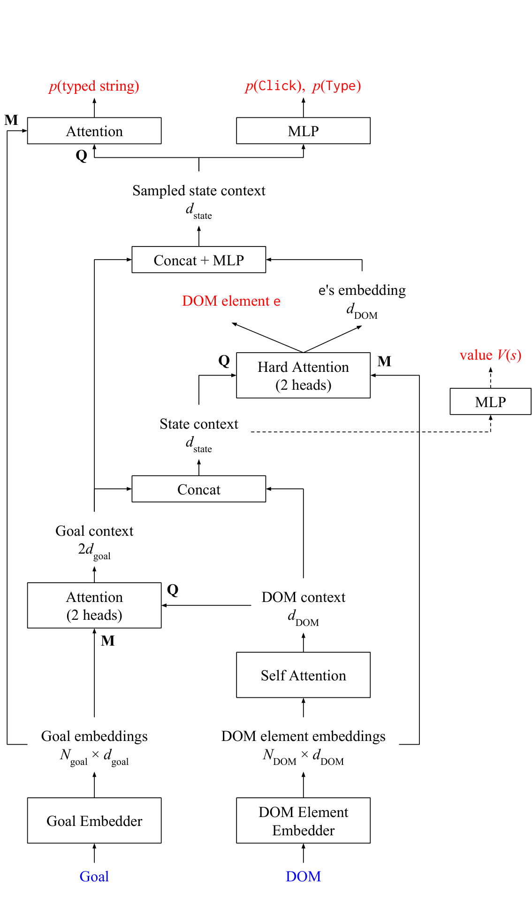

# Reinforcement Learning on Web Interfaces Using Workflow-Guided Exploration

## 저자

**Evan Zheran Liu**<sup>[1](#aff-1),[*](#fn-star)</sup>, **Kelvin Guu**<sup>[2](#aff-2),[*](#fn-star)</sup>, **Panupong Pasupat**<sup>[1](#aff-1),[*](#fn-star)</sup>, **Tianlin Shi**<sup>[1](#aff-1)</sup>, **Percy Liang**<sup>[1](#aff-1)</sup>

<a id="fn-star"></a><sup>*</sup> 처음 세 저자가 동등하게 기여함

<a id="aff-1"></a><sup>1</sup> Department of Computer Science, Stanford University, Stanford, CA 94305, USA

<a id="aff-2"></a><sup>2</sup> Department of Statistics, Stanford University, Stanford, CA 94305, USA

## 초록

Reinforcement learning (RL) agent는 시행착오를 통해 개선되지만, reward가 sparse하고 agent가 성공적인 action sequence를 발견하지 못할 때 학습이 정체된다. 이는 항공편 예약이나 이메일 답장과 같은 web 기반 task를 수행하도록 deep RL agent를 훈련시킬 때 특히 두드러지는 문제였으며, 단 하나의 실수가 전체 action sequence를 망칠 수 있다. 일반적인 해결책은 expert demonstration을 모방하도록 사전 훈련하여 agent를 "warm-start"하는 것이지만, 이는 overfitting에 취약하다. 대신, 우리는 demonstration을 사용하여 exploration을 제약하는 방법을 제안한다. 각 demonstration으로부터 우리는 각 time step에서 허용되는 action을 demonstration의 action과 유사하게 제한하는 high-level "workflow"를 유도한다 (예: "Step 1: textbox 클릭; Step 2: 텍스트 입력"). 그런 다음 우리의 exploration policy는 성공적인 workflow를 식별하고 이러한 workflow를 만족하는 action을 sampling하는 방법을 학습한다. Workflow는 나쁜 exploration 방향을 제거하고 agent가 reward를 발견하는 능력을 가속화한다. 우리는 이 접근 방식을 사용하여 website의 semi-structured 특성을 처리하도록 설계된 새로운 neural policy를 훈련하고, 최근의 World of Bits benchmark를 포함한 web task suite에서 평가한다. 우리는 새로운 state-of-the-art 결과를 달성하고, workflow-guided exploration이 behavioral cloning보다 100배 이상의 sample efficiency 개선을 보여준다.

---

## 1 서론

우리는 web browser를 직접 제어하여 인터넷을 사용하도록 (예: 항공편 예약이나 이메일 답장) reinforcement learning (RL) agent를 훈련시키는 것에 관심이 있다. 이러한 시스템은 현재 machine-readable API와의 상호작용에 제한된 AI 개인 비서 [[38]](#ref-38)의 기능을 확장하여 훨씬 더 넓은 human-readable web interface의 세계로 나아갈 수 있다.

Reinforcement learning agent는 시행착오를 통해 [[42]](#ref-42) 이러한 human-readable web interface를 사용하여 task를 수행하는 방법을 학습할 수 있다. 그러나 이 학습 과정은 sparse reward가 있는 task에서 매우 느릴 수 있으며, 대부분의 naive action sequence가 reward signal을 전혀 제공하지 않는다 [[41]](#ref-41) [[25]](#ref-25). 이는 많은 web task의 경우로, 큰 action space (agent가 무엇이든 입력하거나 클릭할 수 있음)와 성공하기 위해 잘 조율된 action sequence가 필요하다.

RL에서 일반적인 대응책은 behavioral cloning을 통해 expert demonstration을 모방하도록 agent를 사전 훈련시키는 것 [[33]](#ref-33) [[20]](#ref-20)으로, 유사한 state에서 유사한 action을 취하도록 유도한다. 그러나 website와 같이 다양하고 복잡한 state를 가진 환경에서 demonstration은 state space의 일부만 커버할 수 있으며, 이러한 state를 넘어 일반화하기 어렵다 (overfitting). 실제로, 이전 연구에서 behavioral cloning으로 warm-starting하는 것이 순수 RL보다 개선되지 않는 경우가 많다는 것을 발견했다 [[37]](#ref-37). 동시에, overfitting에 대응하기 위한 간단한 전략 (예: 더 적은 parameter 사용 또는 regularization)은 policy의 유연성을 손상시키며 [[9]](#ref-9), 이는 user interface에서 복잡한 공간적, 구조적 추론에 필요하다.

본 연구에서 우리는 demonstration을 활용하기 위한 다른 방법을 제안한다. Agent를 직접 모방하도록 훈련시키는 대신, demonstration을 사용하여 exploration을 제약한다. 나쁜 exploration 방향을 제거함으로써 agent가 sparse reward를 발견하는 능력을 가속화할 수 있다. 더 나아가,


**Figure 1**: Workflow-guided exploration (WGE). Demonstration으로부터 workflow lattice를 유도한 후, workflow policy $\pi_w$는 sampled workflow로부터 episode를 sampling하여 exploration을 수행한다. 성공적인 episode는 replay buffer에 저장되며, 이는 neural policy $\pi_n$을 훈련시키는 데 사용된다.

**Algorithm 1: Workflow-Guided Exploration**

```
Preprocessing:
  for all demonstrations d do
    Induce workflow lattice from d

Every iteration:
  Observe an initial environment state
  π_w samples a workflow from a lattice
  Roll out an episode e from the workflow
  Use e to update π_w
  if e gets reward +1 then
    Add e to replay buffer

Periodically:
  if replay buffer size > threshold then
    Update π_n with sampled episodes
  Sample episodes from replay buffer
  Observe an initial environment state
  π_n rolls out episode e
  Update π_n and critic V with e
  if e gets reward +1 then
    Add e to replay buffer
```

Agent가 demonstration에 직접 노출되지 않기 때문에, overfitting 위험을 줄이면서 정교한 neural policy를 자유롭게 사용할 수 있다.

Exploration을 제약하기 위해 *workflow* [[13]](#ref-13)의 개념을 활용한다. 예를 들어, 이메일을 전달하는 방법에 대한 expert demonstration이 주어지면, 다음과 같은 workflow를 추론할 수 있다:

```
Click an email title → Click a 'Forward' button → Type an email address into a textbox →
```

Click a 'Send' button

이 workflow는 실제 policy보다 더 high-level이다: 정확히 어떤 이메일을 클릭해야 하는지 또는 어떤 textbox에 입력해야 하는지 알려주지 않지만, 각 time step에서 action 집합을 유용하게 제한한다. 더 나아가, policy와 달리 environment state에 의존하지 않는다: 그저 맹목적으로 따를 수 있는 단계의 sequence이다. 이런 의미에서 workflow는 *environment-blind*이다. 실제 policy는 분명히 environment-blind이어서는 안 되지만, exploration에 있어서 environment-blindness는 좋은 inductive bias라는 것을 발견했다.

Workflow를 활용하기 위해, Figure 1에 설명된 것처럼 workflow-guided exploration (WGE) framework를 제안한다:

1. 각 demonstration에 대해, demonstration에서 관찰된 action과 일치하는 workflow의 lattice를 추출한다 (Section 3).
2. 그런 다음 workflow exploration policy π w (Section 4)를 정의하며, 이는 먼저 workflow를 선택한 다음 workflow에 맞는 action을 sampling하여 exploration한다. 이 policy는 reinforcement learning을 통해 어떤 workflow를 선택할지 점진적으로 학습한다.
3. Exploration 중 발견된 reward를 얻는 episode는 replay buffer에 들어가며, 이를 사용하여 더 강력하고 표현력 있는 neural network policy π n (Section 5)을 훈련시킨다.

Web과 robotics [[5]](#ref-5) 또는 game-playing [[8]](#ref-8)과 같은 전통적인 RL domain 간의 핵심 차이점은 state space가 structured (예: HTML)와 unstructured input (예: natural language 및 image)의 혼합을 포함한다는 것이다. 이는 website의 tree-structured HTML 표현에 대해 유연한 relational reasoning을 수행하도록 특별히 설계된 새로운 neural network policy (**DOMNET**)를 제안하도록 동기를 부여한다.

우리는 [[37]](#ref-37)의 MiniWoB benchmark, Alaska Airlines의 항공편 예약 interface, 그리고 noisy environment, natural language의 변형, 더 긴 time horizon과 같은 추가적인 도전을 연구하기 위해 구축한 새로운 task 모음을 포함한 web interaction task suite에서 workflow-guided exploration과 DOMNET을 평가한다. Task당 약 10분의 demonstration (평균 약 200개의 demonstration)을 사용한 MiniWoB에 대한 이전 결과 [[37]](#ref-37)와 비교하여, 우리 시스템은 task당 3-10개의 demonstration만으로 훨씬 더 높은 success rate를 달성하고 새로운 state-of-the-art 결과를 수립한다.

## 2 설정

표준 reinforcement learning 설정에서, agent는 state $s$를 action $a$에 대한 확률 분포로 mapping하는 policy $\pi(a|s)$를 학습한다. 각 time step $t$에서, agent는 environment state $s_t$를 관찰하고 action $a_t$를 선택하며, 이는 새로운 state $s_{t+1}$과 reward $r_t = r(s_t, a_t)$로 이어진다. 목표는 expected return $\mathbb{E}[R]$을 최대화하는 것이며, 여기서 $R = \sum_t \gamma^t r_{t+1}$이고 $\gamma$는 discount factor이다. 일반적인 reinforcement learning agent는 시행착오를 통해 학습한다: episode $(s_1, a_1, \ldots, s_T, a_T)$를 rollout하고 그 episode의 결과를 기반으로 policy를 조정한다.

우리는 reward가 delayed되고 sparse한 설정에 집중한다. 구체적으로, (1) agent는 episode 끝에서만 reward를 받고, (2) 가능한 trajectory의 작은 fraction에 대해서만 reward가 높고 (예: $+1$) 그 외에는 균일하게 낮다고 (예: $-1$) 가정한다. 큰 state와 action space에서, exploration policy가 positive reward를 가진 episode를 찾기 어려워 policy가 효과적으로 학습하는 것을 방해한다.

또한 agent에게 goal $g$가 주어진다고 가정하며, 이는 structured key-value mapping (예: `{task: forward, from: Bob, to: Alice}`) 또는 natural language utterance (예: "Forward Bob's message to Alice")일 수 있다. Agent의 state $s$는 goal $g$와 element의 tree로 표현되는 web page의 현재 상태 (이하 *DOM tree*)로 구성된다. Action space를 click action `Click(e)`와 type action `Type(e,t)`로 제한하며, 여기서 $e$는 DOM tree의 leaf element이고, $t$는 goal $g$의 string (structured goal의 value 또는 natural language goal의 연속 token)이다. Figure 2는 이메일 처리 task에 대한 예시 episode를 보여준다. Agent는 task가 올바르게 완료되면 $+1$ reward를, 그렇지 않으면 $-1$ reward를 받는다.

## 3 Demonstration으로부터 Workflow 유도

Expert demonstration $d = (\tilde{s}_1, \tilde{a}_1, \ldots, \tilde{s}_T, \tilde{a}_T)$의 모음이 주어지면, demonstrated action $\tilde{a}_t$와 "유사한" action $a_t$를 exploration하고 싶다. Workflow는 각 time step에서 유사한 action의 집합을 지정하여 이러한 유사성 개념을 포착한다. 공식적으로, workflow $z_{1:T}$는 workflow step의 sequence이며, 각 step $z_t$는 state $s_t$를 받아 유사한 action의 제약된 집합 $z_t(s_t)$를 반환하는 함수이다. Workflow step을 설명하기 위해 간단한 compositional constraint language (Appendix A)를 사용한다. 예를 들어, $z_t = \text{Click}(\text{Tag}(\text{"img"}))$에서, 집합 $z_t(s_t)$는 $s_t$의 tag가 `img`인 모든 DOM element에 대한 click action을 포함한다.

각 demonstration $d = (\tilde{s}_1, \tilde{a}_1, \ldots, \tilde{s}_T, \tilde{a}_T)$로부터 다음과 같이 workflow 집합을 유도한다. 각 time step $t$에 대해, $\tilde{a}_t \in z_t(\tilde{s}_t)$를 만족하는 가능한 모든 workflow step $z_t$의 집합 $Z_t$를 열거한다. 그러면 workflow의 집합은 step의 cross product $Z_1 \times \cdots \times Z_T$이다. Figure 2에 설명된 것처럼 유도된 workflow를 workflow lattice의 path로 표현할 수 있다.

일부 action이 불필요한 noisy demonstration (예: demonstrator가 실수로 배경을 클릭할 때)을 처리하기 위해, 특정 time step을 건너뛰는 shortcut step을 추가한다. 또한 단일 equivalent action으로 축소될 수 있는 연속적인 action (예: 같은 DOM element에 대한 두 type action을 단일 Type step으로 축소)에 대해서도 shortcut step을 추가한다. 이러한 shortcut은 유도된 workflow의 길이가 demonstration의 길이와 다를 수 있게 한다. 이후 표기법을 단순화하기 위해 이러한 shortcut step을 무시한다.

유도된 workflow step이 동등하게 효과적이지는 않다. 예를 들어 Figure 2에서, workflow step `Click(Near(Text("Bob")))` (텍스트 "Bob" 근처의 element 클릭)는 demonstration scenario에 너무 specific하고, `Click(Tag("div"))` (모든 `<div>` element 클릭)는 너무 general하여 너무 많은 관련 없는 action을 커버한다. 다음 section에서는 workflow policy $\pi_w$가 어떤 workflow step을 사용할지 학습하는 방법을 설명한다.


**Figure 2**: 각 demonstration (goal = `{task: forward, from: Bob, to: Alice}`)으로부터, 해당 demonstration의 action을 기반으로 workflow lattice를 유도한다. 새로운 environment가 주어지면, workflow policy는 workflow (lattice의 path, 굵은 선으로 표시)를 sample하고 workflow의 step에 맞는 action을 sample한다.

## 4 Workflow Exploration Policy

우리의 workflow policy는 다음과 같은 방식으로 environment와 상호작용하여 episode를 생성한다. Episode 시작 시, policy는 제공된 goal $g$에 조건화하고, 유사한 goal을 수행한 demonstration $d$를 선택한다:

$$d \sim \text{softmax}(\text{sim}(g, g_d))$$

여기서 $\text{sim}(g, g_d)$는 $g$와 demonstration $d$의 goal $g_d$ 간의 유사도를 측정한다. 우리 task에서, structured goal이 같은 key를 공유하면 $\text{sim}(g, g_d)$를 1로, 그렇지 않으면 $-\infty$로 설정한다.

그런 다음, environment state $s_t$를 가진 각 time step $t$에서, 다음 분포에 따라 workflow step $z_t$를 sample한다:

$$\pi_w(z | d, t) = \frac{\exp(\psi_{z,t,d})}{\sum_{z' \in Z_t} \exp(\psi_{z',t,d})}$$

여기서 각 $\psi_{z,t,d}$는 학습할 별도의 scalar parameter이다. 마지막으로, 집합 $z_t(s_t)$에서 균등하게 action $a_t$를 sample한다.

$$a_t \sim \text{Uniform}(z_t(s_t))$$

Episode $e = (s_1, a_1, \ldots, s_T, a_T)$를 exploration할 전체 확률은 다음과 같다:

$$P(e) = \prod_{t=1}^{T} \pi_w(z_t | d, t) \cdot \frac{1}{|z_t(s_t)|} \cdot p(s_t | s_{t-1}, a_{t-1})$$

여기서 $p(s_t | s_{t-1}, a_{t-1})$는 (알려지지 않은) state transition probability이다.

$\pi_w(z | d, t)$는 environment state $s_t$의 함수가 전혀 아님에 주목하라. 결정은 선택된 demonstration과 현재 시간 $t$에만 의존한다. 이러한 *environment-blindness*는 workflow policy가 state-dependent policy보다 훨씬 적은 parameter를 사용한다는 것을 의미하며, 더 빠르게 학습하고 overfitting을 방지할 수 있다. Environment-blindness로 인해 workflow policy는 task를 해결할 수 없지만, 특정 좋은 행동을 빠르게 학습하여 neural policy 학습에 도움이 될 수 있다.

Workflow policy를 훈련시키기 위해 REINFORCE algorithm [[43]](#ref-43) [[42]](#ref-42)의 변형을 사용한다. 특히, episode $e = (s_1, a_1, \ldots, s_T, a_T)$를 rollout한 후, unbiased estimate를 사용하여 gradient를 근사한다

$$\nabla_\psi \log P(e) = \sum_{t=1}^{T} (G_t - v_{d,t}) \nabla_\psi \log \pi_w(z_t | d, t)$$

여기서 $G_t$는 time step $t$에서의 return이고 $v_{d,t}$는 variance reduction을 위한 baseline term이다.

Workflow policy에서 positive reward를 받은 sampled episode는 replay buffer에 저장되며, 이는 neural policy $\pi_n$을 훈련시키는 데 사용된다.

## 5 Neural Policy

Figure 1에 설명된 대로, neural policy는 on-policy와 off-policy update (replay buffer에서 episode를 추출) 모두를 사용하여 학습된다. 두 update 모두 advantage actor-critic algorithm [[24]](#ref-24)의 synchronous version인 A2C를 사용한다. Reward $+1$인 episode만 replay buffer에 들어가므로, off-policy update는 optimal trajectory에 대한 supervised learning과 유사하게 동작한다. 또한 on-policy exploration 중 발견된 성공적인 episode도 replay buffer에 추가된다.

**Model architecture.** 우리는 DOM tree의 공간적, 계층적 구조를 포착하는 neural architecture인 DOMNET을 제안한다. Figure 5에 설명된 대로, model은 먼저 DOM element와 input goal을 embed하고, embedding에 일련의 attention을 적용하여 최종적으로 action에 대한 분포 $\pi_n(a|s)$와 value function $V(s)$ (critic)를 생성한다. 우리의 새로운 DOM embedder를 강조하고, 다른 세부 사항은 Appendix C에서 다룬다.

DOM embedder는 graph embedding [[21]](#ref-21) [[31]](#ref-31) [[16]](#ref-16)에 관한 최근 연구와 유사하게 DOM element 간의 다양한 상호작용을 포착하도록 설계되었다. 특히, "관련된" DOM element (예: checkbox와 연관된 label)는 서로 정보를 전달해야 한다.

DOM element $e$를 embed하기 위해, 먼저 attribute (tag, class, text 등)를 embed하고 concatenate하여 base embedding $v_e^{\text{base}}$를 계산한다. DOM element 간의 관계를 포착하기 위해, 다음으로 두 가지 유형의 *neighbor embedding*을 계산한다:

1. *Spatial neighbor*를 $e$로부터 30 pixel 이내의 모든 element $e'$로 정의하고, base embedding을 합산하여 spatial neighbor embedding $v_e^{\text{spatial}}$을 얻는다.
2. *Depth-k tree neighbor*를 DOM tree에서 $e$와 $e'$의 least common ancestor가 depth가 최대 $k$인 모든 element $e'$로 정의한다. 직관적으로, 더 높은 depth의 tree neighbor가 더 관련이 있다. 각 depth $k$에 대해, 각 depth-$k$ tree neighbor $e'$의 base embedding에 learnable affine transformation $f$를 적용한 다음 max pooling을 적용하여 $v_e^{\text{tree}[k]} = \max f(v_{e'}^{\text{base}})$를 얻는다. Tree neighbor embedding $v_e^{\text{tree}}$는 $k = 3, 4, 5, 6$에 대한 $v_e^{\text{tree}[k]}$의 concatenation이다.

마지막으로, *goal matching embedding* $v_e^{\text{match}}$를 goal에도 나타나는 $e$의 모든 word의 embedding의 합으로 정의한다. $e$의 최종 embedding $v_e^{\text{DOM}}$은 네 embedding $[v_e^{\text{base}}; v_e^{\text{spatial}}; v_e^{\text{tree}}; v_e^{\text{match}}]$의 concatenation이다.

## 6 실험

### 6.1 Task 설정

우리는 세 가지 interactive web task suite에서 접근 방식을 평가한다:

1. **MiniWoB**: [[37]](#ref-37)의 MiniWoB benchmark
2. **MiniWoB++**: stochastic environment와 natural language의 변형과 같이 MiniWoB에 없는 추가적인 도전을 포함하기 위해 구축한 새로운 task 집합.
3. **Alaska**: [[37]](#ref-37)의 FormWoB benchmark에서 영감을 받은 Alaska Airlines의 모바일 항공편 예약 interface.

MiniWoB와 MiniWoB++ benchmark의 공통 task 설정을 설명하고, Alaska benchmark의 설명은 Section 6.3.3으로 미룬다.



**Figure 3**: MiniWoB task에서 다양한 접근 방식의 success rate. DOMNET+WGE는 두 task를 제외한 모든 task에서 SHI17을 능가하며 대다수를 효과적으로 해결한다.

**Table 1**: 추가 task에 대한 결과. ($+$ = MiniWoB++, Steps = perfect policy가 task를 완료하는 데 필요한 최대 step 수로서의 task 길이)

| Task | 설명 | Steps | BC+RL | $\pi_w$ only | WGE |
|------|------|-------|-------|--------------|-----|
| click-checkboxes | 지정된 0-6개의 checkbox 클릭 | 7 | 98 | 81 | 100 |
| click-checkboxes-large$^+$ | ...5-12개 target | 13 | 0 | 43 | 84 |
| click-checkboxes-soft$^+$ | ...target의 synonym 지정 | 7 | 51 | 34 | 94 |
| click-checkboxes-transfer$^+$ | ...training data에 0-3개 target | 7 | 64 | 17 | 64 |
| multi-ordering$^+$ | 다양한 field ordering으로 form 작성 | 4 | 5 | 78 | 100 |
| multi-layout$^+$ | 다양한 UI layout으로 form 작성 | 4 | 99 | 9 | 100 |
| social-media | 지정된 Tweet에서 action 수행 | 2 | 15 | 2 | 100 |
| social-media-all$^+$ | ...일치하는 모든 Tweet에서 | 12 | 1 | 0 | 0 |
| social-media-some$^+$ | ...지정된 수의 일치하는 Tweet에서 | 12 | 2 | 3 | 42 |
| email-inbox | 이메일 inbox에서 task 수행 | 4 | 43 | 3 | 99 |
| email-inbox-nl$^+$ | ...natural language goal | 4 | 28 | 0 | 93 |

**Environment.** 각 task는 160px x 210px environment와 텍스트로 지정된 goal을 포함한다. 대부분의 task는 episode 끝에 단일 sparse reward를 반환한다; $+1$ (성공) 또는 $-1$ (실패). Task 간의 더 큰 일관성을 위해, 실험에서 모든 partial reward를 비활성화했다. Agent는 Selenium web driver interface를 통해 environment에 접근한다.

Public MiniWoB benchmark<sup>[1](#fn-1)</sup>는 80개의 task를 포함한다. 우리는 action space에서 action만 필요로 하는 40개의 task를 필터링했으며, 즉 DOM element 클릭과 input goal에서 string 입력이다. 제외된 많은 task는 두 선 사이의 각도를 계산하거나 대수 문제를 푸는 것과 같은 다소 전문적인 추론을 포함한다. 각 task에 대해, Amazon Mechanical Turk를 사용하여 10개의 demonstration을 수집했으며, 이는 각 event가 발생했을 때 DOM의 상태와 함께 모든 mouse 및 keyboard event를 기록한다.

**평가 metric.** *Success rate*를 보고한다: reward $+1$인 test episode의 비율. Partial reward를 제거했으므로, success rate는 average reward의 linear scaling이며, [[37]](#ref-37)의 success rate 정의와 동일하다.

<a id="fn-1"></a><sup>1</sup> http://alpha.openai.com/miniwob/

<a id="fn-2"></a><sup>2</sup> Goal text와 겹치는 textual element에서 활성화되는 filter로 보강됨.

### 6.2 주요 결과

MiniWoB task에서 다음 접근 방식의 success rate를 비교한다:

- **SHI17**: [[37]](#ref-37)의 시스템, 10분의 demonstration (평균 약 200개의 demonstration)으로 behavioral cloning을 사전 훈련하고 RL로 fine-tuning. DOMNET과 달리, 이 시스템은 주로 state의 pixel-based representation을 사용한다.<sup>[2](#fn-2)</sup>

- **DOMNET+BC+RL**: 우리가 제안한 neural policy DOMNET이지만, SHI17과 같이 10개의 demonstration으로 behavioral cloning을 사전 훈련하고 RL로 fine-tuning. Behavioral cloning 중, validation set의 reward를 기반으로 early stopping을 적용한다.
- **DOMNET+WGE**: 우리가 제안한 neural policy DOMNET, 10개의 demonstration으로 workflow-guided exploration으로 훈련.

DOMNET+BC+RL과 DOMNET+WGE에 대해, validation set에서 success rate가 최대에 도달하는 time step에서 test success rate를 보고한다.

결과는 Figure 3에 나와 있다. SHI17과 DOMNET+BC+RL을 비교하면, 두 가지가 같은 훈련 절차 (BC+RL)를 공유하므로 새로운 neural architecture DOMNET의 기여를 대략적으로 평가할 수 있다. SHI17도 pixel-level input에 추가하여 text alignment feature를 계산하기 위해 DOM tree를 사용하지만, DOMNET은 DOM 구조를 더 명시적으로 사용한다. DOMNET+BC+RL이 대부분의 task에서 SHI17보다 success rate를 경험적으로 개선한다는 것을 발견했다.

DOMNET+BC+RL과 DOMNET+WGE를 비교하면, workflow-guided exploration이 더 어려운 task에서 DOMNET이 더 잘 수행할 수 있게 한다는 것을 발견했으며, 이는 다음 section에서 분석한다. Workflow policy $\pi_w$가 학습한 일부 workflow는 Appendix B에 나와 있다.

### 6.3 분석

#### 6.3.1 MiniWoB++ Benchmark

Web agent가 마주할 수 있는 추가적인 도전을 연구하기 위해 MiniWoB++ benchmark task를 구축하고 공개했다. 여기에는 더 긴 time horizon (click-checkboxes-large), natural language에 대한 'soft' reasoning (click-checkboxes-soft), stochastically varying layout (multiorderings, multi-layouts)이 포함된다. Table 1은 task와 time horizon (perfect policy가 가장 긴 goal을 수행하는 데 필요한 step 수)을 task 복잡성의 대략적인 측정으로 나열한다.

먼저 BC+RL로 훈련된 DOMNET (baseline)과 WGE로 훈련된 DOMNET (우리의 full approach)의 성능을 비교한다. 제안된 WGE model은 BC+RL model을 평균 42% absolute success rate만큼 능가한다. 그들의 행동을 분석하고 WGE로 훈련하면 완화되는 BC+RL로 훈련할 때의 두 가지 일반적인 failure mode를 발견했다:

1. BC+RL model은 episode를 조기에 종료하는 action (예: 필요한 모든 box가 체크되기 전에 click-checkboxes-large에서 'Submit' 누르기)을 취하는 경향이 있다. 가능한 원인 중 하나는 이러한 action이 모든 demonstration에서 발생하는 반면, 다른 non-terminating action (예: 다른 checkbox 클릭)은 demonstration마다 다르다는 것이다.
2. BC+RL model은 때때로 같은 checkbox를 반복적으로 체크하고 체크 해제하는 것과 같은 cyclic behavior에 빠진다. 이러한 failure mode는 WGE가 피하는 demonstration의 일부에 대한 overfitting에서 비롯된다.

다음으로, WGE가 학습한 workflow policy $\pi_w$를 분석한다. Workflow policy $\pi_w$ 자체는 여러 이유로 test time에 잘 작동하기에 너무 단순하다:

1. Workflow는 environment state를 무시하므로 multi-layout의 다른 layout과 같은 environment의 차이에 대응할 수 없다.
2. Workflow constraint language는 click-checkboxes-soft에서 특정 word의 synonym 클릭과 같은 특정 action을 지정하는 표현력이 부족하다.
3. Workflow policy는 주어진 goal에 대해 올바른 workflow를 선택하는 표현력이 부족하다.

그럼에도 불구하고 workflow policy $\pi_w$는 일부 시간에 reward를 발견할 정도로 충분히 제약되어 있으며, neural policy $\pi_n$은 그러한 episode에서 올바른 행동을 학습할 수 있다. 따라서 neural policy는 workflow policy $\pi_w$가 저조한 성능을 보일 때에도 높은 success rate를 달성할 수 있다.

#### 6.3.2 Natural Language Input

MiniWoB task는 structured goal을 제공하지만, 우리의 접근 방식을 natural language goal에도 적용할 수 있다. Overnight data collection technique [[40]](#ref-40)을 사용하여 training dataset을 수집했다. Email-inbox-nl task에서, annotator에게 task goal을 paraphrase하도록 요청하여 (예: "Forward Bob's message to Alice"를 "Email Alice the email I got from Bob"으로) natural language template을 수집한 다음 field를 추상화했다 ("Email `<TO>` the email I got from `<FROM>`"). 훈련 중, workflow policy $\pi_w$는 structured goal과 random template에서 생성된 natural language utterance 모두를 포함하는 state를 받는 반면, neural policy $\pi_n$은 utterance만 받는다. Test time에, neural policy는 unseen utterance에서 평가된다. Table 1의 결과는 WGE model이 natural language goal을 이해하는 방법을 학습할 수 있음을 보여준다 (93% success rate).



**Figure 4**: 가장 어려운 task 몇 가지에서 DOMNET+BC+RL과 DOMNET+WGE의 비교, test reward로 평가. 10개의 demonstration으로 훈련된 DOMNET+WGE는 1000개의 demonstration으로도 DOMNET+BC+RL을 능가한다.

Workflow policy는 workflow step에 대한 constraint language가 structured input에서 작동하기 때문에 structured input에 접근해야 한다. Constraint language는 잠재적으로 utterance에서 직접 작동하도록 수정될 수 있지만 (예: `After("to")`는 "to" 뒤의 utterance word를 추출), 이는 향후 연구로 남겨둔다.

#### 6.3.3 Real World Task로의 확장

더 현실적인 항공편 검색 task인 Alaska benchmark에 우리의 접근 방식을 적용했다. 이는 [[37]](#ref-37)의 FormWoB task에서 영감을 받은 Alaska Airlines 모바일 사이트에서의 task이다. 이 task에서 agent는 제공된 정보 (6-7개 field)로 항공편 검색 form을 완료해야 한다. 우리는 web page를 더 큰 375px x 667px 화면의 MiniWoB framework로 이식하고, server backend를 surrogate JavaScript function으로 교체하고, environment date를 2017년 3월 1일로 고정했다.

[[37]](#ref-37)을 따라, 모든 required field가 채워지면 제출된 form의 correct field 비율을 기반으로 partial reward를 준다. 이 partial reward에도 불구하고, reward는 여전히 극도로 sparse하다: 200개 이상의 DOM element가 있고 (MiniWoB task의 약 10-50개와 비교), 일반적인 episode는 autocomplete와 date picker와 같은 다양한 유형의 widget을 포함하는 최소 11개의 action을 필요로 한다. Random agent가 positive reward를 받을 확률은 $10^{-20}$ 미만이다.

먼저 [[37]](#ref-37)의 원래 Alaska Airlines task의 clone인 Alaska-Shi17에서 실험을 수행했으며, goal은 항상 roundtrip flight (두 공항과 두 날짜)를 지정한다. 그들의 dataset에서, 우리의 접근 방식은 단 1개의 demonstration만 사용하여 0.97의 average reward를 달성하며, 이는 약 80개의 demonstration을 사용한 그들의 최고 결과 0.57과 비교된다.

우리의 성공은 flight type 선택 (one-way flight를 위한 checkbox), 승객 수 (increment-decrement counter), seat type (accordion 아래 숨겨진)을 추가로 요구하는 더 어려운 버전의 task를 테스트하도록 동기를 부여했다. 우리는 10개의 demonstration을 사용하여 0.86의 average reward를 달성한다. 이는 우리 방법이 real-world website에서 긴 horizon을 처리할 수 있음을 보여준다.

#### 6.3.4 Sample Efficiency

우리 접근 방식의 demonstration efficiency를 평가하기 위해, DOMNET+WGE와 증가된 수의 demonstration으로 훈련된 DOMNET+BC+RL을 비교한다. 10개의 demonstration으로 훈련된 DOMNET+WGE와 10, 100, 300, 1000개의 demonstration으로 훈련된 DOMNET+BC+RL을 비교한다. 가장 어려운 task 몇 가지에 대한 test reward<sup>[3](#fn-3)</sup>가 Figure 4에 요약되어 있다.

Demonstration 수를 늘리면 overfitting 방지에 도움이 되어 BC+RL의 성능이 개선된다. 그러나 평가된 모든 task에서, 10개의 demonstration만으로 훈련된 WGE는 여전히 1000개의 demonstration을 사용한 BC+RL보다 훨씬 높은 test reward를 달성한다. 이는 demonstration 수 측면에서 behavioral cloning 대비 우리 방법의 100배 이상의 sample efficiency 개선에 해당한다.

<a id="fn-3"></a><sup>3</sup> Alaska task에서 partial reward로 인해 success rate가 인위적으로 높기 때문에 test reward를 보고한다.

## 7 토론

**Web을 위한 learning agent.** Web interaction을 위한 learning agent에 대한 이전 연구는 두 가지 주요 범주로 나뉜다. 첫째, 간단한 프로그램을 사용자가 지정하거나 [[44]](#ref-44) demonstration에서 추론할 수 있다 [[2]](#ref-2). 둘째, soft policy를 처음부터 학습하거나 demonstration으로 "warm-start"할 수 있다 [[37]](#ref-37). 특히, sparse reward는 [[37]](#ref-37)이 적당한 수의 demonstration을 사용해도 성공적으로 학습하는 것을 방해했다. Policy가 학습하기 더 어려운 것으로 입증되었지만, 표현력 있고 유연할 잠재력이 있다. 우리의 연구는 이 방향으로 한 걸음 나아간다.

**Prior knowledge 없이 sparse reward 해결.** 많은 연구가 추가적인 prior knowledge를 포함하지 않고 sparse reward를 해결하려고 시도한다. Exploration 방법 [[28]](#ref-28) [[11]](#ref-11) [[41]](#ref-41)은 agent가 더 많은 reward를 만나기 위해 state space를 더 잘 explore하도록 돕는다; shaping reward [[26]](#ref-26)는 특정 행동을 장려하기 위해 reward function을 직접 수정한다; 다른 연구 [[19]](#ref-19) [[4]](#ref-4)는 추가적인 unsupervised reward로 reward signal을 보강한다. 그러나 prior knowledge 없이는 agent가 추가 reward를 받도록 돕는 것이 일반적으로 어렵다.

**Imitation learning.** Expert의 추가 signal을 활용하기 위한 다양한 방법이 제안되었다. 예를 들어, expert policy를 사용할 수 있을 때, DAGGER [[35]](#ref-35) 및 AGGREVATE [[34]](#ref-34) [[39]](#ref-39)와 같은 방법은 expert policy를 쿼리하여 agent 훈련을 위한 dataset을 보강할 수 있다. Expert demonstration만 사용할 수 있을 때, inverse reinforcement learning 방법 [[1]](#ref-1) [[45]](#ref-45) [[15]](#ref-15) [[18]](#ref-18) [[7]](#ref-7)은 environment의 reinforcement signal을 사용하지 않고 demonstration에서 reward function을 추론한다.

Demonstration과 reinforcement signal을 모두 포함하는 일반적인 방법은 RL을 적용하기 전에 demonstration으로 agent를 사전 훈련하는 것이다. 최근 연구는 (1) 사전 훈련 중 다른 objective function과 regularization을 도입하고, (2) RL update 중 demonstration과 rolled-out episode를 혼합하여 이 기술을 확장한다 [[17]](#ref-17) [[25]](#ref-25) [[41]](#ref-41).

Demonstration으로 agent를 직접 훈련시키는 대신, 우리의 연구는 demonstration을 사용하여 *exploration을 guide*한다. 핵심 아이디어는 expert demonstration을 둘러싸는 "neighborhood"에 있는 trajectory를 explore하는 것이다. 우리의 경우, neighborhood는 demonstrated action과 유사한 action sequence만 허용하는 workflow로 정의된다. 여러 이전 연구도 reward shaping [[10]](#ref-10) [[18]](#ref-18) 또는 off-policy sampling [[22]](#ref-22)을 통해 demonstration의 neighborhood를 explore한다. 우리 연구의 핵심 차이점은 state similarity가 아닌 action similarity의 관점에서 neighborhood를 정의한다는 것이다. 이 구분은 web task에서 특히 중요하다: 두 action이 유사한 방식을 쉽고 직관적으로 설명할 수 있지만 (예: "둘 다 textbox에 username을 입력함"), 두 web page state가 유사한지 결정하기 더 어렵다 (예: 두 다른 사용자의 이메일 inbox는 완전히 다른 이메일을 가지지만, task에 따라 여전히 유사할 수 있다.)

**Hierarchical reinforcement learning.** Hierarchical reinforcement learning (HRL) 방법은 복잡한 task를 학습하기 쉬운 더 간단한 subtask로 분해한다. 주요 HRL framework는 abstract action [[42]](#ref-42) [[21]](#ref-21) [[16]](#ref-16), abstract partial policy [[29]](#ref-29), abstract state [[34]](#ref-34) [[14]](#ref-14) [[23]](#ref-23)를 포함한다. 이러한 framework는 다양한 양의 prior knowledge를 필요로 한다. 원래 공식화는 프로그래머가 복잡한 task의 분해를 수동으로 지정해야 했지만, [[3]](#ref-3)은 subtask를 식별하기 위한 supervision만 필요로 하고, [[6]](#ref-6) [[12]](#ref-12)는 성능을 희생하면서 분해를 완전히 자동으로 학습한다.

HRL 방법 내에서, 우리의 연구는 [[29]](#ref-29)와 robotics의 constraint에 관한 연구 [[32]](#ref-32) [[30]](#ref-30)에 가장 가깝다. [[29]](#ref-29)의 연구는 workflow item과 유사하게 각 state에서 가능한 action 집합을 제약하는 partial policy를 지정한다. 프로그래머가 이러한 constraint를 수동으로 지정해야 하는 HAM framework [[3]](#ref-3) [[23]](#ref-23)의 이전 구현과 달리, 우리의 연구는 제공하는 데 특별한 기술이 필요 없는 사용자 demonstration에서 자동으로 constraint를 유도한다. [[32]](#ref-32) [[30]](#ref-30)도 demonstration에서 constraint를 학습한다는 점에서 우리 연구와 유사하지만, demonstration을 사용하는 방식이 다르다. 우리 연구는 exploration을 위해 학습된 constraint를 사용하는 반면, [[32]](#ref-32)는 planning에만 constraint를 사용하고 [[30]](#ref-30)은 test time에 사용할 constraint의 knowledge base를 구축한다.

**요약.** 우리의 workflow-guided framework는 demonstration, abstraction, 표현력 있는 neural policy의 신중한 조합을 나타낸다. 우리는 demonstration의 targeted information과 workflow의 inductive bias를 활용한다. 그러나 이는 exploration에만 사용되어 표현력 있는 neural policy를 overfitting으로부터 보호한다. 결과적으로, 우리는 매우 sparse한 reward signal과 매우 적은 demonstration으로 상당히 복잡한 policy를 학습할 수 있다.

**감사의 글.** 이 연구는 NSF CAREER Award IIS-1552635의 지원을 받았다.

**재현성.** 우리의 code와 data는 [https://github.com/stanfordnlp/wge](https://github.com/stanfordnlp/wge)에서 사용할 수 있다. 재현 가능한 실험은 CodaLab platform [https://worksheets.codalab.org/worksheets/0x0f25031bd42f4aabbc17625fe1484066/](https://worksheets.codalab.org/worksheets/0x0f25031bd42f4aabbc17625fe1484066/)에서 사용할 수 있다.

## References

<a id="ref-1"></a>**[1]** P. Abbeel and A. Ng. Apprenticeship learning via inverse reinforcement learning. In *International Conference on Machine Learning (ICML)*, 2004.

<a id="ref-2"></a>**[2]** J. Allen, N. Chambers, G. Ferguson, L. Galescu, H. Jung, M. Swift, and W. Taysom. PLOW: A collaborative task learning agent. In *Association for the Advancement of Artificial Intelligence (AAAI)*, pp. 1514-1519, 2007.

<a id="ref-3"></a>**[3]** D. Andre. *Programmable reinforcement learning agents*. PhD thesis, University of California, Berkeley, 2003.

<a id="ref-4"></a>**[4]** J. Andreas, D. Klein, and S. Levine. Modular multitask reinforcement learning with policy sketches. [arXiv:1611.01796](https://arxiv.org/abs/1611.01796), 2016.

<a id="ref-5"></a>**[5]** M. Andrychowicz, F. Wolski, A. Ray, J. Schneider, R. Fong, P. Welinder, B. McGrew, J. Tobin, P. Abbeel, and W. Zaremba. Hindsight experience replay. [arXiv:1707.01495](https://arxiv.org/abs/1707.01495), 2017.

<a id="ref-6"></a>**[6]** C. G. Atkeson and S. Schaal. Robot learning from demonstration. In *International Conference on Machine Learning (ICML)*, volume 97, pp. 12-20, 1997.

<a id="ref-7"></a>**[7]** P. Bacon, J. Harb, and D. Precup. The option-critic architecture. In *Association for the Advancement of Artificial Intelligence (AAAI)*, pp. 1726-1734, 2017.

<a id="ref-8"></a>**[8]** N. Baram, O. Anschel, I. Caspi, and S. Mannor. End-to-end differentiable adversarial imitation learning. In *International Conference on Machine Learning (ICML)*, pp. 390-399, 2017.

<a id="ref-9"></a>**[9]** M. G. Bellemare, Y. Naddaf, J. Veness, and M. Bowling. The arcade learning environment: An evaluation platform for general agents. *Journal of Artificial Intelligence Research (JAIR)*, 47:253-279, 2013.

<a id="ref-10"></a>**[10]** S. Bitzer, M. Howard, and S. Vijayakumar. Using dimensionality reduction to exploit constraints in reinforcement learning. In *International Conference on Intelligent Robots and Systems (IROS)*, pp. 3219-3225, 2010.

<a id="ref-11"></a>**[11]** T. Brys, A. Harutyunyan, H. B. Suay, S. Chernova, M. E. Taylor, and A. Nowe. Reinforcement learning from demonstration through shaping. In *International Joint Conference on Artificial Intelligence (IJCAI)*, 2015.

<a id="ref-12"></a>**[12]** N. Chentanez, A. G. Barto, and S. P. Singh. Intrinsically motivated reinforcement learning. In *Advances in Neural Information Processing Systems (NIPS)*, pp. 1281-1288, 2005.

<a id="ref-13"></a>**[13]** C. Daniel, G. Neumann, O. Kroemer, and J. Peters. Hierarchical relative entropy policy search. *Journal of Machine Learning Research (JMLR)*, 17:3190-3239, 2016.

<a id="ref-14"></a>**[14]** B. Deka, Z. Huang, and R. Kumar. Erica: Interaction mining mobile apps. In *User Interface Software and Technology (UIST)*, pp. 767-776, 2016.

<a id="ref-15"></a>**[15]** T. G. Dietterich. The MAXQ method for hierarchical reinforcement learning. In *International Conference on Machine Learning (ICML)*, 1998.

<a id="ref-16"></a>**[16]** C. Finn, S. Levine, and P. Abbeel. Guided cost learning: Deep inverse optimal control via policy optimization. In *International Conference on Machine Learning (ICML)*, pp. 49-58, 2016.

<a id="ref-17"></a>**[17]** W. L. Hamilton, R. Ying, and J. Leskovec. Inductive representation learning on large graphs. In *Advances in Neural Information Processing Systems (NIPS)*, 2017.

<a id="ref-18"></a>**[18]** K. Hauser, T. Bretl, K. Harada, and J. Latombe. Using motion primitives in probabilistic sample-based planning for humanoid robots. *Algorithmic foundation of robotics*, 7:507-522, 2008.

<a id="ref-19"></a>**[19]** T. Hester, M. Vecerik, O. Pietquin, M. Lanctot, T. Schaul, B. Piot, A. Sendonaris, G. Dulac-Arnold, I. Osband, J. Agapiou, J. Z. Leibo, and A. Gruslys. Deep Q-learning from demonstrations. In *Association for the Advancement of Artificial Intelligence (AAAI)*, 2018.

<a id="ref-20"></a>**[20]** J. Ho and S. Ermon. Generative adversarial imitation learning. In *Advances in Neural Information Processing Systems (NIPS)*, pp. 4565-4573, 2016.

<a id="ref-21"></a>**[21]** I. Hosu and T. Rebedea. Playing Atari games with deep reinforcement learning and human checkpoint replay. In *Evaluating General Purpose AI*, 2016.

<a id="ref-22"></a>**[22]** A. Hussein, E. Elyan, M. M. Gaber, and C. Jayne. Deep reward shaping from demonstrations. In *International Joint Conference on Neural Networks*, 2017.

<a id="ref-23"></a>**[23]** M. Jaderberg, V. Mnih, W. M. Czarnecki, T. Schaul, J. Z. Leibo, D. Silver, and K. Kavukcuoglu. Reinforcement learning with unsupervised auxiliary tasks. [arXiv:1611.05397](https://arxiv.org/abs/1611.05397), 2016.

<a id="ref-24"></a>**[24]** B. Kim, A. Massoud Farahmand, J. Pineau, and D. Precup. Learning from limited demonstrations. In *Advances in Neural Information Processing Systems (NIPS)*, pp. 2859-2867, 2013.

<a id="ref-25"></a>**[25]** T. N. Kipf and M. Welling. Semi-supervised classification with graph convolutional networks. In *International Conference on Learning Representations (ICLR)*, 2017.

<a id="ref-26"></a>**[26]** G. Konidaris and A. G. Barto. Building portable options: Skill transfer in reinforcement learning. In *International Joint Conference on Artificial Intelligence (IJCAI)*, 2007.

<a id="ref-27"></a>**[27]** S. Levine and V. Koltun. Guided policy search. In *International Conference on Machine Learning (ICML)*, 2013.

<a id="ref-28"></a>**[28]** L. Li, T. J. Walsh, and M. L. Littman. Towards a unified theory of state abstraction for MDPs. In *International Symposium on Artificial Intelligence and Mathematics (ISAIM)*, 2006.

<a id="ref-29"></a>**[29]** B. Marthi and C. Guestrin. Concurrent hierarchical reinforcement learning. In *International Joint Conference on Artificial Intelligence (IJCAI)*, 2005.

<a id="ref-30"></a>**[30]** V. Mnih, A. P. Badia, M. Mirza, A. Graves, T. P. Lillicrap, T. Harley, D. Silver, and K. Kavukcuoglu. Asynchronous methods for deep reinforcement learning. In *International Conference on Machine Learning (ICML)*, 2016.

<a id="ref-31"></a>**[31]** A. Nair, B. McGrew, M. Andrychowicz, W. Zaremba, and P. Abbeel. Overcoming exploration in reinforcement learning with demonstrations. [arXiv:1709.10089](https://arxiv.org/abs/1709.10089), 2017.

<a id="ref-32"></a>**[32]** A. Y. Ng, D. Harada, and S. Russell. Policy invariance under reward transformations: Theory and application to reward shaping. In *International Conference on Machine Learning (ICML)*, volume 99, pp. 278-287, 1999.

<a id="ref-33"></a>**[33]** I. Osband, C. Blundell, A. Pritzel, and B. V. Roy. Deep exploration via bootstrapped DQN. In *Advances In Neural Information Processing Systems*, pp. 4026-4034, 2016.

<a id="ref-34"></a>**[34]** R. Parr and S. J. Russell. Reinforcement learning with hierarchies of machines. In *Advances in Neural Information Processing Systems (NIPS)*, pp. 1043-1049, 1998.

<a id="ref-35"></a>**[35]** C. Perez-D'Arpino and J. A. Shah. C-learn: Learning geometric constraints from demonstrations for multi-step manipulation in shared autonomy. In *International Conference on Robotics and Automation (ICRA)*, pp. 4058-4065, 2017.

<a id="ref-36"></a>**[36]** T. Pham, T. Tran, D. Phung, and S. Venkatesh. Column networks for collective classification. In *Association for the Advancement of Artificial Intelligence (AAAI)*, 2017.

<a id="ref-37"></a>**[37]** M. Phillips, V. Hwang, S. Chitta, and M. Likhachev. Learning to plan for constrained manipulation from demonstrations. *Autonomous Robots*, 40(1):109-124, 2016.

<a id="ref-38"></a>**[38]** D. A. Pomerleau. Efficient training of artificial neural networks for autonomous navigation. *Neural Computation*, 3(1):88-97, 1991.

<a id="ref-39"></a>**[39]** M. Roderick, C. Grimm, and S. Tellex. Deep abstract Q-networks. [arXiv:1710.00459](https://arxiv.org/abs/1710.00459), 2017.

<a id="ref-40"></a>**[40]** S. Ross and J. A. Bagnell. Reinforcement and imitation learning via interactive no-regret learning. [arXiv:1406.5979](https://arxiv.org/abs/1406.5979), 2014.

<a id="ref-41"></a>**[41]** S. Ross, G. Gordon, and A. Bagnell. A reduction of imitation learning and structured prediction to no-regret online learning. In *Artificial Intelligence and Statistics (AISTATS)*, 2011.

<a id="ref-42"></a>**[42]** T. Shi, A. Karpathy, L. Fan, J. Hernandez, and P. Liang. World of bits: An open-domain platform for web-based agents. In *International Conference on Machine Learning (ICML)*, 2017.

<a id="ref-43"></a>**[43]** B. Stone and S. Soper. *Amazon Unveils a Listening, Talking, Music-Playing Speaker for Your Home*. Bloomberg L. P., 2014.

<a id="ref-44"></a>**[44]** W. Sun, A. Venkatraman, G. J. Gordon, B. Boots, and J. A. Bagnell. Deeply aggrevated: Differentiable imitation learning for sequential prediction. In *International Conference on Machine Learning (ICML)*, 2017.

<a id="ref-45"></a>**[45]** R. S. Sutton and A. G. Barto. *Reinforcement learning: An introduction*, volume 1. MIT Press, Cambridge, 1998.

<a id="ref-46"></a>**[46]** R. S. Sutton, D. Precup, and S. Singh. Between MDPs and semi-MDPs: A framework for temporal abstraction in reinforcement learning. *Artificial Intelligence*, 112:181-211, 1999.

<a id="ref-47"></a>**[47]** M. Vecerik, T. Hester, J. Scholz, F. Wang, O. Pietquin, B. Piot, N. Heess, T. Rothorl, T. Lampe, and M. Riedmiller. Leveraging demonstrations for deep reinforcement learning on robotics problems with sparse rewards. [arXiv:1707.08817](https://arxiv.org/abs/1707.08817), 2017.

<a id="ref-48"></a>**[48]** Y. Wang, J. Berant, and P. Liang. Building a semantic parser overnight. In *Association for Computational Linguistics (ACL)*, 2015.

<a id="ref-49"></a>**[49]** T. Weber, S. Racaniere, D. P. Reichert, L. Buesing, A. Guez, D. J. Rezende, A. P. Badia, O. Vinyals, N. Heess, Y. Li, et al. Imagination-augmented agents for deep reinforcement learning. [arXiv:1707.06203](https://arxiv.org/abs/1707.06203), 2017.

<a id="ref-50"></a>**[50]** R. J. Williams. Simple statistical gradient-following algorithms for connectionist reinforcement learning. *Machine Learning*, 8(3):229-256, 1992.

<a id="ref-51"></a>**[51]** T. Yeh, T. Chang, and R. Miller. Sikuli: using GUI screenshots for search and automation. In *User Interface Software and Technology (UIST)*, 2009.

<a id="ref-52"></a>**[52]** B. D. Ziebart, A. L. Maas, J. A. Bagnell, and A. K. Dey. Maximum entropy inverse reinforcement learning. In *Association for the Advancement of Artificial Intelligence (AAAI)*, 2008.

## Appendix A: Workflow Step을 위한 Constraint Language

Constraint language를 최소화하고 일반적으로 유지하려고 한다. Language의 주요 부분은 (1) 지정된 속성을 공유하는 object, 또는 (2) 공간적으로 정렬된 object를 선택하는 object selector (`elementSet`)이다. 이 두 가지 유형의 constraint는 game playing 및 robot navigation과 같은 많은 일반적인 RL domain에 적용 가능해야 한다.

```
constraint  ::=  Click(elementSet)
                   [elementSet의 element에 대한 모든 click action]
             |   Type(elementSet, string)
                   [elementSet의 element에 string을 입력하는 모든 type action]
             |   Type(elementSet, Field(*))
                   [elementSet의 element에 goal field value를 입력하는 모든 type action]

elementSet  ::=  Tag(tag)
                   [HTML tag가 tag인 모든 element]
             |   Text(string)
                   [text가 string인 모든 element]
             |   Like(string)
                   [text가 string의 substring인 모든 element]
             |   Near(elementSet)
                   [elementSet의 element로부터 30px 이내의 모든 element]
             |   SameRow(elementSet)
                   [elementSet의 element와 수평으로 정렬된 모든 element]
             |   SameCol(elementSet)
                   [elementSet의 element와 수직으로 정렬된 모든 element]
             |   And(elementSet, Class(classes))
                   [classes의 일부 class name과 일치하는 elementSet의 모든 element]

tag         ::=  유효한 HTML tag name
string      ::=  string literal
classes     ::=  유효한 HTML class name 목록
```

상대적으로 쓸모없는 constraint의 combinatorial explosion을 피하기 위해, nested `elementSet` application의 수를 3으로 제한하며, 세 번째 application은 `Class` filter여야 한다. Demonstration에서 workflow step을 유도할 때, `tag`, `string`, `classes`에 대한 유효한 literal value는 demonstration state에서 추출된다.

## Appendix B: 학습된 Workflow 예시

### login-user

**Task**: username "ashlea"와 password "k0UQp"를 입력하고 login을 누르시오.

**Goal**: `{username: ashlea, password: k0UQp}`

**학습된 Workflow**:
```
Type(Tag("input_text"),Field("username"))
Type(Tag("input_password"),Field("password"))
Click(Like("Login"))
```

### email-inbox

**Task**: Ilka의 이메일을 찾아 Krista에게 전달하시오.

**Goal**: `{task: forward, name: Ilka, to: Krista}`

**학습된 Workflow**:
```
Click(Near(Field("by")))
Click(SameCol(Like("Forward")))
Type(And(Near("Subject"),Class("forward-sender")),Field("to"))
Click(Tag("span"))
```

### search-engine

**Task**: "Cheree"를 입력하고 "Search"를 누른 다음, 5번째 검색 결과를 찾아 클릭하시오.

**Goal**: `{target: Cheree, rank: 5}`

**학습된 Workflow**:
```
Type(Near(Tag("button")),Field(*))
Click(Text("Search"))
Click(Like(">"))
Click(Text(Field("target")))
```

### Alaska

**Goal**: `{departure city: Tampa, destination city: Seattle, ticket type: return flight, departure day: 6, returning day: 16, passengers: 3, seat type: first}`

**학습된 Workflow**:
```
Type(And(Near(Like("From")),Class("text-input-pad")),Field("departure city"))
Click(And(SameRow(Tag("label")),Class(["input-selection","last"])))
Type(And(Near(Like("To")),Class("text-input-pad")),Field("destination city"))
Click(Like(Field("destination city")))
Click(And(SameCol(Tag("a")),Class(["calbg","text-input"])))
Click(Text(Field("departure day")))
Click(Like("Done"))
Click(Near(Like("Return")),Class(["calbg","text-input"]))
Click(Text(Field("returning day")))
Click(Like("Done"))
Click(Like("+"))
Click(Like("+"))
Click(Tag("h2"))
Click(Text("First"))
Click(And(Near(Tag("body")),Class("button")))
```

## Appendix C: Neural Model Architecture 상세

**Embedding.** Input state로부터 먼저 DOM element $e$와 goal unit $u$를 embed하며, 여기서 $u$는 structured goal의 경우 key-value pair이고 natural language goal의 경우 token이다.

DOM element의 embedding $v_e^{\text{DOM}}$을 계산하는 과정은 이미 Section 5에 설명되어 있다. Goal unit embedding $v_u^{\text{goal}}$의 경우, 각 key-value pair를 word embedding의 합으로 embed하고, natural language goal은 LSTM으로 embed한다.

**Attention.** 각 DOM element $e$의 embedding $v_e^{\text{DOM}}$과 각 goal unit $u$의 $v_u^{\text{goal}}$을 얻은 후, DOM element와 goal을 연관시키기 위해 일련의 attention을 적용한다:

1. **DOM context**: $v_e^{\text{DOM}}$에 max-pooling을 적용하여 query vector를 얻고, DOM embedding $v_e^{\text{DOM}}$에 attend한다. DOM context는 attended DOM embedding의 weighted average이다.
2. **Goal context**: DOM context를 query vector로 사용하여 goal embedding $v_u^{\text{goal}}$에 attend한다. 두 개의 다른 attention head로부터 두 개의 goal context를 계산한다. 각 head는 sentinel attention을 사용하며, attention의 일부가 learned NULL vector에 놓일 수 있어 다음 action이 goal에 의존하지 않아야 할 때 goal을 무시하는 데 유용하다.
3. **DOM element selection**: DOM context와 goal context를 concatenate하여 DOM embedding $v_e^{\text{DOM}}$에 attend하기 위한 query vector를 만든다. 두 개의 attention head를 사용하고, goal context에서 계산된 ratio를 기반으로 두 head의 attention weight를 결합한다. 결과는 target DOM element $e$에 대한 distribution이다.
4. **Typed string 및 action selection**: 주어진 target DOM element $e$에 대해, goal context와 $e$의 embedding $v_e^{\text{DOM}}$을 결합하여 goal embedding $v_u^{\text{goal}}$에 attend하기 위한 query vector를 얻는다. Structured query의 경우 goal field에 대한 distribution을 얻고, natural language query의 경우 start 및 end token의 distribution을 얻는다. 같은 query vector가 action type (click 또는 type)에 대한 distribution을 계산하는 데도 사용된다.



**Figure 5**: Neural policy $\pi_n$의 architecture. State로부터의 input은 파란색으로, output은 빨간색으로 표시된다. Q = query vector; M = memory matrix.
