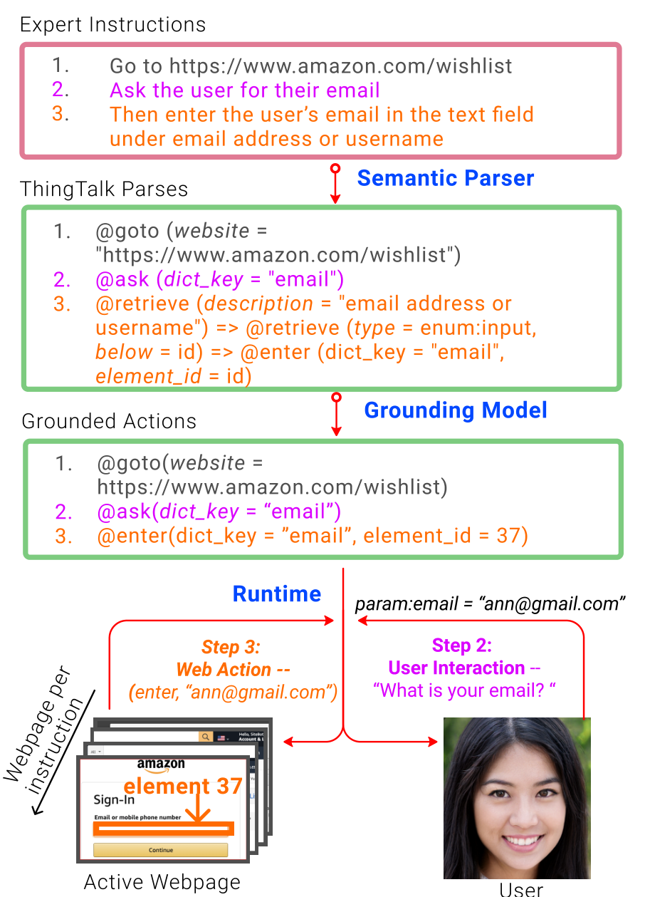
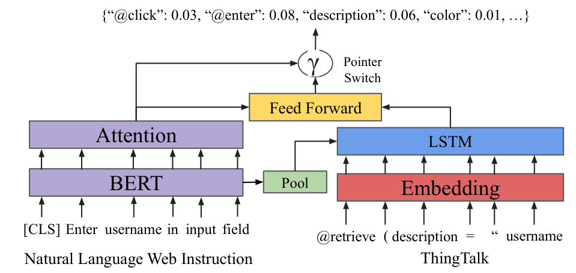
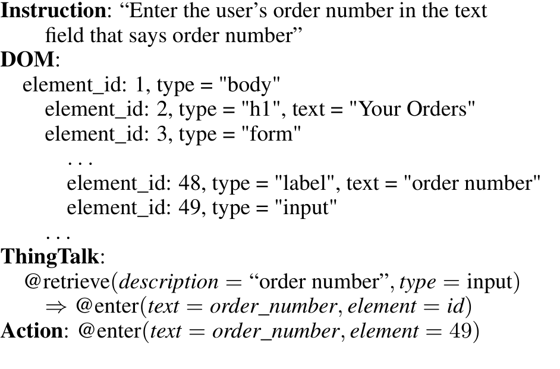
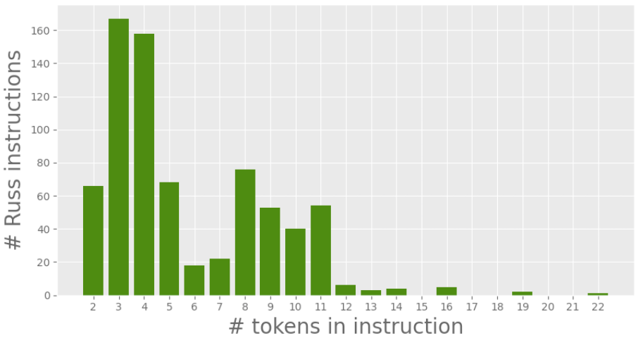
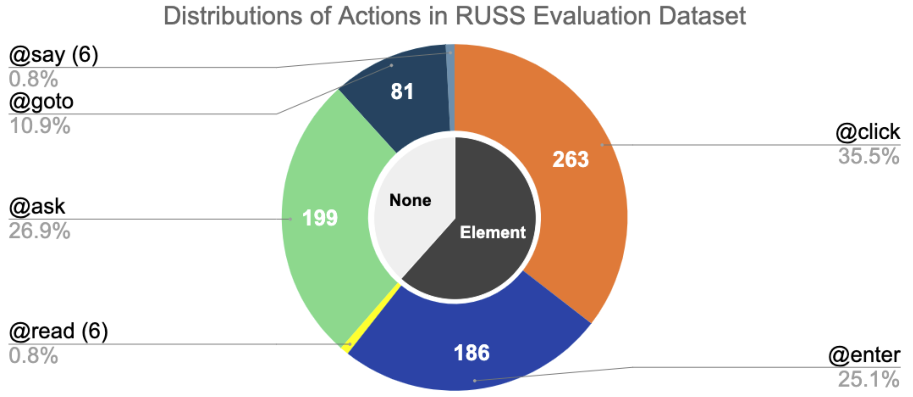
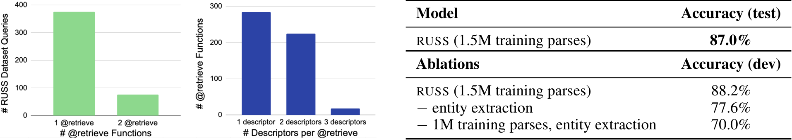
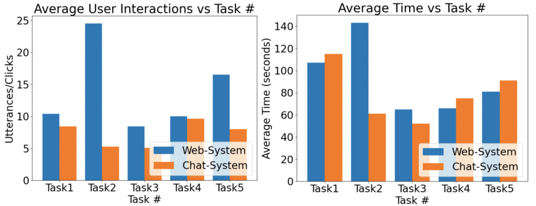
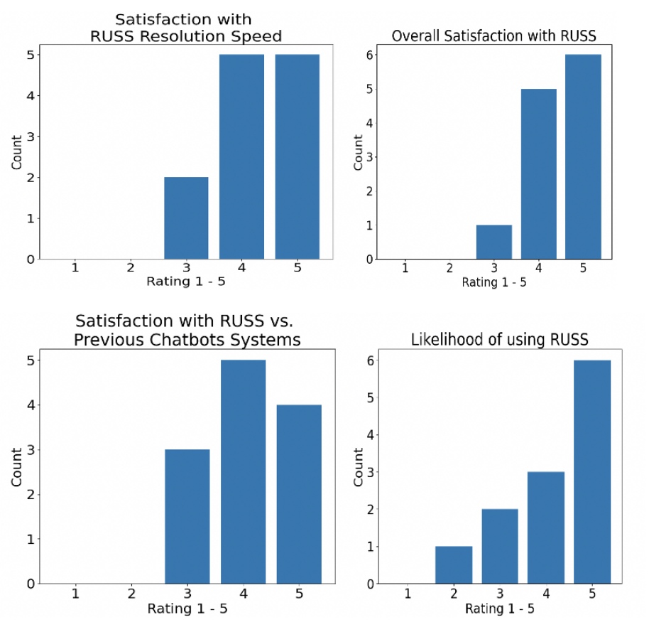

# Grounding Open-Domain Instructions to Automate Web Support Tasks

## 저자

Nancy Xu, Sam Masling, Michael Du, Giovanni Campagna, Larry Heck, James Landay, Monica S Lam

## 초록

웹에서 자연어 instruction을 grounding하여 이전에 보지 못한 작업을 수행하는 것은 접근성과 자동화를 가능하게 한다. 우리는 원래 사람들을 위해 작성된 open-domain의 단계별 instruction으로부터 AI agent를 훈련시키기 위한 작업과 dataset을 소개한다. 우리는 이 문제를 해결하기 위해 RUSS (Rapid Universal Support Service)를 구축한다. RUSS는 두 개의 model로 구성된다: 첫째, pointer를 가진 BERT-LSTM이 instruction을 웹에서 자연어를 grounding하기 위해 우리가 설계한 domain-specific language인 ThingTalk으로 parsing한다. 그런 다음, grounding model이 ThingTalk에서 요청된 모든 webpage element의 고유 ID를 검색한다. RUSS는 대화를 통해 사용자와 상호작용하거나(예: 주소 요청) 웹 runtime 내에서 웹 작업을 실행할 수 있다(예: 버튼 클릭). 훈련을 보강하기 위해, 우리는 ThingTalk에 매핑된 자연어 instruction을 합성한다. 우리의 dataset은 도움말 웹사이트에서 가져온 80개의 서로 다른 고객 서비스 문제로 구성되며, 총 741개의 단계별 instruction과 해당 action이 포함되어 있다. RUSS는 단일 instruction에서 agent action을 예측하는 데 76.7%의 end-to-end accuracy를 달성한다. ThingTalk 없이 instruction을 action에 직접 매핑하는 최신 model보다 우수한 성능을 보인다. 사용자 연구에 따르면 RUSS가 웹 navigation보다 실제 사용자들에게 선호된다.

---

## 1 서론

자연어를 grounding하는 것은 사람들과 원활하게 상호작용하는 robot과 AI agent [[5]](#ref-5)를 구축하는 핵심이다. 시각적으로 작업을 grounding하는 것 외에도 [[20]](#ref-20); [[31]](#ref-31), 미래의 AI agent는 웹에서 언어를 ground하고 action을 실행할 수 있어야 한다.

우리는 웹사이트에서 open-domain 자연어 instruction으로부터 작업을 숙달하는 범용 대화형 agent를 구축한다. 우리는 기프트 카드 사용, 모든 계정에서 로그아웃, 비밀번호 재설정과 같은 작업을 위한 서비스 도메인에 초점을 맞춘다.

언어 interface를 통해 웹에 대한 보편적 접근을 제공할 수 있는 대화형 agent는 정보 형평성을 달성하기 위한 중요한 단계이다. 이러한 agent는 시각 장애가 있거나 상황적으로 바쁜 사람들(예: 운전 중)이 그렇지 않으면 노트북이나 모바일 장치가 필요한 웹 기반 지식과 서비스를 얻을 수 있도록 지원한다 [[26]](#ref-26). 이미 가상 비서와 콜 센터는 기업과 사용자에게 웹 backend로 지원되는 언어 interface가 필요한 많은 시나리오를 보여준다. 그러나 가상 비서와 달리 RUSS와 같은 web agent는 보편적이며, 웹을 탐색하고 사용자와 상호작용하며 domain-specific API의 필요성을 우회한다.

평균적으로 미국인의 60% 이상이 한 달에 고객 서비스에 연락한 적이 있다 [[28]](#ref-28). 콜 센터 관리자는 비밀번호 재설정을 통해 고객을 도우려면 다음과 같이 agent에게 지시할 수 있다: 'passwordreset.com으로 이동; 사용자에게 원하는 새 비밀번호를 요청; 재설정 버튼 클릭'. agent가 백그라운드에서 웹에서 instruction을 수행하는 동안, 사용자는 대화 interface(예: 전화)를 통해 주기적으로 정보를 읽거나 질문을 받는다.

우리의 접근 방식인 RUSS(Figure 1)는 open-domain instruction에서 지정된 모든 웹 작업을 숙달하는 agent를 훈련시킨다. 이를 위해, 우리는 웹에서 grounding을 위한 domain-specific language(DSL)를 설계하고 ThingTalk programming language [[4]](#ref-4)의 subset으로 구현한다. 각 자연어 instruction은 사용자와 상호작용하거나 webpage에서 작동하는 6가지 agent action 중 하나에 매핑된다. 웹에서 작동하는 action에는 해당 ThingTalk을 active webpage에서 grounding하여 고수준 사용자 언어에서 검색된 element ID가 전달된다. 다음에서, 우리는 모호하지 않은 경우 웹 작업에 맞춤화된 우리의 subset을 지칭하기 위해 ThingTalk을 사용한다. 우리는 문제를 두 가지 구성 요소로 분해한다: (1) 단일 단계 자연어 instruction을 받아 BERT-LSTM pointer network를 사용하여 ThingTalk statement로 매핑하는 semantic parser, 그리고 (2) ThingTalk을 받아 필요한 경우 active webpage에서 element ID를 검색하는 grounding model.

이 연구의 기여는 다음과 같다:

1. **Task**: open-domain 자연어 instruction으로부터 작업을 숙달할 수 있는 대화형 web agent를 구축하는 새로운 문제.
2. **RUSS**: 자연어 instruction으로부터 사용자 지원 요청을 서비스하는 완전히 기능하는 agent. RUSS는 semantic parser, grounding model, 그리고 runtime으로 구성된다. 우리는 RUSS를 open-source repository로 공개한다.[^1](#fn-1)
3. **ThingTalk**: 웹에서 자연어 instruction을 ground하는 typed DSL. ThingTalk은 자연어 semantic parsing을 위한 표현력 있는 target이 되도록 설계되었으며, training data synthesis에 적합하다.

**[^1]** https://github.com/xnancy/russ
4. **RUSS Dataset**: a) Evaluation: 741개의 실제 단계별 자연어 instruction(원본 및 annotated) 모음과 각각에 대해: 해당 webpage DOM, ground-truth ThingTalk, 그리고 ground-truth action; 그리고 b) Synthetic: ThingTalk에 매핑된 1.5M 자연어 instruction의 synthetic dataset.
5. **RUSS 평가**: RUSS evaluation dataset에서 76.7% accuracy. 우리의 semantic parser는 자연어 instruction을 ThingTalk으로 85% accuracy로 매핑하고 우리의 grounding model은 web element description을 해결하는 데 75% accuracy를 달성한다. RUSS에 대한 사용자 연구는 기존 Web UI보다 자연어 interface에 대한 선호도를 보여준다.

## 2 관련 연구

**시각적 및 물리적 세계(Robotics)에서의 Grounding.** 물리적 세계 [[5]](#ref-5)와 이미지 및 비디오([[31]](#ref-31), [[9]](#ref-9))에서 언어를 grounding하는 것은 visual question-answering [[2]](#ref-2)과 같은 시스템을 통해 광범위하게 탐구되었다. 예를 들어, Thomason et al. [[30]](#ref-30)은 인간과 robot이 물리적 환경에서 여러 객체 중 하나를 번갈아 설명하는 'I Spy' 게임을 설명하며, 이는 자연어를 물리적 세계에 grounding해야 하고, robot-human dialogue는 [[29]](#ref-29)에서 탐구된다. 이전 연구는 [[18]](#ref-18), [[11]](#ref-11); [[18]](#ref-18), [[12]](#ref-12), 그리고 [[13]](#ref-13)과 같은 동적 환경에서 robot을 위한 적응형 언어 interface를 제안했다. 다른 연구는 순차적 action을 통해 작동하는 물리적 세계 agent를 구축한다 [[5]](#ref-5); [[21]](#ref-21); [[20]](#ref-20).

**자연어 디지털 Interface.** 인간과 협력하여 작업을 완료하는 지능형 자동화 소프트웨어 비서는 [[1]](#ref-1)에서 처음 소개되었다. 그 이후로, 자연어 command에서 UI component를 식별하는 것은 grounding의 중요한 연구 영역이었으며, 이전 연구는 자연어 instruction을 Android [[17]](#ref-17) 및 Adobe 사진 편집 GUI [[19]](#ref-19)와 같은 모바일 interface에 매핑하는 접근 방식을 조사했다. 이전 연구는 자연어

Table 1: WebLang Agent Actions and a Grounding Function

| Agent Action                                                                      | 설명                                                                                       |
|-----------------------------------------------------------------------------------|---------------------------------------------------------------------------------------------------|
| @goto( url )                                                                      | 주어진 URL로 이동                                                         |
| @enter( element_id , dict_key )                                                   | 주어진 dictionary key에 가장 가까운 일치 항목을 찾아 해당 값을 주어진 input element에 입력 |
| @click( element_id )                                                              | 주어진 element를 클릭                                                                        |
| @read( element_id )                                                               | 주어진 element의 내용을 사용자에게 읽어줌                                                 |
| @say( message )                                                                   | 주어진 메시지를 사용자에게 읽어줌                                                |
| @ask( dict_key )                                                                  | 사용자에게 dictionary key의 값을 요청                                                    |
| Grounding Function                                                                | 설명                                                                       |
| @retrieve( descr , type , loc , above , below , right_of , left_of ) : element_id | descriptor와 일치하는 element를 검색하여 element_id를 반환                          |

command를 어휘적 및 gesture intent의 조합을 통해 TV 화면의 web element에 매핑했다 [[8]](#ref-8). 보다 최근에, Pasupat et al. [[22]](#ref-22)은 Amazon Mechanical Turker가 작성한 자연어 command를 web element에 매핑하려고 시도했다(action 없이). 이전 연구와 달리, 우리의 연구는 자연어 instruction을 웹에서 실행 가능한 action으로 parsing하는 새로운 도메인에 초점을 맞추며, neural model을 사용하여 element에 직접 매핑하는 대신 웹 navigation과 사용자 상호작용을 지원하는 formal action으로 자연어 instruction을 semantic parsing한다.

**웹을 위한 Dialogue Agent.** 다른 웹 기반 dialogue agent는 single-use heuristic과 보다 최근에는 programming-by-demonstration(PBD) 도구를 통해 개발된다. 이 접근 방식은 사용자와 개발자가 웹에서 작동하는 프로그램을 작성하고 자연어로 해당 프로그램을 호출할 수 있게 한다 [[15]](#ref-15); [[16]](#ref-16); [[7]](#ref-7); [[25]](#ref-25). CoScripter [[14]](#ref-14)는 추가로 사용자가 자연어로 demonstration을 편집할 수 있게 하고, 제한된 자연어를 실행 가능한 형태로 parsing한다. 최종 목표와 관련이 있지만, 우리의 연구는 사용자 demonstration을 필요로 하지 않으며 기존의 실제 instruction을 사용하여 작동할 수 있다. 그러나 WebLang intermediate representation과 우리의 grounding model은 PBD 시스템의 견고성을 개선하는 데도 사용될 수 있다.

## 3 Task와 Model

자연어 instruction 집합 $S = (i_1, \ldots, i_n)$과 시작 webpage가 주어지면, 우리의 task는 일련의 action $A = (a_1, \ldots, a_n)$을 통해 instruction을 따르는 agent를 구성하는 것이다. Action에는 필요한 정보를 얻기 위한 웹 navigation과 최종 사용자 상호작용이 포함된다. 온라인 고객 서비스 작업을 조사한 결과, agent에게 필요한 6가지 action 작업이 확인되었다: URL 페이지 열기, 텍스트 입력, 버튼 클릭, 사용자에게 말하기, 결과를 사용자에게 읽기, 사용자에게 정보 요청. 세부 사항은 Table 1에 설명되어 있으며, webpage의 element에는 고유한 element ID가 할당된다고 가정한다.

RUSS는 웹에서 자연어 instruction을 grounding하여 작업을 실행하도록 훈련된다. 별도의 semantic parser와 grounding model을 갖춘 RUSS의 modular 설계는 training data 획득의 높은 비용과 각 component를 독립적으로 개선할 수 있는 능력에 의해 동기 부여된다.

먼저 ThingTalk을 설명한 다음, RUSS의 세 가지 component인 semantic parser model, grounding model, 그리고 runtime을 설명한다.

## 3.1 ThingTalk

ThingTalk은 (1) open-domain 자연어에 대해 견고하고, (2) 자연어로부터의 semantic parsing을 위한 적절한 target이며, (3) synthetic data만으로 훈련 가능하도록 설계되었다.

ThingTalk의 primitive에는 모든 agent action과 grounding function @retrieve가 포함된다(Table 1). 후자는 우리가 실제로 발견한 instruction의 description에 의해 결정된다. @retrieve가 받아들이는 input feature는 다음과 같다:

- descr : element의 텍스트 description
- type : element 유형(button, input box, paragraph, header 등)
- loc : 페이지에서 element의 절대 위치
- above/below/... : 다른 element에 상대적인 element의 위치; above, below, right, left.

여러 feature나 다른 element를 포함하는 element description을 지원하기 위해, ThingTalk은 com-

positional하게 설계되었다. ThingTalk 프로그램은 구문 $[r \Rightarrow]^* a$를 가진 statement의 sequence이며, 여기서 $r$은 retrieve 작업이고 $a$는 agent action이다. `@retrieve`는 `@click`(element를 클릭), `@read`(element의 텍스트를 사용자에게 읽음), 또는 `@enter`(element에 텍스트를 입력)에 전달되는 `element_id`를 반환한다. element id가 필요한 agent action의 경우, agent action에서 사용되는 최종 element id를 얻는 데 사용되는 `@retrieve` function의 sequence를 *query*라고 한다. 자연어 instruction에서 sample ThingTalk parse는 Figure 1을 참조하라. 주황색 ThingTalk parse는 2개의 `@retrieve` function을 사용하는 query를 보여준다.

## 3.2 Semantic Parser Model

자연어 instruction을 ThingTalk으로 번역하기 위해, 우리는 이전에 제안된 BERT-LSTM model [[32]](#ref-32)을 사용한다. BERT-LSTM은 pretrained BERT encoder [[6]](#ref-6)와 pointer-generator [[27]](#ref-27); [[23]](#ref-23)를 가진 LSTM [[10]](#ref-10) decoder를 사용하는 encoder-decoder network이다. architecture는 Fig. 2에 나와 있다. model은 자연어 utterance를 encode하고 ThingTalk code를 token별로 생성하도록 훈련된다. decoder의 pointer network는 model이 input utterance에서 복사하여 out-of-vocabulary 단어를 예측할 수 있게 한다.

우리는 entity extraction을 수행하여 자연어를 preprocessing하며, entity string은 placeholder token(URL, LOC, TYPE)으로 매핑되고, placeholder token으로 parsing한 후 string은 ThingTalk code에 다시 대체된다. 이는 긴 URL이 항상 함께 ThingTalk에 복사되지 않는 token으로 분할되는 것과 관련된 오류를 해결하고 중요한 input feature를 명확하게 하는 데 도움이 된다. 예를 들어: "Click the button on the top of the amazon.com

page"는 "Click the TYPE on the LOC of the URL page"로 매핑된다. 우리는 각 placeholder token의 entity string을 식별하기 위해 'www.', '.com', 'http' substring의 존재와 같은 간단한 heuristic 세트를 사용하여 URL entity를 나타낸다.

## 3.3 Grounding Model

webpage는 페이지의 모든 element에 대한 계층적 표현인 Document Object Model(DOM)을 사용하여 modeling된다. 우리의 DOM 표현은 각 element에 대해 다음과 같은 element feature를 기록한다:

- element의 inner text content
- HTML id, tag, class
- hidden state(element가 webpage에서 visible한 경우 True/False)
- element의 height/width
- element의 left/right/top/bottom 좌표
- DOM에서 child element 목록.

예시는 Fig. 3에 나와 있다.

RUSS의 grounding model은 ThingTalk @retrieve function을 element ID에 매핑하여 ground한다. @retrieve function의 input feature는 최적의 일치를 식별하기 위해 DOM의 element feature에서 파생된 score에 대해 매핑된다.

grounding model은 다음 단계로 구성된다. 유형과 절대 위치로 element를 필터링한다. 다음으로 주어진 element의 좌표에서 올바른 관계 context를 가지고 너무 멀리 떨어지지 않은 element를 식별하여 상대 위치를 처리한다. 나머지 candidate의 텍스트를 SentenceBERT [[24]](#ref-24) neural network를 통해 전달하고 input text description의 embedding과 embedding의 cosine similarity를 계산한다. 가장 높은 score를 가진 element가 반환된다.

## 3.4 Run-Time

grounded ThingTalk 프로그램을 실행하기 위해, RUSS는 각 작업에 대해 새로운 자동화된 Chrome 세션을 시작하고 Puppeteer를 사용하여 브라우저에서 웹 action을 자동화한다. RUSS는 사용자 상호작용(@say, @ask, 또는 @read)을 포함하는 action을 구현하기 위해 Google Voice API를 사용한다. @ask action의 경우, RUSS는 사전 프로그래밍된 dialogue를 사용하여 사용자에게 dictionary key(예: 'name')를 요청하고, dictionary key가 유효한 string인지 확인하며, 사용자가 제공한 값을 해당 key 아래 사용자 dictionary에 저장한다. @enter action에서, 우리는 입력할 정보를 사용자 dictionary key 중 가장 가까운 일치 항목을 찾아 검색한다.

## 4 Dataset

이 논문은 실제 instruction이 포함된 RUSS Evaluation Dataset과 semantic parser 훈련을 위한 RUSS Synthetic Dataset 두 가지 dataset을 기여한다.

## 4.1 RUSS Evaluation Dataset

RUSS Evaluation Dataset은 인기 있는 온라인 회사의 고객 서비스 도움말 센터에서 가져온 실제 작업으로 구성된다. 우리의 task를 open domain으로 만들기 위해, 우리가 사용하는 온라인 도움말 센터는 음악, 이메일, 온라인 소매, 소프트웨어 애플리케이션 등 다양한 도메인에 걸쳐 있다. 작업의 각 instruction에 대해, dataset에는 다음이 포함된다:

- 원본 웹사이트에 나타나는 자연어 영어 instruction과 사람이 편집한 버전의 instruction
- instruction을 실행할 수 있는 webpage의 DOM, 각 element와 관련된 element feature 포함
- instruction에 해당하는 ThingTalk code
- instruction의 grounded action

RUSS Evaluation dataset을 수집하기 위해, 우리는 '가장 많이 방문한 100개 웹사이트' 목록을 확보하고 그 중에서 줄별 도움말 instruction을 제공하는 작업을 찾는다. 논문의 저자가 각 작업을 따라가며 지시대로 action을 수행하고 브라우저에서 webpage를 scrape하고 해당 ThingTalk code로 instruction을 annotate했다. instruction에서 누락된 단계가 발견되면 삽입되었다. instruction이 여러 action에 매핑되면, 텍스트가 개별

instruction으로 분할되었다. 참고로 human worker는 ThingTalk 설계에 참여하지 않았다; 그들은 다른 사람에게 단계별로 가르치는 것처럼 instruction을 작성하도록 요청받았다.

우리는 22개의 서로 다른 온라인 도움말 센터에서 총 80개의 작업과 741줄의 instruction을 수집했다. dataset은 dev set과 test set으로 분할되며, dev set에는 30개 작업에서 304개의 instruction이 있고 test set에는 50개 작업에서 437개의 instruction이 있다. RUSS Evaluation dataset은 training에 사용되지 않는다. 평균적으로 RUSS의 instruction에는 9.6개의 token이 포함되어 있으며(Fig. 4), 이는 평균 4.1개의 token을 가진 PhraseNode의 crowdsource된 웹 instruction보다 상당히 길다. dataset에서 가장 흔한 세 가지 action은 'click', 'ask', 'enter'이다(Fig. 5). 자연어 instruction의 61.4%가 webpage에서 element를 검색해야 한다(click, enter, read). Table 2는 @retrieve descriptor가 지원하는 다양한 유형의 reasoning과 RUSS Evaluation Dataset에서의 빈도를 보여준다. 마지막으로, 455개의 element query 중 76개가 두 개의 @retrieve function을 사용하며, 나머지는 모두 하나만 사용하고, @retrieve function의 53.7%, 42.7%, 3.6%가 각각 1개, 2개, 3개의 descriptor를 가진다(Fig. 6).

언어는 7개의 핵심 action만 가지고 있지만, 가능한 action과 web element의 combinatorial space는 훨씬 크다 - instruction당 수천 개의

Table 2: ThingTalk이 지원하는 reasoning 유형의 subset(이를 나타내는 데 사용되는 @retrieve input feature 포함)과 RUSS dataset에서의 빈도. 일부 statement는 여러 reasoning 유형을 필요로 한다.

| ThingTalk 포함: (@retrieve feature)       | 설명                                         | 빈도   |
|-----------------------------------------------|-----------------------------------------------------|-------------|
| Type reasoning (type)                         | 특정 HTML type 필요(예: button, checkbox) | 29.0%       |
| Input target (type = input)                   | target element가 text input이어야 함             | 25.0%       |
| Relational reasoning (below/above/left of...) | element의 인접 feature를 참조      | 10.3%       |
| Spatial reasoning (location)                  | webpage에서 element 위치를 참조          | 4.6%        |
| No web element (No @retrieve)                 | element 없음(작업은 @ask / @goto / @say)       | 38.6%       |

가능한 조합 순서. 평균적으로 webpage의 DOM에는 각각 689개의 web element가 포함되어 있다.

실제로 발견된 Evaluation Dataset의 총 vocabulary 크기는 684개 단어이다. 우리는 Evaluation vocabulary에서 가장 빈번한 300개 단어 중 적어도 하나가 Evaluation Dataset instruction의 50% 이상에 존재한다는 것을 발견했다. instruction 전반에 걸쳐 많은 domain-specific 단어도 있다.

## 4.2 Synthetic Dataset

훈련을 위해 ThingTalk으로 많은 수의 instruction을 labeling하는 것은 시간이 많이 걸리고 전문 지식이 필요하다. 이를 해결하기 위해, 우리는 typed template-based synthesis 방법을 사용하여 training data를 생성한다. 우리는 각 ThingTalk primitive와 그 일반적인 조합에 대한 template을 작성한다. 또한 자연적으로 발생하는 DOM element 텍스트, webpage URL, 그리고 각 parameter에 사용할 variable name일 가능성이 있는 phrase의 대규모 dataset을 scrape한다. synthesizer는 template을 compositionally하게 확장하고 scrape된 dataset에서 값을 sample하여 ThingTalk에 매핑된 instruction의 대규모 training set을 자동으로 구성한다. 우리는 수백 가지 유형의 자연어 template을 생성하며 이를 결합하여 1.5M training sample이 있는 Synthetic Dataset을 만든다. 이 composition 방법은 대략 840개의 고유한 template을 생성한다. model의 일반화 가능성을 촉진하기 위해, Synthetic corpus의 총 vocabulary 크기는 evaluation vocabulary 크기에 비해

Table 3: RUSS Evaluation test set에서 Semantic Parsing Model(1.5M parse로 훈련됨)의 평가. Ablation은 dev set에서 수행된다. Ablation에서 '-'는 RUSS model에서 feature를 뺀 것이며, 두 번째 ablation은 500k training parse로 훈련된다.

| Model                                   | Accuracy (test)   |
|-----------------------------------------|-------------------|
| RUSS (1.5M training parses)             | 87.0%             |
| Ablations                               | Accuracy (dev)    |
| RUSS (1.5M training parses)             | 88.2%             |
| - entity extraction                     | 77.6%             |
| - 1M training parses, entity extraction | 70.0%             |

9305개 단어로 크다.

간단한 template의 예는 다음과 같다:

'At the loc of the page,

@click the button that says descr '

이는 다음 ThingTalk에 매핑된다:

@retrieve( descr = descr , loc = loc ) -> @click (element = id)

## 5 평가

RUSS는 semantic parser를 포함한 RUSS의 모든 것이 synthetic data만으로 훈련되었음에도 불구하고 Evaluation Dataset에서 76.7%의 overall accuracy를 달성한다.

우리는 개별 component와 전체 시스템을 평가하기 위해 3가지 실험을 수행한다: 1) ablation study와 함께 RUSS Parsing Model의 accuracy 평가. 2) RUSS Grounding Model의 accuracy 평가 및 baseline 비교. 3) 5개 작업을 on-the-job으로 숙달하는 RUSS의 능력을 평가하는 사용자 연구. 기존 고객 서비스 도움말 웹사이트와 비교하여 RUSS의 usability와 efficacy를 테스트한다.

## 5.1 Semantic Parsing Accuracy

첫 번째 실험은 RUSS Evaluation dataset에서 우리 semantic parser의 accuracy를 평가한다. 우리는 Exact Match Accuracy를 측정한다: parse가 gold annotation과 token별로 일치하는 경우에만 정확한 것으로 간주된다.

Table 4: RUSS는 RUSS Evaluation test set의 grounding subtask에서 최신 PhraseNode를 능가한다.

| Model               | Grounding Acc (test)   |
|---------------------|------------------------|
| RUSS                | 63.6%                  |
| End-to-End Baseline | 51.1%                  |
| PhraseNode          | 46.5%                  |

결과는 Table 3에 나와 있다. parser는 test set에서 87.0% accuracy를 얻는다. 실제 training data를 사용하지 않았음에도 불구하고, semantic parser는 어려운 evaluation set에서 높은 accuracy를 달성한다. web element를 포함하는 instruction에 대해 81.4%의 accuracy를 달성하고, 나머지에 대해 94.6%를 달성한다. 이는 semantic parser가 두 유형의 instruction을 모두 높은 accuracy로 처리할 수 있음을 시사하며, 특히 사용자 상호작용(web element 없음)으로 parse되는 instruction에서 그렇다.

Table 3에서 볼 수 있듯이 RUSS Evaluation dev set에서 ablation study를 수행한다. RUSS는 dev set에서 88.2% accuracy를 달성한다. Section 3.2에서 논의한 대로 training 중에 string entity가 placeholder로 대체되는 entity extraction 기술은 accuracy에서 10.6% 향상에 기여한다. 이 preprocessing 단계 없이 500K parse만으로 training하면 accuracy가 7.6% 더 감소한다. 이는 대규모 synthetic training data set을 갖는 것이 중요함을 시사한다.

## 5.2 Grounding 평가

ThingTalk에 대한 효과적인 semantic parser를 사용하여, 다음으로 grounding accuracy를 측정한다: RUSS test set의 web element를 참조하는 252개의 자연어 command에서 올바르게 식별된 `element_id`의 비율. Table 4에서 볼 수 있듯이, RUSS는 63.6%의 accuracy를 달성한다. instruction의 81.4%가 올바르게 parse되고, 올바른 parse의 77.9%가 정확하게 ground된다. semantic parser가 100% 정확했다면, Grounding Model은 73.0%의 accuracy를 달성했을 것이다. semantic parser는 "click sign in"과 같은 간단한 instruction을 올바르게 parse할 가능성이 높으며, 이는 일반적으로 Grounding Model에서도 더 쉬워서 77.9%와 73.0% 사이의 차이를 설명한다.

우리는 RUSS의 2단계 접근 방식과 비교하기 위해 End-to-end Baseline model을 만든다. 여기서, 우리는 이전과 같이 RUSS의 feature element를 사용하여 web element를 표현한다. 그러나 우리는 자연어 문장을 RUSS의 input feature로 parse하지 않고, 그대로

Table 5: RUSS Evaluation test set에서 Reasoning 유형별 RUSS와 PhraseNode의 Grounding Accuracy 비교.

| Reasoning   | RUSS   | PhraseNode   |
|-------------|--------|--------------|
| Type        | 67.8%  | 61.5%        |
| Input       | 75.6%  | 60.4%        |
| Relational  | 70.0%  | 53.5%        |
| Spatial     | 36.7%  | 30.3%        |

Sentence-Bert에 대한 input으로 그대로 둔다. Section 4.3과 마찬가지로, input 문장과 가장 가까운 embedding을 공유하는 element가 반환된다. 이 end-to-end baseline model은 RUSS보다 12.6% 낮은 accuracy로 수행되어, semantic parser를 사용하는 이점을 보여준다.

우리의 grounding model을 최신 결과와 비교하기 위해, [[22]](#ref-22)에서 가장 성능이 좋은 embedding model도 복제하며, 이를 PhraseNode라고 참조한다. PhraseNode에서 input으로 사용되는 webpage feature는 우리 표현의 subset이다. PhraseNode는 46.5%의 accuracy를 달성하며, 이는 우리 Baseline보다 4.6% 낮고 RUSS보다 17.2% 낮다. 우리는 고성능 semantic parser와 잘 조정된 grounding model의 조합이 웹에서 grounding을 위한 최고의 end-to-end neural model을 능가할 수 있음을 보여준다.

## 5.3 분석

RUSS 훈련을 위한 전체 일회성 프로세스는 NVIDIA Tesla V100에서 약 7시간이 소요된다. RUSS는 1분 이내에 semantic parser를 통해 instruction을 실행하여 on-the-job으로 새 작업을 수행할 수 있다.

우리는 RUSS와 PhraseNode가 다른 유형의 reasoning을 필요로 하는 Evaluation Set의 문장에 대해 얼마나 잘 수행하는지 분석한다(Table 5). RUSS는 모든 reasoning 유형에 대해 최신 PhraseNode [[22]](#ref-22)를 능가한다. type, input, relational reasoning을 포함하는 grounding 작업에서 잘 수행된다. spatial reasoning instruction의 평가 결과 많은 것이 이미지 feature(예: 'click the hamburger menu icon')를 참조하며, 이는 RUSS에서 지원되지 않는다. 결과는 ThingTalk이 neural language model에 의해 생성될 만큼 충분히 간단하면서도 웹 작업을 위한 광범위한 open-domain 자연어 instruction을 표현할 만큼 충분히 포괄적임을 보여준다.

길고 복잡한 instruction에 어려움을 겪는 end-to-end model과 달리, 우리는 RUSS가 잠

Table 6: RUSS 사용자 연구의 작업

| # 1   | Amazon 기프트 카드 사용         |
|-------|---------------------------------|
| # 2   | Pinterest 광고 계정 번호 얻기 |
| # 3   | 모든 Spotify 계정에서 로그아웃 |
| # 4   | 새 Walmart 계정 생성      |
| # 5   | Google 피드백 보내기            |

재적인 element candidate 세트를 제한하는 instruction의 추가 reasoning에서 이점을 얻는다는 것을 발견했다(예: 'the element must be an input'). Webpage에는 일반적으로 수천 개의 element가 있으며 올바른 element와 일치할 확률은 제약 조건에 따라 증가한다.

RUSS dataset의 741개 instruction 중 6개는 ThingTalk에서 잘 표현되지 않는 attribute를 포함한다. 예를 들어, 'select the user's birth month in the month drop down'은 ThingTalk에 메뉴에서 element를 선택하는 개념이 없기 때문에 올바르게 parse되지 않는다. 이 feature는 향후 추가될 예정이다.

또 다른 오류의 원인은 webpage가 구성되는 방식에 있다. grounding에 필요한 중요한 attribute가 class 뒤에 숨겨질 수 있다. 예를 들어, element가 'Click here'라고 레이블되어 있지만 텍스트가 DOM text attribute에 존재하지 않고 대신 "next-page-button"과 같은 site-specific class name 뒤에 가려져 있을 수 있다. 시각적 데이터에 대한 grounding 기술은 이러한 종류의 문제를 해결하는 데 도움이 될 수 있다.

## 5.4 사용자 연구

사용자 연구의 목표는 실제 고객 서비스 웹사이트의 open-domain instruction에 대한 RUSS의 end-to-end 실현 가능성을 평가하고 사용자가 RUSS에 어떻게 반응하는지 평가하는 것이다. 이것은 유망한 초기 결과를 가진 소규모 연구이지만, 더 큰 집단에 대한 추가 사용자 연구가 도움이 될 수 있다.

우리는 RUSS와 브라우저 모두를 사용하여 5가지 고객 지원 작업(Table 6)을 완료하도록 요청받은 12명의 참가자를 모집했다. 이 작업은 인기 있는 웹사이트인 Amazon, Spotify, pinterest, Google, Walmart에서 선택되었다. 모든 작업에서 사용자에게 agent와 상호작용할 때 사용할 가짜 페르소나(이메일, 비밀번호, 기프트 카드 코드 등의 자격 증명 세트)가 제공되었다. 연구는 우리 IRB의 승인을 받았으며 참가자들은 보상을 받았다.

우리 연구의 참가자들은 21세에서 68세 사이였으며, 평균 연령은 36세, 남녀 비율은 50/50이었고, 기술적 숙련도가 다양했다. 학습 효과를 줄이기 위해,

우리는 Latin Square Balancing [[3]](#ref-3)을 사용하여 각 사이트의 웹 및 RUSS 시험이 절반의 시간 동안 먼저 수행되도록 했다. 우리는 각 작업을 수행하는 데 걸린 사용자의 시간, 각 작업을 달성하는 데 필요한 턴 수(RUSS) 또는 클릭 수(웹)를 기록하고, 각 참가자에게 질적 평가가 포함된 설문 조사를 제공했다.

참가자들은 웹에서 스스로 85%의 작업을 완료할 수 있었고 RUSS의 도움으로 98%의 작업을 완료했다. 작업을 완료하지 못한 사람들은 포기했거나 5분 이내에 작업을 완료하지 못했다. 사용자가 각 작업을 완료하는 데 걸린 시간은 Web과 RUSS에서 비슷했지만(Fig. 7), RUSS는 사용자들이 익숙하지 않다고 말한 더 복잡한 작업인 Task 2에서 상당히 빨랐다. 이는 RUSS가 익숙하지 않고 복잡한 작업에 더 유리하다는 것을 나타내는 것 같다.

5가지 작업을 시도한 후, 69%의 사용자가 온라인 도움말 페이지를 탐색하는 것보다 RUSS를 선호한다고 보고했다. 언급된 이유로는 완료 시간이 비슷했음에도 불구하고 사용 편의성, 효율성, 속도가 포함된다. 참가자들은 일반적으로 RUSS 경험에 만족했으며, 단 한 사람만 RUSS를 다시 사용하지 않을 것 같다고 말했다(Fig. 8). 그러나 많은 사용자들이 RUSS가 브라우저만큼 시각적으로 자극적이었으면 좋겠다고 보고했다. 다른 사용자들은 브라우저가 더 익숙하고 편안하다고 언급했다.

마지막 논의로, 사용자 연구 결과가 매우 유망하지만 이것은 소규모 연구라는 점에 주목할 가치가 있다. RUSS의 runtime은 context를 벗어난 대화에 대한 더 강력한 error handling이 필요하다. 현재 RUSS는 종료하기 전에 사용자에게 예상된 응답을 반환할 3번의 시도를 제공한다. RUSS는 또한 Puppeteer에서 webpage가 로드되는 데 60초 이상 걸리면 timeout된다. 사용자가 작업을 완료하지 못한 몇 가지 경우에서 RUSS 사용자 연구에서 이 두 가지 상황의 instance를 보았다.

## 6 결론

RUSS는 semantic parser와 grounding model을 사용하여 자연어 instruction으로부터 보지 못한 웹 작업을 수행할 수 있음을 보여준다. RUSS Evaluation Dataset에서 76.7% accuracy를 달성함으로써, 우리는 modular semantic parsing 접근 방식이 이 작업에서 end-to-end neural model을 능가할 수 있음을 보여주고, 사용자 연구에서 인간이 RUSS와 같은 시스템과 어떻게 상호작용하는지 보여준다. NLP의 많은 dataset과 마찬가지로, RUSS의 Evaluation Dataset에서 76.6% overall accuracy에서 100%로 가기 위해서는 여전히 광범위한 연구가 필요하다고 생각한다. Table 4에서 볼 수 있듯이, PhraseNode와 같은 이전 model은 46.5% grounding accuracy만 달성하며, 이는 웹에서 자연어를 grounding하는 데 추가 작업이 필요함을 지적한다.

RUSS Evaluation dataset은 향후 연구를 평가하기 위해 언어를 웹에서 실행 가능한 action으로 grounding하기 위한 실제 instruction 세트를 소개하며, 여기에는 실제 instruction을 사용하여 새로운 target에 semantic parser를 훈련시키는 것과 웹에서 formal language representation을 grounding하기 위한 neural model이 포함된다. 우리의 연구는 RUSS와 같은 open-domain web agent를 개발하기 위한 작업, 기술적 기반, 사용자 연구를 제공한다.

## 7 윤리적 고려사항

이 논문에서 수행된 사용자 연구는 Institutional Review Board에 제출되었으며 IRB Exempt 상태를 받았다. 모든 참가자는 사용자 연구 전에 연구 세부 사항을 자세히 설명하는 IRB 동의서를 읽었다. 연구에는 기만이 포함되지 않았다: 모든 참가자는 사용자 연구의 대화 부분에서 AI agent를 평가하고 있다는 것을 알았으며 그렇지 않다고 믿도록 유도되지 않았다. 연구는 약 20분이 소요되었다. 모든 참가자는 $10로 보상받았다.

RUSS dataset을 위해 scrape된 webpage는 모두 public domain webpage이다. webpage를 얻기 위해 개인 식별 정보가 사용되지 않았다. 페이지에 접근하기 위해 계정이 필요한 웹사이트에서, 우리는 관련될 수 있는 개인 정보 위험을 제한하기 위해 비식별 사용자 이름/비밀번호/이메일로 가짜 사용자 계정을 만들어 웹사이트를 탐색했다.

미래에, 우리는 RUSS와 같은 web agent가 시각 장애가 있거나 기술적으로 덜 발전했거나 그렇지 않으면 바쁜 개인이 정보에 대한 공평한 접근을 받을 수 있도록 도와 접근성을 개선하는 것을 본다. RUSS와 같은 시스템이 대규모로 실행되기 전에, 저자들은 시스템 오류의 downstream 결과로부터 보호하고 건강이나 금융과 같은 잠재적으로 고위험 거래에서 운영되는 AI agent가 어떻게 정보를 효과적으로 전달할 수 있는지 더 잘 이해하기 위해 web agent와의 사용자 행동을 이해하는 데 더 많은 연구가 수행되어야 한다고 믿는다. 우리의 사용자 연구는 이 방향의 첫 번째 단계이다.

## 8 감사의 말

Synthetic dataset 구성에 대한 유용한 논의를 해준 Silei Xu와 최종 출판물의 피드백과 검토를 해준 Richard Socher에게 감사드린다.

이 연구는 부분적으로 National Science Foundation Grant No. 1900638과 Alfred P. Sloan Foundation Grant No. G-2020-13938의 지원을 받았다.

이 자료에 표현된 모든 의견, 발견, 결론 또는 권장 사항은 저자들의 것이며 반드시 외부 조직의 견해, 정책 또는 지지를 반영하지 않는다.

## References

**[1]** James Allen, Nathanael Chambers, George Ferguson, Lucian Galescu, Hyuckchul Jung, Mary Swift, and William Taysom. 2007. Plow: A collaborative task learning agent. In *2007 AAAI Conference on Artificial Intelligence (AAAI)*, pages 1514-1519. AAAI.

**[2]** Stanislaw Antol, Aishwarya Agrawal, Jiasen Lu, Margaret Mitchell, Dhruv Batra, C Lawrence Zitnick, and Devi Parikh. 2015. VQA: Visual question answering. In *Proceedings of the IEEE International Conference on Computer Vision*, pages 2425-2433.

**[3]** James V. Bradley. 1958. Complete counterbalancing of immediate sequential effects in a latin square design. pages 525-528.

**[4]** Giovanni Campagna, Silei Xu, Mehrad Moradshahi, Richard Socher, and Monica S. Lam. 2019. Genie: A generator of natural language semantic parsers for virtual assistant commands. In *Proceedings of the 40th ACM SIGPLAN Conference on Programming Language Design and Implementation*, PLDI 2019, pages 394-410, New York, NY, USA. ACM.

**[5]** David L. Chen and Raymond J. Mooney. 2011. Learning to interpret natural language navigation instructions from observations. In *Proceedings of the 25th AAAI Conference on Artificial Intelligence (AAAI-2011)*, pages 859-865.

**[6]** Jacob Devlin, Ming-Wei Chang, Kenton Lee, and Kristina Toutanova. 2019. BERT: Pre-training of deep bidirectional transformers for language understanding. In *Proceedings of the 2019 Conference of the North American Chapter of the Association for Computational Linguistics: Human Language Technologies, Volume 1 (Long and Short Papers)*, pages 4171-4186, Minneapolis, Minnesota. Association for Computational Linguistics.

**[7]** Michael H Fischer, Giovanni Campagna, Euirim Choi, and Monica S Lam. 2020. Multi-modal end-user programming of web-based virtual assistant skills. [arXiv:2008.13510](https://arxiv.org/abs/2008.13510).

**[8]** Larry Heck, Dilek Hakkani-Tur, Madhu Chinthakunta, Gokhan Tur, Rukmini Iyer, Partha Parthasarathy, Lisa Stifelman, Elizabeth Shriberg, and Ashley Fidler. 2013. Multi-modal conversational search and browse. In *First Workshop on Speech, Language and Audio in Multimedia*.

**[9]** Lisa Anne Hendricks, Ronghang Hu, Trevor Darrell, and Zeynep Akata. 2018. Grounding visual explanations. In *European Conference on Computer Vision*, pages 269-286. Springer.

**[10]** Sepp Hochreiter and Jurgen Schmidhuber. 1997. Long short-term memory. *Neural Computation*, 9(8):1735-1780.

**[11]** Nobuhiro Ito, Yuya Suzuki, and Akiko Aizawa. 2020. From natural language instructions to complex processes: Issues in chaining trigger action rules. [arXiv:2001.02462](https://arxiv.org/abs/2001.02462).

**[12]** Siddharth Karamcheti, Dorsa Sadigh, and Percy Liang. 2020. Learning adaptive language interfaces through decomposition. [arXiv:2010.05190](https://arxiv.org/abs/2010.05190).

**[13]** Hyounghun Kim, Abhay Zala, Graham Burri, Hao Tan, and Mohit Bansal. 2020. Arramon: A joint navigation-assembly instruction interpretation task in dynamic environments. [arXiv:2011.07660](https://arxiv.org/abs/2011.07660).

**[14]** Gilly Leshed, Eben M. Haber, Tara Matthews, and Tessa Lau. 2008. CoScripter: Automating & sharing how-to knowledge in the enterprise. In *Proceedings of the SIGCHI Conference on Human Factors in Computing Systems*, CHI '08, page 1719-1728, New York, NY, USA. Association for Computing Machinery.

**[15]** Toby Jia-Jun Li, Amos Azaria, and Brad A. Myers. 2017. Sugilite: Creating multimodal smartphone automation by demonstration. In *Proceedings of the 2017 CHI Conference on Human Factors in Computing Systems*, CHI '17, page 6038-6049, New York, NY, USA. Association for Computing Machinery.

**[16]** Toby Jia-Jun Li and Oriana Riva. 2018. Kite: Building conversational bots from mobile apps. In *Proceedings of the 16th Annual International Conference on Mobile Systems, Applications, and Services*, MobiSys '18, page 96-109, New York, NY, USA. Association for Computing Machinery.

**[17]** Yang Li, Jiacong He, Xin Zhou, Yuan Zhang, and Jason Baldridge. 2020. Mapping natural language instructions to mobile UI action sequences. [arXiv:2005.03776](https://arxiv.org/abs/2005.03776).

**[18]** Evan Zheran Liu, Kelvin Guu, Panupong Pasupat, Tianlin Shi, and Percy Liang. 2018. Reinforcement learning on web interfaces using workflow-guided exploration. In *International Conference on Learning Representations*.

**[19]** Ramesh Manuvinakurike, Jacqueline Brixey, Trung Bui, Walter Chang, Doo Soon Kim, Ron Artstein, and Kallirroi Georgila. 2018. Edit me: A corpus and a framework for understanding natural language image editing. In *Proceedings of the Eleventh International Conference on Language Resources and Evaluation (LREC 2018)*, Miyazaki, Japan. European Language Resources Association (ELRA).

**[20]** Piotr Mirowski, Matt Grimes, Mateusz Malinowski, Karl Moritz Hermann, Keith Anderson, Denis Teplyashin, Karen Simonyan, Andrew Zisserman, Raia Hadsell, et al. 2018. Learning to navigate in cities without a map. In *Advances in Neural Information Processing Systems*, pages 2419-2430.

**[21]** Dipendra Misra, John Langford, and Yoav Artzi. 2017. Mapping instructions and visual observations to actions with reinforcement learning. [arXiv:1704.08795](https://arxiv.org/abs/1704.08795).

**[22]** Panupong Pasupat, Tian-Shun Jiang, Evan Liu, Kelvin Guu, and Percy Liang. 2018. Mapping natural language commands to web elements. In *Proceedings of the 2018 Conference on Empirical Methods in Natural Language Processing*, pages 4970-4976, Brussels, Belgium. Association for Computational Linguistics.

**[23]** Romain Paulus, Caiming Xiong, and Richard Socher. 2018. A deep reinforced model for abstractive summarization. In *ICLR*.

**[24]** Nils Reimers and Iryna Gurevych. 2019. Sentence-BERT: Sentence embeddings using siamese BERT-networks. In *Proceedings of the 2019 Conference on Empirical Methods in Natural Language Processing and the 9th International Joint Conference on Natural Language Processing (EMNLP-IJCNLP)*, pages 3973-3983.

**[25]** Ritam Jyoti Sarmah, Yunpeng Ding, Di Wang, Cheuk Yin Phipson Lee, Toby Jia-Jun Li, and Xiang 'Anthony' Chen. 2020. Geno: A developer tool for authoring multimodal interaction on existing web applications. In *Proceedings of the 33rd Annual ACM Symposium on User Interface Software and Technology*, UIST '20, page 1169-1181, New York, NY, USA. Association for Computing Machinery.

**[26]** Zhanna Sarsenbayeva. 2018. Situational impairments during mobile interaction. In *Proceedings of the 2018 ACM International Joint Conference and 2018 International Symposium on Pervasive and Ubiquitous Computing and Wearable Computers*, pages 498-503.

**[27]** Abigail See, Peter J Liu, and Christopher D Manning. 2017. Get to the point: Summarization with pointer-generator networks. In *ACL*.

**[28]** Statista Research Department. 2019. Share of customers in the United States who have contacted customer service for any reason in the past month from 2015 to 2018.

**[29]** Jesse Thomason, Aishwarya Padmakumar, Jivko Sinapov, Nick Walker, Yuqian Jiang, Harel Yedidsion, Justin Hart, Peter Stone, and Raymond J Mooney. 2019. Improving grounded natural language understanding through human-robot dialog. In *2019 International Conference on Robotics and Automation (ICRA)*, pages 6934-6941. IEEE.

**[30]** Jesse Thomason, Jivko Sinapov, Maxwell Svetlik, Peter Stone, and Raymond J Mooney. 2016. Learning multi-modal grounded linguistic semantics by playing "I Spy". In *IJCAI*, pages 3477-3483.

**[31]** Subhashini Venugopalan, Marcus Rohrbach, Jeff Donahue, Raymond J. Mooney, Trevor Darrell, and Kate Saenko. 2015. Sequence to sequence - video to text. In *Proceedings of the 2015 International Conference on Computer Vision (ICCV-15)*, Santiago, Chile.

**[32]** Silei Xu, Giovanni Campagna, Jian Li, and Monica S Lam. 2020. Schema2QA: High-quality and low-cost Q&A agents for the structured web. In *Proceedings of the 29th ACM International Conference on Information & Knowledge Management*, pages 1685-1694.
