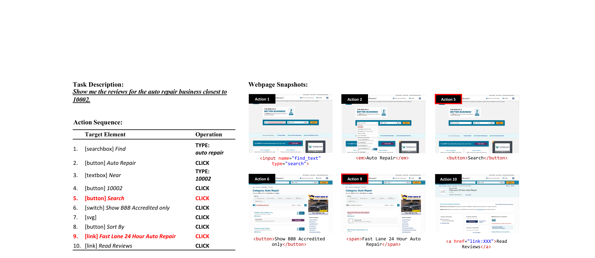
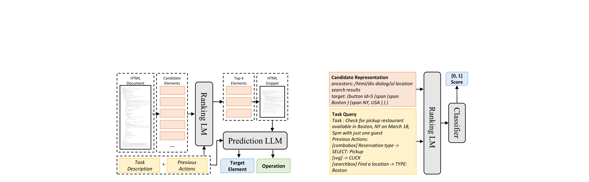
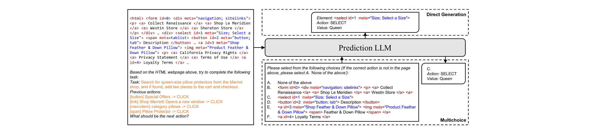
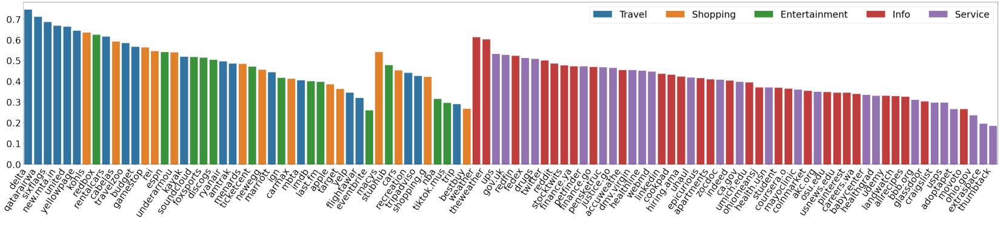

# Mind2Web: 웹을 위한 범용 에이전트를 향하여

## 저자

Xiang Deng, Yu Gu, Boyuan Zheng, Shijie Chen, Samuel Stevens, Boshi Wang, Huan Sun, Yu Su

## 초록

우리는 언어 지시를 따라 어떤 웹사이트에서든 복잡한 작업을 완료할 수 있는 웹용 범용 에이전트를 개발하고 평가하기 위한 최초의 데이터셋인 Mind2Web을 소개한다. 웹 에이전트를 위한 기존 데이터셋들은 시뮬레이션된 웹사이트를 사용하거나 제한된 웹사이트와 작업만을 다루어 범용 웹 에이전트에 적합하지 않았다. 31개 도메인에 걸친 137개 웹사이트에서 수집된 2,000개 이상의 개방형 작업과 크라우드소싱된 action sequence를 통해, Mind2Web은 범용 웹 에이전트 구축에 필요한 세 가지 요소를 제공한다: 1) 다양한 도메인, 웹사이트, 작업, 2) 시뮬레이션되고 단순화된 환경 대신 실제 웹사이트 사용, 3) 광범위한 사용자 상호작용 패턴. Mind2Web을 기반으로, 우리는 범용 웹 에이전트 구축을 위한 large language model(LLM) 활용에 대한 초기 탐구를 수행했다. 실제 웹사이트의 raw HTML은 종종 LLM에 입력하기에 너무 크지만, 먼저 작은 LM으로 필터링하면 LLM의 효과성과 효율성이 크게 향상됨을 보여준다. 우리 솔루션은 모델이 이전에 본 적 없는 웹사이트나 전체 도메인에서도 적절한 수준의 성능을 보여주지만, 진정한 범용 에이전트를 향해 개선할 여지가 상당히 남아있다. 웹용 범용 에이전트 구축에 관한 추가 연구를 촉진하기 위해 데이터셋, 모델 구현, 학습된 모델을 오픈소스로 공개한다(https://osu-nlp-group.github.io/Mind2Web).

---

## MIND2WEB: 웹을 위한 범용 에이전트를 향하여

**Xiang Deng**[*](#fn-corresponding), **Yu Gu**, **Boyuan Zheng**, **Shijie Chen**, **Samuel Stevens**, **Boshi Wang**, **Huan Sun**[*](#fn-corresponding), **Yu Su**[*](#fn-corresponding)

**The Ohio State University**

[https://osu-nlp-group.github.io/Mind2Web](https://osu-nlp-group.github.io/Mind2Web)

## 초록

우리는 언어 지시를 따라 어떤 웹사이트에서든 복잡한 작업을 완료할 수 있는 웹용 범용 에이전트를 개발하고 평가하기 위한 최초의 데이터셋인 MIND2WEB을 소개한다. 웹 에이전트를 위한 기존 데이터셋들은 시뮬레이션된 웹사이트를 사용하거나 제한된 웹사이트와 작업만을 다루어 범용 웹 에이전트에 적합하지 않았다. 31개 도메인에 걸친 137개 웹사이트에서 수집된 2,000개 이상의 개방형 작업과 크라우드소싱된 action sequence를 통해, MIND2WEB은 범용 웹 에이전트 구축에 필요한 세 가지 요소를 제공한다: 1) 다양한 도메인, 웹사이트, 작업, 2) 시뮬레이션되고 단순화된 환경 대신 실제 웹사이트 사용, 3) 광범위한 사용자 상호작용 패턴. MIND2WEB을 기반으로, 우리는 범용 웹 에이전트 구축을 위한 large language model(LLM) 활용에 대한 초기 탐구를 수행했다. 실제 웹사이트의 raw HTML은 종종 LLM에 입력하기에 너무 크지만, 먼저 작은 LM으로 필터링하면 LLM의 효과성과 효율성이 크게 향상됨을 보여준다. 우리 솔루션은 모델이 이전에 본 적 없는 웹사이트나 전체 도메인에서도 적절한 수준의 성능을 보여주지만, 진정한 범용 에이전트를 향해 개선할 여지가 상당히 남아있다. 웹용 범용 에이전트 구축에 관한 추가 연구를 촉진하기 위해 데이터셋, 모델 구현, 학습된 모델을 오픈소스로 공개한다(https://osu-nlp-group.github.io/Mind2Web).

## 1 서론

웹은 현재 디지털 세계의 거의 모든 측면을 다루는 수십억 개의 웹사이트를 호스팅하고 있다 [[7]](#ref-7). 본 연구에서 우리는 다음 질문에 답하고자 한다: 어떤 웹사이트에서든 언어 지시를 따르고 해당 작업을 수행할 수 있는 웹용 범용 에이전트를 어떻게 구축할 수 있을까? 이러한 에이전트의 예시 작업들이 Figure 1에 나와 있다. 범용 에이전트는 웹을 더 접근하기 쉽게 만들 수 있는데, 현대 웹사이트들이 점점 더 많은 기능을 제공하면서 복잡성과 학습 곡선도 증가하고 있기 때문이다. 반면에, 이러한 에이전트는 전체 웹을 large language model(LLM)을 향상시킬 수 있는 전례 없이 강력하고 다재다능한 도구로 [[23]](#ref-23), [[27]](#ref-27) 변환할 수도 있다. 예를 들어, ChatGPT [[24]](#ref-24)의 플러그인으로 사용되어 retriever 도구를 통해 웹 콘텐츠를 검색 [[8]](#ref-8), [[18]](#ref-18)하거나 각 웹 서비스에 대해 사전 정의된 API에 의존 [[34]](#ref-34), [[37]](#ref-37)하는 대신 HTML 웹사이트에서 직접 정보를 획득하고 작업을 수행할 수 있다.

웹용 범용 에이전트는 다음의 요건들을 충족해야 한다: 첫째, 인터넷의 어떤 웹사이트에서든 작동해야 한다. 모든 웹사이트를 다루는 충분한 학습 데이터를 수집하는 것은 불가능하므로, 에이전트는 이전에 본 적 없는 웹사이트나 심지어 도메인에도 본질적으로 일반화할 수 있어야 한다. 둘째, 동적이고 복잡하며 노이즈가 있을 수 있는 실제 웹사이트에서 작동해야 한다. 대부분의 현대 웹사이트는 동적이어서 사용자 행동에 반응하여 다른 콘텐츠를 생성하고 렌더링한다. 이는 에이전트가 사전에 완전한 지식을 가정하는 대신 각 웹사이트를 partially-observable environment로 모델링해야 함을 의미한다. 에이전트는 또한 환경에 대해 강한 단순화 가정을 하지 말고 때로는 최적이 아닌 웹사이트 설계로 인한 노이즈를 포함한 전체 복잡성을 수용해야 한다.

**\*** Corresponding authors: {deng.595, sun.397, su.809}@osu.edu

Figure 1: MIND2WEB에 포함된 샘플 작업과 모든 도메인. 다양성의 배열은 같은 웹사이트에서의 작업 간(a vs. b), 다른 웹사이트에서의 유사한 작업 간(a vs. c), 그리고 완전히 다른 작업, 웹사이트, 도메인 간(d-f) 에이전트의 일반화 능력을 테스트할 수 있게 한다.

마지막으로, 웹사이트와의 다양하고 정교한 상호작용을 지원해야 한다. 사용자의 작업은 매우 다양할 수 있으며 완료하는 데 많은 단계가 필요할 수 있다(예: Figure 1(b)의 작업은 14개의 action이 필요함). 단순한 작업만 지원하는 에이전트는 사용자에게 제한된 가치를 제공할 수 있다.

웹용 에이전트 구축은 완전히 새로운 것은 아니다. 다양한 형태로 수많은 이전 노력이 있었다. 그러나 위에 나열된 범용 에이전트의 모든 요구 사항을 충족하는 것은 없다. 기존 연구는 다음 측면 중 하나에서 전부에 걸쳐 부족하다: 1) 제한되고 사전 지정된 웹사이트 집합에서만 작동 [[5]](#ref-5), [[21]](#ref-21), [[22]](#ref-22), [[35]](#ref-35), [[40]](#ref-40), 2) 웹사이트에 대한 강한 단순화 가정 [[22]](#ref-22), [[40]](#ref-40), 3) 특정 유형의 작업만 지원 [[21]](#ref-21), [[22]](#ref-22), [[40]](#ref-40) 및/또는 사용자에게 번거로운 단계별 지시 요구 [[5]](#ref-5), [[21]](#ref-21), [[22]](#ref-22), [[39]](#ref-39). 한편, LLM은 좋은 일반화 능력과 샘플 효율성으로 복잡한 환경에서 grounded language understanding에 뛰어남이 입증되었다 [[2]](#ref-2), [[13]](#ref-13), [[17]](#ref-17), [[33]](#ref-33). 따라서 웹용 범용 에이전트를 위한 후보 솔루션으로 LLM을 탐구하는 것이 유망하다. 그러나 범용 웹 에이전트의 개발과 평가를 지원할 수 있는 좋은 데이터셋이 부족하며, 이것이 본 연구의 초점이다.

이를 고려하여, 우리는 웹용 범용 에이전트 개발 및 평가를 위한 자연어 작업과 수동 주석이 달린 action sequence가 포함된 새로운 데이터셋인 MIND2WEB을 제시한다. 다음과 같은 고유한 특징을 제공한다:

1. 도메인, 웹사이트, 작업의 다양한 범위. MIND2WEB은 31개의 다른 도메인에 걸친 137개 웹사이트에서 선별된 2,000개 이상의 작업 컬렉션을 자랑한다. 이러한 광범위한 작업과 도메인은 탐구와 학습을 위한 광대한 환경을 제공할 뿐만 아니라 새로운 수준의 다양성과 복잡성을 열어 범용 웹 에이전트의 더 포괄적인 평가를 촉진한다.

2. 실제 웹사이트 사용. MIND2WEB은 다른 데이터셋에서 흔히 발견되는 과도하게 단순화된 시뮬레이션 환경을 실제 웹사이트의 진정하고 활기차며 예측 불가능한 영역으로 대체한다. 사용자 상호작용의 전체 추적, 웹페이지 스냅샷, 네트워크 트래픽을 제공하여 원시적이고 필터링되지 않은 동적 데이터의 풍부한 소스를 만든다. 이를 통해 MIND2WEB은 모델이 실제 환경의 복잡성과 불확실성과 상호작용하고 대처할 수 있는 능력을 갖추게 하여 더 robust하고 적응력 있는 모델 개발을 장려한다.

3. 광범위한 사용자 상호작용 패턴. MIND2WEB은 기존 연구에서 흔히 발견되는 검색, 링크 따라가기, 콘텐츠 읽기와 같은 기본 작업과 달리 정교한 방식으로 웹사이트와 상호작용할 수 있게 한다. 사용자는 웹사이트의 어떤 요소든 클릭, 선택, 입력할 수 있어 가능한 작업 공간이 크게 확장된다. 이는 사용자가 실생활에서 웹사이트에서 수행하는 모든 일반적인 작업을 포착하고 복잡한 작업을 처리할 수 있는 에이전트 개발을 촉진한다.

다양한 도메인과 웹사이트를 통해, 우리는 에이전트가 학습 중 본 적 없는 웹사이트나 심지어 전체 도메인에 대한 일반화 능력을 테스트하는 도전적인 out-of-distribution 평가 설정을 만든다. 이는 보지 못한 웹사이트에서 작동하는 범용 에이전트의 대표적인 평가를 제시한다.

MIND2WEB은 범용 웹 에이전트 구축을 위한 LLM 사용에 대한 초기 탐구를 가능하게 한다. 실제 웹페이지의 HTML 문서는 수천 개의 요소를 포함할 수 있어 LLM의 context에 입력하기가 불가능하거나 비용이 너무 많이 든다. 이 문제를 해결하기 위해, 우리는 먼저 fine-tuned small LM을 사용하여 웹 요소를 필터링한 다음 LLM이 필터링된 요소들 중에서 multi-choice question answering 방식으로 선택하고 선택된 요소와 함께 해당 action을 예측하는 2단계 모델인 MINDACT를 제안한다. MINDACT가 이전 연구에서 일반적으로 채택된 모델링 전략을 크게 능가하고 적절한 수준의 일반화를 달성함을 보여준다. Fine-tuning을 통한 Flan-T5 [[10]](#ref-10)와 같은 오픈소스 LLM과 in-context learning을 통한 GPT-3.5-turbo 및 GPT-4와 같은 클로즈드소스 LLM 모두에서 잘 작동할 수 있다. 그러나 웹용 범용 에이전트를 향한 추가 개선의 여지가 상당히 남아있다. 유망한 미래 방향에는 multi-modal 정보 통합, 실제 웹사이트 피드백을 통한 강화 학습, 웹 이해 및 action 수행을 위한 특화된 LM이 포함된다.

## 2 MIND2WEB 데이터셋

시뮬레이션 환경 내에서 주로 구축된 기존 데이터셋 [[31]](#ref-31), [[40]](#ref-40)과 달리, 우리의 목표는 시뮬레이션과 현실 사이의 격차를 좁혀 데이터셋에서 학습된 에이전트가 실제 웹사이트에서 바로 작동할 수 있도록 하는 것이다. 이를 달성하기 위해, 데이터 수집 접근 방식은 다음 원칙을 준수한다. 첫째, 종종 과도하게 단순화된 환경으로 이어지는 시뮬레이션에서 웹사이트를 재현하는 대신, 실제 웹사이트와 직접 상호작용하고 이러한 환경의 스냅샷을 캡처한다. 둘째, 다양한 도메인에서 다양한 웹사이트 집합을 수집하고 이러한 웹사이트가 제공하는 광범위한 기능을 다루는 현실적인 작업을 크라우드소싱한다. 마지막으로, 실제 환경의 복잡성을 완벽하게 복제하는 것의 어려움을 인정하면서, 모든 작업을 오프라인에서 원활하게 재생할 수 있을 정도로 각 웹사이트의 포괄적인 스냅샷과 전체 상호작용 추적을 캡처하기 위해 노력한다. 이는 풍부한 모델링 및 평가 접근 방식을 지원하여 연구를 위한 robust하고 실용적인 데이터셋을 보장한다.

## 2.1 Task 정의

MIND2WEB의 주요 목표는 에이전트가 일련의 action을 통해 대상 웹사이트에서 특정 작업을 완료하는 것이다. 데이터셋의 각 인스턴스는 세 가지 구성 요소를 포함한다:

Task description은 작업의 상위 수준 목표를 개략적으로 설명한다. 우리는 의도적으로 낮은 수준의 단계별 지시를 피하여, 단순히 규정된 지시를 따르는 것이 아니라 더 자율적인 방식으로 작업을 이해하고 수행할 수 있는 에이전트 개발을 촉진하고자 한다.

Action sequence는 웹사이트에서 작업을 수행하는 데 필요한 action들의 순서이다. sequence의 각 action은 (Target Element, Operation) 쌍으로 구성된다. Target Element는 현재 웹페이지에서 상호작용 가능한 요소이고, Operation은 해당 요소에서 실행할 action을 나타낸다. 세 가지 일반적인 operation을 지원한다: Click(Hover와 Press Enter 포함), Type, Select Option. Type과 Select Option의 경우 추가 value가 인자로 필요하다. sequence의 action들은 종종 웹사이트의 여러 웹페이지에 걸쳐 있다.

Figure 2: 데이터셋의 세 가지 구성 요소가 포함된 샘플 데이터 인스턴스. 빨간색으로 표시된 action은 새 웹페이지로의 전환을 초래한다.

Webpage snapshot은 작업이 수행되는 환경을 구성한다. 다양한 모델링 접근 방식을 수용하기 위해 여러 형식으로 스냅샷을 제공한다: 웹페이지의 raw HTML 코드를 포함하는 self-contained MHTML 파일, 렌더링된 웹페이지 스크린샷의 레이아웃 및 스타일 정보와 함께 DOM 트리를 포함하는 DOM snapshot, 필요시 상호작용을 재생하기 위한 모든 네트워크 트래픽을 포함하는 HAR 파일, 작업 주석 과정 중의 완전한 상호작용 추적을 포함하는 trace 파일.

에이전트는 시작 시 task description을 받는다. 각 단계에서 현재 웹페이지와 이전 action들의 기록도 받는다. 목표는 상호작용할 target element와 operation을 포함하는 후속 action을 정확하게 예측하는 것이다.

## 2.2 데이터 수집

데이터 수집 과정은 네 단계로 구성된다: 웹사이트 선택, 작업 제안, 작업 시연, 작업 검증. 웹사이트 선택과 작업 검증은 저자들이 수행한다. 작업 제안과 시연을 위해 Playwright를 사용하여 정교한 주석 도구를 개발하고 Amazon Mechanical Turk를 통해 주석자를 고용한다. 주석 도구 세부 사항은 보충 자료를 참조하라.

Website Selection. 우리는 Travel, Shopping, Service, Entertainment, Information의 5개 최상위 도메인으로 시작하여 이후 31개의 (하위) 도메인으로 세분화한다. similarweb.com의 미국 내 인기도 순위를 기준으로 각 도메인 내에서 웹사이트를 선택한다. 도메인당 3-5개의 대표 웹사이트를 수동으로 선택하여 총 137개 웹사이트 컬렉션을 구성한다.

Task Proposal. 주석자에게 대상 웹사이트, 웹사이트에 대한 간략한 설명, 관련된 몇 가지 샘플 작업을 제시한다. 그런 다음 주석자에게 세 가지 기준에 따라 개방형이고 현실적인 작업을 제안하도록 요청한다: 작업은 다양한 유형이어야 하고, 여러 라운드의 상호작용이 필요해야 하며, 단계별 지시 대신 상위 수준의 목표를 설명해야 한다. 창의성을 더욱 자극하고 다양성을 높이기 위해 ChatGPT를 사용하여 웹사이트의 다양한 기능을 테스트하도록 프롬프트하여 seed 작업을 생성한다. 웹사이트당 50개의 seed 작업을 생성하고, 그 중 10개를 무작위로 샘플링하여 매번 주석자에게 제시한다. 이러한 seed 작업은 주로 영감을 위한 것으로, 주석자들에게 직접 사용하지 않도록 명시적으로 지시하며 seed 작업과 매우 유사한 작업 제안은 거부한다. 제안된 모든 작업은 시연 단계에 들어가기 전에 품질과 다양성을 보장하기 위해 저자들이 추가로 검토한다.

Task Demonstration. 시연을 위한 Playwright 기반 도구를 개발한다(Figure 2). 작업자들은 웹 브라우저 내에서 제안한 작업을 수행하는 방법을 시연하기 위해 도구를 사용한다. 정확성을 보장하기 위해 각 상호작용 라운드는 element selection과 operation selection의 두 부분으로 나뉜다. 각 단계에서 작업자는 먼저 브라우저 내에서 클릭하여 웹페이지의 요소를 선택한다. 그런 다음 선택을 확인하고 선택한 요소에서 실행할 operation을 선택하도록 요청받는다. 작업이 완료되면 작업자에게 task description을 검토하고 수정할 기회가 다시 주어진다.

Table 1: 기존 데이터셋과 비교한 MIND2WEB 통계.

|                | # Dom.   |   # Env. | Env. Type                    | Avg. # Elements   | # Tasks           | Task Info.   | Avg. # Actions   |
|----------------|----------|----------|------------------------------|-------------------|-------------------|--------------|------------------|
| MiniWoB++ [[22]](#ref-22) | -        |      100 | 단순화된 모바일 웹사이트   | 28                | 100               | Low-level    | 3.6            |
| WebShop [[40]](#ref-40)   | 1        |        1 | 단순화된 쇼핑 웹사이트 | 38                | 12,000 products | High-level   | 11.3           |
| RUSS [[39]](#ref-39)      | -        |       22 | 실제 웹사이트          | 801               | 80                | High &low    | 5.4            |
| PixelHelp [[21]](#ref-21) | 4        |        4 | 모바일 앱                  | -                 | 187               | High &low    | -                |
| META-GUI [[35]](#ref-35)  | 6        |       11 | 모바일 앱                  | 79                | 1,125 dialogues | High-level   | 4.3            |
| MoTIF [[5]](#ref-5)      | 15       |      125 | 모바일 앱                  | 188               | 756               | High &Low    | 4.4            |
| MIND2WEB       | 5 / 31   |      137 | 실제 웹사이트          | 1,135           | 2,350           | High-level   | 7.3            |

Task Verification. 마지막으로, 모든 작업 시연은 다음을 보장하기 위해 저자들이 검증한다: 첫째, 모든 action이 task description에 정확히 반영되어야 한다. 저자들은 필요한 경우 주석된 action과 일치하도록 task description을 수정한다. 둘째, 기록된 action이 정확하고 깨끗해야 하며 불필요한 단계는 폐기한다. 마지막으로, 작업의 시작점과 종료점이 일관되어야 한다. 예를 들어 팝업 창을 닫는 action을 제외하거나, 특정 항목을 클릭하지 않고 항목을 찾는 것이 작업이었다면 검색 결과 페이지에서 주석을 종료한다. 검증 후 총 2,411개 작업 중 61개를 폐기했다. 유지된 2,350개 작업 중 390개 인스턴스에서 시연된 action과 더 잘 일치하도록 task description이 수정되었고, 187개 인스턴스에서 일부 불필요한 단계가 폐기되었다. 전반적으로 데이터 수집 파이프라인은 효과적이며 고품질 데이터를 생성하는 것으로 입증되었다.

## 2.3 기존 연구와의 비교 및 연구 과제

MIND2WEB은 실제 환경에서 웹용 범용 에이전트 개발을 위한 독특한 연구 과제 앙상블을 제시한다. Table 1에서 보여주듯이, MIND2WEB은 여러 면에서 기존 문헌과 차별화된다. 첫째, MIND2WEB은 31개 도메인의 137개 웹사이트에 걸쳐 있어 다양한 환경에서 에이전트의 일반화 능력을 포괄적으로 테스트할 수 있다. 둘째, 수동 단순화 없이 실제 웹사이트를 활용한다. 결과적으로 포함된 환경은 이전 연구에서 접한 것보다 훨씬 더 복잡하지만 현대 웹의 복잡성을 더 잘 반영한다. 복잡한 DOM 구조 내에 페이지당 평균 1,000개 이상의 요소가 있어, 이러한 길고 고도로 구조화된 문서를 효과적으로 처리하는 방법이 모델링에 상당한 도전을 제시한다. 마지막으로, 주석자들이 진정한 웹 사용을 모방하기 위해 웹사이트의 다양한 기능을 탐구하는 개방형 작업을 제안하도록 지시한다. 한편, 단계별 지시를 제공하고 주로 낮은 수준의 지시를 action으로 변환하는 에이전트의 능력을 테스트하는 데 초점을 맞춘 이전 연구 [[5]](#ref-5), [[21]](#ref-21), [[22]](#ref-22), [[39]](#ref-39)와 달리, 예를 들어 'Type New York in the location field, click the search button and choose the tomorrow tab', 우리는 상위 수준 목표만 사용 가능한 설정을 선택했다, 예를 들어 'What is the weather for New York tomorrow?' 이는 에이전트에게 훨씬 더 크지만 현실적인 planning과 grounding 도전을 제시한다.

## 3 방법: MINDACT

MIND2WEB의 데이터를 사용하여, 우리는 LLM의 힘을 활용하는 탐색적 프레임워크인 MINDACT를 소개한다. 수천 개의 요소로 구성될 수 있는 raw HTML 문서는 LLM에 직접 입력하기가 불가능하거나 비용이 너무 많이 든다. 우리는 Figure 3에서 보여주듯이 small LM과 large LM의 강점을 시너지화하는 2단계 프로세스를 제안한다. 첫 번째 단계에서는 fine-tuned small LM을 사용하여 웹페이지에 있는 요소들의 순위를 매겨 유망한 후보들의 작은 풀을 생성한다. 두 번째 단계에서는 이러한 후보 요소들을 통합하여 웹페이지의 대표적인 snippet을 형성하고, 이를 LLM이 처리하여 상호작용할 요소와 해당 operation을 포함한 최종 action을 예측한다.

## 3.1 Small LM을 사용한 Candidate Generation

Task description, 단계 t에서의 웹페이지 스냅샷, 이전 t-1 단계에서 수행된 action이 주어지면, candidate generation을 ranking task로 처리한다. 작업은 task description과 현재 단계에 가장 잘 맞는 top-k 후보 DOM 요소를 웹페이지에서 선택하는 것이다.

Figure 3: candidate generation을 위한 small ranking LM과 action prediction을 위한 large prediction LM을 포함한 MINDACT의 전체 파이프라인.

Figure 4: candidate generation 모듈과 task query 및 candidate representation 구성을 위한 템플릿 설명.

Figure 5: LLM을 사용한 action prediction 설명.

task description과 이전 action들을 연결하여 task query를 구성한다. 각 후보 DOM 요소의 텍스트 표현은 요소의 태그, 텍스트 콘텐츠, 중요한 속성 값의 조합과 부모 및 자식 요소의 텍스트 표현에서 도출된다. Figure 4에서 보여주듯이, 각 DOM 요소를 task query와 쌍으로 만들어 cross-encoder 아키텍처 [[28]](#ref-28)를 통해 encoder-only LM에 입력하여 matching score를 생성한다. 학습 시에는 웹페이지에서 negative 요소를 무작위로 샘플링하고 target 요소를 positive 예제로 사용한다. matching score는 sigmoid 활성화 함수를 통과하고 binary cross entropy loss로 최적화된다. 추론 시에는 웹페이지의 모든 요소에 점수를 매기고 가장 큰 logit을 가진 top-k 요소를 두 번째 단계의 입력으로 선택한다.

## 3.2 LLM을 사용한 Action Prediction

top-k 후보를 얻은 후, 후보 집합을 사용하여 웹페이지 스냅샷을 가지치기하고 선택된 후보들과 그 이웃만 포함하는 snippet을 구성하여 LLM에 입력한다. 최근 연구 [[10]](#ref-10), [[13]](#ref-13)는 생성보다 판별을 위해 LM을 학습시키는 것이 다른 grounding task에서 더 일반화 가능하고 샘플 효율적임을 제안했다. 이에 영감을 받아, 요소 선택 작업을 multi-choice question answering(QA) 문제로 변환한다. 완전한 target 요소를 생성하는 대신, LM이 옵션 목록에서 선택하도록 학습시킨다. 비교를 위해, 제공된 웹페이지 snippet을 기반으로 target 요소를 직접 생성하는 baseline도 포함한다. 두 경우 모두 LLM이 operation을 직접 생성하도록 하며, 일부 operation에 필요한 추가 value도 함께 생성한다. 예시는 Figure 5에 나와 있다. 각 입력에 최대 5개의 후보 요소와 None 옵션을 포함하고 후보 집합을 여러 그룹으로 분할한다. 학습 중에는 ground-truth action을 사용하여 target sequence를 구성하고 left-to-right language modeling objective로 모델을 fine-tune한다. 추론 중에는 top-k 후보를 5개 옵션의 여러 클러스터로 나눈다. 한 라운드 후에 둘 이상의 옵션이 선택되면 선택된 것들로 새 그룹을 형성한다. 단일 요소가 선택되거나 모든 옵션이 모델에 의해 거부될 때까지, 즉 모델이 모든 그룹에 대해 None 옵션을 선택할 때까지 이 과정을 반복한다.

Table 2: 주요 결과. classification baseline은 DeBERTa_B를 사용하고 generation baseline은 Flan-T5_B를 사용한다. step-wise metric의 경우 작업 간 macro average를 보고한다. * GPT-4의 경우 예산 제한으로 인해 top10 후보로 각 설정당 50개 작업을 사용한다. 모든 방법에 대한 50개 작업 하위 집합의 결과는 Appendix D.3을 참조하라.

|                | Cross-Task   | Cross-Task   | Cross-Task   | Cross-Task   | Cross-Website   | Cross-Website   | Cross-Website   | Cross-Website   | Cross-Domain   | Cross-Domain   | Cross-Domain   | Cross-Domain   |
|----------------|--------------|--------------|--------------|--------------|-----------------|-----------------|-----------------|-----------------|----------------|----------------|----------------|----------------|
|                | Ele. Acc     | Op. F1       | Step SR      | SR           | Ele. Acc        | Op. F1          | Step SR         | SR              | Ele. Acc       | Op. F1         | Step SR        | SR             |
| Classification | 26.8       | -            | -            | -            | 21.6          | -               | -               | -               | 24.5         | -              | -              | -              |
| Generation     | 20.2       | 52.0       | 17.5       | 0.0        | 13.9          | 44.7          | 11.0          | 0.0           | 14.2         | 44.7         | 11.9         | 0.4          |
| MINDACT        |              |              |              |              |                 |                 |                 |                 |                |                |                |                |
| w/ Flan-T5 B   | 43.6       | 76.8       | 41.0       | 4.0        | 32.1          | 67.6          | 29.5          | 1.7           | 33.9         | 67.3         | 31.6         | 1.6          |
| w/ Flan-T5 L   | 53.4       | 75.7       | 50.3       | 7.1        | 39.2          | 67.1          | 35.3          | 1.1           | 39.7         | 67.2         | 37.3         | 2.7          |
| w/ Flan-T5 XL  | 55.1       | 75.7       | 52.0       | 5.2        | 42.0          | 65.2          | 38.9          | 5.1           | 42.1         | 66.5         | 39.6         | 2.9          |
| w/ GPT-3.5     | 20.3       | 56.6       | 17.4       | 0.8        | 19.3          | 48.8          | 16.2          | 0.6           | 21.6         | 52.8         | 18.6         | 1.0          |
| w/ GPT-4 *     | 41.6       | 60.6       | 36.2       | 2.0        | 35.8          | 51.1          | 30.1          | 2.0           | 37.1         | 46.5         | 26.4         | 2.0          |

## 4 실험

## 4.1 실험 설정

MIND2WEB의 다양성은 에이전트의 일반화 능력을 여러 수준에서 평가할 수 있는 독특한 기회를 제공한다. 우리는 에이전트가 도메인, 웹사이트, 작업 간에 얼마나 잘 일반화할 수 있는지 이해하고자 한다: **Test_Cross-Domain**은 73개 웹사이트의 912개 작업이 있는 Information과 Service 두 개의 최상위 도메인을 제외한다. 여기서 모델은 학습 중 해당 도메인과 관련된 웹사이트나 작업을 본 적 없이 완전히 새로운 도메인으로 일반화해야 한다. **Test_Cross-Website**는 나머지 각 최상위 도메인에서 10개 웹사이트, 177개 작업을 포함한다. 이 설정에서 모델은 학습 중 테스트 웹사이트에 노출된 적이 없다. 그러나 같은 도메인의 웹사이트와 유사한 작업에 대해 학습되었다. 이 설정을 통해 익숙한 도메인과 작업 컨텍스트 내에서 완전히 새로운 웹사이트에 적응하는 에이전트의 능력을 평가할 수 있다. **Test_Cross-Task**는 도메인과 웹사이트에 관계없이 나머지 데이터의 20%를 무작위로 분할하여 69개 웹사이트에서 252개 작업을 생성한다. 이 설정에서 모델은 학습 중 같은 웹사이트의 웹페이지에 노출되었으며 유사한 작업을 접했을 가능성이 높다. 나머지 데이터는 학습에 사용되며, 73개 웹사이트에서 1,009개 작업을 포함한다.

## 4.2 데이터 전처리 및 평가

raw HTML 문서를 정리하기 위해 간단한 휴리스틱을 적용하여 속성, 텍스트 콘텐츠, 이웃 요소에 의해 결정되는 대로 보이고 실질적인 의미를 가지는 요소만 유지한다. 이를 통해 평균 요소 수가 1,135에서 580으로 효과적으로 줄어들면서도 학습 데이터에서 target 요소의 전체 recall은 94.7%를 유지한다.

평가를 위해, 먼저 선택된 요소를 모든 허용 가능한 요소와 비교하는 Element Accuracy와 예측된 operation에 대한 token-level F1 score를 계산하는 Operation F1을 계산한다. 이는 Click의 경우 accuracy와 같지만 Type과 Select Option의 경우 입력 value의 정확성을 고려한다. 작업의 각 단계는 ground truth action history가 제공된 상태에서 독립적으로 평가된다. 그런 다음 Step Success Rate와 (전체 작업에 대한) Success Rate를 정의한다. 단계는 선택된 요소와 예측된 operation이 모두 정확한 경우에만 성공으로 간주된다. 작업은 모든 단계가 성공한 경우에만 성공으로 간주된다. 따라서 엄격한 metric이다. step-wise metric의 경우 작업 간 macro average를 보고한다.

## 4.3 결과

**Candidate Generation.** candidate generation을 위한 small LM으로 DeBERTa [[16]](#ref-16)를 fine-tune한다. candidate generation은 높은 효율성을 요구하므로, 86M 파라미터의 base 버전 DeBERTa_B를 사용한다. 전반적으로 Test_Cross-Task, Test_Cross-Website, Test_Cross-Domain에서 각각 88.9%/85.3%/85.7% Recall@50을 달성한다. 모든 후속 실험에서 top50 ranking 결과를 후보 풀로 사용한다.

**Action Prediction.** Table 2에서 주로 두 가지 baseline과 비교한다. 첫 번째는 candidate generation 모델(DeBERTa)을 요소 선택에 직접 사용하는 것으로, encoder를 classification head와 결합하는 기존 연구 [[14]](#ref-14), [[35]](#ref-35)와 유사하다. 그러나 이러한 설계는

Figure 6: 세 가지 분할별 웹사이트당 step success rate: 왼쪽부터 Test_Cross-Task, Test_Cross-Website, Test_Cross-Domain. 여기서는 3개 이상의 테스트 작업이 있는 웹사이트만 보여준다.

encoder-decoder 또는 decoder-only 아키텍처를 사용하는 많은 최신 LM의 이점을 누릴 수 없다. action을 예측할 수 없으며 요소 선택 성능도 Table 2에서 보여주듯이 경쟁력이 없다. generation 모델의 backbone으로 Flan-T5 [[10]](#ref-10)를 사용한다. autoregressive generation 공식(Figure 5 상단)은 잘 수행되지 않으며, 더 큰 모델 크기(Flan-T5_B의 경우 220M)에도 불구하고 요소 선택에서 classification baseline보다 성능이 떨어진다. multi-choice QA 공식을 사용한 MINDACT에서 상당한 향상을 관찰한다. 최고 모델은 Cross-Task 설정에서 52.0% step success rate를 달성하고, 보지 못한 웹사이트와 도메인으로 일반화할 때 38.9%/39.6%를 달성한다. 그러나 에이전트가 대부분의 경우 최소 한 번의 오류 단계를 범하기 때문에 전체 작업 success rate는 모든 모델에서 낮게 유지된다.

**세 가지 수준의 일반화.** 모든 모델이 Cross-Task 설정에서 가장 좋은 성능을 보이며, Cross-Website 및 Cross-Domain 설정과 비교하여 평균 10% 이상의 절대적 차이(step SR)를 보인다. 이는 보지 못한 환경으로의 일반화가 여전히 주요 과제임을 나타낸다. 반대로, Cross-Website와 Cross-Domain 설정의 성능이 눈에 띄게 유사함을 주목한다. 이는 Figure 6에서도 강화되는데, 이러한 설정 간에 성능에 명확한 구분이 없다. 이는 도전이 주로 도메인 특수성보다는 웹사이트 설계와 상호작용 로직의 다양성에서 비롯됨을 시사한다. 도메인 간 작업은 공통 operation을 공유하는 경향이 있으며, 사전 학습된 LM은 이미 상식 지식을 기반으로 복잡한 작업을 상위 수준에서 분해할 수 있는 능력을 가지고 있을 수 있다. 그러나 이러한 지식을 특정하고 다양한 환경에서 실행 가능한 단계로 grounding하는 것은 여전히 상당한 도전으로 남아있다.

**LLM을 사용한 In-context Learning.** 또한 두 가지 인기 있는 LLM인 GPT-3.5-turbo와 GPT-4 [[25]](#ref-25)를 in-context learning을 통해 실험한다. MINDACT와 같은 multiple-choice 공식을 사용하고 in-context learning을 위해 세 가지 demonstration 예제를 포함한다. 두 모델 모두 세 가지 in-context 예제만으로 두 baseline과 비슷한 수준임을 알 수 있다. 이것은 전체 학습 데이터에서 fine-tuned된 Flan-T5 모델과의 공정한 비교가 아님에 유의하라. Appendix D.2에 Flan-T5_XL의 zero-shot 결과도 포함했지만, 모델은 fine-tuning 없이 작업을 수행하지 못한다. 한편, GPT-3.5는 다른 데이터셋에서 사람들이 관찰한 우수한 성능에도 불구하고 약 20%의 요소 선택 정확도만 보인다. 추가 분석에 따르면 한 가지 가능한 문제는 모델이 None 옵션을 선택하는 경향, 즉 현재 웹페이지에서 작업을 완료할 수 없다고 주장하는 것이다. 작업은 일반적으로 최종 결과에 도달하기 전에 여러 웹페이지를 탐색하고 일련의 action을 수행해야 하므로 이것은 어느 정도 정확하다. 이 측면이 실제로 우리 작업의 주요 어려움을 나타낸다. 반면에, GPT-4에서 매우 유망한 결과를 관찰한다. 요소 선택에서 Cross-Website 및 Cross-Domain 설정에서 tuned Flan-T5 모델과 동등한 성능을 보여 LLM을 사용한 범용 에이전트 개발에 큰 잠재력이 있음을 나타낸다. 그럼에도 불구하고 GPT-4의 높은 운영 비용은 여전히 우려 사항이다. 웹에 특화된 작은 모델을 개발하는 것은 흥미로운 미래 방향이다.

## 5 관련 연구

**웹 및 모바일 애플리케이션을 위한 자율 에이전트.** 인간-웹 상호작용을 용이하게 한다는 비전에 의해 추진되어 웹 탐색 자동화에 상당한 노력이 투자되었다. 그러나 이전 연구는 단순화된 시뮬레이션 환경 [[22]](#ref-22), [[31]](#ref-31), [[40]](#ref-40)에 국한되거나 좁은 범위의 도메인과 웹사이트 [[39]](#ref-39), [[40]](#ref-40)에 제한되어 처리할 수 있는 작업과 웹사이트 유형에 한계가 있었다. 최근 연구 [[5]](#ref-5), [[21]](#ref-21), [[35]](#ref-35)는 모바일 애플리케이션에 유사한 기술을 활용했지만, 이들은 종종 본격적인 웹사이트에 비해 더 단순하고 적은 기능을 제공한다. 반면에 MIND2WEB은 높은 다양성을 특징으로 하는 현실적인 웹 환경에 적응하는 것을 목표로 한다.

또한 웹 자동화 시스템 [[1]](#ref-1), [[19]](#ref-19) 연구와도 관련이 있다. 이러한 기술은 종종 프로그래밍 기술을 요구하여 일반 사용자에게 덜 접근 가능할 수 있다. 우리는 웹 자동화 시스템에 자연어 인터페이스를 장착하여 진입 장벽을 크게 낮추는 것을 목표로 한다.

**Large Language Model.** 최근 몇 년간 large language model(LLM)의 개발과 응용이 급증했다. 종종 수십억 개의 파라미터를 포함하는 이러한 모델은 대규모 텍스트 데이터 코퍼스에서 사전 학습되어 [[3]](#ref-3), [[44]](#ref-44), [[45]](#ref-45) 복잡한 언어 패턴, 뉘앙스, 관계를 포착할 수 있게 하여 광범위한 NLP 작업에서 전례 없는 성능을 달성한다. LLM의 가장 주목할 만한 속성 중 하나는 few-shot learning 능력이다. 작업별 fine-tuning을 위해 광범위한 레이블이 지정된 데이터를 필요로 하는 전통적인 기계 학습 모델과 달리, LLM은 종종 최소한의 작업별 예제로 작업을 수행할 수 있다. 또한 GPT-3 [[4]](#ref-4) 및 PaLM [[9]](#ref-9)과 같은 LLM은 입력 프롬프트 내에 컨텍스트를 제공하여 새로운 작업에 적응할 수 있는 in-context learning 능력도 보여주었으며, 명시적인 재학습이 필요 없다. 본 연구에서는 약 1,000개의 예제로 중간 크기 LM을 tuning하거나 GPT-4와 같은 LLM을 prompting하여 MIND2WEB 위에 범용 에이전트를 구축하기 위해 LLM의 사용을 탐구하고 유망한 결과를 관찰했다.

**Grounded Language Understanding.** 우리의 연구는 자연어 발화를 대상 환경에서 실행 가능한 계획으로 매핑하는 것을 목표로 하는 grounded language understanding 분야와도 일치한다 [[13]](#ref-13). 많은 연구가 관계형 데이터베이스 [[36]](#ref-36), [[43]](#ref-43) 및 지식 베이스 [[12]](#ref-12), [[42]](#ref-42)를 포함하여 잘 구조화된 스키마나 온톨로지에 의해 뒷받침되는 환경을 중심으로 이루어졌으며, 이는 실제 상황의 더 이질적인 조건을 적절히 반영하지 못할 수 있다. 우리의 연구는 대신 노이즈가 있고 스키마가 없는 웹 환경에서 자연어를 grounding한다. 우리의 설정은 언어 지시에 의해 안내되는 에이전트가 물리적 환경에서 작업을 수행하는 embodied AI와도 연결된다 [[2]](#ref-2), [[32]](#ref-32), [[33]](#ref-33). 그럼에도 불구하고 기존 연구는 주로 특정 설정(예: 가정 환경)에 초점을 맞추어 다양성이 제한된다. MIND2WEB은 실제 환경에서 광범위한 grounding 도전을 연구하기 위한 독특한 테스트베드를 제공한다.

**Tool Learning.** 최근 발전은 검색 엔진, 번역기, 계산기 등을 포함하여 능력을 증강하기 위해 다양한 도구(즉, action 수행)를 사용하는 LLM의 잠재력을 강조했다 [[23]](#ref-23), [[27]](#ref-27). 예시 연구로는 Toolformer [[29]](#ref-29), ReAct [[41]](#ref-41), ToolkenGPT [[15]](#ref-15)가 있다. tool learning에 대한 최근 벤치마크 [[20]](#ref-20), [[26]](#ref-26) 생성은 도구 사용에서 LLM의 숙련도를 평가하는 것에 대한 증가하는 관심을 더욱 강조한다. 그러나 기존 연구는 주로 단기적인 tool invocation에 집중하여 장기 계획을 무시한다. MIND2WEB은 장기간의 의사 결정 sequence가 요구되는 현실적인 웹 브라우징 환경 내에서 action을 수행하도록 LLM에게 요구함으로써 이 공백을 메울 수 있다. 또한 MIND2WEB은 웹과 자연어를 인터페이스하는 LLM 기반의 더 고급 도구 개발을 자극할 수 있다. 이러한 고급 도구는 이후 더 도전적인 문제 해결 작업 [[11]](#ref-11), [[30]](#ref-30)을 위해 다른 LLM에 의해 사용될 수 있다.

## 6 한계 및 잠재적 사회적 영향

MIND2WEB은 웹용 범용 에이전트의 개발과 평가를 촉진하기 위해 설계되었다. 이러한 에이전트는 특히 정보 기술에 덜 익숙하거나 장애가 있어 복잡한 웹 앱을 탐색하고 사용 가능한 옵션에 압도당할 수 있는 개인들에게 웹을 더 접근 가능하고 사용하기 쉽게 만들 수 있는 큰 잠재력을 가지고 있다. 그러나 현재 데이터 수집, 시스템 설계 및 실제 배포 안전에 관한 잠재적 우려와 한계가 여전히 있다.

**데이터 수집의 다양성과 대표성.** 다양한 도메인을 다루는 대표적인 웹사이트를 선택하기 위해 노력하지만, 현재 선택은 주로 미국에서 사용되는 영어 웹사이트로 구성되어 있다. 한편, 모든 주석자는 Amazon MTurk 플랫폼을 통해 조달되어 웹 사용에 더 능숙한 그룹에 편향될 수 있다. 따라서 데이터셋에 포함된 작업과 웹사이트는 웹에서 수행할 수 있는 모든 잠재적 작업의 일부만 나타낼 수 있다. 이 한계를 염두에 두고, MIND2WEB의 설계와 데이터 수집 프로토콜은 더 많은 작업과 웹사이트를 쉽게 확장할 수 있게 한다. 잠재적으로 다른 국가와 언어의 추가 웹사이트 포함과 다양한 연령대, 전통적으로 웹 접근성 문제에 직면한 개인, 소프트웨어 개발, 연구, 법률 등 특정 도메인의 전문가 등 더 다양한 인구 통계의 작업은 미래 발전을 위한 흥미로운 방향을 제시한다.

**Multimodal 정보 사용.** 현재 접근 방식인 MINDACT는 웹페이지 스냅샷의 텍스트 컨텍스트만 사용하여 웹 환경을 모델링한다. 그럼에도 불구하고 렌더링된 웹페이지의 시각적 표현에서도 중요한 정보를 얻을 수 있다. 현재 활용되지 않지만, 시각적 해석을 위해 웹페이지를 렌더링할 수 있도록 MIND2WEB에 완전한 웹페이지 스냅샷을 포함했다. 이 multimodal 정보의 사용은 모델 성능 향상을 위한 실행 가능한 전망이 될 것이다.

**상호작용 동역학 모델링.** MINDACT에서는 각 단계마다 독립적으로 각 웹페이지를 인코딩하며, 이전 action만 역사적 컨텍스트로 제공된다. 그러나 웹 환경의 변화도 작업 완료에 중요한 단서를 제공할 수 있다. 예를 들어 버튼 클릭 후 드롭다운 메뉴가 나타나는 것과 같다. 상호작용 중 이러한 동적 환경 변환을 효과적으로 모델링하는 방법을 탐구하는 것은 robust한 웹 에이전트 개발의 필수적인 측면이 될 수 있다.

**Human-Agent 상호작용.** MIND2WEB의 현재 설계에서 사용자는 처음에 작업 목표에 대한 단일 설명을 제공하고, 에이전트가 처음부터 끝까지 작업을 수행한다. 실제 환경에서 사용자는 중간에 작업 요구 사항을 조정하거나 추가하고 싶을 수 있으며, 에이전트가 더 정확한 작업 이해를 위해 사용자 확인을 요청할 수 있다. Mind2Web을 대화형 또는 대화 설정으로 확장하여 다양한 형태의 human-agent 상호작용을 허용하는 것은 흥미로운 미래 방향이 될 수 있다.

**오프라인/온라인 환경으로의 평가.** 최근 연구 [[5]](#ref-5), [[35]](#ref-35)를 따라 캐시된 오프라인 환경으로 시스템을 평가하여 복잡한 실제 웹사이트의 스냅샷을 사용한 테스트가 가능하다. 그러나 이의 단점은 데이터 수집 중 캐시되지 않은 action이 있으면 작업이 즉시 실패하여 같은 작업을 완료하는 여러 경로가 존재함으로 인한 false negative로 이어질 수 있다는 것이다. Appendix C.1에서 설명한 대로, 같은 페이지 내의 동등한 요소를 처리하기 위해 action을 정규화한다. 또한 캐시된 환경 내에서 어느 정도의 재생과 탐색을 가능하게 하기 위해 데이터셋에 완전한 네트워크 트래픽을 포함하여 미래 연구 가능성을 제시한다. MIND2WEB이 실제 웹페이지를 충실히 복제하므로, 데이터셋에서 학습된 시스템은 라이브 웹사이트로 쉽게 전이 가능해야 한다. 인간 지원과 함께 실제 웹사이트에서 end-to-end 라이브 평가를 수행하는 것은 탐구할 가치가 있는 매우 유망한 방향이다.

**배포 시 안전.** 범용 웹 에이전트 개발은 효율성 향상, 사용자 경험 최적화, 웹 접근성의 보편적 촉진에 큰 잠재력을 가지고 있지만, 실제 배포에 대한 안전 고려 사항을 무시할 수 없다. 여기에는 금융 거래와 같은 민감한 action을 효과적으로 관리하는 방법, 투명성과 해석 가능성 향상, 작업 실행 중 사용자 통제 유지가 포함된다. 또한 이러한 에이전트가 CAPTCHA와 같은 기존 보안 조치를 우회할 수 있는 능력을 가지고 잘못된 정보 유포와 같은 악의적인 활동에 악용될 수 있는 위험이 있다. 따라서 사이버 보안 연구도 이러한 잠재적 사용을 고려하고 선제적 보호 조치를 개발하는 것이 중요하다.

## 7 결론

본 연구에서 우리는 웹용 범용 에이전트를 개발하고 평가하기 위한 최초의 데이터셋인 MIND2WEB을 소개했다. 또한 이 작업을 효과적으로 해결하기 위해 (large) language model의 힘을 활용하는 에이전트인 MINDACT를 제안했다. 우리의 연구는 multi-modal 정보 통합, 실제 웹사이트 피드백을 통한 강화 학습, 웹 이해 및 action 수행을 위한 특화된 LM을 포함하여 광범위한 유망한 미래 방향을 열어준다. MIND2WEB이 연구 커뮤니티가 웹용 범용 에이전트를 향해 발전하는 데 가치 있는 플랫폼이 되기를 바란다.

## 감사의 글

저자들은 OSU NLP 그룹의 동료들에게 건설적인 피드백에 감사하며, 연구에 참여하고 데이터 수집에 도움을 준 Amazon Mechanical Turk 플랫폼의 모든 기여자들에게 감사한다. 이 연구는 NSF OAC 2112606, NSF CAREER #1942980, ARL W911NF2220144 및 Ohio Supercomputer Center [[6]](#ref-6)의 일부 후원을 받았다. 여기에 포함된 견해와 결론은 저자들의 것이며 미국 정부의 공식 정책을 대표하는 것으로 해석되어서는 안 된다. 미국 정부는 여기에 있는 저작권 고지에도 불구하고 정부 목적을 위해 복제본을 재생산하고 배포할 권한이 있다.

## 참고문헌

- **[1]** Puppeteer headless chrome node.js api. https://github.com/puppeteer/puppeteer , 2021.

- **[2]** Michael Ahn, Anthony Brohan, Noah Brown, et al. Do as I can, not as I say: Grounding language in robotic affordances. CoRR , abs/2204.01691, 2022.

- **[3]** Rishi Bommasani, Drew A. Hudson, Ehsan Adeli, et al. On the opportunities and risks of foundation models. CoRR , abs/2108.07258, 2021.

- **[4]** Tom Brown, Benjamin Mann, Nick Ryder, et al. Language models are few-shot learners. In Advances in Neural Information Processing Systems, volume 33, pages 1877-1901, 2020.

- **[5]** Andrea Burns, Deniz Arsan, Sanjna Agrawal, Ranjitha Kumar, Kate Saenko, and Bryan A. Plummer. A dataset for interactive vision-language navigation with unknown command feasibility. In ECCV, 2022.

- **[6]** Ohio Supercomputer Center. Ohio supercomputer center, 1987.

- **[7]** Radoslav Chakarov. How many websites are there? how many are active in 2023? 2023.

- **[8]** Danqi Chen, Adam Fisch, Jason Weston, and Antoine Bordes. Reading Wikipedia to answer open-domain questions. In ACL, pages 1870-1879, 2017.

- **[9]** Aakanksha Chowdhery, Sharan Narang, Jacob Devlin, et al. Palm: Scaling language modeling with pathways, 2023.

- **[10]** Hyung Won Chung, Le Hou, Shayne Longpre, et al. Scaling instruction-finetuned language models. CoRR, abs/2210.11416, 2022.

- **[11]** Yingqiang Ge, Wenyue Hua, Jianchao Ji, et al. Openagi: When LLM meets domain experts. CoRR, abs/2304.04370, 2023.

- **[12]** Yu Gu, Sue Kase, Michelle Vanni, et al. Beyond I.I.D.: three levels of generalization for question answering on knowledge bases. In WWW'21, pages 3477-3488, 2021.

- **[13]** Yu Gu, Xiang Deng, and Yu Su. Don't generate, discriminate: A proposal for grounding language models to real-world environments. CoRR, abs/2212.09736, 2022.

- **[14]** Izzeddin Gur, Ofir Nachum, Yingjie Miao, et al. Understanding html with large language models, 2023.

- **[15]** Shibo Hao, Tianyang Liu, Zhen Wang, and Zhiting Hu. Toolkengpt: Augmenting frozen language models with massive tools via tool embeddings. CoRR, abs/2305.11554, 2023.

- **[16]** Pengcheng He, Xiaodong Liu, Jianfeng Gao, and Weizhu Chen. Deberta: decoding-enhanced bert with disentangled attention. In ICLR 2021.

- **[17]** Jinhao Jiang, Kun Zhou, Zican Dong, et al. Structgpt: A general framework for large language model to reason over structured data. CoRR, abs/2305.09645, 2023.

- **[18]** Vladimir Karpukhin, Barlas Oguz, Sewon Min, et al. Dense passage retrieval for open-domain question answering. In EMNLP, pages 6769-6781, 2020.

- **[19]** Gilly Leshed, Eben M. Haber, Tara Matthews, and Tessa Lau. CoScripter: Automating & sharing how-to knowledge in the enterprise. In CHI, pages 1719-1728, 2008.

- **[20]** Minghao Li, Feifan Song, Bowen Yu, et al. Api-bank: A benchmark for tool-augmented llms. CoRR, abs/2304.08244, 2023.

- **[21]** Yang Li, Jiacong He, Xin Zhou, Yuan Zhang, and Jason Baldridge. Mapping natural language instructions to mobile UI action sequences. In ACL 2020, pages 8198-8210.

- **[22]** Evan Zheran Liu, Kelvin Guu, Panupong Pasupat, Tianlin Shi, and Percy Liang. Reinforcement learning on web interfaces using workflow-guided exploration. In ICLR 2018.

- **[23]** Grégoire Mialon, Roberto Dessì, Maria Lomeli, et al. Augmented language models: a survey. CoRR, abs/2302.07842, 2023.

- **[24]** OpenAI. Chatgpt plugins. 2023.

- **[25]** OpenAI. Gpt-4 technical report, 2023.

- **[26]** Shishir G. Patil, Tianjun Zhang, Xin Wang, and Joseph E. Gonzalez. Gorilla: Large language model connected with massive apis. CoRR, abs/2305.15334, 2023.

- **[27]** Yujia Qin, Shengding Hu, Yankai Lin, et al. Tool learning with foundation models. CoRR, abs/2304.08354, 2023.

- **[28]** Nils Reimers and Iryna Gurevych. Sentence-bert: Sentence embeddings using siamese bert-networks. In EMNLP, 2019.

- **[29]** Timo Schick, Jane Dwivedi-Yu, Roberto Dessì, et al. Toolformer: Language models can teach themselves to use tools. CoRR, abs/2302.04761, 2023.

- **[30]** Yongliang Shen, Kaitao Song, Xu Tan, et al. Hugginggpt: Solving AI tasks with chatgpt and its friends in huggingface. CoRR, abs/2303.17580, 2023.

- **[31]** Tianlin Shi, Andrej Karpathy, Linxi Fan, Jonathan Hernandez, and Percy Liang. World of Bits: An Open-Domain Platform for Web-Based Agents. In ICML, pages 3135-3144, 2017.

- **[32]** Mohit Shridhar, Jesse Thomason, Daniel Gordon, et al. ALFRED: A benchmark for interpreting grounded instructions for everyday tasks. In CVPR 2020, pages 10737-10746.

- **[33]** Chan Hee Song, Jiaman Wu, Clayton Washington, et al. Llm-planner: Few-shot grounded planning for embodied agents with large language models. CoRR, abs/2212.04088, 2022.

- **[34]** Yu Su, Ahmed Hassan Awadallah, Madian Khabsa, et al. Building natural language interfaces to web apis. In CIKM 2017, pages 177-186.

- **[35]** Liangtai Sun, Xingyu Chen, Lu Chen, et al. META-GUI: Towards Multi-modal Conversational Agents on Mobile GUI, November 2022.

- **[36]** Bailin Wang, Richard Shin, Xiaodong Liu, Oleksandr Polozov, and Matthew Richardson. RAT-SQL: Relation-Aware Schema Encoding and Linking for Text-to-SQL Parsers. In ACL, pages 7567-7578, 2020.

- **[37]** Kyle Williams, Seyyed Hadi Hashemi, and Imed Zitouni. Automatic task completion flows from web apis. In SIGIR 2019, pages 1009-1012.

- **[38]** Thomas Wolf, Lysandre Debut, Victor Sanh, et al. Transformers: State-of-the-art natural language processing. In EMNLP: System Demonstrations, pages 38-45, 2020.

- **[39]** Nancy Xu, Sam Masling, Michael Du, et al. Grounding open-domain instructions to automate web support tasks. In NAACL, 2021.

- **[40]** Shunyu Yao, Howard Chen, John Yang, and Karthik Narasimhan. WebShop: Towards Scalable Real-World Web Interaction with Grounded Language Agents. July 2022.

- **[41]** Shunyu Yao, Jeffrey Zhao, Dian Yu, et al. React: Synergizing reasoning and acting in language models. CoRR, abs/2210.03629, 2022.

- **[42]** Wen-tau Yih, Ming-Wei Chang, Xiaodong He, and Jianfeng Gao. Semantic Parsing via Staged Query Graph Generation: Question Answering with Knowledge Base. In ACL, pages 1321-1331, 2015.

- **[43]** Tao Yu, Rui Zhang, Kai Yang, et al. Spider: A large-scale human-labeled dataset for complex and cross-domain semantic parsing and text-to-sql task. In EMNLP 2018, pages 3911-3921.

- **[44]** Wayne Xin Zhao, Kun Zhou, Junyi Li, et al. A survey of large language models. CoRR, abs/2303.18223, 2023.

- **[45]** Ce Zhou, Qian Li, Chen Li, et al. A comprehensive survey on pretrained foundation models: A history from BERT to chatgpt. CoRR, abs/2302.09419, 2023.

---

*arXiv: [2306.06070](https://arxiv.org/abs/2306.06070)에서 변환됨*
