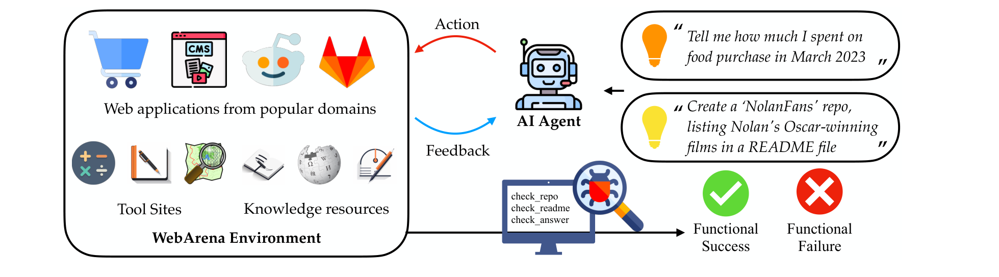
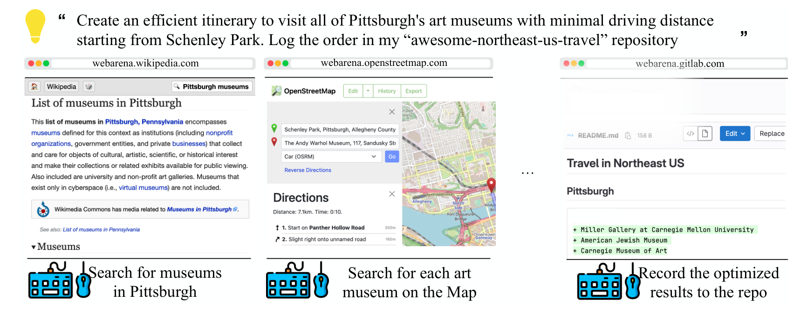
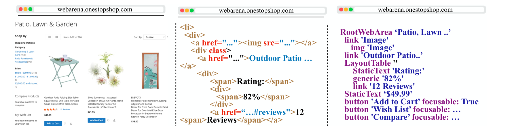
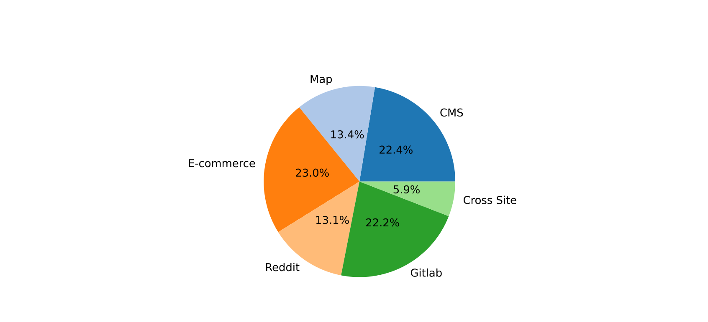
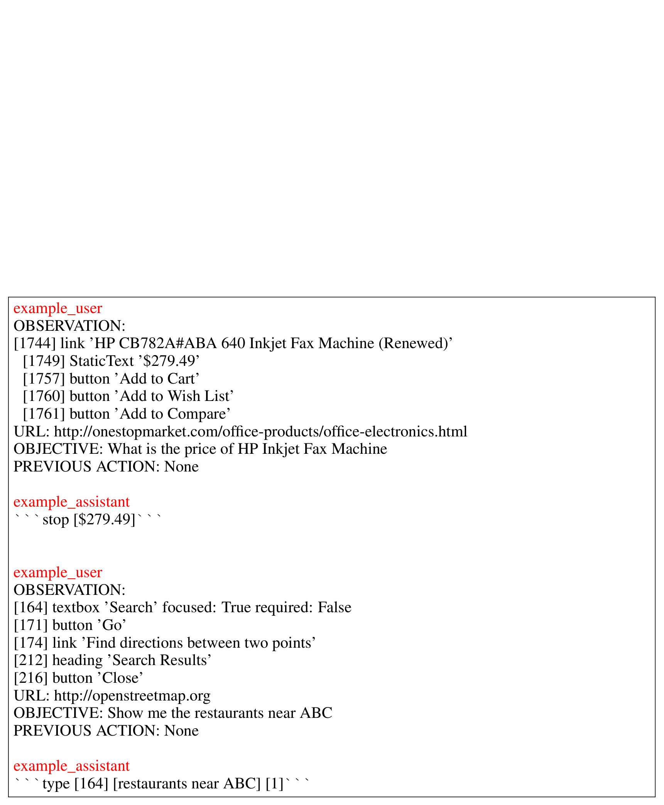

## WEBARENA: autonomous agent 구축을 위한 현실적인 web environment

**Shuyan Zhou**[^aff-1](#aff-1)[^fn-star](#fn-star) **Frank F. Xu**[^aff-1](#aff-1)[^fn-star](#fn-star) **Hao Zhu**[^aff-1](#aff-1)[^fn-dag](#fn-dag) **Xuhui Zhou**[^aff-1](#aff-1)[^fn-dag](#fn-dag) **Robert Lo**[^aff-1](#aff-1)[^fn-dag](#fn-dag) **Abishek Sridhar**[^aff-1](#aff-1)[^fn-dag](#fn-dag) **Xianyi Cheng**[^aff-1](#aff-1) **Tianyue Ou**[^aff-1](#aff-1) **Yonatan Bisk**[^aff-1](#aff-1) **Daniel Fried**[^aff-1](#aff-1) **Uri Alon**[^aff-1](#aff-1) **Graham Neubig**[^aff-1](#aff-1)

**[^1]** Carnegie Mellon University {shuyanzh, fangzhex, gneubig}@cs.cmu.edu

**[^*]** 주요 기여자.

**[^+]** 동등한 기여.

## 초록

generative AI의 발전으로, autonomous agent가 자연어 명령을 통해 일상적인 작업을 관리할 수 있는 잠재력이 생겼다. 그러나 현재 agent들은 주로 단순화된 synthetic environment에서 생성되고 테스트되어, 실제 시나리오와의 괴리가 발생한다. 본 논문에서는 매우 *현실적*이고 *재현 가능한* language-guided agent를 위한 environment를 구축한다. 구체적으로, web에서 task를 수행하는 agent에 초점을 맞추고, e-commerce, social forum discussion, collaborative software development, content management의 네 가지 일반적인 도메인에서 완전히 기능하는 website들로 environment를 구성한다. 우리의 environment는 인간과 유사한 task 해결을 장려하기 위해 도구(예: map)와 외부 knowledge base(예: user manual)로 풍부하게 구성되어 있다. 이 environment를 기반으로, task 완료의 *functional correctness*를 평가하는 데 초점을 맞춘 benchmark task 세트를 공개한다. benchmark의 task들은 다양하고, long-horizon이며, 인간이 인터넷에서 일상적으로 수행하는 task를 모방하도록 설계되었다. 우리는 reasoning before acting과 같은 최신 기법을 통합한 여러 baseline agent로 실험했다. 결과는 복잡한 task 해결이 어렵다는 것을 보여준다: 최고 성능의 GPT-4 기반 agent는 end-to-end task success rate 14.41%만을 달성했으며, 이는 78.24%의 human performance보다 현저히 낮다. 이러한 결과는 robust agent의 추가 개발 필요성, 현재 최첨단 large language model들이 이러한 실제 task에서 완벽한 성능과는 거리가 멀다는 점, 그리고 **WebArena**가 그러한 진전을 측정하는 데 사용될 수 있음을 강조한다. 코드, 데이터, environment 재현 리소스, 비디오 데모는 https://webarena.dev/ 에서 공개적으로 이용 가능하다.

## 1 서론

자연어 명령을 통해 일상적인 task를 수행하는 autonomous agent는 인간의 능력을 크게 향상시키고, 효율성을 개선하며, 접근성을 높일 수 있다. 그럼에도 불구하고, autonomous agent의 능력을 완전히 활용하려면, *진정성 있고* *재현 가능한* environment에서 그들의 행동을 이해하는 것이 중요하다. 이를 통해 인간 사용자가 관심을 가지는 task에 대한 agent의 능력을 공정하고 일관된 방식으로 측정할 수 있다.

agent를 평가하기 위한 현재 environment들은 실제 상황을 과도하게 단순화하는 경향이 있다. 결과적으로, 많은 environment의 기능은 실제 대응물의 제한된 버전이며, task 다양성의 부족으로 이어진다 [[1]](#ref-1)[[2]](#ref-2)[[3]](#ref-3)[[4]](#ref-4)[[5]](#ref-5)[[6]](#ref-6)[[7]](#ref-7). 또한, 이러한 단순화는 종종 실제 세계에서의 실행과 비교하여 task의 복잡성을 낮춘다 [[8]](#ref-8)[[5]](#ref-5)[[7]](#ref-7). 마지막으로, 일부 environment는 static resource로 제시되어 [[1]](#ref-1)[[9]](#ref-9) agent가 데이터 수집 중에 이전에 캐시된 state에만 접근하도록 제한되어, 탐색의 폭과 다양성이 제한된다. evaluation을 위해, 많은 environment는 예측된 action sequence의 텍스트 표면 형식을 reference action sequence와 비교하는 데 초점을 맞추어, 실행의 functional correctness와 가능한 대안적 해결책을 무시한다 [[8]](#ref-8)[[10]](#ref-10)[[11]](#ref-11)[[12]](#ref-12)[[9]](#ref-9). 이러한 제한은 종종 simulated environment와 실제 세계 사이의 불일치를 초래하며, 복잡한 실제 상황을 성공적으로 이해하고, 적응하고, 작동하는 AI agent의 일반화 가능성에 잠재적으로 영향을 미칠 수 있다.

우리는 task를 수행할 수 있는 autonomous agent의 개발을 촉진하기 위해 설계된 현실적이고 재현 가능한 web environment인 **WebArena**를 소개한다(섹션 2). WebArena의 개요는 Figure 1에 있다. 우리의 environment는 인터넷에서 널리 사용되는 각각 다른 도메인을 대표하는 네 개의 완전히 운영 가능한 self-hosted web application으로 구성된다: online shopping, discussion forum, collaborative development, business content management. 또한, WebArena는 가능한 인간과 유사한 task 실행을 최적으로 지원하기 위해 map, calculator, scratchpad와 같은 여러 utility tool을 통합한다. 마지막으로, WebArena는 영어 Wikipedia와 같은 일반 리소스부터 통합 개발 도구 사용 manual [[13]](#ref-13)과 같은 더 도메인별 참조까지 다양한 documentation과 knowledge base의 광범위한 컬렉션으로 보완된다. 이러한 website를 채우는 콘텐츠는 실제 대응물에서 추출되어, 각 플랫폼에서 제공되는 콘텐츠의 진정성을 보존한다. 우리는 Docker container와 gym-API [[14]](#ref-14)를 사용하여 hosting service를 제공하여, WebArena의 사용성과 재현성을 모두 보장한다.

WebArena와 함께, 고수준 자연어 지시를 WebArena에서의 상호작용으로 grounding하는 812개의 long-horizon web 기반 task가 포함된 즉시 사용 가능한 benchmark를 공개한다(섹션 3). 각 task는 고수준 자연어 intent로 설명되며, 인간이 일반적으로 사용하는 추상적인 언어 사용 패턴을 모방한다 [[15]](#ref-15). 두 가지 예시 intent가 Figure 1의 왼쪽 상단에 표시되어 있다. 우리는 이러한 task의 *functional correctness*, 즉 실행 결과가 실제로 원하는 목표를 달성하는지를 평가하는 데 초점을 맞춘다(섹션 3.2). 예를 들어, Figure 2의 예시를 평가하기 위해, 우리의 evaluation 방법은 지정된 repository의 구체적인 내용을 검증한다. 이 evaluation은 텍스트 표면 형식의 action sequence를 비교하는 것 [[8]](#ref-8)[[9]](#ref-9)보다 더 신뢰할 수 있을 뿐만 아니라 [[16]](#ref-16)[[17]](#ref-17)[[18]](#ref-18), 충분히 복잡한 task에서 보편적인 현상인 동일한 목표를 달성하기 위한 다양한 유효한 경로를 수용한다.

우리는 이 benchmark를 사용하여 NL 명령을 따르고 web 기반 task를 수행할 수 있는 여러 agent를 평가한다(섹션 4). 이러한 agent들은 GPT-4 및 PALM-2와 같은 강력한 large language model(LLM)을 사용한 few-shot in-context learning 방식으로 구현된다. 실험 결과는 최고의 GPT-4 agent 성능이 다소 제한적이며, end-to-end task success rate가 14.41%에 불과한 반면, human performance는 78.24%임을 보여준다. 우리는 현재 LLM의 제한된 성능이 복잡한 task를 성공적으로 수행하기 위한 active exploration과 failure recovery와 같은 중요한 능력의 부족에서 비롯된다고 가정한다(섹션 5.1). 이러한 결과는 WebArena에서 robust하고 effective한 agent를 향한 추가 개발의 필요성을 강조한다 [[19]](#ref-19).

## 2 WEBARENA: autonomous agent를 위한 environment로서의 website

우리의 목표는 현실적이고 재현 가능한 web environment를 만드는 것이다. 우리는 live website에 의존하지 않고 environment를 독립적으로 만들어 재현성을 달성한다. 이는 봇이 CAPTCHA의 대상이 되거나, 예측할 수 없는 콘텐츠 수정, 구성 변경과 같은 기술적 과제를 우회하여, 시간이 지남에 따라 서로 다른 시스템 간의 공정한 비교를 방해하는 것을 방지한다. 여러 인기 카테고리의 많은 사용 중인 사이트의 기반이 되는 오픈 소스 라이브러리를 사용하고 실제 대응물에서 데이터를 가져와 현실성을 달성한다.

**Figure 1**: WebArena는 autonomous agent 구축을 위한 독립적이고 self-hostable한 web environment이다. WebArena는 실제 대응물의 기능과 데이터를 모방하는 네 가지 인기 카테고리의 website를 생성한다. 인간의 문제 해결을 모방하기 위해, WebArena는 도구와 knowledge resource를 독립적인 website로 포함한다. WebArena는 고수준의 현실적인 자연어 명령을 구체적인 web 기반 상호작용으로 해석하는 benchmark를 도입한다. 각 task의 functional correctness를 프로그래밍 방식으로 검증하는 validator를 제공한다.

**Figure 2**: WebArena에서 완전히 실행될 수 있는 고수준 task. 성공은 정교하고 장기적인 계획과 추론을 필요로 한다. 목표(상단)를 달성하기 위해, agent는 (1) Wikipedia에서 Pittsburgh 미술관을 찾고, (2) map에서 그들의 위치를 식별하고(일정을 최적화하면서), (3) 계획된 경로로 적절한 repository의 README 파일을 업데이트해야 한다.

## 2.1 고수준 자연어를 통한 agent 제어

WebArena environment는 state space $\mathcal{S}$, action space $\mathcal{A}$(섹션 2.4), observation space $\mathcal{O}$(섹션 2.3)를 가진 $\mathcal{E} = \langle \mathcal{S}, \mathcal{A}, \mathcal{O}, \mathcal{T} \rangle$로 표기된다. transition function $\mathcal{T}: \mathcal{S} \times \mathcal{A} \rightarrow \mathcal{S}$는 deterministic이며, environment의 각 website의 기본 구현에 의해 정의된다. 자연어 intent $i$로 설명된 task가 주어지면, agent는 intent $i$, 현재 observation $o_t \in \mathcal{O}$, action history $a_1^{t-1}$ 및 observation history $o_1^{t-1}$에 기반하여 action $a_t \in \mathcal{A}$를 발행한다. 결과적으로, action은 새로운 state $s_{t+1} \in \mathcal{S}$와 해당 observation $o_{t+1} \in \mathcal{O}$를 생성한다. 우리는 task 실행의 성공을 측정하기 위한 reward function $r(a_1^T, s_1^T)$를 제안하며, 여기서 $a_1^T$는 시작부터 종료 time step $T$까지의 action sequence를 나타내고, $s_1^T$는 모든 intermediate state를 나타낸다. 이 reward function은 state transition이 intent의 기대에 부합하는지 평가한다. 예를 들어, 주문을 하라는 intent의 경우, 주문이 실제로 이루어졌는지 확인한다. 또한, 예측된 답변의 정확성을 확인하는 것과 같이 agent action의 정확성을 평가한다.

## 2.2 website 선택

어떤 카테고리의 website를 사용할지 결정하기 위해, 먼저 저자들의 실제 web browser history에서 약 200개의 예시를 분석했다. 각 저자는 자신의 browsing history를 살펴보고, 특정 browser session 세그먼트의 목표를 요약했다. 이를 바탕으로, 방문한 website를 추상적 카테고리로 분류했다. 그런 다음 가장 두드러진 네 가지 카테고리를 식별하고 이 분석을 기반으로 카테고리당 하나의 인스턴스를 구현했다: (1) online shopping 활동을 지원하는 **E-commerce** 플랫폼(예: Amazon, eBay), (2) 의견 교환을 위한 **social forum** 플랫폼(예: Reddit, StackExchange), (3) software development를 위한 **collaborative development** 플랫폼(예: GitLab), (4) 디지털 콘텐츠의 생성 및 수정을 관리하는 **content management system**(CMS)(예: online store management).

이러한 플랫폼 외에도, web 기반 task에서 자주 사용되는 세 가지 utility 스타일 도구를 선택했다: (1) 탐색 및 기관이나 장소와 같은 관심 지점(POI)에 대한 정보 검색을 위한 **map**, (2) **calculator**, (3) 메모를 위한 **scratchpad**. 정보 탐색과 지식 획득은 web 기반 task에서 중요하므로, 다양한 knowledge resource도 WebArena에 통합했다. 이러한 리소스는 영어 Wikipedia와 같은 일반 정보 허브부터 website user manual과 같은 더 전문화된 knowledge base까지 다양하다.

**구현** 각 카테고리와 관련된 오픈 소스 라이브러리를 활용하여 E-commerce website(OneStopShop), GitLab, Reddit, online store content management system(CMS), map, 영어 Wikipedia의 자체 버전을 구축했다. 그런 다음 실제 대응물에서 샘플링된 데이터를 가져왔다. 예를 들어, 우리의 GitLab 버전은 실제 GitLab 프로젝트를 기반으로 개발되었다.[^1] 많은 issue와 pull request가 있는 인기 프로젝트와 더 작은 개인 프로젝트 모두를 포함하여 일반적인 code repository의 특성을 신중하게 모방했다. WebArena의 모든 website에 대한 세부 정보는 Appendix A.1에서 찾을 수 있다. environment를 docker로 제공하고 environment를 deterministic initial state로 reset하는 script를 제공한다(Appendix A.2 참조).

[^1]: https://gitlab.com/gitlab-org/gitlab

## 2.3 observation space

web browser 경험을 대략적으로 모방하도록 observation space를 설계한다: web page URL, 열린 tab, focus된 tab의 web page 내용. WebArena는 tool 사용, tab 간의 직접 비교 및 참조, 기타 기능을 촉진하기 위해 multi-tab web 기반 task를 고려한 최초의 web environment이다. multi-tab 기능은 모든 것을 single tab에 유지하는 것보다 인간의 web browsing 습관을 더 진정성 있게 복제한다. page 내용을 여러 mode로 렌더링할 수 있는 유연한 구성을 제공한다(예시는 Figure 3 참조): (1) 이전 연구 [[1]](#ref-1)[[9]](#ref-9)[[12]](#ref-12)에서 일반적으로 사용되는 Document Object Model(DOM) tree로 구성된 raw web page HTML; (2) 현재 web page를 RGB array로 나타내는 pixel 기반 표현인 **screenshot**, (3) web page의 **accessibility tree**.[^2] accessibility tree는 web page의 내용을 표시하는 데 관련 있고 유용한 element가 있는 DOM tree의 하위 집합이다. 모든 element는 해당 role(예: link), 텍스트 내용 및 속성(예: focusable 여부)으로 표현된다. accessibility tree는 DOM 표현보다 더 압축적이면서 web page의 구조화된 정보를 대부분 유지한다.

[^2]: https://developer.mozilla.org/en-US/docs/Glossary/Accessibility_tree

모든 mode에 대해 viewport 내의 내용으로 제한하는 옵션을 제공한다. 이는 observation이 제한된 context length를 가진 text 기반 model이나 이미지 크기 또는 해상도 요구 사항이 있는 image 기반 model에 입력될 수 있도록 보장한다.

**Figure 3**: observation을 URL과 web page의 내용으로 설계하며, 내용을 screenshot(왼쪽), HTML DOM tree(중간), accessibility tree(오른쪽)로 표현하는 옵션이 있다. 중간과 오른쪽 그림의 내용은 공간 절약을 위해 잘렸다.

## 2.4 action space

web 및 embodied environment에서의 navigation과 operation에 대한 이전 연구 [[1]](#ref-1)[[20]](#ref-20)를 따라, web page에서 사용 가능한 keyboard와 mouse operation을 모방하는 compound action space를 설계한다. Figure 4는 세 가지 그룹으로 분류된 모든 사용 가능한 action을 나열한다. 첫 번째 그룹은 clicking, hovering, typing, key combination pressing과 같은 element operation을 포함한다. 두 번째는 tab 열기, 닫기, 전환과 같은 tab 관련 action으로 구성된다. 세 번째 카테고리는 특정 URL 방문 또는 browsing history에서 앞뒤로 탐색하는 것과 같은 URL navigation action으로 구성된다.

이러한 action을 기반으로, WebArena는 agent에게 다양한 방식으로 operation을 위한 element를 참조할 수 있는 유연성을 제공한다. element는 화면상의 좌표 $(x, y)$ 또는 각 element 앞에 붙는 고유한 element ID로 선택할 수 있다. 이 ID는 Document Object Model(DOM) 또는 accessibility tree를 순회할 때 생성된다. element ID를 사용하면, element 선택이 $n$-way classification 문제로 변환되어, agent나 기본 구현에서 필요한 disambiguation 노력이 제거된다. 예를 들어, `[1582] Add to Cart`의 observation이 주어지면 `click [1582]` action을 발행하면 버튼이 클릭된다. 이 유연한 element 선택을 통해 WebArena는 step count와 같은 공정한 비교 지표를 손상시키지 않으면서 다양한 방식으로 설계된(예: 다른 modality에서 입력을 받는) agent를 지원할 수 있다.

**Figure 4: WebArena의 Action Space**

| Action 유형 | 설명 | 카테고리 | 예시 |
|-------------|-------------|----------|---------|
| `noop` | 아무것도 하지 않음 | Element Operations | - |
| `click(elem)` | element를 클릭 | Element Operations | - |
| `hover(elem)` | element 위에 hover | Element Operations | - |
| `type(elem, text)` | element에 입력 | Element Operations | - |
| `press(key_comb)` | key combination 누름 | Element Operations | - |
| `scroll(dir)` | 위 아래로 스크롤 | Element Operations | - |
| `tab_focus(index)` | i번째 tab에 focus | Tab Management | - |
| `new_tab` | 새 tab 열기 | Tab Management | - |
| `tab_close` | 현재 tab 닫기 | Tab Management | - |
| `go_back` | 마지막 URL 방문 | URL Navigation | - |
| `go_forward` | go_back 취소 | URL Navigation | - |
| `goto(URL)` | URL로 이동 | URL Navigation | - |

**Figure 5: 세 가지 카테고리의 예시 intent**

| 카테고리 | 예시 Intent |
|----------|----------------|
| Information Seeking | 내가 마지막으로 샴푸를 산 게 언제야 |
| Information Seeking | AMC Waterfront에서 Randyland까지 걷기와 운전 시간 비교 |
| Site Navigation | 나에게 할당된 merge request 확인 |
| Site Navigation | 평점이 가장 좋은 인체공학적 의자 보여줘 |
| Content & Config | 'NYC에서 차가 필요한가요' 질문 게시 |
| Content & Config | 사기꾼 Yoke의 리뷰 삭제 |

**User Role Simulation** 동일한 website의 사용자는 종종 그들의 고유한 *role*, *permission*, *interaction history*로 인해 서로 다른 경험을 한다. 각 플랫폼에서 고유한 user profile을 생성하여 이 시나리오를 모방한다. 세부 사항은 Appendix A.3에서 찾을 수 있다.

## 3 web 기반 task의 benchmark suite

고수준 자연어 instruction을 WebArena에서의 interaction으로 grounding하는 812개의 test example이 포함된 benchmark를 제공한다. 각 example에는 task 실행의 functional correctness를 평가하는 metric이 있다. 이 섹션에서는 먼저 자연어를 통한 autonomous agent 제어 task를 공식적으로 정의한다. 그런 다음 benchmark의 annotation process를 소개한다.

## 3.1 intent 수집

WebArena 내에서 복잡하고 창의적인 task를 수행하기 위한 현실적인 intent를 큐레이션하는 데 초점을 맞춘다. 시작하기 위해, annotator들은 website의 내용과 기능에 익숙해지기 위해 몇 분 동안 website를 탐색하도록 안내받았다. 대부분의 website는 샘플링된 데이터에도 불구하고 open-web 대응물과 사실상 동일하므로, 대부분의 annotator는 website를 빠르게 이해할 수 있다.

다음으로, annotator들에게 다음 기준에 따라 intent를 공식화하도록 지시했다:

- (1) intent는 **추상적이고 고수준**이어야 하며, 이는 task가 단지 한두 개의 action으로 완료될 수 없음을 의미한다. 예를 들어, 'science subreddit 클릭' 대신, 여러 action을 수행해야 하는 'science subreddit에 인사 메시지 게시'와 같이 더 복잡한 것을 제안하도록 권장했다.
- (2) intent는 **창의적**이어야 한다. 계정 생성과 같은 일반적인 task는 쉽게 생각할 수 있다. 제약 조건을 추가하여(예: 'GitLab 계정과 동일한 Reddit 계정 생성') intent를 더 독특하게 만들도록 annotator들을 권장했다.
- (3) intent는 대체 가능한 element를 변수로 만들어 **template**으로 공식화되어야 한다. annotator들은 또한 각 변수에 대한 여러 인스턴스화를 개발하는 책임이 있었다. 예를 들어, 'GitLab 계정과 동일한 Reddit 계정 생성' intent는 '{site1: Reddit, site2: GitLab}'과 '{site1: GitLab, site2: OneStopShopping}'과 같은 인스턴스화와 함께 'create a {{site1}} account identical to my {{site2}} one'로 변환될 수 있다. 특히, 동일한 template에서 파생된 task는 다른 execution trace를 가질 수 있다. 유사성은 주로 특정 구현보다는 고수준 의미론에 있다.

또한 각 website의 개요를 포함하고 이 사이트에서 수행할 수 있는 잠재적인 task를 설명하도록 model에 지시하는 ChatGPT[^3]와 함께 사용할 프롬프트를 annotator들에게 제공했다. 또한 annotator들이 참조할 수 있는 큐레이션된 예시 목록을 제공했다.

[^3]: https://chat.openai.com/

**Intent 분석** 총 241개의 template과 812개의 인스턴스화된 intent를 큐레이션했다. 평균적으로 각 template은 3.3개의 example로 인스턴스화된다. intent 분포는 Figure 6에 표시되어 있다. 또한, Figure 5에 표시된 예시와 함께 intent를 세 가지 주요 카테고리로 분류한다:

- (1) **Information-seeking** task는 텍스트 응답을 기대한다. 중요한 점은, WebArena의 이러한 task가 종종 여러 page에 걸친 탐색이나 user-centric content에 초점을 맞춘다는 것이다. 이는 간단한 retrieval 단계로 일반 지식을 쿼리하는 데 초점을 맞춘 open-domain question-answering [[21]](#ref-21)[[22]](#ref-22)과 구별된다. 예를 들어, '내가 마지막으로 샴푸를 산 게 언제야'라는 질문에 답하기 위해, agent는 사용자의 구매 내역을 순회하며, 주문 세부 정보를 확인하여 가장 최근의 샴푸 구매를 식별해야 한다.
- (2) **Site navigation**: 이 카테고리는 검색 기능과 링크와 같은 다양한 interactive element를 사용하여 web page를 탐색해야 하는 task로 구성된다. 목표는 종종 특정 정보를 찾거나 사이트의 특정 섹션으로 이동하는 것이다.
- (3) **Content and configuration operation**: 이 카테고리는 콘텐츠 또는 설정을 생성, 수정 또는 구성하기 위해 web environment에서 작동해야 하는 task를 포함한다. 여기에는 설정 조정, 계정 관리, 온라인 거래 수행, 새로운 web 콘텐츠 생성, 기존 콘텐츠 수정이 포함된다. 예시는 소셜 미디어 상태 또는 README 파일 업데이트부터 온라인 구매 수행 및 개인정보 보호 설정 구성까지 다양하다.

## 3.2 evaluation annotation

**Information Seeking Task 평가** 텍스트 답변이 예상되는 information-seeking task의 정확성을 측정하기 위해, 각 intent에 대해 annotate된 답변 $a^*$를 제공한다. $a^*$는 다음 scoring function $r_{\text{info}}(\hat{a}, a^*)$ 중 하나로 예측된 답변 $\hat{a}$와 추가 비교된다.

먼저, $a^*$와 동일한 $\hat{a}$만이 1점을 받는 `exact_match`를 정의한다. 이 function은 question answering 문헌 [[23]](#ref-23)[[21]](#ref-21)의 evaluation과 유사하게, 응답이 더 표준화된 형식을 따르는 intent 유형에 주로 적용된다.

둘째, $a^*$를 포함하는 모든 $\hat{a}$가 1점을 받는 `must_include`를 만든다. 이 function은 주로 순서가 없는 텍스트 목록이 예상되거나 evaluation의 강조점이 특정 핵심 개념에 있을 때 사용된다. Table 1의 두 번째 예시에서, 답변을 전달하는 데 사용되는 정확한 표현에 관계없이 올바른 이름과 이메일 주소가 모두 제시되기를 기대한다.

마지막으로, language model을 활용하여 $\hat{a}$가 $a^*$와 의미적으로 동등한지 평가하는 `fuzzy_match`를 도입한다. 구체적으로, 본 연구에서는 `gpt-4-0613`을 사용하여 이 evaluation을 수행한다. 해당 프롬프트 세부 정보는 Appendix A.7에 제공된다. `fuzzy_match` function은 답변의 형식이 다양한 상황에 적용된다. 예를 들어, 'AMC Waterfront에서 Randyland까지 걷기와 운전 시간 비교'에 응답할 때, 운전 시간과 걷기 시간이 올바른 용어와 정확하게 연결되어 있는지 확인하는 것이 필수적이다. `fuzzy_match` function은 또한 시간 '2h58min'을 '2 hour 58 minutes', '2:58' 등 다양한 형식과 유연하게 매칭할 수 있다. 섹션 A.8에서 language model이 이 task에서 거의 완벽한 성능을 달성할 수 있음을 보여준다.

**Site Navigation 및 Content & Config Task 평가** 이 카테고리의 task는 특정 조건을 충족하는 web page에 접근하거나 각 website의 기본 data storage를 수정하는 operation을 수행해야 한다. 이를 평가하기 위해, 결과가 의도된 결과와 일치하는지 확인하기 위해 execution trajectory 내의 intermediate state $s$를 프로그래밍 방식으로 검사하는 reward function $r_{\text{prog}}(s)$를 설정한다. 이러한 intermediate state는 종종 website의 기본 database, 실행의 각 단계에서 web page의 상태와 내용이다.

각 instance를 평가하는 것은 두 가지 구성 요소를 포함한다. 먼저, 각 intent와 관련된 중요한 내용을 검색하는 **locator**를 제공한다. 이 locator의 구현은 구현 가능성에 따라 database query, website 지원 API 호출, 관련 web page의 JavaScript element selection까지 다양하다. 예를 들어, Table 1의 다섯 번째 예시 intent의 evaluation process는 먼저 state sequence $s$의 마지막 state를 검사하여 최신 게시물의 URL을 얻는다. 그런 다음 해당 게시물 page로 이동하여 Javascript `document.querySelector('.submission__inner').outerText`를 실행하여 게시물 내용을 얻는다.

그 후, 위치한 내용 내에 존재해야 하는 keyword를 annotate한다. 예를 들어, evaluation은 게시물의 URL을 검사하여 게시물이 'nyc' subreddit에 올바르게 게시되었는지, 게시물 내용을 검사하여 게시물에 요청된 내용이 포함되어 있는지 확인한다. 이 목적을 위해 information-seeking task의 `exact_match`와 `must_include` function을 재사용한다.

**Table 1**: 두 가지 evaluation 접근 방식을 소개한다. $r_{\text{info}}$(상단)는 information-seeking task 수행의 정확성을 측정한다. 예측된 답변 $\hat{a}$를 세 가지 구현으로 annotate된 reference $a^*$와 비교한다. $r_{\text{prog}}$(하단)는 실행 중의 intermediate state가 intent에 의해 지정된 예상 속성을 가지고 있는지 프로그래밍 방식으로 확인한다.

| Function | ID | Intent | Eval 구현 |
|----------|-----|--------|---------------------|
| $r_{\text{info}}(\hat{a}, a^*)$ | 1 | 역사상 가장 많은 취소가 있는 고객 이름을 알려줘 | `exact_match`($\hat{a}$, 'Samantha Jones') |
| | 2 | 전화번호 8015551212의 고객 이름과 이메일 찾기 | `must_include`($\hat{a}$, 'Sean Miller') `must_include`($\hat{a}$, 'sean@gmail.com') |
| | 3 | AMC Waterfront에서 Randyland까지 걷기와 운전 시간 비교 | `fuzzy_match`($\hat{a}$, 'walking: 2h58min') `fuzzy_match`($\hat{a}$, 'driving: 21min') |
| $r_{\text{prog}}(s)$ | 4 | 나에게 할당된 merge request 확인 | url=`locate_current_url`($s$) `exact_match`(URL, 'gitlab.com/merge_requests?assignee_username=byteblaze') |
| | 5 | 'NYC에서 차가 필요한가요' 질문 게시 | url=`locate_latest_post_url`($s$) body=`locate_latest_post_body`($s$) `must_include`(URL, '/f/nyc') `must_include`(body, 'a car in NYC') |

**Unachievable Task** 불충분한 증거, user permission(섹션 A.3) 또는 website의 필요한 기능 지원 부재와 같은 제약으로 인해, 인간은 완료할 수 없는 task를 요청할 수 있다. unanswerable question에 대한 question-answering model 평가에 관한 이전 연구 [[24]](#ref-24)에서 영감을 받아, WebArena에서 unachievable task를 설계한다. 예를 들어, 'OneStopShop의 연락처 번호를 알려줘'와 같은 intent를 수행하는 것은 WebArena에서 실행 불가능하다. website가 그러한 연락처 정보를 제공하지 않기 때문이다. 이러한 instance를 "N/A"로 레이블링하고 agent가 동등한 응답을 생성하기를 기대한다. 이러한 example을 통해 agent가 근거 없는 주장을 피하고 사실적 정확성을 준수하는 능력을 평가할 수 있다.

**Annotation Process** intent는 섹션 3.1의 annotation guideline에 따라 저자들이 기여했다. 모든 저자는 web 기반 task에 대한 광범위한 경험을 가지고 있다. information-seeking task에 대한 reference 답변은 저자들과 외부 annotator가 큐레이션했다. 일관성과 정확성을 보장하기 위해, 각 질문은 두 번 annotate되었다. 두 annotator가 동의하지 않으면, 세 번째 annotator가 annotation을 최종화했다. 나머지 example을 평가하는 프로그램은 JavaScript 프로그래밍에 능숙한 세 명의 저자가 기여했다. 어려운 task는 annotation의 정확성을 보장하기 위해 종종 공동으로 논의되었다. annotation은 annotator가 전체 실행을 수행하고 intermediate state를 면밀히 조사해야 했다.

**Human Performance** 170개의 template 각각에서 하나의 task를 샘플링하고 다섯 명의 computer science 대학원생에게 이러한 task를 수행하도록 요청했다. human performance는 아래에 표시되어 있다. 전반적으로, human annotator는 task의 78.24%를 완료했으며, information-seeking task에서 더 낮은 성능을 보였다. 기록된 trajectory를 검토한 결과,

| 지표 | 값 |
|--------|-------|
| 평균 시간 | 110초 |
| Success Rate (info) | 74.68% |
| Success Rate (others) | 81.32% |
| Success Rate (all) | **78.24%** |

실패의 50%가 intent 오해석(예: 이동 시간을 물었을 때 이동 거리 제공), 불완전한 답변(예: 이름과 이메일을 물었을 때 이름만 제공), 불완전한 실행(예: 제품 정보를 부분적으로만 채움)으로 인한 것이며, 나머지 instance는 실행이 목표에서 벗어난 더 심각한 실패를 보인다. human annotation에 대한 더 많은 논의는 섹션 A.5에서 찾을 수 있다.

## 4 baseline web agent

두 가지 prompting 전략으로 세 가지 LLM을 실험하며, 둘 다 context에 두 개의 example을 사용한다. 첫 번째 설정에서는 LLM에게 현재 observation, intent 및 이전에 수행된 action이 주어지면 다음 action을 직접 예측하도록 요청한다. 두 번째 설정에서는 동일한 정보로, model이 action 예측 전에 텍스트에서 먼저 chain-of-thought reasoning 단계를 수행한다(CoT, [[25]](#ref-25)[[26]](#ref-26)). example 전에, browser environment, 허용된 action 및 많은 규칙에 대한 자세한 개요를 제공한다. model이 unachievable task를 인식하도록 하기 위해, instruction은 agent가 task를 수행할 수 없다고 믿으면 중지하도록 명시적으로 요청한다. 이 지시를 *Unachievable hint* 또는 *UA hint*라고 한다. 이 도입은 공정한 비교를 보장하기 위해 human annotator에게 제시한 guideline과 대부분 동일하다. observation space로 element ID가 있는 accessibility tree를 사용한다. agent는 element의 ID로 어떤 element와 상호작용할지 식별할 수 있다. 예를 들어, agent는 ID가 1582인 'Add to Cart' 버튼을 클릭하기 위해 `click [1582]`를 발행할 수 있다. 전체 프롬프트는 Appendix A.9에서 찾을 수 있다. 각 model의 자세한 구성은 Appendix A.6에서 찾을 수 있다.

## 5 결과

주요 결과는 Table 2 상단에 표시되어 있다. GPT-4 [[27]](#ref-27)와 CoT prompting은 11.70%의 적당한 end-to-end task success rate를 달성하며, 이는 78.24%의 human performance보다 현저히 낮다. GPT-3.5 [[28]](#ref-28)와 CoT prompting은 task의 8.75%만을 성공적으로 수행할 수 있다. 명시적 reasoning 절차는 다소 도움이 되며, 그것 없는 버전보다 2.34% 향상을 가져온다. 또한, TEXT-BISON-001 [[29]](#ref-29)은 5.05%의 success rate로 GPT-3.5보다 성능이 낮다. 이러한 결과는 특히 WebArena와 같은 현실적인 environment에서 long horizon에 걸친 task 실행의 본질적인 도전과 복잡성을 강조한다.

## 5.1 분석

**model은 언제 멈춰야 하는지 아는가?** execution trajectory의 error 분석에서, model이 unachievability를 결론 내려 조기에 중단하는 일반적인 error 패턴을 관찰한다. 예를 들어, GPT-4는 실행 가능한 task의 54.9%를 불가능하다고 잘못 식별한다. 이 문제는 주로 instruction의 UA hint에서 비롯되며, 이 hint는 model이 unachievable task를 식별할 수 있게 하지만, 달성 가능한 task에서의 성능도 저해한다. 이를 해결하기 위해, 이 hint를 제거하는 ablation study를 수행한다. 그런 다음 achievable task와 unachievable task 모두에 대한 success rate를 분해한다. Table 2에 표시된 대로, 이 instruction을 제거하면 achievable task에서 성능이 향상되어, GPT-4의 전체 task success rate가 14.41%로 향상된다. unachievable task를 식별하는 데 전반적인 감소에도 불구하고, GPT-4는 명시적 instruction 없이도 non-achievability의 이유를 생성하여 그러한 task의 44.44%를 인식하는 능력을 유지한다. 반면, GPT-3.5는 이 수준의 reasoning을 거의 보이지 않는다. 대신, 잘못된 답변을 hallucinating하거나, 유효하지 않은 action을 반복하거나, step 제한을 초과하는 것과 같은 문제가 있는 패턴을 따르는 경향이 있다. 이 결과는 instruction 설계의 미묘한 차이조차도 복잡한 environment에서 interactive task를 수행하는 model의 동작에 상당한 영향을 미칠 수 있음을 시사한다.

**model은 유사한 task에서 일관된 성능을 유지할 수 있는가?** 동일한 template에서 유래한 task는 observation과 execution이 다르더라도 일반적으로 유사한 reasoning과 planning process를 따른다. Table 3에 model의 per-template success rate 히스토그램을 표시한다. 61개의 template 중, GPT-4는 단 4개의 template에서만 100% task success rate를 달성하는 반면, GPT-3.5는 어떤 template에서도 완전한 task 완료를 달성하지 못한다. 많은 경우, model은 template 내에서 하나의 task 변형만 완료할 수 있다. 이러한 관찰은 task가 동일한 template에서 파생되더라도 서로 다른 도전을 제시할 수 있음을 나타낸다. 예를 들어, 'Fork metaseq'는 간단한 task일 수 있지만, 동일한 template에서 파생된 'Fork all repos from Facebook'은 더 많은 반복 작업을 필요로 하여 복잡성이 증가한다. 따라서 WebArena는 더 정교한 방법을 평가하기 위한 testbed를 제공한다. 특히, 과거 실험에서 성공적인 전략을 재사용할 수 있도록 memory component를 통합하는 방법 [[30]](#ref-30)[[31]](#ref-31). 예시와 함께 더 많은 error 분석은 Appendix A.10에서 찾을 수 있다.

**Table 2**: 다양한 prompting 전략을 사용한 WebArena에서의 end-to-end task success rate(SR %). **CoT**: model이 action을 발행하기 전에 단계별 reasoning을 수행한다. **UA hint**: unachievable question을 만나면 model에게 중지하도록 요청한다.

| CoT | UA Hint | Model | SR | SR_AC | SR_UA |
|-----|---------|-------|-----|-------|-------|
| Yes | Yes | TEXT-BISON-001 | 5.05 | 4.00 | 27.78 |
| No | Yes | GPT-3.5 | 6.41 | 4.90 | 38.89 |
| Yes | Yes | GPT-3.5 | 8.75 | 6.44 | 58.33 |
| Yes | Yes | GPT-4 | 11.70 | 8.63 | 77.78 |
| No | No | GPT-3.5 | 5.10 | 4.90 | 8.33 |
| Yes | No | GPT-3.5 | 6.16 | 6.06 | 8.33 |
| Yes | No | GPT-4 | **14.41** | 13.02 | 44.44 |
| - | Yes | Human | **78.24** | 77.30 | 100.00 |

**Table 3**: GPT model(UA hint 없음)에서 >= 1 성공적인 실행이 있는 template의 success rate 분포.

**Table 4**: 자연어 instruction을 구체적인 실행으로 grounding하는 benchmark와 기존 benchmark의 비교. 본 benchmark는 완전히 상호작용 가능한 매우 현실적인 environment에서 구현된다. 인간이 일상에서 마주할 수 있는 다양한 task를 특징으로 한다. task 실행의 functional correctness를 평가하기 위한 evaluation metric을 설계한다.

| Benchmark | 참조 | Dynamic Interaction? | Realistic Environment? | Diverse Human Tasks? | Functional Correctness? |
|-----------|-----------|---------------------|----------------------|---------------------|------------------------|
| Mind2Web | [[9]](#ref-9) | No | Yes | Yes | No |
| Form/QAWoB | [[1]](#ref-1) | No | Yes | Yes | No |
| MiniWoB++ | [[20]](#ref-20) | Yes | No | No | Yes |
| Webshop | [[7]](#ref-7) | Yes | No | No | Yes |
| ALFRED | [[5]](#ref-5) | Yes | No | No | Yes |
| VirtualHome | [[8]](#ref-8) | No | No | Yes | No |
| AndroidEnv | [[32]](#ref-32) | Yes | Yes | No | No |
| **WebArena** | (Ours) | **Yes** | **Yes** | **Yes** | **Yes** |

## 6 관련 연구

**자연어를 통한 Agent 제어를 위한 Benchmark** 디지털 세계에서 자연어를 통한 agent 제어는 문헌에서 연구되어 왔다 [[33]](#ref-33)[[1]](#ref-1)[[20]](#ref-20)[[32]](#ref-32)[[9]](#ref-9)[[12]](#ref-12)[[11]](#ref-11). 그러나 기능성, 진정성, environment dynamics 지원 사이의 균형은 여전히 과제로 남아 있다. Table 4에 표시된 대로 기존 benchmark는 종종 이러한 측면을 타협한다. 일부 연구는 static state에 의존하여 agent의 exploration과 functional correctness evaluation을 제한하고 [[1]](#ref-1)[[9]](#ref-9), 다른 연구는 실제 세계의 복잡성을 단순화하여 task 다양성을 제한한다 [[7]](#ref-7)[[20]](#ref-20). AndroidEnv [[32]](#ref-32)가 Android 설정을 복제하지만, live Android application이 사용되기 때문에 재현성을 보장하지 않는다. [[34]](#ref-34)[[5]](#ref-5)[[8]](#ref-8)는 gaming environment로 확장되며 [[13]](#ref-13)[[35]](#ref-35), environment mechanism이 종종 인간의 목표와 diverge한다.

**Interactive Decision-Making Agent** [[36]](#ref-36)은 web을 검색하고 검색 결과를 읽어 질문에 답하는 WebGPT를 소개한다. [[37]](#ref-37)은 task 실행을 위해 Javascript 코드를 합성하는 web agent를 제안한다. multi-modal 차원을 추가하여, [[38]](#ref-38)과 [[39]](#ref-39)는 text 기반 DOM tree에 의존하는 대신 web page의 screenshot을 기반으로 action을 예측하는 agent를 개발한다. interactive environment에서 task를 수행하려면 agent가 hierarchical planning, state tracking, error recovery를 포함한 여러 능력을 보여야 한다. 기존 연구 [[40]](#ref-40)[[41]](#ref-41)[[42]](#ref-42)는 LLM이 task를 더 관리하기 쉬운 sub-task로 분해할 수 있음을 관찰한다 [[43]](#ref-43). 이 process는 task 실행을 program으로 표현하여 더 정제될 수 있으며, 이 기법은 sub-task 관리와 skill 재사용을 돕는다 [[30]](#ref-30)[[44]](#ref-44)[[31]](#ref-31)[[45]](#ref-45). 한편, search와 backtracking 방법은 결정 재고를 허용하면서 더 구조화된 planning 접근 방식을 도입한다 [[46]](#ref-46)[[47]](#ref-47). 기존 연구는 또한 failure recovery, self-correction [[48]](#ref-48)[[49]](#ref-49), observation summarization [[50]](#ref-50)을 통합하여 실행 robustness를 개선한다. WebArena의 복잡성은 이러한 방법의 추가 테스트와 개선을 위한 독특한 도전과 기회를 제시한다.

## 7 결론

우리는 autonomous agent의 개발과 테스트를 위해 설계된 매우 현실적이고 독립적이며 재현 가능한 web environment인 **WebArena**를 제시한다. WebArena는 인기 도메인의 완전히 기능하는 web application과 organic data를 포함한다. 또한, 고수준 자연어 intent를 구체적인 web interaction으로 매핑하는 데 초점을 맞춘 812개의 example으로 구성된 포괄적인 benchmark를 큐레이션한다. task 성공을 프로그래밍 방식으로 검증하는 outcome 기반 evaluation도 제공한다. 실험 결과 GPT-4조차도 14.41%의 제한된 end-to-end task success rate만을 달성하며, 이는 78.24%의 human performance보다 현저히 뒤처진다. 이러한 발견은 향후 연구가 WebArena environment 내에서 autonomous agent의 robustness와 efficacy를 향상시키는 데 초점을 맞춰야 할 필요성을 강조한다.

## 감사의 글

Emmy Liu, Zhiruo Wang, Zhitong Guo가 우리의 annotation을 검토해 주신 것에 감사드립니다. Webshop의 raw Amazon product data를 제공해 주신 Shunyu Yao, 유익한 토론을 해주신 Pengfei Liu, Zaid Sheikh, Aman Madaan에게도 감사드립니다. 또한 computational resource를 제공해 주신 Center for AI Safety에 감사드립니다. 이 자료는 부분적으로 Air Force Research Laboratory와의 계약 번호 FA8750-19-2-0200에 따라 후원받은 연구를 기반으로 합니다. 미국 정부는 저작권 표시에도 불구하고 정부 목적을 위해 reprints를 재생산하고 배포할 권한이 있습니다. 여기에 포함된 견해와 결론은 저자들의 것이며, Air Force Research Laboratory 또는 미국 정부의 공식 정책이나 지지를 반드시 나타내는 것으로 해석되어서는 안 됩니다. 이 프로젝트는 또한 AWS AI의 기부로 부분적으로 지원되었습니다.

## 참고문헌

**[1]** Tianlin Shi, Andrej Karpathy, Linxi Fan, Jonathan Hernandez, and Percy Liang. World of bits: An open-domain platform for web-based agents. In *Proceedings of the 34th International Conference on Machine Learning, ICML 2017*, volume 70 of Proceedings of Machine Learning Research, pp. 3135-3144. PMLR, 2017. URL http://proceedings.mlr.press/v70/shi17a.html

**[2]** Peter Anderson, Qi Wu, Damien Teney, Jake Bruce, Mark Johnson, Niko Sunderhauf, Ian D. Reid, Stephen Gould, and Anton van den Hengel. Vision-and-language navigation: Interpreting visually-grounded navigation instructions in real environments. In *2018 IEEE Conference on Computer Vision and Pattern Recognition, CVPR 2018*, pp. 3674-3683. IEEE Computer Society, 2018. doi: 10.1109/CVPR.2018.00387

**[3]** Daniel Gordon, Aniruddha Kembhavi, Mohammad Rastegari, Joseph Redmon, Dieter Fox, and Ali Farhadi. IQA: visual question answering in interactive environments. In *2018 IEEE Conference on Computer Vision and Pattern Recognition, CVPR 2018*, pp. 4089-4098. IEEE Computer Society, 2018. doi: 10.1109/CVPR.2018.00430

**[4]** Dipendra K Misra, Jaeyong Sung, Kevin Lee, and Ashutosh Saxena. Tell me dave: Context-sensitive grounding of natural language to manipulation instructions. *The International Journal of Robotics Research*, 35(1-3):281-300, 2016.

**[5]** Mohit Shridhar, Jesse Thomason, Daniel Gordon, Yonatan Bisk, Winson Han, Roozbeh Mottaghi, Luke Zettlemoyer, and Dieter Fox. ALFRED: A benchmark for interpreting grounded instructions for everyday tasks. In *2020 IEEE/CVF Conference on Computer Vision and Pattern Recognition, CVPR 2020*, pp. 10737-10746. IEEE, 2020. doi: 10.1109/CVPR42600.2020.01075

**[6]** Mohit Shridhar, Xingdi Yuan, Marc-Alexandre Cote, Yonatan Bisk, Adam Trischler, and Matthew J. Hausknecht. Alfworld: Aligning text and embodied environments for interactive learning. In *9th International Conference on Learning Representations, ICLR 2021*. OpenReview.net, 2021. URL https://openreview.net/forum?id=0IOX0YcCdTn

**[7]** Shunyu Yao, Howard Chen, John Yang, and Karthik Narasimhan. Webshop: Towards scalable real-world web interaction with grounded language agents. 2022a. URL https://arxiv.org/abs/2207.01206

**[8]** Xavier Puig, Kevin Ra, Marko Boben, Jiaman Li, Tingwu Wang, Sanja Fidler, and Antonio Torralba. Virtualhome: Simulating household activities via programs. In *2018 IEEE Conference on Computer Vision and Pattern Recognition, CVPR 2018*, pp. 8494-8502. IEEE Computer Society, 2018. doi: 10.1109/CVPR.2018.00886

**[9]** Xiang Deng, Yu Gu, Boyuan Zheng, Shijie Chen, Samuel Stevens, Boshi Wang, Huan Sun, and Yu Su. Mind2web: Towards a generalist agent for the web, 2023.

**[10]** Yacine Jernite, Kavya Srinet, Jonathan Gray, and Arthur Szlam. CraftAssist Instruction Parsing: Semantic Parsing for a Minecraft Assistant. *ArXiv preprint*, abs/1905.01978, 2019. URL https://arxiv.org/abs/1905.01978

**[11]** Nancy Xu, Sam Masling, Michael Du, Giovanni Campagna, Larry Heck, James Landay, and Monica Lam. Grounding open-domain instructions to automate web support tasks. In *Proceedings of the 2021 Conference of the North American Chapter of the Association for Computational Linguistics: Human Language Technologies*, pp. 1022-1032, 2021. doi: 10.18653/v1/2021.naacl-main.80

**[12]** Yang Li, Jiacong He, Xin Zhou, Yuan Zhang, and Jason Baldridge. Mapping natural language instructions to mobile UI action sequences. In *Proceedings of the 58th Annual Meeting of the Association for Computational Linguistics*, pp. 8198-8210, 2020. doi: 10.18653/v1/2020.acl-main.729

**[13]** Linxi Fan, Guanzhi Wang, Yunfan Jiang, Ajay Mandlekar, Yuncong Yang, Haoyi Zhu, Andrew Tang, De-An Huang, Yuke Zhu, and Anima Anandkumar. Minedojo: Building open-ended embodied agents with internet-scale knowledge. In *Thirty-sixth Conference on Neural Information Processing Systems Datasets and Benchmarks Track*, 2022. URL https://openreview.net/forum?id=rc8o_j8I8PX

**[14]** Greg Brockman, Vicki Cheung, Ludwig Pettersson, Jonas Schneider, John Schulman, Jie Tang, and Wojciech Zaremba. OpenAI Gym, 2016. URL [arXiv:1606.01540](https://arxiv.org/abs/1606.01540)

**[15]** Yonatan Bisk, Jan Buys, Karl Pichotta, and Yejin Choi. Benchmarking hierarchical script knowledge. In *Proceedings of the 2019 Conference of the North American Chapter of the Association for Computational Linguistics: Human Language Technologies, Volume 1 (Long and Short Papers)*, pp. 4077-4085, 2019. doi: 10.18653/v1/N19-1412

**[16]** Victor Zhong, Caiming Xiong, and Richard Socher. Seq2sql: Generating structured queries from natural language using reinforcement learning. *ArXiv preprint*, abs/1709.00103, 2017. URL https://arxiv.org/abs/1709.00103

**[17]** Mark Chen, Jerry Tworek, Heewoo Jun, Qiming Yuan, Henrique Ponde, Jared Kaplan, Harri Edwards, Yura Burda, Nicholas Joseph, Greg Brockman, et al. Evaluating large language models trained on code. *ArXiv preprint*, abs/2107.03374, 2021. URL https://arxiv.org/abs/2107.03374

**[18]** Zhiruo Wang, Shuyan Zhou, Daniel Fried, and Graham Neubig. Execution-based evaluation for open-domain code generation. *ArXiv preprint*, abs/2212.10481, 2022. URL https://arxiv.org/abs/2212.10481

**[19]** Yann LeCun. A path towards autonomous machine intelligence version 0.9. 2, 2022-06-27. *Open Review*, 62, 2022.

**[20]** Evan Zheran Liu, Kelvin Guu, Panupong Pasupat, Tianlin Shi, and Percy Liang. Reinforcement learning on web interfaces using workflow-guided exploration. In *6th International Conference on Learning Representations, ICLR 2018*. OpenReview.net, 2018. URL https://openreview.net/forum?id=ryTp3f-0-

**[21]** Zhilin Yang, Peng Qi, Saizheng Zhang, Yoshua Bengio, William Cohen, Ruslan Salakhutdinov, and Christopher D. Manning. HotpotQA: A dataset for diverse, explainable multi-hop question answering. In *Proceedings of the 2018 Conference on Empirical Methods in Natural Language Processing*, pp. 2369-2380, 2018. doi: 10.18653/v1/D18-1259

**[22]** Tom Kwiatkowski, Jennimaria Palomaki, Olivia Redfield, Michael Collins, Ankur Parikh, Chris Alberti, Danielle Epstein, Illia Polosukhin, Jacob Devlin, Kenton Lee, Kristina Toutanova, Llion Jones, Matthew Kelcey, Ming-Wei Chang, Andrew M. Dai, Jakob Uszkoreit, Quoc Le, and Slav Petrov. Natural questions: A benchmark for question answering research. *Transactions of the Association for Computational Linguistics*, 7:452-466, 2019. doi: 10.1162/tacl_a_00276

**[23]** Pranav Rajpurkar, Jian Zhang, Konstantin Lopyrev, and Percy Liang. SQuAD: 100,000+ questions for machine comprehension of text. In *Proceedings of the 2016 Conference on Empirical Methods in Natural Language Processing*, pp. 2383-2392, 2016. doi: 10.18653/v1/D16-1264

**[24]** Pranav Rajpurkar, Robin Jia, and Percy Liang. Know what you don't know: Unanswerable questions for SQuAD. In *Proceedings of the 56th Annual Meeting of the Association for Computational Linguistics (Volume 2: Short Papers)*, pp. 784-789, 2018. doi: 10.18653/v1/P18-2124

**[25]** Jason Wei, Xuezhi Wang, Dale Schuurmans, Maarten Bosma, Fei Xia, Ed Chi, Quoc V Le, Denny Zhou, et al. Chain-of-thought prompting elicits reasoning in large language models. *Advances in Neural Information Processing Systems*, 35:24824-24837, 2022.

**[26]** Shunyu Yao, Jeffrey Zhao, Dian Yu, Nan Du, Izhak Shafran, Karthik Narasimhan, and Yuan Cao. React: Synergizing reasoning and acting in language models. *ArXiv preprint*, abs/2210.03629, 2022b. URL https://arxiv.org/abs/2210.03629

**[27]** OpenAI. GPT-4 technical report. *arXiv*, pp. 2303-08774, 2023.

**[28]** OpenAI. ChatGPT: Optimizing language models for dialogue. 2022.

**[29]** Rohan Anil, Andrew M. Dai, Orhan Firat, Melvin Johnson, Dmitry Lepikhin, Alexandre Passos, Siamak Shakeri, Emanuel Taropa, Paige Bailey, Zhifeng Chen, et al. PaLM 2 technical report, 2023.

**[30]** Shuyan Zhou, Pengcheng Yin, and Graham Neubig. Hierarchical control of situated agents through natural language. In *Proceedings of the Workshop on Structured and Unstructured Knowledge Integration (SUKI)*, pp. 67-84, 2022a. doi: 10.18653/v1/2022.suki-1.8

**[31]** Guanzhi Wang, Yuqi Xie, Yunfan Jiang, Ajay Mandlekar, Chaowei Xiao, Yuke Zhu, Linxi Fan, and Anima Anandkumar. Voyager: An open-ended embodied agent with large language models. *ArXiv preprint*, abs/2305.16291, 2023. URL https://arxiv.org/abs/2305.16291

**[32]** Daniel Toyama, Philippe Hamel, Anita Gergely, Gheorghe Comanici, Amelia Glaese, Zafarali Ahmed, Tyler Jackson, Shibl Mourad, and Doina Precup. Androidenv: A reinforcement learning platform for android. *ArXiv preprint*, abs/2105.13231, 2021. URL https://arxiv.org/abs/2105.13231

**[33]** S.R.K. Branavan, Harr Chen, Luke Zettlemoyer, and Regina Barzilay. Reinforcement learning for mapping instructions to actions. In *Proceedings of the Joint Conference of the 47th Annual Meeting of the ACL and the 4th International Joint Conference on Natural Language Processing of the AFNLP*, pp. 82-90, 2009. URL https://aclanthology.org/P09-1010

**[34]** Eric Kolve, Roozbeh Mottaghi, Winson Han, Eli VanderBilt, Luca Weihs, Alvaro Herrasti, Daniel Gordon, Yuke Zhu, Abhinav Gupta, and Ali Farhadi. AI2-THOR: An Interactive 3D Environment for Visual AI. *arXiv*, 2017.

**[35]** Heinrich Kuttler, Nantas Nardelli, Alexander H. Miller, Roberta Raileanu, Marco Selvatici, Edward Grefenstette, and Tim Rocktaschel. The nethack learning environment. In *Advances in Neural Information Processing Systems 33: NeurIPS 2020*, 2020. URL https://proceedings.neurips.cc/paper/2020/hash/569ff987c643b4bedf504efda8f786c2-Abstract.html

**[36]** Reiichiro Nakano, Jacob Hilton, Suchir Balaji, Jeff Wu, Long Ouyang, Christina Kim, Christopher Hesse, Shantanu Jain, Vineet Kosaraju, William Saunders, et al. WebGPT: Browser-assisted question-answering with human feedback. arXiv preprint [arXiv:2112.09332](https://arxiv.org/abs/2112.09332), 2021.

**[37]** Izzeddin Gur, Hiroki Furuta, Austin Huang, Mustafa Safdari, Yutaka Matsuo, Douglas Eck, and Aleksandra Faust. A real-world webagent with planning, long context understanding, and program synthesis. arXiv preprint [arXiv:2307.12856](https://arxiv.org/abs/2307.12856), 2023.

**[38]** Kenton Lee, Mandar Joshi, Iulia Raluca Turc, Hexiang Hu, Fangyu Liu, Julian Martin Eisenschlos, Urvashi Khandelwal, Peter Shaw, Ming-Wei Chang, and Kristina Toutanova. Pix2struct: Screenshot parsing as pretraining for visual language understanding. In *International Conference on Machine Learning*, pp. 18893-18912. PMLR, 2023.

**[39]** Peter Shaw, Mandar Joshi, James Cohan, Jonathan Berant, Panupong Pasupat, Hexiang Hu, Urvashi Khandelwal, Kenton Lee, and Kristina Toutanova. From pixels to ui actions: Learning to follow instructions via graphical user interfaces. arXiv preprint [arXiv:2306.00245](https://arxiv.org/abs/2306.00245), 2023.

**[40]** Wenlong Huang, Pieter Abbeel, Deepak Pathak, and Igor Mordatch. Language models as zero-shot planners: Extracting actionable knowledge for embodied agents. In *International Conference on Machine Learning, ICML 2022*, volume 162 of Proceedings of Machine Learning Research, pp. 9118-9147. PMLR, 2022. URL https://proceedings.mlr.press/v162/huang22a.html

**[41]** Aman Madaan, Shuyan Zhou, Uri Alon, Yiming Yang, and Graham Neubig. Language models of code are few-shot commonsense learners. In *Proceedings of the 2022 Conference on Empirical Methods in Natural Language Processing*, pp. 1384-1403, 2022. URL https://aclanthology.org/2022.emnlp-main.90

**[42]** Xinze Li, Yixin Cao, Muhao Chen, and Aixin Sun. Take a break in the middle: Investigating subgoals towards hierarchical script generation. *ArXiv preprint*, abs/2305.10907, 2023. URL https://arxiv.org/abs/2305.10907

**[43]** Shuyan Zhou, Li Zhang, Yue Yang, Qing Lyu, Pengcheng Yin, Chris Callison-Burch, and Graham Neubig. Show me more details: Discovering hierarchies of procedures from semi-structured web data. In *Proceedings of the 60th Annual Meeting of the Association for Computational Linguistics (Volume 1: Long Papers)*, pp. 2998-3012, 2022b. doi: 10.18653/v1/2022.acl-long.214

**[44]** Jacky Liang, Wenlong Huang, Fei Xia, Peng Xu, Karol Hausman, Brian Ichter, Pete Florence, and Andy Zeng. Code as policies: Language model programs for embodied control. In *2023 IEEE International Conference on Robotics and Automation (ICRA)*, pp. 9493-9500. IEEE, 2023.

**[45]** Luyu Gao, Aman Madaan, Shuyan Zhou, Uri Alon, Pengfei Liu, Yiming Yang, Jamie Callan, and Graham Neubig. PAL: Program-aided language models. In *International Conference on Machine Learning*, pp. 10764-10799. PMLR, 2023.

**[46]** Shunyu Yao, Dian Yu, Jeffrey Zhao, Izhak Shafran, Thomas L Griffiths, Yuan Cao, and Karthik Narasimhan. Tree of thoughts: Deliberate problem solving with large language models. *ArXiv preprint*, abs/2305.10601, 2023. URL https://arxiv.org/abs/2305.10601

**[47]** Jieyi Long. Large language model guided tree-of-thought. *ArXiv preprint*, abs/2305.08291, 2023. URL https://arxiv.org/abs/2305.08291

**[48]** Noah Shinn, Beck Labash, and Ashwin Gopinath. Reflexion: an autonomous agent with dynamic memory and self-reflection. *ArXiv preprint*, abs/2303.11366, 2023. URL https://arxiv.org/abs/2303.11366

**[49]** Geunwoo Kim, Pierre Baldi, and Stephen McAleer. Language models can solve computer tasks. *ArXiv preprint*, abs/2303.17491, 2023. URL https://arxiv.org/abs/2303.17491

**[50]** Abishek Sridhar, Robert Lo, Frank F Xu, Hao Zhu, and Shuyan Zhou. Hierarchical prompting assists large language model on web navigation. arXiv preprint [arXiv:2305.14257](https://arxiv.org/abs/2305.14257), 2023.

**[51]** Long Ouyang, Jeffrey Wu, Xu Jiang, Diogo Almeida, Carroll Wainwright, Pamela Mishkin, Chong Zhang, Sandhini Agarwal, Katarina Slama, Alex Ray, et al. Training language models to follow instructions with human feedback. *Advances in Neural Information Processing Systems*, 35:27730-27744, 2022.

## A 부록

## A.1 website 구현

섹션 2.2에 설명된 선택된 website를 고려하여, 일반적으로 사용되는 사이트의 기능을 재현 가능한 방식으로 최대한 재현하려고 노력했다. 이를 달성하기 위해, 다양한 카테고리의 website 개발을 위한 오픈 소스 프레임워크를 활용하고 실제 대응물에서 데이터를 가져왔다. E-commerce 카테고리의 경우, 가격, 옵션, 상세 제품 설명, 이미지, 리뷰를 포함한 약 90k개의 제품이 있는 쇼핑 website를 구축했으며, 300개 이상의 제품 카테고리에 걸쳐 있다. 이 website는 오픈 소스 e-commerce 플랫폼인 Adobe Magento를 사용하여 개발되었다[^4]. 데이터 리소스는 Webshop data dump [[7]](#ref-7)에 포함된 것과 같은 실제 온라인 사이트의 데이터에서 얻었다. social forum 플랫폼의 경우, Reddit[^6]의 오픈 소스 대응물인 오픈 소스 소프트웨어 Postmill[^5]을 배포했다. 상위 50개의 subreddit[^7]에서 샘플링했다. 그런 다음 미국 북동부 도시와 machine learning 및 deep learning 관련 주제에 대한 많은 subreddit을 수동으로 선택했다. 이 수동 선택은 Reddit과 map 모두에서 미국 북동부와 관련된 정보를 찾는 것과 같은 cross-website task를 장려한다. 총 95개의 subreddit, 127390개의 게시물, 661781명의 사용자가 있다. collaborative software development 플랫폼의 경우 GitLab[^8]을 선택했다. 모든 programming language에 대해 최소 10개의 repository를 샘플링하여 code repository 특성을 heuristic하게 시뮬레이션한다: 그 중 80%는 별 수에 비례하여 가중된 discrete probability distribution을 사용하여 별 기준 상위 90 percentile repo 세트에서 샘플링되고; 나머지는 유사한 가중 분포를 사용하여 하위 10 percentile 세트에서 샘플링된다. 이는 많은 issue와 pull request가 있는 인기 프로젝트부터 작은 개인 프로젝트까지 모든 종류의 repo의 공정한 대표성을 보장하기 위해 수행된다. 총 300개의 repository와 최소 하나의 commit이 있는 1000개 이상의 계정이 있다. content management system의 경우, 공식 가이드에 제공된 sample data를 배포하여 Adobe Magento의 admin portal을 적용했다. 데이터 저장 제약으로 인해 미국 북동부 지역에 초점을 맞춰 map service 구현을 위해 OpenStreetMap[^9]을 사용한다. calculator와 scratchpad는 직접 구현했다.

[^4]: https://github.com/magento/magento2
[^5]: https://postmill.xyz/
[^6]: https://www.reddit.com/
[^7]: https://redditlist.com/sfw.html
[^8]: https://gitlab.com/gitlab-org/gitlab
[^9]: https://www.openstreetmap.org/

마지막으로, 효율적인 정보 검색을 위한 검색 기능과 함께 knowledge resource를 개별 website로 구성한다. 구체적으로, 2023년 5월 knowledge cutoff가 있는 영어 Wikipedia의 offline 버전을 host하기 위해 Kiwix[^10]를 활용한다. GitLab 및 Adobe Commerce Merchant documentation용 user manual은 공식 website에서 스크랩했다.

[^10]: https://www.kiwix.org/en/

## A.2 environment 제공 및 reset

evaluation environment의 한 가지 목표는 사용 편의성과 재현성이다. 결과적으로, website를 별도의 Docker image[^11]에 배포하며, website당 하나의 image이다. Docker image는 website의 모든 코드, database 및 기타 software dependency와 함께 완전히 self-contained이다. 또한 website의 데이터도 docker image의 일부이므로 기능을 위해 외부 volume mount에 의존하지 않는다. 이렇게 하면, 재현 가능한 evaluation을 위해 미리 채워진 모든 website를 포함하는 image를 쉽게 배포할 수 있다. 최종 사용자는 패키징된 Docker image를 다운로드하고 시스템에서 실행하여 local benchmarking을 위해 benchmark에 사용된 데이터와 함께 정확한 website를 재배포할 수 있다.

[^11]: https://www.docker.com/

일부 evaluation case는 agent가 새 사용자 생성, 게시물 삭제 등과 같이 website에 포함된 데이터를 수정해야 할 수 있으므로, website environment를 initial state로 쉽게 reset할 수 있는 것이 중요하다. Docker image를 사용하면, 사용자는 해당 website에 대해 현재 실행 중인 container를 중지하고 삭제한 다음 원래 image에서 container를 다시 시작하여 environment를 initial state로 완전히 reset할 수 있다. website에 따라, 이 과정은 몇 초에서 1분 정도 소요될 수 있다. 그러나 모든 evaluation case가 environment reset을 필요로 하는 것은 아니며, 많은 intent가 정보 수집이고 website 데이터에 대해 read-only이다. 또한, agent LLM의 inference time 비용과 결합하면, 원래 image에서 Docker container를 재시작하여 이 environment reset 방법이 evaluation time에 무시할 수 없지만 작은 영향을 미칠 것이라고 주장한다.

**Figure 6**: 다양한 website에 걸친 intent 분포. cross-site intent는 여러 website와 상호작용해야 한다. 특히, website에 관계없이 모든 user intent는 여러 web page와의 상호작용을 필요로 한다.

## A.3 user role simulation

동일한 website의 사용자는 종종 그들의 고유한 *role*, *permission*, *interaction history*로 인해 서로 다른 경험을 한다. 예를 들어, E-commerce CMS 내에서 shop owner는 모든 콘텐츠에 대한 전체 읽기 및 쓰기 권한을 가질 수 있는 반면, 직원은 제품에 대한 쓰기 권한만 부여받고 고객 데이터에 대해서는 부여받지 못할 수 있다. 각 플랫폼에서 고유한 user profile을 생성하여 이 시나리오를 모방하고자 한다.

쇼핑 사이트에서는 2년 동안 35개 이상의 주문이 있는 고객 profile을 생성했다. GitLab에서는 많은 merge request와 issue가 있는 여러 인기 오픈 소스 프로젝트를 유지하는 사용자를 선택했다. 이 사용자는 또한 몇 개의 개인 프로젝트를 비공개로 관리한다. Reddit에서 선택한 profile은 많은 게시물과 댓글로 토론에 활발하게 참여하는 사용자였다. 마지막으로, E-commerce CMS에서는 모든 system 내용에 대한 전체 읽기-쓰기 접근 권한이 있는 shop owner용 user profile을 설정했다.

모든 사용자는 사전 캐시된 cookie를 사용하여 자동으로 계정에 로그인된다. 우리가 아는 한, 이것은 그러한 특성을 구현한 최초의 공개적으로 사용 가능한 agent evaluation environment이다. 기존 문헌은 일반적으로 보편적으로 동일한 user role을 가정하고 운영된다 [[1]](#ref-1)[[20]](#ref-20)[[9]](#ref-9).

## A.4 intent 분포

website에 걸친 intent 분포는 Figure 6에 표시되어 있다.

## A.5 human performance

다른 demographics의 annotator가 참여할 때 human performance에 차이가 있을 수 있음을 인정한다. 실제로, dataset의 많은 task는 도메인별 지식을 필요로 한다. 예를 들어, 평균 사용자는 git merge request가 무엇인지 모를 수 있다; 또는 복잡한 content management system에서 제품을 만드는 방법을 모를 수 있다. 상당한 도메인 지식 없이 평균 사용자가 쉽게 수행할 수 있는 task보다는 상상하기 쉬운 결과(예: 새 제품 page가 생성됨)가 있는 task를 설계하고자 한다.

**Table 5**: temperature 0.0의 GPT-3.5-TURBO-16K-0613의 task success rate(SR %).

| CoT | UA Hint | Model | SR |
|-----|---------|-------|-----|
| Yes | No | GPT-3.5 | 6.28 |

**Table 6**: 다양한 형식의 날짜와 time duration이 동등한지 판단하는 두 버전의 GPT-4 정확도(%).

| Dataset | gpt-4-0613 | gpt-4-1106-preview |
|---------|------------|-------------------|
| Date (900 examples) | 100 | 100 |
| Time duration (900 examples) | 100 | 100 |

## A.6 실험 구성

temperature 1.0과 top_p parameter 0.9로 GPT-3.5-TURBO-16K-0613, GPT-4-0613, TEXT-BISON-001을 실험한다. 최대 state transition 수는 30으로 설정된다. 동일한 action이 동일한 observation에서 세 번 이상 반복되거나 agent가 세 번 연속 유효하지 않은 action을 생성하면 실행을 중단한다. 이러한 상황은 일반적으로 실행 실패의 높은 가능성을 나타내므로 조기 종료가 필요하다. TEXT-BISON-001의 경우, 유효한 action을 생성할 때까지 추가로 10번의 재시도를 허용한다.

주로, 탐색을 장려하기 위해 높은 temperature 1.0을 사용한다. 결과 복제를 돕기 위해, Table 5에 temperature 0.0의 GPT-3.5-TURBO-16K-0613 결과와 코드 repository의 execution trajectory를 제공한다.

## A.7 fuzzy_match를 위한 프롬프트

선생님이 질문이 주어지면 학생의 답변을 채점하도록 도와주세요. 학생이 질문에 답하기 위해 다른 표현이나 단어를 사용할 수 있음을 명심하세요. 목표는 답변이 reference 답변과 의미적으로 동등한지 평가하는 것입니다.

question: {{intent}}

reference answer: {{reference answer}}

보이는 모든 문자열 'N/A'는 'not achievable'을 의미하는 특수 시퀀스입니다

student answer: {{prediction}}

correct/incorrect/partially correct로 판정을 결론짓세요.

'correct'로 판정된 예측은 1점을 받고, 다른 모든 예측은 0점을 받습니다.

## A.8 fuzzy match function의 정확도

이를 평가하기 위해, 40개의 example을 수동으로 확인했고 그 중 39개가 우리의 인간 판단과 동일함을 발견했다. 또한, GPT-4를 evaluation에 사용해야 하는 82개의 example 중, 49개(60%)의 답변은 날짜(예: 10/23/2022) 또는 time duration(예: 15분)이다. 이러한 경우, GPT-4는 답변의 다른 형식을 판단하는 데만 사용된다. 프로그래밍 방식으로 날짜와 time duration의 다양한 형식을 생성하여 이 경우 GPT-4의 정확성을 정량적으로 평가한다. negative example을 무작위로 샘플링한다. 예를 들어, Nov 3, 2022, November 3, 2022, 3rd November 2022, 3 Nov 2022, 2022-11-03, 3rd of November, 2022는 모두 2022/11/03의 올바른 변형이다. GPT-4의 정확도는 Table 6에 표시되어 있다. 두 버전의 GPT-4가 매우 정확하며, 둘 다 100% 정확도를 달성함을 볼 수 있다.

## A.9 baseline web agent의 프롬프트

GPT-3.5와 GPT-4 모두에 대한 reasoning agent의 system message는 아래에 표시되어 있다:

---

당신은 web browser를 탐색하는 임무를 맡은 autonomous intelligent agent입니다. web 기반 task가 주어질 것입니다. 이러한 task는 발행할 수 있는 특정 action을 사용하여 수행됩니다.

**제공받을 정보:**

- **사용자의 목표**: 완료하려는 task입니다.
- **현재 web page의 accessibility tree**: page의 핵심 정보를 제공하는 web page의 단순화된 표현입니다.
- **현재 web page의 URL**: 현재 탐색 중인 page입니다.
- **열린 tab**: 열려 있는 tab입니다.
- **이전 action**: 방금 수행한 action입니다. 진행 상황을 추적하는 데 도움이 될 수 있습니다.

**수행할 수 있는 action은 여러 카테고리로 분류됩니다:**

**Page Operation Actions**
- `click [id]`: web page에서 특정 id를 가진 element를 클릭합니다.
- `type [id] [content] [press_enter_after=0|1]`: id가 있는 field에 content를 입력합니다. 기본적으로 press_enter_after가 0으로 설정되지 않는 한 입력 후 "Enter" 키가 눌립니다.
- `hover [id]`: id가 있는 element 위에 hover합니다.
- `press [key_comb]`: keyboard에서 key combination 누르기를 시뮬레이션합니다(예: Ctrl+v).
- `scroll [direction=down|up]`: page를 위 또는 아래로 스크롤합니다.

**Tab Management Actions:**
- `new_tab`: 새로운 빈 browser tab을 엽니다.
- `tab_focus [tab_index]`: index를 사용하여 browser의 focus를 특정 tab으로 전환합니다.
- `close_tab`: 현재 활성 tab을 닫습니다.

**URL Navigation Actions:**
- `goto [url]`: 특정 URL로 이동합니다.
- `go_back`: 이전에 본 page로 이동합니다.
- `go_forward`: 다음 page로 이동합니다(이전에 `go_back` action이 수행된 경우).

**Completion Action:**
- `stop [answer]`: task가 완료되었다고 생각되면 이 action을 발행합니다. 목표가 text 기반 답변을 찾는 것이라면 bracket에 답변을 제공합니다. task를 완료할 수 없다고 생각하면 bracket에 "N/A"로 답변을 제공합니다.

**Homepage:**

다른 website를 방문하려면 http://homepage.com 의 homepage를 확인하세요. 방문할 수 있는 website 목록이 있습니다.

http://homepage.com/password.html 에는 website에 대한 모든 계정 이름과 비밀번호가 나열되어 있습니다. website에 로그인하는 데 사용할 수 있습니다.

**성공하려면 다음 규칙을 따르는 것이 매우 중요합니다:**

1. 현재 observation이 주어졌을 때 유효한 action만 발행해야 합니다
2. 한 번에 하나의 action만 발행해야 합니다.
3. 예시를 따라 단계별로 추론한 다음 다음 action을 발행해야 합니다.
4. 올바른 형식으로 action을 생성합니다. "In summary, the next action I will perform is" 구문으로 시작하고 backtick 안에 action을 넣습니다. 예를 들어, "In summary, the next action I will perform is `click [1234]`".
5. 목표를 달성했다고 생각하면 stop action을 발행합니다. stop 후에는 아무것도 생성하지 마세요.

---

**Figure 8**: reasoning agent를 위해 example_user와 example_assistant로 제공된 두 가지 예시. action을 발행하기 전에 agent는 먼저 reasoning을 수행한다.

direct agent의 GPT-3.5용 system message는 동일한 형식을 따르지만 observation이 주어지면 다음 action을 직접 출력하는 단순화된 instruction을 사용한다.

**Figure 10**: direct agent를 위해 example_user와 example_assistant로 제공된 두 가지 예시. agent는 observation이 주어지면 다음 action을 직접 출력한다.

**UA hint**는 'task를 완료할 수 없다고 생각하면 bracket에 "N/A"로 답변을 제공합니다.'라는 instruction을 말한다. ablation study에서 이 문장을 제거한다.

## A.10 추가 error 분석

**Observation Bias** 현실적인 website는 최적의 사용자 접근성을 보장하기 위해 다양한 섹션에 유사한 주제에 대한 정보를 자주 제시한다. 그러나 GPT-4 agent는 종종 관련성이나 정확성을 충분히 검증하지 않고 처음 만나는 관련 정보에 매달리는 경향을 보인다. 예를 들어, E-Commerce CMS의 homepage는 *최근* 구매를 기반으로 best-selling item을 표시하는 반면, 역사적 best-seller data는 일반적으로 별도의 report를 통해 접근된다. '2022년 top-1 best-selling product가 무엇인가요'라는 task가 주어지면, GPT-4 agent는 정확한 data를 얻기 위해 report를 생성하는 필요한 단계를 우회하고 homepage에서 쉽게 사용 가능한 정보를 활용하는 것으로 기본 설정된다.

**Observation 해석의 실패** 흥미롭게도, GPT-4는 observation을 요약할 수 있지만, 이전에 입력된 입력과 같은 더 세부적인 정보를 가끔 간과한다. Figure 11의 오른쪽 예시에서, `[5172] StaticText`는 검색어 'DMV area'가 이미 입력되었음을 나타낸다. 그러나 agent는 이 세부 사항을 무시하고 최대 step 제한에 도달할 때까지 `type [2430] [DMV area]` 명령을 계속 발행한다. 또한, agent는 observation과 함께 제공되는 이전 action 정보를 종종 무시한다.

이러한 관찰된 실패가 GPT model에 사용된 현재 pretraining 및 대화에 대한 supervised fine-tuning [[51]](#ref-51)과 관련이 있다고 가정한다. 이러한 model은 주로 즉각적인 observation(즉, 대화 기록)이 주어진 instruction을 실행하도록 훈련된다; 따라서, exploration 부족을 보일 수 있다. 또한, 대화 시나리오에서 NL 표현의 미묘한 차이는 종종 전체 대화에 덜 영향을 미친다. 결과적으로, model은 observation의 사소한 변화를 간과하는 경향이 있을 수 있다.

**Figure 11**: GPT-4 agent가 실패한 두 가지 예시와 해당 screenshot 및 관련 섹션의 accessibility tree(회색). 왼쪽에서, agent는 'Fork all Facebook repos' task를 완수하기 위해 'Users' 섹션으로 진행하는 데 실패한다; 오른쪽에서, agent는 observation이 입력 상자가 채워졌음을 나타내는데도 동일한 검색 쿼리를 반복 입력한다.
