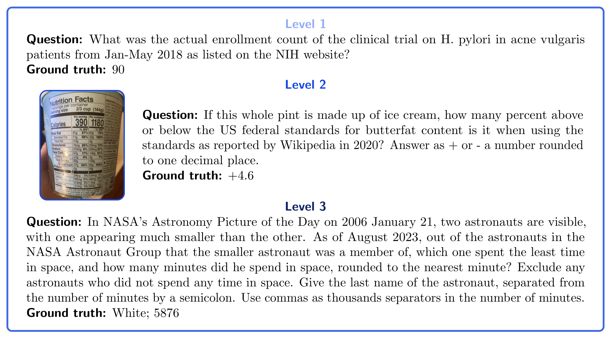
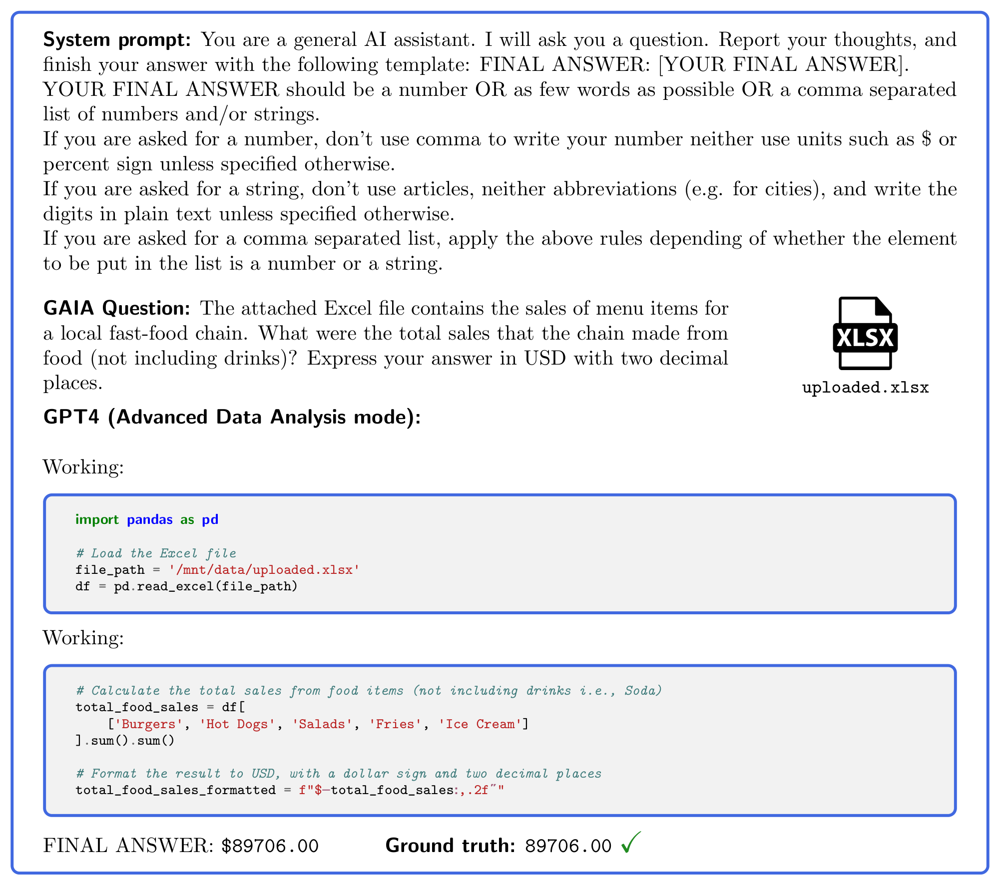
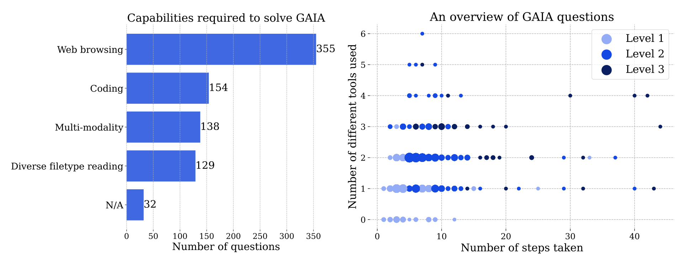
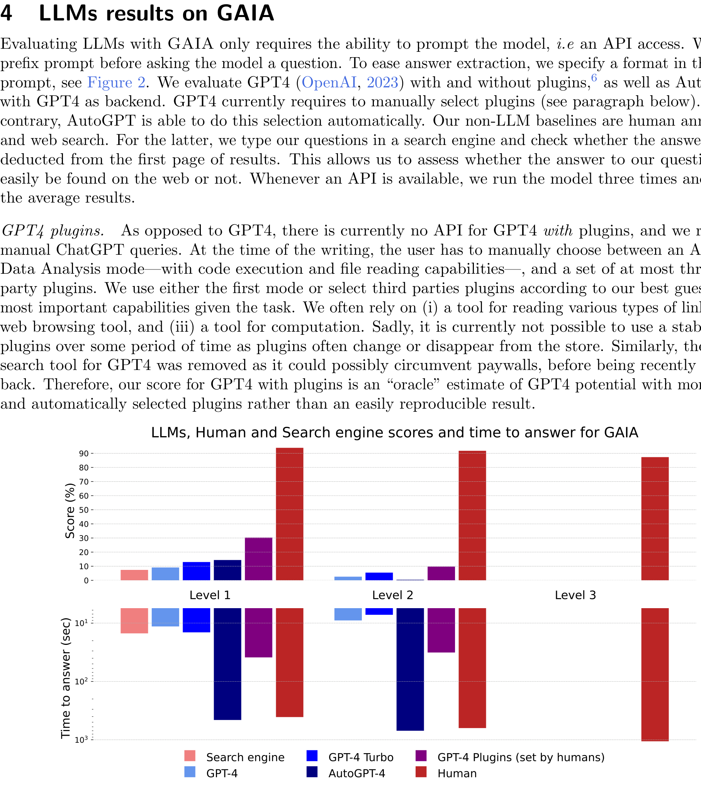
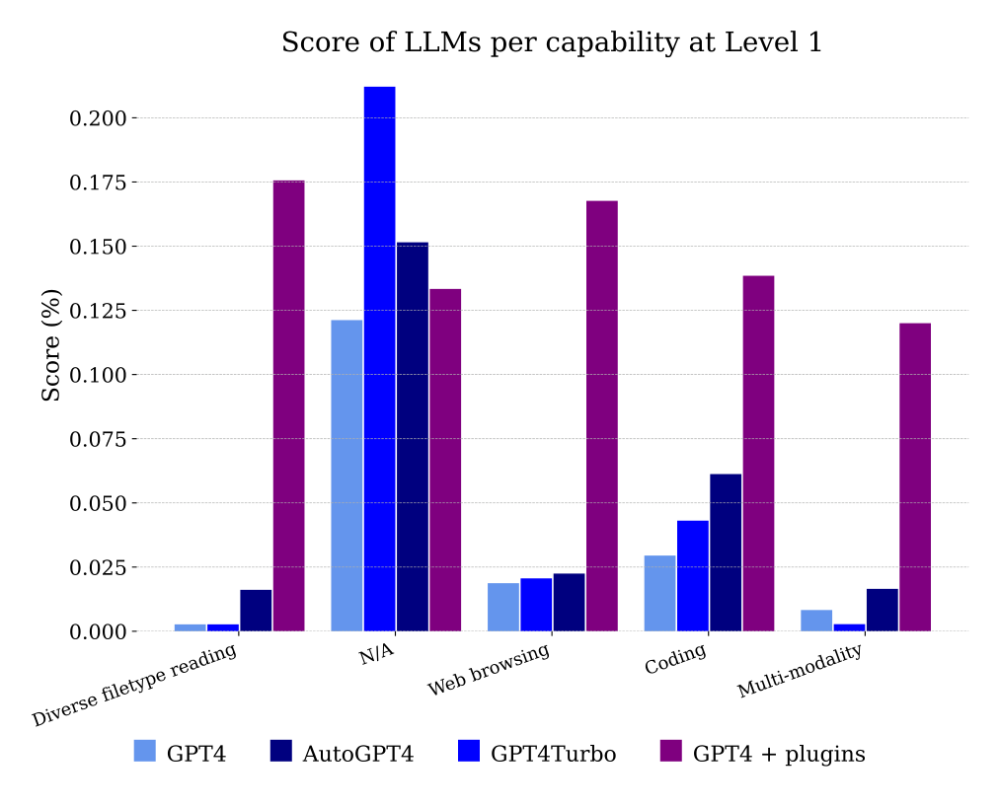

## GAIA: 범용 AI 어시스턴트를 위한 벤치마크

**Grégoire Mialon**<sup>[1](#aff-1)</sup>, **Clémentine Fourrier**<sup>[2](#aff-2)</sup>, **Craig Swift**<sup>[3](#aff-3)</sup>, **Thomas Wolf**<sup>[2](#aff-2)</sup>, **Yann LeCun**<sup>[1](#aff-1)</sup>, **Thomas Scialom**<sup>[4](#aff-4)</sup>

<a id="aff-1"></a><sup>1</sup> FAIR, Meta | <a id="aff-2"></a><sup>2</sup> HuggingFace | <a id="aff-3"></a><sup>3</sup> AutoGPT | <a id="aff-4"></a><sup>4</sup> GenAI, Meta

우리는 해결될 경우 AI 연구의 이정표가 될 범용 AI 어시스턴트를 위한 벤치마크인 GAIA를 소개한다. GAIA는 reasoning, multi-modality 처리, 웹 브라우징, 일반적인 tool-use proficiency와 같은 기본 능력 세트를 요구하는 실제 질문들을 제안한다. GAIA 질문들은 인간에게는 개념적으로 단순하지만 대부분의 고급 AI에게는 도전적이다: 인간 응답자가 92%를 얻는 반면 플러그인이 장착된 GPT-4는 15%를 얻는다는 것을 보여준다. 이 주목할 만한 성능 차이는 법률이나 화학과 같은 전문 기술을 요구하는 작업에서 LLM이 인간을 능가하는 최근 추세와 대조된다. GAIA의 철학은 인간에게 점점 더 어려운 작업을 목표로 해야 한다는 AI 벤치마크의 현재 추세에서 벗어난다. 우리는 Artificial General Intelligence(AGI)의 도래가 시스템이 그러한 질문에서 평균적인 인간과 유사한 robustness를 보여주는 능력에 달려 있다고 주장한다. GAIA의 방법론을 사용하여 466개의 질문과 그 답변을 고안했다. 우리는 질문을 공개하면서 그 중 300개의 답변은 리더보드를 지원하기 위해 보류한다.

Date: November 23, 2023

Correspondence: { gmialon,tscialom } @meta.com , clementine@huggingface.co

Code: https://huggingface.co/gaia-benchmark

## 1 서론

Large Language Model(LLM)은 범용 시스템으로 가는 길을 열어주는 것으로 알려져 있다. 실제로 그들 중 최신 모델들(OpenAI, 2023; Anthropic, 2023; Anil et al., 2023; Touvron et al., 2023)은 유창하고, 지식이 풍부하며, 어느 정도 인간의 선호에 맞춰져 있고(Ouyang et al., 2022), zero 또는 few-shot 설정에서(Brown et al., 2020) 웹 브라우저나 코드 인터프리터와 같은 도구로 보강(Mialon et al., 2023)될 수 있다. 그러나 이러한 시스템을 평가하는 것은 미해결 문제이다: 새롭게 등장하는 능력을 감안할 때, LLM은 점점 더 빠른 속도로 AI 벤치마크를 정기적으로 깨뜨리고 있다(Kiela et al., 2023).

더 도전적인 벤치마크를 찾으면서, 현재 추세는 인간에게 점점 더 어려운 작업을 찾고, 예를 들어 STEM과 법학에서 더 복잡한 교육 평가나 일관된 책 쓰기와 같은 더 복잡한 실현으로 LLM에 도전하는 것을 제안한다. 그러나 인간에게 어려운 작업이 반드시 최신 시스템에게 어려운 것은 아니다: 예를 들어 도전적인 MMLU나 GSM8k 벤치마크(Hendrycks et al., 2021; Cobbe et al., 2021)는 빠른 LLM 개선과 가능한 data contamination이 결합되어<sup>[[2]](#fn-2)</sup> 이미 거의 해결되었다<sup>[[1]](#fn-1)</sup>. 또한, open-ended generation은 일반적으로 인간 또는 모델 기반 평가를 필요로 한다(Zheng et al., 2023). 인간 평가는 출력 길이나 필요한 기술 측면에서 작업 복잡성이 증가하면 점점 더 실현 불가능해질 것이다: AI가 생성한 책이나 세계에서 몇 명만 풀 수 있는 수학 문제의 해답을 어떻게 평가할 것인가? 반면에 모델 기반 평가는 구성상 더 강력한 모델에 의존하므로 새로운 state-of-the-art 모델을 평가할 수 없으며, 첫 번째로 제시된 선택지를 선호하는 것과 같은 잠재적인 미묘한 편향은 말할 것도 없다(Zheng et al., 2023). 전반적으로, 새로운 AI 시스템을 평가하려면 벤치마크를 재고해야 한다(Chollet, 2019).

<a id="fn-1"></a>**[1]** GPT4는 MMLU에서 86.4%를 달성한다. 벤치마크에서 비전문가 인간 정확도는 34.5%에 불과하다. 전문가 수준 인간 성능은 89.8%로 추정된다.

<a id="fn-2"></a>**[2]** 예를 들어 Hellaswag의 경우를 참조하라.



## Level 1

Question: 2018년 1월-5월 NIH 웹사이트에 나열된 여드름 환자의 H. pylori에 대한 임상 시험의 실제 등록 수는 얼마였나요?

Ground truth: 90

## Level 3

Question: 2006년 1월 21일 NASA의 Astronomy Picture of the Day에서 두 명의 우주 비행사가 보이며, 한 명은 다른 사람보다 훨씬 작게 나타난다. 2023년 8월 현재, 더 작은 우주 비행사가 소속된 NASA Astronaut Group의 우주 비행사들 중 우주에서 가장 적은 시간을 보낸 사람은 누구이며, 분 단위로 반올림하여 몇 분을 우주에서 보냈는가? 우주에서 시간을 보내지 않은 우주 비행사는 제외하라. 우주 비행사의 성과 분 수를 세미콜론으로 구분하여 답하라. 분 수에는 천 단위 구분 기호로 쉼표를 사용하라.

Ground truth: White; 5876

Figure 1 샘플 GAIA 질문. 작업을 완료하려면 reasoning, multimodality 처리, tool use proficiency와 같은 기본 능력이 필요하다. 답변은 모호하지 않으며 설계상 training data에서 일반 텍스트로 발견될 가능성이 낮다. 일부 질문에는 이미지와 같은 추가 증거가 함께 제공되어 실제 사용 사례를 반영하고 질문에 대한 더 나은 제어를 허용한다.

인간에게 더 어려운 작업의 대안으로, AI 시스템은 개념적으로 단순하지만 큰 combinatorial space와 함께 복잡한 action sequence의 정확한 실행을 요구하는 작업을 해결하도록 요청받을 수 있다. 출력은 작업의 성공적인 완료 시에만 얻을 수 있고 검증하기 쉬우며, 이는 컴퓨터가 해답을 검증하기 쉬운 복잡한 문제를 풀도록 요청받는 Proof of Work 알고리즘(Jakobsson and Juels, 1999; Dwork and Naor, 1993)과 유사하다. AI 어시스턴트를 위한 작업은 다양하고 불확실한 세계에 대한 접근이 필요하다는 점을 감안할 때, 이 기준을 충족하면서 본질적으로 실용적인 사용 사례에 뿌리를 두고 있다.

우리는 466개의 신중하게 만들어진 질문과 그 답변, 관련 설계 방법론을 특징으로 하는 범용 AI 어시스턴트를 위한 벤치마크인 GAIA를 제안함으로써 그 방향으로 나아간다. 우리의 질문은 만들기 쉽고, AI 시스템에게 도전적이며(LLM의 경우 대부분 복잡한 생성이 필요함), 단일하고 사실적인 답변을 인정하여 간단하고 robust한 자동 평가를 허용한다.

GAIA는 다음을 목표로 하여 현재 LLM 평가의 함정을 피하려고 시도한다:

- **실제적이고 도전적인 질문.** 예를 들어, LLM은 일반적으로 개방적이고 변화하는 웹을 탐색하고, multi-modality를 처리하거나, 여러 단계에 걸쳐 reasoning해야 질문에 답할 수 있다. 반대로 많은 LLM 벤치마크는 상당히 특정하고/또는 폐쇄적이고 합성적인 환경에 제한된다.
- **쉬운 해석 가능성.** 개념적으로 단순한 작업(비전문가 주석자들이 거의 완벽한 점수를 보임), 관련 reasoning trace, 적지만 고도로 선별된 질문을 통해. 이는 효율성과 신뢰성이 부족할 수 있는 집계된 벤치마크와 대조된다 [[1]](#ref-1).
- **게임 불가능성.** 질문에 답하려면 몇 가지 단계를 성공적으로 완료해야 하며, 다양성으로 인해 brute force가 쉽지 않다. reasoning trace를 확인할 수 있는 가능성, 답변에 요구되는 정확성, 인터넷의 일반 텍스트에서 그것들이 없다는 점이 가능한 data contamination을 방지한다. 반대로 multiple choice 답변(예: MMLU)은 잘못된 reasoning trace가 더 쉽게 올바른 선택에 도달할 수 있기 때문에 contamination 평가를 어렵게 만든다.
- **사용의 단순성.** 중요하게도, 우리 질문에 대한 답변은 factoid하고, 간결하며, 모호하지 않다. 이러한 속성은 간단하고, 빠르며, 사실적인 평가를 허용한다. 우리 질문은 zero shot으로 답변되도록 설계되어 평가 설정의 영향을 제한한다. 반대로 많은 LLM 벤치마크는 프롬프트의 수와 성격(Liang et al., 2022b)(Section 8.2) 또는 벤치마크 구현<sup>[[3]](#fn-3)</sup>과 같은 실험 설정에 민감한 평가를 필요로 한다.

## Level 2

Question: 이 전체 파인트가 아이스크림으로 구성되어 있다면, 2020년 Wikipedia에 보고된 대로 미국 연방 butterfat 함량 표준보다 몇 퍼센트 위 또는 아래인가요? 소수점 한 자리로 반올림하여 + 또는 -로 답하세요.

Ground truth: +4.6

인간에게 어려운 작업에서 성공했음에도 불구하고, 가장 유능한 LLM들은 GAIA에서 저조한 성과를 보인다. 도구가 장착되어 있어도 GPT4는 가장 쉬운 작업에서 30% success rate를 넘지 못하고, 가장 어려운 작업에서는 0%이다. 그동안 인간 응답자의 평균 success rate는 92%이다. 따라서 GAIA를 해결할 수 있는 시스템은 t-AGI<sup>[[4]](#fn-4)</sup>의 맥락에서 평가될 수 있으며, 인간은 일반적으로 가장 간단한 질문에 6분에서 가장 복잡한 질문에 17분이 걸린다는 점에 주목한다. 관련 관점에서, 그러한 시스템은 Morris et al. (2023)이 최근 제안한 프레임워크 내에서 유능한 General AI라고 할 수 있으며, 이는 ChatGPT(OpenAI, 2023)가 한 단계 아래이므로 AI 연구의 다음 이정표인 것으로 보인다. 이 논문은 GAIA의 구성, 설계 선택, 그리고 커뮤니티가 tool use와 관련된 안전이나 multi-modality와 같은 새로운 질문을 목표로 벤치마크를 추가로 확장할 수 있도록 질문을 만드는 방법과 관련 과제를 설명한다. 또한 가장 유능한 어시스턴트들의 성공과 단점을 분석하여 LLM 보강의 잠재력을 설명한다. 166개의 주석이 달린 질문의 developer set을 공개하고 나머지 300개 질문은 주석 없이 공개한다: 벤치마크는 특히 리더보드로 호스팅될 것이다. 우리의 방법론이 NLP와 그 이상에서 open ended generation 평가 문제를 해결하는 데 도움이 되기를 바라며, GAIA의 성공적인 해결이 차세대 AI 시스템을 향한 중요한 이정표가 될 것이라고 믿는다.

## 2 관련 연구

**Large Language Model 평가.** LLM 능력이 빠르게 발전함에 따라, 벤치마크는 점점 더 빠른 속도로 포화되고 있다. 예를 들어, reading comprehension은 몇 년 전만 해도 여전히 도전적인 작업이었다(Rajpurkar et al., 2016). Wang et al. (2018)은 General Language Understanding Evaluation benchmark(GLUE)를 도입했고, 모델은 1년 이내에 인간을 능가했다. 그 확장판(Wang et al., 2019)은 출시 후 몇 년 이상 버티지 못했다. 더 일반적으로, 매년 정적 벤치마크가 포화되고 인간 수준으로 해결되는 속도가 점점 더 빨라지고 있으며, 이는 Kiela et al. (2023)에 잘 설명되어 있다. 더 어려운 평가를 찾으면서, 자연스러운 방향은 법률이나 과학과 같은 다양한 분야에서 전문가 수준의 지식이 필요한 작업을 탐구하는 것이다: 예를 들어 MMLU(Hendrycks et al., 2021)는 STEM, 인문학, 사회 과학 등 57개 과목에 걸쳐 15,000개 이상의 질문을 포함한다. 그러나 LLM은 이미 이러한 분야에서 인간 성능을 넘어섰으며, 미국 변호사 시험을 합격할 수 있는 단계에 도달했다고 보고되었고(OpenAI, 2023) 임상 역량을 평가하고 면허를 부여하는 미국 시험 프로그램인 USMLE의 합격 점수를 초과했다고도 보고되었다(Nori et al., 2023). LLM을 더 전체적으로, 더 넓은 대화 측면에서 평가하는 방향에는 (i) 평가 편집물(Gao et al., 2021; Liang et al., 2022a; Srivastava et al., 2023)이 포함되는데, 이는 종종 의미 있게 집계하기 어렵고 data leakage를 통한 contamination에 취약하며, (ii) 인간 평가는 시간이 많이 걸리고 확장하기 어렵고, (iii) 이 한계를 극복하기 위한 모델 기반 평가(Zheng et al., 2023)가 있다. 그러나 이 후자의 솔루션은 현재 평가되는 것보다 더 유능한 LLM(종종 GPT4)을 사용하는 것에 의존하며, 평가의 품질은 평가자 LLM의 단점에 영향을 받는데, 이는 항상 명확하지 않고 미묘하게 잘못된 결과로 이어질 수 있다.

**범용 어시스턴트 평가.** Large Language Model을 범용 어시스턴트로 전환하려는 지속적인 노력이 있지만(Appendix A의 논의 참조), 적절한 평가는 뒤처져 있다. 대부분의 평가는 폐쇄 시스템, 특정 API 호출 사용, 그리고 답변에 도달하는 주어진 '올바른 방법'에 의존하거나, 단순히 기존 평가 데이터셋을 재사용한다. 예를 들어 ToolQA(Zhuang et al., 2023)나 Gentopia(Xu et al., 2023a)는 training 중 contamination 위험이 있고 tool 사용이 실제로 테스트되는지 보장하지 않으면서 기존 데이터셋을 인간 주석(MMLU, MATH 등)과 결합한다. Gorilla(Patil et al., 2023)는 APIBench를 도입하여 에이전트와 같은 시스템이 특정 API를 얼마나 잘 호출하는지 테스트하며, API-Bank(Li et al., 2023b)도 마찬가지로 평가 중 LLM을 돕기 위한 API 풀을 제공한다. AgentBench

<a id="fn-3"></a>**[3]** [https://huggingface.co/blog/evaluating-mmlu-leaderboard](https://huggingface.co/blog/evaluating-mmlu-leaderboard)

<a id="fn-4"></a>**[4]** [https://www.alignmentforum.org/posts/BoA3agdkAzL6HQtQP/clarifying-and-predicting-agi](https://www.alignmentforum.org/posts/BoA3agdkAzL6HQtQP/clarifying-and-predicting-agi)에서 정의된 대로, t-AGI는 대부분의 작업에서 시간 t가 주어진 대부분의 인간 전문가를 이긴다

(Liu et al., 2023a)는 더 일반적이며, 어시스턴트 LLM이 사용자 쿼리에 답하기 위해 배포될 수 있는 여러 폐쇄 박스 환경을 제공한다(Unix 셸부터 WebShopping API까지). 그러나 이러한 평가가 폐쇄 환경에 의존하기 때문에, 실제 세계 상호작용에 기반한 더 일반적인 결과 대신 어시스턴트가 특정 API를 사용하는 방법을 얼마나 잘 배웠는지 평가하는 위험이 있다. 반대로 GAIA는 가능한 API를 지정하지 않으며 실제 세계와의 상호작용에 의존한다. OpenAGI(Ge et al., 2023)는 플랫폼과 벤치마크를 모두 도입하며, 양식과 능력에 걸친 여러 multi-step 작업으로 구성되어 우리 연구에 더 가깝다. GAIA와의 핵심 차이점은 그들의 작업이 다가오는 발전보다는 현재 모델 능력에 초점을 맞춘다는 것이다.

## 3 GAIA

이 섹션은 GAIA의 설계와 내용, 그리고 질문 생성 및 관련 과제에 대한 지침을 다룬다.

## 3.1 범용 AI 어시스턴트를 위한 편리하면서도 도전적인 벤치마크

**GAIA란 무엇이며 어떻게 작동하는가?** GAIA는 일반 어시스턴트 질문을 제안하는 AI 시스템을 위한 벤치마크이다. GAIA는 LLM 평가의 다양한 함정을 피하려고 시도한다. 인간이 설계하고 주석을 단 466개의 질문으로 구성된다. 이러한 질문은 텍스트 기반이며, 때때로 파일(이미지나 스프레드시트와 같은)이 함께 제공된다. 일상적인 개인 작업, 과학 또는 일반 지식과 같은 다양한 어시스턴트 사용 사례를 다룬다. 질문은 짧고 단일한 정답을 인정하도록 설계되어 검증하기 쉽다. GAIA를 사용하려면 AI 어시스턴트에게 질문과 첨부 증거가 있다면 그것을 zero-shot으로 프롬프트하기만 하면 된다. GAIA에서 완벽한 점수를 받으려면 다양한 기본 능력 세트가 필요하다(Section 3.3 참조). 보충 자료에서 다양한 메타데이터와 함께 질문을 제공한다.

**설계 선택.** GAIA는 수정된 AI 벤치마크의 필요성과 LLM 평가의 관찰된 단점 모두에서 비롯된다.

우리의 첫 번째 원칙은 인간에게는 개념적으로 단순하지만 잠재적으로 지루한, 그러나 다양하고, 실제 세계에 뿌리를 두고 있으며 현재 AI 시스템에게 도전적인 질문을 목표로 하는 것이다. 이를 통해 전문화된 기술보다는 reasoning을 통한 빠른 적응, multi-modality 이해, 잠재적으로 다양한 tool 사용과 같은 기본 능력에 집중할 수 있다(Chollet, 2019). 질문은 일반적으로 제공된 문서나 개방적이고 변화하는 웹과 같은 다양한 소스에서 수집된 정보를 찾고 잠재적으로 결합하여 정확한 답변을 생성하는 것으로 구성된다. 위의 첫 번째 예제 질문(Figure 1)에 답하려면 LLM은 일반적으로 웹을 탐색하여 연구를 찾은 다음 올바른 등록 수를 찾아야 한다. 이는 인간에게 점점 더 어려운 벤치마크의 추세와 반대되며, 순전히 텍스트적이거나 인공적인 환경에서 작동한다.

우리의 두 번째 원칙은 해석 가능성이다. 제한된 수의 고도로 선별된 질문은 집계된 것에 비해 벤치마크 사용을 더 쉽게 만든다(Perlitz et al., 2023). 작업의 개념적 단순성(인간 success rate는 92%)은 사용자가 모델의 reasoning trace를 쉽게 이해할 수 있게 한다. Figure 1의 Level 1 질문의 경우, reasoning trace는 대부분 올바른 웹사이트를 확인하고 올바른 등록 수를 보고하는 것으로 구성되며, 이는 검증하기 쉽다.

우리의 세 번째 원칙은 memorization에 대한 robustness이다: GAIA는 대부분의 현재 벤치마크보다 게임하기 어렵도록 목표로 한다. 작업을 완료하려면 시스템이 일정 수의 단계를 계획하고 성공적으로 완료해야 하는데, 결과 답변은 설계상 현재 pre-training 데이터의 일반 텍스트에 없기 때문이다. 정확도의 진전은 실제 시스템 진전을 반영한다. 다양성과 action space의 크기로 인해, 이러한 작업은 예를 들어 ground truth를 암기하는 것과 같은 치팅 없이는 brute-force할 수 없다. data contamination을 통한 우연한 memorization이 가능하지만, 답변에 요구되는 정확성, pre-training 데이터에서의 부재, reasoning trace를 확인할 수 있는 가능성이 이 위험을 완화한다. 반대로 multiple choice 답변은 잘못된 reasoning trace가 여전히 올바른 선택에 도달할 수 있기 때문에 contamination 평가를 어렵게 만든다. 이러한 완화에도 불구하고 심각한 memorization이 발생하면 Section 3.4에서 제공하는 지침을 사용하여 새 질문을 쉽게 만들 수 있다.

System prompt: You are a general AI assistant. I will ask you a question. Report your thoughts, and finish your answer with the following template: FINAL ANSWER: [YOUR FINAL ANSWER].

YOUR FINAL ANSWER should be a number OR as few words as possible OR a comma separated list of numbers and/or strings.

If you are asked for a number, don't use comma to write your number neither use units such as $ or percent sign unless specified otherwise.

If you are asked for a string, don't use articles, neither abbreviations (e.g. for cities), and write the digits in plain text unless specified otherwise.

If you are asked for a comma separated list, apply the above rules depending of whether the element to be put in the list is a number or a string.

GAIA Question: 첨부된 Excel 파일에는 지역 패스트푸드 체인의 메뉴 항목 판매가 포함되어 있습니다. 체인이 음식(음료 제외)에서 올린 총 매출은 얼마입니까? 소수점 두 자리까지 USD로 답하세요.

## GPT4 (Advanced Data Analysis mode):

Working:

```
import pandas as pd # Load the Excel file file_path = '/mnt/data/uploaded.xlsx' df = pd.read_excel(file_path)
```



**Figure 2**: GAIA에 답하기 위해, GPT4(여기서는 code interpreter가 장착됨)와 같은 AI 어시스턴트는 잠재적으로 도구를 사용하거나 파일을 읽으면서 몇 가지 단계를 완료해야 한다.

```
Working: # Calculate the total sales from food items (not including drinks i.e., Soda) total_food_sales = df[ ['Burgers', 'Hot Dogs', 'Salads', 'Fries', 'Ice Cream'] ].sum().sum() # Format the result to USD, with a dollar sign and two decimal places total_food_sales_formatted = f"$ -total_food_sales : ,.2f ˝ " FINAL ANSWER: $ 89706.00 Ground truth: 89706.00 ✓
```

우리의 마지막 원칙은 사용의 용이성이다. 우리의 작업은 추가 파일이 함께 제공될 수 있는 간단한 프롬프트이다. 중요하게도, 우리 질문에 대한 답변은 factoid하고, 간결하며, 모호하지 않다. 이러한 속성은 간단하고, 빠르며, 사실적인 평가를 허용한다. 우리 질문은 zero shot으로 답변되도록 설계되어 평가 설정의 영향을 제한한다. 반대로 많은 LLM 벤치마크는 프롬프트의 수와 성격(Liang et al., 2022b)(Section 8.2) 또는 벤치마크 구현과 같은 실험 설정에 민감한 평가를 필요로 한다.

## 3.2 평가

GAIA는 평가가 자동화되고, 빠르며, 사실적이 되도록 설계되었다. 실제로, 각 질문은 달리 지정되지 않는 한 문자열(하나 또는 몇 개의 단어), 숫자 또는 문자열이나 부동 소수점의 쉼표로 구분된 목록인 답변을 요구한다. 정답은 하나뿐이다. 따라서 평가는 모델의 답변과 ground truth 사이의 거의 정확한 일치를 통해 수행된다(ground truth의 '유형'에 연결된 일부 정규화까지). 모델에게 필요한 형식을 알리기 위해 시스템(또는 prefix) 프롬프트가 사용된다, Figure 2를 참조하라. 실제로 GPT4 수준의 모델은 우리 형식을 쉽게 따른다. 우리는 리더보드와 함께 scoring 함수를 제공한다.



**Figure 3**: 왼쪽: 최소한 이 능력이 필요한 능력당 질문 수. 오른쪽: 각 점은 GAIA 질문에 해당한다. 주어진 위치에서 점의 크기는 질문 수에 비례하며, 가독성을 위해 질문 수가 가장 많은 level만 표시된다. 두 그림 모두 질문에 답할 때 인간 주석자가 보고한 정보를 기반으로 하며, AI 시스템은 다르게 진행할 수 있다.

## 3.3 GAIA의 구성

이 하위 섹션은 GAIA를 위해 고안한 466개 질문의 구성을 자세히 다룬다.

**능력 범위.** GAIA에서 완벽한 점수를 받으려면 고급 reasoning, multi-modality 이해, coding 능력 및 일반적으로 tool 사용, 예를 들어 웹 브라우징이 필요하며, Appendix C에서 더 정확한 정의를 제공한다. 또한 PDF, 스프레드시트뿐만 아니라 이미지, 비디오 또는 오디오와 같은 다양한 데이터 양식을 처리해야 하는 질문도 포함하며, 그 분포는 Appendix C(Figure 6)에 보고되어 있다. Figure 3(왼쪽)은 이러한 능력에 대한 개요이다. 웹 브라우징이 GAIA의 핵심 구성 요소이지만, 파일 업로드, 댓글 게시 또는 회의 예약과 같은 웹사이트에서 '클릭' 이외의 작업을 수행하도록 어시스턴트에게 요구하지 않는다. 웹사이트 스팸을 피하면서 실제 환경에서 이러한 능력을 테스트하려면 신중한 고려가 필요하며 이를 향후 연구로 남기고, LLM 에이전트를 위한 폐쇄 환경을 제안하는 최근 연구(Liu et al., 2023a)를 참조하라. 대부분의 질문이 다양한 능력 조합을 통해 동등하게 잘 해결될 수 있으므로 벤치마크를 해결하는 데 필요한 능력의 더 자세한 목록은 제공하지 않는다. 예를 들어, 주어진 증거 조각은 어시스턴트 LLM에 의해 적절히 암기되었거나 웹 검색을 통해 검색되었을 수 있다. 특히, LLM의 tool 사용에 대한 세분화된 벤치마킹은 제공하지 않으며, Xu et al. (2023b); Li et al. (2023c)를 참조하라.

**증가하는 난이도.** 질문은 질문을 해결하는 데 필요한 단계 수와 질문에 답하는 데 필요한 다양한 도구의 수에 따라 세 가지 수준의 증가하는 난이도로 정렬될 수 있다. 단계나 도구의 단일 정의가 없으며, 주어진 질문에 답하는 많은 경로가 있을 수 있다. 따라서 우리는 질문을 만들 때 주석자가 사용한 단계와 도구의 수를 proxy로 의존한다. Figure 3(오른쪽)은 이 두 축을 따른 질문 분포를 보여준다. 도구는 항상 하나 이상의 능력과 관련이 있다(Appendix C 참조). 질문에 level을 부여하기 위해 다음 정의를 느슨하게 사용한다:

- **Level 1** 질문은 일반적으로 도구가 필요 없거나 최대 하나의 도구가 필요하지만 5단계를 넘지 않는다.
- **Level 2** 질문은 일반적으로 더 많은 단계를 포함하며, 대략 5에서 10 사이이고 다른 도구의 결합이 필요하다.
- **Level 3**은 거의 완벽한 범용 어시스턴트를 위한 질문으로, 임의로 긴 action sequence를 취하고, 임의의 수의 도구를 사용하며, 일반적으로 세계에 접근해야 한다.

이러한 level의 예시는 Figure 1에 제공된다. 이러한 정의는 엄격한 제약이 아니다: 예를 들어, 10단계 미만의 주석자 단계를 가진 질문이지만 복잡한 웹 탐색이 필요한 경우 Level 2가 아닌 Level 3으로 분류될 수 있다. 우리의 난이도 정의는 Section 4에서 검증된다.

**필요한 능력의 분포.** GAIA가 실제 어시스턴트 질문을 목표로 하지만, 작은 오디오 파일에서 정보 조각을 찾는 것과 같이 신체적 장애가 있는 사람들에게 잠재적으로 도움이 될 수 있는 작업도 포함한다. 마지막으로, 데이터셋의 언어가 영어로 제한되어 있지만(Section 6 참조), 다양한 주제 영역과 문화를 다루기 위해 최선을 다한다.

## 3.4 GAIA 구축 및 확장

이 하위 섹션은 질문 설계 및 주석 프로세스를 자세히 다룬다. 특히, 관련된 몇 가지 과제를 논의하고 우리의 통찰이 커뮤니티가 GAIA를 기반으로 구축하는 데 도움이 되기를 바란다.

**질문 만들기.** 우리 질문은 인간<sup>[[5]](#fn-5)</sup>이 만들며 AI 어시스턴트의 현실적인 사용 사례를 반영하는 것을 목표로 한다. 저자들이 초기 질문을 설계하고 주석자들에게 더 많은 질문을 만들기 위한 지침(Appendix D에 보고됨)과 함께 예제로 제공했다. 질문은 모호성을 피하기 위해 종종 질문에 명시된 하나 이상의 truth source를 기반으로 했다. truth source의 예로는 Wikipedia, Papers With Code 또는 arXiv와 같이 곧 사라질 가능성이 낮은 신뢰할 수 있는 웹 페이지가 있다. 다른 경우에는 truth source가 질문과 함께 완전히 제공된다, 예를 들어 첨부 문서. 마지막 경우는 작은 퍼즐과 같이 자체적으로 완결된 질문이다. 질문의 다양성을 강화하고 memorization을 피하기 위해 truth source의 고정 목록을 지정하지 않는다. 퍼즐을 제외하고, 대부분의 질문은 다양한 truth source에서 정보를 찾고 잠재적으로 결합하여 특정 답변을 생성함으로써 만들어졌다. 질문이 만들어지면 주석도 달렸다, 즉 질문 생성자가 답변과 메타데이터를 제공했다: 어떤 도구가 필요했는지, 어떤 단계를 거쳤는지, 또는 답하는 데 얼마나 시간이 필요했는지. 일반적인 주석 결과는 Table 1(Appendix C)에 제시되어 있다.

**질문 검증.** 질문 만들기와 관련된 대부분의 작업은 질문이 모호하지 않도록, 즉 단일 정답이 있도록 보장하는 것으로 구성된다. 이 속성은 빠르고 사실적인 평가를 허용하므로 유지하는 것이 중요하다. 모호성은 미묘할 수 있으며 질문 생성자에게 거의 명확하지 않다. 예를 들어, 질문에 답하는 데 필요한 정보가 다른 버전에서 다른 경우 웹 페이지의 버전을 지정하지 않으면 질문이 모호하다. 따라서 두 명의 새로운 주석자에게 각 질문에 독립적으로 답하도록 요청했다. 원래 주석자와 두 명의 새로운 주석자가 같은 답변에 도달하면 질문이 검증되었다. 주석자들이 동의하지 않은 질문은 일반적으로 간단한 수정만 필요했지만, 그렇지 않으면 제거되었다. 이러한 이유로, 질문의 관심과 다양성을 높게 유지하면서 질문 생성을 자동화하기 어렵다. 이 검증 단계에 대한 통계를 Table 3(Appendix C)에 보고한다. 질문의 68%는 그대로 좋았고, 나머지는 수정되거나 제거되어야 했다. 질문이 개념적으로 단순하지만, 주석자들이 부주의한 실수를 할 수 있다: 모든 난이도 수준에 대해 집계될 때 주석자의 success rate를 92%로 추정하며, 이를 GAIA의 인간 점수로 보고한다. 거의 완벽하여 GAIA가 비전문가에게 단순함을 보여준다. 질문 생성이 두 명의 추가 주석자의 검증과 잠재적 수리를 포함하여 2시간의 주석자 시간이 필요하다고 추정한다.

**웹에 의존하는 것과 관련된 과제.** truth source가 웹에 호스팅되어 있을 때 질문 설계가 까다로울 수 있다. 첫째, 증거가 시간이 지남에 따라 변경될 수 있다. 예를 들어, Wikipedia 기사가 질문이 만들어진 시점과 AI 어시스턴트에게 물어보는 시점 사이에 업데이트되어 잠재적으로 답하는 데 필요한 증거가 제거될 수 있다. 이러한 질문의 경우 페이지 날짜와 같은 증거의 버전을 지정하는 것이 종종 중요하다. 실제로, 시간의 시험을 통과할 가능성이 있는 증거에 가능한 한 의존하려고 노력하기 때문에 벤치마크가 이러한 변화에 robust하다는 것을 발견한다. 둘째, 일부 웹사이트 소유자는 robots.txt 파일을 통해 봇이 웹사이트의 일부 또는 전체에 접근하는 것을 방지하고자 한다. 이것은 제약보다는 요청이지만, 준수하는 것이 분명히 바람직하다. 예를 들어, OpenAI는 GPT4에 대한 접근을 금지하고자 하는 웹사이트 소유자에게 robots.txt를 그에 따라 수정하는 방법에 대한 지침을 제공한다. 따라서 증거를 호스팅하는 웹사이트 부분에 접근이 제한되지 않았는지 확인한다.

<a id="fn-5"></a>**[5]** 더 정확히 말하면, 우리 팀과 Surge AI의 보상받는 주석자들의 협력으로.

## 4 GAIA에서의 LLM 결과

GAIA로 LLM을 평가하는 것은 모델을 프롬프트하는 능력, 즉 API 접근만 필요로 한다. 모델에 질문하기 전에 prefix 프롬프트를 사용한다. 답변 추출을 용이하게 하기 위해 prefix 프롬프트에서 형식을 지정한다, Figure 2를 참조하라. 플러그인이 있거나 없는 GPT4(OpenAI, 2023)<sup>[[6]](#fn-6)</sup>와 GPT4를 backend로 하는 AutoGPT<sup>[[7]](#fn-7)</sup>를 평가한다. GPT4는 현재 플러그인을 수동으로 선택해야 한다(아래 단락 참조). 반대로 AutoGPT는 이 선택을 자동으로 할 수 있다. 비 LLM baseline은 인간 주석자와 웹 검색이다. 후자의 경우 검색 엔진에 질문을 입력하고 첫 번째 결과 페이지에서 답변을 추론할 수 있는지 확인한다. 이를 통해 질문에 대한 답변을 웹에서 쉽게 찾을 수 있는지 여부를 평가할 수 있다. API가 사용 가능할 때마다 모델을 세 번 실행하고 평균 결과를 보고한다.

**GPT4 플러그인.** GPT4와 달리, 플러그인이 있는 GPT4에 대한 API는 현재 없으며, 수동 ChatGPT 쿼리에 의존한다. 작성 시점에서 사용자는 Advanced Data Analysis 모드(코드 실행 및 파일 읽기 기능 포함)와 최대 세 개의 third party 플러그인 세트 중에서 수동으로 선택해야 한다. 작업에 따라 가장 중요한 능력에 대한 최선의 추측에 따라 첫 번째 모드를 사용하거나 third party 플러그인을 선택한다. 우리는 종종 (i) 다양한 유형의 링크를 읽는 도구, (ii) 웹 브라우징 도구, (iii) 계산 도구에 의존한다. 안타깝게도 플러그인이 종종 변경되거나 스토어에서 사라지기 때문에 현재 일정 기간 동안 안정적인 플러그인 세트를 사용하는 것은 불가능하다. 마찬가지로, GPT4의 공식 검색 도구는 페이월을 우회할 수 있다는 이유로 제거되었다가 최근에 다시 도입되었다. 따라서 플러그인이 있는 GPT4에 대한 우리의 점수는 쉽게 재현 가능한 결과가 아닌 더 안정적이고 자동으로 선택된 플러그인을 가진 GPT4의 잠재력에 대한 'oracle' 추정치이다.



**Figure 4**: 방법 및 수준별 점수와 답변 시간. 본문에 명시된 대로, GPT4 + plugins 점수는 질문에 따라 플러그인이 수동으로 선택되었으므로 oracle로 간주되어야 한다. Human score는 질문 검증 시 주석자가 얻은 점수를 나타낸다.

**결과.** 우리의 평가는 Figure 4에서 찾을 수 있으며, 더 자세한 내용은 Table 4(Appendix D.1)에 있다. 단계 수와 사용된 다양한 능력의 수 측면에서 느슨하게 정의된 우리가 제안한 난이도 수준은 현재 모델의 성능과 상관관계가 있어 그 유효성을 강화한다. 인간은 모든 수준에서 뛰어난 반면, 현재 최고의 LLM은 저조하다. 전반적으로, GAIA는 유능한 어시스턴트를 명확하게 순위 매길 수 있으면서 향후 몇 달 또는 몇 년 동안 개선의 여지를 많이 남겨둔다.

<a id="fn-6"></a>**[6]** [https://openai.com/blog/chatgpt-plugins](https://openai.com/blog/chatgpt-plugins)

<a id="fn-7"></a>**[7]** [https://github.com/Significant-Gravitas/Auto-GPT](https://github.com/Significant-Gravitas/Auto-GPT), 평가된 AutoGPT 버전의 git hash: ed172dec1947466cc0942abf75bb77b027cd433d.

인간의 웹 검색은 Level 1에서 정답을 추론할 수 있는 텍스트 결과를 반환할 수 있지만, 약간 더 복잡한 쿼리에서는 작동하지 않으며, 사용자가 첫 번째 검색 결과를 훑어봐야 하므로 일반적인 LLM 어시스턴트보다 약간 느리다. 이는 검색 엔진의 경쟁자로서 LLM 어시스턴트의 잠재력을 확인한다.

플러그인 없는 GPT4 결과와 다른 것들 사이의 불일치는 tool API나 웹 접근을 통해 LLM을 보강하면 답변 정확도가 향상되고 많은 새로운 사용 사례를 열어준다는 것을 보여주며, 이 연구 방향의 엄청난 잠재력을 확인한다. 특히, GPT4 + plugins는 결과가 만족스럽지 않을 때 backtracking이나 쿼리 개선과 같은 행동과 비교적 긴 계획 실행을 보여준다. Appendix D.1에서 그러한 행동의 예를 제공한다. 인간과의 불일치는 이 잠재력을 완전히 발휘하는 데 필요한 작업을 시사한다.



**Figure 5**: 능력별 Level 1에서 다양한 LLM의 점수. non tool 모델의 'Diverse filetype reading' 및 'Multi-modality'에 대한 0이 아닌 점수는 주석자가 한 것과 다르게 해결할 수 있는 작업 때문이다. non tool 모델의 웹 브라우징에 대한 0이 아닌 점수는 주로 중간 단계를 완료하는 데 필요한 정보의 올바른 memorization 때문이다.

GPT4가 자동으로 도구를 사용할 수 있게 해주는 AutoGPT4는 플러그인 없는 GPT4에 비해 Level 2, 심지어 Level 1에서도 실망스러운 결과를 제공한다. 이 불일치는 AutoGPT4가 GPT4 API에 의존하는 방식(프롬프트 및 생성 매개변수)에서 비롯될 수 있으며 가까운 미래에 새로운 평가가 필요할 것이다. AutoGPT4는 다른 LLM에 비해 느리다. 전반적으로, 인간과 플러그인이 있는 GPT4의 협력이 지금까지 점수 대 필요한 시간의 최고 비율을 제공하는 것으로 보인다.

Figure 5는 능력별로 분류된 모델이 얻은 점수를 보여준다. 당연히 GPT4는 파일과 multi-modality를 처리할 수 없지만, 답을 얻기 위해 결합해야 하는 정보 조각을 적절히 암기했기 때문에 주석자가 웹 브라우징을 사용한 질문을 해결할 수 있다.

## 5 토론

GAIA 설계를 통해 AI 시스템 평가의 현재와 미래 패러다임에 대해 생각하게 되었다.

**클로즈드 소스 어시스턴트의 재현성.** API 뒤에 숨겨진 모델의 능력은 시간이 지남에 따라 변경될 수 있어(Chen et al., 2023), 특정 시점에 수행된 평가를 재현할 수 없게 만든다. 문제는 더 심각해질 수 있다: 예를 들어, ChatGPT 플러그인과 그 능력은 정기적으로 변경되며, 아직 ChatGPT의 API를 통해 접근할 수 없다. 정적 벤치마크가 실제 세계에 대한 의존으로 인해 시간이 지남에 따라 decay하는 벤치마크에 유리하게 사라질 수 있으므로 재현성은 더욱 어려워질 수 있다. 그러나 GAIA는 단일 정답을 인정하는 최종 답변만 평가되므로 토큰 생성의 무작위성에 robust하다.

**정적 대 동적 벤치마크.** 다른 복잡한 전문가 데이터셋과 마찬가지로, GAIA는 현재 신중하게 선별되고 선택된 수백 개의 질문과 함께 제공된다. 비교하면, MMLU와 같은 더 대규모 벤치마크는 거의 15,000개에 가깝다. 그러나 MMLU는 multiple choice 질문으로 구성되어 있으므로 우리의 open 질문보다 표면적으로 더 쉽다. 단일 정답을 인정하는 질문은 주의가 필요하며, 우리는 양보다 질을 선호했다. 또한, 질문 설계에 대한 우리의 통찰이 커뮤니티가 더 많은 질문을 추가하는 데 도움이 되기를 바란다. GAIA는 실제로 (i) pre-training 데이터의 심각한 contamination 또는 (ii) 질문에 답하는 데 필요한 일부 정보가 웹에서 사라지는 것을 통해 시간이 지남에 따라 decay할 가능성이 있다. 이러한 문제에 대해 제공하는 다양한 완화가 GAIA가 해결될 때까지 관련성을 유지하는 데 도움이 될 것이라고 확신한다. 정적 벤치마크는 만들어지는 중에 깨진 벤치마크이며, 깨진 질문을 제거하고 새로운 질문을 추가하여 GAIA를 매년 발전시키는 것이 AI 시스템의 일반화와 robustness를 더 잘 평가하는 데 중요한 구성 요소가 될 수 있다.

**생성 모델의 통합 평가를 향하여.** 많은 GAIA 작업은 오류를 생성할 수 있는 모듈을 호출하여 해결될 수 있다, 예를 들어 잘못된 레이블을 반환하는 이미지 분류기. 평가가 전체 시스템을 고려하고 웹 브라우징이나 비전 모듈과 같은 하위 부분에 오류를 귀속시키지 않기 때문에 평가가 모호하다고 주장할 수 있다. 그러나 텍스트 이해를 넘어 모든 작업에 대해 LLM을 외부 도구와 결합하는 패러다임은 지속되지 않을 수 있다. 예를 들어, 미래 모델은 vision-language 모델(Alayrac et al., 2022; Laurençon et al., 2023)에서처럼 LLM과 다른 능력 사이의 더 많은 통합을 향해 구부러질 수 있다. GAIA는 현재의 아키텍처 표준이 아닌 AI 시스템을 평가하는 것을 목표로 한다. 더 일반적으로, 복잡한 생성의 자동적이고 사실적이며 해석 가능한 평가는 생성 AI에서 오래 지속되는 문제이며, 또 다른 중요한 예는 이미지이다(Stein et al., 2023). Hu et al. (2023)은 그 방향으로 한 걸음을 내딛지만, 모델 기반 평가와 간단한 질문에 의존한다. 앞으로, multi-modal 시스템과 GAIA의 결합은 복잡한 이미지 수정 sequence가 필요하고 결과 이미지에 대해 자연어로 모호하지 않은 질문을 하는 작업을 통해 이미지 생성기와 같은 고급 생성 모델 평가를 더욱 개선할 수 있다. 모델이 원본 이미지에 수정을 올바르게 적용한 경우에만 답을 찾을 수 있다.

**부분 자동화 대 완전 자동화.** 프로세스의 부분 자동화는 여전히 인간이 루프에 있어야 하지만, 완전 자동화는 그 필요를 완전히 제거한다. 부분 자동화와 완전 자동화를 각각 허용하는 시스템은 주어진 작업에서 몇 퍼센트의 오류만큼 가까울 수 있다(전자는 1%, 후자는 0%라고 하자), 그러나 이 두 가지 근본적으로 다른 패러다임을 산출한다. 완전 자동화는 딥러닝이 달성하기 위해 노력해 온 목표이지만, 현재까지 완전한 성공을 거두지 못했다: 다양한 도메인에서 state-of-art 결과에도 불구하고, 대부분의 신경망 기반 시스템은 예를 들어 일반적인 상황에서 예측할 수 없이 실패할 수 있어 자율 주행차와 같은 기술의 출현을 방해한다. GAIA 해결은 답변에 근사치가 허용되지 않으므로 완전 자동화가 필요하다. 더 많은 인간 활동의 완전 자동화는 우리의 사회경제적 환경을 재편할 것이며(Growiec, 2022), 부가가치가 인간 노동자 대신 기술 소유자에게 주로 포착될 위험이 있다. 이것은 오픈소스에 유리한 근거 있는 주장이다.

## 6 한계

GAIA가 LLM 벤치마크의 현재 함정을 피하려고 시도하지만, 일부 한계가 남아 있다.

**누락된 평가.** 현재 형태에서 GAIA는 답변으로 이어지는 trace를 평가하지 않는다. 실제로, 고유한 ground truth와 달리, 다양한 경로가 정답으로 이어질 수 있으며 GAIA의 사용 용이성을 우선시했기 때문에 그것들을 평가하는 명확하고 간단한 방법이 없다. 앞으로, 인간 및 모델 기반 평가는 제한적이지만 계획을 평가하는 데 흥미로운 옵션이 될 수 있으며, (i) 질문이 전문가 지식을 거의 필요로 하지 않아 전문화된 주석자를 찾을 필요가 완화되고, (ii) 심사위원이 ground truth에 의존할 수 있기 때문에 상당히 편리할 수 있다: 독립적으로 답을 도출하는 것보다 검증하는 것이 종종 더 빠르다. 인간 및 모델 기반 평가 추가는 향후 연구로 남겨둔다. 마지막으로, 도구에 접근할 수 있어 유의미한 점수를 얻을 수 있는 가장 강력한 사용 가능한 LLM만 평가한다. 그러나 OpenAI의 API는 아직 세분화된 분석에 필요한 tool 호출의 자세한 로그를 제공하지 않는다. 특히 오픈소스에서 충분한 tool 사용 능력과 로깅을 갖춘 다른 모델을 추가하기를 기대한다.

**모호하지 않은 질문 설계 비용에 대하여.** 실제적이면서도 사용하기 쉬운 벤치마크에 대해 지불해야 할 비용은 질문이 모호하지 않도록 보장하는 것에 해당한다. 두 라운드의 주석이 필요하다는 것을 발견했는데, 첫 번째 주석자가 모호하지 않은 질문을 설계하기 위해 최선을 다하고(이는 예를 들어 RLHF를 위해 두 가지 다른 생성을 순위 매기는 것보다 더 많은 시간이 걸린다), 두 명의 추가 주석자가 독립적으로 질문에 답하고 필요한 경우 명확하게 한다. 이 철저한 프로세스에도 불구하고, 가능한 모호성이 남아 있다. 그러나 주석 비용은 고정되어 있으며 여러 신뢰할 수 없는 평가의 잠재적 비용에 비해 아마도 작다. 질문이 완벽하게 논리적인 컴퓨터에는 모호하지만 인간에게는 모호하지 않을 수 있다: AI 시스템이 인간 선호에 맞춰지기를 원하므로 이것은 문제가 아니다. 프로그래밍 방식으로 생성된 것과 달리 다양하고 근거 있는 질문을 갖기 위해 인간 주석자가 현재 필수적이라고 믿는다. Chollet (2019)에서도 유사한 주장이 이루어진다. 그러나 모호성 제약을 완화하여 GAIA와 유사한 데이터를 합성적으로 생성할 수 있다, 예를 들어 학습 목적으로. 또한, 일부 GAIA 질문은 많은 세부 사항이 포함되어 있어 부자연스러워 보인다: 이러한 세부 사항은 질문이 하나의 정답만 인정하도록 보장하므로 필요하다. 실제로, 사용자는 덜 지정된 질문을 할 것이고, 유용한 어시스턴트는 출처를 인용하거나 가장 신뢰할 수 있는 것을 유지하면서 답할 것이다. 둘 다 사실적으로 평가하기 어렵고, 그 측면은 향후 연구로 남겨둔다.

**언어적 및 문화적 다양성 부족.** GAIA의 큰 한계는 언어 다양성의 부족이다: 모든 질문은 '표준' 영어로만 제시되며, 많은 질문이 주로 영어 웹 페이지에 의존한다. 따라서 이 벤치마크는 비영어 사용자(전 세계 인구의 80%)를 위한 어시스턴트의 유용성, 비영어권 웹(콘텐츠의 약 절반)에서의 유용성, 또는 영어의 방언적 변형에 대한 유용성을 검증하지 않을 것이다. 따라서 GAIA는 AI 어시스턴트의 잠재력을 추정하기 위한 첫 번째 단계일 뿐이며, 그들의 성공에 대한 절대적인 일반적 증거로 보아서는 안 된다. 향후 연구나 커뮤니티 참여를 통해 이 격차를 메우기를 희망한다.

## 7 감사의 글

저자들은 웹 검색 baseline을 제안한 Nicolas Usunier, 주석자를 위한 비정상적인 프로토콜 개선을 도운 Edwin Chen, 벤치마크 구축 시 다양성에 대한 통찰을 공유한 Yacine Jernite, 적절한 영어가 부족한 일부 섹션을 교정해 준 Sasha Luccioni에게 감사한다.

## 참고문헌

[참고문헌 섹션은 원문의 서지 정보를 그대로 유지]

---

*arXiv: [2311.12983](https://arxiv.org/abs/2311.12983)에서 변환됨*
