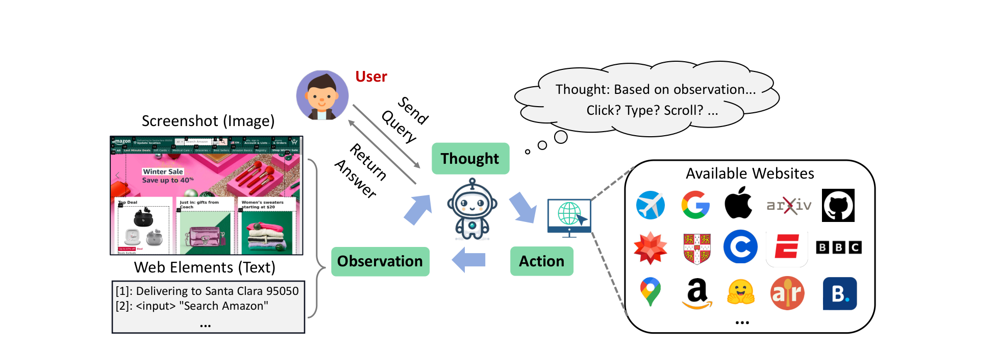
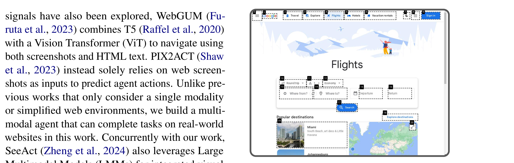
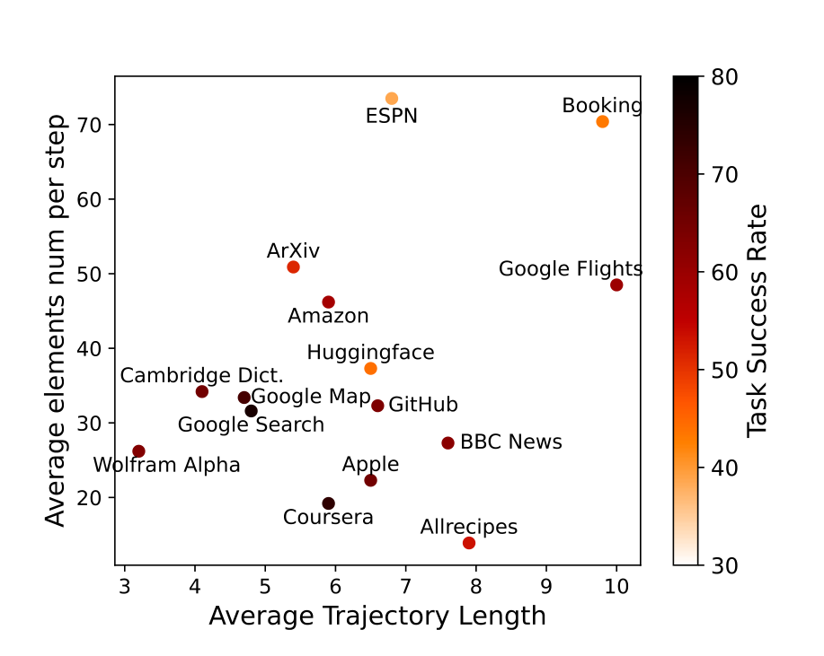

# WebVoyager - Analysis

## 1. Overview

이 논문은 Large Multimodal Model(LMM)을 활용하여 실제 웹사이트에서 사용자 지시를 end-to-end로 완수하는 자율 웹 에이전트 WebVoyager를 제안한다. 기존 웹 에이전트들은 HTML 텍스트나 accessibility tree에 의존하여 복잡하고 verbose한 입력을 처리해야 했으며, 대부분 시뮬레이터 환경이나 정적 스냅샷에서만 평가되어 실제 환경 적용에 한계가 있었다. 저자들은 렌더링된 웹페이지가 UX 원칙에 따라 설계되어 시각적 분석이 HTML 표현보다 더 효과적일 수 있다는 점에 주목했다.

WebVoyager의 핵심 설계는 Set-of-Mark Prompting을 웹 도메인에 적용한 것이다. GPT-4V-ACT라는 JavaScript 도구를 사용하여 interactive element들에 숫자 라벨이 붙은 bounding box를 오버레이하고, 에이전트는 이 라벨을 통해 클릭할 요소를 지정한다. 별도의 object detection 모델 없이 rule-based로 요소를 추출하므로 효율적이며, ReAct 스타일의 thought-action 생성을 통해 각 단계의 의사결정 과정을 명시적으로 표현한다.

15개 실제 웹사이트(Amazon, Booking, GitHub 등)에서 643개 태스크를 수집한 새로운 벤치마크에서 WebVoyager는 59.1%의 Task Success Rate를 달성했다. 이는 GPT-4 (All Tools)의 30.8%, Text-only 설정의 40.1%를 크게 상회하는 결과이다. 또한 저자들은 GPT-4V를 활용한 자동 평가 프로토콜을 제안하여, trajectory 스크린샷 기반으로 85.3%의 인간 평가 일치율(Kappa 0.70)을 달성했다.

이 연구는 LMM 기반 웹 에이전트의 실제 적용 가능성을 처음으로 체계적으로 입증했다. 300개 실패 사례에 대한 에러 분석을 통해 Navigation Stuck(44.4%), Visual Grounding Issue(24.8%), Hallucination(21.8%), Prompt Misalignment(9.0%)라는 주요 실패 유형을 규명하여 후속 연구의 방향을 제시했다.

---

## 2. Core Section

### TL;DR

> GPT-4V 기반 멀티모달 웹 에이전트로, Set-of-Mark 프롬프팅을 통해 스크린샷에서 interactive element를 식별하고, 7가지 행동(Click, Type, Scroll 등)을 수행하여 실제 웹사이트에서 59.1% Task Success Rate를 달성했으며, GPT-4V 기반 자동 평가 프로토콜(인간과 85.3% 일치)을 제안했다.

→ 상세: [tldr.md](./2401.13919-details/tldr.md)

### Core Contributions

1. **End-to-End Multimodal Web Agent**: GPT-4V 기반으로 스크린샷과 보조 텍스트를 입력받아 실제 live 웹사이트에서 태스크를 완수하는 최초의 완전 자율 LMM 웹 에이전트 → SeeAct와 달리 추가 모델 없이 순수 LMM만으로 동작

2. **Set-of-Mark for Web**: Object detection 없이 rule-based JavaScript로 interactive element 추출 및 숫자 라벨 오버레이 → 효율적이고 일반적인 웹 요소 식별 방법

3. **Real-World Web Benchmark**: 15개 실제 웹사이트에서 Self-Instruct 방식으로 643개 태스크 수집 → 기존 시뮬레이터/정적 스냅샷 벤치마크의 한계 극복

4. **GPT-4V Auto Evaluation Protocol**: Trajectory 스크린샷 기반 자동 평가로 인간과 85.3% 일치, Kappa 0.70 달성 → Open-ended 웹 태스크의 scalable 평가 가능

→ 상세: [contributions.md](./2401.13919-details/contributions.md)

### Key vs Non-Key Sections

| Priority | Sections | Reason |
|----------|----------|--------|
| ⭐⭐⭐ Must Read | Section 3 (WebVoyager), Section 3.3-3.4 (Observation/Action Space) | 에이전트 설계의 핵심 |
| ⭐⭐⭐ Must Read | Section 5.1 (Evaluation Methods), Section 5.4 (Error Analysis) | 자동 평가 및 실패 분석 |
| ⭐⭐ Important | Section 4 (Benchmark), Section 5.2 (Results) | 벤치마크 구성 및 실험 결과 |
| ⭐ Reference | Section 5.3 (Discussions) | 추가 분석 및 인사이트 |
| Skip | Section 2 (Related Work) | 표준적인 관련 연구 정리 |

→ 상세: [key-sections.md](./2401.13919-details/key-sections.md)

---

## 3. Paper Type

**Type**: Method + Benchmark

| Aspect | Value |
|--------|-------|
| **Problem** | 실제 웹사이트에서 end-to-end 태스크 자동화 |
| **Approach** | LMM + Set-of-Mark 프롬프팅 |
| **Key Technique** | GPT-4V + 숫자 라벨 bounding box |
| **Main Result** | 59.1% Task Success Rate, 자동 평가 85.3% 일치 |

→ 상세 방법론: [methodology.md](./2401.13919-details/methodology.md)

---

## 4. Visual Analysis

### Key Figures

#### Figure 1: WebVoyager Workflow

**구성 요소**:
- **User Query**: 사용자 지시 (e.g., "Find the cost of a 2-year protection for PS4 on Amazon")
- **Screenshot + Set-of-Mark**: 숫자 라벨이 붙은 웹페이지 스크린샷
- **GPT-4V Processing**: Thought + Action 생성
- **Browser Execution**: Selenium을 통한 행동 실행
- **Final Answer**: 태스크 완료 후 응답 반환

**핵심 통찰**:
- HTML 파싱 없이 시각적으로 웹페이지 이해
- 숫자 라벨로 요소 지칭의 모호성 제거
- End-to-end 파이프라인으로 중간 개입 없음

**Source**: [Figure 1](./2401.13919.md#figure-1-the-overall-workflow-of-webvoyager)

---

#### Figure 2: Set-of-Mark Screenshots

**구성 요소**:
- **Bounding Box**: 검정 테두리로 interactive element 표시
- **Numerical Label**: 왼쪽 상단에 숫자 라벨
- **Element Coverage**: 버튼, 링크, 입력 필드 등 다양한 요소

**핵심 통찰**:
- 검정색 단일 색상이 다중 색상보다 높은 성공률
- Rule-based 추출로 object detection 불필요
- LMM이 라벨 번호로 요소 지칭 가능

**Source**: [Figure 2](./2401.13919.md#figure-2-examples-of-webpage-screenshots)

---

#### Figure 6: Task Success Rate Factors

**구성 요소**:
- **X축**: 페이지당 평균 interactive element 수
- **Y축**: 평균 trajectory 길이
- **색상 농도**: Task Success Rate (어두울수록 높음)

**핵심 통찰**:
- 왼쪽 하단(적은 요소, 짧은 경로) → 높은 성공률
- 복잡한 웹사이트(Booking, Flights)는 도전적
- 요소 수와 경로 길이 모두 성능에 영향

**Source**: [Figure 6](./2401.13919.md#figure-6-factors-related-to-task-success-rate)

---

### Tables Interpretation

#### Table 1: Main Results by Website

| Website | GPT-4 (All Tools) | Text-only | WebVoyager |
|---------|-------------------|-----------|------------|
| Amazon | 17.1% | 31.7% | **58.5%** |
| Booking | 22.7% | 2.3% | **43.2%** |
| Google Flights | 2.4% | 7.1% | **59.5%** |
| **Overall** | 30.8% | 40.1% | **59.1%** |

**주요 발견**:
1. **Vision의 중요성**: Text-only → WebVoyager로 19% 향상
2. **Booking 극적 개선**: Text-only 2.3% → WebVoyager 43.2% (캘린더 UI 이해)
3. **GPT-4 All Tools 한계**: Bing 검색 의존, 직접 웹사이트 접근 불가

**트레이드오프**: Allrecipes, GitHub처럼 텍스트 중심 사이트에서는 Text-only와 유사

**Source**: [Table 1](./2401.13919.md#table-1-the-main-result-for-webvoyager)

---

#### Table 4: Error Analysis

| Error Type | Ratio | Description |
|------------|-------|-------------|
| Navigation Stuck | 44.4% | 최대 스텝 도달 전 태스크 미완료 |
| Visual Grounding | 24.8% | 잘못된 요소 선택/인식 |
| Hallucination | 21.8% | 부분 정답, 잘못된 필드 입력 |
| Prompt Misalignment | 9.0% | 파싱 불가 출력, 조기 종료 |

**주요 발견**:
1. **Navigation이 가장 큰 문제**: 부정확한 검색어, 스크롤 방향 혼란
2. **Visual Grounding**: 캘린더 숫자와 라벨 혼동, 근접 요소 오선택
3. **개선 방향**: 더 나은 backtracking, 고해상도 입력, self-verification

**Source**: [Table 4](./2401.13919.md#table-4-distribution-of-main-failure-reasons)

---

## 5. Critique & Related Works

### Expert Critique

#### Strengths
1. **End-to-end 실제 웹 적용**: 시뮬레이터가 아닌 live 웹사이트에서 검증하여 실제 적용 가능성 입증 [Section 3.1](./2401.13919.md#31-browsing-environment)
2. **Scalable 자동 평가**: GPT-4V 기반 평가로 Kappa 0.70 달성, 대규모 연구 환경 제공 [Section 5.1](./2401.13919.md#51-evaluation-methods)
3. **체계적 에러 분석**: 300개 실패 사례 분류로 명확한 개선 방향 제시 [Section 5.4](./2401.13919.md#54-error-analysis)

#### Limitations
1. **제한된 Action Space**: Drag, hover 등 복잡한 상호작용 미지원 → 일부 태스크 수행 불가 [Limitations](./2401.13919.md#limitations)
2. **Login/CAPTCHA 제한**: 인증 필요 사이트 접근 불가로 실용적 범위 제약
3. **해상도/텍스트 인식**: 작은 폰트, dense한 요소에서 visual grounding 실패 빈번

#### Reproducibility
- [x] Code available: https://github.com/MinorJerry/WebVoyager
- [x] Data available: 643 tasks 공개
- [ ] Clear hyperparameters: GPT-4V API 의존으로 일부 불명확

#### 2026 Perspective
- **Still Valid**: Set-of-Mark 기반 요소 식별 방식은 현재도 표준으로 사용됨 (SeeClick, UGround 등)
- **Outdated**: GPT-4V 단독 사용은 현재 더 효율적인 오픈소스 VLM들로 대체 가능 (Qwen-VL, InternVL)
- **Missing**:
  - Multi-tab/multi-window 지원
  - 복잡한 form interaction (drag-drop, date picker)
  - Agent-in-the-loop 대화형 수정
  - 더 정교한 planning/backtracking 메커니즘

### Related Works

1. **SeeAct (Zheng et al., 2024)** - GPT-4V grounding에 cross-encoder 추가, visual grounding 개선 - [arXiv:2401.01614](https://arxiv.org/abs/2401.01614)
2. **WEBLINX (Lù et al., 2024)** - 대화형 웹 네비게이션, 100K+ 상호작용 벤치마크 - [arXiv:2402.05930](https://arxiv.org/abs/2402.05930)
3. **VisualWebArena (Koh et al., 2024)** - Visual reasoning 중심 웹 벤치마크 확장 - [arXiv:2401.13649](https://arxiv.org/abs/2401.13649)

---

## Navigation

- **Source**: [원본 논문](./2401.13919.md)
- **Details**:
  - [TL;DR 상세](./2401.13919-details/tldr.md)
  - [Contributions 상세](./2401.13919-details/contributions.md)
  - [Key Sections 상세](./2401.13919-details/key-sections.md)
  - [Methodology 상세](./2401.13919-details/methodology.md)
