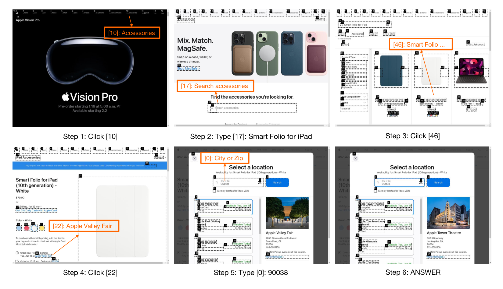
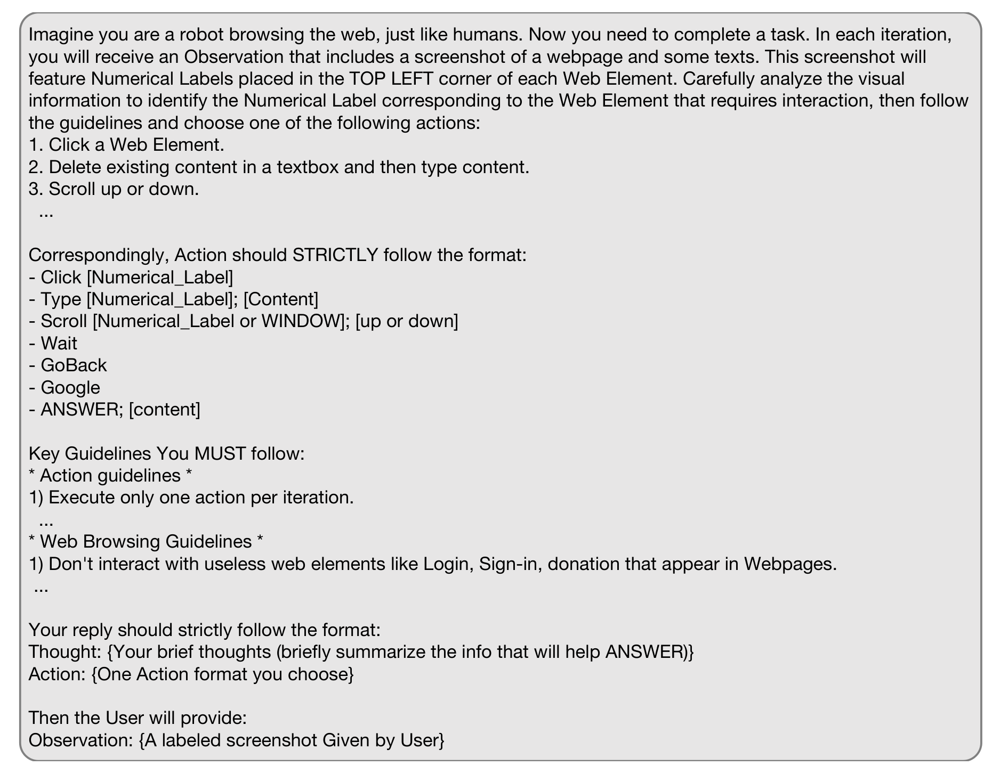

## WebVoyager: Building an End-to-End Web Agent with Large Multimodal Models

Hongliang He[^aff-1][^aff-3][^fn-star], Wenlin Yao[^aff-2], Kaixin Ma[^aff-2], Wenhao Yu[^aff-2], Yong Dai[^aff-2], Hongming Zhang[^aff-2], Zhenzhong Lan[^aff-3], Dong Yu[^aff-2]

**[^1]** Zhejiang University
**[^2]** Tencent AI Lab
**[^3]** Westlake University

**Contact:** hehongliang@westlake.edu.cn, wenlinyao@global.tencent.com

**[^*]** Tencent AI Lab 인턴십 기간 중 수행된 연구임.

## 초록

Large language models (LLMs)의 급속한 발전은 실제 시나리오에서 autonomous applications 개발로 특징지어지는 새로운 시대를 열었으며, 이는 advanced web agents 구축의 혁신을 이끌고 있다. 기존 web agents는 일반적으로 하나의 입력 modality만 처리하고 단순화된 web simulators나 정적 web snapshots에서만 평가되어 실제 시나리오에서의 적용 가능성이 크게 제한된다. 이러한 격차를 해소하기 위해 우리는 WebVoyager를 소개한다. 이는 실제 웹사이트와 상호작용하여 사용자 지시를 end-to-end로 완료할 수 있는 혁신적인 Large Multimodal Model (LMM) 기반 web agent이다. 또한 15개의 인기 웹사이트에서 실제 작업을 수집하여 새로운 benchmark를 구축하고, GPT-4V의 multimodal 이해 능력을 활용하여 open-ended web agents를 평가하는 automatic evaluation protocol을 도입한다. WebVoyager가 우리 benchmark에서 59.1%의 task success rate를 달성하여 GPT-4 (All Tools) 및 WebVoyager (text-only) 설정 모두의 성능을 크게 상회함을 보여주며, 이는 WebVoyager의 뛰어난 능력을 강조한다. 제안된 automatic evaluation metric은 인간 판단과 85.3%의 일치도를 달성하여 web agents에 대한 신뢰할 수 있고 정확한 평가를 제공하는 데 효과적임을 나타낸다.[^1](#fn-1)

## 1 서론

ChatGPT 및 GPT-4 (OpenAI, 2023)와 같은 large language models (LLMs)의 최근 발전은 복잡한 작업 실행을 위한 LLM 기반 autonomous agents (AutoGPT, 2022) 개발에 대한 상당한 관심을 불러일으켰다 (Qin et al., 2023; Schick et al., 2023). 최근 연구들은 text-based web browsing environments 구축과 large language model agents가 web navigation을 수행하도록 지시하는 방법을 탐구해왔다 (Nakano et al., 2021; Gur et al., 2023; Zhou et al., 2023; Lu et al.,

**[^1]** 우리의 코드와 데이터는 [https://github.com/MinorJerry/WebVoyager](https://github.com/MinorJerry/WebVoyager)에서 공개될 예정이다.

2023). 이러한 연구들의 주요 과제는 복잡하고 장황한 HTML 텍스트를 관리하는 것이며, 해결책으로는 HTML의 단순화 및 구조화가 포함된다 (Nakano et al., 2021; Zhou et al., 2023; Gur et al., 2023; Deng et al., 2023).

그러나 기존 접근 방식들은 브라우징의 핵심 기능인 HTML을 시각적 웹페이지로 렌더링하는 것을 간과하고 있다. 특히 vision 능력은 웹 브라우저와 같은 도구를 활용하는 데 매우 중요한데, 렌더링된 웹 페이지는 본질적으로 직관적인 정보와 구조화된 표현을 강조하는 사용자 경험(UX)을 고려하여 설계되기 때문이다. 이러한 렌더링의 설계 원칙은 시각적 분석을 단순한 HTML 표현보다 더 효과적으로 만든다. 현재 large multimodal models (LMMs), 특히 GPT-4V(ision) (OpenAI, 2023)와 Gemini (Team et al., 2023)는 복잡한 시각적 단서를 텍스트 정보와 통합하는 놀라운 능력을 보여준다. Pix2Struct (Lee et al., 2023) 및 WebArena (Zhou et al., 2023)와 같은 기존 연구들은 web navigation에서 의사결정을 위한 입력으로 screenshots를 사용하는 탐구를 시작했지만, 이는 예비적인 것이며 깊은 탐구를 나타내지 않는다. 따라서 브라우저가 렌더링한 환경을 screenshots를 통해 활용하는 multimodal web agents를 구축하여 인간의 웹 브라우징 행동을 모방하는 것이 이제 web navigation 능력을 향상시키는 실현 가능한 접근 방식이다.

우리는 WebVoyager (Figure 1)를 소개한다. 이는 중간에 인간 개입 없이 처음부터 끝까지 전체 프로세스를 관리하며 온라인에서 웹 작업을 자율적으로 완료하도록 설계된 multimodal web agent이다. WebVoyager는 screenshots와 interactive web elements의 텍스트 콘텐츠로부터 관찰을 통해 사용자 쿼리를 처리하고, 어떤 action을 취할지에 대한 thought를 공식화한 다음(클릭, 타이핑 또는 스크롤 등), 웹사이트에서 해당 action을 실행한다. Set-of-Mark Prompting (Yang et al., 2023a)에서 영감을 받아, 우리는 WebVoyager의 의사결정을

용이하게 하기 위해 screenshots에 interactive web elements를 표시한다 (Figure 2 참조).

또 다른 과제는 end-to-end web agent의 평가이다. Mind2Web (Deng et al., 2023)과 같은 기존 benchmarks는 주로 stepwise 및 offline 평가에 초점을 맞추며, agents가 action 선택을 위해 사전 정의된 'golden' trajectory를 따른다. 그러나 이 접근 방식은 하나의 가능한 계획만 반영하므로 작업을 완료하기 위한 다양한 실행 가능한 전략을 완전히 고려하지 못할 수 있다. 이러한 한계는 편향된 평가와 다른 방법들을 공정하게 비교하는 데 어려움을 초래할 수 있다. end-to-end task completion에서 web agents의 능력을 정확하게 평가하기 위해, 우리는 GPT-4V를 사용한 automated evaluation protocol을 제안한다. 구체적으로, 우리는 온라인 navigation 과정 전반에 걸쳐 screenshots를 저장한 다음 GPT-4V를 사용하여 이러한 trajectories와 최종 결과를 자동으로 평가한다. 결과를 검증하기 위해 인간 평가도 수행되며, 분석 결과 우리의 evaluation protocol이 인간 평가자와 85.3%의 일치도를 달성하여 GPT-4V가 online agents에 대한 신뢰할 수 있는 evaluator로서 역할할 수 있음을 나타낸다.

우리는 self-instruct (Wang et al., 2022) 방법을 사용하여 반자동으로 생성된 새로 수집된 dataset에 대해 평가를 수행한다. 이 dataset은 15개의 일반적으로 접속되는 웹사이트에서 643개의 web tasks로 구성된다. 또한 GAIA (Mialon et al., 2023)의 level 1 및 level 2에서 90개의 web 관련 작업과 SeeAct (Zheng et al., 2024)의 50개 interactive open-web tasks에 대해 WebVoyager를 평가한다. 우리는 WebVoyager를 1) GPT-4 (All Tools)[^2](#fn-2), 그리고 2) 웹 페이지를 설명하기 위해 WebArena (Zhou et al., 2023)에서 제안된 textual accessibility tree를 사용하는 text-only 설정의 WebVoyager와 비교한다.

**[^2]** GPT-4 (All Tools)는 2023년 10월 OpenAI가 출시한 통합 tool-based agent이다. [https://chat.openai.com/](https://chat.openai.com/) 참조

결과는 WebVoyager가 우리의 새로운 benchmark에서 59.1%의 Task Success Rate를 달성하여 30.8%의 GPT-4 (All Tools)와 40.1%의 text-only 설정을 크게 상회함을 보여주며, 우리 방법의 효과성을 입증한다. 우리의 연구는 web tasks에 대한 WebVoyager 방법의 효과성을 입증하며, 더 지능적이고 효율적인 web automation 솔루션 개발에 대한 통찰을 제공한다.

## 2 관련 연구

Autonomous web navigation (Shi et al., 2017; Yang et al., 2023b)은 agent가 지시를 따르고, 계획을 수립하고, 복잡한 웹 구조를 이해하고, 작업을 단계별 결정으로 분해할 것을 요구한다 (Weng, 2023). 제어된 환경에서 web agents를 연구하기 위해, 이전 연구들은 단순화된 웹사이트를 포함하는 web simulators를 구축했다 (Shi et al., 2017; Yao et al., 2022a). 최근에는 Mind2Web (Deng et al., 2023) 및 WebArena (Zhou et al., 2023)와 같이 더 도전적이고 현실적인 benchmarks를 구축하는 데 대한 관심이 급증하고 있다.

이러한 새로운 benchmarks와 함께, autonomous web agents를 구축하기 위한 수많은 노력이 이루어졌다. WebGPT (Nakano et al., 2021)는 text-based web browsing environment를 구축하고 GPT-3를 web agent로 fine-tune한다. WebAgent (Gur et al., 2023)는 HTML snippets를 추출하기 위해 T5 모델을 pretrain하고 Flan-U-PaLM (Chowdhery et al., 2023)을 활용하여 환경과 상호작용하기 위한 Python 코드를 생성한다. fine-tuning 외에도, 또 다른 연구 방향은 LLMs를 prompting하여 web agents를 구축하려고 시도한다 (Yao et al., 2022b; Shinn et al., 2023; Ma et al., 2023). 시각적 신호를 통합하는 multimodal web agents도 탐구되었는데, WebGUM (Furuta et al., 2023)은 T5 (Raffel et al., 2020)를 Vision Transformer (ViT)와 결합하여 screenshots와 HTML 텍스트를 모두 사용하여 navigation한다. PIX2ACT (Shaw et al., 2023)는 대신 agent actions를 예측하기 위해 web screenshots만을 입력으로 사용한다. 단일 modality나 단순화된 web environments만 고려하는 이전 연구들과 달리, 우리는 이 연구에서 실제 웹사이트에서 작업을 완료할 수 있는 multimodal agent를 구축한다. 우리 연구와 동시에, SeeAct (Zheng et al., 2024)도 웹사이트에서 통합된 시각적 이해와 actions를 위해 Large Multimodal Models (LMMs)를 활용한다. 그러나 최고의 SeeAct agent는 여전히 상호작용할 candidate elements를 선택하기 위해 fine-tuned cross-encoder 모델에 의존한다. 반면 WebVoyager는 추가 모듈이 필요하지 않다.

## 3 WebVoyager

우리는 사용자 지시를 완료하기 위해 인간 개입 없이 open web을 자율적으로 탐색할 수 있는 agent를 구축하는 것을 목표로 한다. 지시가 주어지면, 우리의 WebVoyager는 먼저 웹 브라우저를 인스턴스화한 다음 웹에서 visual (즉, screenshots) 및 textual (즉, HTML elements) 신호와 함께 actions를 수행한다. agent는 매 단계에서 입력을 기반으로 action을 생성하고, 이는 브라우저 환경에서 실행된다. 이 프로세스는 agent가 중지를 결정하거나 최대 단계에 도달할 때까지 계속된다. environment, interaction cycle, observation space 및 action space를 포함한 WebVoyager의 세부 사항은 다음과 같다.

## 3.1 Browsing Environment

우리는 Selenium[^3](#fn-3)을 사용하여 automated web-browsing environment를 개발한다. WebArena (Zhou et al., 2023)와 달리, 우리는 어떤 웹사이트도 로컬에서 호스팅하지 않고 대신 agent가 open web을 탐색하도록 허용하며, 이는 floating ads, pop-up windows, 지속적인 업데이트 등과 같은 고유한 과제를 제기한다.[^4](#fn-4) 그럼에도 불구하고, 우리는 이 설정이 실제 사용 사례를 진정으로 반영한다고 믿기 때문에 실제 웹사이트와의 온라인 상호작용을 선택한다 (예: agent는 웹에서 실시간 정보에 접근해야 함). 그리고 성공적인 web agent는 이러한 도전에 적응하고 문제를 일관되게 강건하게 해결할 수 있어야 한다.

**[^3]** [https://www.selenium.dev/](https://www.selenium.dev/)

**[^4]** CAPTCHAs (Completely Automated Public Turing test to tell Computers and Humans Apart) 도전과 관련하여, 우리는 이러한 웹사이트의 규칙을 존중하고 agent에게 대안적인 소스에서 정보를 검색하도록 prompt하는 것이 중요하다고 믿는다.

## 3.2 Interaction Formulation

형식적으로, Environment를 $E$, large Multimodal Model을 $M$, Observation Space를 $O$, Action Space를 $A$로 표기한다. 시간 단계 $t$에서, 모델은 과거 actions $a_i$와 observations $o_i$로 구성된 context $c_t$를 입력으로 받으며, 다음과 같이 정의된다:

$$c_t = (o_1, a_1, ..., o_{t-1}, a_{t-1}, o_t, I)$$

모델은 시간 $t$에서 action $a_t$를 생성한다:

$$a_t = M(c_t)$$

이는 환경에서 실행된다. 실행 후, 환경은 시간 $t+1$에서 observation을 반환한다:

$$o_{t+1} = E(o_t, a_t)$$

그런 다음 context가 업데이트되고 이 interaction 프로세스는 모델이 종료 action을 생성하거나 최대 단계에 도달할 때까지 계속된다.

ReAct Prompting (Yao et al., 2022b) 패러다임에서 영감을 받아, 우리도 agent가 action 코드를 생성하기 전에 먼저 thought 프로세스를 생성하도록 prompt한다. 따라서 $a_t$는 $(s_t, \hat{a}_t)$로 더 구성될 수 있으며, 여기서 $s_t$와 $\hat{a}_t$는 각각 자연어 thought와 action 코드를 나타낸다. Appendix A의 Figure 7은 action prediction 단계를 위해 설계한 System Prompt를 제시한다. 또한, 더 긴 에피소드에서 웹 페이지의 과도한 observations가 agent를 혼란스럽게 할 수 있다는 점을 주목할 가치가 있다. 따라서 우리는 오래된 웹 페이지 정보를 제거하기 위해 context clipping을 수행하고 입력에 가장 최근 세 개의 observations만 유지하며, agent를 더 잘 안내하기 위해 thoughts와 actions의 전체 히스토리를 유지한다.

## 3.3 Observation Space

인간이 웹을 탐색하는 방식과 유사하게, 우리 agent도 웹의 시각 정보(screenshots)를 주요 입력 소스로 사용한다. screenshots를 사용하면 웹페이지의 전반적인 구조를 묘사하기 위해 HTML DOM tree나 accessibility tree를 처리하는 부담을 피할 수 있으며, 이는 지나치게 장황한 텍스트로 이어져 agent의 의사결정 과정에 영향을 미칠 수 있다. Set-of-Mark Prompting (Yang et al., 2023a)에서 영감을 받아, 우리는 agent의 action prediction을 더 잘 안내하기 위해 웹사이트의 interactive elements에 bounding boxes를 overlay한다. Yang et al. (2023a)와 달리, 우리는 object detection 모듈이 필요하지 않다 (Zou et al., 2023). 대신, 우리는 GPT-4V-ACT[^5](#fn-5)를 활용하는데, 이는 web element 유형에 기반하여 interactive elements를 추출한 다음 요소의 해당 영역에 숫자 레이블이 있는 bounding boxes를 overlay하는 Javascript 도구이다. GPT-4V-Act는 object detection 모델을 포함하지 않는 rule-based이므로 효율적이다.

Figure 2에서 설명된 바와 같이, 웹페이지의 특성으로 인해 이 도구를 사용하여 각 interactive element를 정확하게 찾고 윤곽을 그릴 수 있다. 각 element에 할당된 숫자 레이블은 모델이 상호작용이 필요한 elements를 식별하는 데 필수적이며, 이를 통해 정확한 action 결정을 용이하게 한다. 우리는 명확성을 높이기 위해 테두리와 레이블 배경에 검정색을 경험적으로 선택한다. 단일 검정색을 사용하면 여러 색상을 사용하는 것보다 더 높은 success rates를 산출하는 것을 관찰한다. 또한 agent에게 interactive element 내에 포함된 텍스트 콘텐츠, element의 유형, 그리고 가능하면 aria-label 속성의 일부 주석 텍스트를 포함한 auxiliary text를 입력으로 제공한다. observation을 단순화하기 위해 multiple tabs를 비활성화했다. 즉, 모든 상호작용은 새 탭을 열지 않고 현재 탭 내에서 발생한다.

매 단계에서, agent는 (§3.2)에서 논의한 대로 현재 screenshot, auxiliary text 및 히스토리를 입력으로 받는다. agent의 action이 실행 중 예외를 발생시킨 경우, 우리는 추가로 prompt에 오류 메시지를 포함하고 모델에게 응답을 재생성하도록 요청한다. 각 오류 수정 시도도 총 탐색 예산에서 한 단계를 소비한다는 점에 유의하라.

## 3.4 Action Space

우리는 인간이 웹을 탐색하는 방식과 유사하게 agent의 action space를 정의한다. 이를 위해, 우리는 agent가 다양한 웹 페이지를 탐색하고 작업에 필요한 콘텐츠를 찾는 데 충분한 가장 일반적으로 사용되는 마우스 및 키보드 actions를 구현한다.

**[^5]** [https://github.com/ddupont808/GPT-4V-Act](https://github.com/ddupont808/GPT-4V-Act)

screenshots의 숫자 레이블의 도움으로, 우리는 agent가 간결한 Action Format으로 응답할 수 있도록 한다. 이 접근 방식은 상호작용이 필요한 elements를 정확하게 찾고 해당 actions를 실행한다. actions의 사용법은 다음과 같다 (자세한 내용은 Appendix C 참조): 1) Click. 이 action은 웹페이지 내의 element, 일반적으로 링크나 버튼을 클릭하는 것을 포함한다. 2) Input. 이 복합 action은 텍스트 박스를 선택하고, 그 안의 기존 콘텐츠를 삭제한 다음, 새 콘텐츠를 입력하는 것을 포함한다. 3) Scroll. 스크롤은 웹페이지를 탐색하기 위한 일반적인 작업으로, 보통 전체 페이지의 수직 이동을 포함한다. 4) Wait. action 실행에는 시간이 필요하며, 이 action은 웹 페이지가 로드될 때까지 기다리는 데 자주 사용된다. 5) Back. 이 action은 이전 페이지로 돌아가는 데 사용된다. 6) Jump to Search Engine. agents가 특정 웹사이트에서 막혀 답을 찾지 못하는 상황이 자주 있다. 이 action은 agent가 검색 엔진으로 이동하여 새로 시작할 수 있게 한다. 7) Answer. 작업의 모든 질문이 해결되면, 이 action은 반복을 종료하고 작업 요구 사항에 따라 답변을 제공한다.

## 4 WebVoyager를 위한 Benchmark

## 4.1 Website Selection

우리는 평가의 다양성을 보장하기 위해 일상 생활의 다양한 측면을 다루는 15개의 대표적인 웹사이트를 선택한다. 여기에는 Allrecipes, Amazon, Apple, ArXiv, BBC News, Booking, Cambridge Dictionary, Coursera, ESPN, GitHub, Google Flights, Google Map, Google Search, Huggingface, Wolfram Alpha가 포함된다. 기술적 제한으로 인해, 콘텐츠에 접근하기 위해 로그인이나 CAPTCHA가 필요한 웹사이트는 유감스럽게도 제외한다. 또한, Google Search는 모든 웹사이트의 시작점 역할을 할 수 있는 범용 웹사이트로, 우리 프레임워크를 다양한 시나리오에 적용 가능하게 만든다.

## 4.2 Data Construction

우리는 evaluation set을 구축하기 위해 self-instruct (Wang et al., 2022)와 human verification의 조합을 사용한다. Figure 3은 데이터 생성 프로세스를 보여준다. 먼저, Google Flights, Google Map, Google Search, Booking, Wolfram Alpha를 포함한 웹사이트에 대해 Mind2Web (Yin et al., 2023; Deng et al., 2023)에서 일부 작업을 수동으로 샘플링하고 다시 작성한다. 이 프로세스는 후속 생성을 위한 Task Pool의 초기 seed tasks를 산출한다. 두 번째 단계에서, 우리는 Task Pool에서 작업을 in-context

examples (Dong et al., 2022)로 샘플링하고 GPT-4 Turbo를 prompt하여 약 100개의 새로운 작업을 생성한다 (20번 반복). 그런 다음 생성된 각 작업을 수동으로 검증하고 필요한 경우 고품질을 보장하고 해당 웹사이트에서 답변을 찾을 수 있도록 다시 작성한 다음 추가 seed tasks로 Task Pool에 추가한다. 이 단계를 통해 각 웹사이트에 대해 인간이 검증한 seed tasks를 생성할 수 있다. 마지막으로 세 번째 단계에서, Task Pool에서 더 다양한 in-context examples를 샘플링하고 각 반복에서 생성된 작업을 Task Pool에 직접 추가한다. 우리는 생성된 작업의 반복이 낮고 생성된 작업의 답변을 웹사이트에서 찾을 수 있음을 수동으로 확인한다. 총 643개의 작업을 수집했으며, 웹사이트당 40개 이상의 작업이 있다.

생성된 작업들의 반복이 낮음을 추가로 확인하기 위해, 우리는 all-mpnet-base-v2[^6](#fn-6) 모델을 사용하여 643개 질문에 대한 pairwise similarity를 계산한다. 총 206,403개의 쌍 중 49개의 쌍만 0.8보다 큰 유사도를 가지며, 140개의 쌍이 0.7에서 0.8 사이의 유사도를 가진다. 이 모든 것은 수동으로 확인되었으며 허용 가능한 것으로 판명되었다. 쌍의 99.68%가 0.6 미만의 유사도를 가진다. 이는 우리 작업의 다양성과 접근 방식의 강건성을 입증한다.

## 4.3 Annotation Process

전체 task pool을 수집한 후, 각 작업에 대한 답변을 annotation한다. 일부 질문은 open-ended이고 웹 정보가 변경될 수 있으므로, 이러한 질문에는 고정된 golden response가 없을 수 있다. 따라서 각 데이터 항목에 'Possible' 또는 'Golden'으로 분류된 답변으로 레이블을 지정한다. 'Golden'으로

**[^6]** [https://huggingface.co/sentence-transformers/all-mpnet-base-v2](https://huggingface.co/sentence-transformers/all-mpnet-base-v2)

레이블된 답변의 경우, 가능한 응답의 포괄적인 목록을 제공하고 단기적으로 안정적인 것으로 간주한다. 'Possible' 카테고리는 다음 시나리오를 다룬다: 1) 요약과 같이 정확히 일치하는 답변을 찾기 어려운 open-ended 작업에 대한 답변. 2) 여러 답변이 작업을 충족하여 모든 것을 나열하는 것이 비현실적인 경우. 따라서 부분적인 목록을 제공한다. 3) 실시간 정보와 관련된 작업으로, 답변이 변경될 수 있다. 예: 항공권 가격. 따라서 'Possible' 답변도 우리 실험 중에 정확했다. 전체적으로 질문의 22.3%가 golden responses로 annotation되었고, 나머지는 possible answers만 가진다.

## 5 실험

Dataset 및 Metrics Section 4에서 소개한 benchmark 외에도, golden responses와 함께 제공되는 GAIA dataset (Mialon et al., 2023)의 90개 web browsing 작업 (Level 1 및 Level 2)에 대해서도 평가했다. GAIA는 특정 웹사이트를 제공하지 않으므로, agent에게 Google Search로 시작하도록 지시한다. 또한 SeeAct agent의 online evaluation (Zheng et al., 2024)에서 사용된 50개 작업에 대해 agent를 평가하고 그들의 결과와 비교했다. WebArena (Zhou et al., 2023)를 따라, 우리가 채택하는 주요 evaluation metric은 Task Success Rate로, 단계가 최적인지 여부를 고려하지 않고 작업의 성공적인 완료를 측정한다.

Experimental Details 우리는 agent의 backbone 모델로 GPT-4 Turbo with vision (gpt-4-vision-preview)을 사용하며, 이는 GPT-4V (OpenAI, 2023)에 필적하는 강력한 semantic 및 visual 이해 능력을 보여준다. 또한 연구의 다양성을 높이기 위해 두 가지 추가 backbone 모델, 즉 Claude 3 Opus (Anthropic, 2024)와 GPT-4o (GPT-4 Omni, OpenAI, 2024)를 포함한다. baselines로 vision, web browsing, code analysis 및 다양한 plugins를 하나의 모델에 통합한 GPT-4 (All Tools)를 포함한다. 또한 agent가 prediction actions를 위한 입력으로 웹사이트의 accessibility tree만 받는 text-only baseline을 고려한다. 환경에 1024 * 768 픽셀의 고정 브라우저 창 크기를 사용하여 observations의 screenshots에 대해 일관된 크기를 보장한다. 생성 중 temperature를 1로 설정하고 agent가 최대 15단계까지 탐색하도록 허용한다.

## 5.1 Evaluation Methods

우리 benchmark의 대부분의 질문이 open-ended answers를 가지므로 human evaluation을 주요 evaluation metric으로 채택한다. 특히, human evaluators에게 agent의 웹과의 상호작용에 대한 완전한 trajectories (모든 screenshots와 모든 actions)를 제공하고, agent가 작업을 성공적으로 완료했는지에 대한 binary judgment를 제공하도록 요청한다. 300개 작업의 subset에 대해, human annotators 간의 일치도를 이해하기 위해 세 명의 annotators에게 각 trajectory를 판단하도록 초대한다.

human evaluations가 정확하더라도 확장 가능하지 않은 경우가 많다. 따라서 automatic evaluation을 위해 LMM을 활용하는 것이 가능한지 보고자 한다. 이를 위해, WebVoyager의 navigation trajectories를 평가하기 위해 human evaluators의 행동을 에뮬레이트하는 auto-evaluator로 GPT-4V를 사용할 것을 제안한다. 특히, evaluator에게 작업, WebVoyager의 응답, 마지막 k개의 screenshots를 제공하고 agent가 작업을 완료했는지 판단하도록 요청하며, 여기서 k는 hyper-parameter이다. GPT-4V evaluator의 prompt는 Appendix B에 나와 있다.

## 5.2 결과

Figure 4는 agent가 온라인 방식으로 작업을 완료하기 위해 Apple 웹사이트와 단계별로 상호작용하는 방법을 보여주는 예를 제시한다. 마지막 screenshot에서, Agent는 원하는 정보를 획득한 다음 'ANSWER' action을 선택하여 응답하고 navigation을 마친다. 추가 예는 Appendix D에 제공된다.

Table 1과 Figure 5에 우리 dataset과 추출된 GAIA web tasks에 대한 결과를 제시한다. WebVoyager는 대부분의 웹사이트 작업에서 text-only 및 GPT-4 (All Tools) baselines를 큰 차이로 능가하며, Allrecipes에서는 Text-only보다 약간 낮고 Github, ESPN, Cambridge Dictionary 및 Wolfram Alpha에서는 Text-only와 유사하다. 이는 주로 이러한 웹사이트들이 다른 것들보다 텍스트가 많기 때문이다. WebVoyager는 주로 의사결정을 위해 web screenshots에 의존하므로, 밀집된 텍스트는 이미지에서 쉽게 인식되지 않을 수 있다. HTML에서 그러한 텍스트를 추출하여 입력을 보강하는 것이 이 문제에 대한 잠재적 해결책이 될 수 있으며, 향후 연구 방향을 제안한다. Figure 5에서 WebVoyager는 두 baselines보다 훨씬 강력한 성능을 달성한다. 마지막으로, WebVoyager는 SeeAct online test set에서 30%의 success rate를 달성하는 반면 최고의 SeeAct autonomous agent는 26%를 달성하여, 우리가 제안한 agent의 효과성을 보여준다.

300개 작업의 subset에 대해 consolidated human labels[^7](#fn-7)와 GPT-4V의 judgments 간의 Agreement (중복 비율)와 Kappa ($\kappa$; Cohen 1960)를 Table 2에 보고한다. 여기서 $k$는 GPT-4V에 제공된 screenshots 수를 나타내며, 'full'은 전체 trajectory를 의미한다. GPT-4V와 human annotators 간의 일치도는

**[^7]** 토론 전 human annotators의 Fleiss's Kappa (Fleiss, 1971)는 0.7로, 상당한 일치도이다.

Table 1: WebVoyager의 주요 결과. 각 웹사이트에는 40~45개의 작업이 포함되어 있으며, 표에 Task Success Rate를 보고한다. GPT-4 (All Tools), accessibility tree를 사용한 WebVoyagerText-only, 그리고 WebVoyager의 결과를 human expert labels와 비교하여 보여준다. WebVoyager ∗, WebVoyagerText-only ∗, WebVoyagerClaude ∗ 및 WebVoyagerGPT-4o ∗는 GPT-4V (full trajectory, kappa = 0.70)로 평가된 결과이다. 각 automatic evaluation에 대해, 성능 평균과 표준편차를 계산하기 위해 GPT-4V evaluator를 세 번 실행한다.

|                                        | Allrecipes           | Amazon         | Apple          | ArXiv             | GitHub                  | Booking           | ESPN                | Coursera             |
|----------------------------------------|----------------------|----------------|----------------|-------------------|-------------------------|-------------------|---------------------|----------------------|
| GPT-4 (All Tools)                      | 11.1%                | 17.1%          | 44.2% 34.9%    | 14.0%             | 48.8%                   | 22.7%             | 31.8%               | 31.0%                |
| WebVoyager Text-only                   | 55.6%                | 31.7%          |                | 32.6%             | 61.0%                   | 2.3%              | 36.4%               | 23.8%                |
| WebVoyager                             | 53.3%                | 58.5%          | 65.1%          | 51.2%             | 63.4%                   | 43.2%             | 38.6%               | 73.8%                |
| WebVoyager Text-only ∗                 | 57.8% ± 0 . 0%       | 43.1% ± 1 . 4% | 36.4% ± 3 . 5% | 50.4% ± 1 . 4%    | 63.4% ± 2 . 5%          | 2.3% ± 0 . 0%     | 38.6% ± 2 . 3%      | 24.6% ± 1 . 4%       |
| WebVoyager ∗                           | 51.1% ± 2 . 2%       | 52.9% ± 1 . 4% | 62.8% ± 2 . 3% | 52.0% ± 1 . 3%    | 59.3% ± 3 . 7%          | 32.6% ± 2 . 7%    | 47.0% ± 1 . 3%      | 57.9% ± 2 . 7%       |
| WebVoyager Claude ∗                    | 45.9% ± 3 . 4%       | 58.6% ± 4 . 2% | 58.1% ± 4 . 0% | 55.0% ± 7 . 0% 0% | 56.9% ± 1 . 4%          | 19.0% ± 1 . 3%    | 46.2% ± 1 . 3%      | 68.2% ± 1 . 3% 65.1% |
| WebVoyager GPT-4o ∗                    | 56.3% ± 1 . 3%       | 53.7% ± 2 . 5% | 56.6% ± 1 . 3% | 60.5% ± 0 .       | 57.7% ± 3 . 7%          | 43.9% ± 3 . 5%    | 44.0% ± 2 . 7%      | ± 2 . 8%             |
|                                        | Cambridge Dictionary | BBC News       | Google Flights | Google Map 53.7%  | Google Search 60.5%     | Huggingface 37.2% | Wolfram Alpha 52.2% | Overall 30.8%        |
| GPT-4 (All Tools) WebVoyager Text-only | 25.6% 62.8%          | 9.5% 45.2%     | 2.4%           | 61.0%             | 67.4%                   | 20.9%             | 58.7%               | 40.1%                |
| WebVoyager                             | 65.1%                | 61.9%          | 7.1% 59.5%     | 70.7%             | 76.7%                   | 44.2%             | 63.0%               | 59.1%                |
| WebVoyager Text-only ∗ ∗               | 66.7% ± 3 . 6%       | 45.2% ± 2 . 4% | 7.1% ± 0 . 0%  | 62.6% ± 2 .       | 75.2% ± 1 . 77.5% ± 2 . | 31.0% ± 1 .       | 60.2% ± 1 . 3%      | 44.3% ± 0 . 6%       |
| WebVoyager                             | 71.3% ± 1 . 3%       | 60.3% ± 2 . 8% | 51.6% ± 1 . 4% | 8% 64.3% ± 2 . 8% | 3% 7%                   | 4% 55.8% ± 2 . 3% | 60.9% ± 2 . 2%      | 57.1% ± 0 . 2%       |
| WebVoyager                             | 71.3% ± 3 .          | 66.7% ± 4 . 8% | 15.1% ± 5 . 5% | 55.3%             | 72.9%                   | 53.5% ± 4 .       | 51.5% ± 5 . 4%      | 52.8% ± 1 . 4%       |
| Claude ∗                               | 6%                   |                | 28.6%          | ± 1 . 4%          | ± 1 . 3%                | 7%                |                     | 55.5%                |
| WebVoyager GPT-4o ∗                    | 82.2% ± 1 . 3%       | 54.8% ± 2 . 4% | ± 0 . 0%       | 56.9% ± 2 . 8%    | 63.6% ± 1 . 3%          | 42.6% ± 3 . 6%    | 65.2% ± 2 . 2%      | ± 0 . 8%             |

Table 2: GPT-4V와 Human 간의 일관성. Success Rate는 GPT-4V가 제공한 모든 작업의 전체 success rate이다. GPT-4V와 Human (정렬 후)이 제공한 annotations를 기반으로, Agreement, 즉 label 중복과 Kappa 값을 계산한다.

|      | Success Rate   | Consistency   | Consistency   |
|------|----------------|---------------|---------------|
|      | Success Rate   | Agreement     | $\kappa$      |
| k=1  | 47.7%          | 75.3%         | 0.51          |
| k=2  | 55.3%          | 79.7%         | 0.59          |
| k=3  | 54.3%          | 81.3%         | 0.62          |
| Full | 58.3%          | 85.3%         | 0.70          |

더 많은 정보를 받을수록 점차 개선되며, 최종 Kappa 점수도 0.7에 도달하여 human annotators 간의 일치도와 동등하다. GPT-4V와 인간 간의 일관성은 GPT-4V가 multi-modal web agents에 대한 유망한 automatic evaluator임을 시사한다. 따라서 Table 1에 GPT-4V 기반 automatic evaluation 결과를 보고한다. 세 가지 backbone 모델인 GPT-4V, Claude 3 Opus, GPT-4o의 automatic evaluation 결과는 비교적 가까우며, 그들의 성능은 Text-only 설정 (GPT-4를 backbone으로 사용)보다 상당히 우수하다. 그러나 Claude와 GPT-4o 모두 Google Flights에서 성능 저하가 있다. trajectories를 검토한 결과, GPT-4o가 cognitive bias에 빠지는 것이 관찰되었는데, 편도 여행 작업에서 'one way' 옵션을 올바르게 선택하지 못하고 출발 날짜만 입력하면 된다고 잘못 가정한다. 반면에 Claude-3-Opus는

Table 3: automatic evaluation을 사용한 WebVoyager의 전체 Task Success Rate. GPT-4V, Claude-3-Opus, GPT-4o를 WebVoyager의 backbones로 사용하고 모든 작업을 실행한 후, 이 세 가지 모델을 사용하여 automatic evaluation을 수행한다.

| WebVoyager Backbone   | Evaluator   | Evaluator     | Evaluator   |
|-----------------------|-------------|---------------|-------------|
| WebVoyager Backbone   | GPT-4V      | Claude-3-Opus | GPT-4o      |
| GPT-4V                | 57.1        | 55.1          | 63.0        |
| Claude-3-Opus         | 52.8        | 61.6          | 55.4        |
| GPT-4o                | 55.5        | 54.9          | 64.1        |

기본 항공편 정보를 입력하면서 web elements와 올바르게 상호작용하는 데 어려움을 겪는다. GPT-4o 또는 Claude에 대한 system prompt를 수정하면 성능이 향상될 수 있다.

또한 Claude-3-Opus 기반 evaluation과 GPT-4o 기반 evaluation을 수행한다. 전체 trajectory가 제공될 때, Claude-3-Opus는 인간과 0.6의 kappa 값을 달성하여 GPT-4V보다 덜 신뢰할 수 있음을 나타낸다. 그리고 GPT-4o와 인간 간의 kappa 값은 0.72로, GPT-4V보다 약간 높다. Table 3은 GPT-4V, Claude-3-Opus, GPT-4o를 backbones 및 auto evaluators로 사용할 때의 Task Success Rate를 보여준다. GPT-4o가 작업 성능 결과에 대해 더 관대한 태도를 보이는 반면, GPT-4V는 상대적으로 엄격한 경향이 있음을 관찰한다. 그러나 두 모델 모두 Claude-3-Opus가 가장 낮은 성능을 보인다는 데 동의한다. 반면에 Claude-3-Opus는 자신의 결과에 대해 명확한 선호를 보여주며, GPT-4V와 GPT-4o가 유사하다고 생각하지만

자신이 최고의 성능을 가지고 있다고 여긴다. GPT-4o와 GPT-4V도 자신의 결과에 대해 어느 정도의 bias를 보이며, 각각 자신이 다른 것보다 우수하다고 여긴다.

## 5.3 논의

웹사이트와의 직접 상호작용이 필요하다 GPT-4 (All Tools) 사용 경험에서, GPT-4 (All Tools) 성능의 주요 한계는 web browsing을 위해 Bing search에 의존하고 주로 Bing이 가져온 웹 페이지에 의존한다는 것이다. 특정 웹사이트 (Apple, Amazon, BBC News 등)에 직접 접근하여 검색, 클릭 또는 정렬 기능을 활용할 수 없다. 이는 특정 유형의 작업을 완료하는 agent의 능력을 크게 제한한다.

범용 web agents에는 text와 vision 모두 필요하다. 앞서 논의한 바와 같이, WebVoyager는 텍스트가 많은 웹사이트에서 어려움을 겪는다. 반면에, text-only agent는 Booking 및 Flights와 같이 캘린더 및 기타 복잡한 구성 요소와의 상호작용이 필요한 복잡한 시각적 요소가 있는 웹사이트에서 상당히 낮은 성능을 보이는 것을 관찰한다. 이러한 시나리오에서 accessibility tree와 같은 텍스트 입력은 매우 복잡하고 장황해져서 screenshots를 사용하는 것보다 훨씬 덜 직관적이다. 따라서 범용 agents를 구축할 때 두 modalities의 입력을 모두 포함하는 것이 필요하다. 상호작용 가능한 elements가 더 많은 웹사이트가 agents에게 더 도전적이다. 우리는 또한 최대 반복 횟수 내에서 완료된 작업의 평균 trajectory 길이와 웹페이지 screenshots에 존재하는 interactive web elements의 평균 수를 계산한다. Figure 6은 Task Success Rate와의 관계를 보여준다. 우리는 평균 trajectory 길이가 어느 정도 작업의 복잡성을 측정하는 역할을 하고, 의사결정 과정과 관련된 평균 숫자 레이블 수가

웹페이지의 복잡성을 반영한다고 가정한다. 직관적으로, 상대적으로 단순한 웹페이지와 짧은 trajectory 길이가 특징인 Figure 6의 왼쪽 하단에 묘사된 웹사이트는 더 높은 Task Success Rates를 보일 것으로 예상된다. Figure 6에서 관찰된 바와 같이, 결과는 대체로 이 직관과 일치한다.

Open Source 모델을 사용하지 않는 이유. 기존 open-sourced LMMs에는 우리가 다른 대안을 탐구하지 못하게 하는 몇 가지 중요한 한계가 있다. 구체적으로, web navigation 작업은 agent가 의사결정을 위해 웹 페이지 screenshots에서 세밀한 세부 사항을 처리해야 하므로 웹의 정보를 보존하기 위해 high-resolution이 필요하다. 그러나 LLaVA (Liu et al., 2024)와 같은 대부분의 open-sourced LMMs는 이미지 해상도를 224x224 또는 336x336으로 줄여서 더 작은 글꼴의 텍스트를 인식할 수 없게 만들어 web navigation 작업에 적합하지 않다. 또한 LLaVA와 같은 모델은 max context length가 4096이다. 우리의 경우 agent는 15단계만큼 긴 trajectories를 처리해야 하며, 이는 약 7000+ tokens를 필요로 하여 해당 모델의 context size에 맞지 않는다.

## 5.4 Error Analysis

이 섹션에서는 WebVoyager가 작업 완료 과정에서 겪는 주요 문제들을 논의하고 요약한다. 이러한 도전들은 Task Success Rate의 향후 개선과 Optimal Trajectory를 얻기 위한 전략 수립의 중요한 진입점이 될 것이다. 우리 benchmark에서 300개의 작업을 샘플링하고 각 실패 사례에 대한 error category를 수동으로 레이블링했으며, 오류 분포를 table 4에 보여준다. Appendix F에서 각 문제에 대한 구체적인 예도 제공한다.

Table 4: 주요 실패 이유의 분포.

| Main reasons for Failure   | Ratio   |
|----------------------------|---------|
| Navigation Stuck           | 44.4%   |
| Visual Grounding Issue     | 24.8%   |
| Hallucination              | 21.8%   |
| Prompt Misalignment        | 9.0%    |

Navigation Stuck 가장 흔한 실패는 작업을 완료하기 전에 단계가 소진되는 것이다. 세 가지 실패 시나리오가 있다: 1) agent의 검색 쿼리가 충분히 정확하고 명시적이지 않을 때, 관련 없는 검색 결과에 압도당한다. agent는 이전 action을 수정하기보다 다른 결과를 탐색하거나 잘못된 결과를 기다리는 것을 선호할 수 있다; 2) 스크롤 가능 영역이 매우 작을 때, agent가 올바른 스크롤 영역을 찾지 못하고 쓸모없는 스크롤 actions의 실행을 반복적으로 요청할 수 있다; 3) 때때로 페이지 중간에서 agent가 위로 스크롤할지 아래로 스크롤할지 결정하는 데 어려움을 겪는다. agent는 또한 section 3.2에서 언급한 input clipping으로 인해 이전 실수를 반복하는 경향이 있다. 이러한 무의미하거나 반복적인 actions는 작업 완료를 방해할 수 있다.

Visual Grounding Issue 우리 agent의 visual grounding 능력은 여전히 개선의 여지가 크다. 다음과 같은 문제들을 관찰한다: 1) agent가 발음이나 수학 공식을 나타내는 문자와 같이 덜 자주 관찰되는 패턴을 해석할 수 없다; 2) agent가 두 observations 간의 미묘한 차이를 인식하지 못하고 실행이 실패했다고 생각한다; 3) agent가 근접성으로 인해 action 실행을 위해 잘못된 element를 선택한다. 예를 들어, 모델은 때때로 인접한 elements를 혼동하고 캘린더의 숫자를 숫자 레이블로 잘못 해석한다. 때때로 텍스트 정보가 중요한 역할을 하여 가치 있는 단서를 제공하고 지나치게 밀집된 web elements를 구별하는 데 도움을 준다. Web Elements에 포함된 텍스트 콘텐츠를 포함하면 이러한 문제를 어느 정도 완화할 수 있음을 발견한다. 그러나 더 강력한 visual encoder나 추가 텍스트 입력이 필요할 수 있다.

Hallucination Agents는 때때로 정확해 보이는 답변을 생성하지만, 오류를 식별하려면 주의 깊게 확인해야 할 수 있다. 주로 다음 두 가지 시나리오를 본다: 1) agent가 특정 작업 요구 사항을 간과하고 부분적으로만 정확한 답변에 만족할 수 있다. 예를 들어, 가장 저렴한 제품을 요청받았을 때, agent는 먼저 옵션을 정렬해야 할 필요성을 무시하고 screenshot에 보이는 저렴한 제품으로 응답할 수 있다. 2) agent가 오류를 발생시키지 않고 겉보기에 올바른 action을 실행할 수 있지만, 이로 인해 올바른 추론 경로에서 벗어날 수 있다. 예를 들어, 웹페이지에 많은 텍스트 박스가 있을 때 잘못된 텍스트 박스에 콘텐츠를 입력하는 것은 여전히 유효하지만, agent를 잘못된 답변을 얻도록 안내할 것이다.

Prompt Misalignment Figure 7에 설명된 바와 같이 복잡한 prompts를 이해하고 따르는 것은 종종 상당한 도전을 제기한다. 또한, 더 긴 trajectories는 지나치게 긴 contexts를 초래하여 효과적인 instruction following을 방해할 수 있다. Navigation Stuck 및 Hallucination 카테고리의 많은 오류도 prompt 설계에 기인할 수 있지만, 다음 상황을 분류하기 위해 Prompt Misalignment를 사용한다: 1) agent가 실행 가능한 actions로 파싱될 수 있는 출력을 생성하지 못한다. 예: 해당 'Action' 없이 'Thought'만 제공; 2) agent가 작업이 아직 완료되지 않았음을 알고 있지만 (답변에 명시적으로 언급됨) ANSWER action을 사용하여 프로세스를 조기에 종료한다.

## 6 결론

우리는 웹사이트와 상호작용하여 실제 웹 작업을 end-to-end로 완료할 수 있는 large multimodal models (LMM) 기반의 혁신적인 web agent인 WebVoyager를 소개한다. 평가를 통해 WebVoyager가 visual 및 textual 신호를 모두 활용하여 여러 baselines를 능가함을 보여주었다. 또한 GPT-4V를 online agents에 대한 evaluator로 활용하는 automatic evaluation protocol을 제안한다. 우리의 연구는 지능형 web agents 구축에 advanced LMM 능력을 사용하는 가능성을 보여준다. WebVoyager가 더 다재다능하고 유능한 web assistants 구축을 향한 향후 연구의 강력한 기반을 제공하기를 바란다.

## 한계점

우리는 연구의 다음과 같은 한계점을 인식하고 있다. 첫째, 인간 사용자가 웹을 탐색할 때 취할 수 있는 actions에 비해 환경에서 가능한 모든 actions를 지원하지 않았다. 예: 웹 페이지에서의 Drag action. 이러한 action을 지원하는 것은 Drag의 정도가 유한 집합이 아니기 때문에 도전적이다. LMMs의 Visual Grounding 능력이 더욱 향상되면 드래그할 픽셀 값을 선택하도록 허용할 수 있다. 둘째, 우리 agent는 현재 기본 파일 형식 (텍스트 파일 및 PDF 파일 등)만 분석할 수 있고 모든 파일 형식, 특히 비디오를 지원하지 않는다. 추가 파일 형식에 대한 지원 강화는 web agents 개발의 중요한 단계이며 향후 연구로 남겨둔다.

우리 연구의 잠재적 위험과 관련하여, agent가 의도치 않게 인가되지 않은 웹사이트에서 악성 콘텐츠를 다운로드하거나 공개 웹사이트에 개인/기밀 정보를 입력할 수 있으므로 WebVoyager와 같은 web agents를 실제 애플리케이션에 배포하기 전에 상당한 양의 안전 검사가 필요하다고 믿는다. 또한 agent가 웹사이트 서버에 가짜 요청을 보내거나 가짜 사용자 활동을 생성할 수 있어 웹사이트 소유자에게 해로울 수 있다. 따라서 우리 agent를 사용하고 테스트할 때 각별한 주의가 필요하다.

## 윤리 선언

우리의 실험은 엄격한 윤리적 지침 내에서 운영되도록 설계되었다. 구체적으로, 우리는 web agent가 비로그인 작업만 수행하도록 제한한다. 이 접근 방식은 agent가 상호작용하는 웹사이트의 서비스 약관 및 사용자 계약을 완전히 준수한다. 또한, 온라인 평가 중 agent의 활동을 면밀히 모니터링한다. 이 모니터링은 잠재적으로 해로운 결과로 이어질 수 있는 모든 actions를 식별하고 방지하도록 설계되었다. 이러한 예방 조치를 취함으로써 우리의 연구가 윤리적 경계를 넘지 않고 의도하지 않은 해를 끼치지 않도록 보장한다.

또한, 평가를 위한 모든 작업 쿼리는 해롭지 않고 윤리적으로 건전함을 보장하기 위해 철저한 수동 검사를 거친다. 이 수동 검사 프로세스는 모든 쿼리가 해롭지 않고 해로운 콘텐츠나 actions를 조장하거나 전파하지 않도록 보장하는 것을 목표로 한다. 우리의 연구는 잠재적인 부정적인 사회적 영향을 완화하면서 사용자 경험과 접근성을 향상시키는 것을 목표로 한다. 윤리적 우려를 사전에 해결함으로써, 우리는 높은 윤리적 기준을 유지하면서 사회에 이익이 되는 연구를 수행하는 데 전념한다.

## References

Armen Aghajanyan, Bernie Huang, Candace Ross, Vladimir Karpukhin, Hu Xu, Naman Goyal, Dmytro Okhonko, Mandar Joshi, Gargi Ghosh, Mike Lewis, et al. 2022. Cm3: A causal masked multimodal model of the internet. [arXiv:2201.07520](https://arxiv.org/abs/2201.07520) .

- AI Anthropic. 2024. Introducing the next generation of claude.

AutoGPT. 2022. AutoGPT.

- Tom Brown, Benjamin Mann, Nick Ryder, Melanie Subbiah, Jared D Kaplan, Prafulla Dhariwal, Arvind Neelakantan, Pranav Shyam, Girish Sastry, Amanda Askell, et al. 2020. Language models are few-shot learners. Advances in neural information processing systems , 33:1877-1901.
- Mark Chen, Jerry Tworek, Heewoo Jun, Qiming Yuan, Henrique Ponde de Oliveira Pinto, Jared Kaplan, Harri Edwards, Yuri Burda, Nicholas Joseph, Greg Brockman, et al. 2021. Evaluating large language models trained on code. [arXiv:2107.03374](https://arxiv.org/abs/2107.03374) .
- Qi Chen, Dileepa Pitawela, Chongyang Zhao, Gengze Zhou, Hsiang-Ting Chen, and Qi Wu. 2023. Webvln: Vision-and-language navigation on websites.
- Kanzhi Cheng, Qiushi Sun, Yougang Chu, Fangzhi Xu, Yantao Li, Jianbing Zhang, and Zhiyong Wu. 2024. Seeclick: Harnessing gui grounding for advanced visual gui agents.
- Aakanksha Chowdhery, Sharan Narang, Jacob Devlin, Maarten Bosma, Gaurav Mishra, Adam Roberts, Paul Barham, Hyung Won Chung, Charles Sutton, Sebastian Gehrmann, et al. 2023. Palm: Scaling language modeling with pathways. Journal of Machine Learning Research , 24(240):1-113.

Jacob Cohen. 1960. A coefficient of agreement for nominal scales. Educational and psychological measurement , 20(1):37-46.

Yong Dai, Duyu Tang, Liangxin Liu, Minghuan Tan, Cong Zhou, Jingquan Wang, Zhangyin Feng, Fan Zhang, Xueyu Hu, and Shuming Shi. 2022. One model, multiple modalities: A sparsely activated approach for text, sound, image, video and code. [arXiv:2205.06126](https://arxiv.org/abs/2205.06126) .

- Xiang Deng, Yu Gu, Boyuan Zheng, Shijie Chen, Samuel Stevens, Boshi Wang, Huan Sun, and Yu Su. 2023. Mind2web: Towards a generalist agent for the web. [arXiv:2306.06070](https://arxiv.org/abs/2306.06070) .
- Qingxiu Dong, Lei Li, Damai Dai, Ce Zheng, Zhiyong Wu, Baobao Chang, Xu Sun, Jingjing Xu, and Zhifang Sui. 2022. A survey for in-context learning. [arXiv:2301.00234](https://arxiv.org/abs/2301.00234) .
- Alexey Dosovitskiy, Lucas Beyer, Alexander Kolesnikov, Dirk Weissenborn, Xiaohua Zhai, Thomas Unterthiner, Mostafa Dehghani, Matthias Minderer, Georg Heigold, Sylvain Gelly, et al. 2020. An image is worth 16x16 words: Transformers for image recognition at scale. [arXiv:2010.11929](https://arxiv.org/abs/2010.11929) .

Joseph L Fleiss. 1971. Measuring nominal scale agreement among many raters. Psychological bulletin , 76(5):378.

- Hiroki Furuta, Ofir Nachum, Kuang-Huei Lee, Yutaka Matsuo, Shixiang Shane Gu, and Izzeddin Gur. 2023. Multimodal web navigation with instruction-finetuned foundation models. [arXiv:2305.11854](https://arxiv.org/abs/2305.11854) .
- Yash Goyal, Tejas Khot, Douglas Summers-Stay, Dhruv Batra, and Devi Parikh. 2017. Making the v in vqa matter: Elevating the role of image understanding in visual question answering. In Proceedings of the IEEE conference on computer vision and pattern recognition , pages 6904-6913.
- Izzeddin Gur, Hiroki Furuta, Austin Huang, Mustafa Safdari, Yutaka Matsuo, Douglas Eck, and Aleksandra Faust. 2023. A real-world webagent with planning, long context understanding, and program synthesis. [arXiv:2307.12856](https://arxiv.org/abs/2307.12856) .
- Jack Hessel, Jena D Hwang, Jae Sung Park, Rowan Zellers, Chandra Bhagavatula, Anna Rohrbach, Kate Saenko, and Yejin Choi. 2022. The abduction of sherlock holmes: A dataset for visual abductive reasoning. In European Conference on Computer Vision , pages 558-575. Springer.
- Jing Yu Koh, Robert Lo, Lawrence Jang, Vikram Duvvur, Ming Chong Lim, Po-Yu Huang, Graham Neubig, Shuyan Zhou, Ruslan Salakhutdinov, and Daniel Fried. 2024. Visualwebarena: Evaluating multimodal agents on realistic visual web tasks.
- Kenton Lee, Mandar Joshi, Iulia Raluca Turc, Hexiang Hu, Fangyu Liu, Julian Martin Eisenschlos, Urvashi Khandelwal, Peter Shaw, Ming-Wei Chang, and Kristina Toutanova. 2023. Pix2struct: Screenshot parsing as pretraining for visual language understanding. In International Conference on Machine Learning , pages 18893-18912. PMLR.
- Liunian Harold Li, Mark Yatskar, Da Yin, Cho-Jui Hsieh, and Kai-Wei Chang. 2019. Visualbert: A simple and performant baseline for vision and language. [arXiv:1908.03557](https://arxiv.org/abs/1908.03557) .
- Haotian Liu, Chunyuan Li, Qingyang Wu, and Yong Jae Lee. 2024. Visual instruction tuning. Advances in neural information processing systems , 36.
- Pan Lu, Swaroop Mishra, Tanglin Xia, Liang Qiu, KaiWei Chang, Song-Chun Zhu, Oyvind Tafjord, Peter Clark, and Ashwin Kalyan. 2022. Learn to explain: Multimodal reasoning via thought chains for science question answering. Advances in Neural Information Processing Systems , 35:2507-2521.
- Pan Lu, Baolin Peng, Hao Cheng, Michel Galley, KaiWei Chang, Ying Nian Wu, Song-Chun Zhu, and Jianfeng Gao. 2023. Chameleon: Plug-and-play compositional reasoning with large language models. [arXiv:2304.09842](https://arxiv.org/abs/2304.09842) .
- Kaixin Ma, Hongming Zhang, Hongwei Wang, Xiaoman Pan, and Dong Yu. 2023. Laser: Llm agent with state-space exploration for web navigation. [arXiv:2309.08172](https://arxiv.org/abs/2309.08172) .
- Grégoire Mialon, Clémentine Fourrier, Craig Swift, Thomas Wolf, Yann LeCun, and Thomas Scialom. 2023. Gaia: a benchmark for general ai assistants. [arXiv:2311.12983](https://arxiv.org/abs/2311.12983) .
- Reiichiro Nakano, Jacob Hilton, Suchir Balaji, Jeff Wu, Long Ouyang, Christina Kim, Christopher Hesse, Shantanu Jain, Vineet Kosaraju, William Saunders, et al. 2021. Webgpt: Browser-assisted questionanswering with human feedback. [arXiv:2112.09332](https://arxiv.org/abs/2112.09332) .
- OpenAI. 2023. Gpt-4 technical report.
- OpenAI. 2024. Hello gpt-4o.
- Long Ouyang, Jeffrey Wu, Xu Jiang, Diogo Almeida, Carroll Wainwright, Pamela Mishkin, Chong Zhang, Sandhini Agarwal, Katarina Slama, Alex Ray, et al. 2022. Training language models to follow instructions with human feedback. Advances in Neural Information Processing Systems , 35:27730-27744.
- Yujia Qin, Shihao Liang, Yining Ye, Kunlun Zhu, Lan Yan, Yaxi Lu, Yankai Lin, Xin Cong, Xiangru Tang, Bill Qian, et al. 2023. Toolllm: Facilitating large language models to master 16000+ real-world apis. [arXiv:2307.16789](https://arxiv.org/abs/2307.16789) .
- Colin Raffel, Noam Shazeer, Adam Roberts, Katherine Lee, Sharan Narang, Michael Matena, Yanqi Zhou, Wei Li, and Peter J Liu. 2020. Exploring the limits of transfer learning with a unified text-to-text transformer. The Journal of Machine Learning Research , 21(1):5485-5551.
- Timo Schick, Jane Dwivedi-Yu, Roberto Dessì, Roberta Raileanu, Maria Lomeli, Luke Zettlemoyer, Nicola Cancedda, and Thomas Scialom. 2023. Toolformer: Language models can teach themselves to use tools. [arXiv:2302.04761](https://arxiv.org/abs/2302.04761) .
- Peter Shaw, Mandar Joshi, James Cohan, Jonathan Berant, Panupong Pasupat, Hexiang Hu, Urvashi Khandelwal, Kenton Lee, and Kristina Toutanova. 2023. From pixels to ui actions: Learning to follow instructions via graphical user interfaces. [arXiv:2306.00245](https://arxiv.org/abs/2306.00245) .
- Tianlin Shi, Andrej Karpathy, Linxi Fan, Jonathan Hernandez, and Percy Liang. 2017. World of bits: An open-domain platform for web-based agents. In International Conference on Machine Learning , pages 3135-3144. PMLR.
- Noah Shinn, Federico Cassano, Ashwin Gopinath, Karthik R Narasimhan, and Shunyu Yao. 2023. Reflexion: Language agents with verbal reinforcement learning. In Thirty-seventh Conference on Neural Information Processing Systems .
- Gemini Team, Rohan Anil, Sebastian Borgeaud, Yonghui Wu, Jean-Baptiste Alayrac, Jiahui Yu, Radu Soricut, Johan Schalkwyk, Andrew M Dai, Anja Hauth, et al. 2023. Gemini: a family of highly capable multimodal models. [arXiv:2312.11805](https://arxiv.org/abs/2312.11805) .
- Yizhong Wang, Yeganeh Kordi, Swaroop Mishra, Alisa Liu, Noah A Smith, Daniel Khashabi, and Hannaneh Hajishirzi. 2022. Self-instruct: Aligning language model with self generated instructions. [arXiv:2212.10560](https://arxiv.org/abs/2212.10560) .
- Zirui Wang, Jiahui Yu, Adams Wei Yu, Zihang Dai, Yulia Tsvetkov, and Yuan Cao. 2021. Simvlm: Simple visual language model pretraining with weak supervision. [arXiv:2108.10904](https://arxiv.org/abs/2108.10904) .
- Lilian Weng. 2023. Llm-powered autonomous agents. lilianweng.github.io .
- An Yan, Zhengyuan Yang, Wanrong Zhu, Kevin Lin, Linjie Li, Jianfeng Wang, Jianwei Yang, Yiwu Zhong, Julian McAuley, Jianfeng Gao, Zicheng Liu, and Lijuan Wang. 2023. Gpt-4v in wonderland: Large multimodal models for zero-shot smartphone gui navigation.
- Jianwei Yang, Hao Zhang, Feng Li, Xueyan Zou, Chunyuan Li, and Jianfeng Gao. 2023a. Set-of-mark prompting unleashes extraordinary visual grounding in gpt-4v. [arXiv:2310.11441](https://arxiv.org/abs/2310.11441) .
- Zhengyuan Yang, Linjie Li, Kevin Lin, Jianfeng Wang, Chung-Ching Lin, Zicheng Liu, and Lijuan Wang. 2023b. The dawn of lmms: Preliminary explorations with gpt-4v (ision). [arXiv:2309.17421](https://arxiv.org/abs/2309.17421) , 9(1).
- Shunyu Yao, Howard Chen, John Yang, and Karthik Narasimhan. 2022a. Webshop: Towards scalable real-world web interaction with grounded language agents.
- Shunyu Yao, Jeffrey Zhao, Dian Yu, Nan Du, Izhak Shafran, Karthik Narasimhan, and Yuan Cao. 2022b. React: Synergizing reasoning and acting in language models. [arXiv:2210.03629](https://arxiv.org/abs/2210.03629) .
- Da Yin, Faeze Brahman, Abhilasha Ravichander, Khyathi Chandu, Kai-Wei Chang, Yejin Choi, and Bill Yuchen Lin. 2023. Lumos: Learning agents with unified data, modular design, and open-source llms. [arXiv:2311.05657](https://arxiv.org/abs/2311.05657) .
- Rowan Zellers, Yonatan Bisk, Ali Farhadi, and Yejin Choi. 2019. From recognition to cognition: Visual commonsense reasoning. In Proceedings of the IEEE/CVF conference on computer vision and pattern recognition , pages 6720-6731.
- Chi Zhang, Zhao Yang, Jiaxuan Liu, Yucheng Han, Xin Chen, Zebiao Huang, Bin Fu, and Gang Yu. 2023. Appagent: Multimodal agents as smartphone users.
- Boyuan Zheng, Boyu Gou, Jihyung Kil, Huan Sun, and Yu Su. 2024. Gpt-4v (ision) is a generalist web agent, if grounded. [arXiv:2401.01614](https://arxiv.org/abs/2401.01614) .
- Shuyan Zhou, Frank F Xu, Hao Zhu, Xuhui Zhou, Robert Lo, Abishek Sridhar, Xianyi Cheng, Yonatan Bisk, Daniel Fried, Uri Alon, et al. 2023. Webarena: Arealistic web environment for building autonomous agents. [arXiv:2307.13854](https://arxiv.org/abs/2307.13854) .
- Zhengxia Zou, Keyan Chen, Zhenwei Shi, Yuhong Guo, and Jieping Ye. 2023. Object detection in 20 years: A survey. Proceedings of the IEEE .

## A WebVoyager를 위한 Prompt

WebVoyager의 System Prompt는 Figure 7에 나와 있다. Prompt의 가이드라인은 최적화 가능성이 있으며 웹사이트별이 아닌 범용적으로 설계되어야 한다. 웹사이트의 특정 문제를 system prompt에 포함하면 agent의 범용성이 손상될 수 있다.

## B Auto Evaluation을 위한 Prompt

Figure 8은 GPT-4V를 web tasks의 evaluator로 사용하는 것을 보여주며, web task instruction, trajectory의 screenshots, WebVoyager 응답을 포함한다. GPT-4V에게 success 또는 not success로 표시하도록 요구한다. 평가 중 무작위성을 줄이기 위해 temperature는 0으로 설정된다.

## C Action Space

WebVoyager가 웹 환경 내에서 탐색하고 작동하기 위해 사용하는 interaction actions를 상세히 설명한다. 이러한 actions는 agent가 웹 페이지와 상호작용하고, 정보를 검색하고, 운영 프로토콜의 일부로 특정 작업을 수행하는 방법의 기본이다. actions는 기본적인 웹 탐색부터 데이터를 효율적으로 수집하고 쿼리에 응답하도록 맞춤화된 더 복잡한 작업까지 다양하다. 각 action은 쉬운 식별과 실행을 위해 특정 형식으로 설계되었다.

- Click. 이 action은 웹페이지 내의 element, 일반적으로 링크나 버튼을 클릭하는 것을 포함한다. 링크를 클릭하면 PDF 파일이 다운로드되는 경우, OpenAI Assistant API[^8](#fn-8)를 사용하여 자동으로 콘텐츠를 파싱하고 Observation에 포함한다. Action Format: Click [Numerical\_Label].
- Input. 이것은 텍스트 박스를 선택하고, 그 안의 기존 콘텐츠를 삭제한 다음, 새 콘텐츠를 입력하는 복합 action이다. 상호작용 빈도를 최소화하기 위해 입력 완료 후 자동으로 ENTER 키가 눌린다. Action Format: Type [Numerical\_Label]; [Content] .
- Scroll. 스크롤은 웹페이지를 탐색하기 위한 일반적인 작업으로, 보통 전체 페이지의 수직 이동을 포함한다. 그러나 웹페이지 내의 특정 섹션만 스크롤 가능한 경우가 있다. 이러한

**[^8]** [https://platform.openai.com/docs/assistants/overview](https://platform.openai.com/docs/assistants/overview)

경우, Agent가 스크롤 가능 영역 내의 element를 선택하고 스크롤을 위해 해당 특정 영역으로 이동할 것으로 예상한다. Action Format: Scroll [Numerical\_Label or WINDOW]; [up or down] .

- Wait. action 실행에는 시간이 필요하며, 이 action은 웹 페이지가 로드될 때까지 기다리는 데 자주 사용된다. Action Format: Wait .
- Back. 이 action은 이전 페이지로 돌아가는 데 사용된다. forward action은 이전 actions를 반복함으로써 달성할 수 있으므로 불필요하다고 간주한다. Action Format: GoBack .
- Jump to Search Engine. agents가 특정 웹사이트에서 막혀 답을 찾지 못하는 상황이 자주 있다. 이 action은 agent가 검색 엔진으로 이동하여 새로 시작할 수 있게 한다. 이 연구에서는 Google Search만 채택한다. Action Format: Google .
- Answer. 작업의 모든 질문이 해결되면, 이 action은 반복을 종료하고 작업 요구 사항에 따라 답변을 제공한다. Action Format: ANSWER; [Content] .

## D 추가 Trajectories

Figure 4에서 WebVoyager가 자동으로 Apple 웹사이트를 탐색하고 작업을 완료하는 방법을 보여준다. 이 섹션에서는 web tasks를 성공적으로 완료하는 나머지 웹사이트에 대한 trajectories를 전시한다. 각 단계에 대한 screenshot과 WebVoyager가 생성한 action을 제공한다. 각 웹사이트에 대한 구체적인 navigation trajectories는 Figures 9~22에 설명되어 있다. 또한, 다른 언어의 웹사이트에서 WebVoyager의 성능도 탐구하며, Figure 23과 Figure 24에서 중국어와 스페인어로 된 두 가지 예시 trajectories를 제공한다.

## E 추가 관련 연구

Vision-based Agents 우리 연구와 동시에, 몇몇 관련 연구들도 vision-based autonomous agents를 연구했다. VisualWebArena (Koh et al., 2024)는 vision-based web agents 연구를 촉진하기 위해 시각적 추론에 초점을 맞춘 추가 웹사이트와 작업으로 WebArena를 확장한다. SeeClick (Cheng et al., 2024)은 웹사이트와 상호작용하기 위해

screenshots만을 입력으로 활용하도록 LMM을 fine-tuning하는 데 초점을 맞췄다. WebVLN (Chen et al., 2023)은 supervised vision-language models를 fine-tune하기 위해 HTML 텍스트와 screenshots를 모두 제공하는 web simulator를 도입했다. GPT-4V Wonderland (Yan et al., 2023)와 AppAgent (Zhang et al., 2023)는 대신 GPT-4V를 backbone으로 사용하여 스마트폰 앱을 작동할 수 있는 agents 구축에 초점을 맞춘다. 이러한 연구들은 이 분야의 유망한 전망을 더욱 강조한다.

Large Multimodal Models. 최근 몇 년간 이미지와 텍스트의 공동 학습을 통해 단일 multimodal model 내에서 이미지와 텍스트 표현을 통합하는 데 상당한 진전이 이루어졌다 (Li et al., 2019; Dosovitskiy et al., 2020; Wang et al., 2021; Dai et al., 2022; Aghajanyan et al., 2022). Large Multimodal Models (LMMs)는 Large Language Models (Brown et al., 2020; Chen et al., 2021; Chowdhery et al., 2023)의 발자취를 따라 instruction following 능력 (Ouyang et al., 2022)을 획득하고 강력한 multimodal 이해력을 보여준다. GPT4V (OpenAI, 2023)와 Gemini (Team et al., 2023)로 대표되는,

LMMs는 benchmarks (Goyal et al., 2017; Lu et al., 2022; Zellers et al., 2019; Hessel et al., 2022)에서 인상적인 성능을 보여주며, 후속 연구에서 multimodal agents 구축을 위한 기반을 확립한다.

## F 오류 사례

이 섹션에서는 Error Analysis 섹션에서 언급한 네 가지 유형의 오류에 대한 구체적인 예를 제공한다. Figure 25는 WebVoyager가 Google Flights를 탐색하는 스니펫을 보여주며 Visual Grounding Issue가 나타난다. 작업은 1월 22일의 편도 항공편 정보를 검색하는 것이지만, 캘린더에서 12월 22일을 선택하고 필요한 수정을 하지 못한다. 6단계에서 날짜를 수정하려고 시도하지만 결국 실패한다. Figure 26은 WebVoyager가 Allrecipes를 탐색하면서 Navigation Stuck 문제에 직면하는 상황을 보여준다. agent는 올바른 재료를 찾기 위해 여러 번 아래로 스크롤해야 한다. 그러나 프로세스 중에 혼란을 겪으며 위로 스크롤할지 아래로 스크롤할지 불확실하다. Figure 27은 Coursera 웹사이트에서 WebVoyager가 겪는 Hallucination 문제를 묘사한다. 작업에서 "Artificial Intelligence for Healthcare" 코스의 퀴즈 수를 쿼리한다. 그러나 agent는 코스의 module 1에서만 퀴즈를 식별하며, 이는 최적의 답변이 아니고 작업 요구 사항을 충족하지 않는다. Figure 28은 BBC News를 탐색하면서 겪는 Prompt Misalignment 문제를 보여준다. WebVoyager는 모든 작업 요구 사항을 충족하지 못한다. navigation을 완료하는 대신 부분적인 답변을 제공하고 완전한 답변을 찾는 방법을 알려주는데, 이는 end-to-end가 아니다.

**Figure 9:** Allrecipes 탐색의 완전한 trajectory screenshots. 주어진 작업: 'Baked Salmon에 대한 레시피를 찾으세요. 준비 시간이 30분 미만이고 사용자 리뷰 기반으로 최소 4성 등급을 가진 것.' agent는 Allrecipes 웹사이트와 상호작용하고 답변을 얻는다: '"Baked Dijon Salmon" 레시피가 사용자의 기준을 충족하며, 4.6성 등급과 15분의 준비 시간을 가지고 있다.'

**Figure 10:** Amazon 탐색의 완전한 trajectory screenshots. 주어진 작업: '녹색이고 4성 이상으로 평가된 Xbox Wireless controller를 검색하라.' agent는 Amazon 웹사이트와 상호작용하고 답변을 얻는다: '4성 이상으로 평가된 녹색 Xbox Wireless controller ("Xbox Core Wireless Gaming Controller - Velocity Green")가 Amazon에서 5점 만점에 4.7점 등급으로 발견되었다.'

**Figure 11:** ArXiv 탐색의 완전한 trajectory screenshots. 주어진 작업: '비영어 제출물의 경우, 다국어 초록을 제공해야 하는지, 필요하다면 여러 초록 사이의 구분자는 무엇인지 답하라.' agent는 ArXiv 웹사이트와 상호작용하고 답변을 얻는다: '줄 ("-----")'

**Figure 12:** BBC News 탐색의 완전한 trajectory screenshots. 주어진 작업: 'Music News에서 헤드라인을 장식한 음악가가 누구인지 알아내라.' agent는 BBC News 웹사이트와 상호작용하고 답변을 얻는다: 'Music News에서 헤드라인을 장식한 음악가는 Taylor Swift이다.'

**Figure 13:** Booking 탐색의 완전한 trajectory screenshots. 주어진 작업: 'Jakarta에서 1월 1일부터 3박 동안 2명의 성인을 위한 가장 저렴한 이용 가능한 호텔 객실을 찾아라. 가장 저렴한 호텔 객실과 가격만 답하라.' agent는 Booking 웹사이트와 상호작용하고 답변을 얻는다: '가장 저렴한 호텔 객실은 OYO 3755 Sweet Home으로 3박에 US$14이다.'

**Figure 14:** Cambridge Dictionary 탐색의 완전한 trajectory screenshots. 주어진 작업: 'Cambridge Dictionary의 Plus 섹션으로 가서 Image quizzes를 찾고 Animals에 대한 easy quiz를 하고 최종 점수를 알려달라.' agent는 Cambridge Dictionary 웹사이트와 상호작용하고 답변을 얻는다: 'easy Animals quiz의 최종 점수는 6점 만점에 6점이다.'

**Figure 15:** Coursera 탐색의 완전한 trajectory screenshots. 주어진 작업: 'Coursera에서 "Introduction to Finance: The Basics"라는 이름의 코스를 찾고, 코스 강사가 누구인지, 그/그녀가 가르치는 다른 코스는 무엇인지 알아내라.' agent는 Coursera 웹사이트와 상호작용하고 답변을 얻는다: 'Introduction to Finance: The Basics'의 코스 강사는 Xi Yang이다. Xi Yang은 'Introduction to Finance: The Role of Financial Markets'와 'Introduction to Financial Analysis - The "Why?"'도 가르친다.'

**Figure 16:** ESPN 탐색의 완전한 trajectory screenshots. 주어진 작업: 'NBA 팀이 몇 개 있는지, 그리고 이름에 "New"가 포함된 모든 팀을 나열하라.' agent는 ESPN 웹사이트와 상호작용하고 답변을 얻는다: 'NBA 팀은 30개이다. 이름에 "New"가 포함된 팀은 New York Knicks와 New Orleans Pelicans이다.'

**Figure 17:** GitHub 탐색의 완전한 trajectory screenshots. 주어진 작업: 'GitHub에서 "climate change data visualization"과 관련된 오픈소스 프로젝트를 검색하고 가장 많은 stars를 가진 프로젝트를 보고하라.' agent는 GitHub 웹사이트와 상호작용하고 답변을 얻는다: 'resource-watch/resource-watch, 63 stars'

**Figure 18:** Google Map 탐색의 완전한 trajectory screenshots. 주어진 작업: 'Boston Logan Airport에서 North Station까지의 여행을 계획하라.' agent는 Google Map 웹사이트와 상호작용하고 답변을 얻는다: 'Boston Logan International Airport에서 North Station까지의 가장 빠른 경로는 MA-1A S를 통해 현재 교통 상황에서 약 8분이 소요된다.'

**Figure 19:** Google Flights 탐색의 완전한 trajectory screenshots. 주어진 작업: 'Dublin에서 Athens Greece로 12월 30일에 출발하는 1명의 성인을 위한 편도 항공편을 검색하고 향후 2개월간의 가격 그래프를 분석하라.' agent는 Google Flights 웹사이트와 상호작용하고 답변을 얻는다: '가격 그래프가 분석되었으며, 향후 2개월간 Dublin에서 Athens까지의 항공편 가격 추세를 보여준다.'

**Figure 20:** Google Search 탐색의 완전한 trajectory screenshots. 주어진 작업: '사용자 평점으로 정렬된 코미디 영화 목록을 보여달라. Top 5 영화를 보여달라.' agent는 Google Search 웹사이트와 상호작용하고 답변을 얻는다: '사용자 평점으로 정렬된 Top 5 코미디 영화는: Life Is Beautiful; Back to the Future; The Intouchables; City Lights; Modern Times'

**Figure 21:** Huggingface 탐색의 완전한 trajectory screenshots. 주어진 작업: 'Huggingface에서 cc-by-sa-4.0 라이선스를 가지고 가장 많은 좋아요를 받은 모델을 찾아라.' agent는 Huggingface 웹사이트와 상호작용하고 답변을 얻는다: 'Hugging Face에서 cc-by-sa-4.0 라이선스를 가지고 가장 많은 좋아요를 받은 모델은 "replit/replit-code-v1-3b"로 703개의 좋아요를 받았다.'

**Figure 22:** Wolfram Alpha 탐색의 완전한 trajectory screenshots. 주어진 작업: '$x^5-20x^4+163x^3-676x^2+1424x-1209$를 항이 더 적어지도록 간소화하라.' agent는 Wolfram Alpha 웹사이트와 상호작용하고 답변을 얻는다: '$(x - 4)^5 + 3(x - 4)^3 + 7$'

**Figure 23:** 중국어로 Google Flights를 탐색하는 완전한 trajectory screenshots. 주어진 작업: '2024년 6월 15일 항저우에서 선전으로 가는 항공편을 찾고, 6월 20일에 돌아오며, 밤에 출발하는 것으로, 요구 사항을 충족하는 항공편을 답하고, 구체적인 출발 시간, 항공사 및 가격을 답하라.' agent는 Google Flights 웹사이트와 상호작용하고 답변을 얻는다: '출발 시간: 17:35, 항공사: Shenzhen Airlines, 가격: HK$2,680'

**Figure 24:** 스페인어로 Cambridge Dictionary를 탐색하는 완전한 trajectory screenshots.

**작업:** Busca la pronunciacion y la definicion de la palabra "sostenibilidad" en el diccionario. (사전에서 "sostenibilidad"(지속가능성) 단어의 발음과 정의를 찾아라.)

**답변:** "sostenibilidad"의 발음은 /sosteniβiliˈðað/이며 여성 명사이다. 정의는 환경에 최소한의 손상을 주면서 일정 기간 동안 지속될 수 있는 품질과 관련되며, 이는 영어의 "sustainability"와 동등한 용어임을 의미한다.

**Figure 25:** Google Flights에 대한 오류 사례. 주어진 작업: 'JFK에서 Heathrow로 1월 22일에 1명의 성인을 위한 모든 적격 편도 항공편에서 가장 저렴한 요금을 찾아라.' Agent는 정말로 1월 22일을 선택하고 싶었지만 올바른 숫자 레이블을 선택하지 못한다.

**Figure 26:** Allrecipes에 대한 오류 사례. 주어진 작업: 'Allrecipes에서 최소 200개의 리뷰와 평균 4.5성 이상의 등급을 가진 Beef Wellington 레시피를 검색하라. 요리에 필요한 주요 재료를 나열하라.' Agent가 페이지를 올바르게 스크롤하지 못하고 재료를 찾지 못한다.

**Figure 27:** Coursera에 대한 오류 사례. 주어진 작업: 'Coursera에서 "Artificial Intelligence for Healthcare"와 관련된 코스를 찾고 Assessments의 퀴즈 수와 함께 코스 기간을 기록하라.' agent는 답변을 제공한다: 'Module 1에는 Assessments에 3개의 퀴즈가 포함되어 있다.' 그러나 다른 Modules도 필요하며 agent는 결과를 제공하지 못한다.

**Figure 28:** BBC News에 대한 오류 사례. 주어진 작업: 'Football Tournament의 Scottish Premiership에 몇 개의 팀이 있는지, 그리고 Hibernian 팀의 가장 최근 경기가 언제 시작되었는지 알아내라.' agent는 답변을 제공한다: 'Scottish Premiership에는 12개의 팀이 있다. Hibernian의 가장 최근 경기의 정확한 시작 시간을 알아내려면 웹사이트와 추가 상호작용이 필요할 것이다.' Agent는 작업이 아직 완료되지 않았음을 알고 있지만, Hibernian 팀의 가장 최근 경기를 찾을 수 있음에도 불구하고 navigation을 일찍 종료한다.
