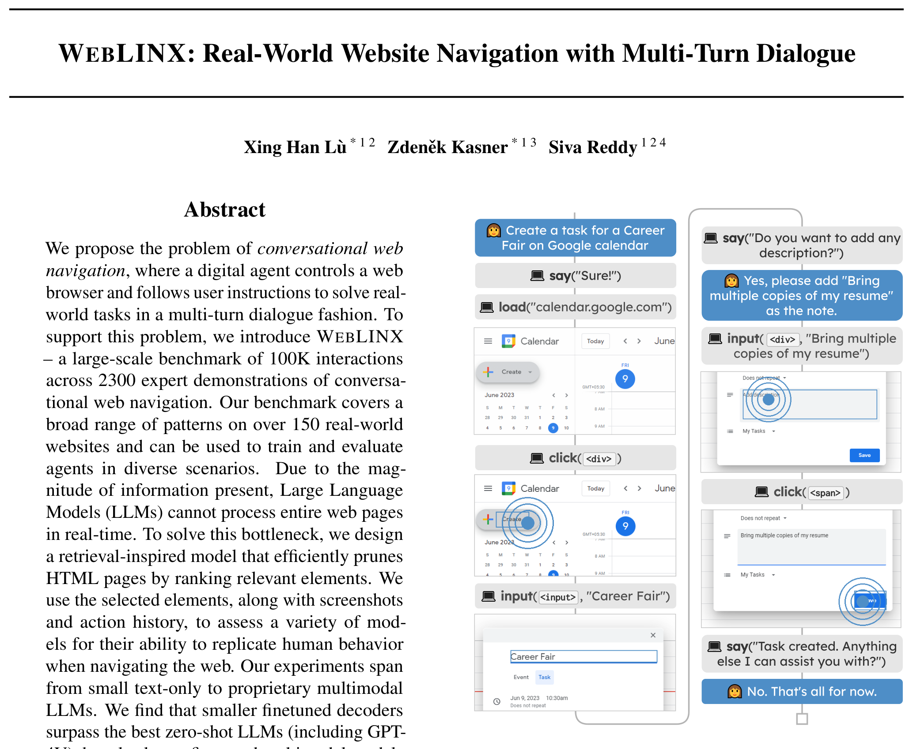
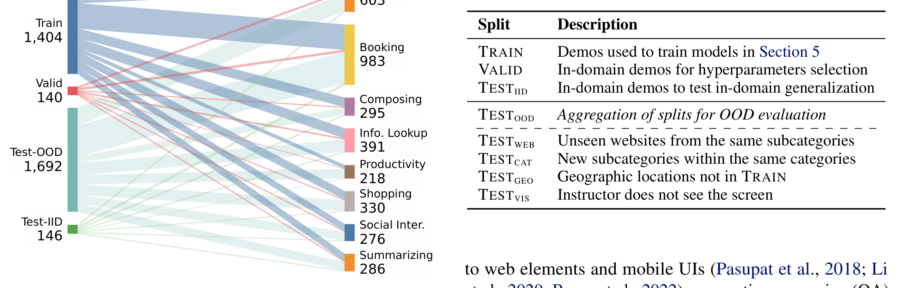
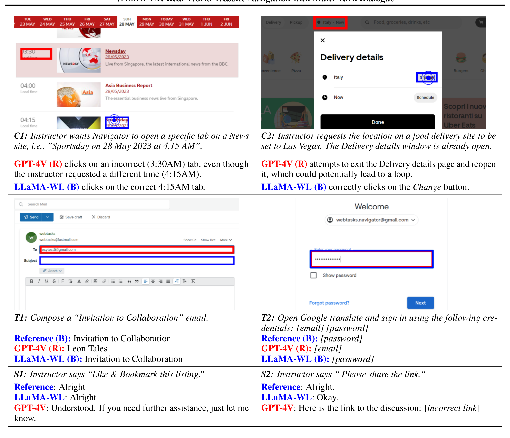

# WEBLINX - Analysis

## 1. Overview

이 논문은 실제 웹사이트에서 다중 턴 대화를 통해 태스크를 수행하는 **대화형 웹 네비게이션(conversational web navigation)** 문제를 정의하고, 이를 위한 대규모 벤치마크 WEBLINX를 제안한다. 기존 웹 에이전트 벤치마크들은 단일 지시문 기반이거나 시뮬레이터 환경에 국한되어 있었다. 저자들은 사용자(instructor)와 에이전트(navigator)가 채팅 인터페이스를 통해 상호작용하며 실제 웹사이트에서 태스크를 완수하는 시나리오가 시각 장애인 지원, 음성 제어, 지식 근로자 생산성 향상 등 실제 활용 사례에 더 적합하다고 주장한다.

WEBLINX는 155개 실제 웹사이트에서 수집된 2,337개 demonstration으로 구성되며, 평균 43턴의 상호작용과 총 100K+ 행동/발화를 포함한다. 기존 벤치마크(MiniWoB++ 28개, Mind2Web 1,135개)와 달리 페이지당 평균 1,775개 HTML 요소를 가진 복잡한 실제 웹 환경을 다룬다. 평가를 위해 5개 split을 설계했는데, 특히 TEST-WEB(새로운 웹사이트), TEST-CAT(새로운 카테고리), TEST-GEO(새로운 지역), TEST-VIS(시각 정보 없는 instructor)를 통해 다차원적 일반화 능력을 평가한다.

19개 모델(8개 아키텍처)을 평가한 결과, 가장 충격적인 발견은 **fine-tuned 소형 모델이 zero-shot GPT-4V를 능가한다**는 것이다. Sheared-LLaMA 2.7B(25.0%)가 GPT-4V(10.4%)를 2배 이상 앞섰다. 그러나 모든 fine-tuned 모델이 out-of-domain 환경에서 심각한 성능 저하를 보였다(IID 37.0% → OOD 24-27%, 30-35% 하락). 특히 새로운 서브카테고리(TEST-CAT)에서 가장 큰 하락이 나타났는데, 이는 레스토랑 예약을 학습한 모델이 병원 예약으로 전이하기 어렵다는 것을 의미한다.

이 연구는 현재 웹 에이전트들의 일반화 능력이 심각하게 부족함을 명확히 보여주며, 대화형 인터랙션을 통한 유연한 웹 자동화 연구의 새로운 방향을 제시했다. 또한 Dense Markup Ranking(DMR)이라는 효율적인 HTML 요소 선택 방법을 제안하여 실시간 에이전트 구현 가능성을 높였다.

---

## 2. Core Section

### TL;DR

> 155개 실제 웹사이트에서 100K+ 상호작용을 수집한 대화형 웹 네비게이션 벤치마크로, fine-tuned 소형 모델이 GPT-4V를 능가하지만 모든 모델이 새로운 웹사이트/카테고리/지역으로의 일반화에 실패(30-35% 성능 하락)함을 발견했으며, Dense Markup Ranking을 통해 HTML 처리 속도를 5배 향상시켰다.

→ 상세: [tldr.md](./2402.05930-details/tldr.md)

### Core Contributions

1. **Conversational Web Navigation Benchmark**: 최초의 대규모 대화형 웹 네비게이션 벤치마크, 2,337 demos, 100K+ interactions, 평균 43턴 → 단일 지시문 기반 벤치마크의 한계 극복

2. **Multi-dimensional Generalization Evaluation**: 5개 split(IID, WEB, CAT, GEO, VIS)으로 웹사이트/카테고리/지역/접근성 차원의 일반화 평가 → 모델의 실제 배포 가능성 검증

3. **Dense Markup Ranking (DMR)**: Dual-encoder 기반 HTML 요소 선택으로 916ms → 186ms (5배 속도 향상), recall 2.6% 하락 → 실시간 에이전트 가능

4. **Generalization Gap Discovery**: Fine-tuned 모델의 심각한 일반화 실패 발견 (IID 37% → OOD 24%), TEST-CAT에서 가장 큰 하락 → 향후 연구 방향 명확화

→ 상세: [contributions.md](./2402.05930-details/contributions.md)

### Key vs Non-Key Sections

| Priority | Sections | Reason |
|----------|----------|--------|
| ⭐⭐⭐ Must Read | Section 3 (WEBLINX), Table 1, Table 2 | 벤치마크 설계와 split 정의 |
| ⭐⭐⭐ Must Read | Section 6 (Results), Table 4, Table 5 | 핵심 실험 결과와 일반화 분석 |
| ⭐⭐ Important | Section 5.1 (DMR), Section 4 (Evaluation) | 방법론과 평가 메트릭 |
| ⭐ Reference | Section 5.2 (Modeling), Appendix B | 모델별 세부 설정 |
| Skip | Section 2 (Related Work), Section 7.2 (Limitations) | 표준적 내용 |

→ 상세: [key-sections.md](./2402.05930-details/key-sections.md)

---

## 3. Paper Type

**Type**: Benchmark

| Aspect | Value |
|--------|-------|
| **Evaluation Target** | 대화형 웹 네비게이션 에이전트 |
| **Task Count** | 2,337 demonstrations, 100K+ interactions |
| **Domains** | 155 websites, 8 categories, 15 geographic regions |
| **Main Metrics** | Intent Match, Element IoU, Text F1, Overall Score |

→ 상세 방법론: [methodology.md](./2402.05930-details/methodology.md)

---

## 4. Visual Analysis

### Key Figures

#### Figure 1: Conversational Web Navigation Task

**구성 요소**:
- **Instructor (Blue)**: 자연어로만 소통하는 사용자
- **Navigator (Grey)**: 브라우저를 제어하는 에이전트
- **Browser Window**: 스크린샷과 DOM 트리 접근 가능
- **Chat Interface**: 대화형 상호작용

**핵심 통찰**:
- 단일 지시문이 아닌 다중 턴 대화로 점진적 태스크 정의
- Instructor는 화면을 볼 수도 있고 못 볼 수도 있음 (TEST-VIS)
- Navigator는 `say()` 행동으로 질문/확인 가능

**Source**: [Figure 1](./2402.05930.md#figure-1-an-example-of-the-conversational-web-navigation-task)

---

#### Figure 2: Category and Split Distribution

**구성 요소**:
- **8 Categories**: Shopping, Travel, Entertainment, Information 등
- **Split Distribution**: 각 카테고리별 train/test 분포
- **Subcategories**: 50개 세부 카테고리

**핵심 통찰**:
- 다양한 도메인 커버리지로 일반화 평가 가능
- 일부 카테고리는 특정 split에만 존재 (OOD 테스트용)
- 카테고리 간 난이도 차이 존재

**Source**: [Figure 2](./2402.05930.md#figure-2-distribution-of-demonstrations-in-weblinx)

---

#### Figure 4: Qualitative Comparison

**구성 요소**:
- **GPT-4V (Red)**: Zero-shot 예측 (종종 오류)
- **LLaMA-WL (Blue)**: Fine-tuned 예측 (더 정확)
- **Scenarios**: Click (C1, C2), TextInput (T1, T2), Say (S1, S2)

**핵심 통찰**:
- GPT-4V: situational awareness 부족 (이미 열린 창 다시 열려 함)
- Fine-tuned 모델: 학습된 패턴에서는 강점, 새로운 상황에서 취약
- 두 모델 모두 단순한 실수 발생 가능

**Source**: [Figure 4](./2402.05930.md#figure-4-comparison-of-gpt-4v-and-llama-2-13b)

---

### Tables Interpretation

#### Table 1: Benchmark Comparison

| Benchmark | Chat | Real-world | # Dom. | Avg. # El. | Avg. # Turns |
|-----------|------|------------|--------|------------|--------------|
| MiniWoB++ | ✗ | ✗ | 100 | 28 | 3.6 |
| Mind2Web | ✗ | ✓ | 137 | 1,135 | 7.3 |
| **WEBLINX** | **✓** | **✓** | **155** | **1,775** | **43.0** |

**주요 발견**:
1. **최초 Chat + Real-world 조합**: 기존 벤치마크와 차별화
2. **10배 이상 긴 상호작용**: 평균 43턴 vs 기존 3-11턴
3. **높은 복잡도**: 1,775개 요소 vs Mind2Web 1,135개

**Source**: [Table 1](./2402.05930.md#table-1-weblinx-is-the-first-benchmark)

---

#### Table 4: Main Results

| Model | Size | TEST-OOD | TEST-IID |
|-------|------|----------|----------|
| GPT-4V (zero-shot) | - | 10.4 | 12.9 |
| Sheared-LLaMA (fine-tuned) | 2.7B | **25.0** | **37.4** |
| LLaMA-2 (fine-tuned) | 13B | 25.2 | 37.0 |
| Fuyu (fine-tuned) | 8B | 20.0 | 30.9 |

**주요 발견**:
1. **Fine-tuned ≫ Zero-shot**: 소형 2.7B가 GPT-4V를 2배 이상 능가
2. **Text-only > Multimodal**: LLaMA-2 > Fuyu (스크린샷 pretrained)
3. **심각한 일반화 gap**: 모든 모델 IID → OOD 30-35% 하락

**트레이드오프**: Fine-tuning은 in-domain 강점, zero-shot은 일반화 잠재력

**Source**: [Table 4](./2402.05930.md#table-4-aggregated-results)

---

#### Table 5: OOD Split Analysis

| Split | Intent IM | Element IoU | Text F1 | Overall |
|-------|-----------|-------------|---------|---------|
| TEST-WEB | 82.7 | 24.2 | 28.7 | 27.0 |
| TEST-CAT | 81.0 | 20.7 | 26.1 | **24.3** |
| TEST-GEO | 78.6 | 22.0 | 27.7 | 25.9 |
| TEST-VIS | 85.3 | 26.1 | 23.9 | 25.0 |

**주요 발견**:
1. **TEST-CAT이 가장 어려움**: 새로운 서브카테고리로의 전이 가장 힘듦
2. **Intent는 유지, Element 선택이 문제**: 무엇을 할지는 알지만 어디를 클릭할지 모름
3. **TEST-VIS 특이성**: Instructor가 화면을 못 봐도 성능 유사

**Source**: [Table 5](./2402.05930.md#table-5-results-on-out-of-domain-splits)

---

## 5. Critique & Related Works

### Expert Critique

#### Strengths
1. **다차원 일반화 평가 설계**: 단순 IID/OOD가 아닌 웹/카테고리/지역/접근성 차원 분리로 정밀한 분석 가능 [Table 2](./2402.05930.md#table-2-demonstration-splits)
2. **대규모 실제 환경 데이터**: 100K+ 상호작용, 43턴 평균으로 실제 사용 시나리오 반영 [Section 3](./2402.05930.md#3-weblinx)
3. **효율적 DMR 방법**: 5배 속도 향상으로 실시간 에이전트 구현 가능성 [Section 5.1](./2402.05930.md#51-dense-markup-ranking)

#### Limitations
1. **정적 demonstration 기반**: 대안 경로 탐색 불가, online learning 미지원 [Section 7.2](./2402.05930.md#72-limitations)
2. **텍스트 전용 모델 한계**: 캔버스 그리기, 이미지 기반 태스크 수행 불가
3. **시간 경과에 따른 유효성**: 웹사이트 변경으로 데이터 노후화 가능

#### Adoption Status
- [x] Widely used: ICML 2024 Spotlight, 후속 연구 다수 인용
- [x] Easy to set up: https://mcgillnlp.github.io/weblinx 제공
- [ ] Clear leaderboard: 공식 리더보드 미운영
- [x] Active maintenance: 코드/데이터 지속 업데이트

#### 2026 Perspective
- **Still Valid**: 대화형 웹 에이전트 벤치마크로서 유일한 대규모 리소스, 일반화 평가 프레임워크 표준으로 채택
- **Outdated**: DMR 방식은 현재 더 발전된 retrieval 방법들로 대체 가능 (ColBERT, BGE 등)
- **Missing**:
  - LLM agent의 planning/reasoning 능력 평가
  - Multi-modal instruction 지원
  - Interactive environment에서의 online evaluation
  - Error recovery 및 backtracking 평가

### Related Works

1. **Mind2Web (Deng et al., 2023)** - 137개 웹사이트 정적 데이터셋, element selection 중심 - [arXiv:2306.06070](https://arxiv.org/abs/2306.06070)
2. **WebArena (Zhou et al., 2023)** - Hosted 환경에서 autonomous agent 평가 - [arXiv:2307.13854](https://arxiv.org/abs/2307.13854)
3. **WorkArena (Drouin et al., 2024)** - ServiceNow 환경 대화형 벤치마크 - [arXiv:2403.07718](https://arxiv.org/abs/2403.07718)

---

## Navigation

- **Source**: [원본 논문](./2402.05930.md)
- **Details**:
  - [TL;DR 상세](./2402.05930-details/tldr.md)
  - [Contributions 상세](./2402.05930-details/contributions.md)
  - [Key Sections 상세](./2402.05930-details/key-sections.md)
  - [Methodology 상세](./2402.05930-details/methodology.md)
