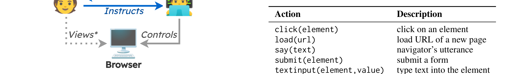
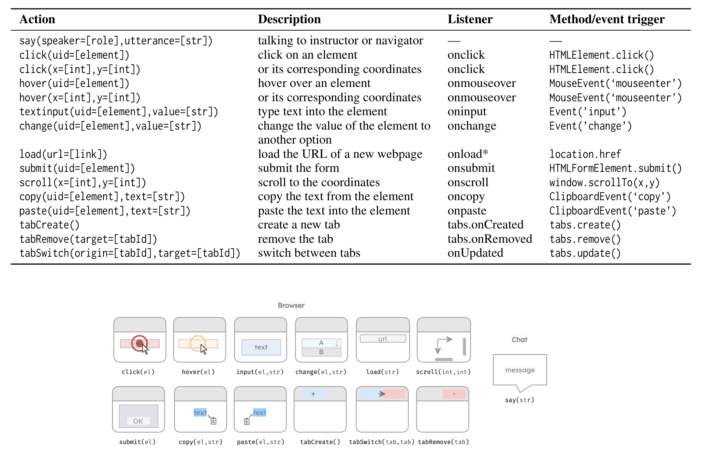
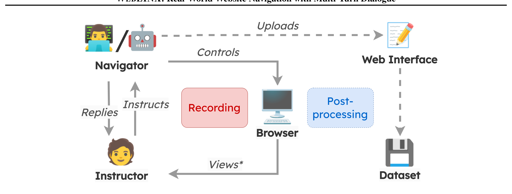

## WEBLINX: Real-World Website Navigation with Multi-Turn Dialogue

**Xing Han Lù**[^aff-1][^aff-2][^fn-star] **Zdeněk Kasner**[^aff-1][^aff-3][^fn-star] **Siva Reddy**[^aff-1][^aff-2][^aff-4]

[^fn-star]: 동등한 기여
[^aff-1]: Mila Quebec AI Institute
[^aff-2]: McGill University
[^aff-3]: Institute of Formal and Applied Linguistics, Charles University
[^aff-4]: Facebook CIFAR AI Chair

**연락처**: Xing Han Lù <xing.han.lu@mail.mcgill.ca>, Zdeněk Kasner <kasner@ufal.mff.cuni.cz>, Siva Reddy <siva.reddy@mila.quebec>

## 초록

우리는 conversational web navigation 문제를 제안한다. 이 문제에서 digital agent는 web browser를 제어하고 사용자 지시를 따라 multi-turn dialogue 방식으로 실제 task를 수행한다. 이 문제를 지원하기 위해 우리는 WEBLINX를 소개한다. 이는 conversational web navigation의 2300개 expert demonstration에 걸친 100K개의 interaction으로 구성된 large-scale benchmark이다. 우리의 benchmark는 150개 이상의 real-world website에서 광범위한 패턴을 다루며, 다양한 시나리오에서 agent를 훈련하고 평가하는 데 사용될 수 있다. 존재하는 정보의 규모로 인해 Large Language Models(LLMs)는 전체 web page를 실시간으로 처리할 수 없다. 이 병목 현상을 해결하기 위해 우리는 관련 element를 ranking하여 HTML page를 효율적으로 pruning하는 retrieval-inspired model을 설계한다. 우리는 선택된 element를 screenshot 및 action history와 함께 사용하여 web navigation 시 인간 행동을 복제하는 다양한 model의 능력을 평가한다. 우리의 실험은 small text-only model부터 proprietary multimodal LLM까지 다양하다. 우리는 smaller finetuned decoder가 best zero-shot LLM(GPT4V 포함)을 능가하지만, screenshot으로 명시적으로 pretrain된 larger finetuned multimodal model도 능가한다는 것을 발견했다. 그러나 모든 finetuned model은 unseen website로 일반화하는 데 어려움을 겪는다. 우리의 발견은 새로운 설정으로 일반화할 수 있는 large multimodal model의 필요성을 강조한다. 우리의 코드, 데이터 및 model은 연구용으로 제공된다: https://mcgillnlp.github.io/weblinx.

## 1 서론

ChatGPT (OpenAI, 2022) [[1]](#ref-1)와 같은 proprietary conversational assistant는 단순히 대화하는 것 이상의 기능을 수행할 수 있다; plugin을 통해 website를 browse할 수도 있으며 (OpenAI, 2023d;

*Figure 1: conversational web navigation task의 예시. instructor(파란색)는 navigator(회색)와 자연어만 사용하여 소통한다. navigator는 screenshot과 textual website representation에 접근하면서 browser를 제어한다.*

Pinsky, 2023), 이를 통해 action을 수행하고 더 유용한 응답을 제공할 수 있다. 그러나 이 기능은 제한적이다: plugin은 각 website에 대해 별도로 개발되어야 하며 website의 모든 기능을 커버하지 못할 수 있다. 이러한 제한은 중요한 연구 질문을 제기한다: 이러한 assistant 뒤의 model을 활용하여 사용자의 browser에서 직접 website를 navigate하면서 conversational 기능을 유지할 수 있을까?

이 질문에 동기를 받아, 우리는 real-world conversational web navigation 문제를 정의한다: 초기 사용자 지시가 주어지면, agent는 multi-turn dialogue를 통해 사용자와 소통하면서 web browser 내에서 real-world task를 완료해야 한다. 이 문제는 많은 실제 시나리오에서 관련성이 있다: 시각 장애 사용자가 chat interface를 통해 효율적으로 website를 navigate하도록 돕고,

Table 1: WEBLINX는 multi-turn dialogue가 있는 real-world website를 특징으로 하는 첫 번째 benchmark이다. 열은 다음을 나타낸다: multi-turn dialogue 사용(Chat), task가 일반적인지 특화되었는지(Gener.), web browser 사용 여부(Browse), app/website domain 수(# Dom.), instance 수(# Inst.), page당 평균 HTML element 수(Avg. # El.), instance당 평균 turn 수(Avg. # Turns). *AITW는 각각 여러 demo가 있는 30K개의 unique prompt를 가지며 browsing data는 엄격히 Android 장치에서 수집되었다.

| Benchmark                       | Chat   | Gener.   | Browse   |   # Dom. | # Inst.   | Avg. # El.   | Avg. # Turns   | Setting       |
|---------------------------------|--------|----------|----------|----------|-----------|--------------|----------------|---------------|
| MiniWob++ (Liu et al., 2018) [[2]](#ref-2)    | ✗      | ✗        | ✗        |      100 | 100       | 28           | 3.6            | Simplified    |
| WebShop (Yao et al., 2022) [[3]](#ref-3)      | ✗      | ✗        | ✓        |        1 | 12K       | 38           | 11.3           | E-Commerce    |
| WebArena (Zhou et al., 2023) [[4]](#ref-4)    | ✗      | ✓        | ✓        |        6 | 812       | -            | -              | Real-world    |
| VWA (Koh et al., 2024) [[5]](#ref-5)          | ✗      | ✓        | ✓        |        3 | 910       | -            | -              | Real-world    |
| Mind2Web (Deng et al., 2023) [[6]](#ref-6)    | ✗      | ✓        | ✓        |      137 | 2350      | 1135         | 7.3            | Real-world    |
| AITW ∗ (Rawles et al., 2023) [[7]](#ref-7)    | ✗      | ✓        | ✓        |      357 | 30K       | -            | 6.5            | Android/Apps  |
| WebVoyager (He et al., 2024) [[8]](#ref-8)    | ✗      | ✓        | ✓        |       15 | 300       | -            | -              | Real-world    |
| RUSS (Xu et al., 2021) [[9]](#ref-9)          | ✓      | ✗        | ✓        |       22 | 80        | 801          | 5.4            | Help center   |
| WorkArena (Drouin et al., 2024) [[10]](#ref-10) | ✓      | ✗        | ✓        |        1 | 23K       | -            | 10             | IT Management |
| META-GUI (Sun et al., 2022) [[11]](#ref-11)     | ✓      | ✓        | ✗        |       11 | 1125      | 79           | 4.3            | Mobile apps   |
| WEBLINX (ours)                  | ✓      | ✓        | ✓        |      155 | 2337      | 1775         | 43.0           | Real-world    |

음성 제어 web navigation으로 smart speaker와 digital assistant를 향상시키고, 반복적인 단계를 줄이면서 통제력을 유지하여 지식 근로자의 생산성을 향상시킨다. 연구 관점에서, 이 문제는 LLM agent가 self-contained instruction을 따르는 것뿐만 아니라 dialogue를 통해 환경과 상호작용하고 예상치 못한 상황에 일반화하는 능력을 평가하는 데 사용될 수 있다.

이 문제를 해결하기 위해, 우리는 WEBLINX 1(§3)를 소개한다. 이는 155개의 real-world website에 걸쳐 human expert가 생성한 2337개의 conversational web navigation demonstration을 포함하는 benchmark이다. Figure 1은 demonstration을 보여준다. 각 demonstration은 conversational interface를 통해 사용자(instructor로 알려진)와 상호작용할 때 human navigator가 수행한 action의 전체 시퀀스를 캡처한다. 우리는 100K개 이상의 action과 utterance를 기록하며, 각 action은 Document Object Model(DOM) 2 tree, browser screenshot, demonstration 수준의 video recording frame과 연관된다. Table 1은 WEBLINX의 고유한 측면을 강조한다. mobile app이나 specialized application에 초점을 맞춘 이전 연구와 달리, 우리의 것은 dialogue-enabled navigation agent를 훈련하고 새로운 website, category, 지역에 적응하는 것과 같은 realistic scenario에 대한 일반화 능력을 평가하는 데 사용할 수 있는 첫 번째 large-scale benchmark이다; 우리는 또한 browser에 대한 시각적 접근 없이 instructor와 상호작용하는 agent의 능력을 평가하기 위한 split을 예약한다.

이 benchmark를 사용하는 naive한 방법은 전체 DOM tree를 agent에 직접 주고 올바른 action을 예측하도록 지시하는 것이다. 일부 HTML page는 수천 개의 element를 포함하므로, LLM의 context 내에 완전히 맞추는 것은 상당한 도전을 제기한다; 가능하더라도,

1 Web Language Interface for Navigation & eXecuting actions 2 browser에서 render된 HTML page의 tree representation.

기존 LLM은 실시간으로 처리할 수 없을 것이다. 따라서, 우리는 Dense Markup Ranking(§5.1)이라는 방법을 설계한다. 이 방법은 HTML page의 각 element를 전체 action history와 비교한다. similarity-based approach를 사용하여 element를 학습하고 rank함으로써, text retrieval에 사용되는 compact architecture를 활용할 수 있다. 이를 통해 가장 관련성 있는 element를 찾고 관련 없는 것을 prune하여 DOM의 compact representation을 얻을 수 있다. 이를 action history, 상세한 instruction, screenshot(multimodal context에서)과 결합하여 LLM을 위한 input representation을 구성하며, 이제 어떤 action을 취해야 하는지 의미 있게 예측할 수 있다. 그러나 예측된 action이 올바르더라도 기존 metric에 의해 incorrect로 식별될 수 있으며, 이는 agent의 응답에 사소한 차이가 있거나 overlapping element가 선택된 경우 발생할 수 있다. 따라서, 우리는 특정 유형의 action에 맞춤화된 evaluation metric suite를 설계한다(예를 들어, clicking은 navigator가 말하는 것과 다르게 평가되어야 한다).

우리는 8개의 architecture에 기반한 19개의 model(§6)을 검토한다. 여기에는 smaller image-to-text, larger text-only decoder, LLM, multimodal model(image와 text 모두 접근 가능)이 포함된다. 그 중 5개는 zero-shot setting이고, 나머지는 WEBLINX의 training split을 사용하여 finetuning되었다. 우리는 best zero-shot model인 GPT-4V(OpenAI, 2023a) [[12]](#ref-12)조차 finetuned model에 의해 능가된다는 것을 발견했다(§6.1). 특히, Sheared-LLaMA(Xia et al., 2023) [[13]](#ref-13)와 같은 smaller model은 browser screenshot으로 pretrain된 much larger Fuyu(Bavishi et al., 2023) [[14]](#ref-14)를 능가한다. 그러나 모든 model은 다른 지역의 unseen website나 instructor가 화면을 보지 않고 지시를 주는 경우와 같은 새로운 설정에 일반화하는 데 어려움을 겪는다. 이러한 발견은 우리가 model의 행동을 질적으로 살펴보도록 유도했으며(§6.2), GPT-4V가 상황 인식이 부족하고 명백한 실수를 할 수 있음을 발견했다. 그러나 best finetuned model조차

*Figure 2: WEBLINX의 demonstration 분포, category(Section 5.2)와 split(Table 2)별. 각 category는 Appendix A.2에 표시된 것처럼 많은 subcategory를 가진다.*

존재하지 않는 link를 click하거나 번역 app의 언어를 변경하지 못하는 것과 같은 간단한 경우에 실패한다. 따라서, Section 7에서 논의하는 것처럼 conversational web navigation 문제에서 진전을 이루기 위해서는 상당한 노력이 필요할 것으로 믿는다.

우리의 기여는 다음과 같이 요약된다:

- 우리는 real-world conversational web navigation 문제와 이를 위한 large-scale expert-annotated benchmark인 WEBLINX(§3)를 소개한다.
- 우리는 전체 model 성능을 평가하기 위해 결합하는 action-specific metric suite를 제안한다(§4).
- 우리는 HTML page를 단순화하는 방법을 설계하여(§5.1), 광범위한 model을 평가할 수 있게 한다(§5.2).
- 우리는 smaller text-only decoder가 multimodal LLM을 능가하지만, 모든 finetuned model이 novel scenario에 일반화하는 데 어려움을 겪는다는 것을 발견했다(§6).

## 2 관련 연구

## 2.1 Web Navigation Agent

이전 연구는 주로 single task를 위한 web agent 구축에 초점을 맞췄다. task-driven web navigation의 대표적인 연구는 MiniWoB++(Shi et al., 2017; Liu et al., 2018)로, 광범위한 task primitive list(예: dropdown에서 값 선택 또는 calendar에서 날짜 선택)가 있는 simulated web environment이다. 잘 정의된 input space와 simulated environment의 유연성으로 인해 reinforcement learning approach가 human-level performance에 도달했다(Liu et al., 2018; Humphreys et al., 2022). 그러나 이러한 방법들이 realistic setting으로 전이하는 능력은 제한적이었으며, environment extension(Gur et al., 2021) [[15]](#ref-15)과 sample-efficient method(Kim et al., 2023) [[16]](#ref-16)를 도입한 후에도 마찬가지였다. 다른 연구들은 web element와 mobile UI에 대한 language command grounding(Pasupat et al., 2018; Li et al., 2020; Burns et al., 2022), 또는 Wikipedia navigation을 통한 question answering(QA)(Nogueira & Cho, 2016)을 탐구했다.

Table 2: training과 evaluation을 위한 Demonstration(Demo) split.

| Split                      | 설명                                                                                                                                                   |
|----------------------------|---------------------------------------------------------------------------------------------------------------------------------------------------------------|
| TRAIN VALID TEST IID       | Section 5에서 model 훈련에 사용되는 demo / hyperparameter 선택을 위한 In-domain demo / in-domain generalization을 테스트하기 위한 In-domain demo                        |
| TEST OOD                   |                                                                                                                                                               |
|                            | OOD evaluation을 위한 split 집합                                                                                                                      |
| TEST WEB TEST CAT TEST GEO | 같은 subcategory의 unseen website / 같은 category 내의 새로운 subcategory / TRAIN에 없는 지역 / instructor가 화면을 보지 않음 |
| TEST VIS                   |                                                                                                                                                               |

더 realistic한 environment를 구축하려는 노력으로, Yao et al.(2022) [[3]](#ref-3)은 12K개 이상의 human-written task instruction이 있는 e-commerce environment인 WebShop을 소개했다. WebShop에서 훈련된 model은 strong performance를 달성했지만, 여전히 clean HTML과 simple visual representation에 의존했다(Furuta et al., 2023) [[17]](#ref-17). 대신, 우리는 종종 noisy하고 dynamic한 환경에 존재하는 어떤 real-world website에서도 행동할 수 있는 agent를 구축하는 것을 목표로 한다.

LLM을 사용하여 real website에서 행동하는 전망(Nakano et al., 2021) [[18]](#ref-18)은 LLM-based navigation service(Adept, 2023; Multi-On, 2023; HyperWrite, 2023)의 개발로 이어졌으며, 이는 학술적 counterpart의 무대를 마련했다. MIND2WEB(Deng et al., 2023) [[6]](#ref-6), WebArena(Zhou et al., 2023) [[4]](#ref-4), VisualWebArena(Koh et al., 2024) [[5]](#ref-5)는 SeeAct(Zheng et al., 2024) [[19]](#ref-19)와 WebVoyager(He et al., 2024) [[8]](#ref-8)와 같은 autonomous navigation agent를 구축하기 위한 large-scale resource이다. 반면, WEBLINX는 multi-turn dialogue 방식으로 사용자와 상호작용하여 정확한 목표를 향해 steering될 수 있는 agent를 구축하기 위한 benchmark이다. 이를 위해, 우리의 problem formulation은 영화 티켓 예매를 위한 simulated instructor(Gur & Yan, 2019), online help center를 위한 semantic parsing-based agent(Xu et al., 2021) [[9]](#ref-9), crowd-source platform을 위한 iterative tool resolution(Xu et al., 2024) [[20]](#ref-20)에 대한 탐색적 연구를 상당히 확장하고 일반화한다.

## 2.2 Website Representation

real-world website를 효율적으로 표현하는 것은 web understanding(Wu et al., 2023) [[21]](#ref-21)의 오래된 도전으로, web information extraction(Chang et al., 2006) [[22]](#ref-22)과 web segmentation(Kiesel et al., 2020) [[23]](#ref-23)과 같은 subtask를 포함한다. website의 textual representation - HTML code 또는 DOM tree -를 단순화하거나 압축하는 approach에는 rule-based algorithm(Zhou et al., 2021) [[24]](#ref-24), browser가 제공하는 accessibility-tree representation(Assouel et al., 2023) [[25]](#ref-25), graph embedding(Wang et al., 2022) [[26]](#ref-26), model-based approach(Deng et al., 2022; Li et al.,

*Figure 3: 데이터 수집 설정(Section 3). instructor와 human navigator 사이의 interaction(chat과 browser action)을 기록한다. instructor는 TEST-VIS split을 제외하고 화면을 볼 수 있다.*

2022; Aghajanyan et al., 2022; Gur et al., 2024)가 포함된다. webpage의 visual information을 표현하기 위한 이전 연구들은 보통 feature extraction에 의존했으며(Liu et al., 2010; Cormer et al., 2017), graphical UI에 대한 연구(Wu et al., 2021; Bunian et al., 2021)를 밀접하게 따랐다. Deng et al.(2023) [[6]](#ref-6)에서 영감을 받아, 우리는 관련 DOM element를 선택하는 novel dense markup ranker를 제안하고, 이러한 element를 선택적으로 high-resolution browser screenshot과 결합하여 사용한다.

## 2.3 Conversational Interface

task를 완료하기 위해 conversational interface를 사용하는 것은 task-oriented dialogue의 기초이다(Chen et al., 2017; Zhang et al., 2020b). End-to-end solution은 promising result를 보여주었지만(Zhang et al., 2020a; Kann et al., 2022), LLM의 사용은 여전히 검토 중이다(Hudeček & Dušek, 2023). real-world service의 경우, Dialog2API(Shu et al., 2022) [[27]](#ref-27)는 API-based service와 상호작용하기 위한 interface를 제안했고, META-GUI(Sun et al., 2022) [[11]](#ref-11)은 일반 website보다 mobile app에서 action을 자동화하는 데 초점을 맞춘 dataset을 소개했다. dialogue-centric web navigation 측면에서, RUSS(Xu et al., 2021) [[9]](#ref-9)는 domain-specific language로 annotate된 80개의 demonstration을 통해 support service를 돕도록 설계된 첫 번째 dataset이다. WEBLINX는 dynamic topic switching을 포함하여 2337개의 demonstration에 걸친 광범위한 real-world task를 다루면서 이전 dialogue-centric dataset을 확장하며, 이는 Adlakha et al.(2022) [[41]](#ref-41)이 연구한 주제이다.

## 3 WEBLINX

이 section에서, 우리는 평균 43 turn의 2337개 demonstration으로 구성된 conversational web navigation을 위한 large-scale benchmark인 WEBLINX를 소개한다. 이는 15개 지역에서 선택된 155개의 real-world website에 걸쳐 task를 완료하려는 human user(instructor로 지칭)와 human assistant(navigator) 사이의 interaction을 포함한다. 우리는 website를 domain에 따라 8개의 category와 50개의 subcategory로 분류한다.

Table 3: WEBLINX core action space 개요. 전체 action set은 Table 6 참조.

| Action                                                                      | 설명                                                                                               |
|-----------------------------------------------------------------------------|-----------------------------------------------------------------------------------------------------------|
| click(element) load(url) say(text) submit(element) textinput(element,value) | element를 click / 새 page의 URL을 load / navigator의 발화 / form을 submit / element에 text 입력 |

**통계** 데이터 통계는 Table 1에 요약되어 있고, category와 split별 분류는 Figure 2에 설명되어 있다. dataset에 대한 추가 통계는 Appendix A.1에, category 목록은 Appendix A.2에서 찾을 수 있다.

**Demonstration Framework** demonstration은 web browser를 제어하는 navigator에 의해 기록되는 real-time interaction을 캡처한다. 각 demonstration D = { s 1 , a 1 , . . . , s n , a n }는 n개의 state s ∈ S와 action a ∈ A의 시퀀스이다. 각 turn t ∈ { 1 , . . . , n }에서, state s t는 website의 representation을 포함한다. 각 action은 Table 3에 설명된 5개의 core intent 중 하나를 따른다. 전체 intent 목록은 Section A.6에 제공된다.

**데이터 수집** demonstration을 수집하기 위해, 우리는 전문 data labeling 회사 3와 협력했으며, 그들은 우리의 task를 완료하기 위해 상세한 지침과 광범위한 훈련을 받은 8명의 expert annotator를 고용했다. annotator들은 쌍으로 작업했다: instructor는 web browser에서 task를 완료하는 navigator와 상호작용한다(Figure 3 참조). 둘 다 chat interface를 사용하여 소통하지만, navigator만 browser를 제어한다. 우리는 demonstration을 기록하기 위한 app, browser extension, processing pipeline을 설계했으며, 이후 원래 navigator의 감독 하에 다른 annotator에 의해 검증된다(자세한 내용은 Appendix A.5 참조).

**Evaluation Split** TRAIN split 외에도, in-domain generalization을 평가하기 위한 VALID와 TESTIID, 다양한 시나리오를 위한 4개의 out-of-domain split을 생성한다(Table 2 참조).

## 3.1 modeling을 위한 action과 state 표현

각 turn t에서, action a t를 예측하기 위해 state s t에 접근한다. state는 다음으로 구성된다(가능한 경우):

- c t: a t가 targeting할 수 있는 candidate element,
- d t: page의 현재 DOM tree,
- i t: navigator browser의 screenshot,
- u t: instructor의 발화,
- v t: viewport 크기(높이와 너비),
- h t: interaction history.

3 EsyCommerce: esycommerce.com

state가 위의 모든 것을 포함할 필요는 없다. 예를 들어, demonstration 시작 시 instructor와 navigator는 목표를 적절히 정의하기 위해 여러 라운드의 dialogue가 필요할 수 있으며, 이 경우 초기 state에는 DOM tree나 screenshot이 없다. model m은 state s t의 내용을 어떻게 사용할지 나타내는 prompt template p m에 기반하여 주어진 state s t에 대해 action a t를 예측한다.

**Interaction history** model m이 실제로 제한된 input 길이를 가지므로, history h를 과거 5개의 action(a r로 표시)과 5개의 utterance(u r)의 집합으로 표현한다. 우리는 element나 screenshot과 같은 과거 state의 representation을 포함할 수 없었다.

**Action Output Parsing** action은 intent와 argument로 구성되며 agent가 textual format으로 생성할 수 있다. 이는 Selenium 4와 같은 도구를 사용하여 browser에서 실행할 수 있는 structured form으로 parse될 수 있도록 미리 정의된 구조(Table 3 참조)를 따라야 한다. 추가 세부사항은 Appendix A.4에서 논의한다.

## 4 Evaluation Framework

이 section에서, evaluation metric(§4.1)과 특정 intent 그룹에 대한 적용 가능성(§4.2)을 설명한다.

## 4.1 Metric

web navigation에 대한 이전 연구에서 일반적으로 사용되는 metric은 task success rate로, model이 원하는 최종 상태에 도달한 demonstration의 비율을 측정한다(Shi et al., 2017; Yao et al., 2022; Deng et al., 2023). 그러나 이 metric은 목표가 첫 번째 turn이나 이후 turn에서 완전히 정의되지 않기 때문에 우리의 benchmark에는 부적절하다; 대신, 대화가 진행됨에 따라 진화한다. 우리는 대신 dialogue system에서 확립된 approach를 따라 turn-level automatic evaluation metric을 활용한다(Rastogi et al., 2020; Zhang et al., 2020a). metric의 목적은 예측된 action과 reference action 사이의 similarity에 대한 heuristic 추정을 제공하는 것이다.

**Intent Match(IM)** prediction a'와 reference a가 주어지면, intent match는 intent가 같으면 IM(a', a) = 1이고, 그렇지 않으면 IM(a', a) = 0이다. 이는 model이 어떤 action을 수행해야 하는지 올바르게 식별할 수 있는지 알려주지만, model이 올바른 argument를 예측할 수 있는지는 나타내지 않는다.

**IoU를 사용한 Element Similarity** element를 argument로 하는 action(click, textinput, submit)의 경우, intersection over union(IoU; Jaccard 1912)을 계산한다. bounding box B의 면적이 주어지면:

$$\text{IoU}(B', B) = \text{IM}(a', a) \times \frac{\text{Area}(B' \cap B)}{\text{Area}(B' \cup B)}$$

[^fn-4]: [https://www.selenium.dev/](https://www.selenium.dev/)

면적을 계산하기 위해 reference와 predicted bounding box의 (x,y) 좌표를 사용한다. 이 formulation은 (1) visual overlap이 높은 element를 선호하고, (2) 하나가 다른 것에 완전히 포함되더라도 reference element보다 훨씬 작거나 큰 element를 예측하는 것에 페널티를 주고, (3) element가 overlap되지 않으면 0을 할당한다.

**F1을 사용한 Text Similarity** say와 textinput의 text argument의 lexical similarity를 측정하기 위해, character n-gram match에 대한 F1-score인 chrF(Popovic, 2015) [[28]](#ref-28)를 계산한다(n = 6의 default setting 사용). IoU와 유사하게, IM으로 scale하여 IM(a', a) × CHRF(a', a)가 된다. load intent의 경우, URL은 일관되게 segment될 수 있는 구조를 따르므로, n-gram 대신 segment에 F1-score를 적용한다; 우리는 이 measure를 URLF라고 부른다. action에 text 또는 URL argument가 포함되어 있는지에 따라 chrF와 URLF 중 하나를 가리키는 데 F1을 사용한다.

## 4.2 Turn-level score와 overall score

model 간의 더 나은 비교를 위해, intent를 그룹으로 나눈다: element group(EG)은 click, textinput, submit을 포함하고 IoU로 평가된다. text group(TG)은 load, say, textinput을 포함하고 F1으로 평가된다.

다음에 따라 turn level score를 할당한다: turn이 EG의 action을 포함하면, score는 IoU와 같다. 즉, intent가 incorrect이거나 element가 overlap되지 않으면 score는 0이고, intent가 correct이고 element가 완벽하게 overlap되면 1이며, 나머지는 그 사이 어딘가이다. TG action load와 say의 경우, score는 F1과 같다. 즉, intent가 incorrect이거나 text overlap이 없으면 score는 0이고, intent가 correct이고 text가 정확히 일치하면 1이며, 나머지는 그 사이 어딘가이다. textinput의 경우, text와 element argument를 모두 포함하므로 turn score는 IoU × F1이다. 마지막으로, turn-level score의 micro-average를 사용하여 overall score를 계산한다.

## 5 방법

이 section에서, candidate element 선택 방법(§5.1)과 이를 textual input에서 사용하는 방법을 설명한다. 이러한 방법을 사용하여 action을 정확하게 예측할 수 있는 model을 구축한다(§5.2). Section 6에서 결과를 보고하고 Appendix B에서 implementation detail을 제공한다.

## 5.1 Candidate Selection과 Input Representation을 위한 Dense Markup Ranking(DMR)

model input을 위한 적합한 candidate set을 선택하기 위해(§3.1), DOM tree의 전체 element set을 filtering하는 candidate selection 단계가 필요하다. Deng et al.(2023) [[6]](#ref-6)은 각 DOM element를 task query와 쌍으로 하여 DeBERTa model(He et al., 2021) [[29]](#ref-29)에 입력하는 것을 제안했으며, 이는 cross-encoder loss를 사용하여 finetuning된다(Reimers &

Gurevych, 2019). 우리는 이 방법이 주어진 turn에 대해 candidate를 선택하는 데 평균 916ms가 걸린다는 것을 발견했다. 5 network latency와 LLM inference를 고려하면, 이는 poor processing time을 초래할 것이다. 따라서 실시간으로 작동하고 사용자와의 interaction에서 학습할 수 있는 agent를 구축하기 위해 efficient ranking method를 사용하는 것이 중요하다.

이를 해결하기 위해, 우리는 약간 낮은 recall의 대가로 이전 approach보다 5배 빠른 Dense Markup Ranking(DMR)을 제안한다. 이 방법은 (1) computational overhead를 줄이기 위한 simplified element representation; (2) dual encoder-based approach(Reimers & Gurevych, 2019; Karpukhin et al., 2020); (3) s t와 a 1: t -1의 text representation과 해당 HTML element 사이의 similarity-based learning으로 구성된다. 이 방법을 사용하여 MiniLM(Wang et al., 2020) [[30]](#ref-30)의 variant를 finetuning한다. cosine-based learning objective를 formulate하고, inference speed improvement를 검토하며, Appendix B.4에서 대안을 평가한다.

candidate selection 후에도 model에 대한 input sequence 길이가 limit을 초과할 수 있으므로, sequence를 truncate한다. traditional truncation(예: large DOM element와 long history)으로 인한 information loss를 줄이기 위해, 우리는 어떤 subsection을 truncate해야 하는지 결정하기 위해 input의 hierarchical nature를 활용하는 전략을 설계한다. full HTML attribute, viewport size, XML Path, candidate element의 bounding box를 포함하여 prior work에서 사용된 representation에 대한 여러 개선을 도입한다(implementation detail은 Appendices B.1과 B.2 참조).

## 5.2 Action Modeling

주어진 state s t에 대해 가장 유망한 candidate를 선택한 후, s t의 나머지 정보와 결합하여 action string을 예측하는 데 사용할 수 있는 representation을 구성할 수 있으며, 이는 parse되고 실행될 수 있다(§3.1). action 예측에 어떤 요소가 중요한지 이해하기 위해, 다양한 input modality를 가진 19개의 zero-shot 및 finetuned model(TRAIN split 사용)을 검토한다: image-only, text-only, 그리고 둘 다. Appendix B.6에서 implementation detail을, Appendix B.7에서 hyperparameter를 제공한다.

**Model Category** output이 항상 structured format(§3.1)이므로, input modality별로 action model을 분류한다. 다음 유형을 정의한다: (1) text-only, instruction, pruned DOM tree, candidate element description, history를 받음; (2) image-to-text, screenshot, instruction, 이미지에 직접 embedded된 past action을 받음; (3) multimodal, screenshot, instruction, pruned DOM tree, candidate description, history를 직접 text로 받음. 추가 논의는 Appendix B.3에서 찾을 수 있다.

5 training set에서 계산됨, Appendix B.4.1 참조.

Table 4: major model(§5)에 걸친 집계 결과(§6), parameter count(Size)순으로 정렬. Section 4의 metric을 따라, intent match(IM), element group(IoU), text group(F1), overall score(turn-level score의 micro-average) 결과를 보고한다. 마지막 열을 제외한 모든 결과는 TESTOOD에, 마지막 열은 TESTIID에 있다. /eye는 screenshot에 접근할 수 있는 model을 나타낸다; Pix2Act를 제외한 모든 model은 text input에 접근한다.

|             |      | Intent   | Element   | Text F1   | Overall Score   | Overall Score   |
|-------------|------|----------|-----------|-----------|-----------------|-----------------|
| Models      | Size | IM       | IoU       |           | TEST OOD        | TEST IID        |
| Zero-shot   |      |          |           |           |                 |                 |
| Llama-2     | 13B  | 43.7     | 4.8       | 1.3       | 5.2             | 5.6             |
| GPT-3.5T    | -    | 42.8     | 8.6       | 3.5       | 8.5             | 10.3            |
| GPT-4T      | -    | 41.7     | 10.9      | 6.8       | 10.7            | 12.2            |
| GPT-4V /eye | -    | 42.4     | 10.9      | 6.2       | 10.4            | 12.9            |
| Finetuned   |      |          |           |           |                 |                 |
| /eye        |      |          |           |           |                 |                 |
| Pix2Act     | 1.3B | 81.8     | 8.3       | 25.2      | 16.9            | 23.9            |
| S-LLaMA     | 2.7B | 84.0     | 22.6      | 27.2      | 25.0            | 37.4            |
| MindAct     | 3B   | 79.9     | 16.5      | 23.2      | 20.9            | 25.7            |
| Flan-T5     | 3B   | 81.1     | 20.3      | 25.8      | 23.8            | 31.1            |
| Fuyu /eye   | 8B   | 80.1     | 15.7      | 22.3      | 20.0            | 30.9            |
| Llama-2     | 13B  | 83.0     | 22.8      | 26.6      | 25.2            | 37.0            |
| GPT-3.5F    | -    | 77.6     | 18.6      | 22.4      | 21.2            | 30.8            |

**Text-only model** 최근의 MindAct(Deng et al., 2023) [[6]](#ref-6) model은 Mind2Web에서 finetuning된 Flan-T5(Chung et al., 2022b) [[31]](#ref-31) model이다. 우리는 원래 configuration을 사용하여 WEBLINX에서 추가로 finetuning한다.

DMR-based representation(§5.1)으로 인한 개선을 quantify하기 위해, Flan-T5 checkpoint를 직접 finetuning하여 MindAct에 대해 size와 architecture를 control할 수 있다. 우리는 또한 LLaMA-2(Touvron et al., 2023a;b) 6와 distilled version인 Sheared-LLaMA(S-LLaMA; Xia et al. 2023)를 finetuning한다.

**Proprietary text-only LLM** zero-shot(3.5T)과 finetuned(3.5F) setting 모두에서 GPT3.5 Turbo(Brown et al., 2020; Peng et al., 2023)의 결과를 보고한다. GPT-4T(OpenAI, 2023b) [[32]](#ref-32)에 대한 zero-shot 결과도 포함한다.

**Image-to-text modeling** pixel로만 finetuning된 encoder-decoder(Vaswani et al., 2017) [[34]](#ref-34)인 Pix2Act(Shaw et al., 2023) [[33]](#ref-33)를 탐구한다. Vision Transformer encoder(Dosovitskiy et al., 2021) [[36]](#ref-36)와 text decoder를 사용하여 screenshot으로 pretrain된 Pix2Struct backbone(Lee et al., 2023) [[35]](#ref-35)을 사용한다. Pix2Act가 사용한 behavior cloning approach를 따라 동일한 backbone을 WEBLINX에서 finetuning한다.

**Multimodal model** browser screenshot으로 pretrain되고 unified architecture를 사용하여 image와 text를 modeling하는 base model인 Fuyu-8B(Bavishi et al., 2023) [[14]](#ref-14)를 finetuning한다. vision 기능이 있는 GPT-4 variant(GPT-4V; OpenAI 2023a)에 대한 zero-shot 결과도 보고한다.

6 chat에서 finetuning된 variant 사용.

Table 5: finetuned LLaMA2-13B(§5.2)의 out-of-domain split(§2) 결과. split 중에서 TESTCAT가 가장 어려운 것으로 보이며, 이는 model이 unseen subcategory(예: restaurant appointment vs. medical appointment)에서 어려움을 겪음을 나타낸다.

| Splits   |   Intent IM |   Element IoU |   Text F1 |   Overall |
|----------|-------------|---------------|-----------|-----------|
| TEST WEB |        82.7 |          24.2 |      28.7 |      27   |
| TEST CAT |        81   |          20.7 |      26.1 |      24.3 |
| TEST GEO |        78.6 |          22   |      27.7 |      25.9 |
| TEST VIS |        85.3 |          26.1 |      23.9 |      25   |

## 6 실험 결과

이 section에서, Section 4.2에서 정의된 그룹에 대한 실험(§5) 결과를 보고한다. 11개 model의 결과를 Table 4에 집계한다. Section 6.2에서, GPT-4V와 LLaMA-2-13B 두 주요 model을 질적으로 평가한다. 보충 결과는 Appendix C, 상세한 개요(나머지 8개 variant 포함)는 Appendix D 참조.

## 6.1 결과 개요

**Text-only model에 대한 representation의 영향** Table 4에서, 3B-parameter variant를 비교할 때 MindAct가 DMR-based input representation(§5.1)을 사용하여 finetuning된 Flan-T5보다 뒤처지는 것을 관찰한다. MindAct가 관련 task에 대해 finetuning되었지만, multi-turn dialogue에 노출된 적이 없었다. 그러나 Flan-T5는 어떤 navigation action에도 훈련되지 않았다. 따라서 DMR-based representation은 동일한 architecture와 model size에 대해 더 나은 성능을 달성하는 데 중요한 역할을 한다. 또한, Sheared-LLaMa가 Flan-T5보다 작음에도 불구하고 두 LLaMa-based model 모두 Flan-T5와 MindAct를 능가한다. 이는 FlanT5에 비해 많은 수의 instruction-following task에서 LLaMa model의 high quality training 때문일 수 있다. 그러나 Sheared-LLaMa가 LLaMA-2 13B와 동등하게 잘 수행하는 것은 흥미롭다.

**Image-to-text vs. multimodal model** smaller image-to-text와 larger multimodal model의 차이를 Pix2Act(1.3B parameter)와 Fuyu-8B를 비교하여 더욱 강조한다. 전체적으로 Fuyu가 Pix2Act를 능가하며, 이는 text를 input으로 받는 능력과 더 큰 parameter count 때문일 수 있다. 그러나 intent matching과 text prediction에서는 Pix2Act보다 뒤처진다.

**Multimodal과 chat-based model 비교** Fuyu-8B가 chat-based text-only LLaMA model에 의해 능가되는 것을 관찰한다. 이는 screenshot으로 finetuning된 multimodal model이 여전히 instruction-based finetuning에 최적화된 chat-based model보다 뒤처진다는 것을 보여준다.

**Proprietary model과의 비교** model이 instruction에만 의존하는 zero-shot setting에서, proprietary model(GPT-3.5T와 GPT-4T)이

open-sourced LLaMA-2를 능가하는 것을 관찰한다. 그러나 finetuning되면, GPT-3.5F가 Sheared-LLaMA와 LLaMA-2에 의해 능가되지만, 대부분의 hyperparameter가 commercial training에 접근 불가능하므로 원인은 불분명하다. 마지막으로, GPT-4V와 GPT-4T가 유사한 성능을 달성하며, 이는 기존 multimodal model이 action 예측에 screenshot을 효과적으로 사용하지 못할 수 있음을 시사한다.

**일반화 능력** TESTOOD와 TESTIID 결과를 비교할 때, 모든 finetuned model에 걸쳐 주요 차이를 관찰한다. 이는 finetuned model의 약점을 강조한다: 익숙한 website에서는 잘 수행하지만, unseen website에 일반화하는 데 어려움을 겪을 것이다. 예를 들어, Table 5에서 LLaMa-13B가 TESTCAT에서 poor result를 달성하는 것을 관찰하며, 이는 unseen subcategory가 같은 category의 new website보다 더 어렵다는 것을 나타낸다. 예를 들어, model이 restaurant에서 좌석 예약하는 방법을 배우면, 다른 restaurant에는 적응할 수 있지만 medical appointment를 예약하는 데는 어려움을 겪을 것이다.

## 6.2 정성적 평가

가장 강력한 zero-shot과 finetuned model 사이의 성능 gap을 더 잘 이해하기 위해, 각각 두 paradigm을 대표하는 GPT-4V와 LLaMA-2-13B 두 model을 질적으로 검토한다. gap이 부분적으로 incorrectly predicted intent에 기인할 수 있지만(Appendix D 참조), intent가 correctly predicted되더라도 model은 여전히 poor prediction을 할 수 있다. 우리는 click, textinput, say 3개의 intent에서 action을 평가하여 이 시나리오에 초점을 맞춘다; 각각에 대해 Figure 4에 두 가지 예시를 보여준다. 확장된 평가는 Appendix C.5에서 찾을 수 있다.

**click 평가** model이 click을 통해 object를 선택하는 시나리오에서, GPT-4V가 incorrect tab을 선택하고(C1), 이미 sub-task를 시작했다는 것을 인식하지 못하고(C2), 덜 optimal한 option을 선택하는 것을 발견했다(Appendix C.5 참조). 이러한 시나리오는 finetuned LLaMA-2에 의해 correctly addressed되지만, 관련 없는 element를 click하여 실패할 수도 있다(GPT-4V가 correct한 것을 선택하더라도).

**textinput 평가** model이 input 내에 text를 선택하고 타이핑하는 예시를 볼 때, GPT-4V가 subject title 대신 email 수신자의 이름을 쓰려고 하고(T1), password field에 username을 입력하고(T2), target textbox에 이미 있는 passage를 타이핑하고, post를 작성할 때 title을 skip하는 것을 관찰한다. LLaMA가 처음 두 경우에 성공했지만, textinput 대신 click을 시도하고 title을 생략할 수도 있다.

**say 평가** say action의 경우, GPT-4V는 다른 writing style을 사용했지만(S1), LLaMA-2는 annotator의 writing style을 학습했다. 또한, GPT-4V는 관련 없는 link를 공유하여(S2) 도움이 되지 않는 응답을 제공했고, 가능한 경우에도 instructor를 돕기를 거부했다. LLaMA-2가 finetuning되었음에도 불구하고, 특정 follow-up

**C1**: instructor가 navigator에게 News site의 특정 tab, 즉 'Sportsday on 28 May 2023 at 4.15 AM'을 열도록 원한다.

GPT-4V (R)가 instructor가 다른 시간(4:15AM)을 요청했음에도 incorrect한 (3:30AM) tab을 click한다.

LLaMA-WL (B)가 correct한 4:15AM tab을 click한다.

**C2**: instructor가 food delivery site에서 location을 Las Vegas로 설정하도록 요청한다. Delivery details window가 이미 열려있다.

GPT-4V (R)가 Delivery details page를 exit하고 다시 열려고 시도하며, 이는 잠재적으로 loop으로 이어질 수 있다.

LLaMA-WL (B)가 correctly Change button을 click한다.

*Figure 4: click action 예측에 대한 GPT-4V와 LLaMA-2-13B(finetuned) 비교. Incorrectly predicted action은 red(R), reference action은 blue(B). click(C1,C2), textinput(T1,T2), say(S1, S2)에 대해 두 가지 시나리오를 보여준다.*

question을 놓쳤다(예: email을 작성하라고 했을 때 'Who should receive this?'라고 물음).

## 7 논의

## 7.1 실험적 발견

실험(Section 5)을 통해, larger multimodal model이 finetuning될 때 smaller image-only model을 능가할 수 있지만, 여전히 finetuned text-only model보다 뒤처진다는 것을 발견한다. 또한 DMR-based representation을 사용하면 더 나은 성능으로 이어진다는 것을 발견한다(§6.1). out-of-domain split에서 평가할 때, text-only decoder의 성능은 smaller variant와 매우 가깝다; 그럼에도 불구하고, zero-shot model은 finetuned counterpart에 의해 consistently 능가된다. 질적 평가(§6.2)를 통해, best zero-shot model조차 simple하고 unjustified error를 범할 수 있음을 확인한다. 우리의 발견은 real world에서 작동하는 agent를 구축하려면 unseen scenario에 더 잘 일반화할 수 있는 model을 구축해야 할 필요성을 강조한다.

## 7.2 한계

우리의 benchmark는 static demonstration만 포함하므로, alternative trajectory에서 model의 행동을 의미 있게 평가할 수 없다. 그러나 이 approach를 통해 처음부터 재현할 필요 없는 다양한 real website에서 model을 훈련할 수 있다.

**일반화 가능성** 우리가 평가하는 architecture에는 inherent limitation이 있다. 예를 들어, text-only model이 canvas에 그리거나 image를 설명하는 것을 기대할 수 없다. 이러한 limitation은 향후 연구에서 multimodal-

specific technical contribution을 통해 해결될 수 있다.

## 8 결론

우리는 real-world website에서 conversational web navigation을 위한 광범위한 demonstration을 다루는 large-scale expert-built benchmark인 WEBLINX를 소개했다. benchmark 주변에 구축한 framework는 task definition, data representation, evaluation metric을 포함한다. 또한 webpage를 효과적으로 요약하기 위한 dense markup ranker(DMR)를 도입했다. 다양한 modality로 finetuned 및 zero-shot model을 평가했으며, WEBLINX에서 finetuning된 chat-based decoder model이 best result를 달성하지만 여전히 out-of-domain split에 일반화하는 데 어려움을 겪는다는 것을 발견했다. multi-turn dialogue가 web navigation을 위한 agent의 flexibility와 steerability를 향상시켜 더 넓은 채택으로 이어질 수 있다고 믿는다.

이러한 model limitation을 극복하기 위해, 다음과 같은 향후 방향을 제안한다:

- structured information과 함께 visual input을 효율적으로 처리할 수 있는 multimodal architecture 설계.
- complex website, advanced browser event를 포함한 더 넓은 범위의 시나리오를 다루는 environment에서 model 평가.
- browser를 넘어 OS-level interaction(Xie et al., 2024) [[37]](#ref-37)과 같은 task로 확장.
- RLHF(Christiano et al., 2017) [[38]](#ref-38) 및 DPO(Rafailov et al., 2023) [[39]](#ref-39)와 같은 reward-based method 활용.
- self-experience와 grounded synthesis(Gur et al., 2024) [[40]](#ref-40)와 같은 alternative training approach 활용.

## 감사의 글

XHL은 Natural Sciences and Engineering Research Council of Canada(NSERC) [funding reference no. 579403]의 지원을 인정한다. ZK는 European Union(ERC, NG-NLG, 101039303)과 Charles University project SVV 260 698의 지원을 받는다. SR은 Facebook CIFAR AI Chair와 NSERC Discovery Grant program의 지원을 받는다. 이 프로젝트는 부분적으로 Google-Mila grant의 지원을 받는다. data annotation service를 제공하고 일관되고 high quality의 data collection process를 달성하기 위해 적극적으로 협력해 주신 Esycommerce에 감사드린다. 유용한 논의에 감사드린다: Benno Krojer, Chris Pal, Dilek Hakkani-Tür, Gokhan Tur, Ismail Haritaoglu, Nicolas Chapados, Ondřej Dušek, Peter Shaw, Sai Rajeswar, Vaibhav Adlakha, ServiceNow Research의 UI Assist team, McGill NLP group member.

## 영향 성명서

Web navigation agent는 큰 사회적 영향을 미치는 powerful한 기술이 될 잠재력을 가지고 있다. 따라서 이 분야에서 추가 연구를 수행할 때 여러 측면을 고려해야 한다:

**사용자 대체 vs. 사용자 향상** web navigation을 완전히 자동화하는 것의 주요 위험은 전통적으로 지식 근로자가 수행하던 작업의 자동화이다; highly capable model을 배포하면 일자리 손실로 이어질 수 있다. 그러나 autonomous navigation과 우리 framework의 주요 차이점은 task를 완료하는 데 필요한 real-time instruction을 제공하기 위해 human instructor의 포함을 요구한다는 것이다. 따라서 conversational web navigation의 궁극적인 목적은 사용자가 하는 일을 자동화하는 것이 아니라, 사용자가 high-level problem을 reliably 해결하는 데 집중할 수 있도록 difficult, repetitive, error-prone step을 자동화하는 것이다.

**악의적 사용 및 완화** web navigation model이 점점 정교해짐에 따라, 대규모로 malicious purpose에 사용될 위험이 있다. 이러한 model은 spam message 생성 및 사기 목적의 개인 사칭과 같은 harmful activity를 자동화할 수 있다. 이러한 활동은 이미 open-source tool을 사용하여 부분적으로 자동화될 수 있지만, 7 web navigation agent는 자동화를 더 쉽고 robust하게 만들 수 있다. 그러나 악의적 행위자는 진행 중인 agent 연구와 독립적으로 기존 commercial service를 사용하여 private하게 이러한 model을 구축할 수 있다. 반면, model과 data를 연구자들이 접근할 수 있게 함으로써, 우리의 연구는 malicious usage의 위험을 완화하는 방법을 연구하는 데 사용될 수 있다; 예를 들어, red teaming procedure의 일부로 우리 model을 통합함으로써. 결과 연구는 malicious agent에 robust한 system을 구축하는 데 사용될 수 있다.

**의도하지 않은 Action** navigation agent는 instruction을 잘못 해석하고 unintended action을 수행하면 harm을 야기할 수 있다; 예를 들어, wrong flight를 예약하면 상당한 financial loss가 발생할 수 있다. 이러한 이유로, conversational web navigation model은 human supervision 하에서 사용되어야 하며(multi-turn dialogue를 disable할 수 없는 경우), proper safeguard와 함께 exhaustive testing 후에만 배포되어야 한다고 주장한다. 우리 model은 배포되어서는 안 되며 연구 목적으로만 사용되어야 한다.

**데이터 수집** WEBLINX를 구축하기 위해, training을 받고 task와 project의 목적에 익숙해지며 고용 국가에 비해 fair wage를 받은 expert annotator와 함께 작업했다. 우리 dataset의 website는 공개적으로 접근 가능하고 safe하다. dataset에 나타나는 모든 account는 data collection을 위해 specifically 생성되었다; privacy를 보호하기 위해 identity에 대한 reference는 없다.

7 예를 들어, Selenium: https://www.selenium.dev/

## 참고문헌

Adept. Adept ACT-1 - 'A machine learning model that can interact with everything on your computer.'. https://www.adept.ai/blog/act-1, 2023. Accessed: 2023/08/31.

Adlakha, V., Dhuliawala, S., Suleman, K., de Vries, H., and Reddy, S. TopiOCQA: Open-domain Conversational Question Answering with Topic Switching. Trans. Assoc. Comput. Linguistics , 10:468-483, 2022. URL [https://doi.org/10.1162/tacl_a_00471.

Aghajanyan, A., Okhonko, D., Lewis, M., Joshi, M., Xu, H., Ghosh, G., and Zettlemoyer, L. HTLM: Hyper-text Pretraining and Prompting of Language Models. In The Tenth International Conference on Learning Representations, ICLR 2022, Virtual Event, April 25-29, 2022 , 2022. URL [https://openreview.net/forum?id=P-pPW1nxf1r](https://openreview.net/forum?id=P-pPW1nxf1r)

Alayrac, J., Donahue, J., Luc, P., Miech, A., Barr, I., Hasson, Y., Lenc, K., Mensch, A., Millican, K., Reynolds, M., Ring, R., Rutherford, E., Cabi, S., Han, T., Gong, Z., Samangooei, S., Monteiro, M., Menick, J. L., Borgeaud, S., Brock, A., Nematzadeh, A., Sharifzadeh, S., Binkowski, M., Barreira, R., Vinyals, O., Zisserman, A., and Simonyan, K. Flamingo: a Visual Language Model for Few-shot Learning. In NeurIPS , 2022. URL http://papers.nips.cc/paperfiles/paper/2022/hash/960a172bc7fbf0177ccccbb411a7d800-AbstractConference.html.

Assouel, R., Marty, T., Caccia, M., Laradji, I., Drouin, A., Rajeswar, S., Palacios, H., Cappart, Q., Vazquez, D., Chapados, N., Gasse, M., and Lacoste, A. The unsolved challenges of LLMs in open-ended web tasks: A case study. In NeurIPS 2023 Foundation Models for Decision Making Workshop , 2023. URL [https://openreview.net/forum?id=jt3il4fC5B](https://openreview.net/forum?id=jt3il4fC5B)

Bavishi, R., Elsen, E., Hawthorne, C., Nye, M., Odena, A., Somani, A., and Tasırlar, S. Fuyu-8B: A Multimodal Architecture for AI Agents, October 2023. URL [link](https://www.adept.ai/blog/fuyu-8b/)

Brown, T. B., Mann, B., Ryder, N., Subbiah, M., Kaplan, J., Dhariwal, P., Neelakantan, A., Shyam, P., Sastry, G., Askell, A., Agarwal, S., Herbert-Voss, A., Krueger, G., Henighan, T., Child, R., Ramesh, A., Ziegler, D. M., Wu, J., Winter, C., Hesse, C., Chen, M., Sigler, E., Litwin, M., Gray, S., Chess, B., Clark, J., Berner, C., McCandlish, S., Radford, A., Sutskever, I., and Amodei, D. Language Models are Few-shot Learners. In Advances in Neural Information Processing Systems 33 , 2020.

(추가 참고문헌은 원본 논문 참조)

## 목차

| 1 서론     | 1 서론       | 1 서론                                                                                |   1 |
|--------------------|----------------------|-----------------------------------------------------------------------------------------------|-----|
|                    | 관련 연구         | 관련 연구                                                                                  |   3 |
|                    | 2.1                  | Web Navigation Agent . . . . . . . . . . . . . . . . . . . . . . . . . . . . . .             |   3 |
|                    | 2.2                  | Website Representation . . . . . . . . . . . . . . . . . . . . . . . . . . . . .             |   3 |
|                    | 2.3                  | Conversational Interface . . . . . . . . . . . . . . . . . . . . . . . . . . . . .           |   4 |
|                    | 3 WEBLINX            | 3 WEBLINX                                                                                     |   4 |
|                    | 3.1                  | modeling을 위한 action과 state 표현 . . . . . . . . . . . . . . . . . .              |   4 |
|                    | Evaluation Framework | Evaluation Framework                                                                          |   5 |
|                    | 4.1                  | Metric . . . . . . . . . . . . . . . . . . . . . . . . . . . . . . . . . . . . . .           |   5 |
|                    | 4.2                  | Turn-level score와 overall score . . . . . . . . . . . . . . . . . . . . . . . .            |   5 |
|                    | 방법              | 방법                                                                       |   5 |
|                    | 5.1                  | Candidate Selection과 Input Representation을 위한 Dense Markup Ranking(DMR)                   |   5 |
|                    | 5.2                  | Action Modeling . . . . . . . . . . . . . . . . . . . . . . . . . . . . . . . . .            |   6 |
|                    | 실험 결과 | 실험 결과                                                                          |   7 |
|                    | 6.1                  | 결과 개요 . . . . . . . . . . . . . . . . . . . . . . . . . . . . . . . .           |   7 |
|                    | 6.2                  | 정성적 평가 . . . . . . . . . . . . . . . . . . . . . . . . . . . . . .            |   7 |
|                    | 논의           | 논의                                                                                    |   8 |
|                    | 7.1                  | 실험적 발견 . . . . . . . . . . . . . . . . . . . . . . . . . . . . . .             |   8 |
|                    | 7.2                  | 한계 . . . . . . . . . . . . . . . . . . . . . . . . . . . . . . . . . . . .           |   8 |
|                    | 결론           | 결론                                                                                    |   9 |
|                    | Dataset Detail      | Dataset Detail                                                                               |  19 |
|                    | 보충        | . . . . . . . . . . . . . . . . . . . . . . . . . . . . .                                     |  19 |
|                    | A.1 A.2              | 통계 / Category와 Subcategory . . . . . . . . . . . . . . . . . . . . . . . . . . . |  20 |
|                    | A.3                  | Input Processing Detail . . . . . . . . . . . . . . . . . . . . . . .            |  20 |
|                    | A.4                  | Output Processing Detail . . . . . . . . . . . . . . . . . . . . . . .           |  22 |
|                    | A.5                  | Data Collection Detail . . . . . . . . . . . . . . . . . . . . . . . .           |  23 |
|                    | A.6                  | Action과 Intent . . . . . . . . . . . . . . . . . . . . . . . . . . . .           |  23 |
|                    | A.7                  | Website 개요 . . . . . . . . . . . . . . . . . . . . . . . . . . . . . . . .             |  24 |
| B Modeling Detail | B Modeling Detail   | B Modeling Detail                                                                            |  27 |

## 부록

## A Dataset Detail

## A.1 보충 통계

Section 3에서 WEBLINX를 소개한다. 이 section에서, dataset에 대한 더 깊은 이해를 원하는 독자를 위한 보충 통계를 제공한다.

Table 7에서 intent별 demo와 turn 통계를 보고한다. say, click, load가 demo에서 많이 표현되어 있음을 관찰한다. 그러나 후자는 다른 intent보다 덜 자주 발생한다. 이는 사용자가 new website로 이동할 때만 new link를 load하고, 많은 task가 same page 내에서 수행될 수 있기 때문이다(예: flight 예약). 따라서 다른 intent만큼 자주 new page를 load할 필요가 없다. 또한 hover는 불필요한 hovering 제거로 인해 덜 표현되며, 이는 callback이 있는 non-target element 위로 cursor를 이동할 때 우연히 기록될 수 있다.

Table 8에서 각 split의 demo 수와 평균 turn 수를 제시한다. 대부분의 demo가 40-50 turn 범위에 있지만, TESTVIS split의 demo 수는 상당히 낮다. 이는 화면에서 일어나는 일에 기반한 follow-up의 부족에 기인할 수 있다. 예를 들어, vision이 있는 instructor는 navigator에게 특정 filter를 적용하도록 요청할 수 있지만(예: 'Airlines filter option 아래에서 Japan Airlines filter를 적용해 주세요'), vision이 없는 instructor는 screen-reader를 사용하지 않는 한 이러한 요청을 하지 않을 것이다.

Table 6: WEBLINX observed action space의 전체 목록. speaker는 navigator 또는 instructor일 수 있지만, agent는 speaker="instructor"가 유효한 action이 아니므로 navigator만 선택할 수 있다. Tab action(create, remove, switch)은 'chrome.tabs' 아래에 있다. (*)'onload'와 'location'은 둘 다 'window'의 method이다.

| Action                                                                                                                                                                                                                                                                                                                                                                                                          | 설명                                                                                                                                                                                                                                                                                                                                                                                                            | Listener                                                                                                                                    | Method/event trigger                                                                                                                                                                                                                                                            |
|-----------------------------------------------------------------------------------------------------------------------------------------------------------------------------------------------------------------------------------------------------------------------------------------------------------------------------------------------------------------------------------------------------------------|------------------------------------------------------------------------------------------------------------------------------------------------------------------------------------------------------------------------------------------------------------------------------------------------------------------------------------------------------------------------------------------------------------------------|---------------------------------------------------------------------------------------------------------------------------------------------|---------------------------------------------------------------------------------------------------------------------------------------------------------------------------------------------------------------------------------------------------------------------------------|
| say(speaker=[role],utterance=[str]) click(uid=[element]) click(x=[int],y=[int]) hover(uid=[element]) hover(x=[int],y=[int]) textinput(uid=[element],value=[str]) change(uid=[element],value=[str]) load(url=[link]) submit(uid=[element]) scroll(x=[int],y=[int]) copy(uid=[element],text=[str]) paste(uid=[element],text=[str]) tabCreate() tabRemove(target=[tabId]) tabSwitch(origin=[tabId],target=[tabId]) | instructor 또는 navigator와 대화 / element 또는 해당 좌표를 click / element 또는 해당 좌표 위로 hover / element에 text 입력 / element의 값을 다른 option으로 변경 / 새 webpage의 URL load / form submit / 좌표로 scroll / element에서 text copy / element에 text paste / 새 tab 생성 / tab 제거 / tab 간 전환 | - onclick onclick onmouseover onmouseover oninput onchange onload* onsubmit onscroll oncopy onpaste tabs.onCreated tabs.onRemoved onUpdated | - HTMLElement.click() HTMLElement.click() MouseEvent('mouseenter') MouseEvent('mouseenter') Event('input') Event('change') location.href HTMLFormElement.submit() window.scrollTo(x,y) ClipboardEvent('copy') ClipboardEvent('paste') tabs.create() tabs.remove() tabs.update() |

*Figure 5: benchmark의 action 개요, 10개의 browser action과 1개의 chat action 포함. action의 argument는 string(str), integer(int), element(el), 또는 browser tab id(tab)일 수 있다. intent는 Table 6에 설명되어 있다.*

Table 9에서, Table 12에 나열된 AI tool의 사용 빈도를 강조한다. news article 요약과 같은 특정 task의 경우,

Table 7: intent별 Turn-level 통계.

| Intent    |   # Demos |   µ turns |   σ turns |   Total |
|-----------|-----------|-----------|-----------|---------|
| say       |      2337 |     16.82 |      5.62 |   39305 |
| click     |      2333 |     14.52 |     10.16 |   33865 |
| load      |      2324 |      1.59 |      1.07 |    3702 |
| copy      |      1587 |      4.08 |      3.05 |    6477 |
| textInput |      1465 |      3.28 |      3.06 |    4799 |
| paste     |      1130 |      1.89 |      1.95 |    2141 |
| scroll    |      1046 |      3.82 |      3    |    3999 |
| tabswitch |       800 |      3.28 |      3.65 |    2621 |
| tabcreate |       712 |      1.71 |      1.12 |    1220 |
| submit    |       645 |      1.4  |      1.11 |     904 |
| hover     |       361 |      1.55 |      1.11 |     560 |
| tabremove |       309 |      1.94 |      1.17 |     599 |
| change    |       165 |      1.95 |      1.34 |     322 |

Table 8: split별 Turn-level 통계. Active turn은 finetuning 또는 evaluation에 사용된다. Total은 history에 사용된 turn을 포함한다.

| Split    |   # Demos |   µ turns |   σ turns |   Active |   Total |
|----------|-----------|-----------|-----------|----------|---------|
| TRAIN    |       969 |     44.93 |     17.37 |    24418 |   43538 |
| VALID    |       100 |     40.76 |     14.51 |     1717 |    4076 |
| TEST IID |       100 |     43.18 |     16.08 |     1846 |    4318 |
| TEST CAT |       223 |     45.3  |     25.43 |     4979 |   10102 |
| TEST WEB |       211 |     40.47 |     18.17 |     4184 |    8540 |
| TEST VIS |       444 |     36.05 |     20.09 |     7725 |   16006 |
| TEST GEO |       290 |     48.05 |     18.66 |     6141 |   13934 |

Table 9: AI tool(예: ChatGPT) 사용별 Turn-level 통계

| Uses AI   |   # Demos |   µ turns |   σ turns |   Total |
|-----------|-----------|-----------|-----------|---------|
| ✗         |      2057 |     42.5  |      19.5 |   87414 |
| ✓         |       280 |     46.79 |      16.9 |   13100 |

AI tool을 사용하는 것이 훨씬 더 편리하다. 우리는 실행된 action에 초점을 맞추기 때문에, model은 tool 자체가 변경되더라도 AI tool을 다룰 때 general action을 학습할 수 있다.

## A.2 Category와 Subcategory

Section 3에서 demonstration을 분류하기 위한 category 사용에 대해 논의한다. 총 8개의 category가 있으며, 각각 고유한 subcategory를 가지며 총 50개이다(§11); 각 155개의 URL sub-domain에 demo turn과 연관된 하나의 category와 subcategory를 할당한다(§12). demo가 여러 website를 활용할 수 있으므로(예: composing과 information lookup), demo는 하나 이상의 subcategory를 가질 수 있다. Table 11에 category, subcategory 및 각각과 연관된 demonstration 수의 전체 목록을 제공한다.

Table 10에서 TESTCAT split(new subcategory에 대한 generalization을 테스트하도록 설계됨)의 subcategory 분류를 보여준다. subcategory는 demo에서 발생 빈도가 낮은 것들이 자동으로 선택되어 reasonable한 split size를 가질 수 있도록 했다.

Table 10: split에 따른 subcategory 목록.

| TEST CAT   | Spreadsheet, Handmade, Reviews, Computer Vision, Chatbot, Transport, Presentation, Furniture, Professional Network, Books, Tasks, Automatic Translation, Question Answering, Encyclopedia, Recipe, Geography                                                                                                                                                                                                                                                                                                                                                                  |
|------------|-------------------------------------------------------------------------------------------------------------------------------------------------------------------------------------------------------------------------------------------------------------------------------------------------------------------------------------------------------------------------------------------------------------------------------------------------------------------------------------------------------------------------------------------------------------------------------|
| Others     | Stay, Stays, Transport, Scientific Articles, Online Shopping, Tasks, Blog, Discussion Platform, Recipe, Spreadsheet, Email, Research Directory, Music Sharing, Chatbot, Presentation, Grocery, Delivery, Image Sharing, Automatic Translation, Video Sharing, Encyclopedia, News Articles, Forum, Entertainment, Magazine, Medical, Furniture, Educational, Kanban, Social Network, Image Generation, Question Answering, Media, Note taking, Agency, Government, Social Event, Cooking, Instant Messaging, Finance, Books, Clothing, Restaurant, Calendar, Writing Assistant |
| 차이 | Handmade, Reviews, Computer Vision, Professional Network, Geography                                                                                                                                                                                                                                                                                                                                                                                                                                                                                                           |

## A.3 Input Processing Detail

Section 3.1에서 state s t의 component를 소개한다. 더 형식적으로, model m의 input을 s t와 a 1: t -1을 받아 model에 대한 input으로 사용할 수 있는 representation을 반환하는 processing function P m으로 구성된 P m(s t, a 1: t -1)으로 정의한다. 아래에 method의 detail을 제공한다.

**model별 P 조정** 각 model m에 대해, methodology의 차이를 수용하기 위해 function P m을 맞춤화한다. image-to-text model의 경우, screenshot i t의 header text로 v t, u r, a r을 순차적으로 render한다(model이 c t의 bounding box를 찾을 수 있도록 viewport v t가 포함됨). text-only model의 경우, prompt p m으로 format된 d t, v t, u r, c t, a r을 제공한다. multimodal setting에서는 formatted prompt에 추가로 i t를 포함한다. template과 sample은

Table 11: 각 split에 대해 각 subcategory가 나타나는 demo 수. demo가 두 개 이상의 website를 사용할 때(예: Information Lookup과 Composing) 여러 subcategory를 가질 수 있다. 마지막 열에는 각 subcategory와 연관된 URL 수도 포함한다; Table 12의 website에 해당한다.

| Category           | Subcategory                       | Total   | Train   | Valid   | ID    | Vis    | Geo   | Cat   | Web     | # URLs   |
|--------------------|-----------------------------------|---------|---------|---------|-------|--------|-------|-------|---------|----------|
| AI Tools           | Auto. Translation                 | 53      | 0       | 0       | 0     | 10     | 0     | 43    | 0       | 4        |
|                    | Chatbot                           | 408     | 178     | 19      | 21    | 82     | 42    | 31    | 35      | 3        |
|                    | Computer Vision                   | 13      | 0       | 0       | 0     | 0      | 0     | 13    | 0       | 1        |
|                    | Image Generation                  | 59      | 33      | 7       | 3     | 5      | 0     | 0     | 11      | 4        |
|                    | Writing Assistant                 | 70      | 44      | 3       | 2     | 11     | 0     | 0     | 10      | 5        |
| Booking            | Medical                           | 34      | 0       | 0       | 0     | 9      | 25    | 0     | 0       | 3        |
|                    | Restaurant                        | 77      | 28      | 6       | 5     | 14     | 24    | 0     | 0       | 6        |
|                    | Social Event Stay                 | 14      | 0       | 0       | 0     | 0      | 14    | 0     | 0       | 3 7      |
|                    | Stays                             | 64      | 44      | 0       | 0     | 5      | 15    | 0     | 0       |          |
|                    |                                   | 37      | 24      | 0       | 0     | 11     | 0     | 0     | 2       | 3        |
|                    |                                   | 62      | 34      | 2       | 31    | 252    | 36    | 61    | 36      | 8        |
|                    | Transport                         | 757     | 314     | 27      |       |        |       |       |         |          |
| Composing          | Blog Email                        | 135     | 86      | 10      | 3 17  | 15 16  | 0 0   | 0 0   | 8 6     | 4 6      |
|                    | Note taking                       | 47      | 31      | 0       | 5     | 11     | 0     | 0     | 0       | 4        |
|                    | Recipe                            | 20      | 0       | 0       | 0     | 3      | 0     | 17    | 0       | 1        |
|                    | Tasks                             | 31      | 0       | 0       | 0     | 10     | 0     | 21    | 0       | 2        |
| Information Lookup | Agency                            | 46      | 29      | 2       | 3     | 0      | 0     | 0     | 12      | 3        |
|                    | Educational                       | 56      | 28      | 3       | 2     | 8      | 0     | 0     | 15      | 2        |
|                    | Encyclopedia                      | 97      | 56      | 8       | 7     | 11     | 0     | 1     | 14      | 4        |
|                    | Entertainment                     | 36      | 13      | 0       | 0     | 10     | 0     | 0     | 13      | 2        |
|                    | Forum                             | 37      | 12      | 4       | 1     | 9      | 0     | 0     | 11      | 2        |
|                    | Geography                         | 13      | 0       | 0       | 0     | 0      | 0     | 13    | 0       | 1        |
|                    | Government                        | 36      | 0       | 0       | 0     | 9      | 27    | 0     | 0       | 2        |
|                    | Media                             | 60      | 23      | 2       | 3     | 10     | 0     | 0     | 22      | 2        |
|                    | Research Directory                | 10      | 0       | 0       | 0     | 10     | 0     | 0     | 0       | 2        |
| Productivity       | Calendar                          | 50      | 17      | 3 0     | 2 0   | 11 10  | 3     | 0     | 14 0    | 2 4      |
|                    | Finance Kanban                    | 59 50   | 21 20   | 2       | 3     | 16     | 28 0  | 0 0   | 9       | 3        |
|                    |                                   | 32      | 0       | 0       | 0     | 6      | 0     |       |         | 1        |
|                    | Presentation                      |         |         |         |       |        |       | 26    | 0       |          |
|                    | Spreadsheet                       | 27      | 0       | 0       | 0     | 10     | 0     | 17    | 0       | 2        |
| Shopping           | Clothing Delivery                 | 93 91   | 18 67   | 6 4     | 4 6   | 8 14   | 57 0  | 0 0   | 0 0     | 6 7      |
|                    | Furniture                         | 6       | 0       | 0       | 0     | 5      | 0     | 1     | 0       | 1        |
|                    | Grocery                           | 38      | 0       |         | 0     | 8      | 30    | 0     | 0       | 2        |
|                    | Handmade                          |         |         | 0       | 0     | 0      | 0     | 15    | 0       | 1        |
|                    |                                   | 15      | 0       | 0       |       |        |       |       |         |          |
|                    | Online Shopping                   | 87      | 51      | 3       | 2     | 31     | 0     | 0     | 0       | 7        |
| Social Interaction | Discussion Platform Image Sharing | 32 60   | 18 30   | 4 6     | 1 9 0 | 9 0 11 | 0 0 0 | 0 0 0 | 0 15 10 | 3 4 2    |
|                    | Instant Messaging Music Sharing   | 32      | 11      | 0       |       |        |       |       |         |          |
|                    |                                   | 36      |         |         |       | 9      | 0     |       | 13      |          |
|                    |                                   |         | 14      | 0       | 0     |        |       | 0     |         | 2        |
|                    | Professional Network              | 14      | 0       | 0       | 0     | 0      | 0     | 14    | 0       | 1        |
|                    | Sharing                           | 20      | 0       | 0       | 0     | 5      | 0     | 15 0  | 0       | 1        |
|                    | Question Answering Social Network | 62      | 28      | 4       | 2     | 13     | 14    |       | 1       | 4        |
|                    | Video                             | 20      | 10      | 0       | 0     | 1      | 0     | 0     | 9       | 1        |
| Summarizing        | Books Cooking                     | 25 40   | 0 13    | 0 0     | 0 0   | 10 11  | 0 16  | 15 0  | 0 0     | 2 2      |
|                    | Magazine                          | 49      | 24      | 0       | 1     | 11     | 13    | 0     | 0       | 4        |
|                    | News Articles                     | 124     | 75      | 11      | 11    | 15     | 12    | 0     | 0       | 5        |
|                    | Reviews                           | 13      | 0       | 0       | 0     | 0      | 0     | 13    | 0       | 1        |
|                    | Scientific Articles               | 35      | 10      | 4       | 2     | 10     | 0     | 0     | 9       | 2        |

*Figure 6: 데이터 수집 프로세스. instructor와 human navigator 사이의 interaction(chat과 browser action 포함)을 기록한다. instructor는 TEST-VIS split을 제외하고 화면을 볼 수 있다.*

## Appendices B.5와 B.8에서.

**Candidate selection** Deng et al.(2023)에 따라, 상호작용할 input element의 수를 줄이기 위해 별도의 candidate selection 단계를 사용한다. candidate selection 단계에서, ranking model은 DOM tree에서 k개의 관련 element subset을 선택하며, 이는 multi-choice setup으로 model에 제시된다; Section 5.1에서 real-time use case를 위해 설계된 candidate selection에 대한 novel approach를 설명한다. candidate가 선택되면, P에서 사용할 c t가 반환된다. 각 candidate는 tag, XPath, bounding box, attribute, children tag를 포함하며, 이들은 square bracket으로 구분된다(예: [[tag]]...[[xpath]]...). prompt 내에서 사용되는 candidate의 예시는 Appendix B.8에서 찾을 수 있다.

**Input을 위한 history 제한** model이 받을 수 있는 maximum input 길이를 수용하기 위해, a 1: t -1과 u 1: t -1을 w의 subset window를 선택하도록 제한할 수 있다. action의 경우, instructor 또는 navigator의 마지막 w개 instance를 선택한다. instructor utterance의 경우, 첫 번째와 마지막 w -1개 instance만 선택하여 instruction에 대한 최신 업데이트에 집중하면서 초기 요청을 추적할 수 있게 한다. 간단히 하기 위해, action의 제한된 집합을 a r로, utterance를 u r로 표시한다. Deng et al.(2023)와 유사하게, w = 5를 선택하여 context limit을 초과하지 않으면서 최근 action에 attend할 수 있게 한다.

## A.4 Output Processing Detail

model이 Section 3에 설명된 format으로 string을 생성하도록 finetuning되었지만, raw output이 직접 실행에 consistently suitable하지 않고 불필요한 artifact를 포함할 수 있다. 우리는 Regex pattern matching을 사용하여 첫 번째 suitable intent call을 찾은 다음, α를 key/value pair로 parse하여 ground truth action과 비교할 수 있도록 output을 처리한다.

**좌표를 element로 mapping** candidate element에 접근하지 않는 vision model은 대신 (x, y) 좌표를 지정하여 element를 선택하도록 instruction되고 finetuning된다. 주어진 좌표에 overlapping element가 있는 경우, 주어진 (x, y) 좌표에서 가장 작은 면적의 element를 선택한다(CSS box model의 속성으로 인해 interaction의 target이어야 한다). 기술적으로, click은 가장 높은 z-index(HTML의 depth axis)를 가진 element를 target으로 하지만, object의 CSS property에 접근할 수 없으므로 default render order에 의존한다.

**load action을 위한 URL Segmenting** URL을 먼저 network location(netloc)과 remaining hierarchical path(path)로 segment하기 위해 urllib 8을 사용한다. netloc을 normalize하기 위해 앞에 있는 www를 제거한다. path는 forward slash(/)로 구분되므로, 이 문자를 사용하여 path의 각 segment를 구분한다. 최종 결과는 초기 URL의 일부를 나타내는 token list이다.

## A.5 Data Collection Detail

Table 3에서, WEBLINX의 dataset component를 구축하기 위한 data collection process의 개요를 제공한다. process의 개요는 Figure 6에 설명되어 있다. 이 section에서, process의 technical 및 supplementary detail을 다룬다.

**Website Selection** 시작점으로 사용될 recommended website 목록을 조립했지만, annotator는 task에 적합하다고 생각하는 어떤 website도 방문할 수 있었다(전체 목록은 Section A.7에서 제공). annotator는 demonstration 기록 전에 specific website에 익숙해지는 시간을 가졌다. annotator에게 shorter single-task demonstration과 여러 sub-task로 구성된 more complex demonstration을 모두 기록하도록 권장했다. demonstration은 instructor가 navigator에게 demonstration을 종료하고 싶다고 알리면 끝난다.

**Demonstration Recording** demonstration 중 state와 action을 capture하기 위해, custom Chrome browser extension을 구현했다. browser의 각 action에 대해, extension은 page의 screenshot, page의 DOM tree, viewport의 element bounding box를 capture했다. user action은 web event handler 9를 사용하여 capture되었고, Chrome tabCapture API 10는 background에서 각 action에 대한 page state를 저장하는 데 사용되었다. screen recording, screen sharing, chat interface를 위해, annotator는 무료 video meeting software인 Zoom 11을 사용했다. postprocessing 단계에서 chat을 browser state 및 action과 결합했다. 마지막으로, annotator는 불필요하거나 incorrectly ordered action이 없고 typographical error가 없는지 확인하기 위해 demonstration을 validate한다.

**Demonstration Curation** annotator는 기본 quality check를 수행하기 위해 recorded demonstration을 custom web interface에 upload했다. review mode를 사용하여, annotator는 불필요한 action(예: task 완료에 필요하지 않은 element 위로 hovering)을 제거하고, action 순서를 수정하고(비동기 처리로 인해 가끔 incorrect), typographical error를 수정했다. 또한 해당 video frame과의 similarity에 기반하여 screenshot을 re-align하여 screenshot과 action 간의 alignment를 개선했다. 12 또한, action이 DOM tree가 화면에 완전히 render되기 전에 수행될 수 있다. 화면에 action을 취하기에 충분한 정보가 있으면, validation process 중에 valid로 표시된다. 그러나 screenshot이 충분한 정보를 제공하지 않으면 invalid로 표시된다.

**Annotator Pay** demonstration recording에 시간당 US$7.5, overhead(preparation, upload, quality review)에 시간당 US$5를 지불하여 demonstration당 평균 US$2.58가 되었다. 이 rate는 data가 수집된 지역의 최저 임금보다 상당히 높지만, 다른 overhead fee도 포함한다.

## A.6 Action과 Intent

action a t는 intent(α 1, . . . , α m) 구조를 가지며, core intent는 click, load(URL을 통한 new page), say(navigator의 utterance), submit(예: form), textinput(예: search bar에 text 입력)이다; 이러한 action의 예시는 Figure 1과 4에 나와 있다. argument set α는 각 action마다 다르다. 일반적으로 사용되는 argument는 d t의 element unique ID와 say 또는 textinput을 위한 text argument이다. Section 3에 설명된 intent를 보완하기 위해, 각 intent에 대한 possible argument diagram은 Figure 5에, full list는 Table 6에 제공된다.

**Intent 평가** 13개의 recorded intent type 중, 5가지 type에 대한 평가에 초점을 맞춘다: click, load, say, submit, textinput. demonstration을 완료하는 데 필요하므로 finetuning 중 prediction target으로 change와 scroll도 사용한다. 그러나 change는 모든 split에 나타나지 않고(Table 7 참조) scroll은 reliably evaluate할 수 없으므로 평가하지 않는다. 다른 intent(copy, paste, tabswitch, tabcreate, hover, tabremove)는 history에 포함되고 associated state는 active intent와 함께 사용 가능하다; copy, paste, hover는 website의 state에 영향을 주지 않고, tab action은 load가 어떤 website로든 가기에 충분하므로 website navigate에 필수적이지 않다.

8 https://docs.python.org/3/library/urllib.parse.html 9 developer.mozilla.org/en-US/docs/Web/Events 10 developer.chrome.com/docs/extensions/reference/tabCapture

11 zoom.us

12 Re-alignment가 필요했던 것은 Chrome API가 500 ms당 1개의 screenshot만 capture할 수 있어서 가끔 screenshot capture에 delay가 발생했기 때문이다.

(추가적인 Appendix 섹션들은 원본 논문의 상세 기술적 내용으로, 필요시 원문 참조)
