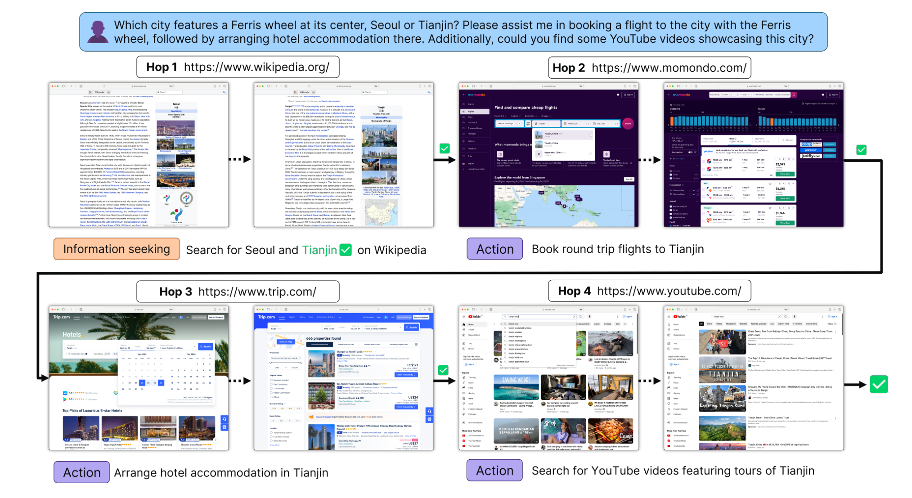
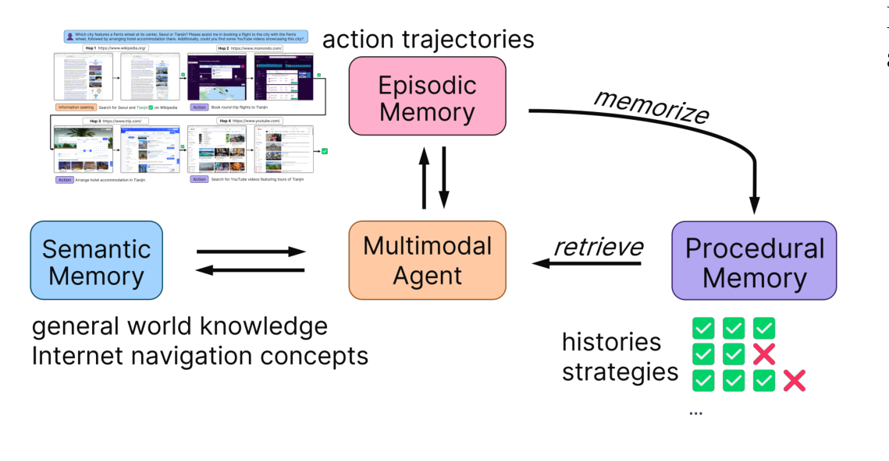

# MMInA: Benchmarking Multihop Multimodal Internet Agents

**Analysis of arXiv:2404.09992**

| Field | Value |
|-------|-------|
| Authors | Shulin Tian, Ziniu Zhang, Liangyu Chen, Ziwei Liu (NTU S-Lab) |
| Published | April 2024 |
| GitHub | [github.com/shulin16/MMInA](https://github.com/shulin16/MMInA) |

---

## 1. Overview

MMInA는 **멀티홉(multihop) 멀티모달 인터넷 에이전트**를 평가하기 위한 벤치마크이다. 기존 웹 에이전트 벤치마크들이 단일 웹사이트 내 단순 태스크에 집중했던 것과 달리, MMInA는 **14개 실제 웹사이트**를 넘나드는 **1,050개의 복합 태스크**를 제공한다. 각 태스크는 평균 2.85개의 hop과 12.9개의 액션을 요구하며, 최대 10개 hop까지 확장된다.

핵심 발견은 **현재 최고 수준의 AI 에이전트(GPT-4V 21.8%)와 인간(96.3%) 사이의 거대한 성능 격차**다. 특히 멀티홉 태스크에서 에이전트들은 "초기 hop에서 더 많이 실패"하는 패턴을 보이며, 이는 hop 수가 많을수록 첫 번째 hop 성공률마저 급격히 하락함을 의미한다. 이를 해결하기 위해 저자들은 과거 액션 궤적을 활용하는 **메모리 증강 기법**을 제안하여 단일홉과 멀티홉 모두에서 성능 향상을 달성했다.

Source: [Abstract](2404.09992.md#abstract), [Section 1](2404.09992.md#1-introduction)

---

## 2. Core Section

### TL;DR

**한 문장**: 14개 실제 웹사이트에서 멀티홉 태스크를 수행하는 에이전트 평가 벤치마크 + 메모리 증강 해결책.

**핵심 수치**:
- 1,050 tasks, 2,989 hops, 14 websites
- Human 96.3% vs GPT-4V 21.8%
- Early hop failure: 6-hop 태스크에서 1st hop SR 16.67% (GPT-4V)

[Extended TL;DR with sources](2404.09992-details/tldr.md)

---

### Core Contributions

| # | Contribution | Type | Novelty |
|---|--------------|------|---------|
| 1 | MMInA Benchmark | Dataset | 최초의 대규모 멀티홉 멀티모달 웹 벤치마크 |
| 2 | Holistic Evaluation Protocol | Metric | Hop-level + Task-level 이중 평가 |
| 3 | Memory-Augmented Agent | Method | Procedural memory로 성능 향상 |

[Contributions Deep Analysis](2404.09992-details/contributions.md)

---

### Key vs Non-Key Sections

**필수 읽기 (P0)**:
- Abstract + Figure 1: 벤치마크 구조 한눈에 파악
- Table 2: 모든 모델 성능 비교
- Section 4.3: 왜 멀티홉이 어려운가?

**권장 읽기 (P1)**:
- Section 4.4: 메모리 증강 해결책
- Table 3: Early hop failure 상세 분석

**선택 읽기 (P2-P3)**:
- Section 3: 벤치마크 구성 상세
- Appendix C: 확장 관련 연구

[Section Reading Priority Guide](2404.09992-details/key-sections.md)

---

## 3. Paper Type

**Primary**: Benchmark Paper

**Classification Breakdown**:
- 70% Benchmark/Dataset
- 20% Empirical Analysis
- 10% Method (Memory Augmentation)

### Key Benchmark Aspects

| Aspect | MMInA | vs WebArena | vs VisualWebArena |
|--------|-------|-------------|-------------------|
| Max Hops | 10 | 2 | 2 |
| Avg Hops | 2.85 | 1.06 | 1.05 |
| Website Type | Evolving real | Static real | Static real |
| # Websites | 14 | 3 | 3 |
| Multimodal Required | All tasks | N/A | Partial |

Source: [Table 1](2404.09992.md#table-1)

---

## 4. Visual Analysis

### Key Figures

#### Figure 1: Task Example
멀티홉 태스크의 구조를 시각화. Wikipedia에서 목적지 정보 획득 -> 항공편 검색 -> 호텔 예약 -> 이벤트 탐색의 순차적 흐름.

#### Figure 4: Memory Systems
세 가지 메모리 시스템 (Semantic, Episodic, Procedural)이 중앙의 Multimodal Agent와 연결된 아키텍처.

---

### Mathematical Formulations

**MDP Definition** [Section 3.1](2404.09992.md#31-environment):
$$\langle S, A, P, R \rangle$$

**LMM Optimization** [Appendix C](2404.09992.md#c-more-related-works):
$$\mathcal{L} = -\sum_{t} \log P(R_t | I, M, R_{<t})$$

---

### Key Tables Interpretation

**Table 2 핵심 인사이트**:
1. 멀티모달 > 텍스트 전용 (GPT-4V 21.77% vs GPT-4 9.34%)
2. Caption 추가가 항상 유리하지 않음 (Gemini-Pro 예외)
3. 5+ hops에서 모든 에이전트 Task SR 거의 0%

**Table 3 핵심 인사이트**:
- 총 hop 수 증가 -> 첫 hop 성공률 감소 (반직관적)
- 2-hop: 56.5% vs 6-hop: 16.67% (GPT-4V 1st hop)

[Methodology Analysis](2404.09992-details/methodology.md)

---

## 5. Critique & Related Works

### Strengths

1. **현실성**: 정적 시뮬레이션이 아닌 실제 동적 웹사이트 사용
2. **복잡성**: 최대 10 hop의 장거리 태스크로 진정한 에이전트 능력 평가
3. **분석적 통찰**: Early hop failure 패턴 발견으로 향후 연구 방향 제시
4. **실용적 해결책**: 모델 불가지론적 메모리 증강 기법 제안

### Limitations

1. **웹 접근 제약**: 일부 사이트 이미지 추출 불가 (offline 사이트 사용)
2. **규모**: 1,050 태스크는 대규모 학습에 부족
3. **메모리 기법 한계**: K=1-2 이상에서 diminishing returns
4. **재현성**: Evolving website로 인한 시간에 따른 결과 변동 가능

### 2026 Perspective

1. **여전히 유효한 격차**: 2026년 기준으로도 74%p 성능 차이는 웹 에이전트 연구의 핵심 과제
2. **Agentic AI 평가 표준**: 멀티스텝 추론 벤치마크의 중요성 증가
3. **메모리 메커니즘 진화**: RAG, long-context LLM 등 후속 연구 방향 제시

### Related Works

**직접 비교 벤치마크**:
- [WebArena](https://arxiv.org/abs/2307.13854): 정적 웹 환경의 표준
- [VisualWebArena](https://arxiv.org/abs/2401.13649): 시각 정보 추가
- [Mind2Web](https://arxiv.org/abs/2306.06070): Generalist web agent

**관련 에이전트 연구**:
- [WebVoyager](https://arxiv.org/abs/2401.13919): 동적 웹 에이전트
- [SeeAct](https://arxiv.org/abs/2401.01614): GPT-4V 기반 웹 에이전트
- [CogAgent](https://arxiv.org/abs/2312.08914): GUI 에이전트

Source: [Section 2](2404.09992.md#2-related-works), [Appendix C](2404.09992.md#c-more-related-works)

---

## Navigation

| Document | Description |
|----------|-------------|
| [Original Paper](2404.09992.md) | 원본 논문 |
| [TL;DR](2404.09992-details/tldr.md) | 확장 요약 |
| [Contributions](2404.09992-details/contributions.md) | 기여 심층 분석 |
| [Key Sections](2404.09992-details/key-sections.md) | 섹션별 읽기 가이드 |
| [Methodology](2404.09992-details/methodology.md) | 방법론 상세 분석 |

---

*Analysis generated: 2026-01-09*
