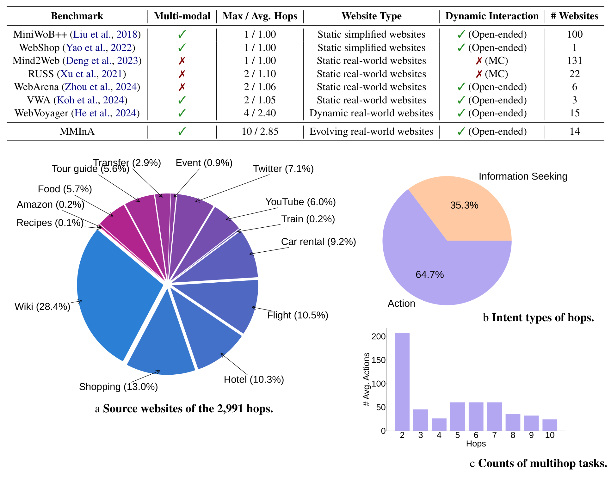
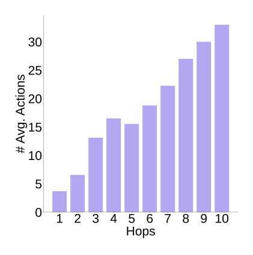
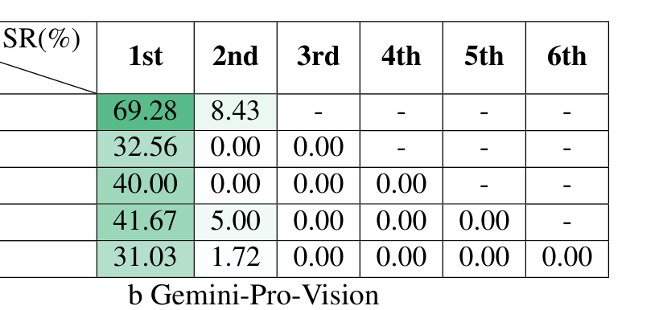

## MMInA: Benchmarking Multihop Multimodal Internet Agents

## 저자

**Shulin Tian**[^1] **Ziniu Zhang**[^1] **Liangyu Chen**[^1][^2] **Ziwei Liu**[^3]

S-Lab, Nanyang Technological University
{shulin002, lchen025, ziwei.liu}@ntu.edu.sg, michaelzhangziniu@gmail.com

[^1]: 동등 기여.
[^2]: 프로젝트 리더.
[^3]: 교신 저자.

---

## 초록

자율 embodied agent는 멀티미디어 웹사이트로 이루어진 인터넷 환경에서 활동한다. 이러한 agent가 multimodal 웹사이트를 넘나들며 복잡한 사용자 작업을 완료할 수 있을까? 기존 benchmark는 웹사이트 간 embodiment를 위한 현실적이고 진화하는 환경에서 agent를 평가하는 데 실패했다. 이 질문에 답하기 위해, 우리는 compositional Internet 작업을 위한 embodied agent를 평가하는 multihop 및 multimodal benchmark인 MMInA를 제시한다. 이 benchmark는 다음과 같은 매력적인 특성을 가진다: 1) 진화하는 실제 multimodal 웹사이트. 우리 benchmark는 진화하는 실제 웹사이트에서 독특하게 작동하여, 자연스러운 사용자 작업에 대한 높은 수준의 현실성과 적용 가능성을 보장한다. 데이터는 쇼핑 및 여행과 같은 다양한 도메인을 다루는 1,050개의 사람이 작성한 작업을 포함하며, 각 작업은 agent가 웹 페이지에서 multimodal 정보를 observation으로 자율적으로 추출하도록 요구한다; 2) Multihop web browsing. 우리 데이터셋은 web 작업에서 long-range reasoning 능력을 평가하기 위해 해결하려면 여러 웹사이트의 정보나 action이 필요한 자연스럽게 compositional한 작업을 특징으로 한다; 3) Holistic evaluation. 우리는 multihop 작업 완료에서 agent의 진행 상황을 평가하기 위한 새로운 protocol을 제안한다. 우리는 standalone (multimodal) language model과 heuristic 기반 web agent 모두를 실험했다. 광범위한 실험은 long-chain multihop web 작업이 인간에게는 쉽지만, 최첨단 web agent에게는 여전히 어렵다는 것을 보여준다. 우리는 agent가 더 많은 hop이 있는 작업을 해결할 때 초기 hop에서 실패할 가능성이 더 높으며, 이로 인해 작업 성공률이 낮아진다는 것을 확인했다. 이 문제를 해결하기 위해, 우리는 과거 action trajectory를 replay하여 반성하는 간단한 memory augmentation 접근 방식을 제안한다. 우리 방법은 single-hop 및 multihop web browsing 능력 모두의 성능을 크게 향상시킨다. 코드와 데이터는 github.com/shulin16/MMInA에서 이용 가능하다.

## 1 서론

다양한 환경에서 자율적으로 행동하며 navigation할 수 있는 embodied agent를 구축하는 것은 인공지능 연구 분야에서 오랫동안 복잡한 과제였다 [[28]](#ref-28); [[53]](#ref-53); [[9]](#ref-9); [[40]](#ref-40). 자동화가 필요한 일반적인 시나리오 중 하나는 디지털 인터페이스와의 상호작용 [[32]](#ref-32); [[42]](#ref-42)이며, 특히 풍부한 인터넷 웹사이트에서 수행되는 action의 자동화에 중점을 둔다 [[39]](#ref-39); [[48]](#ref-48); [[15]](#ref-15). 실제 web 작업은 본질적으로 compositional하며, 여러 웹사이트에 걸친 multihop action을 필요로 한다. 이를 달성하기 위해 agent는 long-range planning과 multimodal reasoning 능력을 모두 갖추어야 한다. 여기에는 사용자 입력에서 high-level 지시를 이해하고, HTML 콘텐츠와 시각적 단서를 활용하여 web browser 환경에서 multihop action을 계획하며, observation을 기반으로 정보에 입각한 예측을 수행하는 것이 포함된다. 기존 benchmark [[22]](#ref-22); [[25]](#ref-25), [[26]](#ref-26); [[52]](#ref-52); [[18]](#ref-18)에 따르면 web agent는 하나의 웹사이트와의 상호작용만 필요로 하는 single-hop 작업에서는 잘 수행하지만, 우리는 대부분의 agent가 multihop web 작업에서 어려움을 겪는다는 것을 관찰했다. 이러한 작업은 사용자가 high-level 작업을 완료하기 위해 여러 웹사이트에서 정보를 수집하거나 action을 수행해야 하는 실제 시나리오에서 널리 발생한다 (표 2). 이러한 격차는 자연스러운 multihop 작업에서 Internet agent의 유용성을 평가하기 위한 multihop web browsing benchmark를 설립하도록 동기를 부여했다.

web agent 연구의 또 다른 격차는 multimodality이다. 기존 benchmark는 오직 텍스트 정보에만 의존하는 autonomous agent 작업을 제시한다 [[52]](#ref-52); [[8]](#ref-8); [[48]](#ref-48). 그러나 실제 시나리오에서는 시각적 정보가 필수적인 역할을 하며 무시될 수 없다. 예를 들어,

*Figure 1: MMInA의 예시 작업. Internet agent의 복잡한 작업 수행 능력을 평가하기 위해, 다양한 웹사이트를 탐색하며 정보를 수집하고 action을 실행하도록 한다. 우리 benchmark는 웹사이트 간 평균 2.85 hop과 완료까지 12.9개의 action이 필요한 1,050개의 다양한 사람이 작성한 multimodal 작업을 포함한다. 가장 긴 compositional 작업은 10 hop이 소요된다.*

'파란색 면 셔츠를 구매해 주세요'라는 작업을 고려해 보자. 여기서 시각 정보에서 파생된 색상 속성은 사용자의 요청을 충족시키는 데 중요해진다. 그러나 현재 web 기반 agent benchmark 중 텍스트와 시각적 입력을 모두 이해하고 상호작용하는 능력을 평가하는 데 중점을 둔 것은 부족하며, 상당수가 주로 텍스트 기반 상호작용과 관련된 작업에 집중하고 있다.

위의 두 가지 문제를 해결하기 위해, 우리는 multihop 및 multimodal Internet 작업 해결을 발전시키기 위해 설계된 새로운 benchmark인 MMInA를 제시한다. MMInA는 실제 진화하는 웹사이트에서 작동하며 (그림 1), 자연스러운 시나리오에 높은 현실성과 적용 가능성을 제공한다 (표 A3). e-commerce 플랫폼 탐색, Wikipedia와 같은 콘텐츠가 풍부한 사이트에서 정보 추출, 웹 소스 간 비교 분석 수행과 같이 사용자가 일반적으로 수행하는 현실적인 작업에 초점을 맞춘다. 우리의 1,050개의 사람이 작성한 작업은 agent가 여러 웹사이트 hop에 걸쳐 multimodal 입력을 처리하고 기존 benchmark에서 발견되는 더 간단한 작업을 능가하는 복잡한 multi-step reasoning을 수행하도록 도전한다.

agent의 reasoning backbone으로 최첨단 model을 사용한 실험은 간단한 텍스트 작업 처리에서 진전이 있었지만, MMInA의 통합적이고 순차적인 작업 특성은 여전히 상당한 도전으로 남아 있음을 보여준다. 예를 들어, GPT-4V [[1]](#ref-1)는 21.8% 성공률을 달성하여 텍스트 baseline보다 개선되었지만 인간 성능(96.3%)에는 미치지 못한다. Agent는 종종 multi-hop 작업 초기에 실패하며 (표 3), 이로 인해 성공률이 낮아진다. 이러한 결과는 실제 web navigation과 의사결정의 복잡성을 강조하며, multimodal 및 multihop reasoning의 추가 발전 필요성을 강조한다. 이 격차를 해소하기 위해, 우리는 과거 action trajectory를 replay하는 memory augmentation 접근 방식을 제안하여 single-hop과 multihop 성능 모두를 크게 개선한다. 이 model-agnostic 기법은 향후 다른 large multimodal model에도 적용될 수 있다.

요약하면, 우리의 기여는 다음과 같다:

- 우리는 14개의 다양하고 진화하는 웹사이트에 걸쳐 1,050개의 multihop multimodal 작업을 특징으로 하는 Internet agent benchmark인 MMInA를 소개한다. 현실적인 특성을 갖춘 multihop 작업은 실제 시나리오와 유사한 더 복잡한 인간과 같은 문제 해결 action을 평가한다. 우리는 benchmark에서 agent의 backbone으로 현재 large language model (LLM)과 large multimodal model (LMM)을 평가한다.
- 우리는 multihop 작업을 위한 holistic evaluation 방법을 제안한다. 종종 낮은 agent 성능과 제한된 통찰력을 산출하는 task success rate 평가의 한계를 기반으로, hop success rate에 기반한 multihop 작업을 위한 새로운 protocol을 제안한다. 이는 더 세분화된 평가를 제공하여 agent 행동과 hop 길이 간의 관계에 대한 더 깊은 통찰력을 제공하고, long-chain reasoning 능력에 대한 더 정보에 입각한 분석을 용이하게 한다.
- 우리는 과거 action history를 활용하여 agent 성능을 향상시키는 경량화되고 적응 가능한 memory-augmented 방법을 제안한다.

## 2 관련 연구

Agent Benchmark와 환경 대부분의 기존 연구는 curated된 텍스트 I/O 인터페이스에서 autonomous agent를 평가하여, 실제 자동화 작업에서의 성능 평가에 격차를 남긴다. [[22]](#ref-22); [[31]](#ref-31); [[25]](#ref-25)와 같은 Tool-use benchmark는 tool-usage 능력으로 agent의 성능을 평가하는 것을 목표로 한다; BOLAA [[26]](#ref-26)는 여러 autonomous agent를 조정하여 집단적 결정을 내리는 또 다른 benchmark이다. OpenAGI [[12]](#ref-12)와 GAIA [[29]](#ref-29)는 여러 modality에 걸친 multi-step 작업을 정의하는 generalist agent를 위해 제작된 multimodal benchmark이다. 그러나 위의 benchmark 중 어느 것도 web browsing 환경에서 LLM이나 LMM의 사용을 탐구하거나 web agent 작업에 특별히 맞춤화된 효과적인 evaluation metric을 제시하지 않았다.

Web Agent Webshop [[47]](#ref-47)은 1.18백만 개의 실제 제품을 특징으로 하는 시뮬레이션된 e-commerce 환경을 구축하고, 12,087개의 crowdsourced 텍스트 지시를 보완했다. Mind2Web [[8]](#ref-8), CogAgent [[15]](#ref-15), SeeAct [[51]](#ref-51)은 generalist web agent를 구축하려 한다; WebVoyager [[14]](#ref-14)는 웹페이지 유형에 따라 interactive element를 자동으로 식별할 수 있다. 최근 WebArena [[52]](#ref-52)는 interactive 환경에서 다중 카테고리 웹사이트의 standalone 세트를 배포했으며, VisualWebArena [[18]](#ref-18)는 WebArena를 기반으로 한 후속 프로젝트로 benchmark 설계에 visual cue에 대한 의존성을 도입했다. 그러나 우리는 기존 benchmark의 작업이 완료에 단일 웹사이트만 필요한 지나치게 단순화되어 있으며, 이는 자연스러운 web browsing 작업과 크게 다르고 원래 long-horizon 설정에서 multihop으로 설계되어야 한다는 것을 발견했다.

## 3 MMInA Benchmark

## 3.1 환경

Zhou et al. [[52]](#ref-52)를 따라, 우리는 web browsing을 partially observable Markov decision process $\langle S, A, P, R \rangle$로 공식화한다. State space $S$는 전체 인터넷 콘텐츠, browser 환경과 agent의 상태이며, 실제로는 표현 가능한 표현을 초과한다. 따라서 우리는 $S$의 partial observation space $\Omega$를 agent에 전달한다. 각 time step $t$에서 agent는 특정 웹 페이지의 특정 state에 도달한다. 연결된 이미지가 있는 screenshot의 accessibility tree와 action/state history가 agent를 위한 partial observation $o_t \in \Omega$를 형성한다. 그런 다음 web agent는 action space $A$에서 샘플링된 action $a_t$를 수행하는데, 이는 웹 페이지에서 실행 가능한 작업이거나 질문에 대한 답변으로서의 텍스트 출력이다 (섹션 3.5). State transition probability matrix $P: S \times A \rightarrow S'$는 인터넷 환경의 world knowledge로 암묵적으로 인코딩되어 있으며, web agent가 추론하거나 학습할 수 있다. 우리의 reward function $R$은 각 hop의 결과로 `PASS` 또는 `FAIL`이라는 language output으로 표현된다. 자연스럽게, 우리는 하나의 hop을 특정 웹사이트에서 완료되는 subtask로 정의한다. 예를 들어, 그림 1의 작업에서 agent는 첫 번째 hop에서 올바른 목적지를 찾으면 `PASS`를 받고, 두 번째 hop에서 원하는 항공편 검색 페이지에 도착하면 또 다른 `PASS`를 받는 식이다.

Action Space 우리는 Koh et al. [[18]](#ref-18)을 따라 잠재적인 agent 실행 action을 12개의 요약된 action 세트로 압축한다. playwright 라이브러리를 활용하여 X graphics server에서 웹 페이지를 시뮬레이션하고, 다양한 action 배열을 사용하여 페이지와 상호작용한다. 이러한 action은 링크 클릭, scroll wheel을 사용한 위아래 스크롤, 키보드 타이핑 등 웹 페이지와의 인간 상호작용을 반영하는 광범위한 행동을 포함한다. hop 수가 많을수록 action 수도 많아진다. 평균적으로 MMInA 작업은 완료에 12.9개의 action이 필요하다.

Observation Space Observation space $\Omega$는 일반적으로 인터넷의 partial observation을 임베딩한다

Table 1: MMInA benchmark와 관련 benchmark 간의 비교. MMInA는 agent가 open-ended action을 생성할 수 있도록 지원하는 유연한 환경을 사용한다. 우리는 multihop multimodal Internet agent를 benchmark하기 위해 14개의 진화하는 실제 웹사이트를 선택했으며, 향후 배포를 위해 쉽게 확장할 수 있다.

| Benchmark                                                                                                                                                                                    | Multi-modal   | Max / Avg. Hops                                                | Website Type                                                                                                                                                                         | Dynamic Interaction                                                                      | # Websites      |
|----------------------------------------------------------------------------------------------------------------------------------------------------------------------------------------------|---------------|----------------------------------------------------------------|--------------------------------------------------------------------------------------------------------------------------------------------------------------------------------------|------------------------------------------------------------------------------------------|-----------------|
| MiniWoB++ [[23]](#ref-23) WebShop [[47]](#ref-47) Mind2Web [[8]](#ref-8) RUSS [[46]](#ref-46) WebArena [[52]](#ref-52) VWA [[18]](#ref-18) WebVoyager [[14]](#ref-14) | ✓ ✗ ✗ ✗       | 1 / 1.00 1 / 1.00 1 / 1.00 2 / 1.10 2 / 1.06 2 / 1.05 4 / 2.40 | Static simplified websites Static simplified websites Static real-world websites Static real-world websites Static real-world websites Static real-world websites Dynamic real-world | ✓ (Open-ended) ✓ (Open-ended) ✗ (MC) ✗ (MC) ✓ (Open-ended) ✓ (Open-ended) ✓ (Open-ended) | 100 1 22 6 3 15 |
|                                                                                                                                                                                              | ✓             |                                                                |                                                                                                                                                                                      |                                                                                          |                 |
|                                                                                                                                                                                              |               |                                                                |                                                                                                                                                                                      |                                                                                          | 131             |
|                                                                                                                                                                                              | ✓             |                                                                |                                                                                                                                                                                      |                                                                                          |                 |
|                                                                                                                                                                                              | ✓             |                                                                | websites                                                                                                                                                                             |                                                                                          |                 |
| MMInA                                                                                                                                                                                        | ✓             | 10 / 2.85                                                      | Evolving real-world websites                                                                                                                                                         | ✓ (Open-ended)                                                                           | 14              |

*Figure 2: MMInA benchmark 통계. Web browsing 작업은 웹사이트 간 하나 이상의 hop으로 구성된다. MMInA는 자연스럽게 compositional한 사용자 작업을 모방하기 위해 다양한 intent와 hop의 도메인을 다룬다. 그림은 다음을 묘사하는 pie chart를 보여준다: (a) 다양한 웹사이트 도메인(Shopping, Wikipedia, Travel 등)에 걸친 hop 분포, (b) 작업 intent 분포(Information seeking, Action 등), (c) 대부분의 작업이 2-4 hop을 필요로 함을 보여주는 hop 수 분포.*

실제 web browsing 경험을 시뮬레이션하기 위해. Observation은 작업 설명과 웹사이트 콘텐츠를 포함한다. 웹 콘텐츠를 합리적인 길이로 표현하기 위해, 우리는 주로 웹 페이지 콘텐츠의 구조화되고 통합된 레이아웃을 제공하는 accessibility tree를 사용한다. accessibility tree의 각 노드는 element ID, element 유형, element의 텍스트 콘텐츠를 가진다. element가 이미지인 경우, 환경은 이미지를 다운로드하고 multimodal agent의 참조용으로 이미지에 element ID를 그린다.

## 3.2 데이터셋 구축

데이터 구조 MMInA는 WebQA 데이터셋의 질문 스타일을 적용하고 GPT-4V를 사용하여 multimodal 콘텐츠가 포함된 유사한 질문(예: '온라인에서 노란 재킷을 사는 것을 도와주세요')을 생성했다. 프롬프트 구조는 다음을 포함한다: 1) Instructions: 작업, accessibility tree, action에 대한 기본 개념; 2) Rules: 'action [stop] 후 아무것도 하지 않음'과 같은 규칙; 3) QA examples: agent가 지시와 위 내용을 이해하도록 돕는 작은 예제; 4) Reference Websites: agent가 방문할 수 있는 모든 잠재적 웹사이트의 universe; 5) Task: 해결해야 할 multihop multimodal 작업. hop은 1에서 10까지 다양하다. 추가로, 우리는 쇼핑, 검색, 예약과 같은 카테고리에 걸쳐 스타일, 범위, 콘텐츠를 다양화하기 위해 수동으로 질문을 작성했다. 요약하면, MMInA 작업은 다양하고 현실적인 도전 세트를 보장하기 위해 14개의 동적 실제 웹사이트에서 2,989개의 hop을 결합한다.

Annotator 및 Annotation Protocol Annotator는 web browsing에 전문적인 인간이며 라벨링의 공정성을 보장하기 위해 연령과 성별이 다양하다. annotator는 먼저 intent와 난이도가 다양한 작업 템플릿을 제안했다. 각 템플릿은 2-10개의 작업을 생성한다. 그런 다음 모든 annotator는 '최소주의' 접근 방식을 따랐는데, annotator는 '전지적 독자'로 활동하여 모든 중요한 웹사이트 노드가 기록된 최단 경로로 작업을 완료했다. 이 annotation protocol은 평가 과정에서 trajectory 다양성을 향상시키며, ground-truth trajectory는 agent의 성공적으로 방문한 trajectory의 부분집합이어야 한다.

성능 Metric 실제 웹사이트를 평가하는 것은 웹 콘텐츠가 자주 변경되는 동적 특성으로 인해 어렵다. 이를 해결하기 위해, 우리는 방문한 URL을 기반으로 multihop 작업을 위한 새로운 evaluation metric을 제안한다. 작업은 모든 필수 웹사이트가 순서대로 방문된 경우에만 성공적으로 완료된 것으로 간주되어, agent의 action과 작업 목표 간의 정렬을 보장한다. 자세한 내용은 섹션 3.5에 나와 있다.

## 3.3 Multimodal 웹 콘텐츠

MMInA에서 우리 작업은 완료에 이미지와 텍스트 데이터가 모두 필요한 multimodality 의존 작업에 초점을 맞춘다. 예를 들어, 'Hi&Yeah Comfy Faux Fur Cute Desk Chair와 Armen Living Diamond Office Chair 중 어느 것이 더 털이 많나요?'라는 작업은 agent가 참조된 웹 페이지에서 지정된 항목을 찾아 비교하고, 이미지와 텍스트 웹 페이지 콘텐츠를 분석하여 답변을 제공하도록 요구한다. MMInA의 접근 방식은 VWA와 대조되는데, 우리 framework의 모든 작업은 여러 턴에서 시각적 및 텍스트 정보 처리를 필요로 한다 (표 A3).

MMInA는 현재 view의 이미지 콘텐츠를 식별하고 다운로드하면서 웹 페이지에서 accessibility tree를 추출하는 자동화된 프로세스를 포함한다. 이를 통해 agent는 accessibility tree와 함께 이미지를 입력으로 사용할 수 있으며, multimodal framework 내에서 실제 작업을 해결하는 데 있어 시각적 및 텍스트 데이터 간의 중요한 상호작용을 강조한다.

## 3.4 Multihop Cross-website Browsing

MMInA 데이터셋은 쇼핑, 티켓 예약, 여행 가이드, 지역 음식 발견과 같은 다양한 도메인을 다루는 14개의 서로 다른 웹사이트에 걸친 multihop 작업을 특징으로 한다 (그림 2). 'multihop 작업'은 여러 웹사이트에 걸친 action을 필요로 하며, agent는 각 hop을 완료한 후 자동으로 다음 사이트로 이동한다

*Figure 3: Multi-hop 작업의 평균 action 수. 막대 차트는 서로 다른 hop 수(1-hop부터 10-hop까지)를 가진 작업을 완료하는 데 필요한 평균 action 수를 보여준다. hop 수가 증가함에 따라 필요한 action 수도 일반적으로 증가하며, 작업 복잡성 차이로 인한 일부 변동이 있다.*

사이트. 이 설정은 multihop web browsing의 복잡성과 실제 관련성을 반영하며, 인간 사용자가 high-level 작업을 처리할 때 일반적으로 수행하는 action 시퀀스를 시뮬레이션한다. 작업 설명에는 사용 가능한 웹사이트 링크가 포함되어 있다 (자세한 내용은 부록 B 참조).

## 3.5 평가

Single-hop 평가 Zhou et al. [[52]](#ref-52)를 따라, 우리는 MMInA 데이터셋 내에서 예측된 action의 의미와 효과를 평가하기 위한 두 가지 평가 방법론을 구현했다. 이러한 방법은 작업의 특성에 따라 엄격하거나 관대한 기준을 제공한다.

첫 번째 방법인 'must\_include'는 keyword 기반 평가 접근 방식을 채택한다. 각 작업에 대해 필수 keyword 세트가 정의된다. agent의 응답은 이 모든 keyword를 포함하면 성공(`PASS`)으로 간주된다. 어떤 keyword라도 누락되면 실패(`FAIL`)가 되어, keyword 포함을 기반으로 한 엄격한 평가를 보장한다. 두 번째 방법인 'fuzzy\_match'는 GPT-3.5-Turbo와 같은 고급 language model의 능력을 활용하여 응답을 평가한다. model에게 'pred 문장이 주어졌을 때, reference를 추론하는 것이 올바른가요? 예 또는 아니오'라고 물어서 agent의 응답과 참조 답변을 비교한다. 여기서 pred는 agent의 응답이고 reference는 참조 답변이다. 평가는 model의 응답에 의해 결정된다: 답이 '예'이면 `PASS`가 기록되고, '아니오'이면 `FAIL`이다. 이 방법은 색상 식별 작업에서 'gold'와 'yellow' 간의 의미적 유사성을 평가하는 것과 같은 언어적 뉘앙스를 수용하는 유연한 평가 framework를 제공한다.

Multihop 평가 multihop 작업 실험(표 2)에서, 우리는 종종 전체 작업에 대해 현저히 낮은 성공률(0이 아니라면)을 관찰한다. 더 세분화된 평가를 제공하기 위해, 우리는 N-hop 문제에 맞춤화된 평가 방법을 제안한다: 평가는 각 hop의 완료 조건을 포함하는 queue를 유지하는 것을 포함한다. 특히, queue의 마지막 element는 항상 전체 multihop 작업이 완료되었음을 나타내는 'END' marker이며, queue의 길이를 N+1로 만든다. agent는 필요한 정보(예: 답변 문자열)를 찾거나 원하는 state(예: 특정 URL)에 도달하면 hop에서 성공한다. 단순화를 위해, 우리 benchmark는 agent가 작업을 순서대로 완료하도록 강제한다. 즉, agent는 현재 hop이 올바르게 완료된 경우에만 다음 hop으로 진행할 수 있다. 작업은 모든 hop이 순서대로 올바르게 완료된 경우에만 완료된다.

우리의 interleaved single-hop 및 multihop 평가 방법은 multihop 작업을 처리하는 agent의 성능을 평가하는 체계적이고 통찰력 있는 접근 방식을 제공하여, 이러한 작업의 복잡성이 제기하는 도전을 해결하는 것을 목표로 한다.

## 4 실험

## 4.1 Baseline

우리는 MMInA benchmark에서 성능을 평가하기 위해 다양한 최첨단 LLM, LMM 및 adapted web-oriented model을 사용했다. 텍스트 기반 model의 경우, 두 가지 설정에서 평가를 수행했다: 1) text-only: 이미지 콘텐츠를 무시하고 웹사이트의 텍스트 정보만 사용. 2) caption-augmented: 텍스트 외에 BLIP-2 [[21]](#ref-21) model을 사용하여 웹사이트 이미지에 대한 caption을 생성하여 시각 정보를 통합. multimodal model의 경우, 웹사이트의 이미지와 텍스트 정보가 모두 제공되었다. 환경, model 파라미터, 버전에 대한 자세한 내용은 섹션 A에 포함되어 있다. 우리는 model을 다음과 같이 분류했다:

## 1) Agent의 Reasoning Backbone으로서의 LLM/LMM

Large language / multimodal model은 prompting을 통해 가능한 다음 단계 action을 예측할 수 있는 agent의 reasoning 과정에서 강력한 backbone 역할을 할 수 있다 (Liu et al., 2023b; Zhou et al., 2024). 텍스트 입력은 웹페이지의 accessibility tree 표현이므로, 텍스트 기반 agent를 4개 그룹으로 분류했다: 1) CodeLLaMA[[36]](#ref-36)와 DeepSeek-R1 [[13]](#ref-13)과 같은 pretrained open-sourced LLM; 2) Fuyu8b [[3]](#ref-3)와 같은 pretrained open-sourced LMM의 text decoder; 3) GPT-4 [[1]](#ref-1)와 GeminiPro [[41]](#ref-41)와 같은 API 기반 LLM. 우리 실험에는 Fuyu-8b [[3]](#ref-3), Gemini-Pro-Vision [[41]](#ref-41), GPT-4V [[1]](#ref-1)와 같은 주요 LMM도 포함되었다.

2) Heuristic 기반 Web Agent 여러 heuristic 기반 web agent는 navigation과 web 기반 작업 완료를 목적으로 특별히 제작되었다 (Yao et al., 2022; Deng et al., 2023; Hong et al., 2024; Zheng et al., 2024). 우리는 web 기반 작업에서 훈련된 model이 MMInA benchmark에서 어떻게 수행하는지 평가하기 위해 WebShop과 CogAgent를 baseline으로 선택했다.

3) Human Baseline 동일한 설정에서 평균 3명의 인간 테스터와 hop 및 작업 성능을 비교했다. 테스터는 다양한 사회경제적 배경에서 왔으며, 평가 전 작업에 대한 정보가 없었다. Human baseline은 모든 기존 web agent를 상당한 margin으로 일관되게 능가한다.

## 4.2 주요 결과

다양한 model에 대한 결과는 표 2에 나와 있으며, hop 성능과 task 성능이 각각 평가된다. hop success rate는 목표 웹사이트에 대한 성공적인 방문 비율을 반영하고, task success rate는 총 작업 수 중 agent가 성공적으로 완료한 작업의 비율을 측정한다.

실험 결과는 현재 최첨단 model이 multihop 작업에서 상당히 저하된 성능을 보인다는 것을 나타낸다. 이 격차는 웹 콘텐츠를 이해하는 데 필수적인 웹 페이지의 구조화된 long-context 정보를 효과적으로 인식하고 처리하는 데 어려움을 겪고 있음을 강조한다. 또한, hop 수가 증가함에 따라 성능이 급격히 떨어져 model의 long-chain reasoning 한계를 드러낸다.

웹사이트에서의 모든 성공적인 작업 완료를 세는 hop success rate는 각 agent의 procedural 성능을 더 정확하게 나타내는 보조 metric 역할을 한다. single-hop 작업에서 DeepSeek-R1-Distill-Qwen-32B가 다른 모든 model을 능가하여 reasoning model이 이미지 및 context 이해와 planning에서 강력한 잠재력을 가지고 있음을 나타낸다. 그러나 hop 수가 2에서 4인 작업의 경우, 예상치 못한 성능을 관찰했다. 구체적으로, caption 없는 Gemini-Pro와 caption 없는 GPT-4가 caption이 augment된 상대 model보다 더 높은 성능을 보였다. agent의 trajectory에 대한 추가 분석은 agent가 비교적 간단한 작업을 할당받으면서 정보가 부족하거나 충분하지 않은 경우, 주어진 hop을 통해 '방황'하는 경향이 있음을 드러냈다. 이는 종종 끝없는 루프로 이어져 작업의 원래 의도에 대한 집중을 잃고 결국 실패하게 된다. 이 현상은 왜 일부 agent가 더 높은 hop success rate를 달성하면서 동시에 낮은 task success rate를 보이는지 설명한다.

Table 2: MMInA Benchmark 결과. 우리는 제안된 MMInA benchmark에서 4가지 유형의 agent를 평가했다: 1) LLM Agent; 2) LMM Agent; 3) Heuristic 기반 Web Agent; 4) Human Baseline. agent의 다양한 능력에 따라, 다양한 입력 유형의 조합이 있다. 다음은 모든 입력 유형의 정의이다: /file\_text\_alt: 입력 지시; /code: 현재 웹페이지의 accessibility tree; /\_490: 현재 view에 있는 이미지의 텍스트 caption; /\_425: 현재 view에 있는 이미지; /backward: agent의 실행 history; /\_582: 원본 웹페이지. hop success rate는 목표 웹사이트에 대한 성공적인 방문의 비율(%)로 정의된다; task success rate는 전체 작업 세트에서 성공한 작업의 전체 비율(%)로 계산된다.

| Input Type   | Agent                        | Inputs               | Hop Success Rate ( ↑ )   | Hop Success Rate ( ↑ )   | Hop Success Rate ( ↑ )   | Hop Success Rate ( ↑ )   | Task Success Rate ( ↑ )   | Task Success Rate ( ↑ )   | Task Success Rate ( ↑ )   | Task Success Rate ( ↑ )   |
|--------------|------------------------------|----------------------|--------------------------|--------------------------|--------------------------|--------------------------|---------------------------|---------------------------|---------------------------|---------------------------|
|              |                              |                      | 1 hop                    | 2-4 hops                 | 5+ hops                  | overall                  | 1 hop                     | 2-4 hops                  | 5+ hops                   | overall                   |
|              | Fuyu-8B                      |                      | 0                        | 0                        | 0                        | 0                        | 0                         | 0                         | 0                         | 0                         |
|              | CodeLLaMA-7B                 |                      | 1.18                     | 0                        | 0                        | 0.29                     | 1.18                      | 0                         | 0                         | 0.58                      |
|              | WebShop                      | /file_text_alt       | 20.67                    | 0                        | 0                        | 4.17                     | 20.67                     | 0                         | 0                         | 10.12                     |
|              | DeepSeek-R1-Distill-Qwen-32B | /code                | 21.61                    | 1.85                     | 1.62                     | 4.74                     | 21.61                     | 0                         | 0                         | 10.46                     |
| Text         | Gemini-Pro                   |                      | 19.09                    | 34.12                    | 2.13                     | 11.85                    | 19.09                     | 0.76                      | 0                         | 9.54                      |
|              | GPT-4                        |                      | 14.37                    | 30.56                    | 5.23                     | 12.26                    | 14.37                     | 9.09                      | 0                         | 9.34                      |
|              | CodeLLaMA-7B                 |                      | 5.71                     | 0                        | 0                        | 1.61                     | 5.71                      | 0                         | 0                         | 2.79                      |
|              | WebShop                      | /file_text_alt       | 29.72                    | 0.00                     | 0.00                     | 5.61                     | 29.72                     | 0                         | 0                         | 14.55                     |
|              | DeepSeek-R1-Distill-Qwen-32B | /code                | 47.68                    | 3.84                     | 4.68                     | 11.11                    | 47.68                     | 0                         | 0                         | 23.07                     |
|              | Gemini-Pro                   | /_490                | 30.12                    | 11.09                    | 0.05                     | 12.38                    | 30.12                     | 1.52                      | 0.38                      | 15.22                     |
|              | GPT-4                        |                      | 38.58                    | 20.70                    | 3.43                     | 13.50                    | 38.58                     | 3.79                      | 0                         | 19.85                     |
|              | CogAgent-9B                  |                      | 6.92                     | 0                        | 0                        | 1.06                     | 6.92                      | 0                         | 0                         | 3.35                      |
|              | GPT-4o                       | /file_text_alt       | 21.90                    | 9.23                     | 0.96                     | 5.94                     | 21.90                     | 3.85                      | 0                         | 11.61                     |
|              | Fuyu-8B                      | /code                | 27.36                    | 0                        | 0                        | 5.52                     | 27.36                     | 0                         | 0                         | 13.39                     |
|              | Gemini-Pro-Vision            | /_425                | 28.94                    | 16.38                    | 4.03                     | 10.66                    | 28.94                     | 1.51                      | 1.13                      | 18.40                     |
| Multimodal   | GPT-4V                       |                      | 42.91                    | 21.23                    | 3.99                     | 13.89                    | 42.91                     | 3.03                      | 0                         | 21.77                     |
|              | GPT-4o                       | /file_text_alt /code | 27.45                    | 17.76                    | 10.13                    | 14.36                    | 27.45                     | 3.32                      | 0                         | 14.04                     |
|              | Gemini-Pro-Vision            | /_425 /backward      | 39.17                    | 23.93                    | 4.78                     | 14.27                    | 39.17                     | 10.61                     | 1.13                      | 20.13                     |
| -            | Human                        | /_582                | 99.02                    | 97.91                    | 93.77                    | 98.43                    | 99.02                     | 95.34                     | 88.12                     | 96.25                     |

이 통찰력은 MMInA를 통한 holistic evaluation protocol의 필요성을 더욱 정당화한다.

실험 결과는 다음을 보여주었다: 1) Multimodality 의존성: Multimodal model은 hop과 task 성능 모두에서 전반적으로 더 높은 성능을 보이며, 제안된 benchmark에서 더 정확한 예측을 한다; 2) Context window 길이: CodeLLaMA와 GPT 시리즈와 같이 구조화된 long-context 처리를 위해 설계된 language model은 구조화된 웹페이지 표현에 의존하는 web 기반 작업에서 뛰어나다. DeepSeek-R1과 같은 reasoning model은 강력한 contextual 이해력으로 인해 single-hop 작업에서 잘 수행한다. 그러나 더 긴 context를 유지해야 하는 multi-hop 작업을 처리할 때, R1은 어려움을 겪고 저하된 성능을 보인다; 3) Web 기반 model: web 기반 콘텐츠에서 훈련된 model(예: Fuyu-8B, WebShop)은 여전히 익숙하지 않은 환경에서 다양성과 적응성을 보여준다.

## 4.3 왜 Multihop Web 작업이 어려운가?

탐색 공간 Agent는 종종 multihop 작업에서 저조한 성능을 보이며, 초기 hop에서 실패하지만, 각 hop을 개별 single-hop 작업으로 처리할 때는 뛰어나다. 우리의 분석은 단일 참조 URL이 있는 single-hop 작업에서 agent가 작업이 완료될 때까지 실패 시 동일한 웹사이트 내에서 반복적으로 action을 시도하는 경향이 있음을 보여준다. 반대로, 프롬프트에 여러 웹사이트가 포함된 multihop 작업에서 예상된 사이트에서 실패한 agent는 지속적으로 재시도하는 대신 종종 대체 사이트로 전환한다. 이 행동은 과도한 탐색과 작업 완료율의 상당한 하락으로 이어진다.

예를 들어, '도쿄행 항공편 예약, 여행 가이드 찾기, YouTube 비디오 시청, 차 렌트, 호텔 예약'과 같은 복잡한 작업에서 agent는 첫 번째 단계에서 실패할 수 있다. 관련 사이트로 올바르게 리디렉션하더라도 제한된 memory는 이전 단계를 기억하지 못하게 하여 진행 없이 반복적인 action으로 이어진다. 더욱이, 각 hop에 대한 종료 조건이 정의되어 있음에도 불구하고 agent는 종종 이를 인식하고 적용하지 못하여, 완료된 hop에 머물러 있다가 결국

Table 3: Hop별 평가. 표 (a)와 (b)는 GPT-4V와 Gemini-Pro-Vision model에 대해 2에서 6까지의 작업 hop 수(H.C.)로 구분된 hop success rate(SR)를 각각 표시한다. 더 높은 성공률은 더 어두운 색상으로 표시된다. 두 agent 모두 더 많은 hop이 있는 작업을 해결할 때 초기 hop에서 실패한다.

|   H.C. |   SR(%) |   1st | 2nd   | 3rd 4th   | 5th   | 6th   |
|--------|---------|-------|-------|-----------|-------|-------|
|      2 |   56.5  | 11    | -     | -         | -     | -     |
|      3 |   22.73 |  4.55 | 0.00  | -         | -     | -     |
|      4 |   12.5  |  0    | 0.00  | 0.00      | -     | -     |
|      5 |   12.28 |  1.75 | 0.00  | 0.00      | 0.00  | -     |
|      6 |   16.67 |  0    | 0.00  | 0.00      | 0.00  | 0.00  |

a GPT-4V

|   H.C. |   1st |   2nd | 3rd   | 4th   | 5th   | 6th   |
|--------|-------|-------|-------|-------|-------|-------|
|      2 | 69.28 |  8.43 | -     | -     | -     | -     |
|      3 | 32.56 |  0    | 0.00  | -     | -     | -     |
|      4 | 40    |  0    | 0.00  | 0.00  | -     | -     |
|      5 | 41.67 |  5    | 0.00  | 0.00  | 0.00  | -     |
|      6 | 31.03 |  1.72 | 0.00  | 0.00  | 0.00  | 0.00  |

b Gemini-Pro-Vision

*Figure 4: Memory-augmented agent. 우리 방법은 유사한 작업에 대한 action trajectory로 procedural memory를 향상시켜 LMM을 보완한다. 다이어그램은 세 가지 memory 시스템을 보여준다: Semantic Memory(일반 world knowledge, Internet navigation 개념), Episodic Memory(action trajectory), Procedural Memory(history, 전략) 모두 중앙의 Multimodal Agent에 연결되어 있다.*

작업에 실패한다.

Agent 입력 길이 multihop 작업의 총 hop 수는 그 길이를 결정한다. 각 hop의 성공은 이전 hop에 의존하지만, 특정 도메인 내에 있는 한 개별 hop의 성공률은 총 hop 수와 독립적이어야 한다. 그러나 모든 작업에서 첫 번째 hop을 의미적으로 정렬한 후, 표 3의 경험적 발견은 위의 가정과 반대되는 예상치 못한 패턴을 나타냈다. 우리는 agent가 총 hop 수가 더 적은 작업에서 더 잘 수행하여 첫 번째 hop을 완료하는 데 더 높은 성공률을 달성한다는 것을 관찰했다. 반대로, 총 hop 수가 증가함에 따라 첫 번째 hop 내에서 성공률이 눈에 띄게 감소했다. 우리는 이 현상을 확대된 탐색 공간과 agent의 약한 zero-shot long-context reasoning 능력에 기인한다고 보며, 이는 섹션 4.4에서 해결한다.

*Figure 5: Memory-augmented agent의 성공률, history 길이별. 차트는 historical 작업 참조 수(K 값)에 따라 agent 성능이 어떻게 변하는지 보여준다. 성능은 일반적으로 K=1 또는 K=2에서 정점에 도달하며, 더 큰 history 크기에서는 수확 체감이 나타난다.*

이러한 발견은 multihop 작업의 복잡성을 강조하는데, 이는 단순히 single-hop 성능의 합이 아니라 복잡한 작업 흐름 관리를 포함한다. 이 복잡성은 web agent가 multihop 작업을 효과적으로 탐색하고 실행하기 위해 고급 planning과 reasoning 기술을 갖추어야 할 필요성을 강조한다.

## 4.4 Memory-augmented Agent

동적 환경의 Agent는 실시간 observation, 사용자 query, 과거 trajectory를 기반으로 결정을 내려야 한다. 우리 실험은 action 예측의 복잡성을 드러내며, 다양한 단계에서 다른 memory 유형이 필요하다. 이는 작업, action, 웹 상호작용 전반에 걸쳐 정보를 유지해야 할 필요성을 강조한다. 우리는 세 가지 핵심 memory 시스템을 갖춘 memory-augmented web agent를 제안한다: semantic, episodic, procedural.

- Semantic memory는 인터넷이나 knowledge base에서 지속적으로 업데이트되는 agent의 일반적인 world knowledge를 저장하며, 일반적으로 large language model의 weight에 인코딩된다.
- Episodic memory는 step-by-step action trajectory를 임시로 보유하여 agent가 진행 중인 작업에 대해 이전 action을 회상할 수 있게 하며, 종종 autoregressive model의 context나 in-context example로 표현된다.
- Procedural memory는 작업 완료 후 활성화되어 미래 작업을 위한 전략을 개선하기 위해 전체 action 시퀀스와 결과를 인코딩한다.

우리 결과는 유사한 작업에 대해 과거 action trajectory를 replay하여 agent 성능을 개선하는 데 있어 procedural memory의 역할을 강조한다 (표 2 참조). 이러한 memory 시스템을 통해 multimodal agent는 관련 정보에 접근하고 적용하여 동적 환경에 대한 더 정교하고 contextually aware한 응답을 가능하게 하여 성능과 적응성을 크게 향상시킬 수 있다.

## 5 결론, 과제, 전망

우리는 세 가지 핵심 특성을 가진 benchmark인 MMInA를 제시한다: 1) 14개의 다양한 웹사이트에 걸쳐 1,050개의 multimodal multihop 작업을 포함하여 실제 웹사이트에서 agent를 benchmark하며, human baseline뿐만 아니라 최첨단 LLM 및 LMM을 사용한 실험을 포함한다; 2) task-level과 hop-level success rate를 모두 평가하는 multihop 작업을 위한 새로운 holistic evaluation 방법을 도입한다; 3) procedural memory를 개선하여 agent 성능을 향상시키는 유연한 memory-augmented 접근 방식을 제안한다.

향후 연구 앞으로 우리는 agent의 작업을 직접 안내할 action에 초점을 맞춘 평가 방법을 사용하는 것을 고려할 것이다.

## 6 한계점

웹 페이지에서 사용하는 보호 메커니즘으로 인해, HTML 파일에서 직접 이미지를 가져올 수 있는 웹사이트를 찾는 것이 매우 어렵다. 따라서 우리가 사용한 웹사이트 중 하나는 offline standalone 웹사이트이고, 다른 하나는 open-source 웹사이트이다.

## 7 윤리적 고려사항

기본 multimodal model의 bias는 부정확하거나 불공정한 결과로 이어질 수 있다. 사용자는 편향된 행동을 피하기 위해 training 데이터의 대표성을 고려해야 한다.

## References

**[1]** Josh Achiam, Steven Adler, Sandhini Agarwal, Lama Ahmad, Ilge Akkaya, Florencia Leoni Aleman, Diogo Almeida, Janko Altenschmidt, Sam Altman, Shyamal Anadkat, et al. 2023. Gpt-4 technical report. [arXiv:2303.08774](https://arxiv.org/abs/2303.08774).

**[2]** Jean-Baptiste Alayrac, Jeff Donahue, Pauline Luc, Antoine Miech, Iain Barr, Yana Hasson, Karel Lenc, Arthur Mensch, Katherine Millican, Malcolm Reynolds, et al. 2022. Flamingo: a visual language model for few-shot learning. *Advances in Neural Information Processing Systems*, 35:23716-23736.

**[3]** Rohan Bavishi, Erich Elsen, Curtis Hawthorne, Maxwell Nye, Augustus Odena, Arushi Somani, and Sagnak Tasirlar. 2023. Introducing our multimodal models.

**[4]** Yingshan Chang, Mridu Narang, Hisami Suzuki, Guihong Cao, Jianfeng Gao, and Yonatan Bisk. 2022. Webqa: Multihop and multimodal qa. In *Proceedings of the IEEE/CVF Conference on Computer Vision and Pattern Recognition*, pages 16495-16504.

**[5]** Kanzhi Cheng, Qiushi Sun, Yougang Chu, Fangzhi Xu, Li YanTao, Jianbing Zhang, and Zhiyong Wu. 2024. Seeclick: Harnessing gui grounding for advanced visual gui agents. In *Proceedings of the 62nd Annual Meeting of the Association for Computational Linguistics (Volume 1: Long Papers)*, pages 9313-9332.

**[6]** Hyung Won Chung, Le Hou, Shayne Longpre, Barret Zoph, Yi Tay, William Fedus, Yunxuan Li, Xuezhi Wang, Mostafa Dehghani, Siddhartha Brahma, et al. 2024. Scaling instruction-finetuned language models. *Journal of Machine Learning Research*, 25(70):1-53.

**[7]** Biplab Deka, Zifeng Huang, and Ranjitha Kumar. 2016. Erica: Interaction mining mobile apps. In *Proceedings of the 29th Annual Symposium on User Interface Software and Technology*, pages 767-776.

**[8]** Xiang Deng, Yu Gu, Boyuan Zheng, Shijie Chen, Sam Stevens, Boshi Wang, Huan Sun, and Yu Su. 2023. Mind2web: Towards a generalist agent for the web. *Advances in Neural Information Processing Systems*, 36:28091-28114.

**[9]** Razvan V Florian. 2003. Autonomous artificial intelligent agents. *Center for Cognitive and Neural Studies (Coneural), Cluj-Napoca, Romania*.

**[10]** Samir Yitzhak Gadre, Gabriel Ilharco, Alex Fang, Jonathan Hayase, Georgios Smyrnis, Thao Nguyen, Ryan Marten, Mitchell Wortsman, Dhruba Ghosh, Jieyu Zhang, et al. 2023. Datacomp: In search of the next generation of multimodal datasets. *Advances in Neural Information Processing Systems*, 36:27092-27112.

**[11]** Tianyu Gao, Zirui Wang, Adithya Bhaskar, and Danqi Chen. 2024. Improving language understanding from screenshots. [arXiv:2402.14073](https://arxiv.org/abs/2402.14073).

**[12]** Yingqiang Ge, Wenyue Hua, Kai Mei, Juntao Tan, Shuyuan Xu, Zelong Li, Yongfeng Zhang, et al. 2023. Openagi: When llm meets domain experts. *Advances in Neural Information Processing Systems*, 36:5539-5568.

**[13]** Daya Guo, Dejian Yang, Haowei Zhang, Junxiao Song, Ruoyu Zhang, Runxin Xu, Qihao Zhu, Shirong Ma, Peiyi Wang, Xiao Bi, et al. 2025. Deepseek-r1: Incentivizing reasoning capability in llms via reinforcement learning. [arXiv:2501.12948](https://arxiv.org/abs/2501.12948).

**[14]** Hongliang He, Wenlin Yao, Kaixin Ma, Wenhao Yu, Yong Dai, Hongming Zhang, Zhenzhong Lan, and Dong Yu. 2024. Webvoyager: Building an end-to-end web agent with large multimodal models. In *Proceedings of the 62nd Annual Meeting of the Association for Computational Linguistics (Volume 1: Long Papers)*, pages 6864-6890.

**[15]** Wenyi Hong, Weihan Wang, Qingsong Lv, Jiazheng Xu, Wenmeng Yu, Junhui Ji, Yan Wang, Zihan Wang, Yuxiao Dong, Ming Ding, et al. 2024. Cogagent: A visual language model for gui agents. In *Proceedings of the IEEE/CVF Conference on Computer Vision and Pattern Recognition*, pages 14281-14290.

**[16]** Raghav Kapoor, Yash Parag Butala, Melisa Russak, Jing Yu Koh, Kiran Kamble, Waseem AlShikh, and Ruslan Salakhutdinov. 2024. Omniact: A dataset and benchmark for enabling multimodal generalist autonomous agents for desktop and web. In *European Conference on Computer Vision*, pages 161-178. Springer.

**[17]** Jihyung Kil, Chan Hee Song, Boyuan Zheng, Xiang Deng, Yu Su, and Wei-Lun Chao. 2024. Dual-view visual contextualization for web navigation. In *Proceedings of the IEEE/CVF Conference on Computer Vision and Pattern Recognition*, pages 14445-14454.

**[18]** Jing Yu Koh, Robert Lo, Lawrence Jang, Vikram Duvvur, Ming Lim, Po-Yu Huang, Graham Neubig, Shuyan Zhou, Russ Salakhutdinov, and Daniel Fried. 2024. Visualwebarena: Evaluating multimodal agents on realistic visual web tasks. In *Proceedings of the 62nd Annual Meeting of the Association for Computational Linguistics (Volume 1: Long Papers)*, pages 881-905.

**[19]** Kenton Lee, Mandar Joshi, Iulia Raluca Turc, Hexiang Hu, Fangyu Liu, Julian Martin Eisenschlos, Urvashi Khandelwal, Peter Shaw, Ming-Wei Chang, and Kristina Toutanova. 2023. Pix2struct: Screenshot parsing as pretraining for visual language understanding. In *International Conference on Machine Learning*, pages 18893-18912. PMLR.

**[20]** Bo Li, Yuanhan Zhang, Liangyu Chen, Jinghao Wang, Fanyi Pu, Joshua Adrian Cahyono, Jingkang Yang, Chunyuan Li, and Ziwei Liu. 2025. Otter: A multi-modal model with in-context instruction tuning. *IEEE Transactions on Pattern Analysis and Machine Intelligence*.

**[21]** Junnan Li, Dongxu Li, Silvio Savarese, and Steven Hoi. 2023a. Blip-2: Bootstrapping language-image pretraining with frozen image encoders and large language models. In *International Conference on Machine Learning*, pages 19730-19742. PMLR.

**[22]** Minghao Li, Yingxiu Zhao, Bowen Yu, Feifan Song, Hangyu Li, Haiyang Yu, Zhoujun Li, Fei Huang, and Yongbin Li. 2023b. Api-bank: A comprehensive benchmark for tool-augmented llms. In *Proceedings of the 2023 Conference on Empirical Methods in Natural Language Processing*, pages 3102-3116.

**[23]** Evan Zheran Liu, Kelvin Guu, Panupong Pasupat, Tianlin Shi, and Percy Liang. 2018. Reinforcement learning on web interfaces using workflow-guided exploration. In *International Conference on Learning Representations (ICLR)*.

**[24]** Haotian Liu, Chunyuan Li, Qingyang Wu, and Yong Jae Lee. 2023a. Visual instruction tuning. *Advances in Neural Information Processing Systems*, 36:34892-34916.

**[25]** Xiao Liu, Hao Yu, Hanchen Zhang, Yifan Xu, Xuanyu Lei, Hanyu Lai, Yu Gu, Hangliang Ding, Kaiwen Men, Kejuan Yang, et al. 2024. Agentbench: Evaluating llms as agents. In *International Conference on Learning Representations (ICLR)*.

**[26]** Zhiwei Liu, Weiran Yao, Jianguo Zhang, Le Xue, Shelby Heinecke, Rithesh Murthy, Yihao Feng, Zeyuan Chen, Juan Carlos Niebles, Devansh Arpit, et al. 2023b. Bolaa: Benchmarking and orchestrating llm-augmented autonomous agents. [arXiv:2308.05960](https://arxiv.org/abs/2308.05960).

**[27]** Xing Han Lu, Zdenek Kasner, and Siva Reddy. 2024. Weblinx: Real-world website navigation with multi-turn dialogue. In *International Conference on Machine Learning*, pages 33007-33056. PMLR.

**[28]** Pattie Maes. 1993. Modeling adaptive autonomous agents. *Artificial Life*, 1(1-2):135-162.

**[29]** Gregoire Mialon, Clementine Fourrier, Craig Swift, Thomas Wolf, Yann LeCun, and Thomas Scialom. 2024. Gaia: A benchmark for general ai assistants. In *International Conference on Learning Representations (ICLR)*.

**[30]** Long Ouyang, Jeffrey Wu, Xu Jiang, Diogo Almeida, Carroll Wainwright, Pamela Mishkin, Chong Zhang, Sandhini Agarwal, Katarina Slama, Alex Ray, et al. 2022. Training language models to follow instructions with human feedback. *Advances in Neural Information Processing Systems*, 35:27730-27744.

**[31]** Shishir G Patil, Tianjun Zhang, Xin Wang, and Joseph E Gonzalez. 2024. Gorilla: Large language model connected with massive apis. *Advances in Neural Information Processing Systems*, 37:126544-126565.

**[32]** Xavier Puig, Kevin Ra, Marko Boben, Jiaman Li, Tingwu Wang, Sanja Fidler, and Antonio Torralba. 2018. Virtualhome: Simulating household activities via programs. In *Proceedings of the IEEE Conference on Computer Vision and Pattern Recognition*, pages 8494-8502.

**[33]** Alec Radford, Jong Wook Kim, Chris Hallacy, Aditya Ramesh, Gabriel Goh, Sandhini Agarwal, Girish Sastry, Amanda Askell, Pamela Mishkin, Jack Clark, et al. 2021. Learning transferable visual models from natural language supervision. In *International Conference on Machine Learning*, pages 8748-8763. PMLR.

**[34]** Aditya Ramesh, Mikhail Pavlov, Gabriel Goh, Scott Gray, Chelsea Voss, Alec Radford, Mark Chen, and Ilya Sutskever. 2021. Zero-shot text-to-image generation. In *International Conference on Learning Representations (ICLR)*.

**[35]** Robin Rombach, Andreas Blattmann, Dominik Lorenz, Patrick Esser, and Bjorn Ommer. 2022. High-resolution image synthesis with latent diffusion models. In *Proceedings of the IEEE/CVF Conference on Computer Vision and Pattern Recognition*, pages 10684-10695.

**[36]** Baptiste Roziere, Jonas Gehring, Fabian Gloeckle, Sten Sootla, Itai Gat, Xiaoqing Ellen Tan, Yossi Adi, Jingyu Liu, Tal Remez, Jeremy Rapin, et al. 2023. Code llama: Open foundation models for code. [arXiv:2308.12950](https://arxiv.org/abs/2308.12950).

**[37]** Phillip Rust, Jonas F Lotz, Emanuele Bugliarello, Elizabeth Salesky, Miryam de Lhoneux, and Desmond Elliott. 2023. Language modelling with pixels. In *International Conference on Learning Representations (ICLR)*.

**[38]** Christoph Schuhmann, Romain Beaumont, Richard Vencu, Cade Gordon, Ross Wightman, Mehdi Cherti, Theo Coombes, Aarush Katta, Clayton Mullis, Mitchell Wortsman, et al. 2022. Laion-5b: An open large-scale dataset for training next generation image-text models. *Advances in Neural Information Processing Systems*, 35:25278-25294.

**[39]** Tianlin Shi, Andrej Karpathy, Linxi Fan, Jonathan Hernandez, and Percy Liang. 2017. World of bits: An open-domain platform for web-based agents. In *International Conference on Machine Learning*, pages 3135-3144. PMLR.

**[40]** Luc Steels and Rodney Brooks. 2018. *The Artificial Life Route to Artificial Intelligence: Building Embodied, Situated Agents*. Routledge.

**[41]** Gemini Team, Rohan Anil, Sebastian Borgeaud, Jean-Baptiste Alayrac, Jiahui Yu, Radu Soricut, Johan Schalkwyk, Andrew M Dai, Anja Hauth, Katie Millican, et al. 2023. Gemini: a family of highly capable multimodal models. [arXiv:2312.11805](https://arxiv.org/abs/2312.11805).

**[42]** Daniel Toyama, Philippe Hamel, Anita Gergely, Gheorghe Comanici, Amelia Glaese, Zafarali Ahmed, Tyler Jackson, Shibl Mourad, and Doina Precup. 2021. Androidenv: A reinforcement learning platform for android. [arXiv:2105.13231](https://arxiv.org/abs/2105.13231).

**[43]** Junyang Wang, Haiyang Xu, Jiabo Ye, Ming Yan, Weizhou Shen, Ji Zhang, Fei Huang, and Jitao Sang. 2024. Mobile-agent: Autonomous multi-modal mobile device agent with visual perception. In *Workshop of International Conference on Learning Representations (ICLR Workshop)*.

**[44]** Jason Wei, Maarten Bosma, Vincent Zhao, Kelvin Guu, Adams Wei Yu, Brian Lester, Nan Du, Andrew M Dai, and Quoc V Le. 2021. Finetuned language models are zero-shot learners. In *International Conference on Learning Representations (ICLR)*.

**[45]** Jian Xie, Kai Zhang, Jiangjie Chen, Tinghui Zhu, Renze Lou, Yuandong Tian, Yanghua Xiao, and Yu Su. 2024. Travelplanner: A benchmark for real-world planning with language agents. In *International Conference on Machine Learning*, pages 54590-54613. PMLR.

**[46]** Nancy Xu, Michael Du, Giovanni Campagna, Larry Heck, James Landay, Monica S Lam, et al. 2021. Grounding open-domain instructions to automate web support tasks. In *2021 Annual Conference of the North American Chapter of the Association for Computational Linguistics*.

**[47]** Shunyu Yao, Howard Chen, John Yang, and Karthik Narasimhan. 2022. Webshop: Towards scalable real-world web interaction with grounded language agents. *Advances in Neural Information Processing Systems*, 35:20744-20757.

**[48]** Shunyu Yao, Jeffrey Zhao, Dian Yu, Nan Du, Izhak Shafran, Karthik Narasimhan, and Yuan Cao. 2023. React: Synergizing reasoning and acting in language models. In *International Conference on Learning Representations (ICLR)*.

**[49]** Chi Zhang, Zhao Yang, Jiaxuan Liu, Yanda Li, Yucheng Han, Xin Chen, Zebiao Huang, Bin Fu, and Gang Yu. 2025. Appagent: Multimodal agents as smartphone users. In *Proceedings of the 2025 CHI Conference on Human Factors in Computing Systems*, pages 1-20.

**[50]** Zijia Zhao, Longteng Guo, Tongtian Yue, Sihan Chen, Shuai Shao, Xinxin Zhu, Zehuan Yuan, and Jing Liu. 2023. Chatbridge: Bridging modalities with large language model as a language catalyst. [arXiv:2305.16103](https://arxiv.org/abs/2305.16103).

**[51]** Boyuan Zheng, Boyu Gou, Jihyung Kil, Huan Sun, and Yu Su. 2024. Gpt-4v(ision) is a generalist web agent, if grounded. In *International Conference on Machine Learning*, pages 61349-61385. PMLR.

**[52]** Shuyan Zhou, Frank F Xu, Hao Zhu, Xuhui Zhou, Robert Lo, Abishek Sridhar, Xianyi Cheng, Tianyue Ou, Yonatan Bisk, Daniel Fried, et al. 2024. Webarena: A realistic web environment for building autonomous agents. In *International Conference on Learning Representations (ICLR)*.

**[53]** Tom Ziemke. 1998. Adaptive behavior in autonomous agents. *Presence*, 7(6):564-587.

## A 실험 세부사항

## A.1 환경 및 파라미터 설정

우리는 [[52]](#ref-52)의 display 설정을 따라 1280 × 2048 viewport를 사용하고, 웹페이지 accessibility tree를 model에 텍스트 입력으로 제공했다. open-source pretrained model이나 API 기반 model에서 기본 파라미터를 사용했다. 정적 환경을 위해 설계되고 특별히 구조화된 query로 훈련된 web-trained agent WebShop의 경우, 내장 환경에서 일반적으로 소싱되는 query 대신 포맷된 query를 생성하기 위해 GPT-3.5-turbo model을 사용했다. API 기반 model 버전의 경우, 논문의 GPT-4 model은 gpt-4-0125-preview를 지칭한다; GPT-4o model은 gpt-4o-2024-11-20을 지칭한다; GPT-4V model은 gpt-4-vision-preview를 지칭한다; Gemini-Pro model은 gemini-1.0-pro-001을 지칭한다; Gemini-Pro-Vision은 gemini-1.0-pro-vision-001을 지칭한다.

## A.2 컴퓨팅 리소스

로컬에서 inference 코드를 실행하는 pretrained baseline model(대부분 7b/8b/9b 파라미터)을 위해 48 GB 메모리의 Nvidia RTX6000 Ada GPU 1개를 사용했다. MMInA에서 각 epoch의 inference는 model inference 성능과 forward 횟수에 따라 4-8시간이 소요된다.

## A.3 보충 결과

Hop 분석 본 논문의 이전 hop 분석 설정을 따라, 표 A1에서 GPT-4V agent의 agent 성능을 설명한다. 우리는 다시 agent가 총 hop 수가 더 적은 작업에서 더 잘 수행하여 첫 번째 hop을 완료하는 데 더 높은 성공률을 달성한다는 것을 관찰했다. 반대로, 총 hop 수가 증가함에 따라 첫 번째 hop 내에서 성공률이 눈에 띄게 감소했다. long-range (>7 hop) 작업이 적기 때문에, 무작위성으로 인해 성공률이 변동한다.

Agent memory의 Ablation 우리는 마지막 K개 작업의 action trajectory(작업 설명과 웹 콘텐츠 observation으로 구성)를 프롬프트에 추가하여 memory로 LMM을 향상시킨다. replay된 경험을 통합하는 이 접근 방식은 agent의 탐색 공간을 좁히는 데 도움이 되어 reasoning을 grounding한다. 그러나 이 기법은 입력 길이를 K배로 늘려, 더 짧은 입력에 익숙한 LMM에게 도전을 제시한다. 균형을 찾기 위해, 그림에서 설명된 바와 같이 일반적으로 $K=2$인 procedural memory를 구성하기 위한 최적의 K 값을 결정했다. 테스트 결과 procedural memory가 향상된 agent가 action 예측과 실행에서 더 나은 성능을 보였다. 그러나 historical reference 수와 성능 간에 비선형적 관계를 관찰했다. 쇼핑이나 Wikipedia와 같은 도메인의 더 간단한 작업에서는 더 작은 historical 세트(구체적으로 $K=1$ 또는 $K=2$)가 더 나은 결과를 산출하는 경향이 있었고, 더 큰 history는 수확 체감을 제공하고 의사결정 과정에 bias와 교란을 도입했다. 이 실험은 Gemini-Pro-Vision을 사용하여 수행되었지만, 우리 방법은 model-agnostic하게 설계되어 모든 LMM이나 LLM에 적용할 수 있다.

## B MMInA Benchmark 세부사항

## B.1 데이터셋

## B.1.1 Annotator

MMInA는 세 명의 인간 annotator가 처음부터 구축했다. 연령과 성별은 다양하지만 web browsing에 능숙한 그들에게 사전 annotated된 예제가 제공되었고 일관된 가이드라인을 따랐다. 각자 데이터셋의 다른 부분에 라벨을 달았고, 작업 다양성과 답변 정확성을 위해 교차 검증이 수행되었다. 모든 annotator는 공식 계약에 서명하고 annotation 훈련을 받았다.

## B.1.2 Annotation Protocol

최종 trajectory는 모든 필요한 웹사이트 노드를 포함한다. 그러나 agent는 작업을 완료하기 전에 불필요한 웹사이트를 자유롭게 탐색하고 방문할 수 있다.

## B.1.3 데이터 통계

그림 3에 표시된 hop 수에서, hop 수가 증가함에 따라 agent가 필요로 하는 action 수도 증가한다는 것을 관찰한다. 그러나 5-hop 데이터에 필요한 평균 action 수가 4-hop 데이터보다 낮다는 점에 주목할 가치가 있다. 우리 데이터셋에서 4-hop 콘텐츠는 '톈진과 청두 중 도시 중심에 관람차가 있는 곳은 어디인가요?'와 같은 비교 작업을 포함한다. multi-hop 작업에 대한 우리의 정의가 다른 웹 페이지 간의 navigation을 포함하므로, 이러한 비교 질문을 5-hop 작업으로 분류하지 않는다.

대부분의 multitasking은 여행을 중심으로 한다. 먼저 여행 목적지를 결정해야 한다. 우리는 agent가 Wikipedia에서 정보를 검색하고 질문에 답하여 여행 목적지를 결정하도록 한다.

Table A1: 2에서 10까지의 hop 수를 기반으로 한 multihop 작업에서 GPT-4V의 성능. success rate(sr)는 전체 완료된 hop 수에 대한 single-hop 평가 결과를 기반으로 계산된다.

| GPT4V   |   count |   sr1 |   sr2 | sr3   | sr4   | sr5   | sr6   | sr7   | sr8   | sr9   | sr10   |
|---------|---------|-------|-------|-------|-------|-------|-------|-------|-------|-------|--------|
| 2-h     |     200 | 56.5  | 11    |       |       |       |       |       |       |       |        |
| 3-h     |      44 | 22.73 |  4.55 | 0.00  |       |       |       |       |       |       |        |
| 4-h     |      16 | 12.5  |  0    | 0.00  | 0.00  |       |       |       |       |       |        |
| 5-h     |      57 | 12.28 |  1.75 | 0.00  | 0.00  | 0.00  |       |       |       |       |        |
| 6-h     |      60 | 16.67 |  0    | 0.00  | 0.00  | 0.00  | 0.00  |       |       |       |        |
| 7-h     |      59 | 25.42 |  0    | 0.00  | 0.00  | 0.00  | 0.00  | 0.00  |       |       |        |
| 8-h     |      35 | 40    |  0    | 0.00  | 0.00  | 0.00  | 0.00  | 0.00  | 0.00  |       |        |
| 9-h     |      30 | 56.67 | 20    | 3.33  | 0.00  | 0.00  | 0.00  | 0.00  | 0.00  | 0.00  |        |
| 10-h    |      19 | 52.63 |  0    | 0.00  | 0.00  | 0.00  | 0.00  | 0.00  | 0.00  | 0.00  | 0.00   |

여행 관련 작업 세트에는 항공편 예약, 호텔 예약, 환전 등이 포함된다. 그런 다음 작업 세트에서 일부 작업을 무작위로 선택하여 완전하고 매끄러운 작업으로 결합한다. 각 작업의 JSON 파일에는 목적지 공항의 세 글자 코드인 'flight'와 같은 keyword가 포함되어 있다. 이러한 keyword의 이유는 특정 작업의 경우 일부 sub-task를 통일된 기준으로 측정할 수 없으므로, 특정 작업의 endpoint를 판단하기 위해 이러한 keyword를 추가하기 때문이다. 요리와 관련된 또 다른 유형의 작업에는 Amazon에서 음식 구매와 레시피 검색이 포함된다. 각 작업은 실생활과 가깝고 작업에 실제적이고 동적인 웹 페이지를 사용한다. 총 1050개의 작업이 있으며 각 작업은 QA 쌍과 기타 지원 자료를 포함한다. 108개의 QA 쌍은 WebQA [[4]](#ref-4)에서 필터링되었다. 데이터셋에 대한 통계적 세부사항은 그림 2에 나와 있다.

## B.2 작업

## B.2.1 웹사이트 링크

표 A2는 MMInA에 정의된 각 웹사이트의 링크를 보여준다.

## B.2.2 다른 benchmark와의 비교

우리 benchmark와 VWA benchmark의 비교는 A3에 나와 있다.

## C 추가 관련 연구

문헌 검토는 multimodal autonomous web agent 개발과 관련된 연구의 중요한 측면에 각각 초점을 맞춘 여러 핵심 섹션으로 나뉜다. 이 종합적인 개요는 multimodal 데이터셋, backbone으로서의 large language/multimodal model, embodied agent와 web agent를 포함한 다양한 유형의 autonomous agent를 탐구한다. 목표는 이러한 분야에서 연구의 현재 상태에 대한 철저한 이해를 제공하고 격차를 식별하며 향후 연구에 대한 통찰력을 제공하는 것이다.

Multimodal 데이터셋 CLIP[[33]](#ref-33), DALL-E[[34]](#ref-34), Stable Diffusion[[35]](#ref-35), Flamingo[[2]](#ref-2), GPT 시리즈와 같은 model이 보여주는 multimodal learning의 최근 진전은 zero-shot classification, 이미지 생성, in-context learning과 같은 분야에서 상당한 개선으로 이어졌다. 이러한 model은 contrastive learning, diffusion 기법, auto-regressive model을 포함한 다양한 알고리즘적 접근 방식을 사용하지만, image-text 쌍으로 구성된 대규모 데이터셋에 대한 근본적인 의존성을 공유한다. 이 공통점은 multimodal AI 능력의 발전을 이끄는 데 있어 이러한 데이터셋의 중요성을 강조한다.

Webdataset*는 웹사이트에서 스크랩한 수천 개의 image-text 쌍 데이터를 포함하므로 일반적으로 사용되는 데이터셋이다; LAION-5B[[38]](#ref-38)는 58.5억 개의 CLIP 필터링된 image-text 쌍을 포함하는 데이터셋으로, 23.2억 개가 영어를 포함한다; MIMIC-IT[[20]](#ref-20)는 풍부한 in-context 정보가 장착된 280만 개의 multimodal instruction-response 쌍으로 구성된 데이터셋으로, 이미지와 비디오에서 파생된 220만 개의 고유한 instruction이 있다; DataComp[[10]](#ref-10)는 새로 도입된 데이터셋으로 네 단계로 구성된다: A) 리소스 제한 내에서 맞는 규모를 결정. B) filtering 접근 방식이나 Bring Your Own Data (BYOD) 트랙 중 하나를 선택하여 데이터셋 생성. C) 생성된 데이터셋에서 설정된 아키텍처와 특정 hyperparameter를 사용하여 CLIP model 훈련. D) 다양한 downstream 작업에서 훈련된 model의 성능 평가.

* https://github.com/webdataset/webdataset

Table A2: MMInA 웹사이트 링크. Shopping을 제외하고 모두 시간이 지남에 따라 콘텐츠가 업데이트되는 진화하는 실제 웹사이트이다. 우리의 유연한 evaluation protocol은 향후 더 많은 웹사이트를 지원하는 것을 용이하게 한다.

| Description      | URL                                                                                                  |
|------------------|------------------------------------------------------------------------------------------------------|
| Wikipedia 1      | https://library.kiwix.org/viewer#wikipedia_en_all_ maxi_2024-01/A/User%3AThe_other_Kiwix_guy/Landing |
| Car renting      | https://www.trip.com/carhire/                                                                        |
| Flight booking   | https://www.momondo.com/                                                                             |
| Hotel booking    | https://www.trip.com/hotels/                                                                         |
| Event searching  | https://www.eventbrite.com/                                                                          |
| Twitter          | https://twitter.com/home                                                                             |
| Amazon           | https://www.amazon.com/                                                                              |
| YouTube          | https://www.youtube.com/                                                                             |
| Find food        | https://www.timeout.com/                                                                             |
| Exchange dollars | https://www.xe.com/                                                                                  |
| Travel guide     | https://www.nomadicmatt.com                                                                          |
| Recipes          | https://www.allrecipes.com/                                                                          |
| Train booking    | https://www.trip.com/trains/                                                                         |
| Shopping         | OneStopMarket (an offline standalone website)                                                        |

| Websites   | Task   |
|------------|--------|
| VWA        |        |

*Table A3: VWA [[18]](#ref-18)와 MMInA 간의 비교. MMInA는 작업을 완료하기 위해 여러 단계에서 multimodal 입력을 필요로 하여, 더 도전적인 multimodal benchmark가 된다. (비교 차트는 리소스에서 사용할 수 없음)*

## Backbone으로서의 Large Language/Multimodal Model

Instruction tuning은 LLM 훈련에서 일반적으로 사용되는 방법으로, instruction 형식의 데이터셋을 사용하여 pretrained LLM을 refine하는 것을 포함한다. 이 접근 방식은 단순히 지시를 따르는 것만으로 새로운 unseen 작업을 수행하는 model의 능력을 향상시켜 zero-shot 능력을 개선한다. ChatGPT[[1]](#ref-1), InstructGPT[[30]](#ref-30), FLAN[[44]](#ref-44); [[6]](#ref-6)과 같은 주목할 만한 model은 instruction tuning 방법 위에 구축되었다.

LLM의 성공을 계승하여, LMM 훈련도 다음을 포함하는 multimodal instruction 데이터를 활용하여 instruction-tuning 방법으로 확장되었다: 작업을 설명하는 텍스트 `<instruction>`; multimodality를 가능하게 하는 입력으로서의 `<image>`, `<text>` 쌍; 출력의 끝을 식별하는 `<output><EOS>` 토큰이 있는 model 출력. multimodal instruction 샘플은 triplet 형태로 표시될 수 있다, 즉 I, M, R, 여기서 I, M, R은 각각 instruction, multimodal 입력, ground truth 응답을 나타낸다. LMM은 instruction과 multimodal 입력이 주어지면 답변을 예측한다:

최적화 목표는 다음과 같이 공식화될 수 있다:

$$\mathcal{L} = -\sum_{t} \log P(R_t | I, M, R_{<t})$$

1) Transformation LMM 훈련에서 instruction tuning의 효능은 현재 Visual Question Answering (VQA) 데이터셋에서 사용 가능한 데이터의 길이와 유형의 제한에 의해 상당히 제약된다. 이를 해결하기 위해, 일부 연구자는 제공된 instruction을 적용하여 간결한 답변 데이터를 의미론적 세부사항이 풍부한 확장된 문장으로 변환하기로 선택했다 [[50]](#ref-50). 다른 연구에서는 고급 language model의 능력을 모방하기 위해 ChatGPT를 prompting하여 답변을 재구성했다.

2) Self-Instruct LLaVA [[24]](#ref-24)는 이미지를 설명적 텍스트와 bounding box의 outline으로 변환한 다음, 초기 예제가 제공하는 context 내에서 GPT-4를 사용하여 추가 데이터를 생성함으로써 multimodal 접근 방식을 확장한다.

가상 세계의 Autonomous Agent Graphical User Interface (GUI)용으로 설계된 agent는 스마트폰과 데스크톱과 같은 디지털 기기에서 복잡한 활동을 간소화하기 위해 제작되었다. 이러한 GUI agent는 HTML을 입력으로 사용하거나 screenshot을 사용하여 더 넓은 context에서 작업 실행을 용이하게 할 수 있다. 전통적으로 연구는 이러한 agent를 제한적이고 정적인 환경에서 훈련시키는 것을 중심으로 진행되었는데, 이는 인간 학습에서 벗어나 agent가 인간과 유사한 결정을 내리는 능력을 방해하는 관행이다. 그러나 방대한 웹 지식을 갖춘 large language model (LLM)과 large multimodal model (LMM)의 등장은 agent에서 더 인간과 같은 지능을 달성하기 위한 중대한 전환을 표시하며, LLM/LMM으로 향상된 autonomous agent에 대한 연구의 급증을 촉발시켰다. 이 섹션은 web GUI agent와 mobile GUI agent를 모두 검토하여 autonomous agent의 최신 state-of-the-art (SOTA) 개발을 탐구하는 것을 목표로 한다.

1) GUI Agent - Web Agent 본 논문에서 논의된 web agent의 현재 진전에도 불구하고, 여러 연구가 web agent 개발을 탐구했다. TravelPlanner [[45]](#ref-45)는 거의 400만 개의 데이터 레코드에 접근하기 위한 도구가 있는 sandbox 환경을 제공하는 benchmark를 제안한다. 도구를 사용하여 language agent의 planning 전략을 평가하기 위한 1,225개의 planning intent와 reference plan을 포함한다; OmniACT [[16]](#ref-16)는 컴퓨터 작업을 위한 실행 가능한 프로그램을 생성하는 agent의 능력을 평가하기 위한 데이터셋과 benchmark를 제시한다. PyAutoGUI Python 라이브러리를 사용하여 다양한 운영 체제와 웹 도메인에서 마우스와 키보드 작업을 자동화한다. visual cue가 중요한 multimodal 도전을 제공하여 HTML 기반 agent의 한계를 해결하므로 UI element에 대한 더 강력한 이해를 가능하게 하지만, 여전히 native desktop application이나 multi-application 작업을 처리할 수 없다; WEBLINX [[27]](#ref-27)도 대화형 web navigation을 위한 benchmark를 제안하여, 디지털 agent가 web browser를 제어하고 multi-turn dialogue 방식으로 사용자 지시를 따르는 문제를 다룬다. 방법은 관련 element를 순위 매겨 HTML 페이지를 prune하는 retrieval에서 영감을 받은 model을 포함하여, 실시간으로 전체 웹 페이지를 처리할 수 없는 LLM의 문제를 해결한다. 사용된 기술에는 element 선택을 위한 dense markup ranker와 screenshot, action history, 텍스트 웹사이트 표현을 결합하는 multimodal model이 포함된다. 성능은 Google Calendar에서 작업 생성과 같은 작업에서 평가되며, 웹을 탐색할 때 인간 행동을 복제하는 model의 능력을 평가한다; DUAL-VCR [[17]](#ref-17)은 웹페이지 screenshot에서 HTML element의 'dual view'를 활용하여 각 element를 visual 이웃과 함께 contextualize한다. 이 접근 방식은 의사결정을 위한 더 정보적인 표현을 만들기 위해 텍스트와 visual feature를 모두 사용한다.

2) GUI Agent - Mobile Agent web agent 외에도 mobile GUI agent는 점점 더 인기를 얻고 있으며, 스마트폰과 같은 디지털 기기에서 복잡한 작업을 자동으로 처리하기 위해 개발되었다. ERICA [[7]](#ref-7)는 Android application에서 interaction mining을 위한 시스템을 정의한다. human-computer interaction 접근 방식을 사용하여 데이터를 캡처하므로 확장 가능하고 광범위한 상호작용을 캡처할 수 있다. PIXEL [[37]](#ref-37)과 Pix2Struct [[19]](#ref-19)는 각각 multilingual transfer와 UI navigation에서 유망한 능력을 보여주지만, BERT와 같은 text-only LM에 비해 language understanding 작업에서 어려움을 겪어 유틸리티를 제한한다. [[11]](#ref-11)에서 제안된 Patch-and-Text Prediction (PTP)은 screenshot 내의 image patch와 텍스트를 모두 masking하고 복구하여 더 나은 language understanding 능력으로 이어진다; AppAgent [[49]](#ref-49)는 tapping과 swiping과 같은 low-level action을 통해 스마트폰 앱을 작동하는 multimodal agent를 제시하여 인간 상호작용을 모방한다. agent는 자율적으로 또는 인간 demonstration을 관찰하여 탐색을 통해 앱 기능을 학습한 다음 이 지식을 적용하여 작업을 실행한다; MobileAgent [[43]](#ref-43)는 screenshot을 사용하여 모바일 기기에서 작업을 찾기 위해 visual perception 도구를 사용한다. visual 및 텍스트 element를 식별하기 위한 OCR model을 포함하면서 모바일 앱을 자율적으로 탐색하기 위한 self-planning과 self-reflection을 실현하며, 성능 평가를 위해 Mobile-Eval이라는 benchmark가 도입되었다; SeeClick [[5]](#ref-5)는 구조화된 텍스트의 필요성을 우회하여 screenshot에서만 작동하는 visual GUI agent이다. 지시에 따라 화면 element를 정확하게 찾기 위해 GUI grounding pre-training으로 향상된 Large Vision-Language Model (LVLM)을 사용한다. 방법은 GUI grounding 데이터의 curation을 자동화하고 ScreenSpot이라는 GUI grounding benchmark를 만드는 것을 포함한다. 다양한 GUI 플랫폼에 보편적으로 적응하고 screenshot에 의존한다. action space를 clicking과 typing으로 단순화한다.

## C.1 다른 Benchmark

Shi et al. [[39]](#ref-39)과 Liu et al. (2018)은 agent가 기본 키보드와 마우스 작업을 통해 온라인 작업을 완료할 수 있는 웹사이트 위젯 플랫폼을 설립한다. Gorilla[[31]](#ref-31)가 도입한 APIBench [[22]](#ref-22)는 코드 생성 작업에 대한 agent의 tool utilization 능력을 평가하기 위한 tool-augmented LLM benchmark이다. AgentBench [[25]](#ref-25)는 사용자 query에 답하는 agent의 성능을 평가하기 위해 많은 closed-box 환경을 갖춘 더 일반적인 toolkit을 제공하기 위해 한 걸음 더 나아간다.

Webshop [[47]](#ref-47)은 1.18백만 개의 실제 제품을 특징으로 하는 시뮬레이션된 e-commerce 환경을 구축하고, 12,087개의 crowdsourced 텍스트 지시를 보완했다. action 예측 작업을 choice 기반 imitation learning 프로세스로 변환하여 작업 실행의 정확성과 능력을 용이하게 했다. 그러나 이 접근 방식은 실제 세계에서 open-ended agent action을 평가하는 데 실패했다. 또한 단일 웹사이트 환경의 단조로운 설계로 인해 제한되어 web browsing 작업의 단일 카테고리만 생성했다. Mind2Web [[8]](#ref-8)은 generalist web agent를 구축하려 하며, instruction following 능력으로 web agent를 제작하고 benchmark하기 위한 데이터셋을 만든다. action 예측 문제를 MCQ로 변환하기 위한 two-stage training을 제안했다. SeeAct [[51]](#ref-51)은 렌더링된 웹페이지를 시각적으로 이해하고 더 정확한 action plan을 생성하기 위해 multimodal 정보를 가능하게 한 후속 작업이다. WebVoyager [[14]](#ref-14)는 웹 페이지의 screenshot을 캡처한 다음 JavaScript 도구를 사용하여 웹페이지 element 유형에 따라 interactive element를 자동으로 식별할 수 있다. WebArena [[52]](#ref-52)는 interactive 환경에서 다중 카테고리 웹사이트의 standalone 세트를 배포한다. VisualWebArena [[18]](#ref-18)는 WebArena의 기반 위에 구축된 후속 프로젝트로 benchmark 설계에 visual cue에 대한 의존성을 도입했다. 기존 benchmark의 작업은 완료에 단일 웹사이트가 필요한 지나치게 단순화되어 있으며, 이는 자연스러운 web browsing 작업과 크게 다르고 원래 long-horizon 설정에서 multihop으로 설계되어야 한다.
