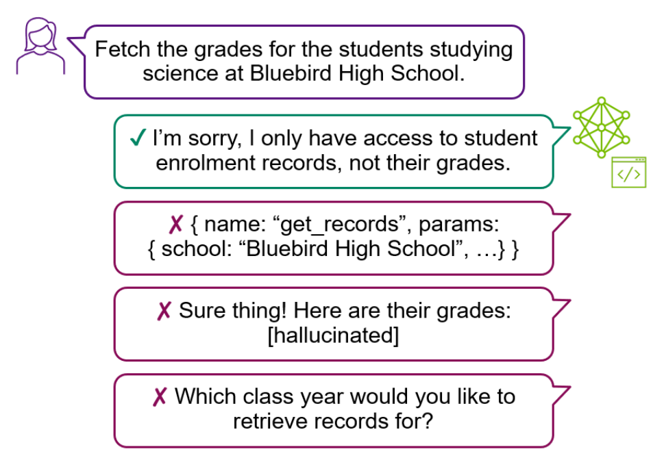
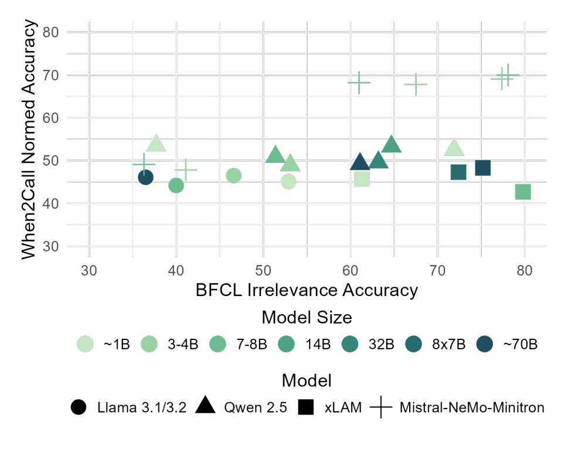

# When2Call: When (not) to Call Tools

## 저자

Hayley Ross, Ameya Sunil Mahabaleshwarkar, Yoshi Suhara

## 초록

외부 tool 활용은 현대 Language Model(LM)이 기능을 확장하고 기존 시스템에 통합되기 위한 핵심 기능이다. 그러나 기존 benchmark들은 주로 tool calling의 정확도, 즉 올바른 tool이 올바른 parameter로 호출되었는지에 초점을 맞추며, LM이 언제 tool을 호출해야 하고 언제 호출하지 말아야 하는지를 평가하는 데는 상대적으로 관심이 적다. 우리는 tool-calling 의사결정을 평가하는 새로운 benchmark인 When2Call을 개발했다. 이 benchmark는 언제 tool call을 생성해야 하는지, 언제 후속 질문을 해야 하는지, 그리고 언제 제공된 tool로는 질문에 답할 수 없음을 인정해야 하는지를 평가한다. 최신 tool-calling LM들이 When2Call에서 상당한 개선 여지를 보인다는 것을 발견했으며, 이는 이 benchmark의 중요성을 나타낸다. 또한 When2Call을 위한 training set을 개발하고, benchmark의 multiple-choice 특성을 활용하여 preference optimization training 방식을 개발했으며, 이 방식이 전통적인 fine-tuning보다 상당히 더 큰 개선을 보여준다. benchmark와 training data, 그리고 evaluation script를 [https://github.com/NVIDIA/When2Call](https://github.com/NVIDIA/When2Call)에서 공개한다.

---

## When2Call: When (not) to Call Tools

**Hayley Ross**[*](#fn-star)[+](#fn-dagger) (Harvard University, hayleyross@g.harvard.edu)

**Ameya Sunil Mahabaleshwarkar**[*](#fn-star) (NVIDIA, ameyasunilm@nvidia.com)

**Yoshi Suhara** (NVIDIA, ysuhara@nvidia.com)

<a id="fn-star"></a>**[*]** 동등 기여.

<a id="fn-dagger"></a>**[+]** NVIDIA 재직 중 수행된 연구.

**Code & Data**: [https://github.com/NVIDIA/When2Call](https://github.com/NVIDIA/When2Call)

---

## 1 서론

Tool-calling은 현대 LM에게 점점 더 중요한 기능이 되고 있다. 이는 모델이 기존 API나 tool과 연결하여 실시간 정보를 사용하고, 데이터베이스에서 정보를 검색하거나, 기존 시스템과 통합하여 작업을 수행할 수 있게 해주기 때문이다. 이는 특히 기기에 배포할 수 있는 small language model의 최근 발전을 고려할 때 중요하다. 작은 모델은 큰 모델만큼 많은 지식을 저장하지 못하므로 외부 tool에 대한 접근으로부터 큰 이점을 얻는다. 일반적인 설정에서 모델은 system prompt에 tool 또는 API specification 목록을 제공받는다. 모델은 code로 하나 이상의 tool call을 생성하여 이러한 tool에 접근할 수 있다.

Figure 1: When2Call의 질문 유형 예시. Tool-calling LM은 답할 수 없는 질문이 주어졌을 때 tool이나 정보를 hallucination하는 것을 피해야 한다.



(보통 JSON) 이는 API specification을 준수한다. 모든 tool call은 가로채어 실행되고, 결과가 모델에 반환된다. 두 번째 단계에서 모델은 RAG와 유사하게 tool call 결과를 기반으로 사용자에게 텍스트 응답을 생성한다.

주목할 점은 system prompt에 제공된 tool이 학습 시점과 추론 시점에서 다를 수 있다는 것이다. 질문에 답하는 tool이 배포되지 않은 경우(학습 중에 그러한 tool을 본 적이 있더라도), 예를 들어 고객 서비스 LM에게 내일 날씨에 대해 묻는 경우, LM은 이전에 본 날씨 tool을 hallucination하거나 내일 날씨를 hallucination하는 것이 아니라 질문에 답할 수 없다고 말해야 한다. 더 미묘하게, Figure 1에서 보여주듯이 학생 기록 데이터베이스에만 접근할 수 있는 LM에게 대신 성적을 조회해 달라고 요청할 수 있다. hallucination의 또 다른 기회는 적절한 tool이 사용 가능하지만 사용자가 특정 필수 parameter를 채우기에 충분한 정보를 제공하지 않는 경우이다. 이 경우 LM은 누락된 parameter를 hallucination하는 것이 아니라 후속 질문을 해야 한다.

그러나 현재 표준인 BFCL을 포함한 대부분의 현재 benchmark의 주요 초점은

Table 1: When2Call과 BFCL [[31]](#ref-31), ToolSandbox [[14]](#ref-14), ToolBeHonest [[36]](#ref-36) 세 가지 최신 benchmark의 주요 특성 비교. 'Older'는 이전 benchmark를 요약한다(Section 6 참조). * Tool call은 ToolSandbox의 multi-turn category와 BFCL, 그리고 일부 이전 benchmark에서 시스템 상태로 암묵적으로 검증된다. † ToolBeHonest는 solvability 판단으로 tool hallucination을 암묵적으로 측정한다.

| Feature                                                                                                                                                                                                                                                                | When2Call       | BFCL      | ToolSandbox   | ToolBeHonest   | Older   |
|------------------------------------------------------------------------------------------------------------------------------------------------------------------------------------------------------------------------------------------------------------------------|-----------------|-----------|---------------|----------------|---------|
| Tool(s) provided, one correct Tool(s) provided but none correct No tools provided Question missing information Tool call validation Quantifies answer hallucinations Quantifies tool hallucinations Quantifies parameter hallucinations Quantifies follow-up questions | ✓ ✓ ✓ ✓ ✓ ✓ ✓ ✓ | ✓ ✓ ✓ ✓ * | ✓ ✓ ✓ ~ ✓ *   | ✓ ✓ ~ ✓ †      | ✓ ✓ *   |

[[31]](#ref-31)은 올바른 tool이 제공되고 사용자가 이 tool을 호출하기에 충분한 정보를 제공하는 경우이다. 그런 다음 benchmark는 올바른 tool이 올바른 parameter로 호출되었는지 평가한다. BFCL의 Irrelevance category와 ToolSandbox [[14]](#ref-14)는 올바른 tool이 제공되지 않거나 충분한 정보가 제공되지 않는 경우를 고려하지만, 모델이 tool call을 생성하는지 여부만 확인한다. 둘 다 모델이 대신 무엇을 하는지는 평가하지 않는다.

우리는 이러한 격차를 명시적으로 메우는 새로운 benchmark인 When2Call을 만들었다. 이 benchmark는 모델에게 네 가지 유형의 행동 중에서 multiple-choice 형식으로 선택하도록 요청한다: tool call 생성, 추가 정보 요청, 답할 수 없음 표명, 또는 질문에 직접 답하기(우리 질문은 tool 없이는 답할 수 없으므로 이는 답을 hallucination하는 것과 같다). Table 1에서 When2Call의 주요 기능을 요약한다. log-probability를 사용한 전통적인 offline multiple-choice evaluation과 closed-source 모델을 위한 LLM-as-judge 대안을 모두 제공한다.

현대 tool-calling LM은 모든 크기에서 When2Call에서 개선의 여지가 많다는 것을 발견했다. 이는 대부분의 공개 training dataset이 system prompt에 tool이 제공될 때 tool을 호출하는 많은 예제를 포함하지만, tool이 제공될 때 tool을 호출하지 않는 예제는 상당히 적기 때문에 놀라운 일이 아니다. 이를 해결하기 위해 When2Call에 대한 matching training dataset을 개발했다. multiple-choice 형식을 활용하여 supervised fine-tuning(SFT)과 reward-aware preference optimization(RPO) training [[18]](#ref-18)을 구현했으며, 특히 RPO training이 When2Call benchmark와 BFCL Irrelevance에서 성능을 크게 향상시키면서도 tool을 호출해야 하는 BFCL 부분에서 경쟁력 있는 점수를 유지함을 보여준다.

## 2 When2Call

## 2.1 Multiple-Choice로서의 Tool-calling

우리는 MMLU [[9]](#ref-9)와 같이 일반적으로 사용되는 LM benchmark와 유사하게 행동 유형 간의 multiple-choice 형식을 사용하여 When2Call을 구성한다. 구체적으로, When2Call은 Figure 1에서 설명된 것처럼 다음 네 가지 유형의 답변이 있는 질문으로 구성된다:

- (a) 직접 텍스트 답변 (tool call 없음)
- (b) Tool call
- (c) 후속 질문
- (d) 답할 수 없음

When2Call의 모든 질문이 답하기 위해 tool 사용을 필요로 하도록(실시간 정보 필요, 데이터베이스 참조 등) 보장하여, 직접 답변(a)은 항상 hallucination이다. 이를 통해 refusal evaluation [[29]](#ref-29)과 유사하게, 적절한 tool이 제공되지 않을 때 LM이 질문에 답할 수 없음을 인정하기보다 답을 hallucination하는 것을 선호하는지 평가할 수 있다.

Multiple-choice를 사용하면 tool call을 parsing하거나 생성된 텍스트 답변을 분류할 필요 없이 모델 행동의 유형(직접(텍스트) 답변, tool call, 후속 질문, 또는 '답할 수 없음')에 집중할 수 있다. Section 4에서 생성된 답변 분류를 대안으로 탐구한다. Multiple-choice 접근 방식은 재현 가능하고 평가가 빠르다는 주요 이점이 있다. LLM-as-judge가 자유롭게 생성된 응답을 평가할 수 있도록 benchmark(예: MT-Bench [[38]](#ref-38))에서 점점 더 보편화되고 있지만, 점수는 사용된 judge에 따라 변할 수 있고 비용이 빠르게 확장될 수 있다. 또한 tool call의 parsing과 평가는 이미 BFCL과 같은 benchmark에서 다루고 있다. When2Call은 BFCL을 보완하기 위한 것이다.

## 2.2 데이터 생성

When2Call benchmark를 위해 BFCL v2 Live [[15]](#ref-15)의 Simple과 Multiple Function category를 기반으로, When2Call training set을 위해 APIGen의 Simple과 Multiple Function category를 기반으로 multiple-choice 옵션과 새로운 질문을 합성적으로 생성한다. Live(v2) subset of BFCL을 선택한 이유는 합성이 아닌 인간이 생성했으며, permissive license가 있기 때문이다. 이를 통해 각 질문에 대한 올바른 tool call과 다양한 주제 도메인(Section 2.3 참조)에 걸친 이러한 데이터셋의 다양성을 상속받을 수 있다.

모든 분류와 데이터 생성에 Mixtral 8x22B [[17]](#ref-17)를 사용하여 When2Call의 새로운 데이터를 두 가지 주요 단계로 합성 생성한다. Step 1은 질문이 답하기 위해 tool-calling이 필요한지(예: 실시간 정보 또는 데이터베이스 접근 필요) 또는 충분히 지식이 있는 pretrained model이 원칙적으로 답할 수 있는지를 분류하여 BFCL Live 또는 APIGen Simple과 Multiple Function을 필터링한다. 이 분류를 위해 Mixtral 8x22B에 prompt를 제공하며, 전체 prompt는 Appendix C의 Table 9에 나와 있다.

필터링된 각 BFCL 또는 APIGen 질문에 대해 Step 2는 When2Call에서 세 가지 질문을 생성한다: 질문이 변경되지 않고 BFCL/APIGen의 tool call이 정답인 질문 하나, 그리고 추가 정보를 요청하는 후속 질문 또는 '답할 수 없음'이 정답이 되도록 질문이 수정된 두 개의 질문. 각각에 대해 나머지 세 가지(오답) multiple-choice 답변도 생성한다. 주목할 점은 benchmark뿐만 아니라 training dataset을 위해서도 이러한 다른 답변을 생성하면 preference optimization training을 구현할 수 있다(Section 3.3.2 참조). 정확한 prompt는 Appendix C에 제공된다.

Prompt는 각 반복 후 수동 품질 검사를 통해 반복적으로 개발되었다. 문제를 가능한 한 단계로 분해하는 것(아래에서 후속 질문에 대해 설명)이 피해야 할 실수의 상세한 목록을 제공하는 것과 함께 가장 높은 품질의 결과를 얻었다. Appendix A에서 합성 데이터 생성과 관련된 품질 문제와 이를 피하기 위해 취한 단계에 대해 더 자세히 논의한다.

모델이 답할 수 없어야 하는 질문을 생성하기 위해, tool의 텍스트 설명을 포함한 tool specification을 Mixtral 8x22B에 제공하고 이 tool로 답할 수 없는 관련 질문을 요청한다. BFCL Irrelevance category보다 질문과 제공된 tool 간에 더 가깝고 따라서 더 어려운 불일치를 생성하기 위해 관련 질문을 요청한다 - Section 2.4 참조.

후속 질문이 필요한 질문을 생성하기 위해, 올바른 tool call에 해당하는 tool specification을 parsing하고 삭제할 하나의 필수 parameter를 선택한다. 그런 다음 Mixtral 8x22B에 해당 parameter에 해당하는 정보를 생략하도록 사용자 질문을 다시 작성하고 해당 parameter를 요청하는 후속 질문을 작성하도록 지시한다. 문제를 분해함으로써 생성 모델이 tool specification을 전혀 parsing할 필요가 없으며 생성된 데이터의 품질과 일관성을 크게 향상시킬 수 있다. '빈' 질문(예: 유일한 필수 parameter인 주식 ticker가 생략된 '현재 주가가 얼마인가요?')을 피하기 위해 최소 두 개의 필수 parameter가 있는 tool specification에만 이를 적용하여 이 유형의 질문 수가 약간 줄어든다.

## 2.3 통계

Table 2는 When2Call의 각 split에서 답변 유형의 비율을 보여준다. Section 3.3.2에서 더 자세히 논의하듯이, 과도한 보수성을 피하기 위해 RPO training dataset에 tool-calling이 정답인 질문의 비율을 더 높게 포함한다. Table 2는 또한 단일 vs. 다중 tool specification의 비율을 보여준다. BFCL에서와 같이, 다중 tool이 있는 질문은 LM이 어떤 tool이 질문에 답하는지 결정해야 하므로 더 어려울 것으로 예상한다. 우리의 비율은 zero tool category가 추가된 BFCL Live와 APIGen Simple 및 Multiple Function category 간의 비율을 반영한다. 후속 질문이 정답인 질문의 경우, 올바른 tool에 필수 parameter가 없는 BFCL Live의 샘플을 필터링하여 이 category의 샘플 수가 줄어든다. 이를 통해 합성적으로

Table 2: 정답 유형과 제공된 tool specification 수별 When2Call 통계. 정답 키: (a) 직접 답변, (b) tool call, (c) 후속 질문, (d) 답할 수 없음.

|                             | Correct answer   | Correct answer   | Correct answer   | Correct answer   |   Tools provided | Tools provided   | Tools provided   | Tool requirement   | Tool requirement   | Tool requirement   |
|-----------------------------|------------------|------------------|------------------|------------------|------------------|------------------|------------------|--------------------|--------------------|--------------------|
| Dataset split               | (a)              | (b)              | (c)              | (d)              |                0 | 1                | 2+               | real-time          | database           | other              |
| When2Call Test              | 0                | 1,295            | 1,062            | 1,295            |              258 | 712              | 2,682            | 2,178              | 534                | 940                |
| LLM-as-judge subset         | 0                | 100              | 100              | 100              |               18 | 61               | 221              | 169                | 46                 | 85                 |
| When2Call Train             | 0                | 2,000            | 2,000            | 2,000            |              617 | 2,934            | 2,449            | 2,856              | 1,211              | 1,933              |
| Preference training variant | 0                | 4,500            | 3,000            | 3,000            |              918 | 6,860            | 2,722            | 5,092              | 2,096              | 3,312              |

수정된 'follow-up' category의 질문은 항상 누락된 필수 parameter가 있음을 보장한다.

마지막으로, Table 2는 Section 2.2의 tool requirement 분류에서 발생하는 질문 유형을 보고한다: 이 질문은 어떤 방식으로 tool을 필요로 하는가? 실시간 정보가 가장 큰 단일 category를 형성하며, 다른 category에는 Table 9의 분류에 따른 데이터베이스 접근과 특수 tool(예: 인구 모델링)이 포함된다. BFCL Live와 APIGen(데이터베이스 접근, 음식 주문, 실시간 날씨 등)의 다양한 도메인 세트를 상속받는다.

## 2.4 Tool 불일치의 난이도

질문/tool 불일치에 대해 LM이 어떻게 응답해야 하는지를 더 자세히 분석하는 것 외에도, When2Call은 설계상 많은 질문/tool 불일치가 얼마나 어려운지에서 BFCL Irrelevance와 구별된다. BFCL Irrelevance에서 제공되는 tool은 종종 질문과 크게 관련이 없어 LM이 일치하지 않는다는 것을 쉽게 알 수 있다 [[14]](#ref-14). 이는 고객 서비스 LM에게 날씨에 대해 묻는 것과 같은 일부 실제 시나리오를 반영하지만, 다른 시나리오는 그렇지 않다: Figure 1에서 학생 기록과 성적을 구분하려면 LM이 훨씬 더 미묘한 판단을 내려야 한다. When2Call에서는 첫째로 '답할 수 없음'을 대상으로 하는 질문을 tool과 동일한 의미 도메인에 있도록 구성하여 이를 해결한다. 둘째, 후속 질문 답변을 대상으로 하는 질문은 필연적으로 tool과 밀접하게 일치하며, 필수 parameter의 부재만 다르다.

## 3 Multiple-Choice Evaluation

모델의 선택을 결정하기 위해 모델이 선택 번호(예: 'Answer: (a)')를 생성하게 하는 대신 네 가지 가능한 답변에 대한 log-probability를 사용하여 multiple-choice evaluation을 구현한다. Tool-calling의 경우, 답변 중에서 선택하는 meta-task가 모델에게 부자연스러울 수 있으며, 답변 순서 [[20]](#ref-20) [[37]](#ref-37) [[8]](#ref-8) 및 답변 수 [[25]](#ref-25)와 같은 presentation 세부 사항이 정확도에 인위적으로 영향을 미칠 수 있다. Log-probability를 사용하면 이 모든 것을 우회할 수 있다. accuracy, (byte-)length-normalized accuracy 2 및 F1 metric을 보고한다. Table 3의 모든 모델을 평가하는 데 필요한 preprocessing을 포함하여 LM Evaluation Harness [[5]](#ref-5)의 task로 multiple-choice evaluation을 구현했으며(Section 3.1 참조), 이는 다른 모델로 쉽게 확장할 수 있다.

## 3.1 모델별 Prompt Template

모든 tool-calling 모델은 고유한 선호 tool-calling 구문이 있으므로 [[3]](#ref-3), 기본적으로 tool call을 JSON으로 제공하지만 각 모델에 대해 custom preprocessing을 구현하여 모델이 tool-calling에 기대하는 system prompt를 제공하고 tool specification과 tool call 옵션 (b)를 모델이 기대하는 방식으로 포맷한다. 이는 예상치 못한 tool 구문으로 인한 답변 logprobability의 artifact를 방지한다. Appendix B에 예시가 제공된다. 유사한 접근 방식이 BFCL에 구현되어 있으며, 각 모델의 tool call 출력을 evaluation code가 기대하는 형식으로 parsing하는 custom model handler가 있어 각 모델이 선호하는 방식으로 응답할 수 있다. Llama 3.1 8B Instruct와 같이 선호하는 tool-calling prompt를 지정하지 않는 모델의 경우, Appendix B에 표시된 tool 사용을 설명하는 minimal system prompt를 제공하고 tool call 답변을 JSON으로 제공한다.

## 3.2 커뮤니티 모델 결과

Tool-calling 기능이 있는 다양한 크기의 커뮤니티 모델을 평가한다: Llama 3.1 [[4]](#ref-4), Llama 3.2 [[16]](#ref-16), Qwen 2.5 [[24]](#ref-24) 및 xLAM [[35]](#ref-35). 점수는 Table 3에 나와 있다. 우리 데이터셋이 생성된

2 [https://blog.eleuther.ai/multiple-choice-normalization/](https://blog.eleuther.ai/multiple-choice-normalization/)

Table 3: 커뮤니티 tool-calling 모델과 SFT 및 RPO를 사용한 When2Call training 유무에 따른 Mistral-NeMo-Minitron 모델의 When2Call, BFCL v2 Live AST 및 BFCL v2 Irrelevance 결과. When2Call의 경우 Macro F1, length-normed accuracy, 그리고 tool이 제공되지 않을 때의 tool hallucination rate(낮을수록 좋음 ↓; 계산은 Appendix E.1 참조)를 보여준다. When2Call로 학습되지 않은 모델은 상당한 개선 여지를 보이며, RPO training이 가장 큰 이점을 제공한다. 최고 및 두 번째로 좋은 점수는 굵게 및 밑줄로 표시된다.

| Model                  | When2Call   | When2Call   | When2Call    | BFCL AST   | BFCL Irr.   |
|------------------------|-------------|-------------|--------------|------------|-------------|
|                        | F1 ↑        | Acc-Norm ↑  | Tool Hall% ↓ | Acc ↑      | Acc ↑       |
| Llama 3.2 3B Instruct  | 17.9        | 46.5%       | 52%          | 37.6%      | 46.6%       |
| Llama 3.1 8B Instruct  | 16.6        | 44.2%       | 67%          | 51.6%      | 40.0%       |
| Llama 3.1 70B Instruct | 37.8        | 46.1%       | 57%          | 68.3%      | 36.5%       |
| Qwen 2.5 3B Instruct   | 29.8        | 48.9%       | 23%          | 54.8%      | 53.1%       |
| Qwen 2.5 7B Instruct   | 32.0        | 50.9%       | 21%          | 64.1%      | 51.4%       |
| Qwen 2.5 72B Instruct  | 32.8        | 49.2%       | 23%          | 69.3%      | 61.1%       |
| xLAM 7B FC-R           | 31.5        | 42.7%       | 24%          | 58.3%      | 79.8%       |
| xLAM 8x22B R           | 34.3        | 48.3%       | 9.0%         | 74.7%      | 75.2%       |
| MNM4BSFT (baseline)    | 29.7        | 47.8%       | 16%          | 57.9%      | 41.1%       |
| MNM4BWhen2Call-SFT     | 48.1        | 67.8%       | 4.3%         | 51.7%      | 67.5%       |
| MNM4BWhen2Call-RPO     | 51.0        | 69.1%       | 1.9%         | 54.0%      | 77.4%       |
| MNM8BSFT (baseline)    | 31.9        | 49.1%       | 19%          | 62.2%      | 36.3%       |
| MNM8BWhen2Call-SFT     | 49.4        | 68.2%       | 7.0%         | 57.5%      | 61.0%       |
| MNM8BWhen2Call-RPO     | 52.4        | 70.0%       | 1.2%         | 62.5%      | 78.1%       |

BFCL v2 Live 부분에 대한 결과를 가장 밀접하게 일치시키기 위해 보고한다. 성능이 When2Call에서 ceiling과는 거리가 멀며 모델 크기에 따라 반드시 향상되지 않는다는 것을 발견했다(예: Qwen 2.5 3B/7B/72B). 이 흥미로운 결과를 이해하기 위해서는 각 모델 크기의 training data에 따라 달라질 수 있는 더 많은 연구가 필요하다.

특히 대부분의 커뮤니티 모델은 질문에 답할 수 없음을 인정하려 하지 않는다. 이로 인해 'unable to answer' category에서 낮은 accuracy(Appendix E.2의 confusion matrix 참조)와 더 높은 tool hallucination rate가 발생한다. 해당 질문에 tool specification이 제공되지 않았음에도 모델이 tool call 답변을 선택할 때 tool hallucination이 발생한다고 정의한다. 다시 말해, 모델은 답변에서 선택한 tool의 specification을 hallucination했다(자세한 내용은 Appendix E.1 참조). 원치 않는 tool call은 후속 질문이 정답인 많은 질문에서도 발생하며, 이는 tool을 호출하려는 과도한 열의를 시사한다. 이는 아마도 이러한 모델이 tool-calling이 올바른 선택인 경우에 너무 특화되어 있고, 현재 공개된 training dataset의 분포로 판단할 때 [[13]](#ref-13) [[11]](#ref-11) [[6]](#ref-6) 후속 질문이나 답할 수 없음을 인정하는 것과 관련된 training data를 충분히(또는 전혀) 보지 못했기 때문일 것이다.

## 3.3 Training

NeMo-Aligner [[26]](#ref-26)를 사용하여 Mistral-NeMo-Minitron 4B Base와 8B Base 3 모델 [[27]](#ref-27)을 fine-tune하고 align한다. 학습은 8개의 NVIDIA 8xH100 GPU 노드에서 수행되었으며, 모델당 약 3-4시간이 소요되었다. 세 가지 경우에 대한 결과를 보여준다: (1) 기존 tool-calling training dataset의 blend에 대한 supervised fine-tuning(SFT), (2) When2Call training dataset을 포함한 blend에 대한 SFT, (3) 기존 tool-calling dataset에 대한 SFT 후 아래에 설명된 When2Call에 대한 RPO [[18]](#ref-18). 각 경우에서 LM은 instruction following, chat 능력, question-answering, knowledge-intensive task 등과 같은 전반적인 기능을 유지하기 위해 tool-calling 특정 dataset과 함께 generic dataset의 조합으로 학습된다.

## 3.3.1 Supervised Fine-Tuning

Tool-calling SFT를 위해 공개적으로 사용 가능한 dataset [[13]](#ref-13) [[6]](#ref-6)을 사용하고 single tool-call 생성, multiple tool-call 생성, 그리고 multi-turn 대화에서 tool response로부터 답변 생성 간의 균형을 유지하도록 샘플링한다. Table 3의 결과에서 볼 수 있듯이, 이러한

3 [https://huggingface.co/nvidia/Mistral-NeMo-Minitron-8B-Base](https://huggingface.co/nvidia/Mistral-NeMo-Minitron-8B-Base)

dataset으로 학습된 모델은 When2Call benchmark에서 상당한 개선 여지가 있다.

올바른 답변 선택을 target으로 사용하여 2.2에서 설명된 pipeline을 APIGen dataset에 적용하여 fine-tuning data를 생성한다. 이 데이터는 위에서 설명한 tool-calling SFT data와 결합되어 최종 When2Call-SFT data blend를 생성한다. 우리 실험에서 tool-calling을 포함하는 예제와 "cannot answer" 또는 "request for information"을 포함하는 예제의 2:1 비율이 전체적으로 가장 좋은 결과를 제공했다. 4B 모델의 경우 5e-6, 8B 모델의 경우 4e-6의 constant learning rate가 warm-up 없이 사용되었다.

## 3.3.2 Preference Optimization

또한 When2Call의 multiple-choice 형식을 활용하여 RPO용 preference dataset을 생성한다. 여기서 올바른 답변을 chosen response로, 하나의 오답을 rejected response로 제공한다. 각 유형의 정답에 대해 직접 답변, tool call, 후속 질문, 'unable to answer' category 중에서 오답을 균일하게 샘플링한다. Tool-calling 능력의 regression을 방지하기 위해 각 chosen response가 tool-call이고, rejected response가 (1) 올바른 tool-call에서 필수 parameter 제거, (2) tool-call argument를 잘못된 값으로 수정, 또는 (3) 올바른 응답에 둘 이상이 포함된 경우 tool-call의 subset 삭제로 생성되는 subset도 추가한다. 최종 dataset은 이 두 subset을 1:1 비율로 결합하여 생성된다. 낮은 KL-penalty 값(0.05)이 이 dataset을 사용한 tool-calling benchmark에서 가장 좋은 결과를 제공한다는 것을 발견했다. 4B와 8B 모델에 대해 각각 9e-7과 7e-7의 constant learning rate와 10 step의 warm-up을 사용한다.

## 3.4 SFT & RPO 결과

Table 3은 baseline tool-calling SFT blend와 비교한 When2Call에 대한 SFT와 RPO의 결과를 보여준다. 첫째, tool의 다양성을 유지하고 tool-calling 예제와 tool-calling을 포함하지 않는 예제의 균형을 맞추는 기존 tool-calling dataset의 targeted blend가 큰 효과가 있으며, baseline SFT 모델이 이미 When2Call에서 같은 크기 class와 그 이상의 커뮤니티 모델을 능가하고 BFCL에서도 경쟁력 있는 성능을 보인다는 것을 발견했다. 둘째, When2Call을 SFT blend에 추가하면 When2Call에서 결과가 향상되지만, 4B 모델의 경우 BFCL Live AST에서 6.2% 하락이 발생하여 모델이 약간 너무 보수적이 된다는 것을 발견했다. 이는 SFT 대신 RPO training을 수행함으로써 완화되며, 4B 모델의 경우 BFCL Live AST에서 더 작은 하락을 보이고 8B 모델의 경우 모든 dataset에서 증가를 보인다. 종합적으로, 이러한 결과는 가능할 때 tool을 호출하는 것과 그렇지 않을 때 보수적인 것 사이의 최적의 trade-off를 보장하기 위해 targeted dataset blend와 training regime을 curating하는 것의 중요성을 강조한다.

## 4 LLM-as-Judge Evaluation

Log-probability로 multiple-choice benchmark를 평가하는 것의 한 가지 한계는 closed-source tool-calling 모델을 평가할 수 없다는 것이다. 따라서 두 번째 대안적인 LLM-as-judge metric을 구현한다. 두 metric을 비교함으로써 benchmark를 생성할 때 Mixtral 8x22B가 선택한 정확한 답변 문구가 모델 성능에 영향을 미칠 수 있다는 우려도 완화할 수 있다.

이 방법은 multiple-choice와 정확히 동일하게 target LM에 prompt를 제공하지만 log-probability를 얻는 대신 LM이 자유 형식 답변을 생성하게 한다. 그런 다음 LLM-as-judge, 특히 GPT-4-Turbo-04-09를 사용하여 target LM의 생성된 출력을 네 가지 multiple-choice category(직접 답변, tool call, 후속 질문, 답할 수 없음)로 분류한다. LLM-as-judge에 이러한 category 중에서 출력을 분류하도록만 요청하므로 judge 자체의 tool-calling(또는 when-to-call) 기능에 의존하지 않는다. 그런 다음 multiple-choice 버전에 대한 category accuracy(이제 length로 정규화되지 않은 직접)와 F1 score를 계산할 수 있다. Tool이 제공되지 않은 질문에 대한 tool hallucination rate도 이전과 동일한 방식으로 계산할 수 있다. Table 2에 표시된 대로 비용을 접근 가능하게 유지하기 위해 When2Call의 각 category에서 100개의 대표적인 예제를 사용한다.

## 4.1 Multiple-Choice 결과와의 비교

Table 5는 log-probability를 사용한 multiple-choice와 LLM-as-judge evaluation 방법에서 4B 및 8B 모델의 F1 score 비교를 보여준다. 두 방법은 open-source dataset으로만 학습된 baseline 모델에서 유사한 성능을 제공하지만, 학습 중 자체 non-tool-call 답변 문구를 보고 따라서 multiple-choice 답변의 특정 문구에 더 영향을 받는 것으로 보이는 When2Call-trained SFT 및 RPO 모델의 경우 때때로 성능을 과소 평가한다. 따라서 가능하고 비용이 허용되는 경우 When2Call로 학습 후 tool을 호출하지 않을 때 어떻게 답해야 하는지에 대해 학습된 모델에 대해 LLM-as-judge 방법을 사용하는 것을 권장하지만, 주로 올바른 tool-calling만 평가하는 dataset으로 학습된 모델의 경우 결과가 유사한 것으로 보인다.

Table 4: LLM-as-judge evaluation을 사용한 세 가지 closed-source tool-calling 모델의 When2Call, BFCL v2 Live AST 및 BFCL Irrelevance 결과. BFCL의 경우 최상의 비교를 위해 native function-calling이 아닌 prompting을 사용한 점수를 보고한다. 최고 점수는 굵게 표시되며, 커뮤니티 모델과의 비교는 Table 3 참조.

| Model             | When2Call   | When2Call   | When2Call    | BFCL AST ↑   | BFCL Irr. Acc ↑   |
|-------------------|-------------|-------------|--------------|--------------|-------------------|
|                   | F1 ↑        | Acc ↑       | Tool Hall% ↓ | Acc          |                   |
| GPT-4o            | 61.3        | 61.3%       | 26%          | 79.8%        | 83.8%             |
| GPT-4o-Mini       | 52.9        | 54.2%       | 41%          | 76.5%        | 80.7%             |
| GPT-4-Turbo-04-09 | 64.6        | 64.3%       | 22%          | 63.8%        | 35.6%             |

Table 5: When2Call에 대한 multiple-choice vs. LLM-as-judge evaluation 결과. F1 score는 tool-calling dataset으로만 학습된 모델에서 비슷하지만, When2Call training set의 일부로 특정 답변 문구를 보는 모델의 경우 multiple-choice가 때때로 성능을 과소 평가한다.

| Model         |   MC F1 |   LLM-as-Judge F1 |
|---------------|---------|-------------------|
| MNM4Bbaseline |    29.7 |              27.9 |
| MNM4BSFT      |    48.1 |              48.6 |
| MNM4BRPO      |    51   |              64.3 |
| MNM8Bbaseline |    31.9 |              34.8 |
| MNM8BSFT      |    49.4 |              57.1 |
| MNM8BRPO      |    52.4 |              66.1 |

## 4.2 Closed-source 모델 결과

Closed-source tool-calling 모델이 종종 open-source 변형보다 더 낫다고 보고되므로 [[36]](#ref-36) 등, LLM-as-judge 방법을 사용하여 세 가지 GPT-4 모델을 평가한다. 결과는 Table 4에 나와 있다. 실제로 GPT4 모델이 When2Call로 fine-tune된 4B 및 8B 모델을 포함하여 Table 3의 커뮤니티 모델을 능가한다는 것을 발견했다. 그럼에도 불구하고 여전히 개선의 여지가 있다. 특히 tool hallucination rate는 커뮤니티 모델보다 낫지 않다.

## 5 논의

## when-to-call accuracy 향상은 간단하지 않다

BFCL Irrelevance 및 When2Call과 같은 when-*not*-to-call benchmark에서 점수를 향상시키는 것이 negative 예제로 학습하는 것만큼 간단하지 않다는 것을 발견했다. 이는 모델을 tool 호출에 대해 과도하게 보수적으로 만들고

BFCL AST에서 성능 저하를 유발할 수 있기 때문이다. 예를 들어, 4B 모델의 instruction-tuning blend에 tool specification을 관련 없는 instruction-following 질문과 무작위로 짝지어 tool-calling의 negative 예제를 단순히 추가하면 When2Call에서 성능이 향상되지만 BFCL AST에서 성능이 저하되어 모델이 너무 보수적이 되어 tool을 충분히 자주 호출하지 않는다. 전체 When2Call training set을 instruction-tuning blend에 단순히 추가하는 경우에도 유사한 문제가 발생한다: When2Call에서 성능이 향상되지만 모델이 너무 보수적이 되어 BFCL에서 성능이 약간 떨어진다(Section 3.3.1).

이 문제는 SFT 후 helpfulness training 단계가 이어지면 악화된다. 대신, RPO training(Section 3.3.2)과 함께 When2Call training set의 적절하게 균형 잡힌 샘플을 사용할 것을 제안하며, 이는 negative와 positive 예제를 모두 제공하여 이 두 가지 경쟁하는 압력을 성공적으로 균형 잡고 training signal을 향상시킨다.

When2Call은 BFCL Irrelevance와 어떻게 다른가? Figure 2에서 보여주듯이, When2Call은 BFCL Irrelevance와 동일한 질문을 측정하지 않는다. BFCL Irrelevance에서 좋은 성능, 즉 크게 불일치하는 tool을 호출하지 않는 것은 When2Call에서 좋은 성능을 예측하기에 충분하지 않다. When2Call은 첫째로 모델이 올바른 다른 행동(후속 질문을 하거나 답할 수 없음을 인정)을 선택해야 하고, 둘째로 질문과 제공된 tool 간에 더 미묘한 불일치가 있다(Section 2.4). 이는 BFCL Irrelevance를 모방하는 데이터로 학습된 경우에도 종종 모델의 training data 밖에 있는 더 세분화되고 어려운 작업이다.

Figure 2: When2Call은 BFCL Irrelevance보다 더 복잡한 기능을 측정한다: BFCL Irrelevance에서 높은 점수가 반드시 When2Call에서 높은 점수를 제공하지는 않으며, 이는 When2Call이 더 세분화되고 더 도전적인 작업을 제공함을 나타낸다.



모델이 tool을 호출해야 할 때 후속 질문을 하는가? 이 데이터셋의 새로운 기여는 tool이 질문과 일치하지만 필요한 정보가 누락된 경우 모델이 후속 질문을 할 수 있는지 명시적으로 테스트하는 것이다. Appendix E.2의 confusion matrix에서 설명하듯이, Qwen, xLAM, 그리고 fine-tuned Mistral-NeMo-Minitron 모델이 절반 이상의 경우에 올바르게 후속 질문을 할 수 있지만, 여전히 종종 누락된 parameter로 tool call을 hallucination한다.

When2Call에서 성능이 낮은 이유는 모델이 항상 tool을 호출하기 때문인가? APIGen [[13]](#ref-13)과 같은 데이터로 학습된 모델이 'unable to answer'나 후속 질문의 예제를 tool과 관련하여 거의 본 적이 없어 충분히 보수적이지 않고 tool을 너무 자주 호출하기 때문에 When2Call에서 성능이 낮다고 예상할 수 있다. 실제로 Appendix E.2의 confusion matrix는 Llama 모델만 이렇게 한다는 것을 보여준다. Qwen, xLAM, Mistral-NeMo-Minitron 모델은 각각 고유한 오류 패턴을 가지며, 많은 경우에 올바르게 tool을 호출하지 않지만 나머지 세 가지 텍스트 옵션 중 잘못된 답변을 선호한다. Qwen과 xLAM 모델은 (d) 'unable to answer' 옵션을 선택하는 것을 매우 꺼려하며, 대신 직접 답변이나 정보 요청을 선택한다. 이로 인해 (d)에 대한 F1 score가 매우 낮아 macro F1 score가 낮아지지만, (micro-averaged) accuracy는 상대적으로 높을 수 있다.

When2Call은 tool, answer, parameter hallucination을 측정한다 When2Call을 통해 개발자는 각 유형의 가능한 hallucination(tool, 직접 답변, 누락된 정보)을 측정하고 BFCL의 tool call accuracy 평가를 보완하여 모델이 만드는 오류 유형에 따라 system prompt나 training regime을 조정할 수 있다. 예를 들어, RPO training blend나 답변 쌍(Section 3.3.2)을 올바른 trade-off를 보여주도록 조정할 수 있다. Answer hallucination과 parameter hallucination rate는 confusion matrix에서 직접 읽을 수 있으며, tool hallucination을 계산하는 script를 제공한다 - Appendix E.1 참조.

## 6 관련 연구

Tool-calling의 인기가 높아지면서(survey는 [[23]](#ref-23) 참조), 여러 tool-calling benchmark가 개발되었다. 일부 benchmark는 tool-calling 프로세스를 subtask로 분해하지만 [[12]](#ref-12) [[2]](#ref-2) [[34]](#ref-34) [[10]](#ref-10), 대부분의 최신 benchmark는 우리 benchmark가 따르는 추세인 tool-calling을 단일 단계로 취급한다. 이 경우 모델은 tool call 또는 적절한 텍스트 응답을 반환해야 한다. 그러나 대부분의 benchmark는 올바른 API가 제공되는 경우만 테스트하고 tool call 검증 [[19]](#ref-19) [[30]](#ref-30) [[22]](#ref-22) 또는 올바른 tool call을 가정하는 최종 답변이나 시스템 상태 평가에 초점을 맞춘다 [[32]](#ref-32) [[28]](#ref-28) [[21]](#ref-21) [[39]](#ref-39) [[7]](#ref-7) [[33]](#ref-33).

Benchmark 중에서 BFCL [[31]](#ref-31)과 ToolSandbox [[14]](#ref-14)만이 올바른 API가 제공되지 않거나 정보가 누락된 경우를 각각의 Irrelevance와 Insufficient Information category로 해결하려고 시도하며, 이는 올바른 tool을 제공하지 않는다. ToolSandbox와 BFCL의 Multi-Turn category에도 일부 후속 질문의 예제가 포함되어 있다. 그러나 이 두 category 모두 tool call이 이루어지는지 여부만 평가하고 모델이 대신 무엇을 하는지는 평가하지 않는다. ToolBeHonest [[36]](#ref-36)도 이러한 경우를 고려하지만 작업이 해결 가능한지의 subtask만 평가한다. Training data의 경우, Glaive v2 training dataset [[6]](#ref-6)이 올바른 API가 제공되지 않거나 정보가 누락된 경우를 포함하는 유일하게 공개적으로 사용 가능한 training dataset이지만, 그러한 항목을 training set의 나머지 부분과 분리하거나 exact match / cross-entropy loss 이외의 evaluation metric을 제공하지 않는다. Hermes [[11]](#ref-11)와 APIGen [[13]](#ref-13)과 같은 다른 인기 있는 training dataset은 이러한 경우를 다루지 않는다.

Tool hallucination은 최근에야 다루어지기 시작했다. Abdelaziz et al. [[1]](#ref-1)은 그들의 모델 Granite의 tool hallucination rate를 보고한다. ToolBeHonest benchmark [[36]](#ref-36)는 모델에게 작업의 solvability를 분류하도록 요청하여 간접적인 측정으로 tool hallucination을 연구한다('solvable'은 모델이 tool을 사용할 수 있다고 hallucination하고 있음을 나타낸다). Hallucination rate는 BFCL의 상세 출력에서 수동으로 계산할 수 있지만, 이전 benchmark는 tool hallucination rate를 계산하기 위한 명시적 지원을 제공하지 않으며, 모델이 대신 텍스트 답변을 얼마나 자주 hallucination하는지 연구하지 않는다.

## 7 결론

우리는 tool-calling LM이 언제 tool을 호출해야 하고 호출하지 말아야 하는지, 그리고 호출할 수 없을 때 어떻게 행동해야 하는지를 평가하는 새롭게 합성 생성된 데이터셋 When2Call을 발표했다. 이는 네 가지 다른 유형의 행동에 대한 multiple-choice 형식을 사용한다. Log-probability를 사용한 전통적인 accuracy/F1 metric과 특히 closed-source 모델의 생성된 출력을 평가할 수 있는 LLM-as-judge 대안을 제시한다. Tool을 호출하지 말아야 할 때를 평가하는 주요 이전 benchmark인 BFCL Irrelevance와 달리, 이미 포화되기 시작한 4 우리의 더 어려운 작업에서 대형 tool-calling 모델조차도 여전히 어려움을 겪는다는 것을 발견했다. 이 작업은 단순히 tool을 호출하지 않는 것이 아니라 올바른 non-tool-call 응답을 선택해야 하며, 질문과 그럼에도 불구하고 잘못된 tool call 간의 유사성이 더 높다. 또한, tool-calling 모델에 대한 올바른 정도의 보수성을 달성하는 것이 간단하지 않음을 보여준다. 다른 instruction-following 및 helpfulness 데이터와 함께 When2Call training dataset에 대한 단순한 instruction-tuning은 과도하게 보수적인 행동으로 이어질 수 있기 때문이다. 데이터셋의 multiple-choice 특성을 활용하고 언제 tool을 호출할지와 호출하지 말지의 압력 사이에서 균형을 맞추는 RPO training 방법을 제안한다. When2Call에 대한 training은 또한 모델이 특정 답변 문구를 과도하게 선호하게 만들어 log-probability multiple choice 방법을 사용한 점수에 영향을 미칠 수 있다. 이를 완화하기 위해 When2Call에 대한 training 후 가능한 경우 LLM-as-judge 방법을 사용하는 것을 권장한다. 마지막으로, 모델 개발자가 단일 accuracy score를 넘어 모델의 개별 실패 패턴을 이해하고 이에 대응하여 targeted training regime을 개발할 수 있도록 모델 평가의 일부로 confusion matrix와 hallucination rate를 계산하는 script를 제공한다.

4 [https://gorilla.cs.berkeley.edu/leaderboard.html](https://gorilla.cs.berkeley.edu/leaderboard.html)

## 한계점

품질 한계 합성 데이터 생성 pipeline을 사용하고 있으므로 여러 번의 prompt tuning 반복에도 불구하고 일부 데이터셋 품질 문제가 남아 있다. Appendix A에서 데이터셋 품질을 어떻게 평가했는지와 어떤 문제가 남아 있는지 논의한다. 전체 품질 백분율(데이터의 subset에서 수동으로 추정)은 질문의 경우 92%, 질문 답변의 경우 94%이다.

직접 답변이 잘못되었다는 가정 명확하고 올바른 답변을 갖기 위해 When2Call은 직접 답변이 항상 hallucination이며 따라서 항상 잘못되었다고 가정하도록 구성되었다. 그러나 이 단순화 가정은 한 종류의 실제 tool 사용만 반영한다. 다른 경우, 특히 기기에 배포된 small language model의 경우, 작업은 원칙적으로 tool 없이 해결할 수 있지만 LM이 성능을 향상시키기 위해 어쨌든 tool을 사용하기를 원할 수 있다. 이에 대한 고전적인 예는 수학 및 계산 질문으로, BFCL Live의 작은 부분을 형성하며 데이터셋 생성 시 필터링한다. 이러한 작업은 compute와 accuracy 간의 trade-off를 제시한다: tool을 호출하면 compute와 응답 시간을 희생하여 accuracy가 증가한다. 이러한 작업을 다루는 향후 benchmark는 이 trade-off에 대한 다른 선호도를 가진 사용자가 그에 따라 benchmark를 해석하거나 조정할 수 있을 만큼 유연해야 할 것이다.

Closed-source 모델 평가 이 논문에서는 GPT 계열의 closed-source 모델만 평가할 수 있었다. 다른 closed-source 모델도 BFCL에서 좋은 성능을 보인다. benchmark의 향후 버전에서 추가 모델을 평가하기를 희망한다.

사용된 언어 이전 tool-calling 연구와 마찬가지로 영어 질문과 답변에만 집중한다. Tool-calling을 다른 언어로 확장하는 것은 확실히 중요한 연구 방향이며, 가까운 미래에 BFCL의 다국어 유사체를 보기를 희망한다.

## References

<a id="ref-1"></a>**[1]** Ibrahim Abdelaziz, Kinjal Basu, Mayank Agarwal, Sadhana Kumaravel, Matthew Stallone, Rameswar Panda, Yara Rizk, G. P. Bhargav, Maxwell Crouse, Chulaka Gunasekara, Shajith Ikbal, Sachin Joshi, Hima Karanam, Vineet Kumar, Asim Munawar, Sumit Neelam, Dinesh Raghu, Udit Sharma, Adriana Meza Soria, Dheeraj Sreedhar, Praveen Venkateswaran, Merve Unuvar, David Cox, Salim Roukos, Luis Lastras, and Pavan Kapanipathi. 2024. Granite-Function Calling Model: Introducing Function Calling Abilities via Multi-task Learning of Granular Tasks. [arXiv:2407.00121](https://arxiv.org/abs/2407.00121).

<a id="ref-2"></a>**[2]** Kinjal Basu, Ibrahim Abdelaziz, Subhajit Chaudhury, Soham Dan, Maxwell Crouse, Asim Munawar, Vernon Austel, Sadhana Kumaravel, Vinod Muthusamy, Pavan Kapanipathi, and Luis Lastras. 2024. APIBLEND: A comprehensive corpora for training and benchmarking API LLMs. In Proceedings of the 62nd Annual Meeting of the Association for Computational Linguistics (Volume 1: Long Papers), pages 12859-12870, Bangkok, Thailand. Association for Computational Linguistics.

<a id="ref-3"></a>**[3]** Matthew Carrigan. 2024. Tool Use, Unified.

<a id="ref-4"></a>**[4]** Abhimanyu Dubey, Abhinav Jauhri, Abhinav Pandey, Abhishek Kadian, Ahmad Al-Dahle, Aiesha Letman, Akhil Mathur, Alan Schelten, Amy Yang, Angela Fan, and et al. 2024. The llama 3 herd of models. [arXiv:2407.21783](https://arxiv.org/abs/2407.21783).

<a id="ref-5"></a>**[5]** Leo Gao, Jonathan Tow, Baber Abbasi, Stella Biderman, Sid Black, Anthony DiPofi, Charles Foster, Laurence Golding, Jeffrey Hsu, Alain Le Noac'h, Haonan Li, Kyle McDonell, Niklas Muennighoff, Chris Ociepa, Jason Phang, Laria Reynolds, Hailey Schoelkopf, Aviya Skowron, Lintang Sutawika, Eric Tang, Anish Thite, Ben Wang, Kevin Wang, and Andy Zou. 2024. A framework for few-shot language model evaluation.

<a id="ref-6"></a>**[6]** Glaive AI. 2024. glaiveai/glaive-function-calling-v2. [HuggingFace Datasets](https://huggingface.co/datasets/glaiveai/glaive-function-calling-v2).

<a id="ref-7"></a>**[7]** Zhicheng Guo, Sijie Cheng, Hao Wang, Shihao Liang, Yujia Qin, Peng Li, Zhiyuan Liu, Maosong Sun, and Yang Liu. 2024. StableToolBench: Towards Stable Large-Scale Benchmarking on Tool Learning of Large Language Models. arXiv preprint.

<a id="ref-8"></a>**[8]** Vipul Gupta, David Pantoja, Candace Ross, Adina Williams, and Megan Ung. 2024. Changing answer order can decrease mmlu accuracy. [arXiv:2406.19470](https://arxiv.org/abs/2406.19470).

<a id="ref-9"></a>**[9]** Dan Hendrycks, Collin Burns, Steven Basart, Andy Zou, Mantas Mazeika, Dawn Song, and Jacob Steinhardt. 2020. Measuring Massive Multitask Language Understanding.

<a id="ref-10"></a>**[10]** Yue Huang, Jiawen Shi, Yuan Li, Chenrui Fan, Siyuan Wu, Qihui Zhang, Yixin Liu, Pan Zhou, Yao Wan, Neil Zhenqiang Gong, and Lichao Sun. 2024. MetaTool Benchmark for Large Language Models: Deciding Whether to Use Tools and Which to Use. arXiv preprint.

<a id="ref-11"></a>**[11]** interstellarninja and Teknium. 2024. Hermes-function-calling-dataset-v1.

<a id="ref-12"></a>**[12]** Minghao Li, Yingxiu Zhao, Bowen Yu, Feifan Song, Hangyu Li, Haiyang Yu, Zhoujun Li, Fei Huang, and Yongbin Li. 2023. API-bank: A comprehensive benchmark for tool-augmented LLMs. In Proceedings of the 2023 Conference on Empirical Methods in Natural Language Processing, pages 3102-3116, Singapore. Association for Computational Linguistics.

<a id="ref-13"></a>**[13]** Zuxin Liu, Thai Hoang, Jianguo Zhang, Ming Zhu, Tian Lan, Shirley Kokane, Juntao Tan, Weiran Yao, Zhiwei Liu, Yihao Feng, Rithesh Murthy, Liangwei Yang, Silvio Savarese, Juan Carlos Niebles, Huan Wang, Shelby Heinecke, and Caiming Xiong. 2024. APIGen: Automated Pipeline for Generating Verifiable and Diverse Function-Calling Datasets. arXiv preprint.

<a id="ref-14"></a>**[14]** Jiarui Lu, Thomas Holleis, Yizhe Zhang, Bernhard Aumayer, Feng Nan, Felix Bai, Shuang Ma, Shen Ma, Mengyu Li, Guoli Yin, Zirui Wang, and Ruoming Pang. 2024. ToolSandbox: A Stateful, Conversational, Interactive Evaluation Benchmark for LLM Tool Use Capabilities. arXiv preprint.

<a id="ref-15"></a>**[15]** Huanzhi Mao, Charlie Cheng-Jie Ji, Fanjia Yan, Tianjun Zhang, and Shishir G. Patil. 2024. BFCL V2 - Live Dataset.

<a id="ref-16"></a>**[16]** Meta. 2024. Llama 3.2.

<a id="ref-17"></a>**[17]** Mistral AI Team. 2024. Cheaper, Better, Faster, Stronger: Mixtral 8x22B.

<a id="ref-18"></a>**[18]** Nvidia et al. 2024. Nemotron-4 340b technical report. [arXiv:2406.11704](https://arxiv.org/abs/2406.11704).

<a id="ref-19"></a>**[19]** Shishir G. Patil, Tianjun Zhang, Xin Wang, and Joseph E. Gonzalez. 2023. Gorilla: Large Language Model Connected with Massive APIs. arXiv preprint.

<a id="ref-20"></a>**[20]** Pouya Pezeshkpour and Estevam Hruschka. 2024. Large language models sensitivity to the order of options in multiple-choice questions. In Findings of the Association for Computational Linguistics: NAACL 2024, pages 2006-2017, Mexico City, Mexico. Association for Computational Linguistics.

<a id="ref-21"></a>**[21]** Yujia Qin, Shihao Liang, Yining Ye, Kunlun Zhu, Lan Yan, Yaxi Lu, Yankai Lin, Xin Cong, Xiangru Tang, Bill Qian, Sihan Zhao, Lauren Hong, Runchu Tian, Ruobing Xie, Jie Zhou, Mark Gerstein, Dahai Li, Zhiyuan Liu, and Maosong Sun. 2023. ToolLLM: Facilitating Large Language Models to Master 16000+ Real-world APIs. arXiv preprint.

<a id="ref-22"></a>**[22]** Nexusflow. 2023. Nexus Function Calling Leaderboard.

<a id="ref-23"></a>**[23]** Changle Qu, Sunhao Dai, Xiaochi Wei, Hengyi Cai, Shuaiqiang Wang, Dawei Yin, Jun Xu, and Ji-Rong Wen. 2024. Tool Learning with Large Language Models: A Survey. arXiv preprint.

<a id="ref-24"></a>**[24]** Qwen Team. 2024. Qwen2.5: A party of foundation models.

<a id="ref-25"></a>**[25]** Michael C Rodriguez. 2005. Three options are optimal for multiple-choice items: A meta-analysis of 80 years of research. Educational measurement: issues and practice, 24(2):3-13.

<a id="ref-26"></a>**[26]** Gerald Shen, Zhilin Wang, Olivier Delalleau, Jiaqi Zeng, Yi Dong, Daniel Egert, Shengyang Sun, Jimmy Zhang, Sahil Jain, Ali Taghibakhshi, Markel Sanz Ausin, Ashwath Aithal, and Oleksii Kuchaiev. 2024. NeMo-Aligner: Scalable toolkit for efficient model alignment. [arXiv:2405.01481](https://arxiv.org/abs/2405.01481).

<a id="ref-27"></a>**[27]** Sharath Turuvekere Sreenivas, Saurav Muralidharan, Raviraj Joshi, Marcin Chochowski, Ameya Sunil Mahabaleshwarkar, Gerald Shen, Jiaqi Zeng, Zijia Chen, Yoshi Suhara, Shizhe Diao, Chenhan Yu, Wei-Chun Chen, Hayley Ross, Oluwatobi Olabiyi, Ashwath Aithal, Oleksii Kuchaiev, Daniel Korzekwa, Pavlo Molchanov, Mostofa Patwary, Mohammad Shoeybi, Jan Kautz, and Bryan Catanzaro. 2024. LLM pruning and distillation in practice: The Minitron approach. [arXiv:2408.11796](https://arxiv.org/abs/2408.11796).

<a id="ref-28"></a>**[28]** Qiaoyu Tang, Ziliang Deng, Hongyu Lin, Xianpei Han, Qiao Liang, Boxi Cao, and Le Sun. 2023. ToolAlpaca: Generalized Tool Learning for Language Models with 3000 Simulated Cases. arXiv preprint.

<a id="ref-29"></a>**[29]** Bingbing Wen, Jihan Yao, Shangbin Feng, Chenjun Xu, Yulia Tsvetkov, Bill Howe, and Lucy Lu Wang. 2024. The Art of Refusal: A Survey of Abstention in Large Language Models. arXiv preprint.

<a id="ref-30"></a>**[30]** Qiantong Xu, Fenglu Hong, Bo Li, Changran Hu, Zhengyu Chen, and Jian Zhang. 2023. On the Tool Manipulation Capability of Open-source Large Language Models. arXiv preprint.

<a id="ref-31"></a>**[31]** Fanjia Yan, Huanzhi Mao, Charlie Cheng-Jie Ji, Ion Stoica, Joseph E. Gonzalez, Tianjun Zhang, and Shishir G. Patil. 2024. Berkeley Function Calling Leaderboard.

<a id="ref-32"></a>**[32]** Rui Yang, Lin Song, Yanwei Li, Sijie Zhao, Yixiao Ge, Xiu Li, and Ying Shan. 2023. GPT4Tools: Teaching Large Language Model to Use Tools via Self-instruction. Advances in Neural Information Processing Systems, 36:71995-72007.

<a id="ref-33"></a>**[33]** Shunyu Yao, Noah Shinn, Pedram Razavi, and Karthik Narasimhan. 2024. $\tau$-bench: A Benchmark for Tool-Agent-User Interaction in Real-World Domains. arXiv preprint.

<a id="ref-34"></a>**[34]** Junjie Ye, Guanyu Li, Songyang Gao, Caishuang Huang, Yilong Wu, Sixian Li, Xiaoran Fan, Shihan Dou, Qi Zhang, Tao Gui, and Xuanjing Huang. 2024. ToolEyes: Fine-Grained Evaluation for Tool Learning Capabilities of Large Language Models in Real-world Scenarios. arXiv preprint.

<a id="ref-35"></a>**[35]** Jianguo Zhang, Tian Lan, Ming Zhu, Zuxin Liu, Thai Hoang, Shirley Kokane, Weiran Yao, Juntao Tan, Akshara Prabhakar, Haolin Chen, Zhiwei Liu, Yihao Feng, Tulika Awalgaonkar, Rithesh Murthy, Eric Hu, Zeyuan Chen, Ran Xu, Juan Carlos Niebles, Shelby Heinecke, Huan Wang, Silvio Savarese, and Caiming Xiong. 2024a. xlam: A family of large action models to empower ai agent systems. [arXiv:2409.03215](https://arxiv.org/abs/2409.03215).

<a id="ref-36"></a>**[36]** Yuxiang Zhang, Jing Chen, Junjie Wang, Yaxin Liu, Cheng Yang, Chufan Shi, Xinyu Zhu, Zihao Lin, Hanwen Wan, Yujiu Yang, Tetsuya Sakai, Tian Feng, and Hayato Yamana. 2024b. ToolBeHonest: A Multilevel Hallucination Diagnostic Benchmark for Tool-Augmented Large Language Models. arXiv preprint.

<a id="ref-37"></a>**[37]** Chujie Zheng, Hao Zhou, Fandong Meng, Jie Zhou, and Minlie Huang. 2024a. Large language models are not robust multiple choice selectors. In The Twelfth International Conference on Learning Representations.

<a id="ref-38"></a>**[38]** Lianmin Zheng, Wei-Lin Chiang, Ying Sheng, Siyuan Zhuang, Zhanghao Wu, Yonghao Zhuang, Zi Lin, Zhuohan Li, Dacheng Li, Eric P. Xing, Hao Zhang, Joseph E. Gonzalez, and Ion Stoica. 2024b. Judging llm-as-a-judge with mt-bench and chatbot arena. In Proceedings of the 37th International Conference on Neural Information Processing Systems, NeurIPS '23, Red Hook, NY, USA. Curran Associates Inc.

<a id="ref-39"></a>**[39]** Yuchen Zhuang, Yue Yu, Kuan Wang, Haotian Sun, and Chao Zhang. 2023. ToolQA: A Dataset for LLM Question Answering with External Tools. Advances in Neural Information Processing Systems, 36:50117-50143.

## A 합성 데이터 생성을 위한 품질 체크리스트

합성적으로 생성된 데이터는 노이즈가 있을 수 있으므로 인간 검증이 중요하다. prompt tuning의 각 반복에서 생성된 데이터셋의 약 10%(유형별 50개 샘플)를 수동으로 검사하고 그에 따라 prompt를 조정했다. Table 6은 우리가 사용한 체크리스트와 데이터셋의 최종 반복 결과를 보여준다. 체크리스트는 데이터셋의 초기 버전을 수동으로 검사하고 관찰된 모든 오류를 나열하여 생성되었다. 전체 답변 품질 백분율(150개의 합성 답변 중)은 94%이다. 전체 질문 품질 백분율(100개의 합성 질문 중)은 82%이다.

한 가지 특정 문제는 BFCL에서 상속되어 tool 사용이 필요하다고 분류된 일부 질문이 제대로 답하기 위해 tool이 필요하지만, 모호한 부분적 답변도 허용한다는 것이다. (한 예는 Yellowstone National Park의 나무 성장에 대한 특정 예측을 요청하는데, 나무가 적당히 성장할 것이라고 답함으로써 부분적으로 답할 수 있다.) 때때로 우리의 pipeline은 이러한 모호한 답변을 직접 답변 옵션 (a)로 생성하여, (a)가 우리가 가정하는 것처럼 완전히 틀리지 않게 된다. 모델이 모호한 것보다 정확한 질문에 답할 수 없다고 말하는 것이 여전히 더 나은 답변일 가능성이 높지만, 이제는 더 주관적인 판단이다. 이 오류는 부분적으로 BFCL이 사용하는 때때로 비정상적으로 구체적인 tool(및 해당 질문)에서 발생하며, 정확한 형식에서만 tool 사용이 필요하고 실제로 모든 현실적인 tool을 나타내지 않을 수 있다.

다른 두 가지 문제는 'unable to answer' 옵션과 관련이 있다. 때때로 생성 모델은 'unable to answer' 옵션 (d)로 의도된 답변을 생성할 수 있지만, 후속 질문도 포함한다. 또한, 주어진 tool로 답할 수 없는 질문을 생성하도록 모델에 요청할 때(어려운 작업), 가끔 실제로 tool로 답할 수 있는 질문을 생성하지만, 일반적으로 우리가 답변 (b)로 제공하는 tool call로는 여전히 답할 수 없다. 'unable to answer' (d)가 여전히 네 가지 옵션 중 최선의 선택이지만, 모델이 가장 선호하는 답변은 유효한 tool call을 생성하는 것이므로 이는 모델을 혼란스럽게 할 수 있다.

향후 작업에서 이러한 문제를 확인하는 추가 LLM-as-judge filtering 단계를 구현할 계획이다.

## B When2Call의 System Prompt

Table 7은 사전 지정된 system prompt 및/또는 tool-calling 형식이 없는 모델에 대해 When2Call에서 사용하는 기본 system prompt를 보여준다. Table 8은 Qwen을 예로 들어 기존 system prompt를 어떻게 통합하는지 보여준다. prompt는 Qwen 2.5 문서에서 그대로 가져왔다. 5 placeholder tool / tools와 question은 제공된 tool과 질문이 prompt에 포함되는 위치를 나타낸다.

## C 합성 데이터 생성을 위한 Prompt

Tool 사용 분류에 사용된 prompt template은 Table 9에 나와 있다. 합성 데이터 생성을 위한 prompt는 Table 10에 나와 있다.

## D 모든 모델에 대한 결과

Table 12는 Table 3에서 생략된 일부 소형 및 중형 모델 크기를 포함하여 모든 모델이 포함된 결과 표이다.

## E Confusion Matrix와 Hallucination Rate

## E.1 Hallucination Rate 계산

각 유형의 hallucination 비율을 직접 계산할 수 있도록 When2Call을 설계했다. 모델이 직접 답변 (a)를 선택할 때마다 answer hallucination이 발생하며, confusion matrix에서 직접 읽을 수 있다. confusion matrix를 생성하는 script를 제공한다; 예시는 Appendix E.2 참조. tool이 전혀 제공되지 않은 질문을 사용하여 tool hallucination을 평가할 수 있다. 이 시나리오에서 모델이 tool call 답변을 선택하면 반드시 tool을 hallucination하는 것이다. 이 비율을 직접 계산하는 script를 제공한다. 마지막으로, 정보가 누락된 질문(즉, 후속 질문 (c)가 정답)에서 모델이 tool call 답변 (b)를 선택한 경우를 세어 confusion matrix에서 parameter hallucination도 읽을 수 있다.

## E.2 When2Call의 Confusion Matrix

유사한 accuracy나 유사한 F1 score를 달성하면서도 모델이 다른 오류 패턴을 가질 수 있음을 설명하기 위해 선택된 모델에 대한 confusion matrix를 제공한다(accuracy와 F1의 조합은 이러한 차이를 부분적으로 반영한다). Table 13, 14, 15, 16은 각각 Llama 3.1 70B Instruct, Qwen 2.5 7B Instruct, Qwen 2.5 72B Instruct, xLAM 7B FC-R에 대한 confusion matrix를 보여준다. Table 17, 18, 19는 Mistral-NeMo-Minitron 8B 모델의 세 가지 버전에 대한 confusion matrix를 보여준다.

Table 6: 합성적으로 생성된 질문과 답변에 대한 품질 체크리스트. 전체 답변 품질 백분율(150개의 합성 답변 중): 94%. 전체 질문 품질 백분율(100개의 합성 질문 중): 82%.

| Issue Type                                             | Count   | Percentage   |
|--------------------------------------------------------|---------|--------------|
| Answer type: follow-up question                        |         |              |
| Asks about output format                               | 0       | 0.0%         |
| Asks to confirm already provided values                | 3       | 6.0%         |
| Asks for already provided information                  | 0       | 0.0%         |
| Asks for reason or context                             | 0       | 0.0%         |
| Asks about additional inputs to pass to the tool       | 0       | 0.0%         |
| Asks for something irrelevant                          | 0       | 0.0%         |
| Hallucinates other information                         | 0       | 0.0%         |
| Total                                                  | 3       | 6.0%         |
| Answer type: direct answer                             |         |              |
| Contains request for information                       | 0       | 0.0%         |
| Total                                                  | 0       | 0.0%         |
| Answer type: unable to answer                          |         |              |
| Mentions information not included in question          | 0       | 0.0%         |
| Total                                                  | 0       | 0.0%         |
| Question type: correct answer is 'unable to answer'    |         |              |
| Includes explanation referencing tool capabilities     | 0       | 0.0%         |
| Answerable with provided tool                          | 0       | 0.0%         |
| Generic / vague terms (no specific values)             | 2       | 4.0%         |
| References things that are not mentioned (using 'the') | 4       | 8.0%         |
| Totally unrelated to tool                              | 0       | 0.0%         |
| Question doesn't need a tool call to answer            | 0       | 0.0%         |
| Question partially answerable without a tool           | 3       | 6.0%         |
| Total                                                  | 9       | 18.0%        |
| Question type: correct answer is follow-up question    |         |              |
| Does not have any missing information                  | 0       | 0.0%         |
| Mentions vague parameter values                        | 0       | 0.0%         |
| Says that a value is not provided                      | 0       | 0.0%         |
| References existence of tool                           | 0       | 0.0%         |
| Total                                                  | 0       | 0.0%         |

```
You are a helpful AI assistant. You have access to the tools described in <tool></tool> which you can use to answer the user's questions. Only use a tool if it directly answers the user's question. To use a tool, return JSON in the following format: {"name": "tool_name", "arguments": {"argument1": "value1", "argument2": "value2", ...}} <tool>{tool}</tool> <tool>{tool}</tool> ... {question}
```

Table 7: 자체 system prompt가 없는 모델을 평가하기 위해 When2Call에서 사용하는 prompt. 사전 지정된 system prompt에 tool을 호출하지 말아야 할 때에 대한 정보가 포함되지 않은 다른 모델에 비해 이러한 모델에 이점을 주지 않으려고 minimal prompt를 사용한다.

```
<|im_start|>system You are Qwen, created by Alibaba Cloud. You are a helpful assistant. # Tools You may call one or more functions to assist with the user query. You are provided with function signatures within <tools></tools> XML tags: <tools> {tools} </tools> For each function call, return a json object with function name and arguments within <tool_call></tool_call> XML tags: <tool_call> {{"name": <function-name>, "arguments": <args-json-object>}} </tool_call><|im_end|> <|im_start|>user {question}<|im_end|> <|im_start|>assistant
```

Table 8: Qwen 2.5 모델을 평가하기 위해 When2Call에서 사용하는 prompt로, tool-calling에 사용할 custom system prompt를 지정한다. training/fine-tuning 조건에 맞추기 위해 각 모델의 선호 prompt를 사용한다.

```
Questions can be answered in the following ways: - Using public data, available from books or internet datasets - Using a calculator and/or mathematical or physical formulas - Using a specialized tool, such as statistical software, music software or machine learning libraries - Using real-time information, such as weather, stock prices or up-to-date ratings - Using databases (private or public), such as access to player statistics, customer records or lawsuits Here are some examples: Question: What is the weather in London tomorrow? Category: Real-time information Question: What is the specific heat capacity of water? Category: Public data Question: What is the length of the hypotenuse of a right triangle with side lengths 4 and 3? Category: Calculator Question: Find all lawsuits in New York State between 2010-2012. Category: Database Question: Generate a melody in C major. Category: Specialized tool Question: How long does it take to drive from Boston to New York? Category: Real-time information Question: Find popular Indian restaurants in Las Vegas. Category: Real-time information Question: What is the atomic number of oxygen? Category: Public data Question: Get the current level of my character in The Legend of Zelda: Breath of the Wild. Category: Database Question: What are the opening hours of Walmart in Santa Clara, CA? Category: Real-time information Question: What is the magnetic field strength 1 meter away from a wire with a 2 Ampere current? Category: Calculator Question: Perform a Chi-Squared test for independence on a 2x2 contingency table [[1, 2], [3, 4]] Category: Specialized tool Now, classify this question into one of "Public data", "Calculator", "Specialized tool", "Real-time information", or "Database", using the format "Category: <category>": Question: {question}
```

Table 9: Tool 사용 분류에 사용된 prompt template.

정답이 (c)인 질문 생성, 후속 질문

You are given a question and a tool specification in json format.

The tool can be

used to answer the provided

question.

The tool has certain parameters that are required to use it.

The question provides a value for each of these parameters.

- -Your task is to re-write the question such that it does not proide any value for the ` {required\_param\_to\_remove} ` parameter.
- The re-written question must be consistent with original question in meaning
- All other provided values must remain the same, except the one to be excluded.
- There should not be any mention of the excluded parameter in the question.

- The question should

not use phrases like "a specific location"

It should omit this information entirely.

Respond only with the re-written question and nothing else. Here is the original question and parameter to remove -Original question: {original\_question} Parameter to remove from question: {required\_param\_to\_remove}

정답이 (d)인 질문 생성, unable to answer

You are an expert at writing technical content.

## [tool] {tool} [/tool]

- The tools mentioned above inside [tool] [/tool] can be used to answer certain questions.
- -Give one example of a question that none of these tools can be used to answer.
- The question should ask about a specific case and provide all relevant information.
- -Give specific numbers and values where applicable.
- The question should be one complete sentence and include a question mark.
- The question should be no more than 10-30 words.
- Specify all the necessary information, but otherwise keep the question short.
- -Give one example question and nothing else.
- Do not explain why the question cannot be answered. Do not wrap the question in quotes.

Table 10: Section 2.2에서 논의된 대로 When2Call 예제에서 질문을 생성하는 데 사용된 prompt template.

or "a specific date".

category (c)에 대한 응답 생성, 응답이 후속 질문인 경우

You are an expert at writing dialogues involving technical content. Your task is to write a continuation to a conversation between a User and an Assistant. The Assistant has access to the following tool which can be used to answer [tool] {tool} [/tool]

```
User queries: The User will ask a question to the Assistant. You must write the Assistant's response to this question by following the instructions given below: - The User's question does not provide ` {removed_param} ` which is a required parameter to use the tool. - Assistant requires some additional information to answer the question or to use the provided tool. - The Assistant should ask for ` {removed_param} ` from the User. - The Assistant should not ask to clarify or confirm any information that the User already provided. -The Assistant's question should not be about the answer format or any other formatting. -The Assistant's question should be no more than 50 words (shorter is fine). -Stop after generating the Assistant's query for more information. Do not generate a tool call. - Do not include a word count or any information regarding word count in your answer. - Do not provide a note or any other content in your response. Respond only with the Assistant's reply. Here is the conversation so far -
```

```
User: {rewritten_question} Assistant:
```

category (d)에 대한 응답 생성, 응답이 "unable to answer"인 경우

You are an expert at writing dialogues involving technical content.

Your task is to write a continuation to a conversation between a User and an Assistant.

The User will ask a question to the Assistant.

You must write the Assistant's response to this question by following the instructions given below:

- Assume that the Assistant does not know the answer, even if you know the answer.
- The Assistant should explain that it can't answer the question as it cannot perform the requested task.
- -The Assistant's answer should be no more than 40 words (shorter is fine).
- -Stop after generating the Assistant's answer. Do not generate the User's response.

- Do not include

a

word count or any information regarding word

count in your

answer.

- Do not provide a note or any other content in your response. Respond only with the Assistant's reply.

```
Here is the conversation so far -User: {question} Assistant:
```

category (a)에 대한 응답 생성, 응답이 tool 사용 없이 직접 답변인 경우

```
You are an expert at writing dialogues involving technical content. Your task is to write a continuation to a conversation between a User and an Assistant. The User will ask a question to the Assistant. You must write the Assistant's response to this question by following the instructions given below: - Assume that the Assistant knows the correct answer to the question. Do not ask follow-up questions. If necessary, the Assistant should guess any missing information. -Keep the answer simple. Do not provide disclaimers about accuracy. -The Assistant's answer should be no more than 50 words, if possible (shorter is fine if the answer is simple). -Stop after generating the Assistant response. - Do not include a word count or any information regarding word count in your answer. - Do not provide a note or any other content in your response. Respond only with the Assistant's reply. Here is the conversation so far -User: {question} Assistant:
```

Table 11: Section 2.2에서 논의된 대로 When2Call 예제에서 선택지로 사용되는 응답을 생성하는 데 사용된 prompt template.

| Model                  | When2Call   | When2Call   | When2Call    | BFCL AST   | BFCL Irr.   |
|------------------------|-------------|-------------|--------------|------------|-------------|
|                        | F1 ↑        | Acc-Norm ↑  | Tool Hall% ↓ | Acc ↑      | Acc ↑       |
| Llama 3.2 1B Instruct  | 21.7        | 45.1%       | 43%          | 13.2%      | 52.9%       |
| Llama 3.2 3B Instruct  | 17.9        | 46.5%       | 52%          | 37.6%      | 46.6%       |
| Llama 3.1 8B Instruct  | 16.6        | 44.2%       | 67%          | 51.6%      | 40.0%       |
| Llama 3.1 70B Instruct | 37.8        | 46.1%       | 57%          | 68.3%      | 36.5%       |
| Qwen 2.5 0.5B Instruct | 32.0        | 53.5%       | 20%          | 22.9%      | 37.7%       |
| Qwen 2.5 1.5B Instruct | 29.9        | 52.6%       | 23%          | 36.5%      | 71.9%       |
| Qwen 2.5 3B Instruct   | 29.8        | 48.9%       | 23%          | 54.8%      | 53.1%       |
| Qwen 2.5 7B Instruct   | 32.0        | 50.9%       | 21%          | 64.1%      | 51.4%       |
| Qwen 2.5 14B Instruct  | 36.2        | 53.3%       | 21%          | 61.6%      | 64.7%       |
| Qwen 2.5 32B Instruct  | 32.9        | 49.6%       | 17%          | 65.6%      | 63.2%       |
| Qwen 2.5 72B Instruct  | 32.8        | 49.2%       | 23%          | 69.3%      | 61.1%       |
| xLAM 1B FC-R           | 25.6        | 45.7%       | 40%          | 55.3%      | 61.3%       |
| xLAM 7B FC-R           | 31.5        | 42.7%       | 24%          | 58.3%      | 79.8%       |
| xLAM 8x7B R            | 32.9        | 47.3%       | 13%          | 67.5%      | 72.4%       |
| xLAM 8x22B R           | 34.3        | 48.3%       | 9.0%         | 74.7%      | 75.2%       |
| MNM4BSFT (baseline)    | 29.7        | 47.8%       | 16%          | 57.9%      | 41.1%       |
| MNM4BWhen2Call-SFT     | 48.1        | 67.8%       | 4.3%         | 51.7%      | 67.5%       |
| MNM4BWhen2Call-RPO     | 51.0        | 69.1%       | 1.9%         | 54.0%      | 77.4%       |
| MNM8BSFT (baseline)    | 31.9        | 49.1%       | 19%          | 62.2%      | 36.3%       |
| MNM8BWhen2Call-SFT     | 49.4        | 68.2%       | 7.0%         | 57.5%      | 61.0%       |
| MNM8BWhen2Call-RPO     | 52.4        | 70.0%       | 1.2%         | 62.5%      | 78.1%       |

Table 12: 커뮤니티 tool-calling 모델과 SFT 및 RPO를 사용한 When2Call training 유무에 따른 Mistral-NeMo-Minitron 모델의 When2Call, BFCL Live AST 및 BFCL Irrelevance 결과. When2Call의 경우 Macro F1, length-normed accuracy, 그리고 tool이 제공되지 않을 때의 tool hallucination rate(낮을수록 좋음 ↓; 계산은 Appendix E.1 참조)를 보여준다. When2Call로 학습되지 않은 모델은 올바른 선택을 하는 데 어려움을 겪으며, RPO training이 가장 큰 이점을 제공한다. 최고 및 두 번째로 좋은 점수는 굵게 및 밑줄로 표시된다. 추가 모델 크기는 Table 12에 있다.

Table 13: Llama 3.1 70B Instruct의 When2Call confusion matrix.

| True               |   Direct answer |   Tool call |   Predicted Follow-up question |   Unable to answer |
|--------------------|-----------------|-------------|--------------------------------|--------------------|
| Direct answer      |               0 |           0 |                              0 |                  0 |
| Tool call          |               0 |        1287 |                              5 |                  0 |
| Follow-up question |               4 |        1009 |                             44 |                  5 |
| Unable to answer   |             100 |        1030 |                            115 |                 50 |

Table 14: Qwen 2.5 7B Instruct의 When2Call confusion matrix

| True               |   Direct answer |   Tool call |   Predicted Follow-up question |   Unable to answer |
|--------------------|-----------------|-------------|--------------------------------|--------------------|
| Direct answer      |               0 |           0 |                              0 |                  0 |
| Tool call          |              14 |        1078 |                            201 |                  2 |
| Follow-up question |              16 |         410 |                            634 |                  2 |
| Unable to answer   |             119 |         453 |                            645 |                 78 |

| True               |   Direct answer |   Tool call |   Predicted Follow-up question |   Unable to answer |
|--------------------|-----------------|-------------|--------------------------------|--------------------|
| Direct answer      |               0 |           0 |                              0 |                  0 |
| Tool call          |              11 |        1116 |                            167 |                  1 |
| Follow-up question |              12 |         365 |                            684 |                  1 |
| Unable to answer   |             162 |         478 |                            599 |                 56 |

Table 15: Qwen 2.5 72B Instruct의 When2Call confusion matrix

| True               |   Direct answer |   Tool call |   Predicted Follow-up question |   Unable to answer |
|--------------------|-----------------|-------------|--------------------------------|--------------------|
| Direct answer      |               0 |           0 |                              0 |                  0 |
| Tool call          |             133 |         756 |                            393 |                 13 |
| Follow-up question |              63 |         332 |                            640 |                 27 |
| Unable to answer   |             249 |         314 |                            568 |                164 |

Table 16: xLAM 7B FC-R의 When2Call confusion matrix

| True               |   Direct answer |   Tool call |   Predicted Follow-up question |   Unable to answer |
|--------------------|-----------------|-------------|--------------------------------|--------------------|
| Direct answer      |               0 |           0 |                              0 |                  0 |
| Tool call          |               7 |        1261 |                             20 |                  7 |
| Follow-up question |              18 |         738 |                            288 |                 18 |
| Unable to answer   |             181 |         537 |                            359 |                218 |

Table 17: Mistral-NeMo-Minitron 8B SFT (baseline)의 When2Call confusion matrix

Table 18: When2Call을 사용한 Mistral-NeMo-Minitron 8B SFT의 When2Call confusion matrix

| True               |   Direct answer |   Tool call |   Predicted Follow-up question |   Unable to answer |
|--------------------|-----------------|-------------|--------------------------------|--------------------|
| Direct answer      |               0 |           0 |                              0 |                  0 |
| Tool call          |              11 |        1143 |                            132 |                  9 |
| Follow-up question |              12 |         284 |                            752 |                 14 |
| Unable to answer   |             121 |         282 |                            372 |                520 |

Table 19: When2Call을 사용한 Mistral-NeMo-Minitron 8B RPO의 When2Call confusion matrix

| True               |   Direct answer |   Tool call |   Predicted Follow-up question |   Unable to answer |
|--------------------|-----------------|-------------|--------------------------------|--------------------|
| Direct answer      |               0 |           0 |                              0 |                  0 |
| Tool call          |              17 |         992 |                            148 |                138 |
| Follow-up question |              15 |         259 |                            681 |                107 |
| Unable to answer   |              90 |         106 |                            249 |                850 |

