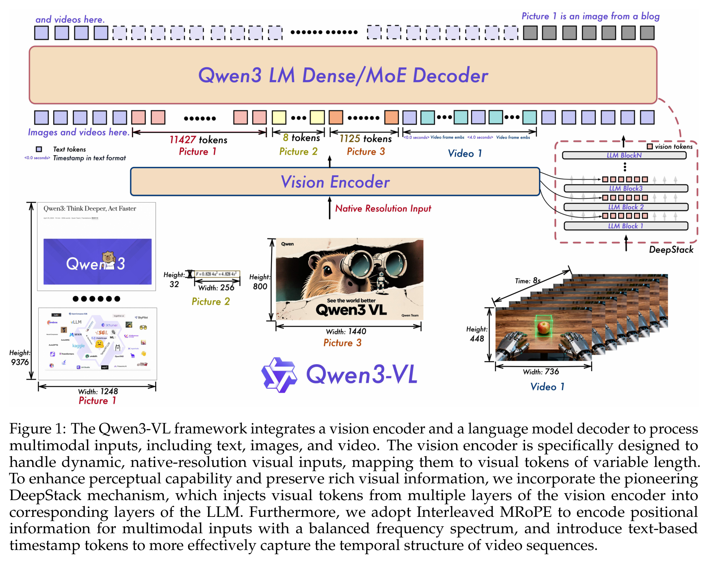

# Qwen3-VL Technical Report - 분석

## 1. 개요

Qwen3-VL은 Qwen 팀의 최신이자 가장 강력한 비전-언어 모델(Vision-Language Model)로, 광범위한 멀티모달 벤치마크에서 최고 수준(state-of-the-art) 성능을 달성했다. 모델 패밀리는 2B부터 235B 파라미터까지 확장되며(dense 및 MoE 아키텍처 모두 포함), 텍스트, 이미지, 비디오를 원활하게 통합하는 256K 토큰 컨텍스트를 기본적으로 지원한다. 이 기술 보고서는 Qwen2-VL부터 Qwen2.5-VL을 거쳐 현재의 Qwen3-VL까지 3년간의 아키텍처 진화를 상세히 다루며, 순수 텍스트 이해와 멀티모달 추론 능력 모두에서 체계적인 개선을 보여준다.

핵심 기술 기여는 이전 버전에서 관찰된 특정 한계를 해결하는 세 가지 아키텍처 혁신에 집중된다. 첫째, 팀은 **Interleaved MRoPE**를 도입하여 원래의 chunked MRoPE 구현에서 나타난 주파수 스펙트럼 불균형 문제를 해결했다—이는 긴 비디오 이해 작업에서 결정적으로 중요한 것으로 입증되었다. 둘째, 여러 ViT 레이어에서 시각적 토큰을 추출하여 해당 LLM 레이어에 주입하는 **DeepStack** 메커니즘을 통합하여, 컨텍스트 길이를 늘리지 않고도 더 풍부한 다층 비전-언어 정렬을 생성한다. 셋째, 절대 시간 위치 인코딩을 명시적인 **텍스트 타임스탬프**(예: "<3.0 seconds>")로 대체하여 비디오 이해 작업에 더 직관적인 시간적 그라운딩(temporal grounding)을 제공한다.

아키텍처 혁신 외에도, 보고서는 훈련 데이터와 방법론의 포괄적인 개편을 강조한다. 사전학습 파이프라인은 컨텍스트 길이가 증가하는(8K → 32K → 256K 토큰) 4단계로 진행되며, 총 2조 개 이상의 토큰을 소비한다. 팀은 토큰당 손실에 제곱근 정규화(square-root normalization)를 도입하여 텍스트 전용 데이터와 멀티모달 데이터의 기여도를 더 잘 균형있게 조정했다—이는 간단하지만 효과적인 기법으로, 멀티모달 성능을 향상시키면서 기본 LLM의 강력한 언어 능력을 보존한다. 사후학습은 "non-thinking"과 "thinking" 변형으로 분기되며, 후자는 명시적인 Chain-of-Thought 모델링을 통해 복잡한 추론 작업에서 훨씬 더 강력한 성능을 달성한다.

평가 섹션은 일반 VQA, STEM 추론, 문서 이해, 그라운딩, 비디오 이해, 에이전트 작업을 포괄하는 50개 이상의 벤치마크 결과를 제시한다. 특히 Qwen3-VL-235B-A22B는 대부분의 작업에서 GPT-5 및 Gemini 2.5 Pro와 경쟁적이거나 우수한 성능을 달성하며, 멀티모달 추론 벤치마크(MMMU, MathVista, MathVision)에서 특히 강력한 성능을 보인다. thinking 변형은 non-thinking 모델에 비해 상당한 이득을 보이며, 이는 이 규모에서도 명시적인 추론 과정이 여전히 가치 있음을 시사한다. 중요한 점은, 보고서에 각 아키텍처 선택을 검증하는 광범위한 제거 실험(ablation study)이 포함되어 있으며, 특히 비전 인코더 선택과 DeepStack 메커니즘의 기여도를 다룬다는 것이다.

더 넓은 관점에서, 이 작업은 VLM 연구가 개념 증명 단계에서 프로덕션 준비 시스템으로 성숙해가는 과정을 잘 보여준다. 긴 컨텍스트 능력(최대 256K 토큰)에 대한 체계적인 처리, 비디오에 대한 명시적 시간 모델링, 분기된 사후학습 전략은 실제 배포에서 나타나는 실용적 요구사항을 반영한다. 보고서의 훈련 인프라(10,000개 GPU, 하이브리드 병렬화 전략) 및 데이터 필터링 프로토콜에 대한 투명성은 실무자들에게 귀중한 통찰을 제공한다. 그러나 실패 모드, 벤치마크당 계산 비용, 분포 외(out-of-distribution) 견고성에 대한 논의가 제한적이라는 점은 향후 연구를 위한 중요한 질문을 남긴다.

## 2. 핵심 섹션

### TL;DR

> Qwen3-VL은 세 가지 아키텍처 업그레이드(균형잡힌 주파수 스펙트럼을 위한 Interleaved MRoPE, 다층 정렬을 위한 DeepStack, 비디오를 위한 명시적 타임스탬프 토큰)와 포괄적인 4단계 사전학습 + 3단계 사후학습 파이프라인을 통해 최고 수준의 비전-언어 성능을 달성하며, 텍스트/이미지/비디오 모달리티 전반에 걸쳐 256K 컨텍스트를 지원하고 non-thinking과 thinking 변형을 모두 제공한다.

→ 심층 분석: [tldr-ko.md](2511.21631-details/tldr-ko.md)

### 핵심 기여

1. **Interleaved MRoPE** → 시간적/수평적/수직적 요소를 저주파-고주파 대역에 균일하게 분산시켜 원래 chunked MRoPE의 주파수 스펙트럼 불균형 문제 해결 → 긴 비디오 이해를 크게 개선

2. **DeepStack 통합** → 여러 ViT 레이어(저수준-고수준 특징)의 시각적 토큰을 경량 residual 연결을 통해 해당 LLM 레이어에 주입 → 컨텍스트 길이 오버헤드 없이 비전-언어 정렬 강화

3. **명시적 텍스트 타임스탬프** → 절대 시간 위치 인코딩을 텍스트 토큰(예: "<3.0 seconds>", HMS 형식)으로 대체 → 비디오 작업에 더 직관적이고 효과적인 시간적 그라운딩 제공

4. **제곱근 손실 정규화** → 샘플당 손실에서 제곱근 정규화된 토큰당 손실로 전환 → 훈련 중 텍스트 전용 데이터와 멀티모달 데이터의 기여도를 더 잘 균형 조정

5. **분기된 사후학습** → 전용 long-CoT 콜드 스타트 데이터와 다단계 RL(추론 RL + 일반 RL)을 사용하여 non-thinking과 thinking 변형 분리 → 복잡한 추론 벤치마크에서 상당한 성능 향상 달성

→ 상세 분석: [contributions-ko.md](2511.21631-details/contributions-ko.md)

### 주요 섹션 vs 비주요 섹션

| 우선순위 | 섹션 | 이유 |
|----------|----------|--------|
| ⭐⭐⭐ 필독 | Section 2: 모델 아키텍처 | 세 가지 핵심 혁신(Interleaved MRoPE, DeepStack, Video Timestamps) - 기술적 참신성 이해에 필수 |
| ⭐⭐⭐ 필독 | Section 3.1: 훈련 레시피 | 점진적 컨텍스트 확장(8K→256K)을 포함한 4단계 사전학습 파이프라인 - 복제에 중요 |
| ⭐⭐⭐ 필독 | Section 5.12: 제거 실험 | 비전 인코더 선택, DeepStack 기여도, 긴 컨텍스트 능력 검증 - 설계 결정 이해에 필수 |
| ⭐⭐ 중요 | Section 4.2: 콜드 스타트 데이터 | 엄격한 필터링을 통한 SFT 및 Long-CoT 데이터 큐레이션 - 품질 관리 이해에 중요 |
| ⭐⭐ 중요 | Section 4.4: 강화학습 | 하이브리드 보상 시스템을 사용한 추론 RL + 일반 RL - 사후학습 방법론의 핵심 |
| ⭐ 권장 | Section 5.1-5.11: 벤치마크 평가 | 50개 이상 벤치마크의 종합 결과 - 능력 이해에 유용하지만 훑어보기 가능 |
| 건너뛰기 | Section 3.2.1-3.2.9: 사전학습 데이터 상세 | 특정 데이터 소스 설명 - 초기 읽기에는 너무 상세함, 필요시 참고 |

→ 상세 읽기 가이드: [key-sections-ko.md](2511.21631-details/key-sections-ko.md)

## 3. 논문 유형: Method

**유형**: Method Paper (기술 보고서)

이는 프로덕션 비전-언어 모델 시스템을 문서화한 포괄적인 기술 보고서다. 단일 아이디어를 탐구하는 순수 연구 논문과 달리, 다음을 결합한다:

- **아키텍처**: 3가지 새로운 구성요소(Interleaved MRoPE, DeepStack, 명시적 타임스탬프)
- **훈련 파이프라인**: 4단계 사전학습 + 3단계 사후학습, 상세한 레시피 포함
- **평가**: 다양한 멀티모달 작업에 걸친 50개 이상 벤치마크
- **제거 실험**: 설계 선택의 체계적 검증

→ 상세 방법론: [methodology-ko.md](2511.21631-details/methodology-ko.md)

## 4. 시각적 분석

### 주요 그림

**Figure 1**: Qwen3-VL 아키텍처 개요 ([원문](2511.21631.md#L138))



- **구성요소**: 비전 인코더(SigLIP-2) → 비전-언어 병합기(MLP) → LLM(Qwen3)
- **DeepStack 메커니즘**: 3개 ViT 레이어의 시각적 토큰이 처음 3개 LLM 레이어에 주입됨(빨간 화살표로 표시)
- **Interleaved MRoPE**: 주파수 스펙트럼 전반에 t/h/w 차원을 분산시키는 위치 인코딩
- **명시적 타임스탬프**: 비디오 프레임 앞에 "<3.0 seconds>" 같은 텍스트 토큰 추가

**핵심 통찰**: 아키텍처는 표준 3모듈 VLM 설계를 유지하지만, 핵심 차별화 요소로 다층 특징 주입(DeepStack)을 추가한다. 이는 모든 특징을 컨텍스트에 연결하는 계산 오버헤드 없이 더 풍부한 시각적 표현을 제공한다.

### 수식

**제곱근 손실 정규화** ([Section 3.1](2511.21631.md#31-training-recipe))

논문은 "샘플당 손실"에서 "제곱근 정규화된 토큰당 손실"로의 전환을 언급하지만 정확한 수식은 제공하지 않는다. 직관은 다음과 같다:

- **문제**: 이미지 토큰(이미지당 수백 개)이 텍스트 토큰보다 그래디언트 업데이트를 지배
- **해결책**: 각 샘플의 손실을 $n_{tokens}$ 대신 $\sqrt{n_{tokens}}$로 가중치 부여
- **효과**: 긴 멀티모달 샘플의 영향력을 줄여 텍스트 능력 보존

**Interleaved MRoPE** ([Section 2.1](2511.21631.md#21-interleaved-mrope))

원래 chunked MRoPE는 임베딩 차원을 별도의 (t, h, w) 하위공간으로 분할하여 주파수 불균형을 생성한다. Interleaved MRoPE는 이러한 차원을 균일하게 분산시킨다:

- **기존**: $[t_1, t_2, ..., t_k | h_1, h_2, ..., h_k | w_1, w_2, ..., w_k]$
- **Interleaved**: $[t_1, h_1, w_1, t_2, h_2, w_2, ...]$
- **이점**: 각 공간-시간 축이 저주파와 고주파에 걸쳐 표현됨

### 알고리즘 워크스루

**4단계 사전학습 파이프라인** ([Table 1](2511.21631.md#L172))

```
Stage 0: 비전-언어 정렬
├─ 훈련: 병합기만 (ViT + LLM 고정)
├─ 데이터: 67B 토큰 (이미지 캡션, OCR)
├─ 컨텍스트: 8K 토큰
└─ 목표: 모달리티 격차를 효율적으로 연결

Stage 1: 멀티모달 사전학습
├─ 훈련: 모든 파라미터 (ViT + 병합기 + LLM)
├─ 데이터: ~1T 토큰 (VL 데이터 + 텍스트 전용)
├─ 컨텍스트: 8K 토큰
└─ 목표: 다양한 데이터에 대한 종단간 공동 훈련

Stage 2: 긴 컨텍스트 사전학습
├─ 훈련: 모든 파라미터
├─ 데이터: ~1T 토큰 (텍스트 비율 증가 + 비디오)
├─ 컨텍스트: 32K 토큰 (4배 증가)
└─ 목표: 긴 비디오와 문서 처리 가능

Stage 3: 초장 컨텍스트 적응
├─ 훈련: 모든 파라미터
├─ 데이터: 100B 토큰 (긴 비디오/문서 집중)
├─ 컨텍스트: 256K 토큰 (Stage 2 대비 8배 증가)
└─ 목표: 컨텍스트 윈도우를 운영 한계까지 확장
```

**핵심 설계 선택**: 처음부터 최대 길이에서 훈련하는 것이 아니라 점진적 컨텍스트 확장(8K → 32K → 256K). 이는 계산 효율성과 능력 개발의 균형을 맞춘다.

**3단계 사후학습 파이프라인** ([Section 4.1](2511.21631.md#41-training-recipe))

```
Stage 1: 지도 파인튜닝 (SFT)
├─ Phase 1a: 32K 컨텍스트 (non-thinking은 표준 형식, thinking은 CoT 형식)
├─ Phase 1b: 256K 컨텍스트 (긴 문서 및 긴 비디오 데이터)
└─ 목표: 명령 따르기 및 잠재 추론 능력 활성화

Stage 2: Strong-to-Weak 증류
├─ 방법: Off-policy 증류 → KL divergence로 On-policy 증류
├─ 데이터: LLM 백본 파인튜닝을 위한 텍스트 전용 데이터
└─ 목표: 교사 모델에서 학생 모델로 능력 전이

Stage 3: 강화학습
├─ 추론 RL: 수학, 코딩, 논리, 그라운딩 (결정론적 검증)
├─ 일반 RL: VQA, 캡셔닝, OCR, 명령 따르기 (규칙 + 모델 기반 보상)
└─ 목표: 성능 향상 및 SFT의 잘못된 사전지식 수정
```

**핵심 설계 선택**: 분기된 훈련은 동일한 베이스에서 두 모델 변형(thinking vs non-thinking)을 생성하여, 사용자가 지연시간 vs 추론 품질을 절충할 수 있게 한다.

### 테이블 해석

**Table 2**: 플래그십 모델 성능 ([원문](2511.21631.md#L437))

주요 관찰:
1. **STEM 추론 우위**: Qwen3-VL-235B-A22B-Thinking이 모든 모델 중 MathVista (85.8), MathVision (74.6), MathVerse (85.0)에서 최고 점수 달성
2. **Thinking vs Non-Thinking 격차**: 추론 작업에서 thinking 모드의 상당한 이득 (예: MMMU: 78.7 → 80.6, MathVista: 84.9 → 85.8)
3. **폐쇄형 모델과 경쟁적**: 오픈 웨이트임에도 대부분 벤치마크에서 GPT-5 및 Gemini 2.5 Pro와 동등하거나 우수
4. **강력한 문서 이해**: OCRBench (920), DocVQA (97.1) 점수는 견고한 텍스트 인식 능력을 나타냄
5. **비디오 이해**: Video-MME (79.2), MVBench (76.5)는 강력한 시간적 추론을 보여줌

**드러난 트레이드오프**:
- Thinking 모드는 지연시간을 추가하지만 추론 작업에서 일관된 1-3점 개선 제공
- 일부 벤치마크(예: RealWorldQA)에서는 non-thinking이 약간 더 나은 성능을 보여, thinking trace가 때때로 단순 인식 작업에 해가 될 수 있음을 시사

**Table 1**: 훈련 설정 ([원문](2511.21631.md#L172))

| Stage | 토큰 예산 | 시퀀스 길이 | 훈련 범위 |
|-------|--------------|-----------------|----------------|
| S0 | 67B | 8K | 병합기만 |
| S1 | ~1T | 8K | 모든 파라미터 |
| S2 | ~1T | 32K | 모든 파라미터 |
| S3 | 100B | 256K | 모든 파라미터 |

**핵심 통찰**:
- 총 사전학습 예산: 4단계에 걸쳐 약 2.1조 토큰
- Stage 3는 256K 컨텍스트에 100B 토큰만 사용(S1/S2의 5%)—전체 재훈련이 아닌 집중 적응을 시사
- 병합기 전용 워밍업(S0)은 최소 토큰을 소비하지만 중요한 교차 모달 정렬을 확립

## 5. 비평 및 관련 연구

### 전문가 비평

**강점** (2026년 관점):

1. **체계적 아키텍처 진화**: 각 혁신(Interleaved MRoPE, DeepStack, 명시적 타임스탬프)이 이전 작업의 특정 경험적 한계를 해결하여, 임의적 변경이 아닌 사려 깊은 반복을 보여줌

2. **포괄적인 제거 실험**: Section 5.12는 비전 인코더 선택(SigLIP-2 vs 기타), DeepStack 기여도(+2.2 MMMU), 긴 컨텍스트 능력(256K 토큰 Needle-in-a-Haystack)에 대한 엄격한 검증을 제공—이 수준의 투명성은 업계 기술 보고서에서 드물다

3. **분기된 사후학습 전략**: thinking과 non-thinking 변형을 분리하는 것은 프로덕션 배포에 내재된 지연시간-품질 트레이드오프를 인정—thinking 모드는 계산 비용을 추가하지만 추론 작업에서 일관된 이득 제공

4. **상세 레시피를 포함한 오픈 웨이트 릴리스**: 논문은 복제를 가능하게 하는 충분한 상세(훈련 단계, 하이퍼파라미터, 데이터 필터링 프로토콜)를 제공하여 오픈 연구를 크게 발전시킴

5. **강력한 소형 모델 성능**: Qwen3-VL-2B/4B/8B가 경쟁력 있는 결과 달성(8B가 MMBench에서 85.3점)은 효과적인 지식 증류와 훈련 효율성을 보여줌

6. **하이브리드 보상을 사용한 다작업 RL**: 규칙 기반 보상(높은 정밀도, 검증 가능한 작업)과 모델 기반 보상(유연성, 개방형 작업)을 결합하는 것은 보상 해킹을 완화하는 실용적 접근법

**한계** (비판적 분석):

1. **제한된 실패 모드 분석**: 모델이 어려움을 겪는 곳에 대한 체계적 논의 없음(예: 적대적 예제, 모호한 쿼리, 중국어-영어 이외 언어의 문화적 편향)—평가는 거의 전적으로 벤치마크 최대화에 집중

2. **계산 비용 불투명성**: 훈련 인프라(10,000개 GPU, 하이브리드 병렬화)는 언급되지만 구체적 메트릭 부족:
   - 총 훈련 시간 및 비용(GPU 시간 또는 USD 단위)
   - 추론 지연시간 분해(thinking vs non-thinking, 작업 유형별)
   - 256K 컨텍스트 배포의 메모리 요구사항

3. **데이터 큐레이션 블랙박스**: 사전학습 데이터 섹션(3.2.1-3.2.9)은 필터링 프로토콜을 설명하지만 정량화하지 않음:
   - 실제 데이터 혼합 비율(각 단계에서 텍스트 vs 이미지 vs 비디오가 얼마나?)
   - 필터링 파이프라인의 거부율
   - "주로 중국어-영어" 이외의 지리적/언어적 분포

4. **평가 포화 우려**: 많은 벤치마크에서 90+ 점수 달성은 평가 분포에 대한 잠재적 과적합을 시사—분포 외 견고성이나 새로운 작업 일반화에 대한 논의 제한적

5. **Thinking 모드 오버헤드 미정량화**: thinking 변형이 일관되게 non-thinking을 능가하지만, 논문은 보고하지 않음:
   - 평균 응답 길이 증가
   - 추론 지연시간 배수
   - thinking 모드가 성능을 해치는 경우(예: RealWorldQA: 79.0 instruct vs 78.0 thinking)

6. **불완전한 DeepStack 제거 실험**: Table 12는 DeepStack에서 +2.2 MMMU 개선을 보여주지만 격리하지 않음:
   - ViT 레이어당 기여도(3개 레이어 모두 동등하게 중요한가?)
   - 아키텍처 대안(residual 연결 vs 연결이 왜?)
   - 훈련 및 추론 중 계산 오버헤드

**동시대 작업과 비교**:

- **vs GPT-5/Gemini 2.5**: 대부분 벤치마크에서 경쟁적이지만 일부 일반 VQA 작업에서 여전히 뒤짐(MMBench: 88.9 vs 90.1 Gemini), 비추론 인식 개선 여지 시사
- **vs LLaVA-OneVision/InternVL**: 더 포괄적인 평가 범위(50+ vs ~20 벤치마크)와 명시적 긴 컨텍스트 지원, 하지만 효율성 최적화는 덜 강조
- **vs Qwen2.5-VL**: 명확한 개선(예: MathVista: 73.2 → 84.9)이 아키텍처 변경을 검증하지만, 점진적 특성은 수익 체감 문제 제기

**실무자를 위한 권장사항**:

1. **비디오용 Interleaved MRoPE 우선 적용**: 긴 비디오 이해 작업 시, 주파수 스펙트럼 균형 수정은 높은 영향력과 낮은 비용을 가질 가능성 높음
2. **Dense 모델용 DeepStack 고려**: +2.2 MMMU 개선은 다층 정렬이 가치 있음을 시사하지만, 작은 모델(<10B)에는 복잡성을 정당화하지 못할 수 있음
3. **Thinking 모드 선택적 채택**: STEM 추론, 복잡한 명령, 다단계 작업에 사용; 지연시간 절약을 위해 단순 인식 쿼리는 건너뛰기
4. **제곱근 손실 정규화 복제**: 멀티모달 훈련 중 텍스트 능력을 보존하는 간단한 기법—이 작업을 넘어 일반화될 가능성 높음

### 관련 연구

**필독** (직접 관련):

1. **Qwen2.5-VL Technical Report** [[4]](#ref-4)
   - **이유**: 직접 전신—2.5에서 3.0으로의 설계 결정을 이해하면 각 혁신의 동기 드러남(MRoPE 문제, DeepStack 필요성)
   - **핵심 교훈**: Qwen3-VL은 혁명적이기보다 진화적; 각 변경은 특정 2.5-VL 한계 해결

2. **DeepStack: Multi-Level Visual Encoding** [[56]](#ref-56)
   - **이유**: 원래 DeepStack 논문은 다중 스케일 이미지 입력 사용; Qwen3-VL은 이를 다층 ViT 특징으로 적응—원본 이해가 적응 평가에 도움
   - **핵심 교훈**: 교차 레이어 특징 주입은 컨텍스트 길이 오버헤드 없이 표현 풍부화 가능

3. **Qwen3 Technical Report** [[99]](#ref-99)
   - **이유**: 기본 LLM 백본과 텍스트 전용 증류 전략 설명—Qwen3-VL이 강력한 언어 능력을 보존하는 방법 이해에 중요
   - **핵심 교훈**: 강력한 텍스트 전용 기반이 더 나은 멀티모달 성능을 가능하게 함; LLM 백본을 소홀히 하지 말 것

**권장** (더 넓은 맥락):

4. **LLaVA-OneVision: Interleaved Understanding** [[41]](#ref-41)
   - **이유**: 인터리브된 이미지-텍스트-비디오 이해에 대한 대안적 접근—아키텍처 선택 비교에 유용
   - **핵심 차이점**: LLaVA는 AnyRes 시각 인코딩 사용 vs Qwen의 동적 해상도 SigLIP-2

5. **SigLIP-2 Vision Encoder** [[77]](#ref-77)
   - **이유**: 비전 인코더 선택이 다운스트림 성능에 큰 영향(제거 실험에서 SigLIP-1 대비 +3.5 MMMU)—SigLIP-2의 설계가 왜 작동하는지 이해
   - **핵심 교훈**: 적절한 스케일링 법칙을 가진 대조 사전학습이 중요; 모든 ViT가 동등하지 않음

**식별된 연구 기회** (격차):

1. **긴 컨텍스트 효율성**: 256K 컨텍스트 지원은 인상적이지만 추론 비용이 아마 금지적—희소 어텐션 메커니즘이나 계층적 압축 연구
2. **교차 언어 견고성**: 논문은 영어/중국어에 집중하지만 많은 벤치마크가 영어 전용—진정한 다언어 작업 평가(예: Multilingual MMMU)
3. **도구 사용 일반화**: "Thinking with Images" 섹션(4.5)은 도구 증강 추론을 언급하지만 V*, HRBench만 평가—개방형 도구 사용 탐구
4. **실패 모드 분류법**: thinking 모드가 언제 해치는지 vs 돕는지 체계적으로 분류하여 배포를 위한 결정 휴리스틱 생성

**비교 표** (랜드스케이프 내 위치):

| 모델 | 컨텍스트 | Thinking 모드 | 오픈 웨이트 | 핵심 강점 |
|-------|---------|---------------|-------------|--------------|
| Qwen3-VL-235B | 256K | Yes | Yes | 균형잡힌 텍스트 + 멀티모달 |
| GPT-5 | ? | Yes | No | 강력한 추론 |
| Gemini 2.5 Pro | ? | Yes | No | 일반 VQA |
| Claude Opus 4.1 | ? | Yes | No | 명령 따르기 |
| InternVL-2.5 | 32K | No | Yes | 효율성 |

**Qwen3-VL의 니치**: 가장 긴 컨텍스트 지원(256K)과 명시적 thinking 모드를 가진 오픈 웨이트 모델, 강력한 추론과 긴 문서/비디오 이해를 모두 필요로 하는 프로덕션 배포를 대상으로 함.
