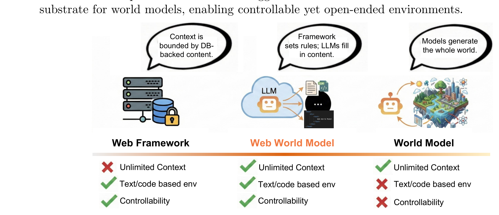
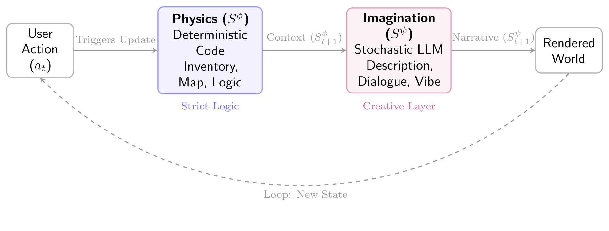
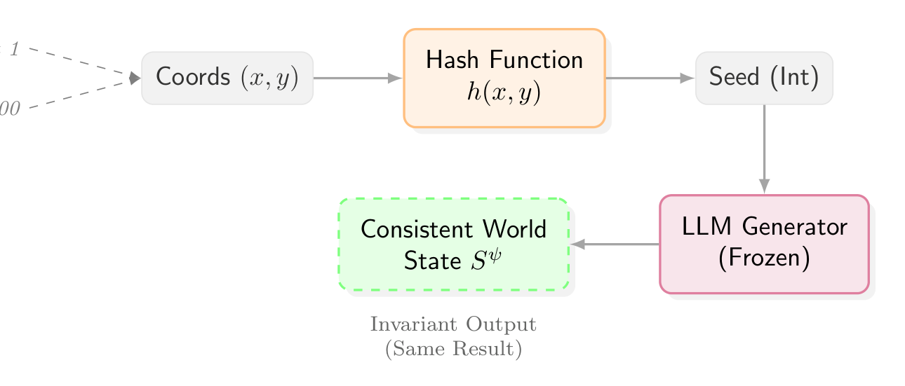

# Web World Models - Analysis

## 1. Overview

이 논문은 언어 에이전트(Language Agent)가 활동할 수 있는 **지속적인 환경(Persistent Environment)**을 구축하는 새로운 패러다임인 **Web World Model (WWM)**을 제안한다. 기존 접근법들은 두 극단에 위치해 있었다: 데이터베이스 기반의 고정된 컨텍스트를 제공하는 전통적 웹 프레임워크와, 무한한 환경을 목표로 하지만 제어가 어려운 완전 생성형(Fully Generative) 월드 모델이다. WWM은 이 두 극단 사이의 **중간 지점(Middle Ground)**을 채운다.

WWM의 핵심 아이디어는 **세계의 상태(State)와 물리 법칙(Physics)을 일반 웹 코드(TypeScript, HTTP handlers 등)로 정의**하고, **LLM은 이 구조화된 잠재 상태(Latent State) 위에서 컨텍스트, 내러티브, 고수준 결정을 생성**하는 것이다. 이는 마치 비디오 게임에서 물리 엔진과 렌더링 파이프라인을 분리하는 것과 유사하다. 코드가 어떤 엔티티가 존재하고 어떻게 상호작용하는지를 규정하며, 모델은 이를 풍부한 설명, 스토리, 태스크별 추론으로 보강한다.

저자들은 이 개념을 실증하기 위해 통합된 웹 기술 스택 위에서 다양한 WWM을 구현했다. 실제 지리 데이터 기반의 **Infinite Travel Atlas**, 절차적 생성 우주인 **Galaxy Travel Atlas**, 웹 스케일 백과사전 **WWMPedia**, 카드 게임 **AI Spire**, 샌드박스 시뮬레이션 **AI Alchemy**, 행성 탐험 **Cosmic Voyager**, 그리고 무한 소설 생성기 **Bookshelf** 등이 포함된다. 이 데모들은 WWM이 특정 태스크나 장르에 국한되지 않음을 보여준다.

논문은 WWM 구축을 위한 4가지 핵심 설계 원칙을 제시한다: (1) **관심사의 분리(Separation of Concerns)** - Physics와 Imagination의 분리, (2) **타입 인터페이스(Typed Interfaces)** - JSON 스키마로 잠재 상태 표현, (3) **결정론적 생성(Deterministic Generation)** - 해싱을 통한 무한하지만 일관된 세계, (4) **우아한 저하(Graceful Degradation)** - 모델 호출 실패 시에도 기능 유지. 이러한 원칙들은 웹 스택 자체가 월드 모델의 확장 가능한 기반이 될 수 있음을 시사한다.

---

## 2. Core Section

### TL;DR

> 웹 코드로 Physics(상태 전이, 논리적 일관성)를 정의하고, LLM으로 Imagination(설명, 내러티브)을 생성하는 하이브리드 아키텍처 제안. 데이터베이스 없이 무한한 세계를 구현하면서도 제어 가능성 유지.

→ 상세: [tldr.md](./2512.23676-details/tldr.md)

### Core Contributions

1. **WWM 개념 정립**: Fixed-context 웹 프레임워크와 Fully-generative 월드 모델 사이의 설계 공간을 명확히 함 → 새로운 아키텍처 패러다임 제시
2. **4가지 설계 원칙**: Separation of Concerns, Typed Interfaces, Deterministic Generation, Graceful Degradation → 실용적 구현 가이드라인 제공
3. **7개 데모 구현**: 여행, 우주, 백과사전, 게임, 시뮬레이션 등 다양한 도메인에서 WWM 실증 → 범용성 입증
4. **Neuro-Symbolic 통합**: 코드(심볼릭)와 LLM(뉴럴)의 명시적 역할 분담 아키텍처 → 환각(Hallucination) 감소 및 디버깅 용이

→ 상세: [contributions.md](./2512.23676-details/contributions.md)

### Key vs Non-Key Sections

| Priority | Sections | Reason |
|----------|----------|--------|
| ⭐⭐⭐ Must Read | [Section 2](./2512.23676.md#2-design-principles-of-web-world-models) | 4가지 핵심 설계 원칙 - 논문의 이론적 기반 |
| ⭐⭐⭐ Must Read | [Section 3.1-3.2](./2512.23676.md#31-infinite-travel-atlas) | Travel/Galaxy Atlas - 대표적 구현 사례 |
| ⭐⭐ Important | [Section 3.3-3.4](./2512.23676.md#33-a-card-game-called-ai-spire) | AI Spire/Alchemy - 게임/시뮬레이션 응용 |
| ⭐ Reference | [Section 3.5-3.7](./2512.23676.md#35-cosmic-voyager) | 추가 데모들 - 필요시 참조 |
| ⭐ Reference | [Section 4](./2512.23676.md#4-related-work) | Related Work - 배경 지식용 |
| Skip | [Appendix A](./2512.23676.md#appendix-a-additional-examples) | UI 스크린샷 갤러리 - 필요시만 |

→ 상세: [key-sections.md](./2512.23676-details/key-sections.md)

---

## 3. Paper Type

**Type**: Method

| Aspect | Value |
|--------|-------|
| **Problem** | 언어 에이전트를 위한 지속적이고 확장 가능한 환경 구축 |
| **Approach** | 코드(Physics) + LLM(Imagination) 하이브리드 아키텍처 |
| **Key Technique** | Deterministic Hashing, Typed JSON Interfaces |
| **Validation** | 7개 도메인의 데모 시스템 구현 |

→ 상세 방법론: [methodology.md](./2512.23676-details/methodology.md)

---

## 4. Visual Analysis

### Key Figures

#### Figure 1: WWM의 위치 (Design Space)

**구성 요소**:
- **Left**: Traditional Web Framework - DB에 고정된 컨텍스트, 확장성 제한
- **Center (Ours)**: Web World Model - 코드 기반 Physics + LLM Imagination
- **Right**: Fully Generative - 무한 생성 가능하나 제어 어려움

**핵심 통찰**:
- WWM은 **제어 가능성(Controllability)**과 **무한 확장성(Unlimited Context)**의 균형점
- 기존 웹 인프라를 그대로 활용할 수 있는 실용적 접근

**Source**: [Figure 1](./2512.23676.md#abstract)

---

#### Figure 3: WWM 아키텍처

**구성 요소**:
- **Code Layer (Physics)**: 결정론적, 상태 전이 담당, $S^{\phi}$
- **AI Layer (Imagination)**: 확률적, 콘텐츠 생성 담당, $S^{\psi}$
- **분리선**: 두 레이어의 명확한 경계

**핵심 통찰**:
- 비디오 게임의 Physics Engine vs Rendering Pipeline 분리와 유사
- Code가 "무엇이 가능한지"를, LLM이 "어떻게 표현할지"를 담당

**Source**: [Figure 3](./2512.23676.md#21-separation-of-concerns-physics-vs-imagination)

---

#### Figure 4: Deterministic Hashing

**구성 요소**:
- **Input**: 좌표 $x$ (방문 위치)
- **Hash Function**: $h(x)$ → 고정된 seed 생성
- **LLM Output**: 동일 seed → 동일 출력 보장

**핵심 통찰**:
- **Object Permanence without Storage**: 데이터베이스 없이 영속성 보장
- 수식: $S^{\psi}_t \equiv S^{\psi}_{t+k}$ if $\text{location}(t) = \text{location}(t+k)$

**Source**: [Figure 4](./2512.23676.md#23-infinite-worlds-via-deterministic-hashing)

---

### Math Formulations

#### 상태 전이 수식

$$S^{\phi}_{t+1} = f_{\text{code}}(S^{\phi}_t, a_t)$$

$$S^{\psi}_{t+1} \sim \pi_\theta(\cdot \mid S^{\phi}_{t+1})$$

**직관적 설명**:
- 첫 번째 수식: 코드가 액션 $a_t$를 받아 Physics 상태를 **결정론적**으로 업데이트
- 두 번째 수식: LLM이 업데이트된 Physics 상태를 조건으로 Imagination을 **확률적**으로 생성

**예시**:
- 플레이어가 "문 열기" 액션 → 코드가 문 상태를 "열림"으로 변경 ($S^{\phi}$)
- LLM이 "열린 문" 상태를 보고 "삐걱거리며 열리는 낡은 나무 문..." 생성 ($S^{\psi}$)

**Source**: [Section 2.1](./2512.23676.md#21-separation-of-concerns-physics-vs-imagination)

---

### Tables Interpretation

#### 설계 원칙 비교

| 원칙 | Physics (Code) | Imagination (LLM) |
|------|----------------|-------------------|
| **역할** | 규칙, 제약 | 콘텐츠, 내러티브 |
| **특성** | 결정론적 | 확률적 |
| **실패 시** | 시스템 중단 | Graceful Degradation |
| **상태 표현** | Typed JSON | Free-form Text |

**주요 발견**:
1. 명확한 역할 분리가 디버깅과 유지보수를 용이하게 함
2. LLM 실패 시에도 코드 레이어가 기본 기능 보장
3. Typed Interface가 구조적 환각(Structural Hallucination) 방지

---

## 5. Critique & Related Works

### Expert Critique

#### Strengths
1. **실용적 아키텍처**: 기존 웹 기술 스택(TypeScript, React, Serverless)을 그대로 활용 → 즉시 적용 가능
2. **명확한 설계 원칙**: 4가지 원칙이 구체적이고 실행 가능 → 다른 시스템 설계에 참고 가능
3. **다양한 실증**: 7개 도메인의 데모로 범용성 입증 → 특정 use case에 국한되지 않음
4. **Neuro-Symbolic 통합**: 코드의 안정성 + LLM의 창의성 결합 → 환각 문제 완화

#### Limitations
1. **정량적 평가 부재**: 데모 위주, 벤치마크나 사용자 연구 없음 → 객관적 성능 비교 어려움
2. **확장성 미검증**: "무한 세계" 주장하나 실제 대규모 테스트 결과 없음 → 병목 지점 불명확
3. **멀티에이전트 제한적**: 대부분 단일 사용자 데모, 다중 에이전트 협업 시나리오 미검증
4. **LLM 의존성**: Gemini Flash 특화 구현, 다른 모델에서의 성능 미검증

#### 2026 Perspective
- **Still Valid**: Physics/Imagination 분리 원칙, Typed Interface 접근법
- **Outdated**: Gemini Flash 특화 구현 (더 강력한 모델 등장)
- **Missing**:
  - Claude Computer Use 등 실제 production 에이전트와의 통합
  - Multi-agent 환경에서의 WWM
  - 보안/안전성 고려 (악의적 프롬프트 대응)

### Related Works

1. **[Generative Agents (Park et al., 2023)](https://arxiv.org/abs/2304.03442)** - 기억과 반성 메커니즘을 가진 believable 에이전트, WWM의 에이전트 측면 보완
2. **[Voyager (Wang et al., 2023)](https://arxiv.org/abs/2305.16291)** - Minecraft에서의 오픈엔디드 에이전트, 코드 스킬 라이브러리 아이디어와 연결
3. **[WebDreamer (Gu et al., 2024)](https://arxiv.org/abs/2411.06559)** - LLM을 인터넷 월드 모델로 사용, WWM의 웹 환경 활용과 유사
4. **[ReAct (Yao et al., 2023)](https://arxiv.org/abs/2210.03629)** - Reasoning + Acting 통합, WWM 에이전트 구현에 적용 가능
5. **[CLIN (Majumder et al., 2023)](https://arxiv.org/abs/2310.10134)** - 지속적 학습 에이전트, WWM 환경에서의 적응 학습 연구 방향

---

## Navigation

- **Source**: [원본 논문](./2512.23676.md)
- **Details**:
  - [TL;DR 상세](./2512.23676-details/tldr.md)
  - [Contributions 상세](./2512.23676-details/contributions.md)
  - [Key Sections 상세](./2512.23676-details/key-sections.md)
  - [Methodology 상세](./2512.23676-details/methodology.md)
