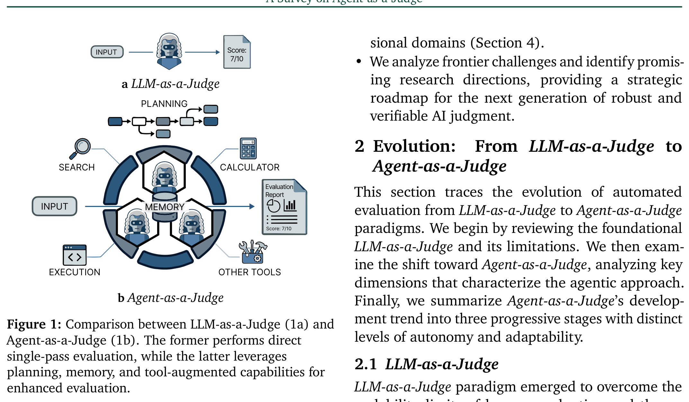
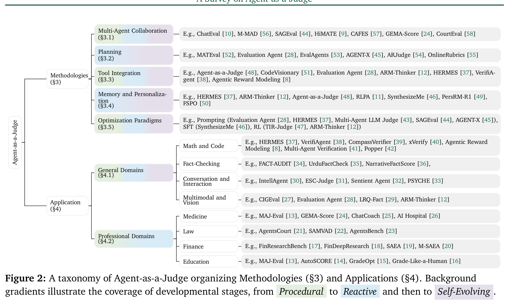
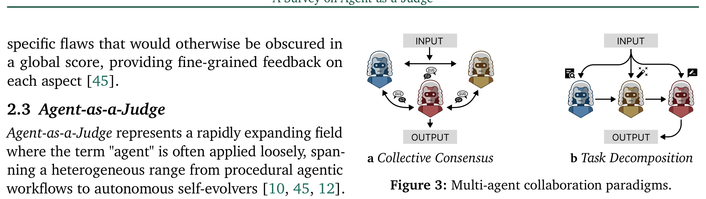
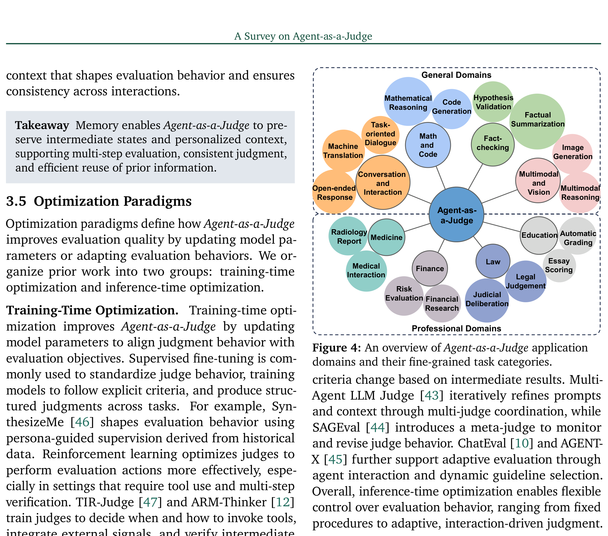

# Agent-as-a-Judge: A Survey - Analysis

## 1. Overview

이 논문은 AI 평가 패러다임이 **LLM-as-a-Judge**에서 **Agent-as-a-Judge**로 진화하는 과정을 체계적으로 정리한 최초의 포괄적 서베이이다. LLM-as-a-Judge는 대규모 언어 모델을 활용해 인간 평가를 대체하는 확장 가능한 평가 방식으로 자리 잡았지만, 평가 대상이 점점 복잡해지고 다단계 작업을 요구하면서 단일 추론 패스의 한계가 드러났다. 특히 편향성(verbosity bias, position bias), 환각적 평가(hallucinated correctness), 인지 과부하로 인한 조잡한 평가 등이 문제로 지적되었다.

저자들은 이러한 한계를 극복하기 위해 등장한 Agent-as-a-Judge의 핵심 특성을 세 가지 축으로 정리한다: (1) **탈중앙화된 견고성** - 다중 에이전트 협업을 통한 편향 완화, (2) **실행 기반 검증** - 도구를 활용한 직관에서 실행으로의 전환, (3) **세분화된 평가** - 전역 점수에서 다면적 평가로의 진화. 이를 기반으로 Agent-as-a-Judge의 발전 단계를 *Procedural* → *Reactive* → *Self-Evolving*의 세 단계로 분류하는 taxonomy를 제안한다.

서베이는 66개의 참고문헌을 분석하며, 방법론을 5가지 핵심 차원(다중 에이전트 협업, 계획, 도구 통합, 메모리/개인화, 최적화)으로 분류하고, 응용 분야를 일반 도메인(수학/코드, 팩트체킹, 대화, 멀티모달)과 전문 도메인(의학, 법률, 금융, 교육)으로 구분한다. 또한 계산 비용, 지연 시간, 안전성, 프라이버시 등의 과제를 분석하고, 개인화, 일반화, 상호작용성, 최적화의 네 가지 미래 연구 방향을 제시한다.

이 서베이는 LLM 평가 시스템을 설계하거나 연구하는 연구자들에게 필수적인 참고 자료로, 특히 에이전트 기반 평가 시스템의 설계 원칙과 trade-off를 이해하는 데 유용하다. 2026년 1월 발표된 최신 연구로서, 급변하는 에이전트 평가 분야의 현재 상태를 종합적으로 조망한다.

---

## 2. Core Section

### TL;DR

> LLM-as-a-Judge의 한계(편향, 환각, 단일 패스 추론)를 극복하기 위해 **Agent-as-a-Judge**가 등장했으며, 이는 다중 에이전트 협업, 도구 기반 검증, 계획 능력, 메모리를 활용해 더 견고하고 검증 가능하며 세분화된 평가를 가능하게 한다. 본 서베이는 이 진화를 *Procedural* → *Reactive* → *Self-Evolving*의 세 단계로 분류하고, 5가지 방법론과 8개 응용 분야를 체계적으로 정리한다.

→ 상세: [tldr.md](./2601.05111-details/tldr.md)

### Core Contributions

1. **Developmental Taxonomy**: Agent-as-a-Judge를 *Procedural*(절차적), *Reactive*(반응적), *Self-Evolving*(자기진화) 세 단계로 분류 → 에이전트 자율성의 발전 궤적을 명확히 이해 가능

2. **Five-Dimension Methodology Framework**: 다중 에이전트 협업, 계획, 도구 통합, 메모리/개인화, 최적화 패러다임의 5가지 핵심 방법론 분류 → 에이전트 평가 시스템 설계의 체계적 가이드라인 제공

3. **Comprehensive Application Survey**: 일반 도메인(수학/코드, 팩트체킹, 대화, 멀티모달)과 전문 도메인(의학, 법률, 금융, 교육)에 걸친 응용 분석 → 도메인별 Agent-as-a-Judge 적용 사례와 패턴 파악 가능

4. **Future Research Roadmap**: 개인화, 일반화, 상호작용성, 최적화의 네 가지 미래 방향 제시 → 연구자들에게 명확한 연구 기회 제공

→ 상세: [contributions.md](./2601.05111-details/contributions.md)

### Key vs Non-Key Sections

| Priority | Sections | Reason |
|----------|----------|--------|
| ⭐⭐⭐ Must Read | Section 2 (Evolution), Section 3 (Methodologies) | 핵심 taxonomy와 방법론 프레임워크 - 논문의 가장 중요한 기여 |
| ⭐⭐ Important | Section 5 (Discussion) | 실제 적용 시 고려해야 할 과제와 미래 방향 |
| ⭐ Reference | Section 4 (Applications) | 관심 도메인에 따라 선택적 참조 |
| Skip | Section 6 (Conclusion), Limitations | 요약 수준, 새로운 정보 없음 |

→ 상세: [key-sections.md](./2601.05111-details/key-sections.md)

---

## 3. Paper Type

**Type**: Survey

| Aspect | Value |
|--------|-------|
| **Focus** | LLM-as-a-Judge → Agent-as-a-Judge 진화 |
| **Scope** | 방법론 5개 차원 + 응용 8개 분야 |
| **Time Range** | 2023-2026 (주로 2024-2025) |
| **Paper Count** | 66개 참고문헌 |

→ 상세 방법론: [methodology.md](./2601.05111-details/methodology.md)

---

## 4. Visual Analysis

### Key Figures

#### Figure 1: LLM-as-a-Judge vs Agent-as-a-Judge 비교

**구성 요소**:
- **(a) LLM-as-a-Judge**: 단일 LLM이 직접 평가 수행 (single-pass evaluation)
- **(b) Agent-as-a-Judge**: Planning, Memory, Tool-Augmented 능력을 갖춘 에이전트 기반 평가

**핵심 통찰**:
- LLM-as-a-Judge는 **수동적 관찰자** - 언어적 패턴에 기반한 평가
- Agent-as-a-Judge는 **능동적 평가자** - 실행, 검증, 다단계 추론 수행
- 핵심 전환: 직관(Intuition) → 실행(Execution), 전역(Global) → 세분화(Fine-grained)

**Source**: [Figure 1](./2601.05111.md#figure-1)

---

#### Figure 2: Agent-as-a-Judge Taxonomy

**구성 요소**:
- **Methodologies (좌측)**: Multi-Agent Collaboration, Planning, Tool Integration, Memory & Personalization, Optimization
- **Applications (우측)**: General Domains + Professional Domains
- **배경 그라디언트**: Procedural → Reactive → Self-Evolving 단계 표시

**핵심 통찰**:
- 방법론과 응용의 **매핑 관계** 시각화
- 발전 단계별로 방법론의 **성숙도 차이** 존재
- Planning과 Memory는 *Reactive/Self-Evolving* 단계에서 더 두드러짐

**Source**: [Figure 2](./2601.05111.md#figure-2)

---

#### Figure 3: Multi-Agent Collaboration Paradigms

**구성 요소**:
- **(a) Collective Consensus**: 수평적 토론 메커니즘 - 다양한 관점의 에이전트들이 동등하게 토론
- **(b) Task Decomposition**: 분할 정복 전략 - 복잡한 평가를 하위 작업으로 분해

**핵심 통찰**:
- **Collective Consensus**: 편향 완화에 효과적, ChatEval이 대표 사례
- **Task Decomposition**: 복잡한 평가에 적합, 계층적/순차적 구조 가능
- 최신 연구는 두 접근법을 **동적으로 결합**하는 방향으로 발전

**Source**: [Figure 3](./2601.05111.md#figure-3)

---

#### Figure 4: Application Domains Overview

**구성 요소**:
- **General Domains**: Math & Code, Fact-Checking, Conversation & Interaction, Multimodal & Vision
- **Professional Domains**: Medicine, Law, Finance, Education

**핵심 통찰**:
- General 도메인은 **검증 가능성**이 핵심 (코드 실행, 팩트 체크)
- Professional 도메인은 **도메인 전문성**과 **다중 에이전트 시뮬레이션**이 특징
- 의학/법률 분야가 가장 활발한 연구 대상

**Source**: [Figure 4](./2601.05111.md#figure-4)

---

### Tables Interpretation

#### Table 1: Tool Integration Methods

| Tool Purpose | Method | Evaluation Task | Tool Type |
|--------------|--------|-----------------|-----------|
| Evidence Collection | Agent-as-a-Judge, CodeVisionary, Evaluation Agent, ARM-Thinker | Code/Visual/Multimodal | Graph, Linter, Tests, Visual Models, Crop/Zoom |
| Correctness Verification | HERMES, VerifiAgent, Agentic RM | Math/Factual Reasoning | Theorem Prover, Search Engine, Python Interpreter |

**주요 발견**:
1. **Evidence Collection vs Correctness Verification** - 두 가지 명확한 도구 사용 패턴
2. 코드 평가는 **실행 피드백**, 수학 평가는 **형식 증명**에 의존
3. 검색 엔진과 Python 인터프리터가 **범용 도구**로 자주 사용됨

**실무적 의미**: 평가 시스템 설계 시 도구 선택의 명확한 가이드라인 제공. 검증 가능한 도메인(수학, 코드)에서 도구 통합이 가장 효과적.

**Source**: [Table 1](./2601.05111.md#table-1)

---

## 5. Critique & Related Works

### Expert Critique

#### Strengths

1. **최초의 포괄적 서베이**: Agent-as-a-Judge라는 신생 분야의 첫 체계적 정리로, 분산된 연구들을 통합적 프레임워크로 조직화
2. **실용적 Taxonomy**: Procedural → Reactive → Self-Evolving 분류가 직관적이고 실제 시스템 설계에 적용 가능
3. **균형 잡힌 Coverage**: 방법론(5개)과 응용(8개)을 체계적으로 커버하며, 일반/전문 도메인 모두 다룸
4. **명확한 Future Directions**: 개인화, 일반화, 상호작용성, 최적화의 네 방향이 구체적이고 연구 가능

#### Limitations

1. **실증적 비교 부재**: 각 방법론의 실제 성능 비교 데이터 없음 - 어떤 접근법이 언제 더 효과적인지 정량적 가이드 부족
2. **구현 복잡도 미고려**: 각 단계(Procedural/Reactive/Self-Evolving)의 구현 난이도와 비용 분석 부족
3. **벤치마크 부재**: Agent-as-a-Judge 시스템 자체를 평가할 표준 벤치마크 제안 없음
4. **Reproducibility**: 66개 논문 중 상당수가 아직 프리프린트 상태로, 재현성 검증 어려움

#### 2026 Perspective

- **Still Valid**: LLM-as-a-Judge의 한계 분석, 다중 에이전트 협업의 편향 완화 효과
- **Outdated**: (2026년 1월 발표로 대부분 최신)
- **Missing**:
  - **Claude Opus 4.5, GPT-5 등 최신 모델**의 단독 평가 능력 향상이 Agent-as-a-Judge 필요성에 미치는 영향
  - **End-to-end learned Agent Judge** - 프롬프트 기반이 아닌 학습 기반 에이전트 평가자
  - **비용-효과 분석** - Agent-as-a-Judge의 실제 배포 비용 vs 품질 향상 trade-off

### Related Works

1. **"The Rise and Potential of Large Language Model Based Agents: A Survey"** (Xi et al., 2025) - LLM 기반 에이전트의 전반적 동향 이해를 위해 필독 - [arXiv](https://arxiv.org/abs/2309.07864)

2. **"From Generation to Judgment: Opportunities and Challenges of LLM-as-a-Judge"** (Li et al., 2025) - LLM-as-a-Judge의 상세한 한계 분석 - [EMNLP 2025](https://aclanthology.org/2025.emnlp-main)

3. **"ChatEval: Towards Better LLM-based Evaluators through Multi-Agent Debate"** (Chan et al., 2024) - 다중 에이전트 토론 기반 평가의 대표 구현 사례 - [ICLR 2024](https://openreview.net/forum?id=FQepisCUWu)

4. **"Agentic Reward Modeling"** (Peng et al., 2025) - 검증 가능한 신호와 선호 학습의 통합 - [ACL 2025](https://aclanthology.org/2025.acl-long.775/)

5. **"A Survey of Self-Evolving Agents"** (Gao et al., 2025) - Self-Evolving 단계의 에이전트 이해를 위해 - [arXiv](https://arxiv.org/abs/2507.21046)

---

## Navigation

- **Source**: [원본 논문](./2601.05111.md)
- **Details**:
  - [TL;DR 상세](./2601.05111-details/tldr.md)
  - [Contributions 상세](./2601.05111-details/contributions.md)
  - [Key Sections 상세](./2601.05111-details/key-sections.md)
  - [Methodology 상세](./2601.05111-details/methodology.md)
