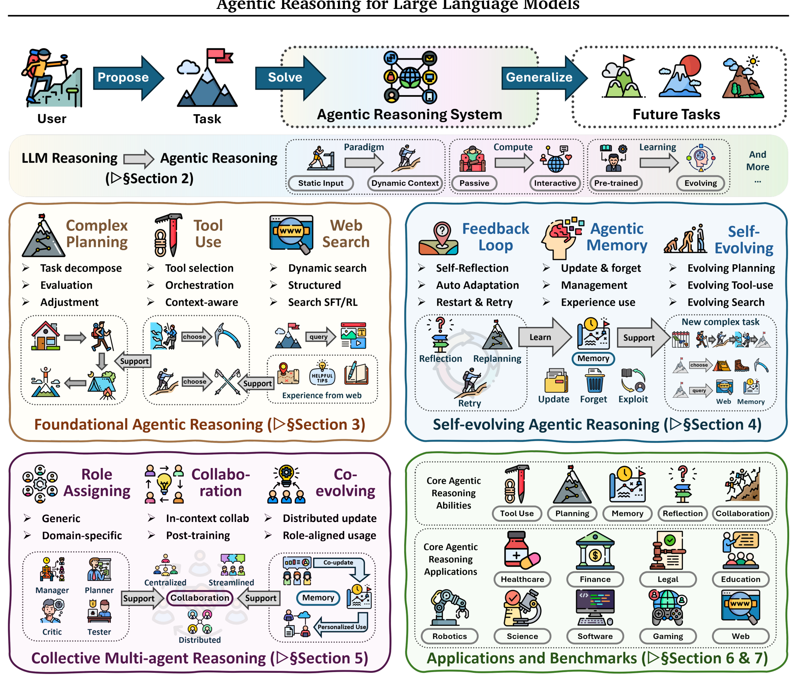
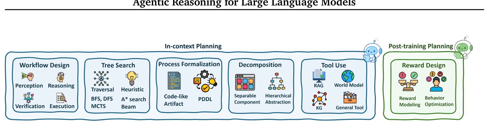
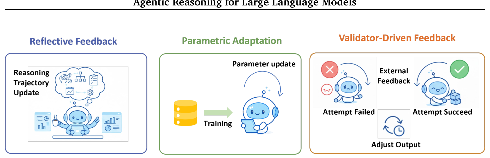

```yaml
---
title: "Agentic Reasoning for Large Language Models - Analysis"
arxiv_id: "2601.12538"
type: "analysis"
paper_type: "survey"
analyzed_date: "2026-02-06"
source: "./2601.12538.md"
details: "./2601.12538-details/"
---
```

# Agentic Reasoning for Large Language Models - Analysis

## 1. Overview

**1문단: 배경과 문제**
이 논문은 LLM 기반 에이전트 시스템에서 "추론(reasoning)"이 어떻게 작동하고 진화하는지를 포괄적으로 정리한 서베이이다. 기존 LLM 추론 연구는 Chain-of-Thought이나 프롬프트 엔지니어링 등 정적(static) 추론에 초점을 맞추었으며, 에이전트 연구는 아키텍처나 시스템 관점에서 접근했다. 그러나 에이전트가 환경과 상호작용하며 계획(planning), 도구 사용(tool use), 탐색(search), 피드백(feedback), 메모리(memory)를 통해 수행하는 *동적 추론* 과정을 통합적으로 다룬 연구는 부재했다.

**2문단: 접근 방식**
저자들은 "Agentic Reasoning"이라는 통합 패러다임을 제안하며, 이를 세 가지 상호보완적 차원으로 구조화한다. (1) **Foundational Agentic Reasoning**: 단일 에이전트의 핵심 역량인 계획, 도구 사용, 탐색. (2) **Self-Evolving Agentic Reasoning**: 피드백, 메모리, 적응을 통한 지속적 자기 개선. (3) **Collective Multi-Agent Reasoning**: 역할 분담, 협업, 공유 메모리를 통한 집단 지능. 또한 각 차원을 **In-context Reasoning** (추론 시간 최적화, 파라미터 고정)과 **Post-training Reasoning** (RL/SFT를 통한 파라미터 업데이트)의 두 가지 최적화 모드로 분석한다.

**3문단: 범위와 기여**
이 서베이는 2025년까지의 약 797개 참고문헌을 분석하며, POMDP 기반의 통합 수학적 프레임워크를 제시한다. 정책을 내부 추론($\pi_{\text{reason}}$)과 외부 행동($\pi_{\text{act}}$)으로 분해하여 "생각한 후 행동하는" 에이전트 구조를 형식화한다. 수학 탐구, 코드 생성, 과학 발견, 로보틱스, 헬스케어, 웹 자동화 등 6개 응용 분야와 벤치마크를 체계적으로 리뷰한다.

**4문단: 의의**
이 논문은 "추론 중심(reasoning-centric)" 관점에서 에이전트 지능을 이해하는 새로운 렌즈를 제공한다. 단순한 방법론 나열이 아니라, 개인화, 장기 추론, 월드 모델, 멀티에이전트 학습, 잠재적 추론, 거버넌스 등 6가지 미래 연구 방향을 구체적으로 제시한다. UIUC, Meta, Amazon, Google DeepMind, UCSD, Yale의 29명 저자가 참여한 대규모 협업 서베이로, 2025년 에이전트 AI 연구의 가장 포괄적인 지도(map)를 제공한다.

---

## 2. Core Section

### TL;DR

> LLM을 정적 텍스트 생성기에서 계획-행동-학습하는 자율 추론 에이전트로 재정의하는 "Agentic Reasoning" 패러다임을 3계층(기초역량/자기진화/집단지능) × 2모드(in-context/post-training)로 체계화한 797개 참고문헌의 포괄적 서베이.

→ 상세: [tldr.md](./2601.12538-details/tldr.md)

### Core Contributions

1. **통합 개념 프레임워크**: Agentic Reasoning을 POMDP 기반으로 형식화하고 3계층 × 2모드 분류 체계를 제안 → 분산된 에이전트 연구를 하나의 추론 중심 관점으로 통합
2. **체계적 문헌 리뷰**: 계획(6가지 스타일), 도구 사용(3가지 통합 단계), 탐색(3가지 아키텍처), 피드백(3가지 메커니즘), 메모리(3가지 유형), 멀티에이전트(역할/협업/진화)를 망라 → 각 하위 분야의 핵심 방법론을 대표 시스템 테이블과 함께 정리
3. **응용 및 벤치마크 맵핑**: 수학, 코드, 과학, 로보틱스, 의료, 웹 등 6개 도메인의 에이전트 시스템과 벤치마크를 체계적으로 분류 → 도메인별 추론 요구사항 차이를 명확화
4. **미래 연구 아젠다**: 개인화, 장기 추론, 월드 모델, 멀티에이전트 학습, 잠재 추론, 거버넌스 등 6가지 오픈 프로블럼 제시 → 차세대 연구 방향의 로드맵 제공

→ 상세: [contributions.md](./2601.12538-details/contributions.md)

### Key vs Non-Key Sections

| Priority | Sections | Reason |
|----------|----------|--------|
| ⭐⭐⭐ Must Read | Sec 1 (Introduction), Sec 2.2 (Preliminaries) | 핵심 프레임워크 정의, POMDP 형식화, 3계층×2모드 분류 체계 |
| ⭐⭐⭐ Must Read | Sec 3 (Foundational Agentic Reasoning) | 계획/도구/탐색의 핵심 역량 분류와 대표 시스템 테이블 |
| ⭐⭐⭐ Must Read | Sec 8 (Open Problems) | 6가지 미래 연구 방향, 현재 한계와 도전 과제 |
| ⭐⭐ Important | Sec 4 (Self-Evolving Reasoning) | 피드백/메모리/자기진화 메커니즘 — 에이전트 학습의 핵심 |
| ⭐⭐ Important | Sec 5 (Collective Multi-Agent) | 역할/협업/진화 — 멀티에이전트 연구에 필수 |
| ⭐ Reference | Sec 6 (Applications) | 도메인별 응용 사례 — 관심 분야만 선택적으로 |
| ⭐ Reference | Sec 7 (Benchmarks) | 벤치마크 정리 — 평가 설계 시 참고 |
| Skip | Sec 2.1 (Positioning Our Survey) | 다른 서베이와의 비교, 핵심 내용 아님 |

→ 상세: [key-sections.md](./2601.12538-details/key-sections.md)

---

## 3. Paper Type

**Type**: Survey

| Aspect | Value |
|--------|-------|
| **Focus** | LLM 기반 에이전트의 추론 메커니즘 |
| **Scope** | 기초역량 → 자기진화 → 집단지능의 3계층 + 응용/벤치마크 |
| **Time Range** | ~2025년 (arXiv 2026-01-18 제출) |
| **Paper Count** | 797개 참고문헌 |

→ 상세 방법론: [methodology.md](./2601.12538-details/methodology.md)

---

## 4. Visual Analysis

### Key Figures

#### Figure 1: Overview of Agentic Reasoning



**구성 요소**:
- **3계층 구조**: Foundational (Planning, Tool-Use, Search) → Self-Evolving (Feedback, Memory, Evolving Capabilities) → Collective (Roles, Collaboration, Evolution)
- **2가지 최적화 모드**: In-context Reasoning (추론 시간) vs Post-training Reasoning (학습 시간)
- **환경 역학**: 환경 복잡도가 증가함에 따라 기초→자기진화→집단으로 진행

**핵심 통찰**:
- 에이전트 추론의 핵심은 단순 텍스트 생성이 아닌, 환경과의 상호작용을 통한 동적 의사결정
- 세 계층은 독립적이 아니라 누적적(cumulative): 집단 지능은 자기진화 역량 위에, 자기진화는 기초 역량 위에 구축

**Source**: [Figure 1](./2601.12538.md#1-introduction)

---

#### Figure 2: Planning Reasoning Overview



**구성 요소**:
- **In-context Planning**: Workflow Design, Tree Search, Process Formalization, Decomposition, External Aid
- **Post-training Planning**: Reward Design / Optimal Control

**핵심 통찰**:
- 계획의 6가지 스타일이 상호보완적: workflow는 구조를 제공하고, tree search는 탐색을, formalization은 해석 가능성을 제공
- Post-training은 RL을 통해 장기적 보상을 최적화하지만, 도메인 특화 보상 설계가 필수

**Source**: [Section 3.1](./2601.12538.md#31-planning-reasoning)

---

#### Figure 5: Three Feedback Mechanisms



**구성 요소**:
- **Reflective Feedback**: 추론 시간에 자기 비평과 수정 (파라미터 변경 없음)
- **Parametric Adaptation**: 피드백을 파라미터에 통합 (SFT/RL)
- **Validator-Driven Feedback**: 외부 검증 신호로 재시도 (비진단적)

**핵심 통찰**:
- 세 메커니즘은 연속체(continuum): 유연성(Reflective) ↔ 지속성(Parametric) ↔ 효율성(Validator)
- 실제 시스템은 이들을 조합: 예) Reflexion(Reflective) + AgentTuning(Parametric) + Unit test retry(Validator)

**Source**: [Section 4.1](./2601.12538.md#41-agentic-feedback-mechanisms)

---

### Math Formulations

#### Policy Factorization (Eq. 1)

$$\pi_\theta(z_t, a_t \mid h_t) = \underbrace{\pi_{\text{reason}}(z_t \mid h_t)}_{\text{Internal Thought}} \cdot \underbrace{\pi_{\text{act}}(a_t \mid h_t, z_t)}_{\text{External Action}}$$

**직관적 설명**: 에이전트 정책을 "생각"과 "행동"으로 분해. 먼저 내부 추론 공간 $\mathcal{Z}$에서 사고한 후, 그 결과를 바탕으로 외부 행동 공간 $\mathcal{A}$에서 행동. 이것이 Agentic Reasoning의 핵심 구조.

**예시**: ReAct에서 "Thought: 이 질문은 두 단계 검색이 필요하다" (z_t) → "Action: Search[query]" (a_t)

**Source**: [Section 2.2](./2601.12538.md#22-preliminaries)

#### GRPO Objective (Eq. 3-4)

$$\mathcal{L}_{\text{GRPO}}(\theta) = \mathbb{E}_{q} \left[ \frac{1}{G} \sum_{i=1}^{G} \min\left( \rho_i \hat{A}_i, \; \text{clip}(\rho_i, 1{-}\epsilon, 1{+}\epsilon) \hat{A}_i \right) \right]$$

**직관적 설명**: PPO에서 가치 네트워크를 제거하고, 같은 프롬프트에서 생성한 G개 출력의 상대적 보상으로 어드밴티지를 계산. DeepSeek-R1, Search-R1 등 최신 추론 모델의 학습에 널리 사용.

**Source**: [Section 2.2](./2601.12538.md#22-preliminaries)

---

### Tables Interpretation

#### Table 1: LLM Reasoning vs Agentic Reasoning

**주요 발견**:
1. **패러다임 전환**: 수동적/정적 → 상호작용적/동적
2. **계산 방식**: 단일 패스 → 피드백 포함 다단계
3. **상태 관리**: 컨텍스트 윈도우 → 외부 메모리/상태 추적
4. **학습 방식**: 오프라인 사전학습 → 지속적 자기진화
5. **목표 지향성**: 프롬프트 기반/반응적 → 명시적 목표/계획

**실무적 의미**: 에이전트 시스템 설계 시 메모리, 피드백, 목표 관리가 필수적 구성 요소임을 명확히 함

**Source**: [Table 1](./2601.12538.md#2-from-llm-reasoning-to-agentic-reasoning)

#### Table 2: Representative Planning Systems

**주요 발견**:
1. 계획 구조가 Sequential → Tree → Graph → Hypertree로 점차 복잡해짐
2. 언어 에이전트는 자연어/프로그래밍 언어, 시각 에이전트는 형식 언어/시각 특징 사용
3. 도구 사용이 없는 시스템에서 Knowledge Graph, World Model, API 등으로 확장

**Source**: [Table 2](./2601.12538.md#311-in-context-planning)

---

## 5. Critique & Related Works

### Expert Critique

#### Strengths
1. **통합적 프레임워크의 설득력**: 3계층×2모드 분류는 복잡한 에이전트 연구를 직관적으로 구조화하며, POMDP 형식화로 수학적 엄밀성도 확보함
2. **압도적인 커버리지**: 797개 참고문헌으로 2025년까지의 에이전트 추론 연구를 사실상 모두 포함하며, 각 하위 분야마다 대표 시스템 비교 테이블 제공
3. **실용적 벤치마크 정리**: Section 7에서 메커니즘 수준(도구/탐색/메모리/멀티에이전트)과 응용 수준을 분리하여 평가 설계에 즉시 활용 가능한 가이드 제공

#### Limitations
1. **실험적 검증 부재**: 순수 서베이로서 제안된 분류 체계의 유효성을 실험으로 검증하지 않음. 분류 경계가 모호한 경우(예: 자기진화 + 멀티에이전트)에 대한 논의 부족
2. **상업 시스템 누락**: Claude, GPT-4의 에이전트 모드, Cursor 등 실제 배포된 시스템의 분석이 제한적. 학술 논문 위주로 산업 현실과의 괴리 존재
3. **정량적 비교 부재**: 방법론 간 성능 비교 테이블이 없어, 어떤 접근이 실제로 우수한지 판단 어려움. "무엇이 있는가"는 잘 정리했지만 "무엇이 효과적인가"에 대한 답변 부족

#### 2026 Perspective
- **Still Valid**: 3계층 분류 체계 자체는 여전히 유효하며, 새로운 연구를 배치하는 프레임워크로 활용 가능
- **Outdated**: 2025년 하반기~2026년 초의 주요 발전(Gemini 2.5의 에이전트 모드, Claude Code 등)이 미반영
- **Missing**: Computer-use 에이전트의 급부상, RL 기반 에이전트 학습의 스케일링 법칙, 에이전트 안전성/정렬(alignment) 연구의 실질적 진전

### Related Works

1. **"A Survey of Frontiers in LLM Reasoning"** (Ke et al., 2025) - 추론 스케일링에 더 집중한 서베이로, 추론 모델(DeepSeek-R1 등)의 기술적 분석이 상세 - [arXiv:2504.09037](https://arxiv.org/abs/2504.09037)
2. **"The Landscape of Agentic RL for LLMs"** (Zhang et al., 2025) - 에이전트 RL에 특화된 서베이로, GRPO/PPO 기반 학습의 실험적 비교 포함 - [arXiv:2509.02547](https://arxiv.org/abs/2509.02547)
3. **"A Comprehensive Survey of Self-Evolving AI Agents"** (Fang et al., 2025) - 자기진화와 평생학습(lifelong learning)에 초점, Agentic Reasoning의 Section 4를 더 깊게 다룸 - [arXiv:2508.07407](https://arxiv.org/abs/2508.07407)
4. **"MultiAgentBench"** (Zhu et al., 2025) - 멀티에이전트 평가의 최신 벤치마크로, 이 서베이의 Section 7을 실험적으로 보완 - [arXiv:2503.01935](https://arxiv.org/abs/2503.01935)

---

## Navigation

- **Source**: [원본 논문](./2601.12538.md)
- **Details**:
  - [TL;DR 상세](./2601.12538-details/tldr.md)
  - [Contributions 상세](./2601.12538-details/contributions.md)
  - [Key Sections 상세](./2601.12538-details/key-sections.md)
  - [Methodology 상세](./2601.12538-details/methodology.md)
