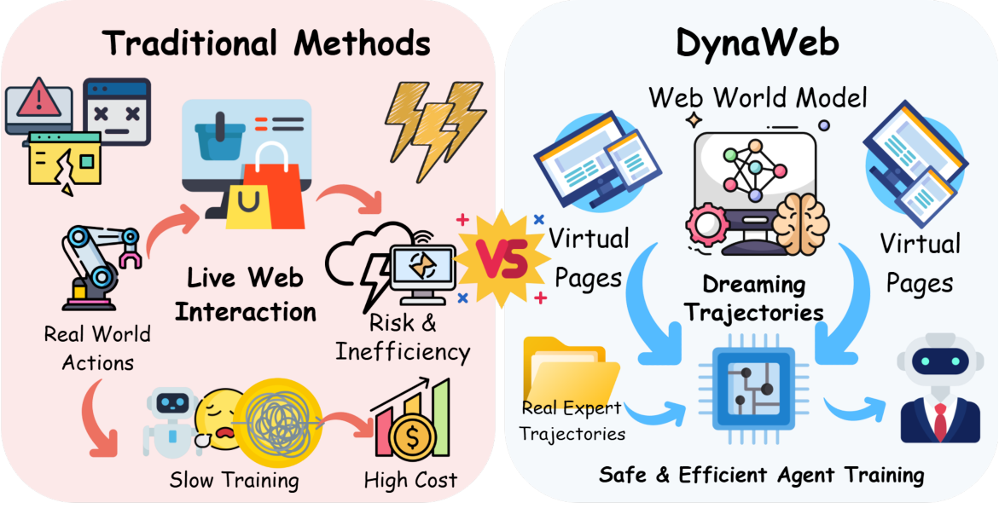
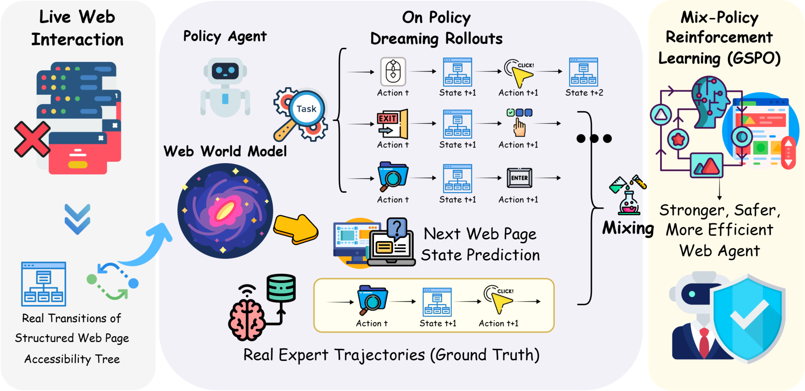

# DynaWeb: Model-Based Reinforcement Learning of Web Agents - Analysis

## 1. Overview

이 논문은 웹 에이전트 훈련에서 실시간 웹 환경과의 상호작용이 갖는 근본적 한계를 해결한다. LLM 기반 웹 에이전트를 온라인 강화학습(RL)으로 훈련시킬 때, 실제 웹사이트와 상호작용하는 과정에서 의도치 않은 구매, 계정 변경 등 되돌릴 수 없는 행동이 발생할 수 있으며, 비용과 확장성 측면에서도 심각한 제약이 존재한다. 기존에 웹 월드 모델을 활용한 연구들은 추론 시점의 look-ahead나 오프라인 데이터 합성에 국한되어, 월드 모델을 온라인 RL의 핵심 학습 기제로 활용하지 못했다.

저자들은 고전적 Dyna 아키텍처와 Dreamer 프레임워크에서 영감을 받아 **DynaWeb**을 제안한다. DynaWeb은 LLM 기반 웹 월드 모델을 학습하여 에이전트 행동에 따른 웹 페이지 상태 변화(accessibility tree)를 예측하고, 이를 합성 웹 환경으로 활용한다. 에이전트는 이 월드 모델과 상호작용하며 "꿈(dream)" 속에서 다수의 롤아웃 궤적을 생성하고, 이를 실제 전문가 궤적과 무작위로 혼합하여 GSPO(Group Sequence Policy Optimization)로 정책을 최적화한다. 핵심 설계 결정으로, 월드 모델은 전체 다음 상태를 직접 예측하는 대신 상태 변화(state changes)를 먼저 추론한 뒤 이를 적용하는 두 단계 방식을 채택했다.

WebArena(시뮬레이션 환경)와 WebVoyager(실제 라이브 웹) 벤치마크에서 실험한 결과, DynaWeb은 NNetNav SFT 기준 대비 WebArena에서 성공률 15.8% → 31.0%(+96% 상대 개선), WebVoyager에서 28.9% → 38.7%(+34% 상대 개선)를 달성했다. 이는 오프라인 RL(WebRL 26.7%), 추론 시점 룩어헤드(ITL 22.4%)를 포함한 모든 기존 방법을 능가하는 결과다. 특히 다양한 웹사이트 유형에 걸쳐 일관된 성능 향상을 보여, 특정 도메인에 국한되지 않는 범용적 개선임을 입증했다.

이 연구는 웹 에이전트 훈련에서 모델 기반 RL의 실질적 가능성을 최초로 입증했다는 점에서 학술적으로 의미가 크다. "상상(imagination)을 통한 훈련"이라는 패러다임은 실제 환경 상호작용 비용을 대폭 줄이면서도 온라인 RL의 이점을 유지할 수 있는 확장 가능한 경로를 제시한다. 더불어, 드림 길이, 실제 데이터 비율, 월드 모델 학습 필요성 등 MBRL 설계 원칙에 대한 체계적 분석은 후속 연구의 중요한 참고 자료가 된다.

---

## 2. Core Section

### TL;DR

> 웹 월드 모델을 학습하여 에이전트가 실제 웹 상호작용 없이 "상상 속(dreamed rollouts)"에서 온라인 강화학습할 수 있는 **DynaWeb** 프레임워크를 제안. 상상 궤적과 실제 전문가 궤적을 혼합하여 GSPO로 최적화한 결과, WebArena에서 31.0%, WebVoyager에서 38.7% 성공률을 달성하며 기존 SFT/RL/ITL 방법 모두를 능가.

-> 상세: [tldr.md](2601.22149-details/tldr.md)

### Core Contributions

1. **Web World Model**: accessibility tree 기반의 웹 상태 전이를 예측하는 LLM 월드 모델 학습 -> 실제 웹 없이 현실적인 상태 시뮬레이션 가능
2. **Imagination-driven Online RL**: 월드 모델이 생성한 상상 궤적을 온라인 RL의 1등급(first-class) 학습 데이터로 활용 -> 기존의 추론 시점/오프라인 활용과 근본적으로 차별화
3. **DynaWeb Framework**: 상상 롤아웃 + 실제 전문가 궤적 혼합 + GSPO 최적화를 결합한 MBRL 프레임워크 -> 안전하고 효율적인 웹 에이전트 학습
4. **Empirical Design Principles**: 드림 길이, 데이터 혼합 비율, 월드 모델 학습 효과에 대한 체계적 실험 분석 -> MBRL 설계의 실증적 가이드라인 제공

-> 상세: [contributions.md](2601.22149-details/contributions.md)

### Key vs Non-Key Sections

| Priority | Sections | Reason |
|----------|----------|--------|
| ⭐⭐⭐ Must Read | 3. Method (3.2 Web World Model, 3.3 DynaWeb) | 핵심 기여인 월드 모델 설계와 MBRL 프레임워크의 기술적 세부사항 |
| ⭐⭐⭐ Must Read | 4.2 Main Results (Tables 1-2) | 두 벤치마크에서의 성능 비교, 핵심 주장의 실증적 근거 |
| ⭐⭐ Important | 5. Analysis (5.1-5.3) | 드림 길이/데이터 비율/WM 학습 효과 등 설계 원칙의 ablation |
| ⭐ Reference | 4.1 Setups | 재현 시 필요한 세부 설정 정보 |
| ⭐ Reference | Appendix A | 시스템 프롬프트, 하이퍼파라미터 상세 |
| Skip | 2. Related Work | MBRL/웹에이전트 분야에 익숙한 독자에게는 중복 내용 |

-> 상세: [key-sections.md](2601.22149-details/key-sections.md)

---

## 3. Paper Type

**Type**: Method

| Aspect | Value |
|--------|-------|
| **Problem** | 온라인 RL 기반 웹 에이전트 훈련의 비용/위험/비효율성 |
| **Approach** | LLM 기반 웹 월드 모델 + 상상 궤적 기반 온라인 MBRL |
| **Key Technique** | State change prediction + GSPO + Expert trajectory interleaving |
| **Main Result** | WebArena 31.0%, WebVoyager 38.7% (SOTA) |

-> 상세 방법론: [methodology.md](2601.22149-details/methodology.md)

---

## 4. Visual Analysis

### Key Figures

#### Figure 1: Traditional vs DynaWeb Comparison

**What it shows**: 전통적 웹 에이전트 훈련(좌)과 DynaWeb 접근(우)의 대비

**구성 요소**:
- **좌측 (Traditional)**: 에이전트가 실제 웹과 직접 상호작용 -> 비용, 위험, 비효율
- **우측 (DynaWeb)**: 학습된 월드 모델이 웹 서버 역할 -> 안전한 상상 궤적 생성
- **"Dream" 영역**: 에이전트가 월드 모델과 상호작용하며 가상 경험 축적

**핵심 통찰**:
- DynaWeb의 핵심 가치 제안을 한 눈에 보여주는 그림: 실제 웹 → 학습된 시뮬레이터로의 전환
- 실제 전문가 데이터가 보조적으로 혼합되는 구조도 암시

#### Figure 2: DynaWeb System Overview

**What it shows**: DynaWeb의 전체 파이프라인과 데이터 흐름

**구성 요소**:
- **Web World Model**: 현재 상태 + 행동 -> 상태 변화 예측 -> 다음 상태 생성
- **Agent Policy ($\pi_\theta$)**: 관찰 + 쿼리 기반 행동 생성
- **GSPO Optimizer**: 상상 궤적 + 실제 궤적 혼합으로 정책 최적화
- **데이터 흐름**: 드림 롤아웃(imagined)과 실제 전문가 궤적이 랜덤 인터리빙

**핵심 통찰**:
- 월드 모델과 에이전트가 반복적으로 상호작용하며 다단계 궤적을 생성하는 루프 구조
- 실제 전문가 데이터가 별도 경로로 투입되어 안정성 확보
- GSPO가 sequence-level ratio를 사용하여 긴 궤적의 credit assignment 문제 해결

---

### Math Formulations

#### Equation 3: World Model State Prediction

$$\hat{o}_{t+1} \sim p_\phi(\cdot \mid o_t, a_t, I)$$

**직관적 설명**: "현재 웹 페이지 상태($o_t$)와 에이전트 행동($a_t$)이 주어지면, 월드 모델이 다음 웹 페이지 상태를 예측한다."

**예시**:
- $o_t$: 구글 검색 결과 페이지의 accessibility tree
- $a_t$: `click [결과 링크 7번]`
- $\hat{o}_{t+1}$: 해당 웹사이트의 랜딩 페이지 accessibility tree

**설계 선택 이유**: 잠재 공간(latent space)이 아닌 관찰 공간에서 직접 예측 -> 에이전트 정책이 추가 디코딩 없이 바로 소비 가능

#### Equation 4: World Model Training Loss

$$\mathcal{L}_\phi = \sum_{(I, o_t, a_t, r, \Delta)} -\log p_\phi(r, \Delta \mid I, o_t, a_t)$$

**직관적 설명**: "월드 모델을 실제 웹 상호작용 데이터로 학습시키되, 전체 다음 상태 대신 추론 과정($r$)과 상태 변화($\Delta$)를 예측하도록 훈련한다."

**설계 선택 이유**: 웹 페이지 전이에서 대부분의 요소는 변하지 않으므로, 전체 상태 예측은 정보 이득이 낮음. 변화(delta)만 예측함으로써 학습 효율성 극대화.

#### Equation 8-10: GSPO Objective

$$\mathcal{J}_{\text{GSPO}}(\theta) = \mathbb{E}\left[\frac{1}{G}\sum_{i=1}^{G}\min\left(s^i(\theta)\hat{A}^i, \text{clip}(s^i(\theta), 1-\varepsilon, 1+\varepsilon)\hat{A}^i\right)\right]$$

**직관적 설명**: "PPO 스타일의 클리핑 목적 함수를 시퀀스 단위(궤적 단위)로 확장. 각 궤적에 하나의 importance ratio를 부여하여 긴 웹 상호작용 궤적에서도 안정적인 policy gradient 제공."

**Token-level vs Sequence-level ratio의 핵심 차이**: 기존 PPO는 토큰별 ratio 사용 -> 길이 T인 궤적에서 T개의 ratio 관리 필요. GSPO는 기하 평균으로 하나의 sequence ratio로 압축 -> 긴 궤적에서의 gradient 발산 문제 완화.

---

### Algorithm Walkthrough

#### DynaWeb Training Loop

**목표**: 웹 월드 모델과 실제 전문가 데이터를 혼합하여 에이전트 정책 최적화

**예시 실행** (WebArena 쇼핑 태스크):

| Step | Action | State/Result |
|------|--------|--------------|
| 1 | 태스크 쿼리 $q$ + 초기 관찰 $o_1$ 샘플링 | "가장 싼 빨간 티셔츠를 찾아라" + 쇼핑 홈페이지 |
| 2 | 에이전트가 $\pi_\theta$로 행동 생성 | `type [검색창] [red t-shirt]` |
| 3 | 월드 모델이 $\hat{o}_2$ 예측 | 검색 결과 페이지 accessibility tree 생성 |
| 4 | 에이전트가 다음 행동 생성 | `click [가격순 정렬]` |
| 5 | 반복 (최대 5 step dream length) | ... → `stop [$12.99 red t-shirt]` |
| 6 | 자기 평가로 보상 $\hat{r} \in \{0,1\}$ | $\hat{r} = 1$ (태스크 완료 판정) |
| 7 | 50% 확률로 실제 전문가 궤적으로 교체 | NNetNav SFT 데이터의 성공 궤적 |
| 8 | GSPO로 $\pi_\theta$ 업데이트 | sequence-level advantage로 gradient 계산 |

---

### Tables Interpretation

#### Table 1: WebArena Results

**주요 발견**:
1. **DynaWeb 31.0% vs WebRL 26.7%**: 16.1% 상대 개선으로 MBRL의 온라인 RL 대비 우위 입증
2. **도메인별 일관성**: Reddit(43.8%), Gitlab(28.7%), Shopping(33.2%) 등 4/5 도메인에서 1위 -> 특정 사이트에 과적합되지 않음
3. **Map 도메인 약점**: GPT-4o(20.0%)와 Qwen2.5-32B(19.2%)가 DynaWeb(17.8%)보다 높음 -> 지도 인터페이스의 비표준적 상호작용이 월드 모델에 더 어려운 과제

**트레이드오프**: DynaWeb은 월드 모델 학습이라는 추가 비용이 발생하지만, 온라인 RL의 실제 환경 상호작용 비용을 대폭 절감. 8B 모델로 GPT-4o(14.3%)를 2배 이상 능가.

#### Table 2: WebVoyager Results (Live Web)

**주요 발견**:
1. **실제 라이브 웹에서도 유효**: 38.7% 전체 성공률로 WebRL(32.6%) 대비 18.7% 상대 개선
2. **Amazon 43.8%**: 가장 큰 단일 사이트 개선폭, e-commerce 도메인에서의 강점
3. **GitHub 약점 (11.2%)**: NNetNav(14.1%), WebRL(18.4%) 대비 저조 -> 복잡한 코드 리뷰/이슈 탐색 등 장기 계획이 필요한 태스크에서 월드 모델의 한계

**실무적 의미**: 시뮬레이션(WebArena)과 실제 웹(WebVoyager) 모두에서 일관된 개선은 DynaWeb의 범용성을 강하게 지지. 다만, 복잡한 브랜칭 구조(GitHub, ArXiv)에서의 약점은 월드 모델의 장기 시뮬레이션 정확도 개선이 필요함을 시사.

---

## 5. Critique & Related Works

### Expert Critique

#### Strengths

1. **패러다임 전환적 접근**: 웹 월드 모델을 추론 시점 보조 도구가 아닌 온라인 RL의 핵심 학습 기제로 격상시킨 최초의 연구. Dyna/Dreamer의 고전적 아이디어를 LLM 웹 에이전트에 성공적으로 적용했다는 점에서 개념적 기여가 크다.
2. **실증적 설계 원칙**: 드림 길이(4-5 step 최적), 실제 데이터 비율(~40% 최적), 월드 모델 학습 필수성 등 3가지 핵심 설계 변수에 대한 체계적 ablation을 통해, 후속 연구자들이 참고할 수 있는 명확한 가이드라인 제시.
3. **두 벤치마크에서의 일관된 SOTA**: 시뮬레이션(WebArena)과 라이브 웹(WebVoyager) 양쪽에서 모든 베이스라인을 능가. 특히 다양한 웹사이트 유형에 걸친 일관된 개선은 방법론의 범용성을 강하게 뒷받침.
4. **실용적 프레임워크 설계**: 실제 전문가 궤적과의 인터리빙 전략은 단순하지만 효과적이며, 기존 SFT 데이터를 재활용할 수 있어 추가 데이터 수집 부담이 적다.

#### Limitations

1. **월드 모델의 폐쇄성**: GPT-oss-120b를 기반으로 한 월드 모델의 구체적 아키텍처와 학습 데이터가 완전히 공개되지 않았으며, 재현에 상당한 컴퓨팅 리소스(8xH100) 필요. 학계의 다수 연구자가 접근하기 어려운 규모.
2. **드림 길이 제한 (5 step)**: 월드 모델의 환각 누적으로 인해 5 step 이상의 장기 상상이 불가능. WebArena 태스크의 평균 길이가 10+ step임을 고려하면, 드림이 태스크의 일부만 커버하는 구조적 한계.
3. **보상 신호의 신뢰성**: 상상 궤적의 보상을 자기 평가(self-assessment)에 의존하는데, 이 보상의 정확도와 편향에 대한 분석이 부족. 잘못된 보상이 정책에 미치는 영향이 불분명.
4. **GitHub/ArXiv 도메인 약점**: 복잡한 브랜칭 구조와 긴 탐색 경로가 필요한 도메인에서 오히려 성능 저하. 월드 모델의 시뮬레이션 충실도(fidelity)가 도메인에 따라 편차가 크다는 한계.

#### Reproducibility

- [ ] Code available (프로젝트 페이지 "Coming Soon")
- [x] Data available (NNetNav 데이터셋 공개)
- [x] Clear hyperparameters (Table 3에 상세 기술)

#### 2026 Perspective

- **Still Valid**: MBRL을 통한 웹 에이전트 학습이라는 방향성은 2026년에도 유효. 특히 안전성(safety) 요구가 높아지는 상황에서 실제 환경 상호작용 최소화는 점점 더 중요해질 것.
- **Outdated**: 8B 모델 백본은 2026년 기준으로 소형. 최신 32B-72B 모델에서의 성능과 상호작용 패턴이 다를 수 있음.
- **Missing**: 2025년 후반~2026년 초에 등장한 vision-language 웹 에이전트(스크린샷 기반)와의 비교 부재. Claude Computer Use, GPT-4V 기반 접근 등 멀티모달 에이전트와의 통합 가능성 미탐구.

### Related Works

1. **WebDreamer** (Gu et al., 2024) - DynaWeb의 직접적 선행 연구. LLM을 추론 시점 월드 모델로 사용했으나 온라인 RL에는 미활용. DynaWeb이 어떻게 이를 확장했는지 비교 필수 - [arXiv:2411.06559](https://arxiv.org/abs/2411.06559)

2. **WebAgent-R1** (Wei et al., 2025) - 실제 환경 기반 온라인 RL의 대표 연구. DynaWeb과 직접 비교 대상이며, MBRL vs model-free RL의 트레이드오프 이해에 필수 - [arXiv:2505.16421](https://arxiv.org/abs/2505.16421)

3. **WebRL** (Qi et al., 2025) - 자기 진화적 커리큘럼 RL. DynaWeb의 주요 비교 베이스라인이며, 오프라인 RL 접근의 장단점 이해에 유용 - [arXiv:2411.02337](https://arxiv.org/abs/2411.02337)

4. **WebEvolver** (Fang et al., 2025) - 월드 모델과 에이전트의 공진화(co-evolution). DynaWeb과 유사한 방향이지만 오프라인 접근. 두 방법의 비교 분석이 가치 있음 - [arXiv:2504.21024](https://arxiv.org/abs/2504.21024)

5. **Dyna Architecture** (Sutton, 1991) - DynaWeb의 이론적 기반. MBRL의 원조적 프레임워크로, DynaWeb이 30년 된 아이디어를 LLM 시대에 어떻게 재해석했는지 맥락 이해에 필수

---

## Navigation

- **Source**: [원본 논문](./2601.22149.md)
- **Details**:
  - [TL;DR 상세](./2601.22149-details/tldr.md)
  - [Contributions 상세](./2601.22149-details/contributions.md)
  - [Key Sections 상세](./2601.22149-details/key-sections.md)
  - [Methodology 상세](./2601.22149-details/methodology.md)
