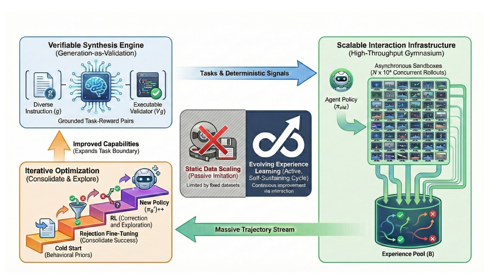
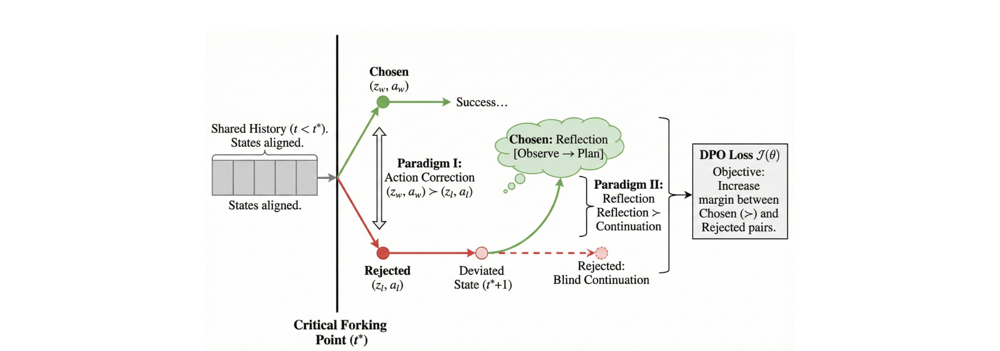

```yaml
---
title: "EvoCUA: Evolving Computer Use Agents via Learning from Scalable Synthetic Experience - Analysis"
arxiv_id: "2601.15876"
type: "analysis"
paper_type: "method"
analyzed_date: "2026-02-06"
source: "./2601.15876.md"
details: "./2601.15876-details/"
---
```

# EvoCUA: Evolving Computer Use Agents via Learning from Scalable Synthetic Experience - Analysis

## 1. Overview

이 논문은 컴퓨터 사용 에이전트(Computer Use Agent, CUA)의 학습 패러다임이 직면한 핵심 병목 — **정적 데이터 스케일링의 한계** — 를 해결하는 새로운 방법론을 제안한다. 기존의 GUI 에이전트들은 사람이 수집한 정적 궤적(static trajectory)을 모방 학습하는 방식에 의존해왔으나, 이는 장기 수평(long-horizon) 컴퓨터 작업에 내재된 인과적 역학(causal dynamics)을 포착하기 어렵다는 근본적 한계를 지닌다. 이 문제는 UI-TARS-2나 OpenCUA 같은 최신 모델들에서도 여전히 성능 정체의 원인으로 작용하고 있다.

저자들이 제안하는 **EvoCUA**는 "정적 모방"에서 "경험으로부터의 진화적 학습"으로의 패러다임 전환을 구현한다. 이 시스템은 세 가지 핵심 축으로 구성된다: (1) **검증 가능한 합성 엔진(Verifiable Synthesis Engine)**이 자동으로 다양한 작업과 실행 가능한 검증기를 생성하고, (2) **확장 가능한 상호작용 인프라(Scalable Interaction Infrastructure)**가 QEMU-KVM 기반의 수만 개 비동기 샌드박스를 조율하며, (3) **경험 기반 진화적 학습(Evolving Paradigm via Learning from Experience)**이 Rejection Sampling Fine-Tuning(RFT)과 Step-Level DPO를 결합하여 성공/실패 궤적 모두에서 학습한다. 이 세 모듈이 자기 유지적(self-sustaining) 진화 사이클을 형성하여, 합성 컴퓨팅 자원을 고품질 에이전트 능력으로 변환한다.

OSWorld 벤치마크에서의 실험 결과, EvoCUA-32B는 **56.7%**의 성공률을 달성하여 오픈소스 모델 중 최고 성능을 기록했다. 이는 이전 오픈소스 SOTA인 OpenCUA-72B(45.0%)를 +11.7% 초과하고, 클로즈드 소스 모델인 UI-TARS-2(53.1%)도 +3.6% 상회하는 결과다. 특히 주목할 점은 EvoCUA-32B가 50 스텝 제약 하에서 이 성능을 달성한 반면, 대부분의 베이스라인은 100 스텝을 사용했다는 것이다. 또한 8B 모델인 EvoCUA-8B도 46.1%를 달성하여 72B 파라미터의 OpenCUA-72B를 능가했다.

이 연구는 CUA 분야에서 "데이터 스케일링"에서 "경험 스케일링"으로의 패러다임 전환이 실질적으로 작동함을 실증한 최초의 사례로서 의의가 크다. 코드와 모델 가중치를 공개하여 후속 연구의 재현성을 보장했으며, 온라인 강화학습(STEPO 알고리즘)에 대한 예비 결과도 제시하여 향후 발전 방향을 명확히 했다. 다만, 일반 멀티모달 벤치마크에서의 성능 하락과 단일 벤치마크(OSWorld) 중심의 평가는 개선이 필요한 부분이다.

---

## 2. Core Section

### TL;DR

> 정적 모방 학습의 한계를 극복하기 위해, 검증 가능한 합성 데이터 생성 + 대규모 샌드박스 인프라 + 진화적 강화학습(RFT+Step-Level DPO)을 통합한 자기 진화 사이클로 CUA를 학습시켜, OSWorld에서 56.7% 오픈소스 SOTA를 달성한 연구.

→ 상세: [tldr.md](./2601.15876-details/tldr.md)

### Core Contributions

1. **Verifiable Synthesis Engine**: 계층적 도메인 분류 + 이중 스트림 합성 + 삼중 오염 제거로 수만 개의 검증 가능한 학습 작업을 자율 생성 → 수작업 데이터 수집 병목 해소
2. **Scalable Interaction Infrastructure**: QEMU-KVM 하이브리드 가상화 기반, 10만+ 동시 샌드박스 지원, 분당 수십만 건의 요청 처리 → 대규모 on-policy 경험 수집 가능
3. **Evolving Paradigm via Learning from Experience**: Cold Start → RFT(성공 궤적 강화) → Step-Level DPO(실패 궤적에서 Critical Forking Point 기반 학습) → 반복적 진화 사이클 → 모델 크기와 무관하게 일관된 성능 향상

→ 상세: [contributions.md](./2601.15876-details/contributions.md)

### Key vs Non-Key Sections

| Priority | Sections | Reason |
|----------|----------|--------|
| ⭐⭐⭐ Must Read | §5 Evolving Paradigm (Cold Start, RFT, RL), §6.2 Main Results | 핵심 학습 방법론과 SOTA 성능의 근거 |
| ⭐⭐⭐ Must Read | §3 Verifiable Synthesis Engine | 데이터 생성 파이프라인의 핵심 설계 |
| ⭐⭐ Important | §6.3-6.5 Ablation & Discussions | 각 컴포넌트의 기여도 분리 및 실전 인사이트 |
| ⭐⭐ Important | §7 Future Work (STEPO) | Step-Level Policy Optimization 알고리즘 제안 |
| ⭐ Reference | §4 Scalable Infrastructure | 시스템 엔지니어링 관점에서 참조 |
| ⭐ Reference | §2 Preliminaries, Appendix A-D | POMDP 정형화 및 알고리즘 상세 |
| Skip | §8 Related Work | 해당 분야에 이미 익숙하다면 |

→ 상세: [key-sections.md](./2601.15876-details/key-sections.md)

---

## 3. Paper Type

**Type**: Method

| Aspect | Value |
|--------|-------|
| **Problem** | 정적 데이터 모방 학습의 한계로 CUA 성능 정체 |
| **Approach** | 검증 가능한 합성 + 대규모 상호작용 + 진화적 학습의 통합 사이클 |
| **Key Technique** | POMDP 기반 CUA 정형화, RFT, Step-Level DPO, STEPO |
| **Main Result** | OSWorld 56.7% (오픈소스 SOTA, 이전 대비 +11.7%) |

→ 상세 방법론: [methodology.md](./2601.15876-details/methodology.md)

---

## 4. Visual Analysis

### Key Figures

#### Figure 2: EvoCUA Overview



**구성 요소**:
- **중앙 원형**: 정적 모방 → 능동적 진화 경험 학습으로의 패러다임 전환
- **좌상단**: Verifiable Synthesis Engine — 구조화된 작업 공간 + 이중 스트림 합성 + 품질 보증
- **우측**: Scalable Interaction Infrastructure — 비동기 게이트웨이 + 분산 스케줄러 + 샌드박스 클러스터
- **좌하단**: Iterative Optimization — Cold Start → RFT → RL(DPO)의 진화 사이클

**핵심 통찰**:
- 세 모듈이 독립적이지만 유기적으로 연결되어 자기 유지적 사이클을 형성
- 합성 엔진이 작업을 생성하고, 인프라가 경험을 수집하며, 최적화가 정책을 갱신하는 순환 구조

**Source**: [Figure 2](./2601.15876.md#figure-2)

---

#### Figure 5: Dual-Paradigm DPO



**구성 요소**:
- **Critical Forking Point** ($t^*$): 성공 궤적과 실패 궤적이 분기하는 지점
- **Paradigm I (Action Correction)**: $t^*$ 시점에서 잘못된 행동 $(z_l, a_l)$을 올바른 행동 $(z_w, a_w)$로 대체
- **Paradigm II (Reflection)**: $t^*+1$ 시점에서 맹목적 계속 진행 대신 반성적 추론 생성

**핵심 통찰**:
- 궤적 수준이 아닌 스텝 수준에서 선호도 쌍을 구성하여 장기 수평 작업의 상태 비정렬 문제 해결
- "무엇이 잘못되었는지" 학습(Action Correction)과 "잘못 후 어떻게 복구하는지" 학습(Reflection)을 동시에 수행

**Source**: [Figure 5](./2601.15876.md#figure-5)

---

### Math Formulations

#### Equation: DPO Loss Function

$$\mathcal{J}(\theta) = -\mathbb{E} \left[ \log \sigma \left( \beta \log \frac{\pi_\theta(z_w, a_w | h_t, o_t)}{\pi_{\text{ref}}(z_w, a_w | h_t, o_t)} - \beta \log \frac{\pi_\theta(z_l, a_l | h_t, o_t)}{\pi_{\text{ref}}(z_l, a_l | h_t, o_t)} \right) \right]$$

**직관적 설명**: 동일한 관찰 상태에서 올바른 (추론, 행동) 쌍의 확률은 높이고, 잘못된 쌍의 확률은 낮추는 방향으로 학습한다. $\beta$는 참조 정책으로부터의 이탈 정도를 제어하는 온도 파라미터이다.

**핵심**: 궤적 전체가 아닌 Critical Forking Point에서의 개별 스텝에 적용되므로, 장기 수평 GUI 작업에서 상태 비정렬 문제를 회피한다.

**Source**: [Equation 2](./2601.15876.md#optimization-objective)

---

#### Equation: STEPO Objective

$$\mathcal{J}_{\text{STEPO}}(\theta) = \frac{1}{G} \sum_{i=1}^{G} \sum_{t=1}^{T_i} \frac{1}{K_t} \sum_{k=1}^{K_t} \min[r_{i,t,k} \hat{A}_{i,t},\ \text{clip}(r_{i,t,k}, 1-\epsilon, 1+\epsilon) \hat{A}_{i,t}] - \beta \mathbb{D}_{KL}$$

**직관적 설명**: GRPO의 궤적 수준 학습 대신, 각 궤적을 스텝별로 분해하여 학습한다. 궤적의 advantage를 각 스텝에 균등 배분($\hat{A}_{i,t} = \hat{A}_i / T_i$)함으로써, 높은 advantage 궤적은 더 적은 스텝으로 작업을 완료하도록, 낮은 advantage 궤적은 더 많이 탐색하도록 유도한다.

**Source**: [Equation 5](./2601.15876.md#step-level-policy-optimization)

---

### Algorithm Walkthrough

#### Algorithm 2: Step-Level DPO Pair Construction

**목표**: 실패 궤적에서 핵심 오류 지점을 찾아 교정/반성 선호도 쌍을 구성

**예시 실행** (엑셀에서 잘못된 셀 클릭 시나리오):

| Step | Action | State |
|------|--------|-------|
| 1 | 실패 궤적과 성공 참조 궤적에서 오류 스텝 $t^*$ 식별 | "C5 셀 대신 C6 셀 클릭" 발견 |
| 2 | 창 기반 참조 정렬로 올바른 행동 추출 | 성공 궤적의 "C5 클릭" 매칭 |
| 3 | **Paradigm I** 구성: chosen=(올바른 추론 + C5 클릭), rejected=(잘못된 추론 + C6 클릭) | Action Correction 쌍 |
| 4 | **Paradigm II** 구성: chosen=(반성 추론 + 교정 계획), rejected=(맹목적 다음 행동) | Reflection 쌍 |

**Source**: [Algorithm 2](./2601.15876.md#algorithm-2-step-level-dpo-pair-construction)

---

### Tables Interpretation

#### Table 1: OSWorld Main Results

**주요 발견**:
1. **EvoCUA-32B (56.7%)**: 오픈소스 SOTA, 72B 모델인 OpenCUA-72B(45.0%)를 32B로 +11.7% 초과
2. **50 vs 100 스텝**: EvoCUA는 50스텝 제약에서 100스텝 모델들보다 우수 — 실행 정밀도가 높음을 시사
3. **EvoCUA-8B (46.1%)**: 동일 backbone(Qwen3-VL-8B)의 Step-GUI-8B(40.2%)를 +5.9% 상회 — 학습 패러다임의 순수 기여 입증

**트레이드오프**: EvoCUA-32B와 Claude-4.5-Sonnet(50스텝: 58.1%) 간 격차는 1.4%로 좁혀졌으나, 100스텝 기준 Claude는 62.9%로 여전히 상당한 격차

**Source**: [Table 1](./2601.15876.md#table-1)

#### Table 3: Ablation Study (EvoCUA-32B)

**주요 발견**:
1. **각 단계가 단조 증가**: Unified Action Space(+4.84%) → Cold Start(+2.62%) → RFT(+3.13%) → DPO(+3.21%) → Iterative(+1.90%)
2. **DPO > RFT**: 실패에서 배우는 것(+3.21%)이 성공 강화(+3.13%)만큼이나 중요
3. **Iterative Training(+1.90%)**: 추가 반복이 여전히 유의미한 이득 — 자기 진화 패러다임의 지속 가능성 확인

**Source**: [Table 3](./2601.15876.md#table-3)

---

## 5. Critique & Related Works

### Expert Critique

#### Strengths
1. **통합 시스템 설계**: 데이터 생성-인프라-학습을 하나의 자기 유지적 사이클로 통합한 것은 이 분야에서 가장 완결성 높은 시스템 중 하나다. 단순 알고리즘 제안이 아닌 end-to-end 솔루션을 제시한다.
2. **강력한 실증 결과**: 32B 모델이 72B 모델을 능가하고, 8B 모델도 72B와 동등한 성능을 보이는 것은 파라미터 효율성과 학습 방법론의 우수성을 명확히 입증한다.
3. **풍부한 엔지니어링 인사이트**: §6.5 Discussions에서 1,000+ 실험, 100만+ GPU시간의 경험에서 도출한 4가지 핵심 관찰(경험의 이중성, 초기화 제약, 반복 최적화 역학, 시각화 기반 진단)은 후속 연구자들에게 매우 실용적인 가이드를 제공한다.
4. **재현성**: 코드(GitHub)와 모델(HuggingFace) 공개, OSWorld 벤치마크 기반의 표준화된 평가.

#### Limitations
1. **단일 벤치마크 의존**: 핵심 평가가 OSWorld에 집중되어 있어, 다른 환경(WebArena, AndroidWorld 등)에서의 일반화 성능이 불확실하다.
2. **일반 능력 저하**: Table 2에서 EvoCUA-32B가 base model(Qwen3-VL-32B-Thinking) 대비 ScreenSpot-Pro(-7.34pp), MMMU(-10pp) 등에서 유의미한 성능 하락을 보인다. thinking 기반 데이터 분포 불일치가 원인이라 설명하지만 근본적 해결책은 부재.
3. **온라인 RL 미완성**: §7에서 STEPO를 제안했으나 "시간 제약으로 충분한 학습과 평가를 수행하지 못했다"고 명시. 현재 결과는 주로 오프라인 학습(RFT+DPO)에 기반.
4. **합성 데이터의 다양성 한계**: 데스크톱 환경(Ubuntu 22.04)의 특정 앱(Excel, Word, Browser 등)에 한정된 합성이며, 모바일이나 웹 기반 다양한 환경으로의 확장성은 미검증.

#### Reproducibility
- [x] Code available (GitHub)
- [x] Data available (HuggingFace model weights)
- [ ] Clear hyperparameters (일부 학습 상세는 미공개)

#### 2026 Perspective
- **Still Valid**: 경험 스케일링 패러다임은 CUA 분야의 핵심 방향으로 자리잡고 있으며, 검증 가능한 보상(verifiable reward) 기반 학습은 DeepSeek-R1 이후 표준이 되고 있다.
- **Outdated**: 평가 시점 기준 Claude-4.5-Sonnet(62.9%), Seed-1.8(61.9%) 등 클로즈드 모델과의 격차가 여전하므로, 온라인 RL 확장이 시급하다.
- **Missing**: 멀티 에이전트 협업, safety/alignment, 크로스 플랫폼(모바일/웹) 일반화에 대한 논의가 부족하다.

### Related Works

1. **OpenCUA** - EvoCUA의 주요 베이스라인이자 backbone 모델, AgentNet 데이터셋 기반 - [arXiv:2508.09123](https://arxiv.org/abs/2508.09123)
2. **UI-TARS-2** - 멀티턴 RL 기반 CUA의 대표적 클로즈드 소스 접근, PPO 활용 비교 대상 - [arXiv:2509.02544](https://arxiv.org/abs/2509.02544)
3. **OSWorld** - 핵심 평가 벤치마크, 실제 컴퓨터 환경에서의 개방형 작업 평가 - [NeurIPS 2024](https://arxiv.org/abs/2404.07972)
4. **DeepSeek-R1** - RLVR 패러다임의 선구자, EvoCUA의 이론적 기반이 되는 검증 가능 보상 학습 - [arXiv:2501.12948](https://arxiv.org/abs/2501.12948)
5. **Step-DPO** - 장문 추론에서의 스텝 수준 선호도 최적화, EvoCUA의 DPO 방법론 기반 - [arXiv:2406.18629](https://arxiv.org/abs/2406.18629)

---

## Navigation

- **Source**: [원본 논문](./2601.15876.md)
- **Details**:
  - [TL;DR 상세](./2601.15876-details/tldr.md)
  - [Contributions 상세](./2601.15876-details/contributions.md)
  - [Key Sections 상세](./2601.15876-details/key-sections.md)
  - [Methodology 상세](./2601.15876-details/methodology.md)
