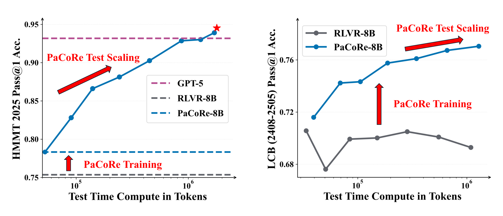
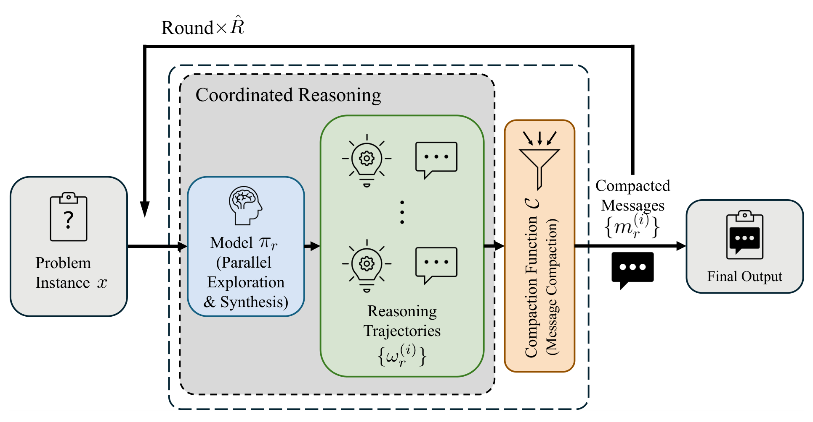
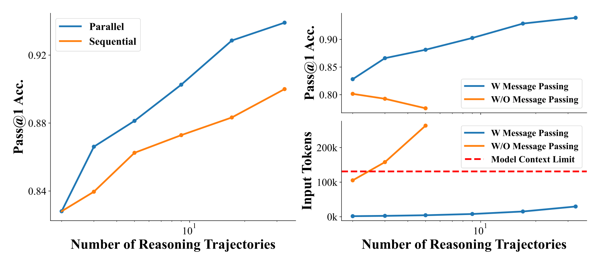
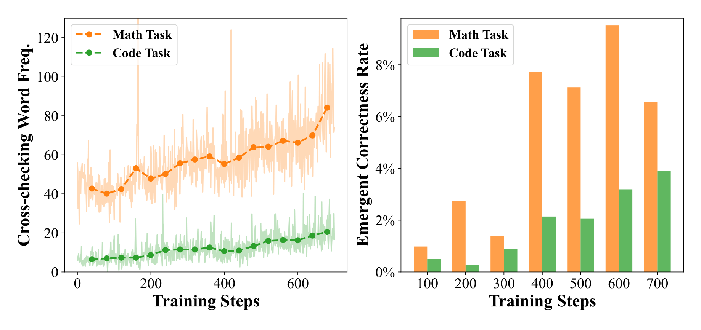

# PaCoRe: Learning to Scale Test-Time Compute with Parallel Coordinated Reasoning - Analysis

## 1. Overview

현대 LLM의 reasoning 능력은 test-time compute(TTC)를 얼마나 효과적으로 사용하느냐에 크게 좌우된다. 그러나 기존의 sequential reasoning(CoT 등)은 모든 중간 상태를 하나의 컨텍스트 윈도우 안에 쌓아야 하므로, 윈도우 크기가 곧 추론량의 물리적 상한이 된다. 이 논문은 이 근본적 한계를 정면으로 다루며, "추론 깊이" 대신 "조율된 추론 폭"으로 패러다임을 전환하는 PaCoRe 프레임워크를 제안한다.

PaCoRe의 핵심 아이디어는 단순하면서도 강력하다. 각 라운드에서 다수의 병렬 추론 궤적을 생성하고, 각 궤적에서 최종 결론만 추출(compaction)하여 다음 라운드의 입력으로 제공한다. 이 과정을 반복하면 총 유효 TTC는 수백만 토큰까지 확장되지만, 각 라운드의 실제 컨텍스트 비용은 일정하게 유지된다. 메시지 압축이라는 단순한 메커니즘이 컨텍스트 윈도우와 추론량 사이의 coupling을 끊는 핵심이다.

중요한 점은 단순히 병렬로 생성하고 투표하는 것(majority voting)이 아니라는 것이다. 저자들은 vanilla reasoning model이 병렬 궤적의 정보를 무시하고 처음부터 혼자 푸는 **Reasoning Solipsism** 현상을 발견했다. 이를 극복하기 위해 대규모 outcome-based RL(PPO)로 모델에 **Reasoning Synthesis** 능력을 훈련시킨다. 특히, 훈련 데이터를 naive aggregation이 실패하는 어려운 문제만 남기는 2-Stage 커리큘럼이 핵심 설계다.

실험 결과는 인상적이다. Qwen3-8B 기반의 PaCoRe-8B가 HMMT 2025에서 94.5%를 달성하여 GPT-5(93.2%)를 능가했으며, 이는 약 200만 토큰의 effective TTC를 131K 윈도우 내에서 조율한 결과다. 다만 GPT-5 대비 ~112배 많은 토큰을 소비하므로, 이는 accuracy-compute trade-off가 명확한 결과이기도 하다. 모델 체크포인트, 훈련 데이터, 추론 파이프라인이 모두 오픈소스로 공개되어 후속 연구의 기반을 제공한다.

---

## 2. Core Section

### TL;DR

> PaCoRe는 병렬 추론 궤적의 결론을 압축 후 다라운드로 종합하는 프레임워크로, RL로 학습된 synthesis 능력을 통해 컨텍스트 윈도우 한계를 넘어 TTC를 수백만 토큰까지 확장하며, 8B 모델이 HMMT 2025에서 GPT-5를 능가(94.5% vs 93.2%)한다.

→ 상세: [tldr.md](./2601.05593-details/tldr.md)

### Core Contributions

1. **PaCoRe 추론 프레임워크**: 병렬 탐색 → 메시지 압축 → 다라운드 조율로 context window와 TTC를 분리 → 고정 윈도우로 무한 TTC scaling 가능
2. **RL 기반 Synthesis 훈련**: outcome-based RL로 "Reasoning Solipsism"을 극복하고 cross-checking, 오류 복구 등 emergent synthesis 행동을 유도 → naive aggregation 대비 질적 도약
3. **8B 모델의 SOTA 수학 성능**: HMMT 2025 94.5%, IMO AnswerBench 78.4%로 GPT-5 능가 → 모델 크기 대신 inference-time scaling의 잠재력 입증
4. **완전 오픈소스**: 모델, 데이터, 파이프라인 공개 → parallel coordinated reasoning 패러다임의 첫 재현 가능한 구현
5. **범용 고밀도 훈련 데이터**: PaCoRe 데이터만으로 일반 RLVR 성능 향상 (AIME +1.8%, LCB +8.0%) → 프레임워크 독립적 가치

→ 상세: [contributions.md](./2601.05593-details/contributions.md)

### Key vs Non-Key Sections

| Priority | Sections | Reason |
|----------|----------|--------|
| ⭐⭐⭐ Must Read | 2.1 Inference Pipeline, 3.3 Analysis & Ablations, Table 1 & 2 | 핵심 메커니즘, 작동 원리 분석, 정량 결과 |
| ⭐⭐ Important | 2.2 Training Procedure, 3.1 Training, 4 Related Work | 훈련 설계, 하이퍼파라미터, 연구 포지셔닝 |
| ⭐ Reference | 3.2 Evaluation, Appendix A & C | 실험 세부사항, 기반 모델, 데이터 파이프라인 |
| Skip | Appendix B & D, Acknowledgements | 단순 템플릿, 소규모 ablation, 감사 인사 |

→ 상세: [key-sections.md](./2601.05593-details/key-sections.md)

---

## 3. Paper Type

**Type**: Method

| Aspect | Value |
|--------|-------|
| **Problem** | LLM의 context window가 test-time compute scaling의 상한 |
| **Approach** | 병렬 추론 + 메시지 압축 + 다라운드 조율 (message-passing architecture) |
| **Key Technique** | Outcome-based RL로 synthesis 능력 훈련; 2-Stage 커리큘럼 |
| **Main Result** | 8B 모델이 HMMT 2025에서 94.5% (GPT-5 93.2% 능가), ~2M 토큰 effective TTC |

→ 상세 방법론: [methodology.md](./2601.05593-details/methodology.md)

---

## 4. Visual Analysis

### Key Figures

#### Figure 1: PaCoRe Performance Scaling

**구성 요소**:
- **Left (HMMT 2025)**: PaCoRe Training(RL 전후)과 PaCoRe Test Scaling(TTC 증가)의 효과를 분리하여 표시. GPT-5 수준(점선)을 넘는 지점을 명확히 보여줌.
- **Right (LiveCodeBench)**: RLVR-8B(RL 훈련 전)는 TTC를 늘려도 성능 정체 → PaCoRe-8B(RL 훈련 후)는 TTC에 비례하여 성능 향상.

**핵심 통찰**:
- 수학에서는 training + scaling 두 축이 모두 필요: training만으로 ~86%, scaling까지 더해 94.5%.
- 코딩에서 RLVR-8B의 flat curve가 **Reasoning Solipsism**의 직접적 증거: 병렬 입력을 무시하고 혼자 풀려 함.

#### Figure 2: Inference Pipeline Architecture

**구성 요소**:
- **Round 1**: 문제 $x$ → $K_1$개 병렬 궤적 → 각 궤적에서 결론 추출 → 메시지 세트 $M_1$
- **Round 2+**: $(x, M_{r-1})$ → 다시 병렬 탐색 → 압축 → 반복
- **Final**: 마지막 라운드에서 단일 궤적으로 최종 답

**핵심 통찰**: 유효 TTC는 모든 궤적 토큰의 합($\sum_r \sum_i |\omega_r^{(i)}|$)이지만, 각 모델 호출의 컨텍스트는 $(x, M_{r-1})$로 제한. 이것이 "context-free scaling"의 메커니즘.

#### Figure 4: Ablation --- Parallel vs Sequential & Message Passing

**핵심 통찰**:
- **Left**: 동일 총 궤적 수에서 Parallel $\vec{K} = [N,]$이 Sequential $\vec{K} = [1,...,1]$보다 우월. 병렬이 더 다양한 탐색을 가능하게 하기 때문.
- **Right**: Message Passing 없이(full trajectory를 넣으면) 컨텍스트 한계에 걸려 성능 하락. 이것이 compaction의 필수성을 입증.

#### Figure 5: Emergent Synthesis Behaviors

**핵심 통찰**:
- **Left**: Cross-checking 표현 빈도가 훈련 중 급증. Code 도메인에서 초기 ~0 → 최종 ~1.2로 변화, 이는 모델이 입력 메시지를 적극적으로 참조하는 행동을 학습했음을 의미.
- **Right**: Emergent Correctness Rate (모든 입력이 틀렸을 때 정답 생성 확률)이 꾸준히 상승. Math ~10% → ~18%, Code ~5% → ~15%. 이는 majority voting을 넘어선 진정한 synthesis의 증거.

---

### Math Formulations

#### Equation 1: Parallel Trajectory Generation

$$\omega_r^{(i)} \sim \pi_r(\cdot \mid P(x, M_{r-1})), \quad i = 1, \ldots, K_r$$

**직관적 설명**: 같은 모델에게 같은 문제+이전 메시지를 주고 $K_r$번 독립적으로 풀게 한다. Temperature > 0이므로 매번 다른 풀이가 나온다.

**예시**: $K_1 = 4$이면, 같은 수학 문제에 대해 4가지 다른 풀이 경로 생성. 어떤 것은 기하학적 접근, 어떤 것은 대수적 접근 등.

#### Equation 2: Message Compaction

$$M_r = \mathcal{C}(\Omega_r)$$

**직관적 설명**: 4개 풀이의 전체 추론 과정(각 수천 토큰)에서 최종 답과 핵심 결론(각 수백 토큰)만 추출. "요약본 모음"을 다음 라운드에 전달.

**예시**: 궤적 1이 "...따라서 답은 42이다"에서 "답은 42"만 추출, 궤적 2가 "...결론적으로 43이다"에서 "답은 43"만 추출 → $M_1 = \{42, 43, 42, 41\}$.

---

### Tables Interpretation

#### Table 1: Main Benchmark Results

**주요 발견**:
1. **Math 도메인 우세**: PaCoRe-8B (high)가 HMMT 94.5%, AIME 93.7%, IMO 78.4%로 GPT-5와 대등 또는 능가. 수학이 PaCoRe의 강점.
2. **Coding/HLE 격차**: LiveCodeBench 78.2% (GPT-5: 83.5%), HLE 16.0% (GPT-5: 26.0%). 코딩과 지식 기반 문제에서는 아직 frontier 모델에 미달.
3. **TTC 비용**: GPT-5가 13-33k 토큰으로 해결하는 것을 PaCoRe는 255k-2,679k 사용. 15-112배 compute overhead.
4. **Scaling 효과 일관성**: Low → Medium → High로 갈수록 모든 벤치마크에서 단조 증가. Compute를 늘리면 확실히 성능이 올라감.

**트레이드오프**: 극한 수학 문제에서는 compute로 accuracy를 "구매"할 수 있지만, 일반 지식/코딩 문제에서는 수확체감이 더 빠름.

#### Table 2: PaCoRe vs Self-Consistency

**주요 발견**:
1. **SC 포화**: Self-Consistency는 @64 → @256에서 거의 변화 없음 (HMMT 85.1 → 84.7, 오히려 하락).
2. **PaCoRe 효율**: PaCoRe medium (869k) > SC @256 (12,376k)를 HMMT에서 92.9% vs 84.7%로 크게 능가. 토큰 사용량은 14배 적음.
3. **Apex 극한**: SC는 @16 이상에서 0.0%, PaCoRe는 2.3% 달성. 극도로 어려운 문제에서 synthesis의 가치가 드러남.

---

## 5. Critique & Related Works

### Expert Critique

#### Strengths

1. **문제 정의의 명확성**: "context window = TTC ceiling"이라는 한계를 정확히 짚고, message compaction이라는 우아한 해결책을 제시. 개념적으로 깔끔하고 직관적인 프레임워크.
2. **Emergent behavior 분석의 깊이**: 단순 성능 보고를 넘어 Reasoning Solipsism, Emergent Correctness Rate, cross-checking 마커 빈도 등 행동 수준의 분석 제공. "왜 작동하는가"에 대한 설득력 있는 증거.
3. **Self-Consistency 대비 효율 우위**: Table 2가 가장 설득력 있는 결과. 14배 적은 토큰으로 8% 이상 높은 정확도는 synthesis가 단순 voting보다 근본적으로 우월함을 입증.
4. **완전한 오픈소스**: 모델, 데이터, 파이프라인 공개는 이 분야 연구의 민주화에 큰 기여. Frontier 모델들의 비공개 parallel TTC 기술에 대한 오픈소스 대안.
5. **재현 가능한 상세 기술**: Appendix A-D가 base model 훈련부터 데이터 큐레이션까지 상세히 기술. 재현성이 높은 논문.

#### Limitations

1. **막대한 추론 비용**: GPT-5 대비 112배 TTC는 실용적 배포에 큰 장벽. HMMT 한 문제에 ~180만 토큰은 약 $0.5-2 (API 가격 기준). 이 비용 분석이 논문에 부재.
2. **비수학 도메인 성능 한계**: HLE 16.0% (GPT-5: 26.0%), MultiChallenge 48.0% (GPT-5: 71.1%). 지식 기반이나 다중 턴 대화에서는 TTC scaling의 수확체감이 빠름. 수학이 이상적인 showcase일 뿐.
3. **Compaction 함수의 단순성**: 결론만 추출하는 현재 방식은 중간 추론의 가치있는 부분적 발견을 버릴 수 있음. 더 정교한 압축(요약 모델, 핵심 논증 추출 등)이 성능을 개선할 가능성.
4. **Latency 문제**: 다라운드 순차 실행이 필요. High 설정($\vec{K} = [32, 4]$)은 2라운드 × 순차 대기. 실시간 응답에는 부적합.
5. **Base model 종속성**: RLVR-8B 준비 과정(10M+ SFT 데이터, 500K RLVR 프롬프트)이 상당한 사전 투자. "PaCoRe만의 기여"와 "강력한 base model의 기여"를 분리하기 어려움.
6. **Caching 전략의 약점**: 1라운드 궤적을 512개 사전 생성 후 샘플링하는 방식은 실제 배포와 다름. 논문은 "동등하다"고 주장하나, 문제 분포 변화에 대한 robustness는 미검증.

#### Reproducibility

- [x] Code available (GitHub)
- [x] Data available (HuggingFace)
- [x] Clear hyperparameters (Section 3.1, Appendix A)
- [ ] Compute budget disclosed (GPU 종류/수량, 총 훈련 시간 미공개)

#### 2026 Perspective

- **Still Valid**: Context window와 TTC를 분리하는 아이디어는 시의적절. Frontier 모델들(Grok 4, Gemini Deep Think)이 유사한 parallel TTC 사용 중인 것으로 추정.
- **Rapidly Evolving**: 동시기 논문들(ParaThinker, Parallel-R1, Native Parallel Reasoner, PDR)과 함께 "parallel reasoning" 분야가 급속히 성장 중. 2026년 상반기에 더 효율적인 변형들이 나올 가능성 높음.
- **Missing**: (1) Multimodal 확장, (2) Agentic task에서의 검증, (3) Compaction function 학습, (4) 비용-성능 Pareto 분석이 후속 연구에서 필요.

### Related Works

1. **AggLM** (Zhao et al., 2025) [[6]](#ref-6) - RL로 aggregation 전략 학습하는 가장 직접적 선행 연구. PaCoRe와 달리 context compaction과 multi-round가 없어 scaling이 제한적.
2. **ParaThinker** (Wen et al., 2025) [[30]](#ref-30) - Native parallel thinking 패러다임 제안. PaCoRe와 유사한 동기이나 message passing 메커니즘이 다름. 비교 분석이 가치있음.
3. **DeepSeek-R1** (DeepSeek-AI, 2025) [[25]](#ref-25) - 대규모 RL로 sequential reasoning 강화. PaCoRe의 RL 훈련 기반이 되는 접근법. Sequential vs Parallel의 상보성 이해에 필수.
4. **Self-Consistency** (Wang et al., 2023) [[26]](#ref-26) - 병렬 생성 + majority voting의 원조. PaCoRe의 직접적 baseline이며 Table 2에서 비교.
5. **Kimi K1.5** (Kimi Team, 2025) [[38]](#ref-38) - Partial rollout 전략, 대규모 RL 훈련의 실제 구현 경험. PaCoRe의 RLVR 파이프라인 설계에 영향.

---

## Navigation

- **Source**: [원본 논문](./2601.05593.md)
- **Details**:
  - [TL;DR 상세](./2601.05593-details/tldr.md)
  - [Contributions 상세](./2601.05593-details/contributions.md)
  - [Key Sections 상세](./2601.05593-details/key-sections.md)
  - [Methodology 상세](./2601.05593-details/methodology.md)
