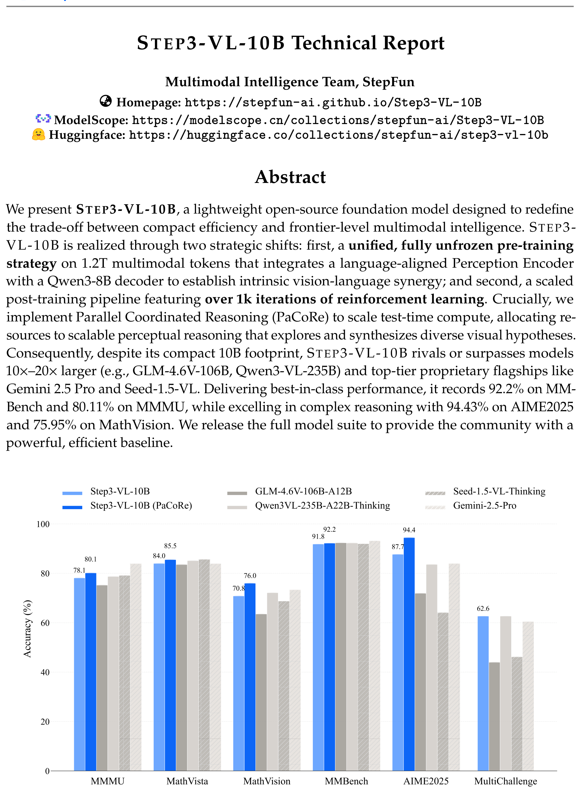
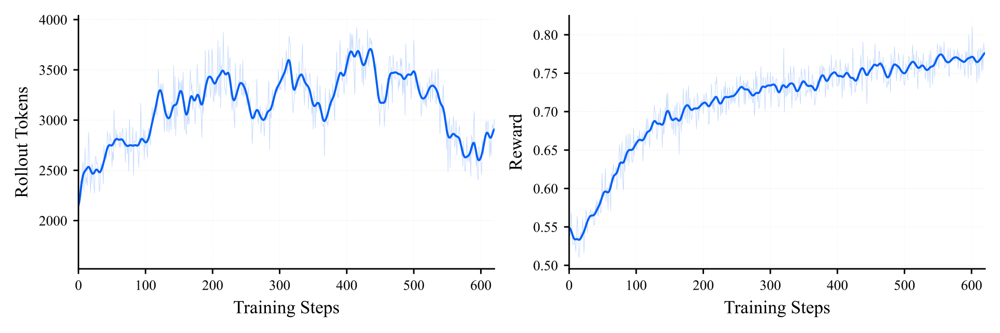
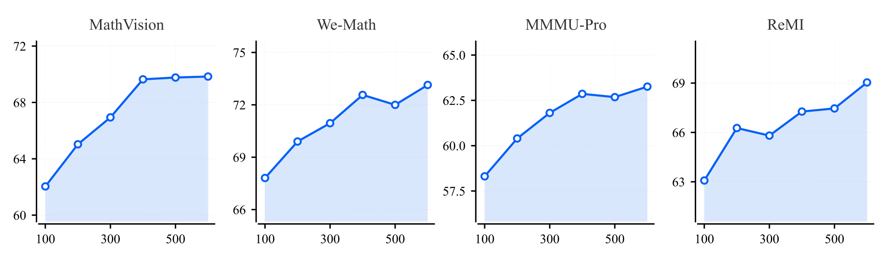

# STEP3-VL-10B Technical Report - Analysis

## 1. Overview

StepFun의 STEP3-VL-10B은 10B 파라미터 규모의 경량 멀티모달 대형 언어 모델(MLLM)로, 기존에 "효율적이지만 제한적"이라 여겨지던 소형 모델의 패러다임을 뒤집는다. 핵심 문제의식은 명확하다: GPT-5.2, Gemini-3-Pro 같은 프로프리어터리 모델이 massive scaling으로 멀티모달 지능의 경계를 넓히고 있지만, 이러한 모델은 실제 배포에 심각한 연산 비용 장벽을 만든다. STEP3-VL-10B은 이 trade-off를 재정의하여 10B 규모에서도 100B+ 모델과 견줄 수 있음을 보여준다.

이 모델의 성공은 두 가지 전략적 설계에 기반한다. 첫째, **통합 사전학습** 전략으로 1.8B Perception Encoder(언어 정렬 버전)와 Qwen3-8B 디코더를 완전히 unfrozen 상태에서 1.2T 멀티모달 토큰으로 학습시켜 비전-언어 시너지를 내재화한다. 둘째, **Scaled RL 파이프라인**으로 2단계 SFT → 600 iterations RLVR → 300 iterations RLHF → 500 iterations PaCoRe 훈련을 통해 추론 능력을 극대화한다. 특히 PaCoRe(Parallel Coordinated Reasoning)는 16개 병렬 추론을 통합하여 테스트 타임 컴퓨트를 확장하는 핵심 혁신이다.

성과는 인상적이다. 7-10B 모델 중 거의 모든 벤치마크에서 1위를 기록하며, PaCoRe 모드에서는 AIME2025 94.43%, MathVision 75.95%, MMMU 80.11%을 달성한다. 이는 GLM-4.6V(106B), Qwen3-VL-Thinking(235B), 심지어 Gemini-2.5-Pro를 다수 벤치마크에서 능가하는 수치다.

학술적으로 이 논문의 가장 흥미로운 기여는 RL 학습 역학 분석(Sec. 5.2)이다. 추론 태스크와 인식 태스크에서 RL이 상반된 길이 역학(reasoning은 길어지고, perception은 짧아짐)을 보인다는 발견, 그리고 "Missing Trace" 가설—인간의 시각적 인지 과정이 학습 데이터에 명시적으로 기술되지 않아 RL로 자발적 지각 추론을 유도하기 어렵다는 통찰—은 멀티모달 RL 연구에 중요한 방향을 제시한다.

---

## 2. Core Section

### TL;DR

> STEP3-VL-10B은 1.8B Perception Encoder + Qwen3-8B를 1.2T 토큰으로 통합 사전학습하고, 1400+ iterations의 RL(RLVR+RLHF)과 PaCoRe(병렬 좌표 추론)로 테스트 타임 컴퓨트를 확장하여, 10B 규모에서 100B+ 모델 및 프로프리어터리 모델과 경쟁하는 멀티모달 성능을 달성한 경량 오픈소스 모델이다.

→ 상세: [tldr.md](./2601.09668-details/tldr.md)

### Core Contributions

1. **통합 Unfrozen 사전학습**: PE-lang + Qwen3-8B를 1.2T 토큰으로 완전 unfrozen 학습 → 비전-언어 시너지 내재화, 기존 frozen encoder 접근 대비 수렴성 개선
2. **대규모 멀티모달 RL 파이프라인**: RLVR(600 iter) + RLHF(300 iter) + PaCoRe(500 iter)의 체계적 3단계 RL → 검증 가능한 보상과 인간 선호 보상의 이원 체계로 추론/정렬 동시 개선
3. **PaCoRe (Parallel Coordinated Reasoning)**: 16개 병렬 추론을 통합하는 테스트 타임 스케일링 → 10B 모델의 인식·추론 성능을 100B+ 수준으로 끌어올림
4. **RL 학습 역학 분석**: 추론 vs 인식 태스크에서의 상반된 길이 역학 발견 + "Missing Trace" 가설 제시 → 멀티모달 RL 연구의 새로운 방향

→ 상세: [contributions.md](./2601.09668-details/contributions.md)

### Key vs Non-Key Sections

| Priority | Sections | Reason |
|----------|----------|--------|
| ⭐⭐⭐ Must Read | 3.2 RL, 5.2 RL Dynamics | 핵심 기술 혁신(RL 파이프라인, PaCoRe, 길이 역학 분석) |
| ⭐⭐⭐ Must Read | 4.4 Comparison with Larger Models | 10B vs 100B+ 성능 비교, PaCoRe 효과 정량화 |
| ⭐⭐ Important | 2.1 Architecture, 2.3 Training Recipe | 아키텍처 선택 근거, 학습 스케줄 |
| ⭐⭐ Important | 5.1 Ablations | PE-lang vs DINOv3, Muon vs AdamW, Deepstack 실험 |
| ⭐ Reference | 2.2 Data Construction | 데이터 구축 세부사항 (재현 시 참고) |
| ⭐ Reference | 6 Conclusion | 미래 로드맵 (E-CoT, 물리적 그라운딩) |
| Skip | 4.1 Evaluation Setup | 벤치마크 목록 나열 (필요 시만) |

→ 상세: [key-sections.md](./2601.09668-details/key-sections.md)

---

## 3. Paper Type

**Type**: Method

| Aspect | Value |
|--------|-------|
| **Problem** | 소형 MLLM(10B)의 추론·인식 성능 한계 |
| **Approach** | 통합 사전학습 + 대규모 RL + 테스트 타임 스케일링 |
| **Key Technique** | PaCoRe (Parallel Coordinated Reasoning) |
| **Main Result** | AIME2025 94.43%, MMMU 80.11%, MathVision 75.95% (10B로 100B+ 수준) |

→ 상세 방법론: [methodology.md](./2601.09668-details/methodology.md)

---

## 4. Visual Analysis

### Key Figures

#### Figure 1: Performance Comparison

**구성 요소**:
- X축: 다양한 벤치마크(MMMU, MathVision, AIME2025 등)
- Y축: 성능 점수
- 비교 모델: GLM-4.6V(106B), Qwen3-VL(235B), Gemini-2.5-Pro, Seed-1.5-VL

**핵심 통찰**:
- STEP3-VL-10B(PaCoRe)가 다수 벤치마크에서 10-20배 큰 모델을 능가
- 특히 수학/추론 벤치마크에서 격차가 가장 큼 (AIME2025: 94.43% vs Gemini 83.96%)

#### Figure 2-3: RL Training Dynamics

**핵심 통찰**:
- 보상은 지속적으로 증가하며 포화되지 않음 (0.8 접근)
- 롤아웃 길이는 초기 증가 후 원래 수준으로 복귀 → **추론(길어짐)과 인식(짧아짐)의 상충 효과**
- 100 iteration마다 평가한 downstream 성능도 보상과 동일한 2단계 성장 패턴

### Math Formulations

#### GAE Advantage Estimator

$$\hat{A}_t = \sum_{l=0}^{T-t-1} (\gamma\lambda)^l \delta_{t+l}$$

**직관적 설명**: 현재 행동이 기대보다 얼마나 좋은지를 미래 보상까지 고려해 추정. $\gamma\lambda$가 미래 보상의 가중치를 조절하여 편향-분산 트레이드오프를 관리한다.

#### PPO Clipped Objective

$$\mathcal{J}_{\text{PPO}}(\theta) = \mathbb{E}_t \left[\min\left(\rho_t(\theta)\hat{A}_t, \text{clip}(\rho_t(\theta), 1-\varepsilon, 1+\varepsilon)\hat{A}_t\right)\right]$$

**직관적 설명**: 정책이 한 번에 너무 많이 변하지 않도록 확률비를 $[1-\varepsilon, 1+\varepsilon]$ 범위로 제한. RL 학습 안정성의 핵심.

### Tables Interpretation

#### Table 1: 7-10B Model Comparison (60+ Benchmarks)

**주요 발견**:
1. STEP3-VL-10B이 거의 모든 카테고리에서 1위 (STEM, Recognition, GUI 등)
2. MathVision에서 2위 대비 +11pp 이상 격차 → RL scaling의 효과
3. GUI Grounding(ScreenSpot-V2 92.61%)에서의 압도적 성능 → 궤적 학습 데이터의 효과

#### Table 3: vs Larger Models + Proprietary

**주요 발견**:
1. SeRe → PaCoRe 전환 시 일관된 성능 향상 (MathVision +5.14%, AIME2025 +6.77%)
2. PaCoRe 모드에서 Gemini-2.5-Pro 능가: AIME2025(94.43 vs 83.96), MathVision(75.95 vs 73.30)
3. 인식 벤치마크에서도 향상: CountQA +4.6%, OCRBench +2.25%

---

## 5. Critique & Related Works

### Expert Critique

#### Strengths
1. **체계적 엔지니어링**: 데이터 구축(1.2T토큰) → 사전학습 → SFT → RLVR → RLHF → PaCoRe까지 전체 파이프라인을 상세히 기술. 재현 가능성 높음
2. **통찰력 있는 분석**: RL 길이 역학의 이중 패턴 발견과 "Missing Trace" 가설은 단순 성능 보고를 넘어 멀티모달 RL의 근본적 한계를 조명
3. **압도적 실험 규모**: 60+ 벤치마크에서 체계적 비교. PaCoRe vs SeRe 비교로 test-time scaling의 효과를 명확히 정량화
4. **Ablation 품질**: PE-lang vs DINOv3, Muon vs AdamW, Deepstack 등 핵심 설계 선택마다 실험적 근거 제시

#### Limitations
1. **PaCoRe 추론 비용**: 16개 병렬 롤아웃 + 131K 토큰 컨텍스트는 실제 배포에서 상당한 추론 비용. 10B의 "경량" 장점이 상쇄될 수 있음
2. **데이터 비공개**: 1.2T 토큰 중 상당 부분이 in-house 데이터(StepCrawl, 내부 교육자료 등). 커뮤니티의 완전한 재현 불가
3. **Cherry-picking 우려**: 60+ 벤치마크 중 PaCoRe 모드 결과를 헤드라인에 사용. 일부 벤치마크(CountQA, SimpleVQA)에서는 여전히 대형 모델 대비 상당한 격차
4. **Perception RL Scaling 미해결**: "Missing Trace" 가설을 제시하지만 해결책은 PaCoRe(우회)에 그침. 근본적 해결은 미래 과제로 남김

#### Reproducibility
- [x] Model weights available (HuggingFace, ModelScope)
- [ ] Training data partially available (오픈소스 일부만)
- [x] Clear hyperparameters (학습률, 배치 크기, iteration 수 등 상세 기술)
- [ ] Training code (미공개)

#### 2026 Perspective
- **Still Valid**: 소형 모델에서의 RL scaling 전략, PE-lang의 언어 정렬 비전 인코더 선택
- **Evolving**: PaCoRe 같은 test-time scaling은 빠르게 발전 중. Self-distillation으로의 전환이 핵심 과제
- **Missing**: 비디오 이해, 실시간 에이전트 태스크, 멀티턴 대화 평가 부재

### Related Works

1. **PaCoRe (Hu et al., 2026)** - STEP3-VL-10B의 핵심 test-time scaling 기법. 이 논문의 근간이므로 반드시 선행 독해 필요
2. **Qwen3-VL (Bai et al., 2025)** - 235B MoE 경쟁 모델. Deepstack 등 이 논문이 시도하고 제외한 기술의 출처
3. **DeepSeek-R1 (Guo et al., 2025b)** - 텍스트 RL scaling의 대표 연구. STEP3-VL-10B이 관찰한 "길이 역학"의 텍스트 대응물
4. **Perception-R1 (Yu et al., 2025b)** - 인식 태스크 RL의 선행 연구. Perception reward 설계의 기반
5. **Open-Reasoner-Zero (Hu et al., 2025)** - PPO+GAE RL 최적화 알고리즘의 기반 프레임워크

---

## Navigation

- **Source**: [원본 논문](./2601.09668.md)
- **Details**:
  - [TL;DR 상세](./2601.09668-details/tldr.md)
  - [Contributions 상세](./2601.09668-details/contributions.md)
  - [Key Sections 상세](./2601.09668-details/key-sections.md)
  - [Methodology 상세](./2601.09668-details/methodology.md)
